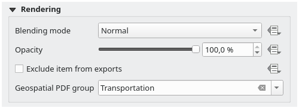

.. index:: Items properties
.. _layout_item_options:

Layout Items Common Options
===========================

.. only:: html

   .. contents::
      :local:

QGIS provides a large set of items to layout a map.
They can be of map, legend, scale bar, picture, table, north arrow, image type...
They however share some common options and behavior that are exposed below.

.. _create_layout_item:

Creating a layout item
----------------------

Items can be created using different tools, either from scratch or based on existing items.

To create a layout item from scratch:

#. Select the corresponding tool either from the :menuselection:`Add Item` menu
   or the :guilabel:`Toolbox` bar.
#. Then:

   * Click on the page and fill the size and placement information requested
     in the :guilabel:`New Item Properties` dialog that pops up
     (for details, see :ref:`position_size`);

     .. _figure_layout_new_item:

     .. figure:: img/new_item_properties.png
        :align: center

        New Item properties dialog

   * Or click-and-drag to define the initial size and placement of the item.
     You can rely on :ref:`grids and guides <grid_guides>` snapping for a better position.

.. note::
  Because they can have particular shapes, drawing node or arrow items does not work
  with one-click nor click-and-drag methods;
  you need to click and place each node of the item.
  See :ref:`layout_node_based_shape_item` for more details.

You can also:

#. Select an existing item with the |select| :sup:`Select/Move item` button 
   from the :guilabel:`Toolbox` toolbar
#. Use the contextual menu or the :menuselection:`Edit` menu tools to copy/cut the item
   and paste it at the mouse position as a new item.

   You can also use the :guilabel:`Paste in Place` (:kbd:`Ctrl+Shift+V`) command
   to duplicate an item from one page to another and place it in the new page
   at the same coordinates as the original.

Moreover, you can create items using a print layout template (for details, see :ref:`layout_manager`)
through the :menuselection:`Layout --> Add Items from Template...` command.

.. tip:: **Add layout items using the file browser**

  From your file browser or using the :guilabel:`Browser` panel,
  drag-and-drop a print layout template (:file:`.qpt` file) onto a print layout dialog
  and QGIS automatically adds all items from that template to the layout.

.. _interact_layout_item:

Interacting with layout items
-----------------------------
Each item inside the print layout can be moved and resized to create a perfect layout.
For both operations the first step is to activate the |select| :sup:`Select/Move item` tool
and click on the item.

You can select multiple items with the |select| :sup:`Select/Move item` button:
click and drag over the items or hold the :kbd:`Shift` button
and click on each of the items you want.
To deselect an item, click on it holding the :kbd:`Shift` button.

Each time there's a selection, count of selected items is displayed on the status bar.
Inside the :menuselection:`Edit` menu, you can find actions to select all the items,
clear all selections, invert the current selection and more...

.. _move_resize:

Moving and resizing items
.........................

Unless :menuselection:`View --> Show Bounding Boxes` option is unchecked,
a selected item will show squares on its boundaries;
moving one of them with the mouse will resize the item in the corresponding direction.
While resizing, holding :kbd:`Shift` will maintain the aspect ratio.
Holding :kbd:`Alt` will resize from the item center.

To move a layout item, select it with the mouse and move while holding the left button.
If you need to constrain the movements to the horizontal or vertical axis,
hold the :kbd:`Shift` button on the keyboard while moving the mouse.
You can also move a selected item using the :kbd:`Arrow keys` on the keyboard;
if the movement is too slow, you can speed it up by holding :kbd:`Shift`.
If you need better precision, use the :guilabel:`Position and size` properties,
or grid/guides snapping as explained above for item's creation.

Resizing or moving several items at once is made the same way as for a single item.
QGIS however provides some advanced tools to automatically resize a selection
of items following different rules:

* each item height matches the |resizeTallest| tallest or the |resizeShortest| shortest selected item;
* each item width matches the |resizeWidest| widest or the |resizeNarrowest| narrowest selected item;
* resizes items to |resizeSquare| squares: each item is enlarged to shape a square.

Likewise, there are :ref:`tools <align_items>` available to organize multiple items position
by distributing equidistantly:

* edges (left, right, top or bottom) of items;
* centers of items horizontally or vertically;
* spacing between items horizontally or vertically.

.. _group_items:

Grouping items
..............

Grouping items allows you to manipulate a set of items like a single one:
you can easily resize, move, delete, copy the items as a whole.

To create a group of items, select more than one and press the |groupItems| :guilabel:`Group` button
on the :menuselection:`Items` menu or the :guilabel:`Actions` toolbar, or from the right-click menu.
A row named ``Group`` is added to the :menuselection:`Items` panel and can be locked or hidden
like any other :ref:`Items panel's object <layout_items_panel>`.
Grouped items are **not individually** selectable on the canvas;
use the Items panel for direct selection and access the item's properties panel.

.. _lock_items:

Locking items
.............

Once you have found the correct position for an item, you can lock it
by using the |locked| :guilabel:`Lock selected items` button in the :menuselection:`Items` menu
or the :guilabel:`Actions` toolbar, or ticking the box next to the item in the :menuselection:`Items` panel.
Locked items are **not** selectable on the canvas.

Locked items can be unlocked by selecting the item in the :menuselection:`Items` panel
and unchecking the tickbox or you can use the icons on the toolbar.

.. index:: Items alignment
.. _align_items:

Alignment and distribution
..........................

Tools for raising or lowering the Z position of items in the layout
are inside the |raiseItems| :sup:`Raise selected items` pull-down menu.
Choose an element on the print layout canvas and select the matching functionality
to raise or lower the selected element over the other elements.
This order is shown in the :menuselection:`Items` panel.
You can also raise or lower objects in the :menuselection:`Items` panel
by clicking and dragging an object's label in this list.

.. _figure_layout_common_align:

.. figure:: img/alignment_lines.png
   :align: center

   Alignment helper lines in the print layout

There are several alignment options available within the |alignLeft| :sup:`Align selected items` pull-down menu
(see :numref:`figure_layout_common_align`).
To use an alignment function, you first select the elements
and then click on one of the alignment icons:

* |alignLeft| :guilabel:`Align Left` or |alignRight| :guilabel:`Align Right`;
* |alignTop| :guilabel:`Align Top` or |alignBottom| :guilabel:`Align Bottom`;
* |alignHCenter| :guilabel:`Align Center` horizontally or |alignVCenter| :guilabel:`Align Center Vertical`.

All selected elements will then be aligned to their common bounding box.
When moving items on the layout canvas, alignment helper lines appear when borders, centers or corners are aligned.

Another way to improve layout items placement is by adjusting the spacing between them, over the layout page.
This can be done by selecting the items and press the |distributeLeft| :guilabel:`Distribute Left Edges` drop-down menu to:

* |distributeLeft| :guilabel:`Distribute Left Edges` or |distributeRight|:guilabel:`Distribute Right Edges` of items equidistantly
* |distributeTop| :guilabel:`Distribute Top edges` or  |distributeBottom| :guilabel:`Distribute Bottom Edges` of items equidistantly
* |distributeHCenter| :guilabel:`Distribute Horizontal Centers` or |distributeVCenter| :guilabel:`Distribute Vertical Centers` of items equidistantly 
* Add equal space between items: |distributeHSpace| :guilabel:`Distribute Horizontal Spacing Equally`
  or |distributeVSpace|:guilabel:`Distribute Vertical Spacing Equally`

.. _item_common_properties:

Items Common Properties
-----------------------

Layout items have a set of common properties you will find
at the bottom of the :guilabel:`Item Properties` panel: Position and size, Rotation, Frame,
Background, Item ID, Variables and Rendering (see :numref:`figure_layout_common`).

.. _figure_layout_common:

.. figure:: img/common_properties.png
   :align: center

   Common Item Properties groups

.. note::

   The |dataDefine| :sup:`Data defined override` icon next to most of the options
   means that you can associate that property with a layer, features
   attributes, geometry or with any other layout item's property,
   using :ref:`expressions <vector_expressions>` or :ref:`variables <general_tools_variables>`.
   For more information see :ref:`data_defined`.

.. _Frame_Dialog:

* The :guilabel:`Position and size` group lets you define the size and position
  of the frame which contains the item (see :ref:`position_size` for more information).
* The :guilabel:`Rotation` sets the rotation of the element (in degrees).
* The |checkbox| :guilabel:`Frame` shows or hides the frame around the item.
  Use the :guilabel:`Color`, :guilabel:`Thickness` and :guilabel:`Join style` widgets
  to adjust those properties.
* In the :guilabel:`Background` group you can create or pick a background :guilabel:`Color`.
  Transparency can be adjusted through altering the alpha field settings.
* Use the :guilabel:`Item ID` to create a relationship to other print layout items.
  This is used with QGIS server and other potential web clients.
  You can set an ID on an item (for example, a map or a label),
  and then the web client can send data to set a property (e.g., label text) for that specific item.
  The GetProjectSettings command will list the items and IDs which are available in a layout.
* :guilabel:`Rendering` mode helps you set whether and how the item can be displayed:
  you can, for instance, apply :ref:`blending mode <blend-modes>`,
  adjust the opacity of the item or :guilabel:`Exclude item from exports`.

.. _position_size:

Position and Size
.................

Extending the features of the :ref:`New Item Properties <create_layout_item>` dialog
with data-defined capabilities, this group allows you to place the items accurately.

.. _figure_layout_position:

.. figure:: img/position_size.png
   :align: center

   Position and size

* the actual number of the page to place the item on;
* the reference point of the item;
* the :guilabel:`X` and :guilabel:`Y` coordinates of the :guilabel:`Reference point`
  of the item on the chosen page.
  The ratio between these values can be locked by clicking on the |lockedGray| button.
  Changes made to a value using the widget or the |select| :sup:`Select/Move item` tool
  will be reflected in both of them;
* the :guilabel:`Width` and :guilabel:`Height` of the item bounding box.
  As for coordinates, the ratio between width and height can be locked.

.. index:: Rendering mode
.. _layout_Rendering_Mode:

Rendering mode
..............

QGIS allows advanced rendering for layout items just like vector and raster layers.

.. _figure_layout_common_rendering:

   Rendering mode

* :guilabel:`Blending mode`: With this tool you can achieve effects
  which would otherwise only be achieved using graphic rendering software.
  The pixels of your overlaying and underlaying items can be mixed according to the mode set
  (see :ref:`blend-modes` for description of each effect).
* :guilabel:`Opacity`: You can make the underlying item in the layout visible with this tool.
  Use the slider to adapt the visibility of your item to your needs.
  You can also make a precise definition of the percentage of visibility in the menu beside the slider.
* |checkbox| :guilabel:`Exclude item from exports`: Combined with data-defined expressions,
  you can decide to make an item invisible in some exports.
  After activating this checkbox, the item will not be included in export to PDF, print etc..

Variables
.........

The :guilabel:`Variables` lists all the variables available at the layout item's level
(which includes all global, project and layout's variables).
Layout map items alhave an additional :guilabel:`Map settings` section for variables
that provide easy access to values like the map's scale, extent, and so on.

In :guilabel:`Variables`, it's also possible to manage layout item level variables.
Click the |symbologyAdd| button to add a new custom variable.
Likewise, select any custom item-level variable from the list
and click the |symbologyRemove| button to remove it.

More information on variables usage in the :ref:`general_tools_variables` section.

.. Substitutions definitions - AVOID EDITING PAST THIS LINE
   This will be automatically updated by the find_set_subst.py script.
   If you need to create a new substitution manually,
   please add it also to the substitutions.txt file in the
   source folder.

.. |alignBottom| image:: /static/common/mActionAlignBottom.png
   :width: 1.5em
.. |alignHCenter| image:: /static/common/mActionAlignHCenter.png
   :width: 1.5em
.. |alignLeft| image:: /static/common/mActionAlignLeft.png
   :width: 1.5em
.. |alignRight| image:: /static/common/mActionAlignRight.png
   :width: 1.5em
.. |alignTop| image:: /static/common/mActionAlignTop.png
   :width: 1.5em
.. |alignVCenter| image:: /static/common/mActionAlignVCenter.png
   :width: 1.5em
.. |checkbox| image:: /static/common/checkbox.png
   :width: 1.3em
.. |dataDefine| image:: /static/common/mIconDataDefine.png
   :width: 1.5em
.. |distributeBottom| image:: /static/common/mActionDistributeBottom.png
   :width: 1.5em
.. |distributeHCenter| image:: /static/common/mActionDistributeHCenter.png
   :width: 1.5em
.. |distributeHSpace| image:: /static/common/mActionDistributeHSpace.png
   :width: 1.5em
.. |distributeLeft| image:: /static/common/mActionDistributeLeft.png
   :width: 1.5em
.. |distributeRight| image:: /static/common/mActionDistributeRight.png
   :width: 1.5em
.. |distributeTop| image:: /static/common/mActionDistributeTop.png
   :width: 1.5em
.. |distributeVCenter| image:: /static/common/mActionDistributeVCenter.png
   :width: 1.5em
.. |distributeVSpace| image:: /static/common/mActionDistributeVSpace.png
   :width: 1.5em
.. |groupItems| image:: /static/common/mActionGroupItems.png
   :width: 1.5em
.. |locked| image:: /static/common/locked.png
   :width: 1.5em
.. |lockedGray| image:: /static/common/lockedGray.png
   :width: 1.2em
.. |raiseItems| image:: /static/common/mActionRaiseItems.png
   :width: 1.5em
.. |resizeNarrowest| image:: /static/common/mActionResizeNarrowest.png
   :width: 1.5em
.. |resizeShortest| image:: /static/common/mActionResizeShortest.png
   :width: 1.5em
.. |resizeSquare| image:: /static/common/mActionResizeSquare.png
   :width: 1.5em
.. |resizeTallest| image:: /static/common/mActionResizeTallest.png
   :width: 1.5em
.. |resizeWidest| image:: /static/common/mActionResizeWidest.png
   :width: 1.5em
.. |select| image:: /static/common/mActionSelect.png
   :width: 1.5em
.. |symbologyAdd| image:: /static/common/symbologyAdd.png
   :width: 1.5em
.. |symbologyRemove| image:: /static/common/symbologyRemove.png
   :width: 1.5em
