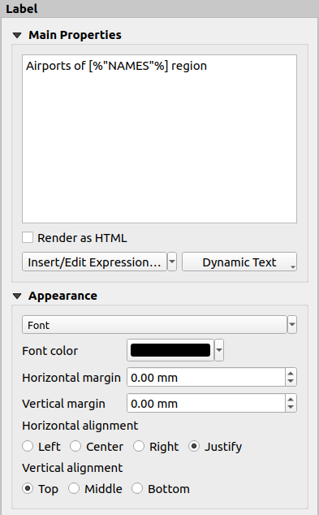

.. index:: Layout; Label item
.. _layout_label_item:

The Label Item
==============

.. only:: html

   .. contents::
      :local:

The :guilabel:`Label` item is a tool that helps decorate your map with
texts that would help to understand it; it can be the title, author, data
sources or any other information...
You can add a label with the |label| :guilabel:`Add Label` tool following
:ref:`items creation instructions <create_layout_item>` and manipulate it the
same way as exposed in :ref:`interact_layout_item`.
 
By default, the label item provides a default text that you can customize using
its :guilabel:`Item Properties` panel. Other than the :ref:`items common
properties <item_common_properties>`, this feature has the following
functionalities (see :numref:`figure_layout_label`):

.. _figure_layout_label:

   Label Item Properties Panel

.. _layout_label_main_properties:

Main properties
----------------

The :guilabel:`Main properties` group is the place to provide the text of the label.
The text can be static, dynamic with :ref:`expression <expression_builder>`
functions and variables, and/or formatted with HTML.
Dynamic parts of a label need to be surrounded by ``[%`` and ``%]``
in order to be interpreted and evaluated as such.

* To use expressions in labels, you can click on :guilabel:`Insert/Edit Expression...`
  button, write your formula as usual and when the dialog is applied,
  QGIS automatically adds the surrounding characters.

  .. hint:: When you click the :guilabel:`Insert/Edit Expression...` button with
   no selection made in the textbox, the new expression will be appended to the existing text.
   However, if you want to modify an existing expression, the behavior changes based
   on your selection: If some text is selected and the selection is within an expression
   (between '[%' and '%]'), or if no text is selected but the cursor is inside an expression,
   the whole expression will be selected. In all other cases, the selection will remain as is.

  Because maps are usually filled with some common textual information (date,
  author, title, page number, ...), QGIS provides a direct access to the
  corresponding expressions or variables: press the :guilabel:`Dynamic text`
  button to select and insert them into your label.

  .. tip:: The top menu :menuselection:`Add Item --> Add Dynamic Text -->` can be
   used to create a new label item filled with the selected predefined expression.

  It's possible to turn a dynamic label into static: press the drop-down arrow
  next to the :guilabel:`Insert/Edit Expression...` button and select
  :guilabel:`Convert to Static`. Any dynamic parts of the label's contents
  will be evaluated and replaced with their current values.
  You can then manually tweak the resulting text when needed.

* Labels can be interpreted as HTML code: check |checkbox|
  :guilabel:`Render as HTML`. You can now insert HTML tags or styles, URL,
  a clickable image that links to a web page, or something more complex...

The following code combines HTML rendering with expressions, for an advanced
labeling and will output :numref:`figure_layout_label_html`:

.. code-block:: css

 <html>
  <head>
    
  </head>

  <body>
    <!-- Information to display -->
    <u>Feature Information</u>
    <ul style="list-style-type:disc">
      <li>Feature Id: [% ID %]</li>
      <li>Airport: <name>[% NAME %]</name></li>
      <li>Main use: <use>[% USE %]</use></li>
    </ul>
    Last check: [% concat( format_date( "control_date", 'yyyy-MM-dd'), ' by <b><i>', @user_full_name, '</i></b>' ) %]

    <!-- Insert an image -->
    

  </body>
 </html>

.. _figure_layout_label_html:

.. figure:: img/label_htmlexpression.png
   :align: center

   Leveraging a label with HTML styling

Appearance
----------

* Define font and style of the text by clicking on the :guilabel:`Font` button.
  In the :guilabel:`Label Font` menu you can use some of the options for :ref:`Formatting the label text <text_format>`.
  
* You can specify different horizontal and vertical margins in ``mm``. This is
  the margin from the edge of the layout item. The label can be positioned
  outside the bounds of the label e.g. to align label items with other items.
  In this case you have to use negative values for the margin.
* Using the text alignment is another way to position your label. It can be:

  * :guilabel:`Left`, :guilabel:`Center`, :guilabel:`Right` or
    :guilabel:`Justify` for :guilabel:`Horizontal alignment`
  * and :guilabel:`Top`, :guilabel:`Middle`, :guilabel:`Bottom` for
    :guilabel:`Vertical alignment`.

.. _layout_label_expressions:

Exploring expressions in a label item
-------------------------------------

Below some examples of expressions you can use to populate the label item with
interesting information - remember that the code, or at least the calculated part,
should be surrounded by ``[%`` and ``%]`` in the :guilabel:`Main properties` frame:

* Display a title with the current atlas feature value in "field1":

  ::

    'This is the map for ' || "field1"

  or, written in the :guilabel:`Main properties` section:

  ::

    This is the map for [% "field1" %]

* Add a pagination for processed atlas features (eg, ``Page 1/10``):

  ::

    concat( 'Page ', @atlas_featurenumber, '/', @atlas_totalfeatures )

* Return the name of the airports of the current atlas region feature,
  based on their common attributes:

  ::

    aggregate( layer := 'airports',
               aggregate := 'concatenate',
               expression := "NAME",
               filter := fk_regionId = attribute( @atlas_feature, 'ID' ),
               concatenator := ', '
             )

  Or, if an :ref:`attributes relation <vector_relations>` is set:

  ::

    relation_aggregate( relation := 'airports_in_region_relation',
                        aggregate := 'concatenate',
                        expression := "NAME",
                        concatenator := ', '
                      )

* Return the name of the airports contained in the current atlas region feature,
  based on their spatial relationship:

  ::

    aggregate( layer := 'airports',
               aggregate := 'concatenate',
               expression := "NAME",
               filter := contains( geometry( @parent ), $geometry ),
               concatenator := ', '
             )

  OR::

    array_to_string( array:= overlay_contains( layer := 'airports',
                                               expression := "NAME" ),
                     delimiter:= ', '
                   )

* Return the lower X coordinate of the ``Map 1`` item's extent:

  ::

    x_min( map_get( item_variables( 'Map 1' ), 'map_extent' ) )

* Retrieve the name of the layers in the current layout ``Map 1`` item,
  and formats in one name by line:

  ::

   array_to_string(
    array_foreach(
     map_get( item_variables( 'Map 1' ), 'map_layers' ), -- retrieve the layers list
     layer_property( @element, 'name' ) -- retrieve each layer name
    ),
    '\n' -- converts the list to string separated by breaklines
   )

* Display the list of layers with their license strings (usage rights) in a layout ``Map 1`` item.
  You need to fill the layers' :ref:`Access metadata <metadatamenu>` properties first.

  ::

   array_to_string( map_credits( 'Map 1', true ) )

.. Substitutions definitions - AVOID EDITING PAST THIS LINE
   This will be automatically updated by the find_set_subst.py script.
   If you need to create a new substitution manually,
   please add it also to the substitutions.txt file in the
   source folder.

.. |checkbox| image:: /static/common/checkbox.png
   :width: 1.3em
.. |label| image:: /static/common/mActionLabel.png
   :width: 1.5em
