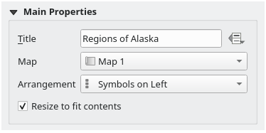
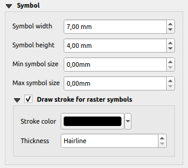

.. index:: Legend item, Map legend
.. _layout_legend_item:

The Legend Item
================

.. only:: html

   .. contents::
      :local:

The :guilabel:`Legend` item is a box or a table that explains the meanings
of the symbols used on the map. A legend is then bound to a map item. You can
add a legend item with the |addLegend| :guilabel:`Add Legend` tool following
:ref:`items creation instructions <create_layout_item>` and manipulate it the
same way as exposed in :ref:`interact_layout_item`.

By default, the legend item displays all available layers and can be refined
using its :guilabel:`Item Properties` panel. Other than the :ref:`items common
properties <item_common_properties>`, this feature has the following
functionalities (see :numref:`figure_layout_legend`):

.. showing all layers is a bug (https://issues.qgis.org/issues/13575) but given
   that it's the behavior for a long moment now, let's document it...

.. _figure_layout_legend:

   Legend Item Properties Panel

Main properties
---------------

The :guilabel:`Main properties` group of the legend :guilabel:`Item Properties`
panel provides the following functionalities (see :numref:`figure_layout_legend_ppt`):

.. _figure_layout_legend_ppt:

   Legend Main properties group

In Main properties you can:

* Change the :guilabel:`Title` of the legend. It can be made dynamic using the
  :ref:`data-defined override <data_defined>` setting, useful for example when
  generating an atlas;
* Choose which :guilabel:`Map` item the current legend will refer to.
  By default, the map over which the legend item is drawn is picked. If none,
  then it falls back to the :ref:`reference map <reference_map>`.
  
  .. note:: :ref:`Variables <expression_variables>` of the linked map item
   (@map_id, @map_scale, @map_extent...) are also accessible from data-defined
   properties of the legend.

* Wrap the text of the legend on a given character: each time the character
  appears, it's replaced with a line break;
* Set the symbols and text placement in the legend: the :guilabel:`Arrangement`
  can be :guilabel:`Symbols on left` or :guilabel:`Symbols on right`. The default
  value depends on the locale in use (right-to-left based or not).
* Use |checkbox| :guilabel:`Resize to fit contents` to control whether or
  not a legend should be automatically resized to fit its contents. If
  unchecked, then the legend will never resize and instead just stick to
  whatever size the user has set. Any content which doesn't fit the size
  is cropped out.

Legend items
------------

The :guilabel:`Legend items` group of the legend :guilabel:`Item Properties`
panel provides the following functionalities (see :numref:`figure_layout_legend_items`):

.. _figure_layout_legend_items:

.. figure:: img/legend_items.png
   :align: center

   Legend Items group

* The legend will be updated automatically if |checkbox| :guilabel:`Auto update`
  is checked. When :guilabel:`Auto update` is unchecked this will give you more
  control over the legend items. All the icons below the legend items list will
  be activated.
* The legend items window lists all legend items and allows you to change item
  order, group layers, remove and restore items in the list, edit layer names
  and symbology and add a filter.

  * Use the |expandTree| :sup:`Expand all` and |collapseTree| :sup:`Collapse all` buttons
    to respectively expand or collapse all the groups and subgroups in the legend tree. 
    Ensure that the :guilabel:`Auto update` is unchecked to use these buttons.
  * The item order can be changed using the |arrowUp| and |arrowDown| buttons or
    with 'drag-and-drop' functionality. The order can not be changed for WMS
    legend graphics.
  * Use the |addGroup| button to add a legend group.
  * Use the |symbologyAdd| button to add layers and |symbologyRemove| button to remove
    groups, layers or symbol classes.
  * The |symbologyEdit| button is used to edit the layer, group name or title.
    First you need to select the legend item. Double-clicking the item also
    opens the text box to rename it.
  * The |expression| button uses expressions to customize each symbol label
    of the selected layer (see :ref:`legend_items_data_defined`)
  * The |sum| button adds a feature count for each class of vector layer.
  * The |expressionFilter| :sup:`Filter legend by expression` helps you filter
    which of the legend items of a layer will be displayed, i.e. using a layer
    that has different legend items (e.g., from a rule-based or categorized
    symbology), you can specify a boolean expression to remove from the legend
    tree, styles that have no feature satisfying a condition. Note that the
    features are nevertheless kept and shown in the layout map item.

  While the default behavior of the legend item is to mimic the
  :guilabel:`Layers` panel tree, displaying the same groups, layers and classes
  of symbology, right-click any item offers you options to hide layer's name or
  raise it as a group or subgroup. In case you have made some changes to a layer,
  you can revert them by choosing :guilabel:`Reset to defaults` from the
  contextual menu of the legend entry.

  After changing the symbology in the QGIS main window, you can click on
  :guilabel:`Update All` to adapt the changes in the legend element of the print
  layout.
  
* With the |checkbox| :guilabel:`Only show items inside linked maps`, only the
  legend items visible in the linked map will be listed in the legend. If you 
  have more than one map you can click on :guilabel:`...` and select other 
  maps from your layout.
  This tool remains available when |checkbox| :guilabel:`Auto-update` is active.
* While generating an atlas with polygon features, you can filter out legend
  items that lie outside the current atlas feature. To do that, check the
  |checkbox| :guilabel:`Only show items inside current atlas feature` option.

.. _legend_items_data_defined:

Data-define the legend labels
.............................

|expression| allows you to add :ref:`expressions <vector_expressions>` to
each symbol label of a given layer. New variables (``@symbol_label``,
``@symbol_id`` and ``@symbol_count``) help you interact with the legend entry.

For example, given a ``regions`` layer categorized by its ``type`` field,
you can append to each class in the legend their number of features and total area,
e.g. ``Borough (3) - 850ha``:

#. Select the layer entry in the legend tree
#. Press the |expression| button, opening the :guilabel:`Expression String Builder`
   dialog
#. Enter the following expression (*assuming symbol labels have not been edited*)::

    format( '%1 (%2) - %3ha',
            @symbol_label,
            @symbol_count,
            round( aggregate(@layer, 'sum', $area, filter:= "type"=@symbol_label)/10000 )
          )

#. Press :guilabel:`OK`

Customizing legend items
........................

.. _figure_layout_legend_item_properties:

.. figure:: img/legend_item_properties.png
   :align: center

Legend items can also be customized individually in the :guilabel:`Legend Items Properties`.
But these customization can only be done with |checkbox| :guilabel:`Auto update` disabled.

Double-clicking on an item or pressing |symbologyEdit| :sup:`Edit selected item properties`
allows for futher customization.

:guilabel:`Label`

For all item types it allows to modify the label text by typing in or by inserting expressions
using the |expression| :guilabel:`Insert or Edit an Expression`.
Expressions can also be added directly anywhere in the item's label by using the
[% expression %] notation.

:guilabel:`Columns`

The Legend Item Property also allows you to control the column splitting behaviour by forcing the column split
to occur after a specific item or all symbols of a layer. Automatic splitting of a layer and its child can
also be allowed or blocked on a layer-basis in this widget.

:guilabel:`Patch`

For items with a symbol, the Legend Item Property allows you to specify the maximum height and width
that a symbol can occupy.

For vector symbols, you can specify a custom shape for the symbol. The shapes are usually
defined by an expression to represent the geometry in a simple plane, but those symbols can also
be saved in the style manager and imported later. The default symbol for each geometry type can
also be controlled via the style manager.

:guilabel:`Custom Symbol`

A custom symbol can also be specified for vector symbols. This can be useful to tweak the render
of a specific symbol, to enhance it in the legend or have a symbol independent from its true symbol preview.
This custom symbol will override the legend symbol, but will take into account the symbol :guilabel:`Patch` specified. 

Fonts and text formatting
-------------------------

The :guilabel:`Fonts and text formatting` group of the legend :guilabel:`Item Properties` panel
provides the following functionalities:

.. _figure_layout_legend_fonts:

.. figure:: img/legend_fonts.png
   :align: center

   Legend Fonts properties

* You can change the font of the legend title, group, subgroup and item (feature)
  in the legend item using the :ref:`font selector <font_selector>` widget,
  providing all the capabilities of :ref:`text formatting <text_format>`
  (font spacing control, mixed HTML formatting, coloring, blending, background, text buffer, shadow, ...)
* For each of these levels you can set the text :guilabel:`Alignment`:
  it can be :guilabel:`Left` (default for left-to-right based locales),
  :guilabel:`Center` or :guilabel:`Right` (default for right-to-left based locales).

Columns
-------

Under the :guilabel:`Columns` group of the legend :guilabel:`Item Properties`
panel, legend items can be arranged over several columns:

* Set the number of columns in the :guilabel:`Count` |selectNumber| field.
  This value can be made dynamic e.g., following atlas features, legend
  contents, the frame size...
* |checkbox| :guilabel:`Equal column widths` sets how legend columns should be
  adjusted.
* The |checkbox| :guilabel:`Split layers` option allows a categorized or a
  graduated layer legend to be divided between columns.

.. _figure_layout_legend_columns:

.. figure:: img/legend_columns.png
   :align: center

   Legend Columns settings

Symbol
------

The :guilabel:`Symbol` group of the legend :guilabel:`Item Properties` panel
configures the size of symbols displayed next to the legend labels.
You can:

* Set the :guilabel:`Symbol width` and :guilabel:`Symbol height`
* Set the markers' :guilabel:`Min symbol size` and :guilabel:`Max symbol size`:
  ``0.00mm`` means there is no value set.
* |checkbox| :guilabel:`Draw stroke for raster symbols`: this adds an outline
  to the symbol representing the band color of the raster layer; you can set
  both the :guilabel:`Stroke color` and :guilabel:`Tickness`.

.. _figure_layout_legend_symbol:

   Legend Symbol configuration

WMS LegendGraphic
-----------------

The :guilabel:`WMS LegendGraphic` section of the legend
:guilabel:`Item Properties` panel provide the following functionalities (see
:numref:`figure_layout_legend_wms`):

.. _figure_layout_legend_wms:

.. figure:: img/legend_wms.png
   :align: center

   WMS LegendGraphic

When you have added a WMS layer and you insert a legend item, a request
will be sent to the WMS server to provide a WMS legend. This Legend will only be
shown if the WMS server provides the GetLegendGraphic capability.
The WMS legend content will be provided as a raster image.

:guilabel:`WMS LegendGraphic` is used to be able to adjust the :guilabel:`Legend
width` and the :guilabel:`Legend height` of the WMS legend raster image.

Spacing
-------

.. _figure_layout_legend_spacing:

.. figure:: img/legend_spacing.png
   :align: center

The :guilabel:`Spacing` section allows you to customize the spacing within the legend.
Spacing can greatly help denote the groupement of items in the legend and their relation.

:guilabel:`Spacing` around and before title, groups, subgroups, symbols, labels, boxes, columns
and lines can be customized through this dialog.

.. Substitutions definitions - AVOID EDITING PAST THIS LINE
   This will be automatically updated by the find_set_subst.py script.
   If you need to create a new substitution manually,
   please add it also to the substitutions.txt file in the
   source folder.

.. |addGroup| image:: /static/common/mActionAddGroup.png
   :width: 1.5em
.. |addLegend| image:: /static/common/mActionAddLegend.png
   :width: 1.5em
.. |arrowDown| image:: /static/common/mActionArrowDown.png
   :width: 1.5em
.. |arrowUp| image:: /static/common/mActionArrowUp.png
   :width: 1.5em
.. |checkbox| image:: /static/common/checkbox.png
   :width: 1.3em
.. |collapseTree| image:: /static/common/mActionCollapseTree.png
   :width: 1.5em
.. |expandTree| image:: /static/common/mActionExpandTree.png
   :width: 1.5em
.. |expression| image:: /static/common/mIconExpression.png
   :width: 1.5em
.. |expressionFilter| image:: /static/common/mIconExpressionFilter.png
   :width: 1.5em
.. |selectNumber| image:: /static/common/selectnumber.png
   :width: 2.8em
.. |sum| image:: /static/common/mActionSum.png
   :width: 1.2em
.. |symbologyAdd| image:: /static/common/symbologyAdd.png
   :width: 1.5em
.. |symbologyEdit| image:: /static/common/symbologyEdit.png
   :width: 1.5em
.. |symbologyRemove| image:: /static/common/symbologyRemove.png
   :width: 1.5em
