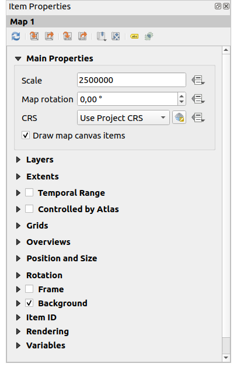
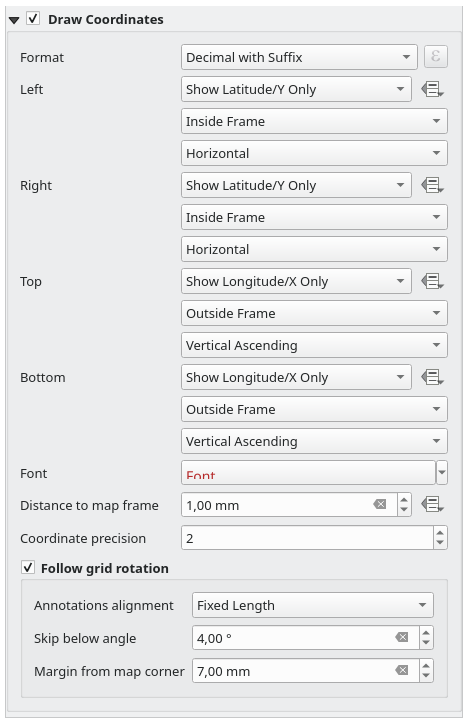

.. index:: Layout; Map item
.. _layout_map_item:

The Map Item
=============

.. only:: html

   .. contents::
      :local:

The map item is the main frame that displays the map you've designed in the map
canvas.
Use the |addMap| :guilabel:`Add Map` tool following :ref:`items creation
instructions <create_layout_item>` to add a new map item that you can later
manipulate the same way as exposed in :ref:`interact_layout_item`.

By default, a new map item shows the current status of the :ref:`map canvas
<label_mapview>` with its extent and visible layers. You can customize it
thanks to the :guilabel:`Item Properties` panel. Other than the :ref:`items
common properties <item_common_properties>`, this feature has the following
functionalities:

.. _figure_layout_map:

   Map Item Properties Panel

The Toolbar
-----------

The Map :guilabel:`Item Properties` panel embeds a toolbar with the following
functionalities:

* |refresh| :sup:`Update map preview`
* |setToCanvasExtent| :sup:`Set map canvas to match main canvas extent`
* |viewExtentInCanvas| :sup:`View current map extent in main canvas`
* |setToCanvasScale| :sup:`Set map scale to match main canvas scale`
* |viewScaleInCanvas| :sup:`Set main canvas to match current map scale`
* |showBookmarks| :sup:`Bookmarks`: set the map item extent to match
  an existing spatial bookmark
* |moveItemContent| :sup:`Interactively edit map extent`: pan and
  zoom interactively
  within the map item
* |labelingSingle| :sup:`Labeling settings`: control feature label behaviour
  (placement, visibility...) in the layout map item extent:

  * set a :guilabel:`Margin from map edges`, a data definable distance from the
    map item's limits inside which no label should be displayed
  * |unchecked| :guilabel:`Allow truncated labels on edges of map`: controls
    whether labels which fall partially outside of the map item allowed extent
    should be rendered. If checked, these labels will be shown (when there’s
    no way to place them fully within the visible area). If unchecked then
    partially visible labels will be skipped.
  * :guilabel:`Label blocking items`: allows other layout items (such as
    scalebars, north arrows, inset maps, etc) to be marked as a blockers for
    the map labels in the **active** map item. This prevents any map labels
    from being placed under those items - causing the labeling engine to either
    try alternative placement for these labels or discard them altogether.

    If a :guilabel:`Margin from map edges` is set, the map labels are not
    placed closer than the specified distance from the checked layout items.
  * :guilabel:`Show unplaced labels`: can be used to determine whether labels
    are missing from the layout map (e.g. due to conflicts with other
    map labels or due to insufficient space to place the label) by
    highlighting them in a :ref:`predefined color <automated_placement>`.
* |clip| :sup:`Clipping settings`: allows to clip the map item to the atlas
  feature and to shape and polygon items:

  * |checkbox| :guilabel:`Clip to atlas feature`: you can determine that
    the layout map item will be clipped automatically to the current :ref:`atlas
    feature <atlas_generation>`.

    There are different clipping modes available:

    * :guilabel:`Clip During Render Only`: applies a painter based clip,
      so that portions of vector features which sit outside the atlas feature
      become invisible
    * :guilabel:`Clip Feature Before Render`: applies the clip before rendering
      features, so borders of features which fall partially outside the atlas
      feature will still be visible on the boundary of the atlas feature
    * :guilabel:`Render Intersecting Features Unchanged`: renders all
      features which intersect the current atlas feature, but without clipping their
      their geometry.

    You can |checkbox| :guilabel:`Force labels inside atlas feature`.
    If you don't want to |radioButtonOff| :guilabel:`Clip all layers` to the
    atlas feature you can use the |radioButtonOn| :guilabel:`Clip selected layers`
    option.
  * |checkbox| :guilabel:`Clip to item`: it is possible to change the shape of the
    map item by using a :ref:`shape <layout_basic_shape_item>` or :ref:`polygon
    <layout_node_based_shape_item>` item from the print layout. When you
    enable this option the map will be automatically clipped to the selected shape
    in the combobox. Again, the above mentioned clipping modes are available and
    labels can be forced to display only inside the clipping shape.

    .. _figure_layout_mapclipitem:

    .. figure:: img/map_cliptoitem.*
       :align: center

       Clipping a layout map item to shapes

.. _`layout_main_properties`:

Main properties
---------------

In the :guilabel:`Main properties` group (see :numref:`figure_layout_map`) of the map
:guilabel:`Item Properties` panel, available options are:

* The :guilabel:`Update Preview` button to refresh the map item rendering if the view
  in map canvas has been modified. Note that most of the time, the map item
  refresh is automatically triggered by the changes;
* The :guilabel:`Scale` to manually set the map item scale;
* The :guilabel:`Map rotation` allows you to rotate the map item content
  clockwise in degrees. The rotation of the map canvas can be imitated here;
* The :guilabel:`CRS` allows you to display the map item content in any
  :ref:`CRS <crs_selector>`. It defaults to ``Use project CRS``;
* |checkbox| :guilabel:`Draw map canvas items` lets you show in the print
  layout :ref:`annotations <sec_annotations>` that are placed on the main map
  canvas.

.. _`layout_layers`:

Layers
------

By default, map item appearance is synced with the map canvas rendering meaning
that toggling visibility of the layers or modifying their style in the
:guilabel:`Layers Panel` is automatically applied to the map item. Because,
like any other item, you may want to add multiple map items to a print layout,
there's a need to break this synchronization in order to allow showing
different areas, layer combinations, at different scales...
The :guilabel:`Layers` properties group (see :numref:`figure_layout_map_layers`) helps
you do that.

.. _figure_layout_map_layers:

.. figure:: img/map_layers.png
   :align: center

   Map Layers group

If you want to keep the map item consistent with an existing :ref:`map theme
<map_themes>`, check |checkbox| :guilabel:`Follow map theme` and select the
desired theme in the drop-down list. Any changes applied to the theme in QGIS'
main window (using the replace theme function) will automatically affect the
map item.
If a map theme is selected, the :guilabel:`Lock styles for layers` option is
disabled because :guilabel:`Follow map theme` also updates the
style (symbology, labels, diagrams) of the layers.

To lock the layers shown in a map item to the current map canvas visibility,
check |checkbox| :guilabel:`Lock layers`. When this option is enabled, any
changes on the layers' visibility in QGIS' main window will not affect
the layout's map item. Nevertheless, style and labels of locked
layers are still refreshed according to QGIS' main window.
You can prevent this by using :guilabel:`Lock styles for layers`.

Instead of using the current map canvas, you can also lock the layers of the
map item to those of an existing map theme: select a map theme from the
|showPresets| :sup:`Set layer list from a map theme` drop-down button, and the
|checkbox| :guilabel:`Lock layers` is activated. The set of visible layers in
the map theme is from now on used for the map item until you select another map
theme or uncheck the |checkbox| :guilabel:`Lock layers` option. You then may
need to refresh the view using the |refresh| :sup:`Refresh view` button of the
:guilabel:`Navigation` toolbar or the :guilabel:`Update Preview` button seen above.

Note that, unlike the :guilabel:`Follow map theme` option, if the
:guilabel:`Lock layers` option is enabled and set to a map theme, the layers in
the map item will not be refreshed even if the map theme is updated (using the
replace theme function) in QGIS' main window.

Locked layers in the map item can also be :ref:`data-defined <data_defined>`,
using the |dataDefine| icon beside the option. When used, this overrides the
selection set in the drop-down list. You need to pass a list of layers
separated by ``|`` character.
The following example locks the map item to use only layers ``layer 1`` and
``layer 2``::

  concat ('layer 1', '|', 'layer 2')

Extents
-------

The :guilabel:`Extents` group of the map item properties panel provides the
following functionalities (see :numref:`figure_layout_map_extents`):

.. _figure_layout_map_extents:

.. figure:: img/map_extents.png
   :align: center

   Map Extents group

The **Extents** area displays ``X`` and ``Y`` coordinates of the area shown
in the map item. Each of these values can be manually replaced, modifying the
map canvas area displayed and/or map item size.
The extent can also be modified using tools at the top of the map item panel
such as:

* |setToCanvasExtent| :sup:`Set map canvas to match main canvas extent`
* |setToCanvasScale| :sup:`Set map scale to match main canvas scale`

You can also alter a map item extent using the |moveItemContent| :sup:`Move
item content` tool: click-and-drag within the map item to modify its current
view, keeping the same scale. With the |moveItemContent| tool enabled, use the
mouse wheel to zoom in or out, modifying the scale of the shown map. Combine
the movement with :kbd:`Ctrl` key pressed to have a smaller zoom.

.. index:: Temporal, Print layout
.. _mapitem_temporalrange:

Temporal range
--------------

The :guilabel:`Temporal range` group of the map item properties panel provides the
options to control layers rendering in the map item based on a temporal range.
Only layers whose temporal properties overlap with the time range set by the
:guilabel:`Start` and :guilabel:`End` dates are displayed in the map item.

The associated data-defined widgets help make the time range dynamic, and
allow outputting temporal :ref:`atlases <atlas_generation>`, i.e. automated maps
with fixed spatial extent and whose contents vary based on time. For example,
using as coverage layer a csv file with a start and end pair of fields and
a number of rows representing date ranges, enable both the temporal range
and control by atlas in the map item properties and hit atlas export.

.. index:: Atlas
.. _controlled_atlas:

Controlled by atlas
-------------------

The |checkbox| :guilabel:`Controlled by atlas` group properties is available
only if an :ref:`atlas <atlas_generation>` is active in the print layout. Check
this option if you want the map item being ruled by the atlas; when iterating
over the coverage layer, the map item extent is panned/zoomed to the atlas
feature following:

* |radioButtonOn| :guilabel:`Margin around features`: zooms to the feature at the
  best scale, keeping around each a margin representing a percentage of the map
  item width or height. The margin can be the same for all features or :ref:`set
  variable <data_defined>`, e.g., depending on map scale;
* |radioButtonOff| :guilabel:`Predefined scale (best fit)`: zooms to the feature
  at the project :ref:`predefined scale <predefinedscales>` where the atlas
  feature best fits;
* |radioButtonOff| :guilabel:`Fixed scale`: atlas features are panned from one
  to another, keeping the same scale of the map item. Ideal when working with
  features of same size (e.g., a grid) or willing to highlight size differences
  among atlas features.

.. index:: Grids, Map grid

Grids
-----

With grids, you can add, over your map, information relative to its extent
or coordinates, either in the map item projection or a different one.
The :guilabel:`Grids` group provides the possibility to add several grids to a map item.

* With the |symbologyAdd| and |symbologyRemove| buttons you can add or remove a selected grid;
* With the |arrowUp| and |arrowDown| buttons you can move up and down a grid in the list,
  hence move it on top or bottom of another one, over the map item.

Double-click the added grid to rename it.

.. _Figure_layout_map_grid:

.. figure:: img/map_grids.png
   :align: center

   Map Grids Dialog

To modify a grid, select it and press the :guilabel:`Modify Grid...` button
to open the :guilabel:`Map Grid Properties` panel and access its configuration options.

.. _grid_appearance:

Grid Appearance
...............

In the :guilabel:`Map Grid Properties` panel, check |checkbox|
:guilabel:`Grid enabled` to show the grid on the map item.

As grid type, you can specify to use a:

* **Solid**: shows a line across the grid frame.
  The :guilabel:`Line style` can be customized using :ref:`color <color-selector>`
  and :ref:`symbol <symbol-selector>` selector widget;
* **Cross**: displays segment at the grid lines intersection for which you can
  set the :guilabel:`Line style` and the :guilabel:`Cross width`;
* **Markers**: only displays customizable markers symbol at grid lines intersection;
* or **Frame and annotations only**.

Other than the grid type, you can define: 

* the :guilabel:`CRS` of the grid: by default, it will follow the map item CRS.
  Press |setProjection| :sup:`Select CRS` button to set it to a different CRS.
* the :guilabel:`Interval` type to use for the grid references:

  * **Map Units**: you set a distance within the map (in the unit of the grid CRS)
    between consecutive grid references in the :guilabel:`X` and :guilabel:`Y` directions.
    The number of grid ticks will vary depending on the map scale.
  * choosing **Fit Segment Width** will dynamically select the grid interval based
    on the map extent to a "pretty" interval.
    That optimal interval is calculated within a range of distances
    whose :guilabel:`Minimum` and :guilabel:`Maximum` values can be customized.
  * With **Millimeters** or **Centimeters**, you set a distance on the paper
    between consecutive grid references in the :guilabel:`X` and :guilabel:`Y` directions.
    The number of grid ticks will be the same whatever the map scale.

* the :guilabel:`Offset` from the map item edges, in the :guilabel:`X`
  and/or the :guilabel:`Y` direction
* and the :guilabel:`Blend mode` of the grid (see :ref:`blend-modes`) when compatible.

.. _Figure_layout_map_grid_draw:

.. figure:: img/map_grid_appearance.png
   :align: center

   Grid Appearance Dialog

Grid Frame
..........

There are different options to style the frame that holds the map.
The following options are available: ``No Frame``, ``Zebra``, ``Zebra (nautical)``,
``Interior ticks``, ``Exterior ticks``, ``Interior and Exterior ticks``,
``Line border`` and ``Line border (nautical)``.

When compatible, it's possible to set the :guilabel:`Frame size`, a
:guilabel:`Frame margin`, the :guilabel:`Frame line thickness` with associated
color and the :guilabel:`Frame fill colors`.

Using ``Latitude/Y only`` and ``Longitude/X only`` values in the divisions
section you can prevent a mix of latitude/Y and longitude/X coordinates showing
on each side when working with rotated maps or reprojected grids.
Also you can choose to set visible or not each side of the grid frame.

When the map item extent is rotated (from the :guilabel:`Main properties` group)
or the grid has a different CRS applied, grid lines may not be orthogonal to the map item sides.
This can result in bad looking of the grid when styled with interior and/or exterior ticks.
Checking |checkbox| :guilabel:`Follow grid rotation` will align the ticks with grid lines.
Moreover, you can adjust some more properties:

* :guilabel:`Ticks alignment`: The interior and/or exterior ticks will be parallel
  to their corresponding grid line.
  Their alignment can be:

  * **Orthogonal**: ticks on the same side end at one line, parallel to the side.
    This can result e.g. in some ticks getting longer when with a low angle to the frame.
  * **Fixed length**: all ticks have the same length, so they may not align
* :guilabel:`Skip below angle`: prevents displaying ticks for grid lines intersecting the frame border
  below a specified threshold
* :guilabel:`Margin from map corner`: prevents displaying ticks too close to the map corners,
  because they could overlap and/or be out of bounds.

.. _Figure_layout_map_frame:

.. figure:: img/map_grid_frame.png
   :align: center

   Grid Frame Dialog

Coordinates
...........

The |checkbox| :guilabel:`Draw coordinates` checkbox allows you to add
coordinates to the map frame.
Displayed values relate to the chosen :ref:`grid interval <grid_appearance>` unit.
You can choose the annotation numeric format,
the options range from decimal to degrees, minute and seconds, with or without
suffix, aligned or not and a custom format using the expression dialog.

For each of the :guilabel:`Left`, :guilabel:`Right`, :guilabel:`Top`
and :guilabel:`Bottom` sides of the grid frame, you can indicate:

* whether to render the coordinates: **Show all**, **Show latitude/Y only**,
  **Show longitude/X only**, **Disabled**.
  Showing only Latitude/Y or Longitude/X values in the divisions
  helps prevent a mix of latitude/Y and longitude/X coordinates showing
  on each side when working with rotated maps or reprojected grids.
* the relative position of the text to the grid frame:
  **Outside frame** or **Inside frame**
* the placement and orientation of the annotation:

  * **Horizontal**
  * **Vertical ascending**, **Vertical descending**
  * **Boundary direction**
  * **Above tick**, **On tick**, **Under tick** when a tick-based frame is used

You can also define the :guilabel:`Font` :ref:`properties <text_format>` (font, size, color, buffer,...)
the :guilabel:`Distance to the map frame` and the :guilabel:`Coordinate precision`
(number of decimals) for the drawn annotations.

|unchecked| :guilabel:`Follow grid rotation`: available when the map extent is rotated
or the grid is reprojected, it helps you adjust the annotations placement.
Depending on the selected placement mode, the annotations are also rotated:

* :guilabel:`Annotations alignment`: it can be **Orthogonal** or of **Fixed length**
* :guilabel:`Skip below angle`: prevents displaying annotations for grid lines
  intersecting the frame border below a specified threshold
* :guilabel:`Margin from map corner`: prevents displaying annotations too close to the map corners,
  because they could overlap and/or be out of bounds.

.. _figure_layout_map_coord:

   Grid Draw Coordinates dialog

.. index:: Location map, Map overview

Overviews
---------

Sometimes you may have more than one map in the print layout and would like to
locate the study area of one map item on another one. This could be for example
to help map readers identify the area in relation with its larger geographic
context shown in the second map.

The :guilabel:`Overviews` group of the map panel helps you create the link
between two different maps extent and provides the following functionalities:

.. _figure_layout_map_overview:

.. figure:: img/map_overview.png
   :align: center

   Map Overviews group

To create an overview, select the map item on which you want to show the other
map item's extent and expand the :guilabel:`Overviews` option in the
:guilabel:`Item Properties` panel. Then press the |symbologyAdd| button to add
an overview.

Initially this overview is named 'Overview 1' (see :numref:`Figure_layout_map_overview`).
You can:

* Rename it with a double-click
* With the |symbologyAdd| and |symbologyRemove| buttons, add or remove overviews
* With the |arrowUp| and |arrowDown| buttons, move an overview up and down in
  the list, placing it above or below other overviews in the map item
  (when they are at the same :ref:`stack position <overview_stack_position>`).

Then select the overview item in the list and check the |checkbox|
:guilabel:`Draw "<name_overview>" overview` to enable the drawing
of the overview on the selected map frame. You can customize it with:

* The :guilabel:`Map frame` selects the map item whose
  extents will be shown on the present map item.
* The :guilabel:`Frame Style` uses the :ref:`symbol properties
  <symbol-selector>` to render the overview frame.
* The :guilabel:`Blending mode` allows you to set different transparency blend
  modes.
* The |checkbox| :guilabel:`Invert overview` creates a mask around the extents
  when activated: the referenced map extents are shown clearly, whereas
  the rest of the map item is blended with the frame fill color
  (if a fill color is used).
* The |checkbox| :guilabel:`Center on overview` pans the map item content so
  that the overview frame is displayed at the center of the map. You can only
  use one overview item to center, when you have several overviews.
  
.. _`overview_stack_position`:

* The :guilabel:`Position` controls exactly where in the map item's layer stack
  the overview will be placed, e.g. allowing an overview extent to be
  drawn below some feature layers such as roads whilst drawing it
  above other background layers. Available options are:

  * :guilabel:`Below map`
  * :guilabel:`Below map layer` and :guilabel:`Above map layer`: place the
    overview frame below and above the geometries of a layer, respectively.
    The layer is selected in the :guilabel:`Stacking layer` option.
  * :guilabel:`Below map labels`: given that labels are always rendered above
    all the feature geometries in a map item, places the overview frame above
    all the geometries and below any label.
  * :guilabel:`Above map labels`: places the overview frame above all the
    geometries and labels in the map item.

.. Substitutions definitions - AVOID EDITING PAST THIS LINE
   This will be automatically updated by the find_set_subst.py script.
   If you need to create a new substitution manually,
   please add it also to the substitutions.txt file in the
   source folder.

.. |addMap| image:: /static/common/mActionAddMap.png
   :width: 1.5em
.. |arrowDown| image:: /static/common/mActionArrowDown.png
   :width: 1.5em
.. |arrowUp| image:: /static/common/mActionArrowUp.png
   :width: 1.5em
.. |checkbox| image:: /static/common/checkbox.png
   :width: 1.3em
.. |clip| image:: /static/common/mAlgorithmClip.png
   :width: 1.5em
.. |dataDefine| image:: /static/common/mIconDataDefine.png
   :width: 1.5em
.. |labelingSingle| image:: /static/common/labelingSingle.png
   :width: 1.5em
.. |moveItemContent| image:: /static/common/mActionMoveItemContent.png
   :width: 1.5em
.. |radioButtonOff| image:: /static/common/radiobuttonoff.png
   :width: 1.5em
.. |radioButtonOn| image:: /static/common/radiobuttonon.png
   :width: 1.5em
.. |refresh| image:: /static/common/mActionRefresh.png
   :width: 1.5em
.. |setProjection| image:: /static/common/mActionSetProjection.png
   :width: 1.5em
.. |setToCanvasExtent| image:: /static/common/mActionSetToCanvasExtent.png
   :width: 1.5em
.. |setToCanvasScale| image:: /static/common/mActionSetToCanvasScale.png
   :width: 1.5em
.. |showBookmarks| image:: /static/common/mActionShowBookmarks.png
   :width: 1.5em
.. |showPresets| image:: /static/common/mActionShowPresets.png
   :width: 1.5em
.. |symbologyAdd| image:: /static/common/symbologyAdd.png
   :width: 1.5em
.. |symbologyRemove| image:: /static/common/symbologyRemove.png
   :width: 1.5em
.. |unchecked| image:: /static/common/unchecked.png
   :width: 1.3em
.. |viewExtentInCanvas| image:: /static/common/mActionViewExtentInCanvas.png
   :width: 1.5em
.. |viewScaleInCanvas| image:: /static/common/mActionViewScaleInCanvas.png
   :width: 1.5em
