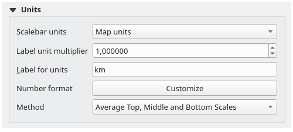

.. index:: Layout; Scale bar, Map scalebar
.. _layout_scalebar_item:

The Scale Bar Item
==================

.. only:: html

   .. contents::
      :local:

Scale bars provide a visual indication of the size of features, and distance
between features, on the map item. A scale bar item requires a map item.
Use the |scaleBar| :guilabel:`Add Scale Bar` tool following :ref:`items creation
instructions <create_layout_item>` to add a new scale bar item that you can
later manipulate the same way as exposed in :ref:`interact_layout_item`.

By default, a new scale bar item shows the scale of the map item over which
it is drawn. If there is no map item below, the :ref:`reference map <reference_map>` is
used. You can customize it in the :guilabel:`Item Properties` panel.
Other than the :ref:`items common properties <item_common_properties>`, this
feature has the following functionalities (see :numref:`figure_layout_scalebar`):

.. _figure_layout_scalebar:

.. figure:: img/scalebar_properties.png
   :align: center

   Scale Bar Item Properties Panel

Main properties
---------------

The :guilabel:`Main properties` group of the scale bar
:guilabel:`Item Properties` panel provides the following functionalities
(see :numref:`figure_layout_scalebar_ppt`):

.. _figure_layout_scalebar_ppt:

.. figure:: img/scalebar_mainproperties.png
   :align: center

   Scale Bar Main properties group

#. First, choose the map the scale bar will be attached to
#. Then, choose the style of the scale bar. Available styles are:

   * **Single box** and **Double box** styles, which contain one or two lines
     of boxes alternating colors;
   * **Middle**, **Up** or **Down** line ticks;
   * **Stepped line** style that draws a stepped line representation of a scalebar
   * **Hollow** style that draws a single box with alternating color for the
     segments, with horizontal lines through alternating segments
   * **Numeric**, where the scale ratio is printed (e.g., ``1:50000``).
#. Set properties as appropriate

Units
-----

The :guilabel:`Units` group of the scale bar :guilabel:`Item Properties` panel
provides the functionalities to set the units of display and some text formatting
(see :numref:`figure_layout_scalebar_units`):

.. _figure_layout_scalebar_units:

   Scale Bar Units group

* Select the units you want to use with :guilabel:`Scalebar units`. There are
  many possible choices: **Map Units** (the default one), **Meters**, **Feet**,
  **Miles** or **Nautical Miles**... and some derivatives. Units conversion
  is handled automatically.
* The :guilabel:`Label unit multiplier` specifies how many scale bar units per
  labeled unit. Eg, if your scale bar units are set to "meters", a multiplier of
  1000 will result in the scale bar labels in "kilometers".
* The :guilabel:`Label for units` field defines the text used to describe the
  units of the scale bar, eg ``m`` or ``km``. This should be matched to reflect
  the multiplier above.
* Press :guilabel:`Customize` next to :guilabel:`Number format` to have control
  over all the formatting properties for the numbers in the scale bar, including
  thousand separators, decimal places, scientific notation, etc.
  (see :ref:`number_formatting` for more details).
  Very useful in the case of making maps for audiences outside of the current
  QGIS locale, or when you would like to vary the style from the locale
  defaults (e.g. adding thousands separators when the locale default is to hide
  them).

Segments
--------

The :guilabel:`Segments` group of the scale bar :guilabel:`Item Properties` panel
provides the functionalities to configure the number and size of segments and
subdivisions (see :numref:`figure_layout_scalebar_segments`):

.. _figure_layout_scalebar_segments:

.. figure:: img/scalebar_segments.png
   :align: center

   Scale Bar Segments group

* You can define the number of :guilabel:`Segments` that will be drawn at the left
  and right sides of the ``0`` of the scale bar:

  * number of subdivisions of a unique segment on the :guilabel:`Left` side
  * number of segments on the :guilabel:`Right` side
* You can set how long a segment will be (:guilabel:`Fixed width`), or limit
  the scale bar size in ``mm`` with :guilabel:`Fit segment width` option. In the
  latter case, each time the map scale changes, the scale bar is resized (and
  its label updated) to fit the range set.
* :guilabel:`Height` is used to define the height of the bar.
* :guilabel:`Right segment subdivisions` is used to define the number of sections
  the right-side segments of the scale bar can have (for *Line Ticks Down*,
  *Line Ticks Middle* and *Line Ticks Up* scale bar styles) .
* :guilabel:`Subdivision height` is used to define the height of the subdivision
  segment.

Display
--------

The :guilabel:`Display` group of the scale bar :guilabel:`Item Properties`
panel provides the following functionalities:

.. _figure_layout_scalebar_display:

.. figure:: img/scalebar_display.png
   :align: center

   Scale Bar Display group

You can define how the scale bar will be displayed in its frame.

* :guilabel:`Box margin` : space between text and frame borders
* :guilabel:`Label margin` : space between text and scale bar drawing
* :guilabel:`Vertical label placement`: it can be above or below the scale bar
  segment
* :guilabel:`Horizontal label placement`: which would be centered at the scale
  bar segment's edge or center
* :guilabel:`Primary fill` and :guilabel:`Secondary fill` of the scale bar
  drawing using :ref:`fill symbols properties <vector_fill_symbols>`
  (color, opacity, patterns, effects...) --- for *Single Box*, *Double Box*
  and *Hollow* styles
* :guilabel:`Line style` of the scale bar drawing using :ref:`line symbols
  properties <vector_line_symbols>` (color, stroke, join, cap style, patterns,
  effects...) --- for all but *Numeric* style
* :guilabel:`Division style` and :guilabel:`Subdivision style` respectively
  for division and subdivision segments in *Line Ticks Up*, *Line Ticks Middle*
  and *Line Ticks Down* scale bar styles using :ref:`line symbols properties
  <vector_line_symbols>` (color, stroke, join, cap style, patterns, effects...)
* :guilabel:`Alignment` puts text on the left, center or right side of the
  frame (only for *Numeric* scale bar style)
* :guilabel:`Font` to set the :ref:`properties <text_format>`
  (size, font, color, letter spacing, shadow, background...) of the scale bar
  label.

Since most of the display properties of the scale bar rely on symbols whose
properties can be data-defined, it's possible to render data-defined scale bars.

**Example**: The following code applied to the bold property of the scale labels
will display numbers in bold when they are a multiple of 500:

::

   -- returns True (or 1) if the value displayed on the bar
   -- is a multiple of 500

   @scale_value % 500 = 0

.. Substitutions definitions - AVOID EDITING PAST THIS LINE
   This will be automatically updated by the find_set_subst.py script.
   If you need to create a new substitution manually,
   please add it also to the substitutions.txt file in the
   source folder.

.. |scaleBar| image:: /static/common/mActionScaleBar.png
   :width: 1.5em
