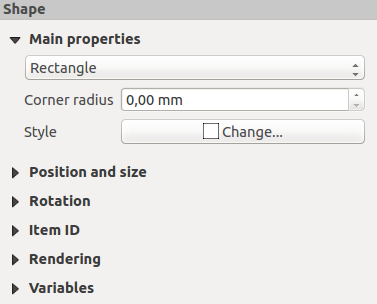

The Shape Items
===============

.. only:: html

   .. contents::
      :local:

QGIS provides a couple of tools to draw regular or more complex shapes over the
print layout.

.. note::
   Unlike other print layout items, you can not style the frame nor the
   background color of the shapes bounding frame (set to transparent by default).

.. index:: 
   single: Layout item; Basic shape
.. _layout_basic_shape_item:

The Regular Shape Item
----------------------

The :guilabel:`Shape` item is a tool that helps to decorate your map with regular
shapes like triangle, rectangle, ellipse...
You can add a regular shape using the |addBasicShape| :sup:`Add Shape` tool which
gives access to particular tools like |addBasicRectangle| :sup:`Add Rectangle`,
|addBasicCircle| :sup:`Add Ellipse` and |addBasicTriangle| :sup:`Add Triangle`.
Once you have selected the appropriate tool, you can draw the item following
:ref:`items creation instructions <create_layout_item>`. Like other layout
items, a regular shape can be manipulated the same way as exposed in
:ref:`interact_layout_item`.

.. note:: Holding down the :kbd:`Shift` key while drawing the basic shape with
 the click and drag method helps you create a perfect square, circle or triangle.

The default shape item can be customized using its :guilabel:`Item Properties`
panel. Other than the :ref:`items common properties <item_common_properties>`,
this feature has the following functionalities (see :numref:`figure_layout_basic_shape`):

.. _figure_layout_basic_shape:

   Shape Item Properties Panel

The :guilabel:`Main properties` group shows and allows you to switch the type of
the shape item (**Ellipse**, **Rectangle** or **Triangle**) inside the given frame.

You can set the style of the shape using the advanced :ref:`symbol <symbol-selector>`
and :ref:`color <color-selector>` selector widget...

For the rectangle shape, you can set in different units the value of the
:guilabel:`Corner radius` to round of the corners.

.. index::
   single: Layout item; Node-based shape
.. _layout_node_based_shape_item:

The Node-Based Shape Items
--------------------------

While the |addBasicShape| :guilabel:`Add Shape` tool provides way to create
simple and predefined geometric item, the |addNodesShape| :guilabel:`Add Node
Item` tool helps you create a custom and more advanced geometric item. For
polylines or polygons, you can draw as many lines or sides as you want and
vertices of the items can be independently and directly manipulated using the
|editNodesShape| :guilabel:`Edit Nodes Item`. The item itself can be manipulated
as exposed in :ref:`interact_layout_item`.

To add a node-based shape:

#. Click the |addNodesShape| :sup:`Add Node Item` icon
#. Select either |addPolygon| :sup:`Add Polygon` or |addPolyline| :sup:`Add
   Polyline` tool
#. Perform consecutive left clicks to add nodes of your item.
   If you hold down the :kbd:`Shift` key while drawing a segment, it is
   constrained to follow an orientation multiple of 45\ |degrees|.
#. When you're done, right-click to terminate the shape.

You can customize the appearance of the shape in the :guilabel:`Item Properties`
panel.

.. _figure_layout_nodes_shape:

.. figure:: img/shape_nodes_properties.png
   :align: center

   Polygon Node Shape Item Properties Panel

In the :guilabel:`Main properties`, you can set the style of the shape using
the advanced :ref:`symbol <symbol-selector>` and :ref:`color <color-selector>`
selector widget...

For polyline node items, you can also parameterize the :guilabel:`Line markers`
i.e. add:

* start and/or end markers with options:

  * :guilabel:`None`: draws a simple polyline.
  * :guilabel:`Arrow`: adds a regular triangular arrow head that you can
    customize.
  * :guilabel:`SVG` marker: uses an :file:`SVG` file as arrow head of the
    item.
* customize the arrow head:

  * :guilabel:`Arrow stroke color`: sets the stroke color of the arrow head.
  * :guilabel:`Arrow fill color`: sets the fill color of the arrow head.
  * :guilabel:`Arrow stroke width`: sets the stroke width of the arrow head.
  * :guilabel:`Arrow head width`: sets the size of the arrow head.

SVG images are automatically rotated with the line. Stroke and fill colors of
QGIS predefined SVG images can be changed using the corresponding options. Custom
SVG may require some tags following this :ref:`instruction <parameterized_svg>`.

.. _figure_layout_arrow:

.. figure:: img/arrow_properties.png
   :align: center

   Polyline Node Shape Item Properties Panel

.. index:: 
   single: Layout item; Arrow
.. _layout_arrow_item:

The Arrow Item
..............

The |addArrow| :sup:`Add Arrow` tool is a shortcut to create an arrow-enabled
polyline by default and thus has the same properties and behavior as a
:ref:`polyline node item <layout_node_based_shape_item>`.

Actually, the arrow item can be used to add a simple arrow, for example, to
show the relation between two different print layout items. However, to create
a north arrow, the :ref:`image item <layout_picture_item>` should be considered
first as it gives access to a set of north arrows in :file:`.SVG` format that
you can sync with a map item so that it rotates automatically with it.

Editing a node item geometry
............................

A specific tool is provided to edit node-based shapes through
|editNodesShape| :sup:`Edit Nodes Item`. Within this mode, you can select
a node by clicking on it (a marker is displayed on the selected node). A
selected node can be moved either by dragging it or by using the arrow keys.
Moreover, in this mode, you are able to add nodes to an existing shape:
double-click on a segment and a node is added at the place you click.
Finally, you can remove the currently selected node by
hitting the :kbd:`Del` key.

.. Substitutions definitions - AVOID EDITING PAST THIS LINE
   This will be automatically updated by the find_set_subst.py script.
   If you need to create a new substitution manually,
   please add it also to the substitutions.txt file in the
   source folder.

.. |addArrow| image:: /static/common/mActionAddArrow.png
   :width: 1.5em
.. |addBasicCircle| image:: /static/common/mActionAddBasicCircle.png
   :width: 1.5em
.. |addBasicRectangle| image:: /static/common/mActionAddBasicRectangle.png
   :width: 1.5em
.. |addBasicShape| image:: /static/common/mActionAddBasicShape.png
   :width: 1.5em
.. |addBasicTriangle| image:: /static/common/mActionAddBasicTriangle.png
   :width: 1.5em
.. |addNodesShape| image:: /static/common/mActionAddNodesShape.png
   :width: 1.5em
.. |addPolygon| image:: /static/common/mActionAddPolygon.png
   :width: 1.5em
.. |addPolyline| image:: /static/common/mActionAddPolyline.png
   :width: 1.5em
.. |degrees| unicode:: 0x00B0
   :ltrim:
.. |editNodesShape| image:: /static/common/mActionEditNodesShape.png
   :width: 1.5em
