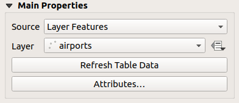
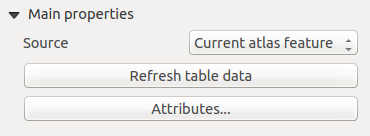
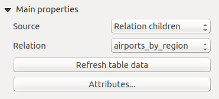
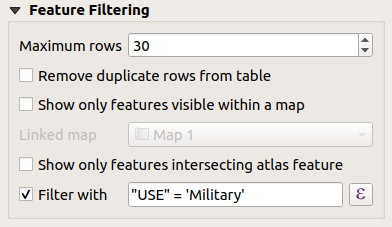
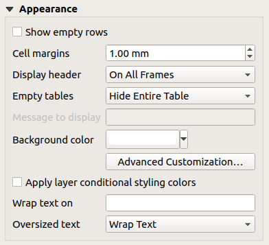
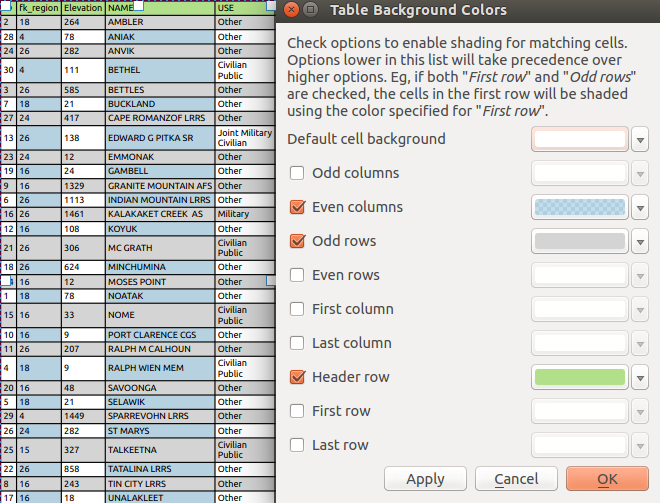
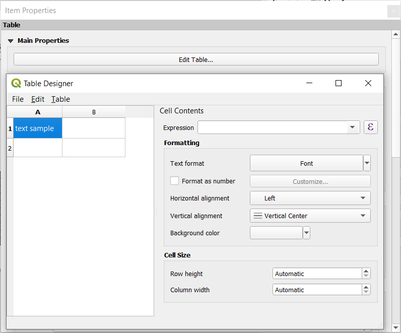
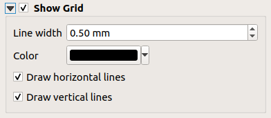
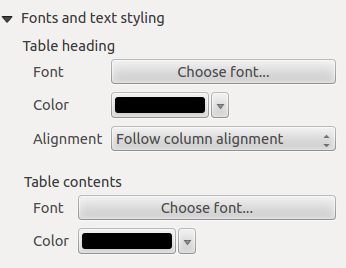

.. index:: Table items
.. _layout_table_item:

The Table Items
===============

.. only:: html

   .. contents::
      :local:

You can use table items to decorate and explain your map:

* :ref:`Attribute table <layout_attribute_table_item>`: shows a subset of the
  attributes of a layer, based on predefined rules
* :ref:`Fixed table <layout_fixed_table_item>`: inserts a
  manual text table where information can be independent from the layers.

.. _layout_attribute_table_item:

The attribute table item
------------------------

Any layer in the project can have its attributes shown in the print layout.
Use the |addTable| :guilabel:`Add Attribute Table` tool following :ref:`items
creation instructions <create_layout_item>` to add a new table item that you can
later manipulate the same way as exposed in :ref:`interact_layout_item`.

By default, a new attribute table item loads first rows of the first
(alphabetically sorted) layer, with all the fields. You can however customize
the table thanks to its :guilabel:`Item Properties` panel. Other than the
:ref:`items common properties <item_common_properties>`, this feature has the
following functionalities (see :numref:`figure_layout_table`):

.. _figure_layout_table:

.. figure:: img/attribute_properties.png
   :align: center

   Attribute table Item Properties Panel

Main properties
...............

The :guilabel:`Main properties` group of the attribute table provides the
following functionalities (see :numref:`figure_layout_table_ppt`):

.. _figure_layout_table_ppt:

   Attribute table Main properties Group

* For :guilabel:`Source` you can by default only select **Layer features**
  allowing you to select a :guilabel:`Layer` from the vector layers loaded in
  the project.

  The |dataDefine| :sup:`Data-defined override` button near the layer list
  allows you to dynamically change the layer which is used to populate the table,
  e.g. you could fill the attribute table with different layer attributes per
  atlas page.
  Note that the table structure used (:numref:`figure_layout_table_select`)
  is the one of the layer shown in the :guilabel:`Layer` drop-down list and it is
  left intact, meaning that setting a data defined table to a layer with different
  field(s) will result in empty column(s) in the table.

  In case you activate the |checkbox|:guilabel:`Generate an atlas` option in
  the :guilabel:`Atlas` panel (see :ref:`atlas_generation`), there are
  two additional :guilabel:`Source` possible:

  * **Current atlas feature** (see :numref:`figure_layout_table_atlas`): you won't see
    any option to choose the layer, and the table item will only show a row with
    the attributes from the current feature of the atlas coverage layer.
  * and **Relation children** (see :numref:`figure_layout_table_relation`): an option
    with the relation names will show up. This feature can only be used if you
    have defined a :ref:`relation <vector_relations>` using your atlas coverage
    layer as parent, and the table will show the children rows of the atlas
    coverage layer's current feature.

* The button :guilabel:`Refresh Table Data` can be used to refresh the table when the
  actual contents of the table has changed.

.. _figure_layout_table_atlas:

   Attribute table Main properties for 'Current atlas feature'

.. _figure_layout_table_relation:

   Attribute table Main properties for 'Relation children'

* The button :guilabel:`Attributes...` starts the :guilabel:`Select Attributes` dialog,
  (see :numref:`figure_layout_table_select`) that can be used to change the visible
  contents of the table. The upper part of the window shows the list of the
  attributes to display and the lower part helps you sort the data.

  .. _figure_layout_table_select:

  .. figure:: img/attribute_select.png
     :align: center

     Attribute table Select attributes Dialog

  In the :guilabel:`Columns` section you can:

  * Move attributes up or down the list by selecting the rows and then using the
    |arrowUp| and |arrowDown| buttons to shift the rows. Multiple rows can
    be selected and moved at any one time.
  * Add an attribute with the |symbologyAdd| button. This will add an empty row at
    the bottom of the table where you can select a field to be the attribute
    value or create an attribute via a regular expression.
  * Remove an attribute with the |symbologyRemove| button. Multiple rows can be
    selected and removed at any one time.
  * Reset the attribute table back to its default state with the :guilabel:`Reset` button.
  * Clear the table using the :guilabel:`Clear` button. This is useful when you have a
    large table but only want to show a small number of attributes. Instead of
    manually removing each row, it may be quicker to clear the table and add
    the rows needed.
  * Cell headings can be altered by adding the custom text in the :guilabel:`Heading` column.
  * Cell alignment can be managed with the :guilabel:`Alignment` column which will
    dictate the texts position within the table cell.
  * Cell width can be manually managed by adding custom values to the :guilabel:`width` column.

  In the :guilabel:`Sorting` section you can:

  * Add an attribute to sort the table with: press the |symbologyAdd| button and a new empty
    row is added. Insert a field or an expression in the :guilabel:`Attribute` column and
    set the :guilabel:`Sort order` to **Ascending** or **Descending**.
  * Select a row in the list and use the |arrowUp| and |arrowDown| buttons to
    change the sort priority on attribute level. Selecting a cell in the
    :guilabel:`Sort Order` column helps you change the sorting order of the
    attribute field.
  * Use the |symbologyRemove| button to remove an attribute from the sorting list.

Feature filtering
.................

The :guilabel:`Feature filtering` group of the attribute table provides
the following functionalities (see :numref:`figure_layout_table_filter`):

.. _figure_layout_table_filter:

   Attribute table Feature filtering Group

You can:

* Define the :guilabel:`Maximum rows` to be displayed.
* Activate |checkbox| :guilabel:`Remove duplicate rows from table` to show unique records only.
* Activate |checkbox| :guilabel:`Show only visible features within a map` and select the
  corresponding :guilabel:`Linked map` whose visible features attributes will be displayed.
* Activate |checkbox| :guilabel:`Show only features intersecting Atlas feature` is only
  available when |checkbox| :guilabel:`Generate an atlas` is activated. When activated it will
  show a table with only the features which intersect the current atlas feature.
* Activate |checkbox| :guilabel:`Filter with` and provide a filter by typing in the input line
  or insert a regular expression using the given |expression| expression button.
  A few examples of filtering statements you can use when you have loaded the airports
  layer from the Sample dataset:

  * ``ELEV > 500``
  * ``NAME = 'ANIAK'``
  * ``NAME NOT LIKE 'AN%'``
  * ``regexp_match( attribute( $currentfeature, 'USE' )  , '[i]')``

  The last regular expression will include only the airports that have a letter 'i'
  in the attribute field 'USE'.

Appearance
..........

The :guilabel:`Appearance` group of the attribute table provides
the following functionalities (see :numref:`figure_layout_table_appearance`):

.. _figure_layout_table_appearance:

   Attribute table appearance Group

* Click |checkbox| :guilabel:`Show empty rows` to fill the attribute table with empty cells.
  This option can also be used to provide additional empty cells when you have a result to show!
* With :guilabel:`Cell margins` you can define the margin around text in each cell of the table.
* With :guilabel:`Display header` you can select from a list one of 'On first frame',
  'On all frames' default option, or 'No header'.
* The option :guilabel:`Empty table` controls what will be displayed when the result selection is empty.

  * **Draw headers only**, will only draw the header except if you have chosen
    'No header' for :guilabel:`Display header`.
  * **Hide entire table**, will only draw the background of the table. You can
    activate |checkbox| :guilabel:`Don't draw background if frame is empty` in :guilabel:`Frames`
    to completely hide the table.
  * **Show set message**, will draw the header and adds a cell spanning all columns and
    display a message like 'No result' that can be provided in the option :guilabel:`Message to display`

* The option :guilabel:`Message to display` is only activated when you have selected
  **Show set message** for :guilabel:`Empty table`. The message provided will be shown in
  the table in the first row, when the result is an empty table.
* With :guilabel:`Background color` you can set the background color of the table using
  the :ref:`color selector <color-selector>` widget.
  The :guilabel:`Advanced customization` option helps you define different background colors
  for each cell (see :numref:`figure_layout_table_background`)

.. _figure_layout_table_background:

   Attribute table Advanced Background Dialog

* |checkbox| :guilabel:`Apply layer conditional styling colors`:
  the :ref:`conditional table formatting <conditional_formatting>` present
  in the layer is applied inside the layout attribute table (*only background
  and foreground colors are currently supported*). Conditional formatting rules
  take precedence over other layout table formatting settings,
  e.g. they will override other cell background color settings such as
  alternating row colors.
* With the :guilabel:`Wrap text on` option, you can define a character on which
  the cell content will be wraped each time it is met
* With :guilabel:`Oversized text` you define the behavior when the width set for
  a column is  smaller than its content's length. It can be **Wrap text** or
  **Truncate text**.

.. note:: More properties of the attribute table item are described in the
   :ref:`tables_common_properties` section.

.. _layout_fixed_table_item:

The fixed table item
--------------------

Additional information about the map can be inserted manually into a table by
choosing |addManualTable| :guilabel:`Add Fixed Table` and by following :ref:`items
creation instructions <create_layout_item>` to add a new table item that you can
later manipulate the same way as exposed in :ref:`interact_layout_item`.

By default, an empty table with two minimized columns and rows appears in
the map layout. You have to customize the table in the :guilabel:`Item Properties` panel.
Other than the :ref:`items common properties <item_common_properties>`, this feature has
the following functionalities:

Main properties
...............

.. _figure_table_designer_fixed_table:

   Fixed table Item Properties Panel with Table designer

In :guilabel:`Main properties` you can work with the :guilabel:`Table designer`
when clicking the :guilabel:`Edit table ...`:

* You can click into the table and insert texts manually.
* Through the menus on top it is possible to:

  * :guilabel:`Import Content From Clipboard` by going to :guilabel:`File`
    (it overrides given inputs).
  * work with selection functionalities for rows and columns by going
    to :guilabel:`Edit`.
  * :guilabel:`Insert rows`, :guilabel:`Insert columns`,
    :guilabel:`Delete Rows`, :guilabel:`Delete Columns` as well as
    using the option to |checkbox| :guilabel:`Include Header Row`.

* You can work with the :guilabel:`Cell Contents` section on the right and:

  * Define the text format of selected cells in :guilabel:`Formatting`

    * by clicking on the given |expression| expression button and using a
      regular expression for the input of the cell
    * by choosing the :guilabel:`Text format`
    * by |checkbox| :guilabel:`Format as number` (several formats are available)
    * by defining the :guilabel:`Horizontal alignment` and the
      :guilabel:`Vertical alignment`
    * by choosing a :guilabel:`Background color`

  * Define the :guilabel:`Cell Size` with :guilabel:`Row height` and
    :guilabel:`Column width`.

Appearance
..........

The :guilabel:`Appearance` group of the fixed table provides the following functionalities:

* Click |checkbox| :guilabel:`Show empty rows` to fill the attribute table with empty cells.
* With :guilabel:`Cell margins` you can define the margin around text in each cell of the table.
* With :guilabel:`Display header` you can select from a list one of 'On first frame',
  'On all frames' default option, or 'No header'.
* With :guilabel:`Background color` you can set the background color of the table using
  the :ref:`color selector <color-selector>` widget. The :guilabel:`Advanced customization`
  option helps you define different background colors for each cell.
* With :guilabel:`Oversized text` you define the behavior when the width set for
  a column is  smaller than its content's length. It can be **Wrap text** or
  **Truncate text**.

.. note:: More properties of the fixed table item are described in the
   :ref:`tables_common_properties` section.

.. _tables_common_properties:

Tables common functionalities
-----------------------------

Show grid
.........

The :guilabel:`Show grid` group of the table items provides
the following functionalities (see :numref:`figure_layout_table_grid`):

.. _figure_layout_table_grid:

   Attribute table Show grid Group

* Activate |checkbox| :guilabel:`Show grid` when you want to display the grid,
  the outlines of the table cells. You can also select to either :guilabel:`Draw
  horizontal lines` or :guilabel:`Draw vertical lines` or both.
* With :guilabel:`Line width` you can set the thickness of the lines used in the grid.
* The :guilabel:`Color` of the grid can be set using the color selection widget.

Fonts and text styling
......................

The :guilabel:`Fonts and text styling` group of the table items
provides the following functionalities (see :numref:`figure_layout_table_fonts`):

.. _figure_layout_table_fonts:

   Attribute table Fonts and text styling Group

* You can define :guilabel:`Font` properties for :guilabel:`Table heading` and
  :guilabel:`Table contents`, using the advanced :ref:`text settings <text_format>`
  widget (with buffer, shadow, paint effects, transparence, background, coloring, ...).
  Note that these changes do not affect the cells that have custom font assigned,
  either from the :guilabel:`Appearance` section or the :guilabel:`Table Designer`
  dialog. Only cells with the default rendering are overwritten. 
* For :guilabel:`Table heading` you can additionally set the :guilabel:`Alignment`
  to ``Follow column alignment`` or override this setting by choosing ``Left``,
  ``Center`` or ``Right``. The column alignment is set using the :guilabel:`Select
  Attributes` dialog (see :numref:`figure_layout_table_select` ).

Frames
......

The :guilabel:`Frames` group of the table item properties provides
the following functionalities (see :numref:`figure_layout_table_frames`):

.. _figure_layout_table_frames:

.. figure:: img/attribute_frame.png
   :align: center

   Attribute table Frames Group

* With :guilabel:`Resize mode` you can select how to render the attribute table
  contents:

  * ``Use existing frames`` displays the result in the first frame and added frames only.
  * ``Extend to next page`` will create as many frames (and corresponding pages)
    as necessary to display the full selection of attribute table. Each frame
    can be moved around on the layout. If you resize a frame, the resulting table
    will be divided up between the other frames. The last frame will be trimmed
    to fit the table.
  * ``Repeat until finished`` will also create as many frames as the `Extend to
    next page` option, except all frames will have the same size.

* Use the :guilabel:`Add Frame` button to add another frame with the same size as
  selected frame. The result of the table that will not fit in the first frame
  will continue in the next frame when you use the Resize mode ``Use existing frames``.
* Activate |checkbox| :guilabel:`Don't export page if frame is empty` prevents
  the page to be exported when the table frame has no contents. This means all
  other layout items, maps, scalebars, legends etc. will not be visible in the result.
* Activate |checkbox| :guilabel:`Don't draw background if frame is empty`
  prevents the background to be drawn when the table frame has no contents.

.. Substitutions definitions - AVOID EDITING PAST THIS LINE
   This will be automatically updated by the find_set_subst.py script.
   If you need to create a new substitution manually,
   please add it also to the substitutions.txt file in the
   source folder.

.. |addManualTable| image:: /static/common/mActionAddManualTable.png
   :width: 1.5em
.. |addTable| image:: /static/common/mActionAddTable.png
   :width: 1.5em
.. |arrowDown| image:: /static/common/mActionArrowDown.png
   :width: 1.5em
.. |arrowUp| image:: /static/common/mActionArrowUp.png
   :width: 1.5em
.. |checkbox| image:: /static/common/checkbox.png
   :width: 1.3em
.. |dataDefine| image:: /static/common/mIconDataDefine.png
   :width: 1.5em
.. |expression| image:: /static/common/mIconExpression.png
   :width: 1.5em
.. |symbologyAdd| image:: /static/common/symbologyAdd.png
   :width: 1.5em
.. |symbologyRemove| image:: /static/common/symbologyRemove.png
   :width: 1.5em
