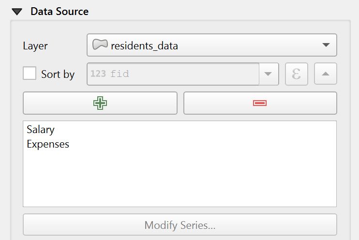

.. index:: Layout; Chart item
.. _layout_chart_item:

The Chart Item
==============

.. only:: html

   .. contents::
      :local:

The Chart item is used to display data as a chart within the
layout. You can add a chart using the |addChart| :guilabel:`Add Chart`
button following :ref:`items creation instructions <create_layout_item>`.
You can manipulate it the same way as exposed in :ref:`interact_layout_item`.
By default, a new Chart item is empty.
You can set the data source and customize its appearance in the
:guilabel:`Item Properties` panel.
In addition to the
:ref:`common properties <item_common_properties>`, this feature
has the following functionalities (:numref:`figure_layout_chart_prop`):

.. _figure_layout_chart_prop:

   Chart Item Properties

.. _`layout_chart_mainproperties`:

Main properties
---------------

The :guilabel:`Main Properties` group of the chart :guilabel:`Item Properties`
panel provides the following functionalities (see :numref:`figure_layout_chart_ppt`):

.. _figure_layout_chart_ppt:

.. figure:: img/chart_mainproperties.png
   :align: center
   :width: 20em

   Chart Main Properties group

In the :guilabel:`Main Properties` you can select the :guilabel:`Chart type` from the drop-down list.
Available types are:

* :guilabel:`Bar chart`,
* :guilabel:`Line chart`,
* and :guilabel:`Pie chart`.

Modify the chart through the :guilabel:`Modify Chart Properties...` button.
Depending on the selected type, available options may vary.

.. _layout_chart_ranges:

Chart Ranges
.............

Set the minimum and maximum values for the axes to determine
how the data is displayed. By default, the :guilabel:`Minimum X axis`
and :guilabel:`Minimum Y axis` are set to 0, while the :guilabel:`Maximum X axis`
and :guilabel:`Maximum Y axis` are set to 10. 
You can adjust these values to fit your data range and improve the chart's readability.
For pie charts, these options are not available.

.. _layout_chart_symbols:

Symbols List
.............

The :guilabel:`Symbols List` allows you to customize the appearance of each data
series in the chart. You can change the color, shape, pattern, or
other visual properties for individual series to improve readability
and match your layout style.

.. note:: **Symbol and color assignment**

   For bar and line charts, symbols are assigned to series in the order they are listed.
   Make sure to have at least as many symbols as data series; otherwise,
   the last series will reuse the last available symbol.
   
   For pie charts, colors are assigned to slices following the order
   defined by the color ramp rather than the series.
   If you use a discrete color ramp,
   ensure it contains enough distinct colors for all slices.
   Otherwise, some slices may share the same color.

.. _layout_chart_axes:

Axes
.....

For the :guilabel:`X Axis` and :guilabel:`Y Axis`, the following can be set:

* :guilabel:`Axis type`: choose between :guilabel:`Interval` and
  :guilabel:`Categorical` axis types. If your X axis contains string values
  (e.g. category names like "A", "B", "C"),
  make sure to set the axis type to :guilabel:`Categorical`.
  Otherwise, the chart may not display correctly.
* :guilabel:`Major interval`: defines the primary spacing between axis lines.
* :guilabel:`Major grid lines`: customizes the appearance of major grid lines.
* :guilabel:`Minor interval`: defines the secondary, smaller spacing between axis lines.
* :guilabel:`Minor grid lines`: customizes the appearance of minor grid lines.
* :guilabel:`Label interval`: sets how frequently labels appear along the axis.
* :guilabel:`Label format`: customizes the label appearance, including
  number formatting.
* :guilabel:`Label font`: sets the font style and size for axis labels.
* :guilabel:`Label placement`: determines where labels are positioned relative to the axis.

.. _layout_chart_area:

Chart Area
...........

Further customization of the chart appearance can be done
in the :guilabel:`Chart Area`. You can set the background color,
border style, and margin.

If you select the :guilabel:`Pie chart` type, you can
set the label type, font, and numerical format.
The :guilabel:`Label type` defines what kind of information is displayed on each pie slice.
It can be set to:

- **None**: no labels are shown.
- **Category label**: displays the category name for each slice.
- **Value label**: displays the numerical value associated with each category.

Configure the margin to adjust the spacing around the pie chart.

.. _`layout_chart_datasource`:

Data source
-----------

In this section, select and configure the layer and fields you want to display in the chart.

#. Select the :guilabel:`Layer` to use as the chart’s data source.
#. Check the |checkbox| :guilabel:`Sort by` option to sort data based on selected fields or expressions, 
   and choose the sort direction (ascending or descending).
#. Use the |add| and |remove| buttons to add or delete series from the chart.
#. Double-click a series name to rename it.
#. Click :guilabel:`Modify Series...` button and define the :guilabel:`X-axis` and :guilabel:`Y-axis` fields using the drop-down lists.
   Optionally, add a filter expression to display only specific data in the chart.

   Chart Data Source group

.. Substitutions definitions - AVOID EDITING PAST THIS LINE
   This will be automatically updated by the find_set_subst.py script.
   If you need to create a new substitution manually,
   please add it also to the substitutions.txt file in the
   source folder.

.. |addChart| image:: /static/common/mActionAddChart.png
   :width: 1.5em
.. |checkbox| image:: /static/common/checkbox.png
   :width: 1.3em
.. |remove| image:: /static/common/symbologyRemove.png
   :width: 1.5em
.. |add| image:: /static/common/symbologyAdd.png
   :width: 1.5em