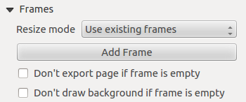
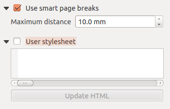

.. index:: HTML frame
.. _layout_html_item:

The HTML Frame Item
====================

.. only:: html

   .. contents::
      :local:

It is possible to add a frame that displays the contents of a website or even
create and style your own HTML page and display it!
You can add a picture with the |addHtml| :guilabel:`Add HTML` following
:ref:`items creation instructions <create_layout_item>` and manipulate it the
same way as exposed in :ref:`interact_layout_item`. Note that the HTML scale is
controlled by the layout export resolution at the time the HTML frame is created.

The HTML item can be customized using its :guilabel:`Item Properties` panel.
Other than the :ref:`items common properties <item_common_properties>`, this
feature has the following functionalities (see :numref:`figure_layout_html`):

.. _figure_layout_html:

.. figure:: img/html_properties.png
   :align: center

   HTML Frame, the Item Properties Panel

HTML Source
------------

The :guilabel:`HTML Source` group of the HTML frame :guilabel:`Item Properties`
panel provides the following functionalities (see :numref:`figure_layout_html_ppt`):

.. _figure_layout_html_ppt:

.. figure:: img/html_source.png
   :align: center

   HTML frame, the HTML Source properties

* In :guilabel:`URL` you can enter the URL of a webpage you copied from your
  Internet browser or select an HTML file using the :guilabel:`...` :sup:`Browse`
  button. There is also the option to use the |dataDefine| :sup:`Data-defined
  override` button, to provide a URL from the contents of an attribute field of
  a table or using a regular expression.
* In :guilabel:`Source` you can enter text in the textbox with some HTML tags or
  provide a full HTML page.
* The :guilabel:`Insert or Edit an Expression...` button can be used to add an
  expression like ``[%Year($now)%]`` in the Source textbox to display the current year.
  This button is only activated when radiobutton :guilabel:`Source` is selected.
  After inserting the expression click somewhere in the textbox before
  refreshing the HTML frame, otherwise you will lose the expression.
* Activate |checkbox| :guilabel:`Evaluate QGIS expressions in HTML code` to see
  the result of the expression you have included, otherwise you will see the
  expression instead.
* Use the :guilabel:`Refresh HTML` button to refresh the HTML frame(s) and see the
  result of changes.

Frames
-------

The :guilabel:`Frames` group of the HTML frame :guilabel:`Item Properties`
panel provides the following functionalities (see :numref:`figure_layout_html_frames`):

.. _figure_layout_html_frames:

   HTML frame, the Frames properties

* With :guilabel:`Resize mode` you can select how to render the HTML contents:

  * ``Use existing frames`` displays the result in the first frame and added
    frames only.
  * ``Extend to next page`` will create as many frames (and corresponding pages)
    as necessary to render the height of the web page. Each frame can be moved
    around on the layout. If you resize a frame, the webpage will be divided up
    between the other frames. The last frame will be trimmed to fit the web page.
  * ``Repeat on every page`` will repeat the upper left of the web page on every
    page in frames of the same size.
  * ``Repeat until finished`` will also create as many frames as the
    ``Extend to next page`` option, except all frames will have the same size.

* Use the :guilabel:`Add Frame` button to add another frame with the same size as
  selected frame. If the HTML page does not fit in the first frame it will
  continue in the next frame when you use :guilabel:`Resize mode` or
  :guilabel:`Use existing frames`.
* Activate |checkbox| :guilabel:`Don't export page if frame is empty` prevents
  the page from being exported when the frame has no HTML contents. This
  means all other layout items,
  maps, scale bars, legends etc. will not be visible in the result.
* Activate |checkbox| :guilabel:`Don't draw background if frame is empty`
  prevents the HTML frame being drawn if the frame is empty.

Use smart page breaks and User style sheet
-------------------------------------------

The :guilabel:`Use smart page breaks` dialog and :guilabel:`User style sheet`
dialog of the HTML frame :guilabel:`Item Properties` panel provides the
following functionalities (see :numref:`figure_layout_html_breaks`):

.. _figure_layout_html_breaks:

   HTML frame, Use smart page breaks and User style sheet properties

* Activate |checkbox| :guilabel:`Use smart page breaks` to prevent the html
  frame contents from breaking mid-way a line of text so it continues nice and
  smooth in the next frame.
* Set the :guilabel:`Maximum distance` allowed when calculating where to place
  page breaks in the html. This distance is the maximum amount of empty space
  allowed at the bottom of a frame after calculating the optimum break location.
  Setting a larger value will result in better choice of page break location,
  but more wasted space at the bottom of frames. This is only used when
  :guilabel:`Use smart page breaks` is activated.
* Activate |checkbox| :guilabel:`User style sheet` to apply HTML styles that
  often is provided in cascading style sheets. An example of style code is
  provided below to set the color of ``<h1>`` header tag to green and set the
  font and font size of text included in paragraph tags ``
``.

  .. code-block:: css

     h1 {color: #00ff00;
     }
     p {font-family: "Times New Roman", Times, serif;
        font-size: 20px;
     }

* Use the :guilabel:`Update HTML` button to see the result of the style sheet settings.

.. Substitutions definitions - AVOID EDITING PAST THIS LINE
   This will be automatically updated by the find_set_subst.py script.
   If you need to create a new substitution manually,
   please add it also to the substitutions.txt file in the
   source folder.

.. |addHtml| image:: /static/common/mActionAddHtml.png
   :width: 1.5em
.. |checkbox| image:: /static/common/checkbox.png
   :width: 1.3em
.. |dataDefine| image:: /static/common/mIconDataDefine.png
   :width: 1.5em
