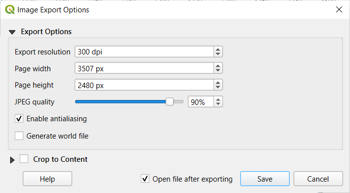
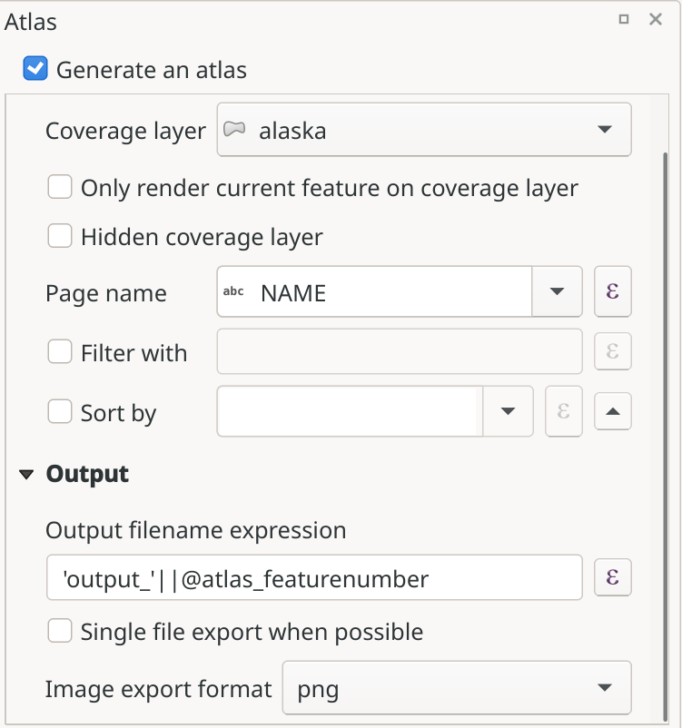

.. index::
   single: Printing; Export map

.. _create-output:

*******************
 Creating an Output
*******************

.. only:: html

   .. contents::
      :local:

:numref:`figure_layout_output` shows an example print layout
including all the types of layout items described in the previous
section.

.. _figure_layout_output:

.. figure:: img/print_composer_complete.png
   :align: center
   :width: 100%

   Print Layout with map view, legend, image, scale bar, coordinates, text and
   HTML frame added

.. index:: Export as image, Export as PDF, Export as SVG

From the :menuselection:`Layout` menu or toolbar, you can output the print
layout to different file formats, and it is possible to modify the resolution
(print quality) and paper size:

* The |filePrint| :sup:`Print` icon allows you to print the layout to a
  connected printer or a PostScript file, depending on the installed printer
  drivers.
* The |saveMapAsImage| :sup:`Export as image` icon exports the print layout
  image formats such as :file:`PNG`, :file:`BMP`, :file:`TIF`, :file:`JPG`,
  and many others...
* The |saveAsSVG| :sup:`Export as SVG` icon saves the print layout
  as an :file:`SVG` (Scalable Vector Graphic).
* The |saveAsPDF| :sup:`Export as PDF` icon saves the defined print layout
  directly as a :file:`PDF` (Portable Document Format) file.

Export settings
===============

Whenever you export a print layout, there are a selection of export settings QGIS needs
to check in order to produce the most appropriate output. These configurations
are:

* The :ref:`Export settings <layout_export_settings>` of the :guilabel:`Layout`
  panel, such as :guilabel:`Export resolution`, :guilabel:`Print as raster`
  :guilabel:`Always export as vectors` or :guilabel:`Save world file`
* :guilabel:`Exclude page from exports` in the :ref:`page item properties
  <page_properties>` panel
* :guilabel:`Exclude item from exports` in the :ref:`item properties
  <layout_Rendering_Mode>` panel

Moreover, a number of predefined checks are automatically applied to the layout.
Currently these checks include testing that scalebars are correctly linked to map items,
and that map overview items are also correctly linked to a map.
If the checks fail, you are shown a nice warning advising you of the issue.

.. _export_layout_image:

Export as Image
===============

To export a layout as an image:

#. Click the |saveMapAsImage| :sup:`Export as image` icon
#. Select the image format, the folder and filename (e.g. :file:`myill.png`)
   to use.
   If the layout contains more than one page, each page will be exported to
   a file with the given filename with the page number appended
   (e.g. :file:`myill_2.png`).
#. In the next (:guilabel:`Image Export Options`) dialog:

   * You can override the print layout :guilabel:`Export resolution` and the
     exported page dimensions (as set in :guilabel:`Layout` panel).
   * Image rendering can also be improved with the :guilabel:`Enable
     antialiasing` option.
   * If you want to export your layout as a **georeferenced image** (e.g., to
     share with other projects), check the |unchecked| :guilabel:`Generate
     world file` option, and an *ESRI World File* with the same name as the
     exported image, but a different extension (:file:`.tfw` for TIFF,
     :file:`.pnw` for PNG, :file:`jgw` for JPEG, ...) will be created when
     exporting.
     This option can also be checked by default in the :ref:`layout panel
     <layout_panel>`.

     .. note::
        For multi-page output, only the page that contains the
        :ref:`reference map <reference_map>` will get a world file (assuming that the
        :guilabel:`Generate world file` option is checked).

   .. index:: Crop layout to content
   .. _crop_to_content:

   * By checking |checkbox| :guilabel:`Crop to content` option, the image output
     by the layout will include the minimal area enclosing all the items (map,
     legend, scale bar, shapes, label, image...) of each page of the composition:

     * If the composition includes a single page, then the output is resized to
       include EVERYTHING on the composition. The page can then be reduced or
       extended to all items depending on their position (on, above, below, left or
       right of the page).
     * In case of a multi-page layout, each page will be resized to include items in
       its area (left and right sides for all pages, plus top for the first page and
       bottom for the last page). Each resized page is exported to a separate file.

     The :guilabel:`Crop to content` dialog also lets you add margins around
     the cropped bounds.
  
   * By checking |checkbox| :guilabel:`Open file after exporting` the exported 
     file will automatically open in the default image viewer. 

.. _figure_layout_output_image:

   Image Export Options

.. tip::
   **Use image formats that support transparency when items extend
   beyond the paper extent**

   Layout items may be placed outside the paper extent. When exporting
   with the :guilabel:`Crop to content` option, the resulting
   image may therefore extend beyond the paper extent.
   Since the background outside of the paper extent will be transparent,
   for image  formats that do not support transparency
   (e.g. ``BMP`` and ``JPG``) the transparent background  will be
   rendered as full black, "corrupting" the image.
   Use transparency-compatible formats (e.g. ``TIFF`` and ``PNG``)
   in such cases.

.. note:: When supported by the format (e.g. :file:`PNG`) and the
   underlying Qt library, the exported image may include :ref:`project
   metadata <project_metadata>` (author, title, date, description...)

.. _export_layout_svg:

Export as SVG
=============

To export a layout as SVG:

#. Click the |saveAsSVG| :sup:`Export as SVG` icon
#. Fill in the path and filename (used as a base name for all the
   files in case of multi-page composition, as for image export)
#. In the next :guilabel:`SVG Export Options` dialog, you can override the
   layout default :ref:`export settings <layout_export_settings>` or configure
   new ones:

   * |unchecked| :guilabel:`Export map layers as SVG groups`: exported items are
     grouped within layers whose name matches the layer names from QGIS, making
     it much easier to understand the contents of the document.
   * |unchecked| :guilabel:`Always export as vectors`: some rendering options
     require items to be rasterized for a better rendering. Check this option to
     keep the objects as vectors with the risk that the appearance of the output
     file may not match the print layout preview (for more details, see
     :ref:`layout_export_settings`).
   * |checkbox| :guilabel:`Export RDF metadata` of the document such as the
     title, author, date, description...
   * |checkbox| :guilabel:`Simplify geometries to reduce output file size`: this
     avoids exporting ALL geometry vertices, which can result in a ridiculously
     complex and large export file size that could fail to load in other applications.
     Geometries will be simplified while exporting the layout in order to remove
     any redundant vertices which are not discernably different at the export
     resolution (e.g. if the export resolution is ``300 dpi``, vertices that are
     less than ``1/600 inch`` apart will be removed).
   * Set the :guilabel:`Text export`: controls whether text labels are exported
     as proper text objects (:guilabel:`Always export texts as text
     objects`) or as paths only (:guilabel:`Always export texts as paths`).
     If they are exported as text objects, they can be edited in external
     applications (e.g. Inkscape) as normal text. BUT the side effect is that
     the rendering quality is reduced, AND there are issues with rendering when
     certain text settings like buffers are in place. That’s why exporting as
     paths is recommended.
   * Apply |checkbox| :guilabel:`Crop to content` :ref:`option <crop_to_content>`
   * |unchecked| :guilabel:`Disable tiled raster layer exports`: When exporting
     files, QGIS uses a built-in raster layer tiled rendering that saves memory.
     Sometimes, this can cause visible "seams" in the rasters
     for generated files. Checking this option would fix that, at the cost of a
     higher memory usage during exports.
   * By checking |checkbox| :guilabel:`Open file after exporting` the exported 
     file will automatically open in the default SVG viewer. 

.. _figure_layout_output_svg:

.. figure:: img/svg_export_options.png
   :align: center

   SVG Export Options

.. note::

   Currently, the SVG output is very basic. This is not a QGIS problem, but a
   problem with the underlying Qt library. This will hopefully be sorted out
   in future versions.

.. _export_layout_pdf:

Export as PDF
=============

To export a layout as PDF:

#. Click the |saveAsPDF| :sup:`Export as PDF` icon
#. Fill in the path and filename: unlike for image and SVG export, all the
   pages in the layout are exported to a single PDF file.
#. In the next :guilabel:`PDF Export Options` dialog, you can override the
   layout default :ref:`export settings <layout_export_settings>` or configure
   new ones:

   * |unchecked| :guilabel:`Always export as vectors`: some rendering options
     require items to be rasterized for a better rendering. Check this option to
     keep the objects as vectors with the risk that the appearance of the output
     file may not match the print layout preview (for more details, see
     :ref:`layout_export_settings`).
   * |checkbox| :guilabel:`Append georeference information`: available only if
     the :ref:`reference map <reference_map>`, from which the information is taken,
     is on the first page.
   * |checkbox| :guilabel:`Export RDF metadata` of the document such as the
     title, author, date, description...
   * Set the :guilabel:`Text export`: controls whether text labels are exported
     as proper text objects (:guilabel:`Always export texts as text
     objects`) or as paths only (:guilabel:`Always export texts as paths`).
     If they are exported as text objects then they can be edited in external
     applications (e.g. Inkscape) as normal text. BUT the side effect is that
     the rendering quality is decreased, AND there are issues with rendering when
     certain text settings like buffers are in place. That’s why exporting as
     paths is recommended.
   * Control the PDF :guilabel:`Image compression` using:
   
     * :guilabel:`Lossy (JPEG)`, which is the default compression mode
     * or :guilabel:`Lossless`, which creates bigger files in most cases, but is
       much more suitable for printing outputs or for post-production in external
       applications (requires Qt 5.13 or later).
   * |unchecked| :guilabel:`Create Geospatial PDF (GeoPDF)`:
     Generate a georeferenced PDF file.
   * |unchecked| :guilabel:`Disable tiled raster layer exports`: When exporting
     files, QGIS uses tiled based rendering that saves memory.
     Sometimes, this can cause visible "seams" in the rasters for generated files.
     Checking this option would fix that, at the cost of a higher memory usage
     during exports.
   * |checkbox| :guilabel:`Simplify geometries to reduce output file size`:
     Geometries will be simplified while exporting the layout by removing
     vertices that are not discernably different at the export resolution
     (e.g. if the export resolution is ``300 dpi``, vertices that are less
     than ``1/600 inch`` apart will be removed).
     This can reduce the size and complexity of the export file (very large
     files can fail to load in other applications).
   * By checking |checkbox| :guilabel:`Open file after exporting` the exported 
     file will automatically open in the default PDF viewer.

.. _figure_layout_output_pdf:

.. figure:: img/pdf_export_options.png
   :align: center

   PDF Export Options

.. note:: GeoPDF export is supported, and a number of GeoPDF specific options
   are available:
   
   * :guilabel:`Format` (GeoPDF format - there are some GeoPDF variations),
   * :guilabel:`Include multiple map themes` (specify map themes to include),
   * :guilabel:`Include vector feature information` (choose the layers and
     group them into logical PDF groups).

.. note:: Exporting a print layout to formats that supports georeferencing
   (e.g. ``PDF`` and ``TIFF``) creates a georeferenced output by default.

.. index:: Atlas generation

.. _atlas_generation:

Generate an Atlas
=================

Atlas functions allow you to create map books in an automated way.
Atlas uses the features of a table or vector layer
(:guilabel:`Coverage layer`) to create an output for each feature
(**atlas feature**) in the table / layer.
The most common usage is to zoom a map item to the current atlas
feature.
Further use cases include:

* a map item showing, for another layer, only features that share the same
  attribute as the atlas feature or are within its geometry.
* a label or HTML item whose text is replaced as features are iterated over
* a table item showing attributes of associated :ref:`parent or children
  <vector_relations>` features of the current atlas feature...

For each feature, the output is processed for all pages and items according
to their exports settings.

.. tip:: **Use variables for more flexibility**

   QGIS provides a large panel of functions and
   :ref:`variables <general_tools_variables>`, including atlas related ones,
   that you can use to manipulate the layout items, but also the symbology of
   the layers, according to atlas status.
   Combining these features gives you a lot of flexibility and helps you
   easily produce advanced maps.

To enable the generation of an atlas and access atlas parameters, refer to
the :guilabel:`Atlas` panel. This panel contains the following
(see :numref:`figure_layout_atlas`):

.. _figure_layout_atlas:

   Atlas Panel

* |checkbox| :guilabel:`Generate an atlas` enables or disables atlas
  generation.
* :guilabel:`Configuration`

  * A :guilabel:`Coverage layer` |selectString| combo box that allows you to
    choose the table or vector layer containing the features to iterate over.
  * An optional |checkbox| :guilabel:`Hidden coverage layer` that, if checked,
    will hide the coverage layer (but not the other layers) during the generation.
  * An optional :guilabel:`Page name` combo box to specify the name for the
    feature page(s).
    You can select a field of the coverage layer or set an
    :ref:`expression <vector_expressions>`.
    If this option is empty, QGIS will use an internal ID, according to the
    filter and/or the sort order applied to the layer.
  * An optional |checkbox| :guilabel:`Filter with` text area that allows you
    to specify an
    expression for filtering features from the coverage layer. If the expression
    is not empty, only features that evaluate to ``True`` will be processed.
  * An optional |checkbox| :guilabel:`Sort by` that allows you to
    sort features of the coverage layer (and the output), using a field of the
    coverage layer or an expression.
    The sort order (either ascending or descending) is set by the two-state
    *Sort direction* button that displays an up or a down arrow.

* :guilabel:`Output` - this is where the output of the atlas can be configured:

  * An :guilabel:`Output filename expression` textbox that is used to generate
    a filename for each atlas feature. It is based on expressions.
    is meaningful only for rendering to multiple files.
  * A |checkbox| :guilabel:`Single file export when possible` that allows you to
    force the generation of a single file if this is possible with the chosen output
    format (``PDF``, for instance). If this field is checked, the value of the
    :guilabel:`Output filename expression` field is meaningless.
  * An :guilabel:`Image export format` drop-down list to select the output format
    when using the |saveMapAsImage| :sup:`Export atlas as Images...` button.

Control map by atlas
--------------------

The most common usage of atlas is with the map item, zooming to the current atlas
feature, as iteration goes over the coverage layer. This behavior is set in
the :guilabel:`Controlled by atlas` group properties of the map item. See
:ref:`controlled_atlas` for different settings you can apply on the map item.

.. _atlas_labels:

Customize labels with expression
--------------------------------

In order to adapt labels to the feature the atlas iterates over, you can
include expressions. Make sure that you place the expression part
(including functions, fields or variables) between ``[%`` and ``%]`` (see
:ref:`layout_label_item` for more details).

For example, for a city layer with fields ``CITY_NAME`` and ``ZIPCODE``,
you could insert this:

.. code::

   The area of [% concat( upper(CITY_NAME), ',', ZIPCODE, ' is ',
   format_number($area/1000000, 2) ) %] km2

or, another combination:

.. code::

   The area of [% upper(CITY_NAME)%],[%ZIPCODE%] is
   [%format_number($area/1000000,2) %] km2

The information
``[% concat( upper(CITY_NAME), ',', ZIPCODE, ' is ',  format_number($area/1000000, 2) ) %]``
is an expression used inside the label.
Both expressions would result in the following type of label in the
generated atlas::

  The area of PARIS,75001 is 1.94 km2

.. _atlas_data_defined_override:

Explore Data-defined override buttons with atlas
------------------------------------------------

There are several places where you can use a |dataDefine|
:sup:`Data defined override` button to override the selected setting.
This is particularly useful with atlas generation.
See :ref:`data_defined` for more details on this widget.

For the following examples the :file:`Regions` layer of the QGIS sample
dataset is used and selected as :guilabel:`Coverage layer` for
the atlas generation.
We assume that it is a single page layout containing a map item and
a label item.

When the height (north-south) of a region extent is greater than its
width (east-west), you should use *Portrait* instead of *Landscape*
orientation to optimize the use of paper.
With a |dataDefine| :sup:`Data Defined Override` button you can
dynamically set the paper orientation.

Right-click on the page and select :guilabel:`Page Properties` to open the
panel. We want to set the orientation dynamically, using an expression
depending on the region geometry, so press the |dataDefine| button of
field :guilabel:`Orientation`, select :guilabel:`Edit...` to open the
:guilabel:`Expression string builder` dialog and enter the following
expression:

.. code::

   CASE WHEN bounds_width(@atlas_geometry) > bounds_height(@atlas_geometry)
   THEN 'Landscape' ELSE 'Portrait' END

Now if you :ref:`preview the atlas <atlas_preview>`, the paper orients itself
automatically, but item placements may not be ideal. For each Region you need to
reposition the location of the layout items as well. For the map item you can
use the |dataDefine| button of its :guilabel:`Width` property to set it
dynamic using the following expression:

.. code::

   @layout_pagewidth - 20

Likewise, use the |dataDefine| button of the :guilabel:`Height` property to
provide the following expression to constrain map item size:

.. code::

   @layout_pageheight - 20

To ensure the map item is centered in the page, set its :guilabel:`Reference
point` to the upper left radio button and enter ``10`` for its :guilabel:`X`
and :guilabel:`Y` positions.

Let's add a title above the map in the center of the page. Select the label
item and set the horizontal alignment to |radioButtonOn| :guilabel:`Center`.
Next move the label to the right position, choose the middle button for
the :guilabel:`Reference point`, and provide the following expression for
field :guilabel:`X`:

.. code::

   @layout_pagewidth / 2

For all other layout items you can set the position in a similar way so they
are correctly positioned both for portrait and landscape.
You can also do more tweaks such as customizing the title with
feature attributes (see :ref:`atlas_labels` example), changing images,
resizing the number of legend columns number according to page orientation,
...

The information provided here is an update of the excellent blog (in English
and Portuguese) on the Data Defined Override options
Multiple_format_map_series_using_QGIS_2.6_ .

Another example for using data-defined override buttons is the usage of a dynamic
picture. For the following examples we use a geopackage layer containing a BLOB field
called ``logo`` with the field type binary (see :ref:`vector_create_geopackage`).
For every feature there is defined a different picture so that the atlas can iterate 
over as described in :ref:`atlas_preview`.
All you need to do is add a picture in the print layout and go to its
:guilabel:`Item properties` in the atlas context. There you can find a 
data-defined override button in the :guilabel:`Image source` section of the
:guilabel:`Main Properties`.

.. _figure_image_source:

.. figure:: img/picture_image_source.png
   :align: center

In the following window choose :guilabel:`Edit` so that the :guilabel:`Expression String Builder`
opens. From the :guilabel:`Fields and values` section you can find the BLOB field that
was defined in the geopackage layer. Double-click the field name :file:`logo` and click :guilabel:`OK`.
 
.. _figure_expression_blob_picture_atlas:
 
.. figure:: img/expression_blob_picture_atlas.png
   :align: center

The atlas iterates over the entries in the BLOB field provided that you choose the geopackage 
layer as :guilabel:`Coverage layer` (further instructions you can find in :ref:`atlas_preview`).

These are just two examples of how you can use some advanced settings with atlas.

.. _atlas_preview:

Preview and generate an atlas
-----------------------------

.. _figure_layout_atlas_preview:

.. figure:: img/atlas_preview.png
   :align: center

   Atlas Preview toolbar

Once the atlas settings have been configured, and layout items (map, table,
image...) linked to it, you can create a preview of all the pages by choosing
:menuselection:`Atlas --> Preview Atlas` or clicking the
|atlas| :sup:`Preview Atlas` icon.
You can then use the arrows to navigate through all the features:

* |atlasFirst| :sup:`First feature`
* |atlasPrev| :sup:`Previous feature`
* |atlasNext| :sup:`Next feature`
* |atlasLast| :sup:`Last feature`

You can also use the combo box to select and preview a specific feature.
The combo box shows atlas feature names according to the expression set in the
atlas :guilabel:`Page name` option.

As for simple compositions, an atlas can be generated in different ways (see
:ref:`create-output` for more information -
just use tools from the :menuselection:`Atlas` menu or toolbar instead of the
:menuselection:`Layout` menu.

This means that you can directly print your compositions with
:menuselection:`Atlas --> Print Atlas`.
You can also create a PDF using :menuselection:`Atlas --> Export Atlas as PDF...`:
You will be asked for a directory to save all the generated PDF files,
except if the |checkbox| :guilabel:`Single file export when possible` has been
selected. In that case, you'll be prompted to give a filename.

With :menuselection:`Atlas --> Export Atlas as Images...` or
:menuselection:`Atlas --> Export Atlas as SVG...` tool, you're also prompted to
select a folder. Each page of each atlas feature composition is exported to
the image file format set in :guilabel:`Atlas` panel or to SVG.

.. note::
   With multi-page output, an atlas behaves like a layout in that only the
   page that contains the :ref:`reference_map` will get a world file (for
   each feature output).

.. tip:: **Print a specific atlas feature**

  If you want to print or export the composition of only one feature of the atlas,
  simply start the preview, select the desired feature in the drop-down list
  and click on :menuselection:`Layout --> Print` (or :menuselection:`Export...`
  to any supported file format).

.. _Multiple_format_map_series_using_QGIS_2.6: https://sigsemgrilhetas.wordpress.com/2014/11/09/series-de-mapas-com-formatos-multiplos-em-qgis-2-6-parte-1-multiple-format-map-series-using-qgis-2-6-part-1

.. _relations_in_atlas:

Use project defined relations for atlas creation
------------------------------------------------

For users with HTML and Javascript knowledge it is possible to operate on
GeoJSON objects and use project defined relations from the QGIS project.
The difference between this approach and using expressions
directly inserted into the HTML is that it gives you a full,
unstructured GeoJSON feature to work with. This means that you can use
existing Javascript libraries and functions that operate on GeoJSON
feature representations.

The following code includes all related child features from the defined relation.
Using the JavaScript ``setFeature`` function it allows you to make flexible HTML
which represents relations in whatever format you like (lists, tables, etc).
In the code sample, we create a dynamic bullet list of the related child features.

.. code:: html

   // Declare the two HTML div elements we will use for the parent feature id
   // and information about the children
   

   

   

During atlas creation there will be an iteration over the coverage layer
containing the parent features. On each page, you will see a bullet list of
the related child features following the parent's identifier.
   

.. Substitutions definitions - AVOID EDITING PAST THIS LINE
   This will be automatically updated by the find_set_subst.py script.
   If you need to create a new substitution manually,
   please add it also to the substitutions.txt file in the
   source folder.

.. |atlas| image:: /static/common/mIconAtlas.png
   :width: 1.5em
.. |atlasFirst| image:: /static/common/mActionAtlasFirst.png
   :width: 1.5em
.. |atlasLast| image:: /static/common/mActionAtlasLast.png
   :width: 1.5em
.. |atlasNext| image:: /static/common/mActionAtlasNext.png
   :width: 1.5em
.. |atlasPrev| image:: /static/common/mActionAtlasPrev.png
   :width: 1.5em
.. |checkbox| image:: /static/common/checkbox.png
   :width: 1.3em
.. |dataDefine| image:: /static/common/mIconDataDefine.png
   :width: 1.5em
.. |filePrint| image:: /static/common/mActionFilePrint.png
   :width: 1.5em
.. |radioButtonOn| image:: /static/common/radiobuttonon.png
   :width: 1.5em
.. |saveAsPDF| image:: /static/common/mActionSaveAsPDF.png
   :width: 1.5em
.. |saveAsSVG| image:: /static/common/mActionSaveAsSVG.png
   :width: 1.5em
.. |saveMapAsImage| image:: /static/common/mActionSaveMapAsImage.png
   :width: 1.5em
.. |selectString| image:: /static/common/selectstring.png
   :width: 2.5em
.. |unchecked| image:: /static/common/unchecked.png
   :width: 1.3em
