.. index::
   single: Printing; Reports

.. _create-reports:

*****************
Creating a Report
*****************

.. only:: html

   .. contents::
      :local:

This section will help you set up a report in QGIS.

What is it?
===========
By definition, a GIS report is a document containing information
organized in a narrative way, containing maps, text, graphics,
tables, etc.
A report can be prepared ad hoc, periodic, recurring, regular, or
as required.
Reports may refer to specific periods, events, occurrences,
subjects or locations.

In QGIS, a :guilabel:`Report` is an extension of a
:ref:`Layouts <label_printlayout>`.

Reports allow users to output their GIS projects in a simple, quick
and structured way.

A report can be created with :menuselection:`Project --> New Report`
or inside the :menuselection:`Project --> Layout Manager`.

.. note:: The maps in QGIS reports behave in the same way as maps in
   print layouts and atlases.
   We will concentrate on the specifics of QGIS reports.
   For details on map handling, see the sections on
   :ref:`print layouts <overview_layout>` and
   :ref:`atlases <atlas_generation>`.

Get started
===========
In the :guilabel:`Layout Manager` dialog a report can be created
through :guilabel:`New from template` by selecting the dropdown
option :guilabel:`Empty Report` and hitting the
:guilabel:`Create...` button.

For this example, we use some administrative boundaries, populated
places, ports and airports from the
`Natural Earth dataset <https://www.naturalearthdata.com/downloads/>`_ (1:10M).

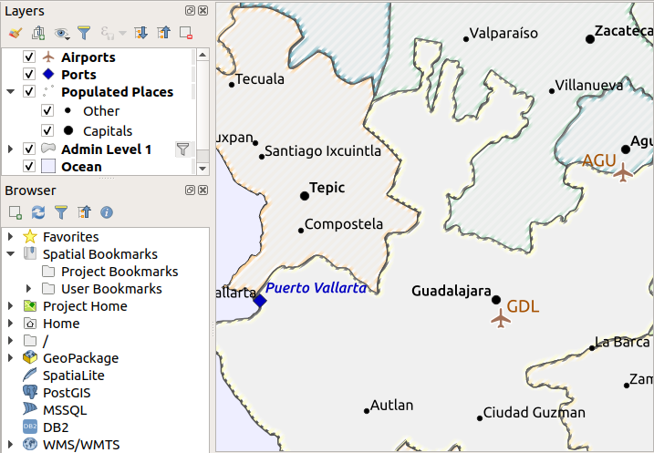

Using the :menuselection:`Project --> New Report` command, we create a
blank report.
Initially, there is not much to look at – the dialog which is displayed
looks much like the print layout designer, except for the
:guilabel:`Report Organizer` panel to the left:

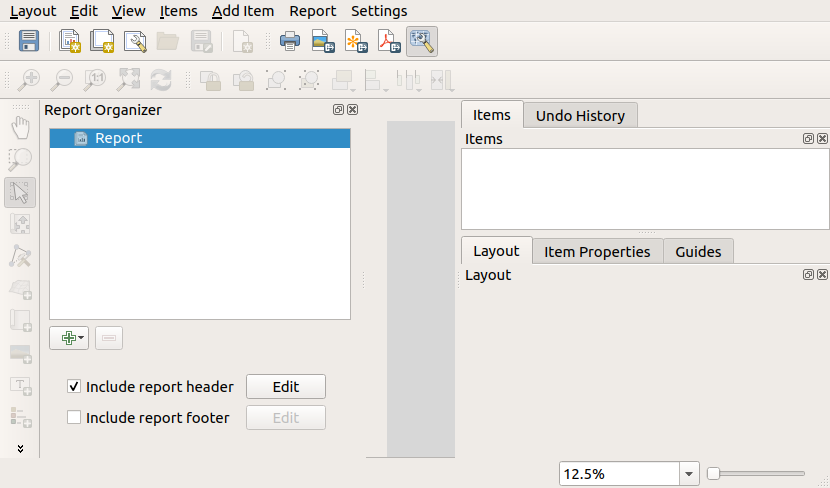

Layout Report Workspace
=======================

QGIS reports can consist of multiple, nested sections.
In our new blank report we initially only have the main report
section.
The only options for this report section is
:guilabel:`Include report header` and
:guilabel:`Include report footer`.
If we enable these options, a header will be included as the first
page(s) (individual parts of reports can be multi-page if desired) in
the report, and a footer will constitute the last page(s).
Enable the header (:guilabel:`Include report header`), and hit the
:guilabel:`Edit` button next to it:

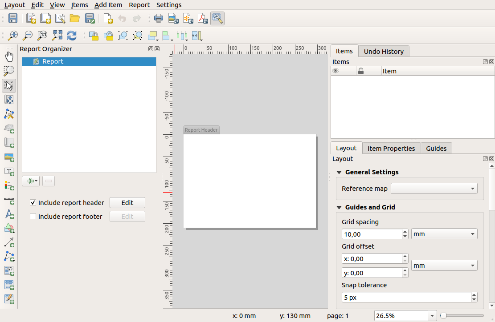

A few things happen as a result. Firstly, an edit pencil is shown
next to :guilabel:`Report` in the :guilabel:`Report Organizer`,
indicating that the report section is currently being edited in
the designer.
We also see a new page with a small :guilabel:`Report Header` title.
The page has *landscape* orientation by default, but this (and
other properties of the page) can be changed by right-clicking on
the page and choosing :menuselection:`Page properties`.
This will bring up the :guilabel:`Item properties` tab for the page,
and page :guilabel:`Size`, :guilabel:`Width`, :guilabel:`Height`, and
more can be specified.

In QGIS reports, every component of the report is made up of
individual layouts.
They can be created and modified using the same tools
as for standard print layouts – so you can use any desired
combination of labels, pictures, maps, tables, etc.
Let us add some items to our report header to demonstrate:

.. figure:: img/header.png
   :align: center

We will also create a simple footer for the report by checking the
:guilabel:`Include report footer` option and hitting :guilabel:`Edit`.

.. figure:: img/footer.png
   :align: center

Before proceeding further, let us export this report and see what
we get.
Exporting is done from the :menuselection:`Report` menu – in this case
we select :menuselection:`Export Report as PDF...` to render the whole
report to a PDF file.
Here is the not-very-impressive result – a two page PDF consisting of
our header and footer:

.. figure:: img/headerfooter.png
   :align: center

Let us make things more interesting.
By hitting the |symbologyAdd| :sup:`Add Section` button in the
:guilabel:`Report Organizer`, we are given a choice of new sections to
add to our report.

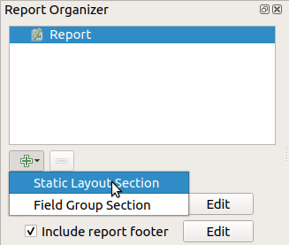

There are two options: :guilabel:`Static Layout Section` and
:guilabel:`Field Group Section`.

The :guilabel:`Add Static Layout Section` is a single, static body
layout.
This can be used to embed static layouts mid-way through a report.

The :guilabel:`Field Group Section` repeats its body layout for every
feature of a layer.
The features are sorted by the selected grouping feature (with an
option for ascending/descending sort).
If a field group section has child sections (e.g. another field group
section with a different field), then only features with unique values
for the group feature are iterated over.
This allows nested reports.

For now we will add a :guilabel:`Field Group Section` to our report.
At its most basic level, you can think of a
:guilabel:`Field Group Section` as the equivalent of a
:ref:`print atlas <atlas_generation>`:
you select a layer to iterate over, and the report will insert a
section for each feature found.
Selecting the new :guilabel:`Field Group Section` reveals a number of
new related settings:

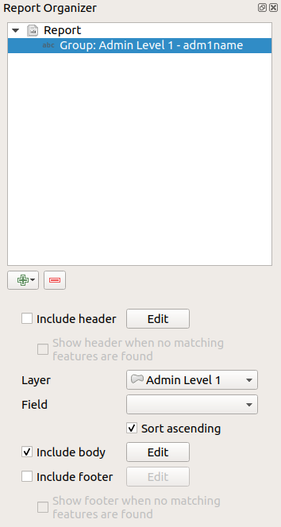

In this case we’ve setup our Field Group so that we iterate over all
the states from the `Admin Level 1` layer, using the values
from the :guilabel:`adm1name` field.
The same options to include header and footer are present, together
with a new option to include a :guilabel:`body` for this section.
We’ll do that, and edit the body:

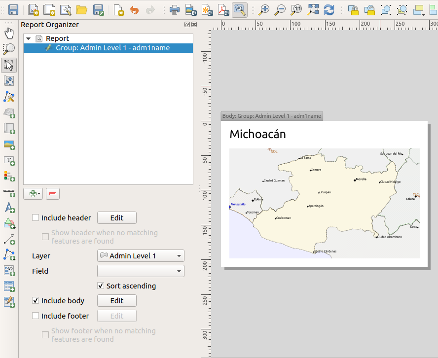

Our body now consists of a map and a label showing the name of the
state.
To include the name of the state, we selected
:menuselection:`Add Item --> Add Label` and data defined the text under :guilabel:`Main Properties` with the help of
:guilabel:`Insert or Edit an Expression...`.

The result was the following expression (`name` is the name
of the attribute in the `Admin Level 1` layer that contains the
name of the state)::

    [% "name" %]

The map is set to follow the current report feature (enabled by
checking :guilabel:`Controlled by Report` – just like a map item in
an atlas will follow the current atlas feature when
:ref:`Controlled by Atlas <controlled_atlas>` is checked):

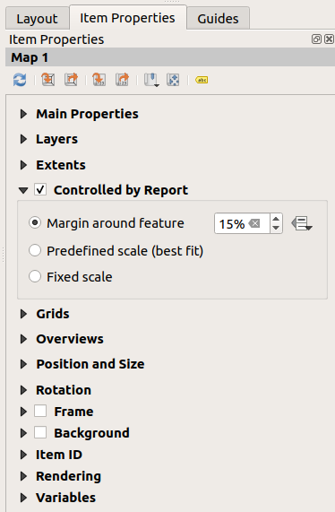

If we went ahead and exported our report now, we’d get something like
this:

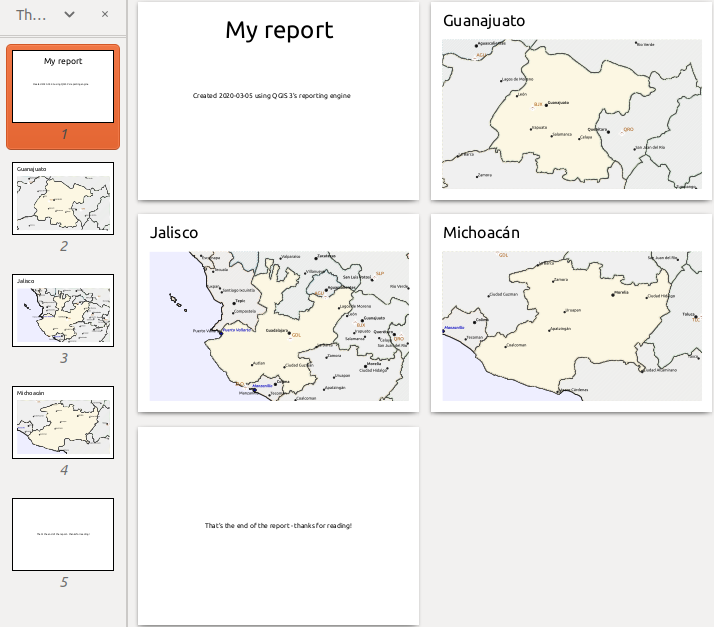

   The report header, a page for each state, and the report footer.

So more or less an atlas, but with a header and footer page.

Let us make things more interesting by adding a subsection to our
state group.
We do this by first selecting the *Admin Level 1* field group in the
organizer, then hitting the |symbologyAdd| :sup:`Add Field` button
and adding a new :guilabel:`Field Group Section`:

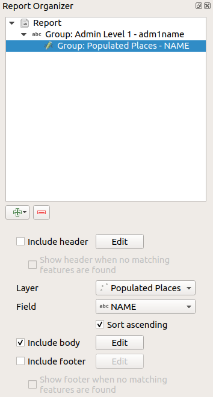

When iterating over the features of a :guilabel:`Field Group Section`,
the features will be filtered to match the defining field of its parent
group (``adm1name`` in this case).
Here, the subsection we added will iterate over a
:guilabel:`Populated Places` layer, including a body section for each
place encountered.
The magic here is that the :guilabel:`Populated Places` layer has an
attribute with the same name as the defining field in the parent layer,
:guilabel:`adm1name`, tagging each place with the state it is contained
within (if you’re lucky your data will already be structured like this
– if not, run the
:ref:`Join Attributes by Location <qgisjoinattributesbylocation>`
Processing algorithm and create your own field).
When we export this report, QGIS will grab the first state from the
:guilabel:`Admin Level 1` layer, and then iterate over all the
:guilabel:`Populated Places` with a matching :guilabel:`adm1name` value.
Here’s what we get:

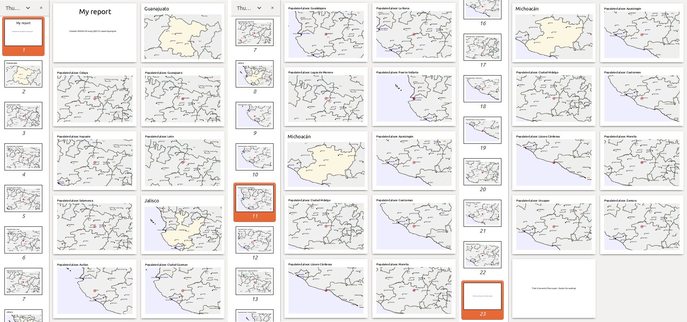

Here we created a basic body for the Populated Places group,
including a map of the place and a table of some place attributes.
So our report is now a report header, a page for the first state,
followed by a page for every populated place within that state, then
the rest of the states with their populated places, and finally the
report footer.
If we were to add a header for the Populated Places group, it would be
included just before listing the populated places for each state,
as shown in the illustration below.

Similarly, a footer for the Populated Places group would be inserted
after the final place for each state is included.

In addition to nested subsections, subsections in a report can also
be included consecutively.
If we add a second subsection to the `Admin Level 1 group` for
:guilabel:`Airports`, then (if the :guilabel:`Airports` layer has an
attribute :guilabel:`adm1name` that can link it to the parent group)
our report will first list ALL the populated places for each state,
followed by all the airports within that state, before proceeding to
the next state.

.. figure:: img/report_consec.png
   :align: center

The key point here is that our :guilabel:`Airports group` is a
subsection of the :guilabel:`Admin Level 1 group` – not the
:guilabel:`Populated Places group`.

In this case our report would be structured like this (note that
state flags have also been included - the procedure for adding
feature specific pictures in this way is described below):

.. figure:: img/report_all_img.png
   :align: center

Including pictures in a report
------------------------------

Pictures can be quite useful in reports, and QGIS allows
pictures in both the static and dynamic parts of a report.
Pictures are added in the same way as for standard print layouts,
and for the static report parts (and static pictures in dynamic
parts) there is not more to it.

But if you want illustrations that are tailored to the report
features, your layer must have an attribute that can be used
to define the picture to include.

QGIS depends on absolute file names for images in reports.

For dynamic pictures, you first add a picture to the body part
of the group, as usual.
In the :guilabel:`Item properties` of the picture, you set the
:guilabel:`Image Source` using the
|dataDefine| :sup:`Data defined override` button, and either
select an attribute that contains the absolute path of the
images or :guilabel:`Edit...` (to enter an expression that
generates the absolute image path).

Below is an example expression that uses string concatenation to
specify the absolute path to the pictures, using the directory
where the project file is located ``@project_path``) and an
attribute (``adm1name``) from which the file name is generated
(in this case by transforming the string in the ``adm1name``
attribute to uppercase, and appending '_flag.png')::

    concat(@project_folder, '/naturalearth/pictures/' ,
           upper("adm1name"), '_flag.png')

This means that the pictures are located in the
``naturalearth/pictures`` subdirectory of the project file directory.

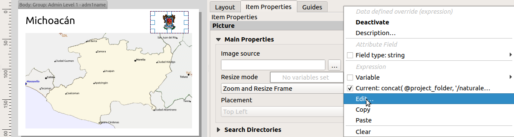

Highlighting the current report feature in a map
------------------------------------------------

In the above report, the report features are emphasized in the
maps using highlighting (state) and circles (populated places).
To emphasize the report features in the maps (apart from placing
them at the centre of the maps), you must data define the style using
a comparison between its ``@id`` and the ``@atlas_featureid``, as
for atlases.

For instance, if you would like to use a thicker line / border
for the report feature than the other features you can data define
the line width::

    if($id=@atlas_featureid, 2.0, 0.1)

The report feature will get a 2 units wide polygon outline, while
all other features will get a 0.1 units wide line.
It is also possible to data define the colour (non-transparent dark
magenta for the report feature and semi-transparent light gray for
the other features)::

    if($id=@atlas_featureid, '#FF880088', '#88CCCCCC')

More level 1 groups
-------------------

Combining nested and consecutive sections, together with section
headers and footers allows for tons of flexibility.
For instance, in the below report we add another field group as a
child of the main report for the :guilabel:`Ports` layer.
Now, after listing the states together with their populated places
and airports, we’ll get a summary list of all the ports in the
region:

.. figure:: img/report_flex.png
   :align: center

This results in the last part of our report exporting as:

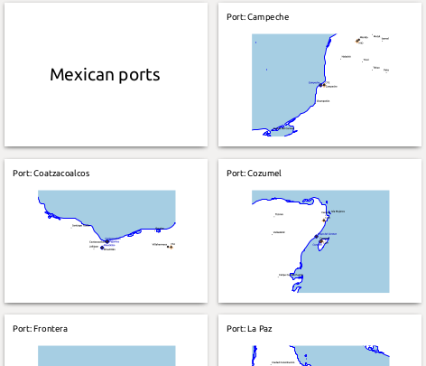

Export settings
===============

When you export a report
(:menuselection:`Report --> Export Report as Images... / SVG... / PDF...`),
you will be asked for a file name, and then you get the opportunity
to tune the export settings to get the most appropriate output.

As you see, reports in QGIS are extremely powerful and flexible!

.. note::
   The current information was adapted from a North Road blog,
   `Exploring Reports in QGIS 3.0 - the Ultimate Guide!
   <https://north-road.com/2018/01/23/exploring-reports-in-qgis-3-0-the-ultimate-guide>`_

.. Substitutions definitions - AVOID EDITING PAST THIS LINE
   This will be automatically updated by the find_set_subst.py script.
   If you need to create a new substitution manually,
   please add it also to the substitutions.txt file in the
   source folder.

.. |dataDefine| image:: /static/common/mIconDataDefine.png
   :width: 1.5em
.. |symbologyAdd| image:: /static/common/symbologyAdd.png
   :width: 1.5em
