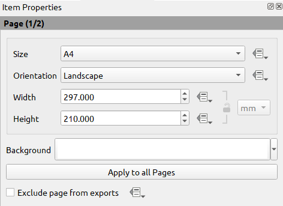

.. _overview_layout:

******************************
 Overview of the Print Layout
******************************

.. only:: html

   .. contents::
      :local:

The print layout provides growing layout and printing capabilities.
It allows you to add elements such as the QGIS 2D or 3D map canvas, text labels, images, legends,
scale bars, basic shapes, arrows, attribute and simple tables, elevation profiles and HTML frames...
You can size, group, align, position and rotate each element
and adjust their properties to create your layout.
The layout can be printed or exported to image formats, PostScript, PDF or to SVG.
You can save the layout as a template and load it again in another session.
Finally, generating several maps based on a template can be done through the atlas generator.

.. index:: Layout template, Map template

Sample Session for beginners
============================

Before you start to work with the print layout, you need to load some raster
or vector layers in the QGIS map canvas and adapt their properties to suit your
own convenience. After everything is rendered and symbolized to your liking,
click the |newLayout| :sup:`New Print Layout` icon in the :guilabel:`Project` toolbar
or choose :menuselection:`Project -->` |newLayout| :menuselection:`New Print Layout`.
You will be prompted to choose a title for the new layout.

To demonstrate how to create a map please follow the next instructions.

#. On the left side, select the |addMap| :sup:`Add map` toolbar button
   and draw a rectangle on the canvas holding down the left mouse button.
   Inside the drawn rectangle the QGIS map view to the canvas.
#. Select the |scaleBar| :sup:`Add scalebar` toolbar button
   and click with the left mouse button on the print layout canvas.
   A scalebar will be
   added to the canvas.
#. Select the |addLegend| :sup:`Add legend` toolbar button
   and draw a rectangle on the canvas holding down the left mouse button.
   Inside the drawn rectangle the legend will be drawn.
#. Select the |select| :sup:`Select/Move item` icon to select the map
   on the canvas and move it a bit.
#. While the map item is still selected you can also change the size of the map item.
   Click while holding down the left mouse button, in a white little
   rectangle in one of the corners of the map item and drag it to a new location
   to change its size.
#. Click the :guilabel:`Item Properties` panel on the left down side
   and find the setting for the orientation.
   Change the value of the setting :guilabel:`Map orientation` to '15.00°'.
   You should see the orientation of the map item change.
#. Now, you can print or export your print layout to image formats, PDF
   or to SVG with the export tools in :menuselection:`Layout` menu.
#. Finally, you can save your print layout within the project file
   with the |fileSave| :sup:`Save Project` button.

You can add multiple elements to the print layout.
It is also possible to have more than one map view or legend or scale bar
in the print layout canvas, on one or several pages.
Each element has its own properties and, in the case of the map, its own extent.
If you want to remove any elements from the layout canvas,
you can do that with the :kbd:`Delete` or the :kbd:`Backspace` key.

.. index:: Layout manager
.. _layout_manager:

The Layout Manager
==================

The :guilabel:`Layout Manager` is the main window to manage print layouts in the project.
It gives you an overview of existing print layouts and reports in the project
and offers tools to:

* search for a layout;
* add new print layout or new report from scratch, template
  or duplicating an existing one;
* rename or delete any of them;
* open them in the project.

To open the layout manager dialog:

* from the main QGIS dialog, select :menuselection:`Project --> Layout Manager...` menu
  or click on the |layoutManager| :sup:`Layout Manager` button in the :guilabel:`Project Toolbar`;
* from a print layout or report dialog, select :menuselection:`Layout --> Layout Manager...` menu
  or click on the |layoutManager| :sup:`Layout Manager` button in the :guilabel:`Layout Toolbar`.

.. _figure_layout_manager:

.. figure:: img/print_composer_manager.png
   :align: center

   The Print Layout Manager

The layout manager lists in its upper part all the available print layouts
or reports in the project with tools to:

* show the selection: you can select multiple reports and/or print layout(s)
  and open them in one-click.
  Double-click a name also opens it;
* duplicate the selected print layout or report (available only if one item is selected):
  it creates a new dialog using the selected one as template.
  You'll be prompted to choose a new title for the new layout;
* rename the report or layout (available only if one item is selected):
  you'll be prompted to choose a new title for the layout;
* remove the layout: the selected print layout(s) will be deleted from the project.

In the lower part, it's possible to create new print layouts or reports from scratch or a template.
By default, QGIS will look for templates in the :ref:`user profile <user_profiles>` folder
and the application template directories (accessible with the two buttons at the bottom of the frame)
but also in any folder declared as :guilabel:`Path(s) to search for extra print templates`
in :menuselection:`Settings --> Options --> Layouts`.
Found templates are listed in the combobox.
Select an item and press the :guilabel:`Create` button
to generate a new report or print layout.

You can also use layout templates from a custom folder;
in that case, select *specific* in the templates drop-down list,
browse to the template and press :guilabel:`Create`.

.. tip:: **Creating template-based print layouts from Browser panel**

  Drag-and-drop a print layout template :file:`.qpt` file from any file browser
  onto the map canvas or double-click it in the :ref:`Browser panel <browser_panel>`
  generates a new print layout from the template.

.. _print_composer_menus:

Menus, tools and panels of the print layout
=============================================

Opening the print layout provides you with a blank canvas
that represents the paper surface when using the print option.
Initially you find buttons on the left beside the canvas to add print layout items:
2D or 3D map canvases, text labels, images, legends, scale bars, basic shapes,
arrows, attribute or simple tables, HTML frames, elevation profiles,...
In this toolbar you also find buttons to navigate,
zoom in on an area and pan the view on the layout
as well as buttons to select any layout item and to move the extents of the map items.

:numref:`figure_layout_overview` shows the initial view of the print layout
before any elements are added.

.. _figure_layout_overview:

.. figure:: img/print_composer_blank.png
   :align: center
   :width: 100%

   Print Layout

On the right beside the canvas you find two set of panels.
The upper one holds the panels :guilabel:`Items` and :guilabel:`Undo History`
and the lower holds the panels :guilabel:`Layout`, :guilabel:`Item properties`
and :guilabel:`Atlas generation`.

* The :guilabel:`Items` panel provides a list of all the print layout items
  added to the canvas and ways to globally interact with them
  (see :ref:`layout_items_panel` for more information).
* The :guilabel:`Undo History` panel displays the history of all changes applied to the layout.
  With a mouse click, it is possible to undo and redo layout steps
  back and forth to a certain status.
* The :guilabel:`Layout` panel allows you to set general parameters to apply
  to the layout when exporting or working within (see :ref:`layout_panel` for more
  details);
* The :guilabel:`Item Properties` panel displays the properties for the selected
  item.
  Click the |select| :sup:`Select/Move item` icon to select an item
  (e.g., legend, scale bar or label) on the canvas.
  Then click the :guilabel:`Item Properties` panel and customize the settings for the selected item
  (see :ref:`layout_items` for detailed information on each item settings).
* The :guilabel:`Atlas` panel allows you to enable the generation of an atlas
  for the current layout and gives access to its parameters
  (see :ref:`atlas_generation` for detailed information on atlas generation usage).

In the bottom part of the print layout window, you can find a status bar
with mouse position, current page number, a combo box to set the zoom level,
the number of selected items if applicable and, in the case of atlas generation, the number of features.

In the upper part of the print layout window, you can find menus and other toolbars.
All print layout tools are available in menus and as icons in a toolbar.

The toolbars and the panels can be switched off and on
using the right mouse button over any toolbar,
or through :menuselection:`View --> Toolbars -->` or :menuselection:`View --> Panels -->`.

.. index::
   single: Print layout; Tools

.. _layout_tools:

Menus and Tools
---------------

Layout menu
...........

The :menuselection:`Layout` provides action to manage the layout:

* Save the project file directly from the print layout window.
* Create a new and blank print layout with |newLayout| :guilabel:`New Layout...`.
* |duplicateLayout| :guilabel:`Duplicate Layout...` : Create a new print layout
  by duplicating the current one.
* Remove the current layout with |deleteSelected| :guilabel:`Delete Layout...`.
* Open the |layoutManager| :guilabel:`Layout Manager...`.
* :menuselection:`Layouts -->` : Open an existing print layout.

Once the layout is designed, with |fileSaveAs| :guilabel:`Save as Template`
and |fileOpen| :guilabel:`Add Items from Template` icons, you can save
the current state of a print layout session as a :file:`.qpt` template file
and load its items again in another session/print layout.

In the :menuselection:`Layout` menu, there are also powerful ways
to share geographical information produced with QGIS
that can be included in reports or published.
These tools are |saveMapAsImage| :guilabel:`Export as Image...`,
|saveAsPDF| :guilabel:`Export as PDF...`, |saveAsSVG| :guilabel:`Export as SVG...`
and |filePrint| :guilabel:`Print...`.

Below is a list of all the available tools in this menu
with some convenient information.

================================================= ========================== ========================== =====================================
 Tool                                              Shortcut                   Toolbar                    Reference
================================================= ========================== ========================== =====================================
 |fileSave| :guilabel:`Save Project`               :kbd:`Ctrl+S`              :guilabel:`Layout`         :ref:`sec_projects`
 |newLayout| :guilabel:`New Layout`                :kbd:`Ctrl+N`              :guilabel:`Layout`         :ref:`layout_manager`
 |duplicateLayout| :guilabel:`Duplicate Layout`                               :guilabel:`Layout`         :ref:`layout_manager`
 |deleteSelected| :guilabel:`Delete Layout`
 |layoutManager| :guilabel:`Layout Manager...`                                :guilabel:`Layout`         :ref:`layout_manager`
 :menuselection:`Layouts -->`
 :guilabel:`Layout Properties...`                                                                        :ref:`layout_panel`
 :guilabel:`Rename Layout...`
 |newPage| :guilabel:`Add Pages...`                                           :guilabel:`Layout`         :ref:`page_properties`
 |fileOpen| :guilabel:`Add Items from Template`                               :guilabel:`Layout`         :ref:`create_layout_item`
 |fileSaveAs| :guilabel:`Save as Template...`                                 :guilabel:`Layout`         :ref:`layout_manager`
 |saveMapAsImage| :guilabel:`Export as Image...`                              :guilabel:`Layout`         :ref:`export_layout_image`
 |saveAsSVG| :guilabel:`Export as SVG...`                                     :guilabel:`Layout`         :ref:`export_layout_svg`
 |saveAsPDF| :guilabel:`Export as PDF...`                                     :guilabel:`Layout`         :ref:`export_layout_pdf`
 :guilabel:`Page Setup...`                         :kbd:`Ctrl+Shift+P`
 |filePrint| :guilabel:`Print...`                  :kbd:`Ctrl+P`              :guilabel:`Layout`         :ref:`create-output`
 :guilabel:`Close`                                 :kbd:`Ctrl+Q`
================================================= ========================== ========================== =====================================

Edit menu
.........

The :menuselection:`Edit` menu offers tools to manipulate print layout items.
It includes common actions like selection tools, Copy/Cut/Paste and undo/redo
(see :ref:`layout_undo_panel`) functionality for the items in the layout.

When using the Paste action, the elements will be pasted according to the current mouse position.
Using the :menuselection:`Edit --> Paste in Place` action
or pressing :kbd:`Ctrl+Shift+V` will paste the items into the current page,
at the same position they were in their initial page.
It ensures to copy/paste items at the same place, from page to page.

Below is a list of all the available tools in this menu
with some convenient information.

.. csv-table:: Available Tools
   :header: "Tool", "Shortcut", "Toolbar", "Reference"
   :widths: 30, 17, 10, 33

   "|undo| :guilabel:`Undo (last change)`", ":kbd:`Ctrl+Z`", ":guilabel:`Layout`", ":ref:`layout_undo_panel`"
   "|redo| :guilabel:`Redo (last reverted change)`", ":kbd:`Ctrl+Y`", ":guilabel:`Layout`", ":ref:`layout_undo_panel`"
   "|deleteSelected| :guilabel:`Delete`", ":kbd:`Del`"
   "|editCut| :guilabel:`Cut`", ":kbd:`Ctrl+X`"
   "|editCopy| :guilabel:`Copy`", ":kbd:`Ctrl+C`"
   "|editPaste| :guilabel:`Paste`", ":kbd:`Ctrl+V`"
   ":guilabel:`Paste in place`", ":kbd:`Ctrl+Shift+V`"
   "|selectAll| :guilabel:`Select All`", ":kbd:`Ctrl+A`"
   "|deselectAll| :guilabel:`Deselect all`", ":kbd:`Ctrl+Shift+A`"
   "|invertSelection| :guilabel:`Invert Selection`"
   ":guilabel:`Select Next Item Below`", ":kbd:`Ctrl+Alt+[`"
   ":guilabel:`Select Next Item above`", ":kbd:`Ctrl+Alt+]`"
   "|pan| :guilabel:`Pan Layout`", ":kbd:`P`", ":guilabel:`Toolbox`"
   "|zoomToArea| :guilabel:`Zoom`", ":kbd:`Z`", ":guilabel:`Toolbox`"
   "|select| :guilabel:`Select/Move Item`", ":kbd:`V`", ":guilabel:`Toolbox`", ":ref:`interact_layout_item`"
   "|moveItemContent| :guilabel:`Move Content`", ":kbd:`C`", ":guilabel:`Toolbox`", ":ref:`layout_map_item`"
   "|editNodesShape| :guilabel:`Edit Nodes Item`", "", ":guilabel:`Toolbox`", ":ref:`layout_node_based_shape_item`"

View menu
.........

The :menuselection:`View` menu  gives access to navigation tools
and helps to configure general behavior of the print layout.
Beside the common zoom tools, you have means to:

* |refresh| :sup:`Refresh view` (if you find the view in an inconsistent state);
* enable a :ref:`grid <grid_guides>` you could snap items to when moving or creating them.
  Grids setting is done in :menuselection:`Settings --> Layout Options...`
  or in the :ref:`Layout Panel <layout_panel>`;
* enable :ref:`guides <grid_guides>` you could snap items to when moving or creating them.
  Guides are red lines that you can create by clicking in the ruler
  (above or at the left side of the layout) and drag and drop to the desired location;
* :guilabel:`Smart Guides`: uses other layout items as guides to dynamically snap to
  as you move or reshape an item;
* :guilabel:`Clear Guides` to remove all current guides;
* :guilabel:`Show Bounding box` around the items to better identify your selection;
* :guilabel:`Show Rules` around the layout;
* :guilabel:`Show Pages` or set up pages to transparent.
  Often layout is used to create non-print layouts, e.g. for inclusion in presentations or other documents,
  and it's desirable to export the composition using a totally transparent background.
  It's sometimes referred to as "infinite canvas" in other editing packages.

In the print layout, you can change the zoom level using the mouse wheel
or the slider and combo box in the status bar.
If you need to switch to pan mode while working in the layout area,
you can hold the :kbd:`Spacebar` or the mouse wheel.
With :kbd:`Ctrl+Spacebar`, you can temporarily switch to Zoom In mode,
and with :kbd:`Ctrl+Alt+Spacebar`, to Zoom Out mode.

Panels and toolbars can be enabled from the :menuselection:`View -->` menu.
To maximise the space available to interact with a composition
you can check the |checkbox| :menuselection:`View --> Toggle Panel Visibility` option
or press :kbd:`Ctrl+Tab`;
all panels are hidden and only previously visible panels are restored when unchecked.

It's also possible to switch to a full screen mode to have more space to interact with
by pressing :kbd:`F11` or using :menuselection:`View -->` |checkbox| :guilabel:`Toggle Full Screen`.

================================================= ========================== ========================== =====================================
 Tool                                              Shortcut                   Toolbar                    Reference
================================================= ========================== ========================== =====================================
 |refresh| :guilabel:`Refresh`                     :kbd:`F5`                  :guilabel:`Navigation`
 :menuselection:`Preview -->`
 |zoomIn| :guilabel:`Zoom In`                      :kbd:`Ctrl++`              :guilabel:`Navigation`
 |zoomOut| :guilabel:`Zoom Out`                    :kbd:`Ctrl+-`              :guilabel:`Navigation`
 |zoomActual| :guilabel:`Zoom to 100%`             :kbd:`Ctrl+1`              :guilabel:`Navigation`
 |zoomFullExtent| :guilabel:`Zoom Full`            :kbd:`Ctrl+0`              :guilabel:`Navigation`
 :guilabel:`Zoom to Width`
 |vectorGrid| :guilabel:`Show Grid`                :kbd:`Ctrl+'`                                         :ref:`grid_guides`
 |unchecked| :guilabel:`Snap to Grid`              :kbd:`Ctrl+Shift+'`                                   :ref:`grid_guides`
 |checkbox| :guilabel:`Show Guides`                :kbd:`Ctrl+;`                                         :ref:`grid_guides`
 |checkbox| :guilabel:`Snap to Guides`             :kbd:`Ctrl+Shift+;`                                   :ref:`grid_guides`
 |checkbox| :guilabel:`Smart Guides`               :kbd:`Ctrl+Alt+;`
 :guilabel:`Manage Guides...`                      \                          \                          :ref:`layout_guides_panel`
 :guilabel:`Clear Guides`                          \                          \                          :ref:`layout_guides_panel`
 |checkbox| :guilabel:`Show Rulers`                :kbd:`Ctrl+R`
 |checkbox| :guilabel:`Show Bounding Boxes`        :kbd:`Ctrl+Shift+B`
 |checkbox| :guilabel:`Show Pages`
 :menuselection:`Toolbars -->`                      \                         \                          :ref:`sec_panels_and_toolbars`
 :menuselection:`Panels -->`                        \                         \                          :ref:`sec_panels_and_toolbars`
 |unchecked| :guilabel:`Toggle Full Screen`        :kbd:`F11`                 \                          :ref:`view_menu`
 |unchecked| :guilabel:`Toggle Panel Visibility`   :kbd:`Ctrl+Tab`            \                          :ref:`view_menu`
================================================= ========================== ========================== =====================================

Items menu
..........

The :menuselection:`Items` helps you configure items' position in the layout
and the relations between them (see :ref:`interact_layout_item`).

================================================= ========================== ========================== ==========================
 Tool                                              Shortcut                   Toolbar                    Reference
================================================= ========================== ========================== ==========================
 |groupItems| :guilabel:`Group`                    :kbd:`Ctrl+G`              :guilabel:`Actions`        :ref:`group_items`
 |ungroupItems| :guilabel:`Ungroup`                :kbd:`Ctrl+Shift+G`        :guilabel:`Actions`        :ref:`group_items`
 |raiseItems| :guilabel:`Raise`                    :kbd:`Ctrl+]`              :guilabel:`Actions`        :ref:`align_items`
 |lowerItems| :guilabel:`Lower`                    :kbd:`Ctrl+[`              :guilabel:`Actions`        :ref:`align_items`
 |moveItemsToTop| :guilabel:`Bring to Front`       :kbd:`Ctrl+Shift+]`        :guilabel:`Actions`        :ref:`align_items`
 |moveItemsToBottom| :guilabel:`Send to Back`      :kbd:`Ctrl+Shift+[`        :guilabel:`Actions`        :ref:`align_items`
 |locked| :guilabel:`Lock Selected Items`          :kbd:`Ctrl+L`              :guilabel:`Actions`        :ref:`lock_items`
 |unlocked| :guilabel:`Unlock All`                 :kbd:`Ctrl+Shift+L`        :guilabel:`Actions`        :ref:`lock_items`
 :menuselection:`Align Items -->`                                             :guilabel:`Actions`        :ref:`align_items`
 :menuselection:`Distribute Items -->`                                        :guilabel:`Actions`        :ref:`move_resize`
 :menuselection:`Resize -->`                                                  :guilabel:`Actions`        :ref:`move_resize`
================================================= ========================== ========================== ==========================

Add Item menu
.............

These are tools to create layout items. 
Each of them is deeply described in :ref:`layout_items` chapter.

========================================================= ======================== =====================================
 Tool                                                      Toolbar                    Reference
========================================================= ======================== =====================================
 |addMap| :guilabel:`Add Map`                              :guilabel:`Toolbox`        :ref:`layout_map_item`
 |add3DMap| :guilabel:`Add 3D Map`                         :guilabel:`Toolbox`        :ref:`layout_map3d_item`
 |addImage| :guilabel:`Add Picture`                        :guilabel:`Toolbox`        :ref:`layout_picture_item`
 |label| :guilabel:`Add Label`                             :guilabel:`Toolbox`        :ref:`layout_label_item`
 :menuselection:`Add Dynamic Text -->`                                                :ref:`The Label Item <layout_label_main_properties>`
 |addLegend| :guilabel:`Add Legend`                        :guilabel:`Toolbox`        :ref:`layout_legend_item`
 |scaleBar| :guilabel:`Add Scale Bar`                      :guilabel:`Toolbox`        :ref:`layout_scalebar_item`
 |northArrow| :guilabel:`Add North Arrow`                  :guilabel:`Toolbox`        :ref:`layout_northarrow_item`
 |addBasicShape| :menuselection:`Add Shape -->`            :guilabel:`Toolbox`        :ref:`layout_basic_shape_item`
 |addBasicRectangle| :menuselection:`--> Add Rectangle`    :guilabel:`Toolbox`        :ref:`layout_basic_shape_item`
 |addBasicCircle| :menuselection:`--> Add Ellipse`         :guilabel:`Toolbox`        :ref:`layout_basic_shape_item`
 |addBasicTriangle| :menuselection:`--> Add Triangle`      :guilabel:`Toolbox`        :ref:`layout_basic_shape_item`
 |addMarker| :guilabel:`Add Marker`                        :guilabel:`Toolbox`        :ref:`layout_marker_item`
 |addArrow| :guilabel:`Add Arrow`                          :guilabel:`Toolbox`        :ref:`layout_arrow_item`
 |addNodesShape| :menuselection:`Add Node Item -->`        :guilabel:`Toolbox`        :ref:`layout_node_based_shape_item`
 |addPolygon| :menuselection:`--> Add Polygon`             :guilabel:`Toolbox`        :ref:`layout_node_based_shape_item`
 |addPolyline| :menuselection:`--> Add Polyline`           :guilabel:`Toolbox`        :ref:`layout_node_based_shape_item`
 |addHtml| :guilabel:`Add HTML`                            :guilabel:`Toolbox`        :ref:`layout_html_item`
 |addTable| :guilabel:`Add Attribute Table`                :guilabel:`Toolbox`        :ref:`layout_attribute_table_item`
 |addManualTable| :guilabel:`Add Fixed Table`              :guilabel:`Toolbox`        :ref:`layout_fixed_table_item`
 |elevationProfile| :guilabel:`Add Elevation Profile`      :guilabel:`Toolbox`        :ref:`layout_elevation_profile_item`
========================================================= ======================== =====================================

Atlas menu
..........

======================================================== ========================== ========================== =====================================
 Tool                                                     Shortcut                   Toolbar                    Reference
======================================================== ========================== ========================== =====================================
 |atlas| :guilabel:`Preview Atlas`                        :kbd:`Ctrl+ALt+/`          :guilabel:`Atlas`          :ref:`atlas_preview`
 |atlasFirst| :guilabel:`First Feature`                   :kbd:`Ctrl+<`              :guilabel:`Atlas`          :ref:`atlas_preview`
 |atlasPrev| :guilabel:`Previous Feature`                 :kbd:`Ctrl+,`              :guilabel:`Atlas`          :ref:`atlas_preview`
 |atlasNext| :guilabel:`Next Feature`                     :kbd:`Ctrl+.`              :guilabel:`Atlas`          :ref:`atlas_preview`
 |atlasLast| :guilabel:`Last feature`                     :kbd:`Ctrl+>`              :guilabel:`Atlas`          :ref:`atlas_preview`
 |filePrint| :guilabel:`Print Atlas...`                                              :guilabel:`Atlas`          :ref:`atlas_preview`
 |saveMapAsImage| :guilabel:`Export Atlas as Images...`                              :guilabel:`Atlas`          :ref:`atlas_preview`
 |saveAsSVG| :guilabel:`Export Atlas as SVG...`                                      :guilabel:`Atlas`          :ref:`atlas_preview`
 |saveAsPDF| :guilabel:`Export Atlas as PDF...`                                      :guilabel:`Atlas`          :ref:`atlas_preview`
 |atlasSettings| :guilabel:`Atlas Settings`                                          :guilabel:`Atlas`          :ref:`atlas_generation`
======================================================== ========================== ========================== =====================================

Settings Menu
.............

The :menuselection:`Settings --> Layout Options...` menu is a shortcut
to :menuselection:`Settings --> Options --> Layouts` menu of QGIS main canvas.
Here, you can set some options that will be used as default on any new print layout:

* :guilabel:`Layout defaults` let you specify the default font to use;
* With :guilabel:`Grid appearance`, you can set the grid style and its color.
  There are three types of grid: **Dots**, **Solid** lines and **Crosses**;
* :guilabel:`Grid and guide defaults` defines spacing, offset and tolerance of the grid
  (see :ref:`grid_guides` for more details);
* :guilabel:`Layout Paths`: to manage list of custom paths to search print templates.

The :menuselection:`Settings --> Keyboard Shortcuts...` menu allows you
to use the :ref:`shortcuts manager <shortcuts>` in the print layout interface.

Contextual menus
................

Depending on where you right-click in the print layout dialog,
you open a contextual menu with various features:

* Right-click on the menu bar or any toolbar and you get the list of layout
  panels and toolbars you can enable or disable in one-click.
* Right-click over a ruler and you can |checkbox| :guilabel:`Show Guides`,
  |checkbox| :guilabel:`Snap to Guides`, :guilabel:`Manage Guides...`
  opening the :ref:`Guides panel <layout_guides_panel>` or :guilabel:`Clear Guides`.
  It's also possible to hide the rulers.
* Right-click in the print layout canvas and:

  * You'll be able to :guilabel:`Undo` and :guilabel:`Redo` recent changes,
    or :guilabel:`Paste` any copied item (only available if no item is selected).
  * If you click over a page, you can additionally access the current :ref:`Page Properties <page_properties>` panel
    or :guilabel:`Remove Page`.
  * If you click on a selected item then you can cut or copy it
    as well as open the :ref:`Item Properties <layout_item_options>` panel.
  * If more than one item are selected, then you can either group them and/or
    ungroup if at least one group is already in the selection.
* Right-click inside a text box or spinbox widget of any layout panel
  provides edit options to manipulate its content.

.. _layout_panel:

The Layout Panel
-----------------

In the :guilabel:`Layout` panel, you can define the global settings of your print layout.

.. _figure_composition:

.. figure:: img/composition_settings.png
   :align: center

   Layout Settings in the Print Layout

.. _reference_map:

General settings
................

In a print layout, you can use more than one map item.
The :guilabel:`Reference map` represents the map item to use as the layout's master map.
It's assigned as long as there's a map item in the layout.
The layout will use this map in any of their properties and variables calculating units or scale.
This includes exporting the print layout to georeferenced formats.

Moreover, new layout items such as scale bar, legend or north arrow
have by default their settings (orientation, displayed layers, scale, ...)
bound to the map item they are drawn over,
and fall back to the reference map if there is no overlapping map.

.. _grid_guides:

Guides and Grid
...............

You can put some reference marks on your paper sheet to help you accurately place some items.
These marks can be:

* simple horizontal or vertical lines (called **Guides**) put at the position you want
  (see :ref:`layout_guides_panel` for guides creation).
* or regular **Grid**: a network of horizontal and vertical lines
  superimposed over the layout.

Settings like :guilabel:`Grid spacing` or :guilabel:`Grid offset` can be adjusted in this group
as well as the :guilabel:`Snap tolerance` to use for items.
The tolerance is the maximum distance below which the mouse cursor is snapped to a grid or a guide,
while moving, resizing or creating an item.

Whether grid or guides should be shown is set in :menuselection:`View` menu.
There, you can also decide if they might be used to snap layout items.
When both a grid line and a guide line are within tolerance of a point,
guides will always take precedence - since they have been manually set
(hence, assumption that they have been explicitly placed at highly desirable snapping locations,
and should be selected over the general grid).

.. note::

  In the :menuselection:`Settings --> Layout Options` menu,
  you can also set the grid and guides parameters exposed above.
  However, these options will only apply as defaults to new print layouts.

.. _layout_export_settings:

Export settings
...............

You can define a resolution to use for all exported maps in :guilabel:`Export resolution`.
This setting can then be overridden each time you export a map.

Because of some advanced rendering options (:ref:`blending mode <blend-modes>`,
:ref:`effects <draw_effects>`...), a layout item may need rasterization
in order to be exported correctly.
QGIS will individually rasterize it without forcing every other item to also be rasterized.
This allows printing or saving as PostScript or PDF to keep items as much as possible as vectors,
e.g. a map item with layer opacity won't force labels, scale bars, etc to be rasterized too.
You can however:

* force all the items to be rasterized checking the |checkbox| :guilabel:`Print as raster` box;
* or use the opposite option, i.e. :guilabel:`Always export as vectors`,
  to force the export to keep items as vectors when exported to a compatible format.
  Note that in some cases, this could cause the output to look different to layout.

Where the format makes it possible (e.g., :file:`.TIF`, :file:`.PDF`)
exporting a print layout results by default in a georeferenced file
(based on the :guilabel:`Reference map` item in the :guilabel:`General settings` group).
For other formats, georeferenced output requires you to generate a world file
by checking |checkbox| :guilabel:`Save world file`.
The world file is created beside the exported map(s),
has the name of the page output with the reference map item
and contains information to georeference it easily.

Resize layout to content
........................

Using the :guilabel:`Resize page` tool in this group, you create a unique page composition
whose extent covers the current contents of the print layout
(with some optional :guilabel:`margins` around the cropped bounds).

Note that this behavior is different from the :ref:`crop to content <crop_to_content>` option
in that all the items are placed on a real and unique page in replacement of all the existing pages.

Variables
.........

The :guilabel:`Variables` lists all the variables available
at the layout's level (which includes all global and project's variables).

It also allows the user to manage layout-level variables.
Click the |symbologyAdd| button to add a new custom layout-level variable.
Likewise, select a custom layout-level variable from the list
and click the |symbologyRemove| button to remove it.

More information on variables usage in the :ref:`General Tools <general_tools_variables>` section.

.. _figure_composition_variables:

.. figure:: img/composition_variables.png
   :align: center

   Variables Editor in the Print Layout

.. index:: Layout pages, Page properties
.. _page_properties:

Working with the page properties
--------------------------------

A layout can be composed of several pages.
For instance, a first page can show a map canvas,
and a second page can show the attribute table associated with a layer,
while a third one shows an HTML frame linking to your organization website.
Or you can add many types of items on each page.

Adding a new page
.................

Futhermore, a layout can be made using different size and/or orientation of pages.
To add a page, select the |newPage| :guilabel:`Add Pages...` tool
from the :menuselection:`Layout` menu or :guilabel:`Layout Toolbar`.
The :guilabel:`Insert Pages` dialog opens and you are asked to fill:

* the number of pages to insert;
* the position of the page(s): before or after a given page or at the end of the print layout;
* The :guilabel:`Page size`: it could be of a preset format page
  (``A4``, ``B0``, ``Legal``, ``Letter``, ``ANSI A``, ``Arch A`` and their derivatives
  as well as a resolution type, such as ``1920x1080`` or ``1024x768``)
  with associated :guilabel:`Orientation` (Portrait or Landscape).
  
  The page size can also be of a ``custom`` format;
  In that case, you'd need to enter its :guilabel:`Width` and :guilabel:`Height`
  (with locked size ratio if needed) and select the unit to use
  among ``mm``, ``cm``, ``px``, ``pt``, ``in``, ``ft``...
  Conversion of entered values is automatically applied when switching
  from one unit to another.

.. _figure_layout_new_page:

.. figure:: img/insert_page.png
   :align: center

   Creating a new page in the Print Layout

Updating page properties
........................

Any page can be later customized through the Page :guilabel:`Item Properties` panel.
To access a page's properties, left-click on an empty section of the page
or right-click on a page and select :guilabel:`Page Properties...`.
The :guilabel:`Item Properties` panel opens with settings such as:

* for layouts with several pages, it displays the active page number
  and the count of available pages
* the :guilabel:`Page size` frame described above.
  You can modify each property using the data defined override options
  (see :ref:`atlas_data_defined_override` for a use case); 
* the |unchecked| :guilabel:`Exclude page from exports` to control whether
  the current page with its content should be included in the :ref:`layout output <create-output>`;
* the :guilabel:`Background` of the current page using the :ref:`color <color-selector>`
  or :ref:`symbol <symbol-selector>` you want.

.. _figure_layout_page:

   Page properties dialog

.. index:: Guides, Smart guides
.. _layout_guides_panel:

The Guides Panel
----------------

Guides are vertical or horizontal line references you can place on a layout page
to assist you on items placement, when creating, moving or resizing them.
To be active, guides require the :menuselection:`View --> Show Guides`
and :menuselection:`View --> Snap to Guides` options to be checked.
To create a guide, there are two different methods:

* if the :menuselection:`View --> Show Rulers` option is set, drag out a ruler
  and release the mouse button within the page area, at the desired position.
* for more precision, use the :guilabel:`Guides` panel from the :menuselection:`View --> Toolbox -->`
  or by selecting :guilabel:`Manage guides for page...` from the page's contextual menu.

.. _figure_layout_guides_panel:

.. figure:: img/guides_panel.png
   :align: center

   The Guides panel

The :guilabel:`Guides` panel allows creation of snap lines at specific locations:

#. Select the :guilabel:`Page` you'd like to add the guides to
#. Click the |symbologyAdd| :sup:`Add new guide` button and enter the coordinates
   of the horizontal or vertical line. The origin is at the top left corner.
   Different units are available for this.

   The panel also allows adjusting the position of existing guides to exact coordinates:
   double-click and replace the value.
#. The :guilabel:`Guides` panel lists only the items for the current page.
   It allows creation or removal of guides only in the current page.
   However, you can use the :guilabel:`Apply to All Pages` button to replicate
   the guide configuration of the current page to the other pages in the layout.
#. To delete a guide, select it and press the |symbologyRemove| :sup:`Remove selected guide` button.
   Use :guilabel:`Clear All Guides` to remove all the guides in the current page.

.. tip:: **Snapping to existing layout items**

  Other than guides and grids, you can use existing items as snapping references
  when moving, resizing or creating new items; these are called **smart guides**
  and require :menuselection:`View --> Smart Guides` option to be checked.
  Anytime the mouse pointer is close to an item's bound, a snapping cross appears.

.. _layout_items_panel:

The Items Panel
---------------

The :guilabel:`Items` panel offers some options to manage selection
and visibility of items.
All the items added to the print layout canvas (including :ref:`items group <group_items>`)
are shown in a list and selecting an item makes the corresponding row selected in the list
as well as selecting a row does select the corresponding item in the print layout canvas.
This is thus a handy way to select an item placed behind another one.
Note that a selected row is shown as bold.
Multiple items selection is also possible holding :kbd:`Shift` for contiguous items,
and :kbd:`Ctrl` key for non-contiguous ones.

For any available item, you can:

* |showAllLayers| set it visible or not;
* |locked| lock or unlock its position;
* sort its Z position. You can move up and down each item in the list with a click and drag.
  The upper item in the list will be brought to the foreground in the print layout canvas.
  By default, a newly created item is placed in the foreground.
* change the item ID by double-clicking the text;
* right-click an item and select whether to copy or delete it
  or open its :ref:`properties panel <layout_item_options>`.

Once you have found the correct position for an item,
you can lock it by ticking the box in |locked| column.
Locked items are **not** selectable on the canvas.
Locked items can be unlocked by selecting the item in the :menuselection:`Items` panel
and unchecking the tickbox or you can use the icons on the toolbar.

.. index:: Revert layout actions
.. _layout_undo_panel:

The Undo History Panel: Revert and Restore actions
--------------------------------------------------

During the layout process, it is possible to revert and restore changes.
This can be done with the revert and restore tools available
in the :guilabel:`Edit` menu, the :guilabel:`Layout` toolbar or the contextual menu
any time you right-click in the print layout area:

* |undo| :sup:`Revert last change`
* |redo| :sup:`Restore last change`

This can also be done by mouse click within the :guilabel:`Undo history` panel
(see :numref:`figure_layout`).
The History panel lists the last actions done within the print layout.
Select the point you want to revert to and once you do a new action
all the actions done after the selected one will be removed.

.. _figure_layout:

.. figure:: img/command_hist.png
   :align: center

   Undo History in the Print Layout

.. Substitutions definitions - AVOID EDITING PAST THIS LINE
   This will be automatically updated by the find_set_subst.py script.
   If you need to create a new substitution manually,
   please add it also to the substitutions.txt file in the
   source folder.

.. |add3DMap| image:: /static/common/mActionAdd3DMap.png
   :width: 1.5em
.. |addArrow| image:: /static/common/mActionAddArrow.png
   :width: 1.5em
.. |addBasicCircle| image:: /static/common/mActionAddBasicCircle.png
   :width: 1.5em
.. |addBasicRectangle| image:: /static/common/mActionAddBasicRectangle.png
   :width: 1.5em
.. |addBasicShape| image:: /static/common/mActionAddBasicShape.png
   :width: 1.5em
.. |addBasicTriangle| image:: /static/common/mActionAddBasicTriangle.png
   :width: 1.5em
.. |addHtml| image:: /static/common/mActionAddHtml.png
   :width: 1.5em
.. |addImage| image:: /static/common/mActionAddImage.png
   :width: 1.5em
.. |addLegend| image:: /static/common/mActionAddLegend.png
   :width: 1.5em
.. |addManualTable| image:: /static/common/mActionAddManualTable.png
   :width: 1.5em
.. |addMap| image:: /static/common/mActionAddMap.png
   :width: 1.5em
.. |addMarker| image:: /static/common/mActionAddMarker.png
   :width: 1.5em
.. |addNodesShape| image:: /static/common/mActionAddNodesShape.png
   :width: 1.5em
.. |addPolygon| image:: /static/common/mActionAddPolygon.png
   :width: 1.5em
.. |addPolyline| image:: /static/common/mActionAddPolyline.png
   :width: 1.5em
.. |addTable| image:: /static/common/mActionAddTable.png
   :width: 1.5em
.. |atlas| image:: /static/common/mIconAtlas.png
   :width: 1.5em
.. |atlasFirst| image:: /static/common/mActionAtlasFirst.png
   :width: 1.5em
.. |atlasLast| image:: /static/common/mActionAtlasLast.png
   :width: 1.5em
.. |atlasNext| image:: /static/common/mActionAtlasNext.png
   :width: 1.5em
.. |atlasPrev| image:: /static/common/mActionAtlasPrev.png
   :width: 1.5em
.. |atlasSettings| image:: /static/common/mActionAtlasSettings.png
   :width: 1.5em
.. |checkbox| image:: /static/common/checkbox.png
   :width: 1.3em
.. |deleteSelected| image:: /static/common/mActionDeleteSelected.png
   :width: 1.5em
.. |deselectAll| image:: /static/common/mActionDeselectAll.png
   :width: 1.5em
.. |duplicateLayout| image:: /static/common/mActionDuplicateLayout.png
   :width: 1.5em
.. |editCopy| image:: /static/common/mActionEditCopy.png
   :width: 1.5em
.. |editCut| image:: /static/common/mActionEditCut.png
   :width: 1.5em
.. |editNodesShape| image:: /static/common/mActionEditNodesShape.png
   :width: 1.5em
.. |editPaste| image:: /static/common/mActionEditPaste.png
   :width: 1.5em
.. |elevationProfile| image:: /static/common/mActionElevationProfile.png
   :width: 1.5em
.. |fileOpen| image:: /static/common/mActionFileOpen.png
   :width: 1.5em
.. |filePrint| image:: /static/common/mActionFilePrint.png
   :width: 1.5em
.. |fileSave| image:: /static/common/mActionFileSave.png
   :width: 1.5em
.. |fileSaveAs| image:: /static/common/mActionFileSaveAs.png
   :width: 1.5em
.. |groupItems| image:: /static/common/mActionGroupItems.png
   :width: 1.5em
.. |invertSelection| image:: /static/common/mActionInvertSelection.png
   :width: 1.5em
.. |label| image:: /static/common/mActionLabel.png
   :width: 1.5em
.. |layoutManager| image:: /static/common/mActionLayoutManager.png
   :width: 1.5em
.. |locked| image:: /static/common/locked.png
   :width: 1.5em
.. |lowerItems| image:: /static/common/mActionLowerItems.png
   :width: 1.5em
.. |moveItemContent| image:: /static/common/mActionMoveItemContent.png
   :width: 1.5em
.. |moveItemsToBottom| image:: /static/common/mActionMoveItemsToBottom.png
   :width: 1.5em
.. |moveItemsToTop| image:: /static/common/mActionMoveItemsToTop.png
   :width: 1.5em
.. |newLayout| image:: /static/common/mActionNewLayout.png
   :width: 1.5em
.. |newPage| image:: /static/common/mActionNewPage.png
   :width: 1.5em
.. |northArrow| image:: /static/common/north_arrow.png
   :width: 1.5em
.. |pan| image:: /static/common/mActionPan.png
   :width: 1.5em
.. |raiseItems| image:: /static/common/mActionRaiseItems.png
   :width: 1.5em
.. |redo| image:: /static/common/mActionRedo.png
   :width: 1.5em
.. |refresh| image:: /static/common/mActionRefresh.png
   :width: 1.5em
.. |saveAsPDF| image:: /static/common/mActionSaveAsPDF.png
   :width: 1.5em
.. |saveAsSVG| image:: /static/common/mActionSaveAsSVG.png
   :width: 1.5em
.. |saveMapAsImage| image:: /static/common/mActionSaveMapAsImage.png
   :width: 1.5em
.. |scaleBar| image:: /static/common/mActionScaleBar.png
   :width: 1.5em
.. |select| image:: /static/common/mActionSelect.png
   :width: 1.5em
.. |selectAll| image:: /static/common/mActionSelectAll.png
   :width: 1.5em
.. |showAllLayers| image:: /static/common/mActionShowAllLayers.png
   :width: 1.5em
.. |symbologyAdd| image:: /static/common/symbologyAdd.png
   :width: 1.5em
.. |symbologyRemove| image:: /static/common/symbologyRemove.png
   :width: 1.5em
.. |unchecked| image:: /static/common/unchecked.png
   :width: 1.3em
.. |undo| image:: /static/common/mActionUndo.png
   :width: 1.5em
.. |ungroupItems| image:: /static/common/mActionUngroupItems.png
   :width: 1.5em
.. |unlocked| image:: /static/common/unlocked.png
   :width: 1.5em
.. |vectorGrid| image:: /static/common/vector_grid.png
   :width: 1.5em
.. |zoomActual| image:: /static/common/mActionZoomActual.png
   :width: 1.5em
.. |zoomFullExtent| image:: /static/common/mActionZoomFullExtent.png
   :width: 1.5em
.. |zoomIn| image:: /static/common/mActionZoomIn.png
   :width: 1.5em
.. |zoomOut| image:: /static/common/mActionZoomOut.png
   :width: 1.5em
.. |zoomToArea| image:: /static/common/mActionZoomToArea.png
   :width: 1.5em
