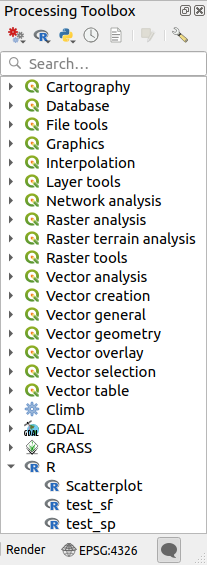

.. index:: External applications
.. _`processing.results`:

*********************************
Configuring external applications
*********************************

.. only:: html

   .. contents::
      :local:

The processing framework can be extended using additional applications.
Algorithms that rely on external applications are managed by their own
algorithm providers.
Additional providers can be found as separate plugins, and installed
using the QGIS Plugin Manager.

This section will show you how to configure the Processing framework
to include these additional applications, and it will explain some
particular features of the algorithms based on them.
Once you have correctly configured the system, you will be able to
execute external algorithms from any component like the toolbox or the
model designer, just like you do with any other algorithm.

By default, algorithms that rely on an external application not
shipped with QGIS are not enabled.
You can enable them in the Processing settings dialog if they are
installed on your system.

A note for Windows users
========================

If you are not an advanced user and you are running QGIS on Windows,
you might not be interested in reading the rest of this chapter.
Make sure you install QGIS in your system using the standalone
installer.
That will automatically install SAGA and GRASS in your system and
configure them so they can be run from QGIS.
All the algorithms from these providers will be ready to be run without
needing any further configuration.
If installing with the OSGeo4W application, make sure that you also
select SAGA and GRASS for installation.

A note on file formats
======================

When using external software, opening a file in QGIS does not mean
that it can be opened and processed in that other software.
In most cases, other software can read what you have opened in QGIS,
but in some cases, that might not be true.
When using databases or uncommon file formats, whether for raster or
vector layers, problems might arise.
If that happens, try to use well-known file formats that you are sure
are understood by both programs, and check the console output (in the
log panel) to find out what is going wrong.

You might for instance get trouble and not be able to complete your
work if you call an external algorithm with a GRASS raster layers
as input.
For this reason, such layers will not appear as available to
algorithms.

You should, however, not have problems with vector layers, since QGIS
automatically converts from the original file format to one accepted
by the external application before passing the layer to it.
This adds extra processing time, which might be significant for large
layers, so do not be surprised if it takes more time to process a
layer from a DB connection than a layer from a Shapefile format
dataset of similar size.

Providers not using external applications can process any layer that
you can open in QGIS, since they open it for analysis through QGIS.

All raster and vector output formats produced by QGIS can be used
as input layers.
Some providers do not support certain formats, but all can export to
common  formats that can later be transformed by QGIS automatically.
As for input layers, if a conversion is needed, that might increase
the processing time.

A note on vector layer selections
=================================

External applications may also be made aware of the selections that
exist in vector layers within QGIS.
However, that requires rewriting all input vector layers, just as if
they were originally in a format not supported by the external
application.
Only when no selection exists, or the *Use only selected features*
option is not enabled in the processing general configuration, can a
layer be directly passed to an external application.

In other cases, exporting only selected features is needed, which
causes longer execution times.

Using third-party Providers
===========================

.. index:: SAGA
.. _saga_configure:

SAGA
----

SAGA algorithms can be run from QGIS if SAGA is included with the
QGIS installation.

If you are running Windows, both the stand-alone installer and the
OSGeo4W installer include SAGA.

About SAGA grid system limitations
..................................

Most SAGA algorithms that require several input raster layers require
them to have the same grid system.
That is, they must cover the same geographic area and have the same
cell size, so their corresponding grids match.
When calling SAGA algorithms from QGIS, you can use any layer,
regardless of its cell size and extent.
When multiple raster layers are used as input for a SAGA algorithm,
QGIS resamples them to a common grid system and then passes them to
SAGA (unless the SAGA algorithm can operate with layers from different
grid systems).

The definition of that common grid system is controlled by the user,
and you will find several parameters in the SAGA group of the settings
window to do so.
There are two ways of setting the target grid system:

* Setting it manually. You define the extent by setting the values of
  the following parameters:

  - :guilabel:`Resampling min X`
  - :guilabel:`Resampling max X`
  - :guilabel:`Resampling min Y`
  - :guilabel:`Resampling max Y`
  - :guilabel:`Resampling cellsize`

  Notice that QGIS will resample input layers to that extent, even if
  they do not overlap with it.
* Setting it automatically from input layers.
  To select this option, just check the :guilabel:`Use min covering grid
  system for resampling` option.
  All the other settings will be ignored and the minimum extent that
  covers all the input layers will be used.
  The cell size of the target layer is the maximum of all cell sizes of
  the input layers.

For algorithms that do not use multiple raster layers, or for those that
do not need a unique input grid system, no resampling is performed
before calling SAGA, and those parameters are not used.

Limitations for multi-band layers
.................................

Unlike QGIS, SAGA has no support for multi-band layers.
If you want to use a multiband layer (such as an RGB or multispectral
image), you first have to split it into single-banded images.
To do so, you can use the 'SAGA/Grid - Tools/Split RGB image' algorithm
(which creates three images from an RGB image) or the
'SAGA/Grid - Tools/Extract band' algorithm (to extract a single band).

Limitations in cell size
........................

SAGA assumes that raster layers have the same cell size in the X and
Y axis.
If you are working with a layer with different values for horizontal
and vertical cell size, you might get unexpected results.
In this case, a warning will be added to the processing log, indicating
that an input layer might not be suitable to be processed by SAGA.

Logging
.......

When QGIS calls SAGA, it does so using its command-line interface, thus
passing a set of commands to perform all the required operations.
SAGA shows its progress by writing information to the console, which
includes the percentage of processing already done, along with
additional content.
This output is filtered and used to update the progress bar while the
algorithm is running.

Both the commands sent by QGIS and the additional information printed
by SAGA can be logged along with other processing log messages, and
you might find them useful to track what is going on when QGIS runs a
SAGA algorithm.
You will find two settings, namely :guilabel:`Log console output` and
:guilabel:`Log execution commands`, to activate that logging
mechanism.

Most other providers that use external applications and call them
through the command-line have similar options, so you will find them
as well in other places in the processing settings list.

.. index:: R scripts
.. _r_scripts:

R scripts and libraries
-----------------------

To enable R in Processing you need to install the
**Processing R Provider** plugin and configure R for QGIS.

Configuration is done in :menuselection:`Provider --> R` in the
:guilabel:`Processing` tab of
:menuselection:`Settings --> Options`.

Depending on your operating system, you may have to use
:guilabel:`R folder` to specify where your R binaries are located.

.. note:: On **Windows** the R executable file is normally in
   a folder (``R-<version>``) under :file:`C:\\Program Files\\R\\`.
   Specify the folder and **NOT** the binary!
   
   On **Linux** you just have to make sure that the R folder is
   in the PATH environment variable.
   If ``R`` in a terminal window starts R, then you are ready to go.

After installing the **Processing R Provider** plugin, you will find
some example scripts in the :guilabel:`Processing Toolbox`:

* :guilabel:`Scatterplot` runs an R function that produces a scatter
  plot from two numerical fields of the provided vector layer. 
* :guilabel:`test_sf` does some operations that depend on the ``sf``
  package and can be used to check if the R package ``sf`` is
  installed.
  If the package is not installed, R will try to install it (and all
  the packages it depends on) for you, using the
  :guilabel:`Package repository` specified in
  :menuselection:`Provider --> R` in the Processing options.
  The default is https://cran.r-project.org/.
  Installing may take some time...
* :guilabel:`test_sp` can be used to check if the R package ``sp`` is
  installed.
  If the package is not installed, R will try to install it for you.

If you have R configured correctly for QGIS, you should be able to
run these scripts.

.. index::
   pair: R scripts; Resource Sharing
.. _adding_r_scripts:

Adding R scripts from the QGIS collection
.........................................

R integration in QGIS is different from that of SAGA in that there
is not a predefined set of algorithms you can run (except for some
example script that come with the *Processing R Provider* plugin).

A set of example R scripts is available in the QGIS Repository.
Perform the following steps to load and enable them using the
*QGIS Resource Sharing* plugin.

#. Add the *QGIS Resource Sharing* plugin (you may have to
   enable :guilabel:`Show also experimental plugins` in the Plugin
   Manager :guilabel:`Settings`)
#. Open it (:menuselection:`Plugins --> Resource Sharing --> Resource Sharing`)
#. Choose the :guilabel:`Settings` tab
#. Click :guilabel:`Reload repositories`
#. Choose the :guilabel:`All` tab
#. Select :guilabel:`QGIS R script collection` in the list and
   click on the :guilabel:`Install` button
#. The collection should now be listed in the :guilabel:`Installed`
   tab
#. Close the plugin
#. Open the :guilabel:`Processing Toolbox`, and if everything is
   OK, the example scripts will be present under R, in various
   groups (only some of the groups are expanded in the screenshot
   below).

   .. figure:: img/processing_toolbox_r_scripts.png
      :align: center

      The :guilabel:`Processing Toolbox` with some R scripts shown

   The scripts at the top are the example scripts from the
   *Processing R Provider* plugin.

#. If, for some reason, the scripts are not available in the
   :guilabel:`Processing Toolbox`, you can try to:

   #. Open the Processing settings
      (:menuselection:`Settings --> Options --> Processing` tab)

   #. Go to :menuselection:`Providers --> R --> R scripts folder`

      * On Ubuntu, set the path to (or, better, include in the path):

          /home/<user>/.local/share/QGIS/QGIS3/profiles/default/resource_sharing/repositories/github.com/qgis/QGIS-Resources/collections/rscripts

        .. figure:: img/rscript_folder.png
           :align: center

      * On Windows, set the path to (or, better, include in the path):

          C:\\Users\\<user>\\AppData\\Roaming\\QGIS\\QGIS3\\profiles\\default\\resource_sharing\\repositories\\github.com\\qgis\\QGIS-Resources\\collections\\rscripts

      To edit, double-click. You can then choose to just paste / type
      the path, or you can navigate to the directory by using the
      :guilabel:`...` button and press the :guilabel:`Add` button in the
      dialog that opens.
      It is possible to provide several directories here.
      They will be separated by a semicolon (";").
   
      .. figure:: img/rscript_folder_add.png
         :align: center   

If you would like to get all the R scrips from the QGIS 2 on-line
collection, you can select *QGIS R script collection (from QGIS 2)*
instead of *QGIS R script collection*.
You will probably find that scripts that depend on vector
data input or output will not work.

.. index::
   pair: R scripts; Create
.. _creating_r_scripts:

Creating R scripts
..................

You can write scripts and call R commands, as you would do from R.
This section shows you the syntax for using R commands in QGIS, and
how to use QGIS objects (layers, tables) in them.

To add an algorithm that calls an R function (or a more complex R
script that you have developed and you would like to have available
from QGIS), you have to create a script file that performs the R
commands.

R script files have the extension :file:`.rsx`, and creating them is
pretty easy if you just have a basic knowledge of R syntax and R
scripting.
They should be stored in the R scripts folder.
You can specify the folder (:guilabel:`R scripts folder`) in the
:guilabel:`R` settings group in Processing settings dialog).

Let’s have a look at a very simple script file, which calls the R
method ``spsample`` to create a random grid within the boundary of the
polygons in a given polygon layer.
This method belongs to the ``maptools`` package.
Since almost all the algorithms that you might like to incorporate
into QGIS will use or generate spatial data, knowledge of spatial
packages like ``maptools`` and ``sp``/``sf``, is very useful.

.. code-block:: python

    ##Random points within layer extent=name
    ##Point pattern analysis=group
    ##Vector_layer=vector
    ##Number_of_points=number 10
    ##Output=output vector
    library(sp)
    spatpoly = as(Vector_layer, "Spatial")
    pts=spsample(spatpoly,Number_of_points,type="random")
    spdf=SpatialPointsDataFrame(pts, as.data.frame(pts))
    Output=st_as_sf(spdf)

The first lines, which start with a double Python comment sign
(``##``), define the display name and group of the script, and
tell QGIS about its inputs and outputs.

.. note::
   To find out more about how to write your own R scripts, have a
   look at the :ref:`R Intro <r-intro>` section in the training
   manual and consult the :ref:`QGIS R Syntax <r-syntax>` section.

When you declare an input parameter, QGIS uses that information for
two things: creating the user interface to ask the user for the value
of that parameter, and creating a corresponding R variable that can
be used as R function input.

In the above example, we have declared an input of type ``vector``,
named ``Vector_layer``.
When executing the algorithm, QGIS will open the layer selected
by the user and store it in a variable named ``Vector_layer``.
So, the name of a parameter is the name of the variable that you
use in R for accessing the value of that parameter (you should
therefore avoid using reserved R words as parameter names).

Spatial parameters such as vector and raster layers are read using
the ``st_read()`` (or ``readOGR``) and ``brick()`` (or ``readGDAL``)
commands (you do not have to worry about adding those commands to
your description file -- QGIS will do it), and they are stored as
``sf`` (or ``Spatial*DataFrame``) objects.

Table fields are stored as strings containing the name of the
selected field.

Vector files can be read using the ``readOGR()`` command instead
of ``st_read()`` by specifying ``##load_vector_using_rgdal``.
This will produce a ``Spatial*DataFrame`` object instead of an
``sf`` object.

Raster files can be read using the ``readGDAL()`` command instead
of ``brick()`` by specifying ``##load_raster_using_rgdal``.

If you are an advanced user and do not want QGIS to create the
object for the layer, you can use ``##pass_filenames`` to indicate
that you prefer a string with the filename.
In this case, it is up to you to open the file before performing
any operation on the data it contains.

With the above information, it is possible to understand the first
lines of the R script (the first line not starting with a Python
comment character).

.. code-block:: python

    library(sp)
    spatpoly = as(Vector_layer, "Spatial")
    pts=spsample(polyg,numpoints,type="random")

The ``spsample`` function is provided by the *sp* library, so
the first thing we do is to load that library.
The variable ``Vector_layer`` contains an ``sf`` object.
Since we are going to use a function (``spsample``) from the *sp*
library, we must convert the ``sf`` object to a
``SpatialPolygonsDataFrame`` object using the ``as`` function.

Then we call the ``spsample`` function with this object and
the ``numpoints`` input parameter (which specifies the number of
points to generate).

Since we have declared a vector output named ``Output``, we have to
create a variable named ``Output`` containing an ``sf`` object.

We do this in two steps.
First we create a ``SpatialPolygonsDataFrame`` object from the
result of the function, using the *SpatialPointsDataFrame* function,
and then we convert that object to an ``sf`` object using the
``st_as_sf`` function (of the *sf* library).

You can use whatever names you like for your intermediate
variables.
Just make sure that the variable storing your final result has
the defined name (in this case ``Output``), and that it contains
a suitable value (an ``sf`` object for vector layer output).

In this case, the result obtained from the ``spsample`` method had
to be converted explicitly into an ``sf`` object via a
``SpatialPointsDataFrame`` object, since it is itself an object of
class ``ppp``, which can not be returned to QGIS.

If your algorithm generates raster layers, the way they are saved
will depend on whether or not you have used the
``##dontuserasterpackage`` option.
If you have used it, layers are saved using the ``writeGDAL()``
method.
If not, the ``writeRaster()`` method from the ``raster`` package
will be used.

If you have used the ``##pass_filenames`` option, outputs are
generated using the ``raster`` package (with ``writeRaster()``).

If your algorithm does not generate a layer, but a text result in
the console instead, you have to indicate that you want the
console to be shown once the execution is finished.
To do so, just start the command lines that produce the results
you want to print with the ``>`` ('greater than') sign.
Only output from lines prefixed with ``>`` are shown.
For instance, here is the description file of an algorithm that
performs a normality test on a given field (column) of the
attributes of a vector layer:

.. code-block:: python

    ##layer=vector
    ##field=field layer
    ##nortest=group
    library(nortest)
    >lillie.test(layer[[field]])

The output of the last line is printed, but the output of the first
is not (and neither are the outputs from other command lines added
automatically by QGIS).

If your algorithm creates any kind of graphics (using the ``plot()``
method), add the following line (``output_plots_to_html`` used to be
``showplots``):

.. code-block:: python

    ##output_plots_to_html

This will cause QGIS to redirect all R graphical outputs to a
temporary file, which will be opened once R execution has finished.

Both graphics and console results will be available through the
processing results manager.

For more information, please check the R scripts in the official
QGIS collection (you download and install them using the *QGIS
Resource Sharing* plugin, as explained in :ref:`adding_r_scripts`).
Most of them are rather simple and will greatly help you understand
how to create your own scripts.

.. note::
   The ``sf``, ``rgdal`` and ``raster`` libraries are loaded by default,
   so you do not have to add the corresponding ``library()`` commands.
   However, other libraries that you might need have to be
   explicitly loaded by typing:
   ``library(ggplot2)`` (to load the ``ggplot2`` library).
   If the package is not already installed on your machine, Processing
   will try to download and install it.
   In this way the package will also become available in R Standalone.
   **Be aware** that if the package has to be downloaded, the script
   may take a long time to run the first time.

.. index:: R libraries

R libraries installed when running sf_test
..........................................

The R script ``sp_test`` tries to load the R packages ``sp`` and ``raster``.

The R script *sf_test* tries to load ``sf`` and ``raster``.
If these two packages are not installed, R may try to load and install them
(and all the libraries that they depend on).

The following R libraries end up in
:file:`~/.local/share/QGIS/QGIS3/profiles/default/processing/rscripts`
after ``sf_test`` has been run from the Processing Toolbox on Ubuntu with
version 2.0 of the *Processing R Provider* plugin and a fresh install of
*R* 3.4.4 (*apt* package ``r-base-core`` only):

::

 abind, askpass, assertthat, backports, base64enc, BH, bit, bit64, blob, brew, callr, classInt, cli, colorspace, covr, crayon, crosstalk, curl, DBI, deldir,
 desc, dichromat, digest, dplyr, e1071, ellipsis, evaluate, fansi, farver, fastmap, gdtools, ggplot2, glue, goftest, gridExtra, gtable, highr, hms,
 htmltools, htmlwidgets, httpuv, httr, jsonlite, knitr, labeling, later, lazyeval, leafem, leaflet, leaflet.providers, leafpop, leafsync, lifecycle, lwgeom,
 magrittr, maps, mapview, markdown, memoise, microbenchmark, mime, munsell, odbc, openssl, pillar, pkgbuild, pkgconfig, pkgload, plogr, plyr, png, polyclip,
 praise, prettyunits, processx, promises, ps, purrr, R6, raster, RColorBrewer, Rcpp, reshape2, rex, rgeos, rlang, rmarkdown, RPostgres, RPostgreSQL,
 rprojroot, RSQLite, rstudioapi, satellite, scales, sf, shiny, sourcetools, sp, spatstat, spatstat.data, spatstat.utils, stars, stringi, stringr, svglite,
 sys, systemfonts, tensor, testthat, tibble, tidyselect, tinytex, units, utf8, uuid, vctrs, viridis, viridisLite, webshot, withr, xfun, XML, xtable

.. index::
   pair: GRASS; Configure
.. _grass_configure:

GRASS
-----

Configuring GRASS is not much different from configuring SAGA.
First, the path to the GRASS folder has to be defined,
but only if you are running Windows.

By default, the Processing framework tries to configure its GRASS
connector to use the GRASS distribution that ships along with QGIS.
This should work without problems for most systems, but if you experience problems,
you might have to configure the GRASS connector manually.
Also, if you want to use a different GRASS installation, you can
change the setting to point to the folder where the other version
is installed.
GRASS 7 is needed for algorithms to work correctly.

If you are running Linux, you just have to make sure that GRASS is
correctly installed, and that it can be run without problem
from a terminal window.

GRASS algorithms use a region for calculations.
This region can be defined manually using values similar to the ones
found in the SAGA configuration, or automatically, taking the minimum extent
that covers all the input layers used to execute the algorithm each time.
If the latter approach is the behavior you prefer, just check the
:guilabel:`Use min covering region` option in the GRASS configuration
parameters.

.. index:: LAStools
.. _lastools_configure:

LAStools
--------

To use `LAStools <https://rapidlasso.com/lastools/>`_ in QGIS,
you need to download and install LAStools on your computer and
install the LAStools plugin (available from the official repository) in QGIS.

On Linux platforms, you will need `Wine <https://www.winehq.org/>`_
to be able to run some of the tools.

LAStools is activated and configured in the Processing options
(:menuselection:`Settings --> Options`, :guilabel:`Processing` tab,
:menuselection:`Providers --> LAStools`), where you can specify the
location of LAStools (:guilabel:`LAStools folder`) and Wine
(:guilabel:`Wine folder`).
On Ubuntu, the default Wine folder is :file:`/usr/bin`.

.. index:: OTB
.. _otb_configure:

OTB Applications
-----------------

OTB applications are fully supported within the QGIS Processing framework.

`OTB <https://www.orfeo-toolbox.org>`_ (Orfeo ToolBox) is an image
processing library for remote sensing data. It also provides
applications that provide image processing functionalities.
The list of applications and their documentation are available in
`OTB CookBook <https://www.orfeo-toolbox.org/CookBook/Applications.html>`__

.. note::
   Note that OTB is not distributed with QGIS and needs to be installed
   separately. Binary packages for OTB can be found on the
   `download page <https://www.orfeo-toolbox.org/download>`_.

To configure QGIS processing to find the OTB library:

#. Open the processing settings: :menuselection:`Settings --> Options --> Processing`
#. You can see ``OTB`` under :menuselection:`Providers` menu:

   #. Expand the :guilabel:`OTB` entry
   #. Set the :guilabel:`OTB folder`. This is the location of your OTB installation.
   #. Set the :guilabel:`OTB application folder`. This is the location of your OTB
      applications ( :file:`<PATH_TO_OTB_INSTALLATION>/lib/otb/applications`)
   #. Click :guilabel:`OK` to save the settings and close the dialog.
   
If settings are correct, OTB algorithms will be available in the :guilabel:`Processing Toolbox`.

Documentation of OTB settings available in QGIS Processing
...........................................................

* **OTB folder**: This is the directory where OTB is available. 

* **OTB application folder**: This is the location(s) of OTB applications. 

  Multiple paths are allowed.

* **Logger level** (optional): Level of logger to use by OTB applications. 

  The level of logging controls the amount of detail printed during
  algorithm execution. Possible values for logger level are ``INFO``,
  ``WARNING``, ``CRITICAL``, ``DEBUG``. This value is ``INFO`` by default.
  This is an advanced user configuration.

* **Maximum RAM to use** (optional): by default, OTB applications use
  all available system RAM.

  You can, however, instruct OTB to use a specific amount of RAM (in MB)
  using this option. A value of 256 is ignored by the OTB processing provider.
  This is an advanced user configuration.

* **Geoid file** (optional): Path to the geoid file.

  This option sets the value of the elev.dem.geoid and elev.geoid
  parameters in OTB applications.
  Setting this value globally enables users to share it across multiple
  processing algorithms. Empty by default.

* **SRTM tiles folder** (optional): Directory where SRTM tiles are available.

  SRTM data can be stored locally to avoid downloading of
  files during processing. This option sets the value of elev.dem.path
  and elev.dem parameters in OTB applications. Setting this value
  globally enables users to share it across multiple processing algorithms.
  Empty by default.

Compatibility and Troubleshoot
..............................

Starting from OTB 6.6.1, new releases of OTB are made compatible
with at least the latest QGIS version available at that time.

If you have issues with OTB applications in QGIS Processing, please open an issue
on the `OTB bug tracker <https://gitlab.orfeo-toolbox.org/orfeotoolbox/otb/-/issues>`_, 
using the ``qgis`` label.

Additional information about OTB and QGIS can be found in
`OTB Cookbook <https://www.orfeo-toolbox.org/CookBook-develop/QGISInterface.html>`__.
