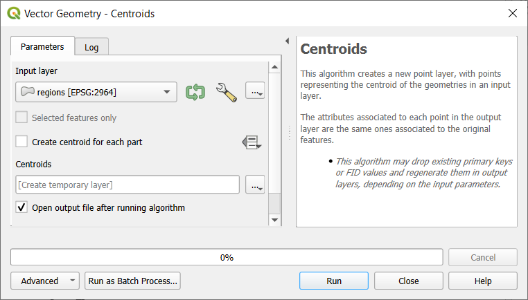
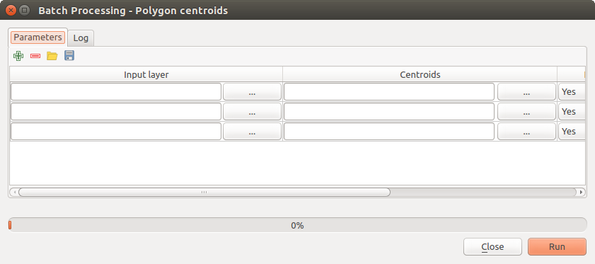

.. _processing_batch:

The batch processing interface
===============================

.. only:: html

   .. contents::
      :local:

Introduction
------------

All algorithms (including models) can be executed as a batch process. That
is, they can be executed using not just a single set of inputs, but several of them,
executing the algorithm as many times as needed. This is useful when processing
large amounts of data, since it is not necessary to launch the algorithm many
times from the toolbox.

To execute an algorithm as a batch process, right-click on its name in the toolbox
and select the :guilabel:`Execute as batch process` option in the pop-up menu
that will appear.

.. _figure_processing_batch_start:

.. figure:: img/batch_processing_right_click.png
   :align: center

   Batch Processing from right-click

If you have the execution dialog of the algorithm open, you can also start the
batch processing interface from there, clicking on the :guilabel:`Run as batch
process...` button.

.. _figure_processing_batch_start2:

   Batch Processing From Algorithm Dialog

The parameters table
--------------------

Executing a batch process is similar to performing a single execution of an
algorithm. Parameter values have to be defined, but in this case we need not just
a single value for each parameter, but a set of them instead, one for each time
the algorithm has to be executed. Values are introduced using a table like the
one shown next, where each row is an iteration and columns are the parameters
of the algorithm.

.. _figure_processing_batch_parameters:

   Batch Processing

From the top toolbar, you can:

* |processingAlgorithm| :sup:`Toggle advanced mode`:
  Available only when the algorithm has parameters that are marked as advanced,
  this button allows to show or hide such parameters in the batch dialog.
* |symbologyAdd| :sup:`Add row`: adds a new processing entry for configuration
* |symbologyRemove| :sup:`Remove row(s)`: remove selected rows from the table.
  Row selection is done by clicking the number at the left and allows
  :ref:`keyboard combination <interacting_features_table>` for multi selection.
* |fileOpen| :sup:`Open` a batch processing configuration file
* |fileSave| :sup:`Save` the batch processing configuration to a :file:`.JSON`
  file that can be run afterwards

By default, the table contains just two rows:

* The first row displays in each cell an :menuselection:`Autofill... -->`
  drop-down menu with :ref:`options <batch_parameters>` to quickly fill
  the cells below. Available options depend on the parameter type.
* The second row (as well as each subsequent one) represents a single execution
  of the algorithm, and each cell contains the value of one of the parameters.
  It is similar to the parameters dialog that you see when executing an algorithm
  from the toolbox, but with a different arrangement.

At the bottom of the table, you can set whether to |checkbox| :guilabel:`Load
layers on completion`.

Once the size of the table has been set, it has to be filled with the desired
values.

.. _batch_parameters:

Filling the parameters table
----------------------------

For most parameters, setting the value is trivial. The appropriate widget,
same as in the :ref:`single process dialog <algorithm_widgets>`, is provided,
allowing to just type the value, or select it from a list of possible values,
depending on the parameter type.
This also includes data-define widget, when compatible.

To automate the batch process definition and avoid filling the table
cell by cell, you may want to press down the :guilabel:`Autofill...` menu
of a parameter and select any of the following options to replace values
in the column:

* :guilabel:`Fill Down` will take the input for the first process and enter
  it for all other processes.
* |calculateField| :guilabel:`Calculate by Expression...` will allow you
  to create a new QGIS expression to use to update all existing values within
  that column. Existing parameter values (including those from other columns)
  are available for use inside the expression via :ref:`variables
  <general_tools_variables>`.
  E.g. setting the number of segments based on the buffer distance of each layer:

  ::

     CASE WHEN @DISTANCE > 20 THEN 12 ELSE 8 END

* :guilabel:`Add Values by Expression...` will add new rows using the values
  from an expression which returns an array (as opposed to :guilabel:`Calculate
  by Expression...`, which works only on existing rows). The intended use case
  is to allow populating the batch dialog using complex numeric series.
  For example adding rows for a batch buffer using the expression
  ``generate_series(100, 1000, 50)`` for distance parameter results in new rows
  with values 100, 150, 200, .... 1000.

* When setting a file or layer parameter, more options are provided:

  * :guilabel:`Add Files by Pattern...`: adds new rows to the table for files
    matching a :guilabel:`File pattern` in a folder to :guilabel:`Look in`.
    E.g. ``*.shp`` will add to the list all the :file:`SHP` files in the folder.
    Check |checkbox| :guilabel:`Search recursively` to also browse sub-folders.
  * :guilabel:`Select Files...` individually on disk
  * :guilabel:`Add All Files from a Directory...`
  * :guilabel:`Select from Open Layers...` in the active project

Output data parameter exposes the same capabilities as when executing the algorithm
as a single process. Depending on the algorithm, the output can be:

* skipped, if the cell is left empty
* saved as a temporary layer: fill the cell with ``TEMPORARY_OUTPUT`` and remember
  to tick the |checkbox| :guilabel:`Load layers on completion` checkbox.
* saved as a plain file (:file:`.SHP`, :file:`.GPKG`, :file:`.XML`, :file:`.PDF`, :file:`.JPG`,...)
  whose path could be set with the :guilabel:`Autofill` options exposed beforehand.
  E.g. use :guilabel:`Calculate by Expression...` to set output file names
  to complex expressions like:

  ::

     '/home/me/stuff/buffer_' || left(@INPUT, 30) || '_' || @DISTANCE || '.shp'

  You can also type the file path directly or use the file chooser dialog that
  appears when clicking on the accompanying :guilabel:`...` button.
  Once you select the file, a new dialog is shown to allow for auto-completion of
  other cells in the same column (same parameter).

  .. _figure_processing_save:

  .. figure:: img/batch_processing_save.png
     :align: center

     Batch Processing Save

  If the default value (:guilabel:`Do not autofill`) is selected, it will just put
  the selected filename in the selected cell from the parameters table. If any of
  the other options is selected, all the cells **below** the selected one will be
  automatically filled based on a defined criteria:

  * :guilabel:`Fill with numbers`: incrementally appends a number to the file name
  * :guilabel:`Fill with parameter values`: you can select a parameter whose value
    in the same row is appended to the file name. This is particularly useful for
    naming output data objects according to input ones.

* saved as a layer within a database container:

  ::

    # Indicate a layer within a GeoPackage file 
    ogr:dbname='C:/Path/To/Geopackage.gpkg' table="New_Table" (geom)

    # Use the "Calculate By Expression" to output to different layers in a GeoPackage
    'ogr:dbname=\'' || @project_folder || '/Buffers.gpkg\' table="' || @INPUT || '_' || @DISTANCE || '" (geom)'

Executing the batch process
---------------------------

To execute the batch process once you have introduced all the necessary values,
just click on :guilabel:`Run`. The :guilabel:`Log` panel is activated and
displays details and steps of the execution process. Progress of the global
batch task will be shown in the progress bar in the lower part of the dialog.

.. Substitutions definitions - AVOID EDITING PAST THIS LINE
   This will be automatically updated by the find_set_subst.py script.
   If you need to create a new substitution manually,
   please add it also to the substitutions.txt file in the
   source folder.

.. |calculateField| image:: /static/common/mActionCalculateField.png
   :width: 1.5em
.. |checkbox| image:: /static/common/checkbox.png
   :width: 1.3em
.. |fileOpen| image:: /static/common/mActionFileOpen.png
   :width: 1.5em
.. |fileSave| image:: /static/common/mActionFileSave.png
   :width: 1.5em
.. |processingAlgorithm| image:: /static/common/processingAlgorithm.png
   :width: 1.5em
.. |symbologyAdd| image:: /static/common/symbologyAdd.png
   :width: 1.5em
.. |symbologyRemove| image:: /static/common/symbologyRemove.png
   :width: 1.5em
