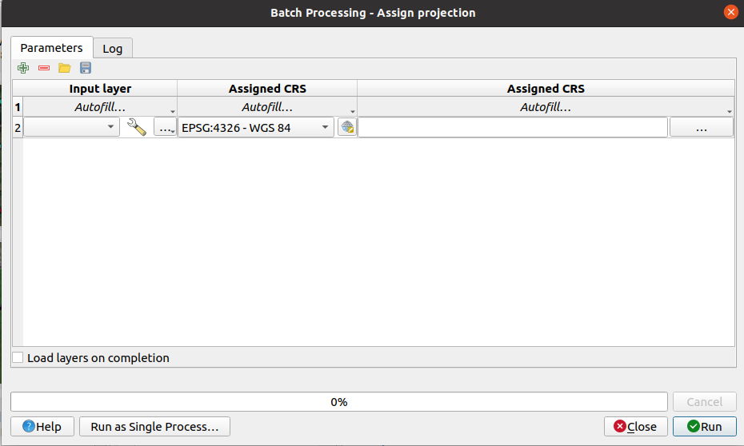

.. _sec_processing_intro:

Introduction
============

This chapter introduces the QGIS processing framework, a geoprocessing environment
that can be used to call native and third-party algorithms from QGIS, making your
spatial analysis tasks more productive and easy to accomplish.

In the following sections, we will review how to use the graphical elements of
this framework and make the most out of each one of them.

There are four basic elements in the framework GUI, which are used to run
algorithms for different purposes. Choosing one tool or another will depend on
the kind of analysis that is to be performed and the particular characteristics
of each user and project. All of them (except for the batch processing interface,
which is called from the toolbox or the algorithm execution dialog, as we will
see) can be accessed from the :menuselection:`Processing` menu item (you will
see more entries; the remaining ones are not used to execute algorithms
and will be explained later in this chapter).

* The :guilabel:`Toolbox`: The main element of the GUI, it is used to
  execute a single algorithm or run a batch process based on that algorithm.

.. _figure_toolbox_dialog:

.. figure:: img/toolbox.png
   :align: center

   Processing Toolbox

* The :guilabel:`Graphical Modeler`: Several algorithms can be combined
  graphically using the modeler to define a workflow, creating a single
  process that involves several subprocesses.

.. _figure_model_dialog:

.. figure:: img/models.png
   :align: center

   Processing Modeler

* The :guilabel:`History` manager: All actions performed using any of the
  aforementioned elements are stored in a history file and can be later easily
  reproduced using the history manager.

.. _figure_history_dialog:

.. figure:: img/history.png
   :align: center

   Processing History

* The :guilabel:`Batch Processing` interface: This interface allows you to
  execute batch processes and automate the execution of a single algorithm on
  multiple datasets.

.. _figure_batchprocess_dialog:

   Batch Processing interface

In the following sections, we will review each one of these elements in detail.
