.. _`processing.modeler`:

The model designer
=====================

.. only:: html

   .. contents::
      :local:

The *model designer* allows you to create complex models using
a simple and easy-to-use interface.
When working with a GIS, most analysis operations are not
isolated, rather part of a chain of operations.
Using the model designer, that chain of operations can be wrapped
into a single process, making it convenient to execute later with a
different set of inputs.
No matter how many steps and different algorithms it involves, a
model is executed as a single algorithm, saving time and effort.

The model designer can be opened from the Processing menu
(:menuselection:`Processing --> Model Designer`).

The model designer interface
-------------------------------

.. _figure_modeler:

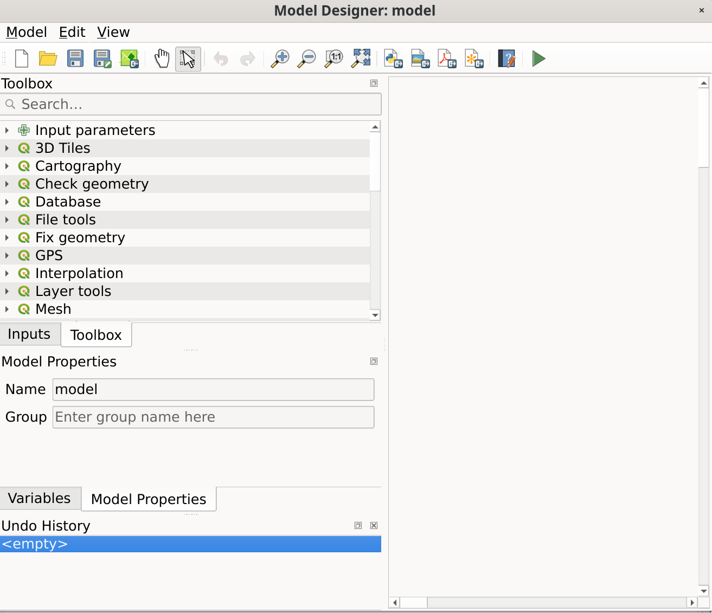

   Model designer

In its main part, the modeler has a working canvas where the structure
of the model and the workflow it represents can be constructed.

At the top of the dialog, different menus and the :guilabel:`Navigation`
toolbar give access to a variety of tools.

Model menu
..........

.. list-table::
   :header-rows: 1
   :widths: 25 12 12 50

   * - Label
     - Shortcut
     - Navigation Toolbar
     - Description
   * - |success| :guilabel:`Validate Model`
     -
     -
     - Checks whether the algorithms and inputs used in the model exist.
       Convenient before releasing a model.
   * - |play| :guilabel:`Run Model...`
     - :kbd:`F5`
     - |checkbox|
     - Executes the model
   * - :guilabel:`Reorder Model Inputs...`
     -
     -
     - Sets the order in which inputs are presented to the user in the algorithm dialog.
   * - :guilabel:`Reorder Output Layers...`
     -
     -
     - Sets a specific order which the outputs from the model must use when loading the
       results into a project.
   * - |fileOpen| :guilabel:`Open Model...`
     - :kbd:`Ctrl+O`
     - |checkbox|
     - Opens a :file:`.model3` file for edit or execution
   * - |fileSave| :guilabel:`Save Model`
     - :kbd:`Ctrl+S`
     - |checkbox|
     - Saves the model to disk as a :file:`.model3` file
   * - |fileSaveAs| :guilabel:`Save Model as...`
     - :kbd:`Ctrl+Shift+S`
     - |checkbox|
     - Saves the model to disk as a new :file:`.model3` file
   * - |fileSave| :guilabel:`Save Model in project`
     -
     - |checkbox|
     - Embeds the model file in the project file, making it available when sharing the project file.
   * - |helpContents| :guilabel:`Edit Model Help...`
     -
     - |checkbox|
     - An interface to document the model, the algorithms, the parameters and outputs,
       as well as the author and versioning
   * - :menuselection:`Export -->`
     -
     -
     -
   * - |saveMapAsImage| :menuselection:`--> Export as Image...`
     -
     - |checkbox|
     - Saves the model's graphical design to an image file format (for illustration purpose)
   * - |saveAsPDF|:menuselection:`--> Export as PDF...`
     -
     -
     - Saves the model's graphical design to a :file:`PDF` file format (for illustration purpose)
   * - |saveAsSVG|:menuselection:`--> Export as SVG...`
     -
     -
     - Saves the model's graphical design to an :file:`SVG` file format (for illustration purpose)
   * - |fileSave|:menuselection:`--> Export as Script Algorithm...`
     -
     - |checkbox|
     - Generates a python script file including the model's instructions

Edit menu
.........

.. list-table::
   :header-rows: 1
   :widths: 25 12 12 50

   * - Label
     - Shortcut
     - Navigation Toolbar
     - Description
   * - |selectAll| :guilabel:`Select All`
     - :kbd:`Ctrl+A`
     -
     - Selects all the model components in the designer
   * - :guilabel:`Snap selected components to Grid`
     -
     -
     - snaps and aligns the elements into a grid
   * - |redo| :guilabel:`Redo`
     - :kbd:`Ctrl+Y`
     - |checkbox|
     - Rollback the latest canceled action. See also the :guilabel:`Undo/Redo` panel.
   * - |undo| :guilabel:`Undo`
     - :kbd:`Ctrl+Z`
     - |checkbox|
     - Cancel the previous change. See also the :guilabel:`Undo/Redo` panel.
   * - |editCut| :guilabel:`Cut`
     - :kbd:`Ctrl+X`
     -
     - Cuts a selection of components from the model.
   * - |editCopy| :guilabel:`Copy`
     - :kbd:`Ctrl+C`
     -
     - Copies a selection of components from the model.
   * - |editPaste| :guilabel:`Paste`
     - :kbd:`Ctrl+V`
     -
     - Pastes a cut or copied selection of components from a model to another
       or within the same model.
       The selected components keep their original properties and comments.
   * - |deleteSelected| :guilabel:`Delete selected components`
     - :kbd:`Del`
     -
     - Removes a component from the model.
   * - :guilabel:`Add Group Box`
     -
     -
     - Adds a box at the background of related components in order to visually
       group them. Particularly useful in big models to keep the workflow clean.

View menu
.........

.. list-table::
   :header-rows: 1
   :widths: 25 12 12 50

   * - Label
     - Shortcut
     - Navigation Toolbar
     - Description
   * - :menuselection:`Zoom To -->`
     -
     -
     - Zooms to the selected group box extent
   * - |zoomIn| :guilabel:`Zoom In`
     - :kbd:`Ctrl++`
     - |checkbox|
     -
   * - |zoomOut| :guilabel:`Zoom Out`
     - :kbd:`Ctrl+-`
     - |checkbox|
     -
   * - |zoomActual| :guilabel:`Zoom to 100%`
     - :kbd:`Ctrl+1`
     - |checkbox|
     -
   * - |zoomFullExtent| :guilabel:`Zoom Full`
     - :kbd:`Ctrl+0`
     - |checkbox|
     - Displays all the components in the designer current canvas
   * - |checkbox| :guilabel:`Show Comments`
     -
     -
     - Displays comments associated to every algorithm or input in the model designer
   * - |unchecked| :guilabel:`Enable Snapping`
     -
     -
     -
   * - |unchecked| :guilabel:`Toggle Panel Visibility`
     - :kbd:`Ctrl+Tab`
     -
     - Switches ON or OFF the :ref:`panels <modelerpanels>` in the designer

.. _modelerpanels:

Panels
......

The left part of the window is a section with five panels that can be used
to add new elements to the model:

#. :guilabel:`Model Properties`: specify the name (required) of the model and
   the group in which it will be displayed in the :ref:`Processing Toolbox <processing.toolbox>`
#. :guilabel:`Inputs`: all the :ref:`input parameters <processing_inputs>` that could shape
   your model
#. :guilabel:`Algorithms`: the available :ref:`Processing algorithms <processing_algs>`
#. :guilabel:`Variables`: Models can contain dedicated :ref:`variables
   <general_tools_variables>` that are unique and only available to them.
   These variables can be accessed by any expression used within the model.
   They are useful to control algorithms within a model and control multiple
   aspects of the model by changing a single variable.
   The variables can be viewed and modified in the :guilabel:`Variables` panel.
#. :guilabel:`Undo History`: this panel will register everything that happens in the
   modeler, making it easy to cancel things you did wrong.

About available algorithms
..........................

Some algorithms that can be executed from the toolbox do not appear
in the list of available algorithms when you are designing a model.
To be included in a model, an algorithm must have the correct
semantic.
If an algorithm does not have such a well-defined semantic (for
instance, if the number of output layers cannot be known in advance),
then it is not possible to use it within a model, and it will not
appear in the list of algorithms that you can find in the modeler
dialog.
On the other hand some algorithms are specific to the modeler.
Those algorithms are located within the group 'Modeler Tools'.

Creating a model
----------------

Creating a model involves two basic steps:

#. *Definition of necessary inputs*.
   These inputs will be added to the parameters window, so the user
   can set their values when executing the model.
   The model itself is an algorithm, so the parameters window is
   generated automatically as for all algorithms
   available in the Processing framework.
#. *Definition of the workflow*.
   Using the input data of the model, the workflow is defined by
   adding algorithms and selecting how they use the defined inputs
   or the outputs generated by other algorithms in the model.

.. _processing_inputs:

Definition of inputs
....................

The first step is to define the inputs for the model.
They are found in the :guilabel:`Inputs` panel on the left side of the modeler window.
Hovering with the mouse over the inputs will show a tooltip with additional information.
For a full list of available parameters in modeler and their correspondance for scripting,
please read :ref:`processing_algs_input_output`.

When double-clicking on an element, a dialog is shown that lets
you define its characteristics.
Depending on the parameter, the dialog will contain at least one
element (the description, which is what the user will see when
executing the model).
For example, when adding a numerical value, as can be seen in the next figure,
in addition to the description of the parameter, you have to set a
default value and the range of valid values.

.. _figure_model_parameter:

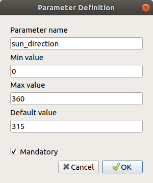

   Model Parameters Definition

You can define your input as mandatory for your model by checking the
|checkbox| ``Mandatory`` option and by checking the |unchecked| ``Advanced``
checkbox you can set the input to be within the ``Advanced`` section. This is
particularly useful when the model has many parameters and some of them are not
trivial, but you still want to choose them.

For each added input, a new element is added to the modeler canvas.

.. _figure_model_parameter_canvas:

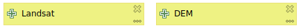

   Model Parameters

You can also add inputs by dragging the input type from the list and
dropping it at the position where you want it in the modeler canvas. If you want
to change a parameter of an existing input, just double click on it, and the
same dialog will pop up.

When using a model within another model, the inputs and outputs necessary will
be displayed in the canvas.

Definition of the workflow
..........................

In the following example we will add two inputs and two algorithms. The aim of
the model is to copy the elevation values from a DEM raster layer to a line layer
using the ``Drape`` algorithm,  and then calculate the total ascent of the line
layer using the ``Climb Along Line`` algorithm.

In the :guilabel:`Inputs` tab, choose the two inputs as ``Vector Layer`` for the line and
``Raster Layer`` for the DEM.
We are now ready to add the algorithms to the workflow.

Algorithms can be found in the :guilabel:`Algorithms` panel, grouped
much in the same way as they are in the Processing toolbox.

.. _figure_model_parameter_inputs:

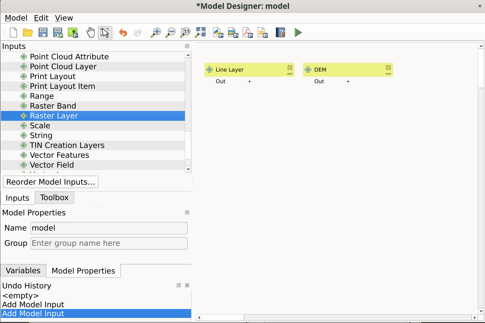

   Model Inputs

To add an algorithm to a model, double-click on its name or drag and drop it, just like for inputs.
As for the inputs you can change the description of the algorithm and add a comment.
When adding an algorithm, an execution dialog will appear, with a content similar
to the one found in the execution panel that is shown when executing the algorithm from the toolbox.
The following picture shows both the ``Drape (set Z value from raster)``
and the ``Climb along line`` algorithm dialogs.

.. _figure_model_parameter_alg:

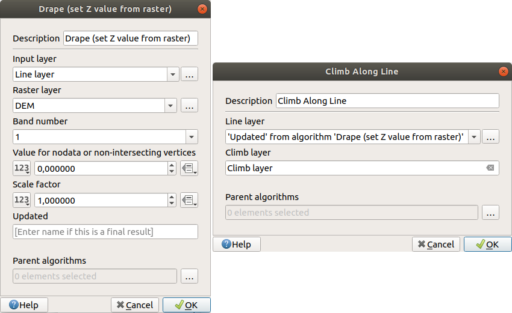

   Model Algorithm parameters

As you can see, there are however some differences.
Each parameter has a drop-down menu next to it allowing to control
how it will be served during the workflow:

* |fieldInteger| :sup:`Value`: allows you to assign a static value to the parameter.
  Depending on the parameter type, the widget will let you enter a number (``5.0``),
  a string (``mytext``), select layer(s) loaded in the QGIS project or from a folder,
  pick items from a list, ...
* |expression| :sup:`Pre-calculated Value`: opens the :ref:`Expression Builder <vector_expressions>` dialog
  and lets you define an expression to fill the parameter.
  Model inputs together with some other layer statistics are available as **variables**
  and are listed at the top of the Search dialog of the Expression Builder.
  The expression is evaluated once before the child algorithm is executed
  and used during the execution of that algorithm.
* |processingModel| :sup:`Model Input`: allows to use an input added to the model as a parameter.
  Once clicked, this option will list all the suitable inputs for the parameter.
* |processingAlgorithm| :sup:`Algorithm Output`:
  allows to use the output of another algorithm as an input of the current algorithm.
  As of model inputs, this option will list all the suitable inputs for the parameter.
* The **output parameter** also has the above options in its drop-down menu:

  * add static outputs for child algorithms,
    e.g. always saving a child algorithm's output to a predefined geopackage or postgres layer
  * use an expression based output values for child algorithms,
    e.g. generating an automatic file name based on today's date and saving outputs to that file
  * use a model input,
    e.g. the *File/Folder* model input to specify an output file or folder
  * use another algorithm output,
    e.g. the output of the *Create directory* algorithm (from *Modeler tools*)
  * an addditional |modelOutput| :sup:`Model Output` option makes the output of the algorithm available in the model.
    If a layer generated by the algorithm is only to be used as input to another algorithm,
    don't edit that text box.

  In the following picture you can see the two input parameters defined as
  ``Model Input`` and the temporary output layer:

  .. figure:: img/models_parameters5.png
     :align: center

     Algorithm Input and Output parameters

You will also find an additional parameter named :guilabel:`Dependencies`
that is not available when calling the algorithm from the toolbox.
This parameter allows you to define the order in which algorithms are executed,
by explicitly defining one algorithm as a *parent* of the current one.
This will force the *parent* algorithm to be executed before the current one.

When you use the output of a previous algorithm as the input of your
algorithm, that implicitly sets the previous algorithm as parent of the
current one (and places the corresponding arrow in the modeler canvas).
However, in some cases an algorithm might depend on another one even if
it does not use any output object from it (for instance, an algorithm
that executes a SQL sentence on a PostGIS database and another one that
imports a layer into that same database).
In that case, just select the previous algorithm in the
*Dependencies* parameter and they will be executed in the correct
order.

Once all the parameters have been assigned valid values, click on
:guilabel:`OK` and the algorithm will be added to the canvas.
It will be linked to the elements in the canvas (algorithms or inputs)
that provide objects that are used as inputs for the algorithm.

Elements can be dragged to a different position on the canvas using the
|select| :sup:`Select/Move Item` tool.
This is useful to make the structure of the model clearer and more intuitive.
You can also resize the elements, grasping their border.
This is particularly useful if the description of the input or algorithm is long.
With :menuselection:`View --> Enable snapping` option checked, items resizing
or displacement can be bound to a virtual grid, for a more visually structured
algorithm design.

Links between elements are updated automatically and you can see a ``+`` button
at the top and at the bottom of each algorithm. Clicking the button will list
all the inputs and outputs of the algorithm so you can have a quick overview.

.. _figure_model_model:

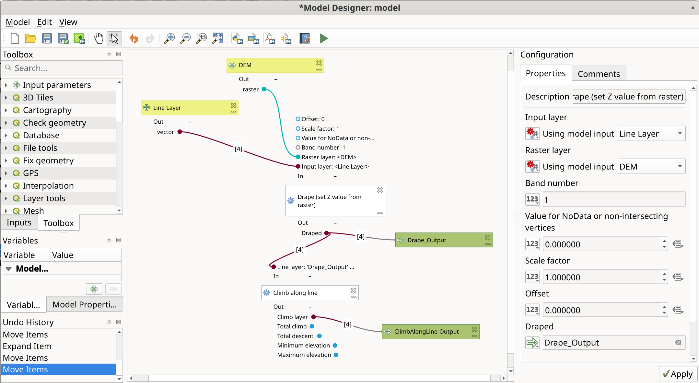

   A complete model

With the :menuselection:`Edit --> Add Group Box` tool, you can add a draggable
*box* to the canvas. This feature is very
useful in big models to group related elements in the modeler canvas and to keep the
workflow clean. For example we might group together all the inputs of the
example:

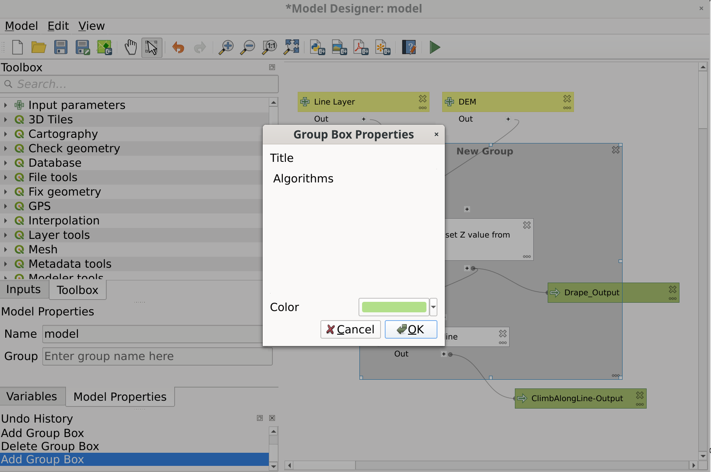

   Model Group Box

You can change the name and the color of the boxes.
Group boxes are very useful when used together with :menuselection:`View -->
Zoom To -->` tool, allowing you to zoom to a specific part of the model.
You can also zoom in and out by using the mouse wheel.

You might want to change the order of the inputs and how they are listed in the
main model dialog. At the bottom of the ``Input`` panel you will find the
``Reorder Model Inputs...`` button and by clicking on it a new dialog pops up
allowing you to change the order of the inputs:

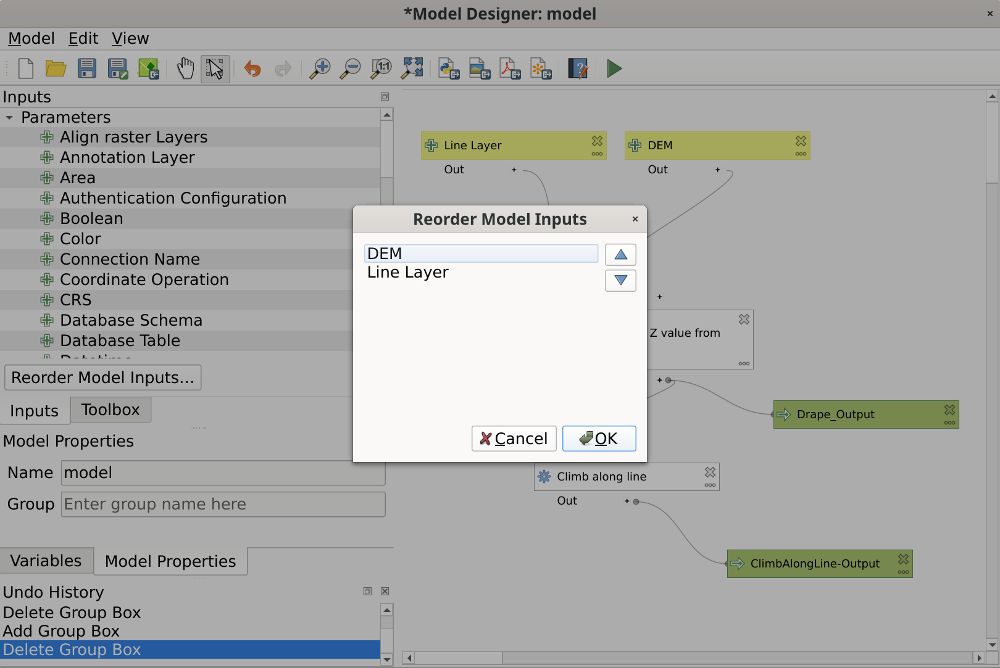

   Reorder Model Inputs

There is also the possibility to set a specific order which the outputs from
the model must use when loading the results into a project. This gives the model
creator a means of ensuring that layers are logically ordered on the canvas when
running a model, such as placing a vector layer output over a raster layer output,
or a point layer over a polygon layer.
The model creator can also set an optional "Group name" for the outputs for 
automatically grouping outputs within the layer tree using a new group name or by
adding them to an existing group.
In the ``Model`` menu you will find the ``Reorder Output Layers...`` entry and by
clicking on it a new dialog pops up allowing you to change the order of the output
layers:

.. figure:: img/model_reorder_output_layers.png
   :align: center

   Reorder Output Layers

Comments can also be added to inputs or algorithms present in the modeler.
This can be done by going in the :guilabel:`Comment` tab of the item or with
a right-click. In the same tab a color can be set manual for individual
model comments. Comments are visible only in the modeler canvas and not
in the final algorithm dialog; they can be hidden by deactivating
:menuselection:`View --> Show Comments`.

You can run your algorithm any time by clicking on the |start| :sup:`Run model` button.
When using the editor to execute a model, any non-default values will be
saved in the inputs. This means that executing the model at a later time from
the editor will have the dialog prefilled with those values on any subsequent run.

In order to use the algorithm from the toolbox, it has to be saved
and the modeler dialog closed, to allow the toolbox to refresh its
contents.

Documenting your model
......................

You need to document your model, and this can be done from the modeler itself.
Click on the |editHelpContent|:sup:`Edit model help` button, and a
dialog like the one shown next will appear.

.. _figure_help_edition:

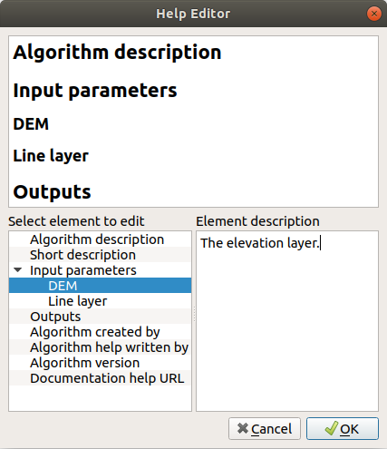

   Editing Help

On the right-hand side, you will see a simple HTML page, created using
the description of the input parameters and outputs of the algorithm,
along with some additional items like a general description of the
model or its author. Also, there is an Example section where you can
input your own custom examples to help explain the usage of the model.
The first time you open the help editor, all these descriptions are
empty, but you can edit them using the elements on the left-hand side
of the dialog.
Select an element on the upper part and then write its description in
the text box below.

Model help is saved as part of the model itself.

Saving and loading models
-------------------------

Saving models
.............

Use the |fileSave|:sup:`Save model` button to save the current model and the
|fileOpen|:sup:`Open Model` button to open a previously saved model.
Models are saved with the :file:`.model3` extension.
If the model has already been saved from the modeler window,
you will not be prompted for a filename.
Since there is already a file associated with the model, that file
will be used for subsequent saves.

Before saving a model, you have to enter a name and a group for it
in the text boxes in the upper part of the window.

Models saved in the :file:`models` folder (the default folder when you
are prompted for a filename to save the model) will appear in the
toolbox in the corresponding branch.
When the toolbox is invoked, it searches the :file:`models` folder for
files with the :file:`.model3` extension and loads the models they
contain.
Since a model is itself an algorithm, it can be added to the toolbox
just like any other algorithm.

Models can also be saved within the project file using the
|addToProject|:sup:`Save model in project` button.
Models saved using this method won't be written as :file:`.model3` files
on the disk but will be embedded in the project file.

Project models are available in the
|qgsProjectFile|:guilabel:`Project models` menu of the toolbox and in
the :menuselection:`Project --> Models` menu item.

The models folder can be set from the Processing configuration dialog,
under the :guilabel:`Modeler` group.

Models loaded from the :file:`models` folder appear not only in the
toolbox, but also in the algorithms tree in the :guilabel:`Algorithms`
tab of the modeler window.
That means that you can incorporate a model as a part of a bigger model,
just like other algorithms.

Models will show up in the :ref:`Browser <browser_panel>` panel and can be run
from there.

Exporting a model as a Python script
....................................

As we will see in a later chapter, Processing algorithms can be called
from the QGIS Python console, and new Processing algorithms can be
created using Python.
A quick way to create such a Python script is to create a model and
then export it as a Python file.

To do so, click on the |saveAsPython|:sup:`Export as Script Algorithm...`
in the modeler canvas or right click on the name of the model in the Processing
Toolbox and choose |saveAsPython|:sup:`Export Model as Python Algorithm...`.

Exporting a model as an image, PDF or SVG
.........................................

A model can also be exported as an image, SVG or PDF (for illustration
purposes) by clicking |saveMapAsImage|:sup:`Export as image`,
|saveAsPDF|:sup:`Export as PDF` or |saveAsSVG|:sup:`Export as SVG`.

Editing a model
---------------

You can edit the model you are currently creating, redefining the
workflow and the relationships between the algorithms and inputs that
define the model.

If you right-click on an algorithm in the canvas, you will see a context
menu like the one shown next:

.. _figure_model_right_click:

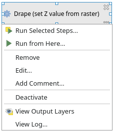

   Modeler Right Click

Selecting the :guilabel:`Remove` option will cause the selected
algorithm to be removed.
An algorithm can be removed only if there are no other algorithms
depending on it.
That is, if no output from the algorithm is used in a different one as
input.
If you try to remove an algorithm that has others depending on it, a
warning message like the one you can see below will be shown:

.. _figure_cannot_delete_alg:

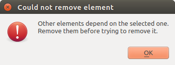

   Cannot Delete Algorithm

Selecting the :guilabel:`Edit...` option will show the parameter dialog
of the algorithm, so you can change the inputs and parameter values.
Not all input elements available in the model will appear as
available inputs.
Layers or values generated at a more advanced step in the workflow
defined by the model will not be available if they cause circular
dependencies.

Select the new values and click on the :guilabel:`OK` button as usual.
The connections between the model elements will change in the modeler
canvas accordingly.

The :guilabel:`Add comment...` allows you to add a comment to the algorithm to
better describe the behavior.

A model can be run partially by deactivating some of its algorithms.
To do it, select the :guilabel:`Deactivate` option in the context menu
that appears when right-clicking on an algorithm element.
The selected algorithm, and all the ones in the model that depend on it
will be displayed in grey and will not be executed as part of the model.

.. _figure_cannot_model_deactivate:

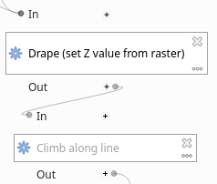

   Model With Deactivated Algorithms

When right-clicking on an algorithm that is not active, you will
see a :guilabel:`Activate` menu option that you can use to reactivate
it.

.. Substitutions definitions - AVOID EDITING PAST THIS LINE
   This will be automatically updated by the find_set_subst.py script.
   If you need to create a new substitution manually,
   please add it also to the substitutions.txt file in the
   source folder.

.. |addToProject| image:: /static/common/mAddToProject.png
   :width: 1.5em
.. |checkbox| image:: /static/common/checkbox.png
   :width: 1.3em
.. |deleteSelected| image:: /static/common/mActionDeleteSelected.png
   :width: 1.5em
.. |editCopy| image:: /static/common/mActionEditCopy.png
   :width: 1.5em
.. |editCut| image:: /static/common/mActionEditCut.png
   :width: 1.5em
.. |editHelpContent| image:: /static/common/mActionEditHelpContent.png
   :width: 1.5em
.. |editPaste| image:: /static/common/mActionEditPaste.png
   :width: 1.5em
.. |expression| image:: /static/common/mIconExpression.png
   :width: 1.5em
.. |fieldInteger| image:: /static/common/mIconFieldInteger.png
   :width: 1.5em
.. |fileOpen| image:: /static/common/mActionFileOpen.png
   :width: 1.5em
.. |fileSave| image:: /static/common/mActionFileSave.png
   :width: 1.5em
.. |fileSaveAs| image:: /static/common/mActionFileSaveAs.png
   :width: 1.5em
.. |helpContents| image:: /static/common/mActionHelpContents.png
   :width: 1.5em
.. |modelOutput| image:: /static/common/mIconModelOutput.png
   :width: 1.5em
.. |play| image:: /static/common/mActionPlay.png
   :width: 1.5em
.. |processingAlgorithm| image:: /static/common/processingAlgorithm.png
   :width: 1.5em
.. |processingModel| image:: /static/common/processingModel.png
   :width: 1.5em
.. |qgsProjectFile| image:: /static/common/mIconQgsProjectFile.png
   :width: 1.5em
.. |redo| image:: /static/common/mActionRedo.png
   :width: 1.5em
.. |saveAsPDF| image:: /static/common/mActionSaveAsPDF.png
   :width: 1.5em
.. |saveAsPython| image:: /static/common/mActionSaveAsPython.png
   :width: 1.5em
.. |saveAsSVG| image:: /static/common/mActionSaveAsSVG.png
   :width: 1.5em
.. |saveMapAsImage| image:: /static/common/mActionSaveMapAsImage.png
   :width: 1.5em
.. |select| image:: /static/common/mActionSelect.png
   :width: 1.5em
.. |selectAll| image:: /static/common/mActionSelectAll.png
   :width: 1.5em
.. |start| image:: /static/common/mActionStart.png
   :width: 1.5em
.. |success| image:: /static/common/mIconSuccess.png
   :width: 1em
.. |unchecked| image:: /static/common/unchecked.png
   :width: 1.3em
.. |undo| image:: /static/common/mActionUndo.png
   :width: 1.5em
.. |zoomActual| image:: /static/common/mActionZoomActual.png
   :width: 1.5em
.. |zoomFullExtent| image:: /static/common/mActionZoomFullExtent.png
   :width: 1.5em
.. |zoomIn| image:: /static/common/mActionZoomIn.png
   :width: 1.5em
.. |zoomOut| image:: /static/common/mActionZoomOut.png
   :width: 1.5em
