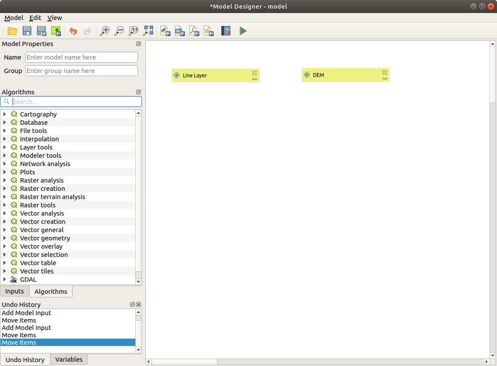
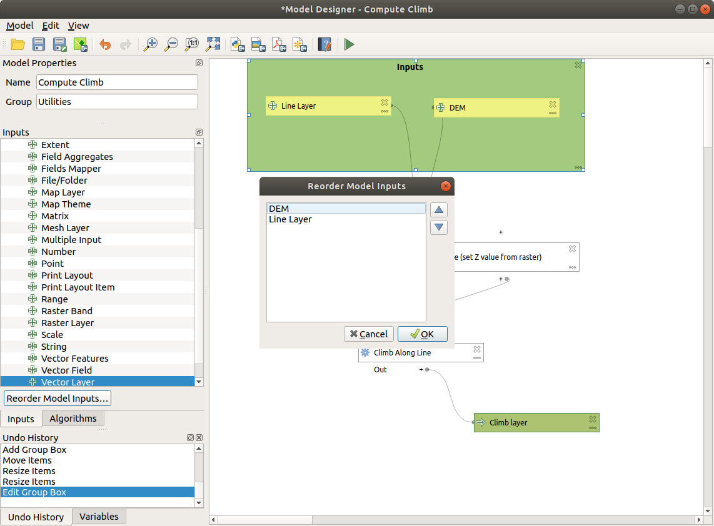
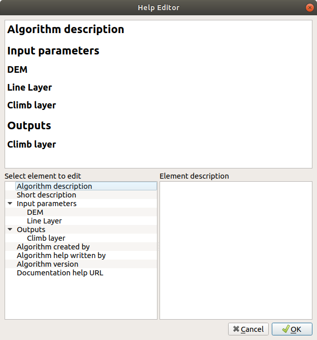

.. _`processing.modeler`:

The graphical modeler
=====================

.. only:: html

   .. contents::
      :local:

The *graphical modeler* allows you to create complex models using
a simple and easy-to-use interface.
When working with a GIS, most analysis operations are not
isolated, rather part of a chain of operations.
Using the graphical modeler, that chain of operations can be wrapped
into a single process, making it convenient to execute later with a
different set of inputs.
No matter how many steps and different algorithms it involves, a
model is executed as a single algorithm, saving time and effort.

The graphical modeler can be opened from the Processing menu
(:menuselection:`Processing --> Graphical Modeler`).

The modeler has a working canvas where the structure of the model and
the workflow it represents are shown.
The left part of the window is a section with five panels that can be used
to add new elements to the model:

#. ``Model Properties``: you can specify the name of the model and the group that
   will contain it
#. ``Inputs``: all the inputs that will shape your model
#. ``Algorithms``: the Processing algorithms available
#. ``Variables``: you can also define variables that will only be available in
   the Processing Modeler
#. ``Undo History``: this panel will register everything that happens in the 
   modeler, making it easy to cancel things you did wrong.

.. _figure_modeler:

.. figure:: img/modeler_canvas.png
   :align: center

   Modeler

Creating a model involves two basic steps:

#. *Definition of necessary inputs*.
   These inputs will be added to the parameters window, so the user
   can set their values when executing the model.
   The model itself is an algorithm, so the parameters window is
   generated automatically as for all algorithms
   available in the Processing framework.
#. *Definition of the workflow*.
   Using the input data of the model, the workflow is defined by
   adding algorithms and selecting how they use the defined inputs
   or the outputs generated by other algorithms in the model.

Definition of inputs
--------------------

The first step is to define the inputs for the model.
The following elements are found in the :guilabel:`Inputs` panel on
the left side of the modeler window:

* Authentication Configuration
* Boolean
* Color
* Connection Name
* Coordinate Operation
* CRS
* Database Schema
* Database Table
* Datetime
* Distance
* Enum
* Expression
* Extent
* Field Aggregates
* Fields Mapper
* File/Folder
* Geometry
* Map Layer
* Map Theme
* Matrix
* Mesh Layer
* Multiple Input
* Number
* Point
* Print Layout
* Print Layout Item
* Range
* Raster Band
* Raster Layer
* Scale
* String
* TIN Creation Layers 
* Vector Features
* Vector Field
* Vector Layer
* Vector Tile Writer Layers

.. note:: Hovering with the mouse over the inputs will show a tooltip with 
  additional information.

When double-clicking on an element, a dialog is shown that lets
you define its characteristics.
Depending on the parameter, the dialog will contain at least one
element (the description, which is what the user will see when
executing the model).
For example, when adding a numerical value, as can be seen in the next figure,
in addition to the description of the parameter, you have to set a
default value and the range of valid values.

.. _figure_model_parameter:

.. figure:: img/models_parameters.png
   :align: center

   Model Parameters Definition

You can define your input as mandatory for your model by checking the 
|checkbox| ``Mandatory`` option and by checking the |unchecked| ``Advanced`` 
checkbox you can set the input to be within the ``Advanced`` section. This is 
particularly useful when the model has many parameters and some of them are not
trivial, but you still want to choose them.

The ``Comments`` tab allows you to tag the input with more information,
to better describe 
the parameter. Comments are visible only in the modeler canvas and not in the
final algorithm dialog.

For each added input, a new element is added to the modeler canvas.

.. _figure_model_parameter_canvas:

.. figure:: img/models_parameters2.png
   :align: center

   Model Parameters

You can also add inputs by dragging the input type from the list and
dropping it at the position where you want it in the modeler canvas. If you want
to change a parameter of an existing input, just double click on it, and the 
same dialog will pop up.

Definition of the workflow
--------------------------

In the following example we will add two inputs and two algorithms. The aim of
the model is to copy the elevation values from a DEM raster layer to a line layer
using the ``Drape`` algorithm,  and then calculate the total ascent of the line
layer using the ``Climb Along Line`` algorithm.

In the :guilabel:`Inputs` tab, choose the two inputs as ``Vector Layer`` for the line and
``Raster Layer`` for the DEM.
We are now ready to add the algorithms to the workflow.

Algorithms can be found in the :guilabel:`Algorithms` panel, grouped
much in the same way as they are in the Processing toolbox. 

.. _figure_model_parameter_inputs:

   Model Inputs

To add an algorithm to a model, double-click on its name or drag and
drop it, just like for inputs. As for the inputs you can change the description
of the algorithm and add a comment.
When adding an algorithm, an execution dialog will appear, with a content similar 
to the one found in the execution panel that is shown when executing the
algorithm from the toolbox.
The following picture shows both the ``Drape (set Z value from raster)`` and the
``Climb along line`` algorithm dialogs.

.. _figure_model_parameter_alg:

.. figure:: img/models_parameters4.png
   :align: center

   Model Algorithm parameters

As you can see there are some differences.

You have four choices to define the algorithm **inputs**:

* |integer| ``Value``: allows you to set the parameter from a loaded
  layer in the QGIS project or to browse a layer from a folder
* |expression| ``Pre-calculated Value``: with this option you can open the 
  Expression Builder and define your own expression to fill the parameter. Model
  inputs together with some other layer statistics are available as **variables**
  and are listed at the top of the Search dialog of the Expression Builder
* |processingModel| ``Model Input``: choose this option if the
  parameter comes from an input of the model you have defined. Once clicked, this
  option will list all the suitable inputs for the parameter
* |processing| ``Algorithm Output``: is useful when the input 
  parameter of an algorithm is an output of another algorithm

Algorithm **outputs** have the addditional |processingOutput| ``Model Output``
option that makes the output of the algorithm available in the model. 

If a layer generated by the algorithm is only to be used as input to another
algorithm,  don't edit that text box.

In the following picture you can see the two input parameters defined as 
``Model Input`` and the temporary output layer:

.. figure:: img/models_parameters5.png
   :align: center

   Algorithm Input and Output parameters

In all cases, you will find an additional parameter named
*Dependencies* that is not available when calling the algorithm
from the toolbox.
This parameter allows you to define the order in which algorithms are
executed, by explicitly defining one algorithm as a *parent* of the current
one.
This will force the *parent* algorithm to be executed before the current one.

When you use the output of a previous algorithm as the input of your
algorithm, that implicitly sets the previous algorithm as parent of the
current one (and places the corresponding arrow in the modeler canvas).
However, in some cases an algorithm might depend on another one even if
it does not use any output object from it (for instance, an algorithm
that executes a SQL sentence on a PostGIS database and another one that
imports a layer into that same database).
In that case, just select the previous algorithm in the
*Dependencies* parameter and they will be executed in the correct
order.

Once all the parameters have been assigned valid values, click on
:guilabel:`OK` and the algorithm will be added to the canvas.
It will be linked to the elements in the canvas (algorithms or inputs)
that provide objects that are used as inputs for the algorithm.

Elements can be dragged to a different position on the canvas.
This is useful to make the structure of the model more clear and
intuitive.
You can also resize elements.
This is particularly useful if the description of the input or algorithm is long.

Links between elements are updated automatically and you can see a plus button
at the top and at the bottom of each algorithm. Clicking the button will list
all the inputs and outputs of the algorithm so you can have a quick overview.

You can zoom in and out by using the mouse wheel.

.. _figure_model_model:

.. figure:: img/models_model.png
   :align: center

   A complete model

You can run your algorithm any time by clicking on the |start| button.
In order to use the algorithm from the toolbox, it has to be saved
and the modeler dialog closed, to allow the toolbox to refresh its
contents.

Interacting with the canvas and elements
----------------------------------------

You can use the |zoomIn|, |zoomOut|, |zoomActual| and |zoomFullExtent| buttons
to zoom the modeler canvas. The behavior of the buttons is basically the same
of the main QGIS toolbar. 

The ``Undo History`` panel together with the |undo| and |redo| buttons are 
extremely useful to quickly rollback to a previous situation. The ``Undo History``
panel lists everything you have done when creating the workflow.

You can move or resize many elements at the same time by first selecting them,
dragging the mouse.

If you want to snap the elements while moving them in the canvas you can choose
:menuselection:`View --> Enable Snapping`.

The :menuselection:`Edit` menu contains some very useful options to interact with
your model elements:

* |selectAll|:sup:`Select All`: select all elements of the model
* ``Snap Selected Components to Grid``: snap and align the elements into a 
  grid
* |undo|:sup:`Undo`: undo the last action
* |redo|:sup:`Redo`: redo the last action
* |editCut|:sup:`Cut`: cut the selected elements
* |editCopy|:sup:`Copy`: copy the selected elements
* |editPaste|:sup:`Paste`: paste the elements
* |deleteSelected|:sup:`Delete Selected Components`: delete all the selected
  elements from the model
* ``Add Group Box``: add a draggable *box* to the canvas. This feature is very
  useful in big models to group elements in the modeler canvas and to keep the
  workflow clean. For example we might group together all the inputs of the 
  example:

   .. figure:: img/model_group_box.png
      :align: center

      Model Group Box

You can change the name and the color of the boxes.
Group boxes are very useful when used together with
:menuselection:`View --> Zoom To`.
This allows you to zoom to a specific part of the model.

You might want to change the order of the inputs and how they are listed in the
main model dialog. At the bottom of the ``Input`` panel you will find the
``Reorder Model Inputs...`` button and by clicking on it a new dialog pops up
allowing you to change the order of the inputs:

   Reorder Model Inputs

Saving and loading models
-------------------------

Use the |fileSave|:sup:`Save model` button to save the current model and the
|fileOpen|:sup:`Open Model` button to open a previously saved model.
Models are saved with the :file:`.model3` extension.
If the model has already been saved from the modeler window,
you will not be prompted for a filename.
Since there is already a file associated with the model, that file
will be used for subsequent saves.

Before saving a model, you have to enter a name and a group for it
in the text boxes in the upper part of the window.

Models saved in the :file:`models` folder (the default folder when you
are prompted for a filename to save the model) will appear in the
toolbox in the corresponding branch.
When the toolbox is invoked, it searches the :file:`models` folder for
files with the :file:`.model3` extension and loads the models they
contain.
Since a model is itself an algorithm, it can be added to the toolbox
just like any other algorithm.

Models can also be saved within the project file using the
|addToProject|:sup:`Save model in project` button.
Models saved using this method won't be written as :file:`.model3` files
on the disk but will be embedded in the project file.

Project models are available in the
|qgsProjectFile|:guilabel:`Project models` menu of the toolbox.

The models folder can be set from the Processing configuration dialog,
under the :guilabel:`Modeler` group.

Models loaded from the :file:`models` folder appear not only in the
toolbox, but also in the algorithms tree in the :guilabel:`Algorithms`
tab of the modeler window.
That means that you can incorporate a model as a part of a bigger model,
just like other algorithms.

Models will show up in the :ref:`Browser <browser_panel>` panel and can be run 
from there.

Exporting a model as an image, PDF or SVG
.........................................

A model can also be exported as an image, SVG or PDF (for illustration
purposes) by clicking |saveMapAsImage|:sup:`Export as image`, 
|saveAsPDF|:sup:`Export as PDF` or |saveAsSVG|:sup:`Export as SVG`.

Editing a model
---------------

You can edit the model you are currently creating, redefining the
workflow and the relationships between the algorithms and inputs that
define the model.

If you right-click on an algorithm in the canvas, you will see a context
menu like the one shown next:

.. _figure_model_right_click:

.. figure:: img/modeler_right_click.png
   :align: center

   Modeler Right Click

Selecting the :guilabel:`Remove` option will cause the selected
algorithm to be removed.
An algorithm can be removed only if there are no other algorithms
depending on it.
That is, if no output from the algorithm is used in a different one as
input.
If you try to remove an algorithm that has others depending on it, a
warning message like the one you can see below will be shown:

.. _figure_cannot_delete_alg:

.. figure:: img/cannot_delete_alg.png
   :align: center

   Cannot Delete Algorithm

Selecting the :guilabel:`Edit...` option will show the parameter dialog
of the algorithm, so you can change the inputs and parameter values.
Not all input elements available in the model will appear as
available inputs.
Layers or values generated at a more advanced step in the workflow
defined by the model will not be available if they cause circular
dependencies.

Select the new values and click on the :guilabel:`OK` button as usual.
The connections between the model elements will change in the modeler
canvas accordingly.

The :guilabel:`Add comment...` allows you to add a comment to the algorithm to
better describe the behavior.

A model can be run partially by deactivating some of its algorithms.
To do it, select the :guilabel:`Deactivate` option in the context menu
that appears when right-clicking on an algorithm element.
The selected algorithm, and all the ones in the model that depend on it
will be displayed in grey and will not be executed as part of the model.

.. _figure_cannot_model_deactivate:

.. figure:: img/deactivated.png
   :align: center

   Model With Deactivated Algorithms

When right-clicking on an algorithm that is not active, you will
see a :guilabel:`Activate` menu option that you can use to reactivate
it.

Editing model help files and meta-information
---------------------------------------------

You can document your models from the modeler itself.
Click on the |processingHelp|:sup:`Edit model help` button, and a 
dialog like the one shown next will appear.

.. _figure_help_edition:

   Editing Help

On the right-hand side, you will see a simple HTML page, created using
the description of the input parameters and outputs of the algorithm,
along with some additional items like a general description of the
model or its author.
The first time you open the help editor, all these descriptions are
empty, but you can edit them using the elements on the left-hand side
of the dialog.
Select an element on the upper part and then write its description in
the text box below.

Model help is saved as part of the model itself.

Exporting a model as a Python script
--------------------------------------

As we will see in a later chapter, Processing algorithms can be called
from the QGIS Python console, and new Processing algorithms can be
created using Python.
A quick way to create such a Python script is to create a model and
then export it as a Python file.

To do so, click on the |saveAsPython|:sup:`Export as Script Algorithm...`
in the modeler canvas or right click on the name of the model in the Processing
Toolbox and choose |saveAsPython|:sup:`Export Model as Python Algorithm...`.

About available algorithms
--------------------------

You might notice that some algorithms that can be executed from the
toolbox do not appear in the list of available algorithms when you are
designing a model.
To be included in a model, an algorithm must have the correct
semantic.
If an algorithm does not have such a well-defined semantic (for
instance, if the number of output layers cannot be known in advance),
then it is not possible to use it within a model, and it will not
appear in the list of algorithms that you can find in the modeler
dialog.

.. Substitutions definitions - AVOID EDITING PAST THIS LINE
   This will be automatically updated by the find_set_subst.py script.
   If you need to create a new substitution manually,
   please add it also to the substitutions.txt file in the
   source folder.

.. |addToProject| image:: /static/common/mAddToProject.png
   :width: 1.5em
.. |checkbox| image:: /static/common/checkbox.png
   :width: 1.3em
.. |deleteSelected| image:: /static/common/mActionDeleteSelected.png
   :width: 1.5em
.. |editCopy| image:: /static/common/mActionEditCopy.png
   :width: 1.5em
.. |editCut| image:: /static/common/mActionEditCut.png
   :width: 1.5em
.. |editPaste| image:: /static/common/mActionEditPaste.png
   :width: 1.5em
.. |expression| image:: /static/common/mIconExpression.png
   :width: 1.5em
.. |fileOpen| image:: /static/common/mActionFileOpen.png
   :width: 1.5em
.. |fileSave| image:: /static/common/mActionFileSave.png
   :width: 1.5em
.. |integer| image:: /static/common/mIconFieldInteger.png
   :width: 1.5em
.. |processing| image:: /static/common/processingAlgorithm.png
   :width: 1.5em
.. |processingHelp| image:: /static/common/mActionEditHelpContent.png
   :width: 1.5em
.. |processingModel| image:: /static/common/processingModel.png
   :width: 1.5em
.. |processingOutput| image:: /static/common/mIconModelOutput.png
   :width: 1.5em
.. |qgsProjectFile| image:: /static/common/mIconQgsProjectFile.png
   :width: 1.5em
.. |redo| image:: /static/common/mActionRedo.png
   :width: 1.5em
.. |saveAsPDF| image:: /static/common/mActionSaveAsPDF.png
   :width: 1.5em
.. |saveAsPython| image:: /static/common/mActionSaveAsPython.png
   :width: 1.5em
.. |saveAsSVG| image:: /static/common/mActionSaveAsSVG.png
   :width: 1.5em
.. |saveMapAsImage| image:: /static/common/mActionSaveMapAsImage.png
   :width: 1.5em
.. |selectAll| image:: /static/common/mActionSelectAll.png
   :width: 1.5em
.. |start| image:: /static/common/mActionStart.png
   :width: 1.5em
.. |unchecked| image:: /static/common/checkbox_unchecked.png
   :width: 1.3em
.. |undo| image:: /static/common/mActionUndo.png
   :width: 1.5em
.. |zoomActual| image:: /static/common/mActionZoomActual.png
   :width: 1.5em
.. |zoomFullExtent| image:: /static/common/mActionZoomFullExtent.png
   :width: 1.5em
.. |zoomIn| image:: /static/common/mActionZoomIn.png
   :width: 1.5em
.. |zoomOut| image:: /static/common/mActionZoomOut.png
   :width: 1.5em
