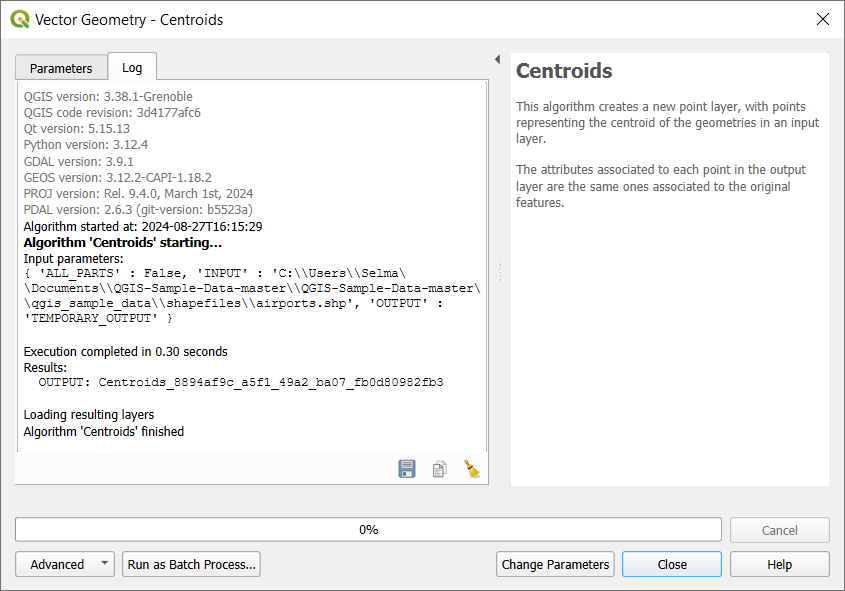

.. _`processing.toolbox`:

The Toolbox
============

.. only:: html

   .. contents::
      :local:

The :guilabel:`Processing Toolbox` is the main element of the processing GUI,
and the one that you are more likely to use in your daily work. It shows the
list of all available **algorithms** grouped in different blocks called
*Providers*, and custom **models** and **scripts** you can add to extend the
set of tools. Hence the toolbox is the access point to run them,
whether as a single process or as a batch process involving several executions
of the same algorithm on different sets of inputs.

.. _figure_toolbox:

.. figure:: img/toolbox.png
   :align: center

   Processing Toolbox

Providers can be (de)activated in the :ref:`Processing settings dialog
<processing.options>`.
By default, only providers that do not rely on third-party applications (that is,
those that only require QGIS elements to be run) are active. Algorithms requiring
external applications might need additional configuration. Configuring providers
is explained in a :ref:`later chapter <processing.results>` in this manual.

In the upper part of the toolbox dialog, you will find a set of tools to:

* work with |processingModel| :sup:`Models`: :guilabel:`Create New Model...`,
  :guilabel:`Open Existing Model...` and :guilabel:`Add Model to Toolbox...`;
* work with |pythonFile| :sup:`Scripts`: :guilabel:`Create New Script...`,
  :guilabel:`Create New Script from Template...`, :guilabel:`Open Existing
  Script...` and :guilabel:`Add Script to Toolbox...`;
* open the |processingHistory| :sup:`History` panel;
* open the |processingResult| :sup:`Results Viewer` panel;
* toggle the toolbox to the :ref:`in-place modification mode <processing_inplace_edit>`
  using the |processSelected| :sup:`Edit Features In-Place` button: only
  the algorithms that are suitable to be executed on the active layer without
  outputting a new layer are displayed; 
* open the |options| :sup:`Options` dialog.

Below this toolbar is a |search| :guilabel:`Search...` box to help you easily find
the tools you need.
You can enter any word or phrase on the text box. Notice that, as you type, the
number of algorithms, models or scripts in the toolbox is reduced to just those
that contain the text you have entered in their names or keywords.

.. note:: At the top of the list of algorithms are displayed the most recent
 used tools; handy if you want to reexecute any.

.. _figure_toolbox_search:

   Processing Toolbox showing search results

To execute a tool, just double-click on its name in the toolbox.

The algorithm dialog
--------------------

Once you double-click on the name of the algorithm that you want to execute, a
dialog similar to that in the :numref:`figure_parameters_dialog` below is shown
(in this case, the dialog corresponds to the ``Centroids`` algorithm).

.. _figure_parameters_dialog:

.. figure:: img/parameters_dialog.png
   :align: center

   Algorithm Dialog - Parameters

The dialog shows two tabs (:guilabel:`Parameters` and :guilabel:`Log`)
on the left part, the algorithm description on the right, and a set of
buttons at the bottom.

The :guilabel:`Parameters` tab is used to set the input values that the algorithm needs to be
executed. It shows a list of input values and configuration parameters to
be set. It of course has a different content, depending on the requirements of
the algorithm to be executed, and is created automatically based on those
requirements.

Although the number and type of parameters depend on the characteristics of the
algorithm, the structure is similar for all of them. The parameters found in the
table can be of one of the following types.

* A **raster layer**, to select from a list of all such layers available
  (currently opened) in QGIS. The selector contains as well a button on its
  right-hand side, to let you select filenames that represent layers currently
  not loaded in QGIS.
* A **vector layer**, to select from a list of all vector layers available in
  QGIS. Layers not loaded in QGIS can be selected as well, as in the case of raster
  layers, but only if the algorithm does not require a table field selected from
  the attributes table of the layer. In that case, only opened layers can be
  selected, since they need to be open so as to retrieve the list of field names
  available.

  You will see an iterator button by each vector layer selector, as shown in the
  figure below.

  .. _figure_vector_iterator:

  .. figure:: img/vector_iterator.png
     :align: center

     Vector iterator button

  If the algorithm contains several of them, you will be able to toggle just
  one of them. If the button corresponding to a vector input is toggled, the
  algorithm will be executed iteratively on each one of its features, instead
  of just once for the whole layer, producing as many outputs as times the
  algorithm is executed. This allows for automating the process when all
  features in a layer have to be processed separately.

.. note::

 By default, the parameters dialog will show a description of the CRS of each layer along with
 its name. If you do not want to see this additional information, you can
 disable this functionality in the Processing Settings dialog, unchecking the
 :menuselection:`General --> Show layer CRS definition in selection boxes` option.

* A **table**, to select from a list of all available in QGIS. Non-spatial
  tables are loaded into QGIS like vector layers, and in fact they are treated as
  such by the program. Currently, the list of available tables that you will see
  when executing an algorithm that needs one of them is restricted to
  tables coming from files in dBase (:file:`.dbf`) or Comma-Separated Values
  (:file:`.csv`) formats.
* An **option**, to choose from a selection list of possible options.
* A **numerical value**, to be introduced in a spin box. In some contexts (when
  the parameter applies at the feature level and not at the layer's), you will
  find a |dataDefine| :sup:`Data-defined override` button by its side, allowing
  you to open the :ref:`expression builder <vector_expressions>` and enter a
  mathematical expression to generate variable values for the parameter. Some useful
  variables related to data loaded into QGIS can be added to your expression, so
  you can select a value derived from any of these variables, such as the cell size
  of a layer or the northernmost coordinate of another one.

.. _figure_number_selector:

.. figure:: img/number_selector.png
   :align: center

   Expression based input

* A **range**, with min and max values to be introduced in two text boxes.
* A **text string**, to be introduced in a text box.
* A **field**, to choose from the attributes table of a vector layer or a single
  table selected in another parameter.
* A **coordinate reference system**. You can select it among the recently used
  ones from the drop-down list or from the :ref:`CRS selection <crs_selector>`
  dialog that appears when you click on the button on the right-hand side.
* An **extent**, a text box defining a rectangle through its corners coordinate
  in the format ``xmin, xmax, ymin, ymax``. Press the |mapIdentification|
  :sup:`Set to current map canvas extent` button to use the map canvas
  extent. Clicking the arrow on the right-hand side of the value selector,
  a pop-up menu will appear, giving you options to:

  * :menuselection:`Calculate from layer -->`: fills the text box with the coordinates
    of the bounding box of a layer to select among the loaded ones
  * :menuselection:`Calculate from layout map -->`: fills the text box with the coordinates
    of a map item selected from a layout in the current project
  * :menuselection:`Calculate from bookmark -->`: fills the text box with the coordinates
    of a saved bookmark
  * |mapIdentification| :guilabel:`Use current map canvas extent`
  * :guilabel:`Draw on canvas`: the parameters window will hide itself, so you
    can click and drag onto the canvas. Once you have defined the extent
    rectangle, the dialog will reappear, containing the values in the extent text
    box.

  .. _figure_extent:

  .. figure:: img/extent.png
     :align: center

     Extent selector

* A **list of elements** (whether raster or vector layers, tables, fields) to
  select from. Click on the :guilabel:`...` button at the left of the option to
  see a dialog like the following one. Multiple selection is allowed and when
  the dialog is closed, number of selected items is displayed in the parameter
  text box widget.

  .. _figure_multiple_selection:

  .. figure:: img/multiple_selection.png
     :align: center

     Multiple Selection

* A **small table** to be edited by the user. These are used to define
  parameters like lookup tables or convolution kernels, among others.

  Click on the button on the right side to see the table and edit its values.

  .. _figure_fixed_table:

  .. figure:: img/fixed_table.png
     :align: center

     Fixed Table

  Depending on the algorithm, the number of rows can be modified or not by using
  the buttons on the right side of the window.

.. _reference_layer_param:

.. note:: Some algorithms require many parameters to run, e.g. in the
  :ref:`qgisrastercalculator` you have to specify manually the cell size, the
  extent and the CRS. You can avoid to choose all the parameters manually when
  the algorithm has the ``Reference layers`` parameter. With this parameter you
  can choose the reference layer and all its properties (cell size, extent, CRS)
  will be used.

Along with the :guilabel:`Parameters` tab, there is another tab named
:guilabel:`Log` (see :numref:`figure_alg_dialog_log` below).
Information provided by the algorithm during its execution is written
in this tab, and allow you to track the execution and be aware and have
more details about the algorithm as it runs.
Information on algorithm execution is also output in the
:menuselection:`View --> Panels --> Log Messages Panel`.

Notice that not all algorithms write information to the :guilabel:`Log` tab,
and many of them might run silently without
producing any output other than the final files.
Check the :guilabel:`Log Messages Panel` in that case.

.. _figure_alg_dialog_log:

   Algorithm Dialog - Log

At the bottom of the :guilabel:`Log` tab you will find buttons to
|fileSave| :guilabel:`Save Log to File`, |editCopy| :guilabel:`Copy
Log to Clipboard` and |clearConsole| :guilabel:`Clear Log`.
These are particularly handy when you have checked the
:guilabel:`Keep dialog open after running algorithm` in the
:guilabel:`General` part of the Processing options.

On the right hand side of the dialog you will find a short description of the
algorithm, which will help you understand its purpose and its basic ideas.
If such a description is not available, the description panel will not be shown.

For a more detailed help file, which might include description of every
parameter it uses, or examples, you will find a :guilabel:`Help` button at the
bottom of the dialog bringing you to the :ref:`Processing algorithms
documentation <processing_algs>` or to the provider documentation (for
some third-party providers).

The :guilabel:`Run as batch process` button triggers the :ref:`batch processing
mode <processing_batch>` allowing to configure and run multiple instances of
the algorithm with a variety of parameters.

A note on projections
.....................

Processing algorithm execution are always performed in the input layer
coordinate reference system (CRS). Due to QGIS's on-the-fly reprojecting
capabilities, although two layers might seem to overlap and match, that
might not be true if their original coordinates are used without reprojecting
them onto a common coordinate system.
Whenever you use more than one layer as input to a :ref:`QGIS native algorithm
<qgis_algorithms>`, whether vector or raster, the layers will all be
reprojected to match the coordinate reference system of the first input layer.

This is however less true for most of the external applications whose algorithms
are exposed through the processing framework as they assume that all of the
layers are already in a common coordinate system and ready to be analyzed.

By default, the parameters dialog will show a description of the CRS of each layer along with
its name, making it easy to select layers that share the same CRS to be used as
input layers. If you do not want to see this additional information, you can
disable this functionality in the Processing settings dialog, unchecking the
:guilabel:`Show layer CRS definition in selection boxes` option.

If you try to execute an algorithm using as input two or more layers with
unmatching CRSs, a warning dialog will be shown. This occurs thanks to the
:guilabel:`Warn before executing if layer CRS's do not match` option.

You still can execute the algorithm, but be aware that in most cases that will
produce wrong results, such as empty layers due to input layers not overlapping.

.. tip:: **Use Processing algorithms to do intermediate reprojection**

  When an algorithm can not successfully perform on multiple input layers
  due to unmatching CRSs, use QGIS internal algorithm such as
  :ref:`qgisreprojectlayer` to perform layers' reprojection to the same CRS
  before executing the algorithm using these outputs.

Data objects generated by algorithms
-------------------------------------

Data objects generated by an algorithm can be of any of the following types:

* A raster layer
* A vector layer
* A table
* An HTML file (used for text and graphical outputs)

These are all saved to disk, and the parameters
table will contain a text box corresponding to each one of these outputs, where
you can type the output channel to use for saving it. An output channel contains
the information needed to save the resulting object somewhere. In the most usual
case, you will save it to a file, but in the case of vector layers, and when they
are generated by native algorithms (algorithms not using external applications)
you can also save to a PostGIS, GeoPackage or SpatiaLite database, or a memory layer.

To select an output channel, just click on the button on the right side of the
text box, and you will see a small context menu with the available options.

In the most usual case, you will select saving to a file. If you select that option,
you will be prompted with a save file dialog, where you can select the desired
file path. Supported file extensions are shown in the file format selector of the
dialog, depending on the kind of output and the algorithm.

The format of the output is defined by the filename extension. The supported
formats depend on what is supported by the algorithm itself. To select a format,
just select the corresponding file extension (or add it, if you are directly typing
the file path instead). If the extension of the file path you entered does not
match any of the supported formats, a default extension will be
appended to the file path, and the file format corresponding to that extension will
be used to save the layer or table. Default extensions are :file:`.dbf` for
tables, :file:`.tif` for raster layers and :file:`.gpkg` for vector layers. These
can be modified in the setting dialog, selecting any other of the formats supported
by QGIS.

If you do not enter any filename in the output text box (or select the corresponding
option in the context menu), the result will be saved as a :ref:`temporary file <vector_new_scratch_layer>`
in the corresponding default file format, and it will be deleted once you exit
QGIS (take care with that, in case you save your project and it contains temporary
layers).

You can set a default folder for output data objects. Go to the settings
dialog (you can open it from the :menuselection:`Settings --> Options --> Processing`
menu), and in the
:guilabel:`General` group, you will find a parameter named :guilabel:`Output folder`.
This output folder is used as the default path in case you type just a filename
with no path (i.e., :file:`myfile.shp`) when executing an algorithm.

When running an algorithm that uses a vector layer in iterative mode, the entered
file path is used as the base path for all generated files, which are named using
the base name and appending a number representing the index of the iteration.
The file extension (and format) is used for all such generated files.

Apart from raster layers and tables, algorithms also generate graphics and text
as HTML files. These results are shown at the end of the algorithm execution in
a new dialog. This dialog will keep the results produced by any algorithm during the
current session, and can be shown at any time by selecting
:menuselection:`Processing --> Results Viewer` from the QGIS main menu.

Some external applications might have files (with no particular extension
restrictions) as output, but they do not belong to any of the categories above.
Those output files will not be processed by QGIS (opened or included into the
current QGIS project), since most of the time they correspond to file formats or
elements not supported by QGIS. This is, for instance, the case with LAS files
used for LiDAR data. The files get created, but you won't see anything new in
your QGIS working session.

For all the other types of output, you will find a checkbox that you can use
to tell the algorithm whether to load the file once it is generated by the
algorithm or not. By default, all files are opened.

Optional outputs are not supported. That is, all outputs are created. However, you
can uncheck the corresponding checkbox if you are not interested in a given
output, which essentially makes it behave like an optional output (in other words, the
layer is created anyway, but if you leave the text box empty, it will be saved
to a temporary file and deleted once you exit QGIS).

.. Substitutions definitions - AVOID EDITING PAST THIS LINE
   This will be automatically updated by the find_set_subst.py script.
   If you need to create a new substitution manually,
   please add it also to the substitutions.txt file in the
   source folder.

.. |clearConsole| image:: /static/common/iconClearConsole.png
   :width: 1.5em
.. |dataDefine| image:: /static/common/mIconDataDefine.png
   :width: 1.5em
.. |editCopy| image:: /static/common/mActionEditCopy.png
   :width: 1.5em
.. |fileSave| image:: /static/common/mActionFileSave.png
   :width: 1.5em
.. |mapIdentification| image:: /static/common/mActionMapIdentification.png
   :width: 1.5em
.. |options| image:: /static/common/mActionOptions.png
   :width: 1em
.. |processSelected| image:: /static/common/mActionProcessSelected.png
   :width: 1.5em
.. |processingHistory| image:: /static/common/history.png
   :width: 1.5em
.. |processingModel| image:: /static/common/processingModel.png
   :width: 1.5em
.. |processingResult| image:: /static/common/processingResult.png
   :width: 1.5em
.. |pythonFile| image:: /static/common/mIconPythonFile.png
   :width: 1.5em
.. |search| image:: /static/common/search.png
   :width: 1.5em
