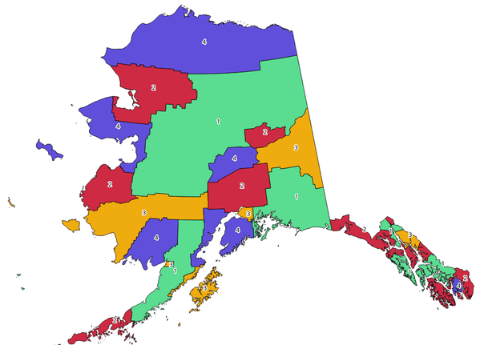

Cartography
============

.. only:: html

   .. contents::
      :local:
      :depth: 1

.. _qgisangletonearest:

Align points to features
------------------------

Calculates the rotation required to align point features with their nearest
feature from another reference layer. A new field is added to the output layer
which is filled with the angle (in degrees, clockwise) to the nearest reference
feature.

Optionally, the output layer's symbology can be set to automatically use the
calculated rotation field to rotate marker symbols.
If desired, a maximum distance to use when aligning points can be set,
to avoid aligning isolated points to distant features.

.. hint:: This algorithm is designed for use cases like aligning building
 point symbols to follow the nearest road direction.

|checkbox| Allows :ref:`features in-place modification <processing_inplace_edit>`
of point features

Parameters
..........

.. list-table::
   :header-rows: 1
   :widths: 20 20 20 40

   * - Label
     - Name
     - Type
     - Description
   * - **Input layer**
     - ``INPUT``
     - [vector: point]
     - Point features to calculate the rotation for
   * - **Reference layer**
     - ``REFERENCE_LAYER``
     - [vector: any]
     - Layer to find the closest feature from for rotation calculation
   * - **Maximum distance to consider**

       Optional
     - ``MAX_DISTANCE``
     - [number]

       Default: Not set
     - If no reference feature is found within this distance, no rotation
       is assigned to the point feature.
   * - **Angle field name**
     - ``FIELD_NAME``
     - [string]

       Default: 'rotation'
     - Field in which to store the rotation value.
   * - **Automatically apply symbology**
     - ``APPLY_SYMBOLOGY``
     - [boolean]

       Default: True
     - Rotates the symbol marker of the features using the angle field value
   * - **Aligned layer**
     - ``OUTPUT``
     - [vector: point]
       
       Default: ``[Save to temporary file]``
     - Specify the rotated output vector layer. One of:

       .. include:: ../algs_include.rst
          :start-after: **layer_output_types**
          :end-before: **end_layer_output_types**

Outputs
.......

.. list-table::
   :header-rows: 1
   :widths: 20 20 20 40

   * - Label
     - Name
     - Type
     - Description
   * - **Aligned layer**
     - ``OUTPUT``
     - [vector: point]
     - The point layer appended with a rotation field.
       If loaded to QGIS, it is applied by default the input layer symbology,
       with a data-defined rotation of its marker symbol.

Python code
...........

**Algorithm ID**: ``native:angletonearest``

.. include:: ../algs_include.rst
  :start-after: **algorithm_code_section**
  :end-before: **end_algorithm_code_section**

.. _qgiscombinestyles:

Combine style databases
---------------------------------------
Combines multiple QGIS style databases into a single style database.
If items of the same type with the same name exist in different source
databases these will be renamed to have unique names in the output combined database.

.. seealso:: :ref:`qgisstylefromproject`

Parameters
..........

.. list-table::
   :header-rows: 1
   :widths: 20 20 20 40

   * - Label
     - Name
     - Type
     - Description
   * - **Input databases**
     - ``INPUT``
     - [file] [list]
     - Files containing QGIS style items
   * - **Objects to combine**
     - ``OBJECTS``
     - [enumeration] [list]
     - Types of style items in the input databases you would like to
       put in the new database.  These can be:

       * 0 --- :ref:`Symbols <edit_symbol>`
       * 1 --- :ref:`Color ramps <color-ramp>`
       * 2 --- :ref:`Text formats <text_format>`
       * 3 --- :ref:`Label settings <showlabels>`

   * - **Output style database**
     - ``OUTPUT``
     - [file]
       
       Default: ``[Save to temporary file]``
     - Output :file:`.XML` file combining the selected style items.
       One of:

       .. include:: ../algs_include.rst
          :start-after: **file_output_types**
          :end-before: **end_file_output_types**

Outputs
.......

.. list-table::
   :header-rows: 1
   :widths: 20 20 20 40

   * - Label
     - Name
     - Type
     - Description
   * - **Color ramp count**
     - ``COLORRAMPS``
     - [number]
     - 
   * - **Label settings count**
     - ``LABELSETTINGS``
     - [number]
     - 
   * - **Output style database**
     - ``OUTPUT``
     - [file]
     - Output :file:`.XML` file combining the selected style items
   * - **Symbol count**
     - ``SYMBOLS``
     - [number]
     - 
   * - **Text format count**
     - ``TEXTFORMATS``
     - [number]
     - 

Python code
...........

**Algorithm ID**: ``native:combinestyles``

.. include:: ../algs_include.rst
  :start-after: **algorithm_code_section**
  :end-before: **end_algorithm_code_section**

.. _qgiscategorizeusingstyle:

Create categorized renderer from styles
---------------------------------------
Sets a vector layer's renderer to a categorized renderer using matching symbols
from a style database. If no style file is specified, symbols from the user's
current :ref:`symbol library <vector_symbol_library>` are used instead.

A specified expression or field is used to create categories for the renderer.
Each category is individually matched to the symbols which exist within
the specified QGIS XML style database. Whenever a matching symbol name is found,
the category's symbol will be set to this matched symbol.

If desired, outputs can also be tables containing lists of the categories which
could not be matched to symbols, and symbols which were not matched to categories.

Parameters
..........

.. list-table::
   :header-rows: 1
   :widths: 20 20 20 40
   :class: longtable

   * - Label
     - Name
     - Type
     - Description
   * - **Input layer**
     - ``INPUT``
     - [vector: any]
     - Vector layer to apply a categorized style to
   * - **Categorize using expression**
     - ``FIELD``
     - [expression]
     - Field or expression to categorize the features
   * - **Style database (leave blank to use saved symbols)**
     - ``STYLE``
     - [file]
     - File (:file:`.XML`) containing the symbols to apply to
       the input layer categories.
       The file can be obtained from the Style Manager
       :ref:`Share symbols <share_symbols>` tool.
       If no file is specified, QGIS local symbols library is
       used.
   * - **Use case-sensitive match to symbol names**
     - ``CASE_SENSITIVE``
     - [boolean]

       Default: False
     - If True (checked), applies a case sensitive comparison
       between the categories and symbols names
   * - **Ignore non-alphanumeric characters while matching**
     - ``TOLERANT``
     - [boolean]

       Default: False
     - If True (checked), non-alphanumeric characters in the
       categories and symbols names will be ignored, allowing
       greater tolerance during the match.
   * - **Non-matching categories**

       Optional
     - ``NON_MATCHING_CATEGORIES``
     - [table]

       Default: ``[Skip output]``
     - Output table for categories which do not match any symbol in
       the database. One of:

       .. include:: ../algs_include.rst
          :start-after: **layer_output_types_skip**
          :end-before: **end_layer_output_types_skip**

   * - **Non-matching symbol names**

       Optional
     - ``NON_MATCHING_SYMBOLS``
     - [table]

       Default: ``[Skip output]``
     - Output table for symbols from the provided style database which
       do not match any category. One of:

       .. include:: ../algs_include.rst
          :start-after: **layer_output_types_skip**
          :end-before: **end_layer_output_types_skip**

Outputs
.......

.. list-table::
   :header-rows: 1
   :widths: 20 20 20 40

   * - Label
     - Name
     - Type
     - Description
   * - **Non-matching categories**
     - ``NON_MATCHING_CATEGORIES``
     - [table]
     - Lists categories which could not be matched to any symbol in
       the provided style database
   * - **Non-matching symbol names**
     - ``NON_MATCHING_SYMBOLS``
     - [table]
     - Lists symbols from the provided style database which could
       not match any category
   * - **Categorized layer**
     - ``OUTPUT``
     - [same as input]
     - The input vector layer with the categorized style applied.
       No new layer is output.

Python code
...........

**Algorithm ID**: ``native:categorizeusingstyle``

.. include:: ../algs_include.rst
  :start-after: **algorithm_code_section**
  :end-before: **end_algorithm_code_section**

.. _qgisstylefromproject:

Create style database from project
----------------------------------------
Extracts all style objects (symbols, color ramps, text formats and
label settings) from a QGIS project.

The extracted symbols are saved to a QGIS style database (:file:`XML` format),
which can be managed and imported via the :ref:`Style Manager <vector_style_manager>`
dialog.

.. seealso:: :ref:`qgiscombinestyles`

Parameters
..........

.. list-table::
   :header-rows: 1
   :widths: 20 20 20 40

   * - Label
     - Name
     - Type
     - Description
   * - **Input project (leave blank to use current)**

       Optional
     - ``INPUT``
     - [file]
     - A QGIS project file to extract the style items from
   * - **Objects to extract**
     - ``OBJECTS``
     - [enumeration] [list]
     - Types of style items in the input project you would like to
       put in the new database. These can be:

       * 0 --- :ref:`Symbols <edit_symbol>`
       * 1 --- :ref:`Color ramps <color-ramp>`
       * 2 --- :ref:`Text formats <text_format>`
       * 3 --- :ref:`Label settings <showlabels>`

   * - **Output style database**
     - ``OUTPUT``
     - [file]

       Default: ``[Save to temporary file]``
     - Specify the output :file:`.XML` file for the selected style items.
       One of:

       .. include:: ../algs_include.rst
          :start-after: **file_output_types**
          :end-before: **end_file_output_types**

Outputs
.......

.. list-table::
   :header-rows: 1
   :widths: 20 20 20 40

   * - Label
     - Name
     - Type
     - Description
   * - **Color ramp count**
     - ``COLORRAMPS``
     - [number]
     - Number of color ramps
   * - **Label settings count**
     - ``LABELSETTINGS``
     - [number]
     - Number of label settings
   * - **Output style database**
     - ``OUTPUT``
     - [file]
     - Output :file:`.XML` file for the selected style items
   * - **Symbol count**
     - ``SYMBOLS``
     - [number]
     - Number of symbols
   * - **Text format count**
     - ``TEXTFORMATS``
     - [number]
     - Number of text formats

Python code
...........

**Algorithm ID**: ``native:stylefromproject``

.. include:: ../algs_include.rst
  :start-after: **algorithm_code_section**
  :end-before: **end_algorithm_code_section**

.. _qgisatlaslayouttoimage:

Export atlas layout as image
----------------------------
Exports the atlas of a print layout as image files (e.g. PNG or JPEG images).

If a coverage layer is set, the selected layout's atlas settings exposed
in this algorithm will be overwritten. In this case, an empty filter or
sort by expression will turn those settings off.

Parameters
..........

Basic parameters
^^^^^^^^^^^^^^^^

.. list-table::
   :header-rows: 1
   :widths: 20 20 20 40

   * - Label
     - Name
     - Type
     - Description
   * - **Atlas layout**
     - ``LAYOUT``
     - [layout]
     - Layout to export
   * - **Coverage layer**

       Optional
     - ``COVERAGE_LAYER``
     - [vector: any]
     - Layer to use to generate the atlas
   * - **Filter expression**
     - ``FILTER_EXPRESSION``
     - [expression]
     - Expression to use to filter out atlas features
   * - **Sort expression**

       Optional
     - ``SORTBY_EXPRESSION``
     - [expression]
     - Expression to use to sort the atlas features
   * - **Reverse sort order**

       Optional
     - ``SORTBY_REVERSE``
     - [boolean]
     - Determines if sorting should be inverted.
       Used when a sort expression is provided.
   * - **Output filename expression**
     - ``FILENAME_EXPRESSION``
     - [expression]

       Default: 'output\_'||\@atlas_featurenumber
     - Expression for use to generate filenames
   * - **Output folder**
     - ``FOLDER``
     - [folder]
     - Destination folder where the images will be generated

Advanced parameters
^^^^^^^^^^^^^^^^^^^

.. list-table::
   :header-rows: 1
   :widths: 20 20 20 40

   * - Label
     - Name
     - Type
     - Description
   * - **Map layers to assign to unlocked map item(s)**

       Optional
     - ``LAYERS``
     - [enumeration] [layer]
     - Layers to display in the map item(s) whose contents are not locked
   * - **Image format**
     - ``EXTENSION``
     - [list]

       Default: png
     - File format of the generated output(s).
       The list of available formats varies depending on OS and installed drivers.
   * - **DPI**

       Optional
     - ``DPI``

       Default: Not set
     - [number]
     - DPI of the output file(s). If not set, the value in the print layout settings will be used.
   * - **Generate world file**
     - ``GEOREFERENCE``
     - [boolean]

       Default: True
     - Determines if a world file should be generated
   * - **Export RDF metadata**
     - ``INCLUDE_METADATA``
     - [boolean]

       Default: True
     - Determines if RDF metadata (title, author, ...) should be generated
   * - **Enable antialiasing**
     - ``ANTIALIAS``
     - [boolean]

       Default: True
     - Determines if antialiasing should be enabled

Outputs
.......

.. list-table::
   :header-rows: 1
   :widths: 20 20 20 40

   * - Label
     - Name
     - Type
     - Description
   * - **Image file**
     - ``OUTPUT``
     - [file]
     - Image files generated by the atlas layout

Python code
...........

**Algorithm ID**: ``native:atlaslayouttoimage``

.. include:: ../algs_include.rst
  :start-after: **algorithm_code_section**
  :end-before: **end_algorithm_code_section**

.. _qgisatlaslayouttopdf:

Export atlas layout as PDF
--------------------------
Exports the atlas of a print layout as a PDF file(s).

If a coverage layer is set, the selected layout's atlas settings exposed
in this algorithm will be overwritten. In this case, an empty filter or
sort by expression will turn those settings off.

Parameters
..........

Basic parameters
^^^^^^^^^^^^^^^^

.. list-table::
   :header-rows: 1
   :widths: 20 20 20 40

   * - Label
     - Name
     - Type
     - Description
   * - **Atlas layout**
     - ``LAYOUT``
     - [layout]
     - Layout to export
   * - **Coverage layer**

       Optional
     - ``COVERAGE_LAYER``
     - [vector: any]
     - Layer to use to generate the atlas
   * - **Filter expression**
     - ``FILTER_EXPRESSION``
     - [expression]
     - Expression to use to filter out atlas features
   * - **Sort expression**

       Optional
     - ``SORTBY_EXPRESSION``
     - [expression]
     - Expression to use to sort the atlas features
   * - **Reverse sort order**

       Optional
     - ``SORTBY_REVERSE``
     - [boolean]
     - Determines if sorting should be inverted.
       Used when a sort expression is provided.

Advanced parameters
^^^^^^^^^^^^^^^^^^^

.. list-table::
   :header-rows: 1
   :widths: 20 20 20 40

   * - Label
     - Name
     - Type
     - Description
   * - **Map layers to assign to unlocked map item(s)**

       Optional
     - ``LAYERS``
     - [enumeration] [layer]
     - Layers to display in the map item(s) whose contents are not locked
   * - **DPI**

       Optional
     - ``DPI``

       Default: Not set
     - [number]
     - DPI of the output file(s). If not set, the value in the print layout settings will be used.
   * - **Always export as vectors**
     - ``FORCE_VECTOR``
     - [boolean]

       Default: False
     - Determines if vectorial data should be left as vectors
   * - **Append georeference information**
     - ``GEOREFERENCE``
     - [boolean]

       Default: True
     - Determines if a world file should be generated
   * - **Export RDF metadata**
     - ``INCLUDE_METADATA``
     - [boolean]

       Default: True
     - Determines if RDF metadata (title, author, ...) should be generated
   * - **Disable tiled raster layer exports**
     - ``DISABLE_TILED``
     - [boolean]

       Default: False
     - Determines if raster should be tiled
   * - **Simplify geometries to reduce output file size**
     - ``SIMPLIFY``
     - [boolean]

       Default: True
     - Determines if geometries should be simplified to reduce output file size
   * - **Text export**
     - ``TEXT_FORMAT``
     - [list]

       Default: 0
     - Determines if text should be exported as path or text objects.
       Possible options are:

       * 0 - Always export text as paths (recommended)
       * 1 - Always export texts as text objects

   * - **PDF file**
     - ``OUTPUT``
     - [file]

       Default: [Save to temporary file]
     - Name (including path) of the output file. One of:

       .. include:: ../algs_include.rst
          :start-after: **file_output_types**
          :end-before: **end_file_output_types**

Outputs
.......

.. list-table::
   :header-rows: 1
   :widths: 20 20 20 40

   * - Label
     - Name
     - Type
     - Description
   * - **PDF file**
     - ``OUTPUT``
     - [file]
     - PDF file corresponding to the exported atlas layout

Python code
...........

**Algorithm ID**: ``native:atlaslayouttopdf``

.. include:: ../algs_include.rst
  :start-after: **algorithm_code_section**
  :end-before: **end_algorithm_code_section**

.. _qgisprintlayouttoimage:

Export print layout as image
----------------------------
Exports a print layout as an image file (e.g. PNG or JPEG images)

Parameters
..........

Basic parameters
^^^^^^^^^^^^^^^^

.. list-table::
   :header-rows: 1
   :widths: 20 20 20 40

   * - Label
     - Name
     - Type
     - Description
   * - **Print layout**
     - ``LAYOUT``
     - [layout]
     - Layout to export
   * - **Image file**
     - ``OUTPUT``
     - [file]

       Default: [Save to temporary file]
     - Name (including path) of the output file. One of:

       .. include:: ../algs_include.rst
          :start-after: **file_output_types**
          :end-before: **end_file_output_types**

Advanced parameters
^^^^^^^^^^^^^^^^^^^

.. list-table::
   :header-rows: 1
   :widths: 20 20 20 40

   * - Label
     - Name
     - Type
     - Description
   * - **Map layers to assign to unlocked map item(s)**

       Optional
     - ``LAYERS``
     - [enumeration] [layer]
     - Layers to display in the map item(s) whose contents are not locked
   * - **DPI**

       Optional
     - ``DPI``

       Default: Not set
     - [number]
     - DPI of the output file(s). If not set, the value in the print layout settings will be used.
   * - **Generate world file**
     - ``GEOREFERENCE``
     - [boolean]

       Default: True
     - Determines if a world file should be generated
   * - **Export RDF metadata**
     - ``INCLUDE_METADATA``
     - [boolean]

       Default: True
     - Determines if RDF metadata (title, author, ...) should be generated
   * - **Enable antialiasing**
     - ``ANTIALIAS``
     - [boolean]

       Default: True
     - Determines if antialiasing should be enabled

Outputs
.......

.. list-table::
   :header-rows: 1
   :widths: 20 20 20 40

   * - Label
     - Name
     - Type
     - Description
   * - **Image file**
     - ``OUTPUT``
     - [file]
     - Image file corresponding to the exported print layout

Python code
...........

**Algorithm ID**: ``native:printlayouttoimage``

.. include:: ../algs_include.rst
  :start-after: **algorithm_code_section**
  :end-before: **end_algorithm_code_section**

.. _qgisprintlayouttopdf:

Export print layout as pdf
--------------------------
Exports a print layout as a PDF file.

Parameters
..........

Basic parameters
^^^^^^^^^^^^^^^^

.. list-table::
   :header-rows: 1
   :widths: 20 20 20 40

   * - Label
     - Name
     - Type
     - Description
   * - **Print Layout**
     - ``LAYOUT``
     - [layout]
     - Layout to export
   * - **PDF file**
     - ``OUTPUT``
     - [file]

       Default: [Save to temporary file]
     - Name (including path) of the output file. One of:

       .. include:: ../algs_include.rst
          :start-after: **file_output_types**
          :end-before: **end_file_output_types**

Advanced parameters
^^^^^^^^^^^^^^^^^^^

.. list-table::
   :header-rows: 1
   :widths: 20 20 20 40

   * - Label
     - Name
     - Type
     - Description
   * - **Map layers to assign to unlocked map item(s)**

       Optional
     - ``LAYERS``
     - [enumeration] [layer]
     - Layers to display in the map item(s) whose contents are not locked
   * - **DPI**

       Optional
     - ``DPI``

       Default: Not set
     - [number]
     - DPI of the output file(s). If not set, the value in the print layout settings will be used.
   * - **Always export as vectors**
     - ``FORCE_VECTOR``
     - [boolean]

       Default: False
     - Determines if vectorial data should be left as vectors
   * - **Append georeference information**
     - ``GEOREFERENCE``
     - [boolean]

       Default: True
     - Determines if a world file should be generated
   * - **Export RDF metadata**
     - ``INCLUDE_METADATA``
     - [boolean]

       Default: True
     - Determines if RDF metadata (title, author, ...) should be generated
   * - **Disable tiled raster layer exports**
     - ``DISABLE_TILED``
     - [boolean]

       Default: False
     - Determines if raster should be tiled
   * - **Simplify geometries to reduce output file size**
     - ``SIMPLIFY``
     - [boolean]

       Default: True
     - Determines if geometries should be simplified to reduce output file size
   * - **Text export**
     - ``TEXT_FORMAT``
     - [list]

       Default: 0
     - Determines if text should be exported as path or text objects.
       Possible options are:

       * 0 - Always export text as paths (recommended)
       * 1 - Always export texts as text objects

   * - **Export layers as separate PDF files**
     - ``SEPARATE_LAYERS``
     - [boolean]

       Default: False
     - If True, then a separate PDF file will be created per layer per map item in the
       layout. Additionally, separate PDF files may be created for other complex layout items,
       resulting in a set of PDF files which contain logical atomic components of the layout.

Outputs
.......

.. list-table::
   :header-rows: 1
   :widths: 20 20 20 40

   * - Label
     - Name
     - Type
     - Description
   * - **PDF file**
     - ``OUTPUT``
     - [file]
     - PDF file(s) corresponding to the exported print layout

Python code
...........

**Algorithm ID**: ``native:printlayouttopdf``

.. include:: ../algs_include.rst
  :start-after: **algorithm_code_section**
  :end-before: **end_algorithm_code_section**

.. _qgisprintlayoutmapextenttolayer:

Print layout map extent to layer
-------------------------------------

Creates a polygon layer containing the extent of a print layout map item
(or items), with attributes specifying the map size (in layout units,
i.e. the :ref:`reference map <reference_map>` units), scale and rotation.

If the map item parameter is specified, then only the matching map extent will
be exported. If it is not specified, all map extents from the layout will be exported.

Optionally, a specific output CRS can be specified. If it is not specified,
the original map item CRS will be used.

Parameters
..........

Basic parameters
^^^^^^^^^^^^^^^^

.. list-table::
   :header-rows: 1
   :widths: 20 20 20 40

   * - Label
     - Name
     - Type
     - Description
   * - **Print layout**
     - ``LAYOUT``
     - [enumeration]
     - A print layout in the current project
   * - **Map item**

       Optional
     - ``MAP``
     - [enumeration]

       Default: *All the map items*
     - The map item(s) whose information you want to
       extract.
       If none is provided then all the map items
       are processed.
   * - **Extent**
     - ``OUTPUT``
     - [vector: polygon]

       Default: ``[Create temporary layer]``
     - Specify the output vector layer for the extent(s). One of:

       .. include:: ../algs_include.rst
          :start-after: **layer_output_types**
          :end-before: **end_layer_output_types**

Advanced parameters
^^^^^^^^^^^^^^^^^^^

.. list-table::
   :header-rows: 1
   :widths: 20 20 20 40

   * - Label
     - Name
     - Type
     - Description
   * - **Overrride CRS**

       Optional
     - ``CRS``
     - [crs]

       Default: *The layout CRS*
     - Select the CRS for the layer in which the information
       will be reported.

Outputs
.......

.. list-table::
   :header-rows: 1
   :widths: 20 20 20 40

   * - Label
     - Name
     - Type
     - Description
   * - **Map height**
     - ``HEIGHT``
     - [number]
     - 
   * - **Extent**
     - ``OUTPUT``
     - [vector: polygon]
     - Output polygon vector layer containing extents of all
       the input layout map item(s)
   * - **Map rotation**
     - ``ROTATION``
     - [number]
     - 
   * - **Map scale**
     - ``SCALE``
     - [number]
     - 
   * - **Map width**
     - ``WIDTH``
     - [number]
     - 

Python code
...........

**Algorithm ID**: ``native:printlayoutmapextenttolayer``

.. include:: ../algs_include.rst
  :start-after: **algorithm_code_section**
  :end-before: **end_algorithm_code_section**

.. _qgissetlayerstyle:

Set layer style
---------------

Applies a provided style to a layer. The style must be defined in a
:file:`QML` file.

No new output are created: the style is immediately assigned to the layer.

Parameters
..........

.. list-table::
   :header-rows: 1
   :widths: 20 20 20 40

   * - Label
     - Name
     - Type
     - Description
   * - **Input Layer**
     - ``INPUT``
     - [layer]
     - Input layer you want to apply the style to
   * - **Style file**
     - ``STYLE``
     - [file]
     - Path to the ``.qml`` file of the style

Outputs
..........

.. list-table::
   :header-rows: 1
   :widths: 20 20 20 40

   * - Label
     - Name
     - Type
     - Description
   * -
     - ``OUTPUT``
     - [same as input]
     - The input layer with the new style assigned. No new layer is created.

Python code
...........

**Algorithm ID**: ``native:setlayerstyle``

.. include:: ../algs_include.rst
  :start-after: **algorithm_code_section**
  :end-before: **end_algorithm_code_section**

.. _qgistopologicalcoloring:

Topological coloring
--------------------
Assigns a color index to polygon features in such a way that no adjacent polygons
share the same color index, whilst minimizing the number of colors required.

The algorithm allows choice of method to use when assigning colors.

A minimum number of colors can be specified if desired. The color index is saved
to a new attribute named **color_id**.

The following example shows the algorithm with four different colors chosen; as you
can see each color class has the same amount of features.

  Topological colors example

Parameters
..........

.. list-table::
   :header-rows: 1
   :widths: 20 20 20 40
   :class: longtable

   * - Label
     - Name
     - Type
     - Description
   * - **Input layer**
     - ``INPUT``
     - [vector: polygon]
     - The input polygon layer
   * - **Minimum number of colors**
     - ``MIN_COLORS``
     - [number]

       Default: 4
     - The minimum number of colors to assign.
       Minimum 1, maximum 1000.
   * - **Minimum distance between features**
     - ``MIN_DISTANCE``
     - [number]

       Default: 0.0
     - Prevent nearby (but non-touching) features from
       being assigned equal colors.
       Minimum 0.0.
   * - **Balance color assignment**
     - ``BALANCE``
     - [enumeration]

       Default: 0
     - Options are:

       * 0 --- By feature count
         
         Attempts to assign colors so that the count of
         features assigned to each individual color index
         is balanced.
         
       * 1 --- By assigned area
         
         Assigns colors so that the total area of features
         assigned to each color is balanced.
         This mode can be useful to help avoid large
         features resulting in one of the colors appearing
         more dominant on a colored map.
         
       * 2 --- By distance between colors
         
         Assigns colors in order to maximize the distance
         between features of the same color.
         This mode helps to create a more uniform
         distribution of colors across a map.

   * - **Colored**
     - ``OUTPUT``
     - [vector: polygon]

       Default: ``[Create temporary layer]``
     - Specify the output layer. One of:

       .. include:: ../algs_include.rst
          :start-after: **layer_output_types**
          :end-before: **end_layer_output_types**

Outputs
.......

.. list-table::
   :header-rows: 1
   :widths: 20 20 20 40

   * - Label
     - Name
     - Type
     - Description
   * - **Colored**
     - ``OUTPUT``
     - [vector: polygon]
     - Polygon vector layer with an added ``color_id`` column

Python code
...........

**Algorithm ID**: ``qgis:topologicalcoloring``

.. include:: ../algs_include.rst
  :start-after: **algorithm_code_section**
  :end-before: **end_algorithm_code_section**

.. Substitutions definitions - AVOID EDITING PAST THIS LINE
   This will be automatically updated by the find_set_subst.py script.
   If you need to create a new substitution manually,
   please add it also to the substitutions.txt file in the
   source folder.

.. |checkbox| image:: /static/common/checkbox.png
   :width: 1.3em
