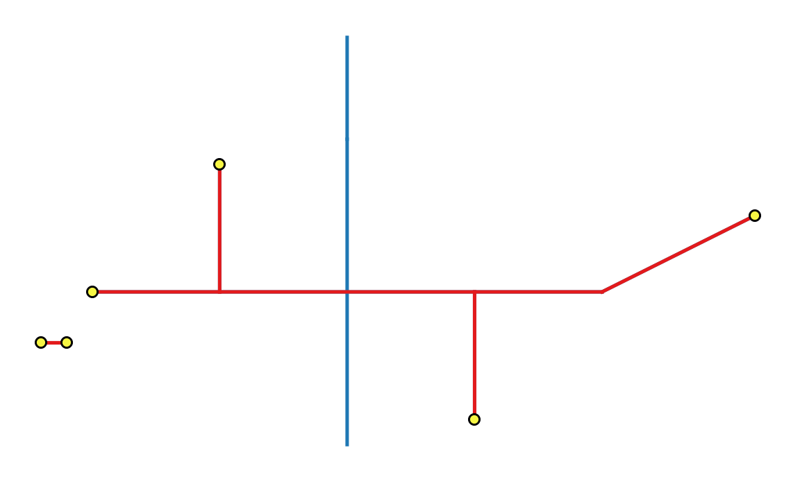
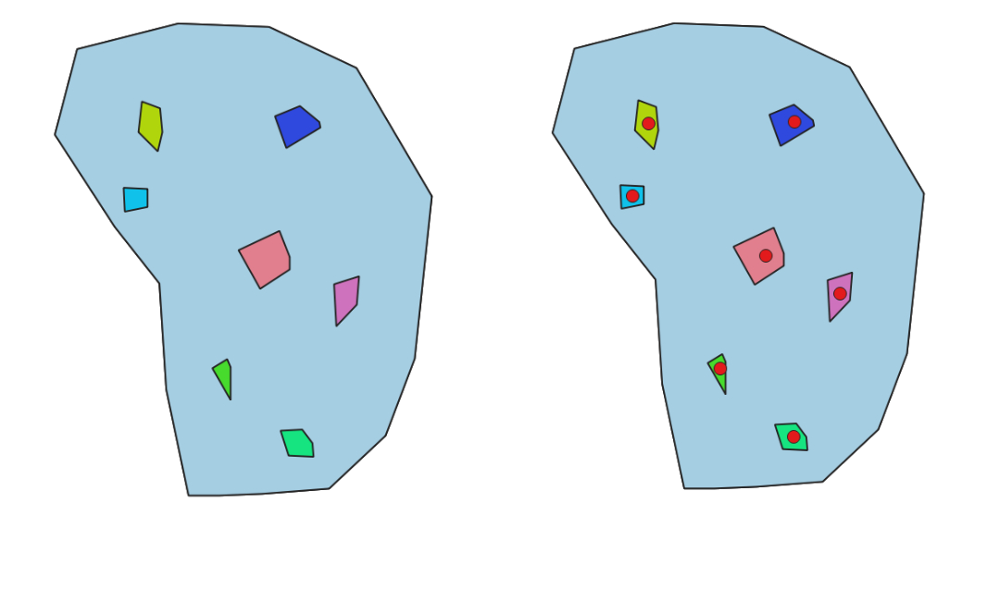
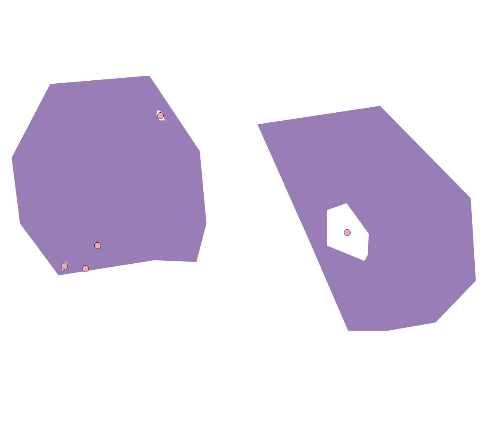
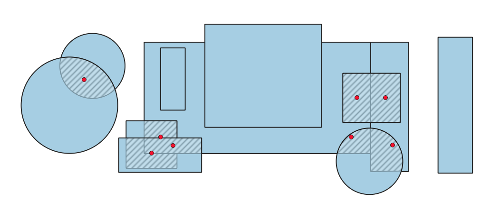
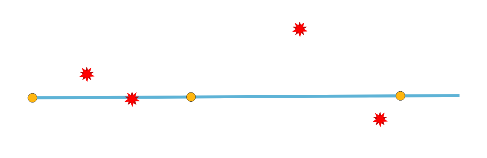
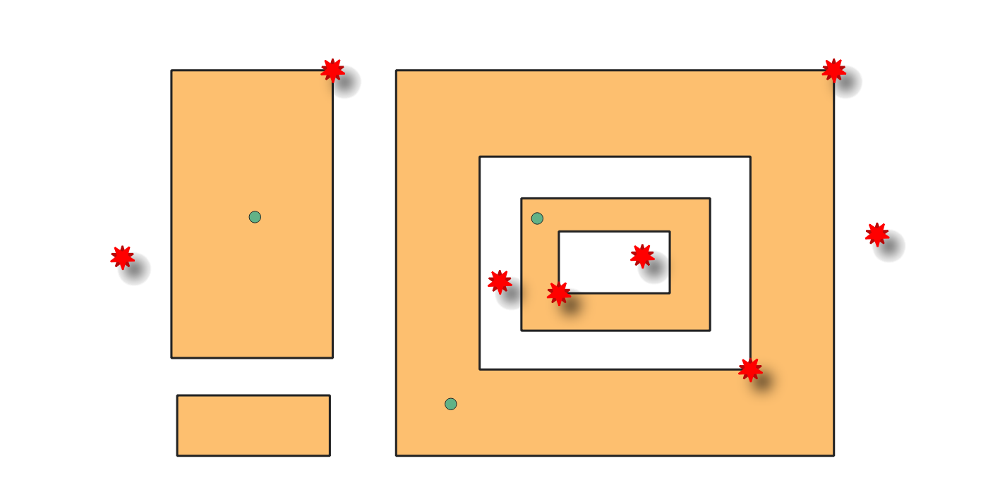
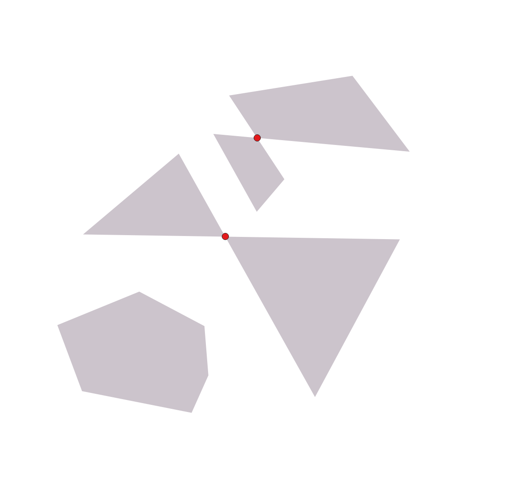
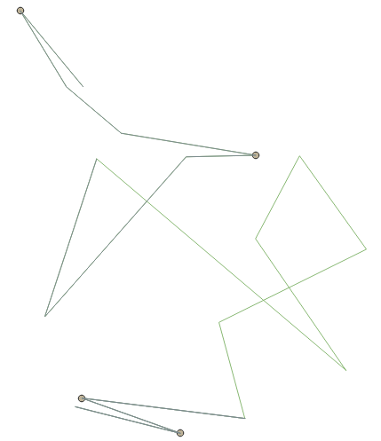
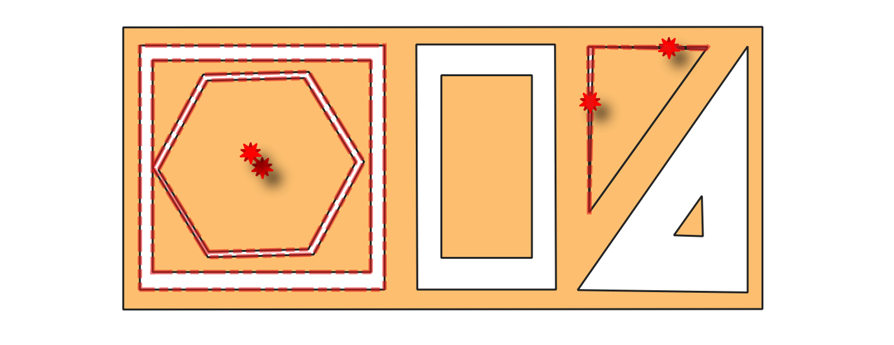
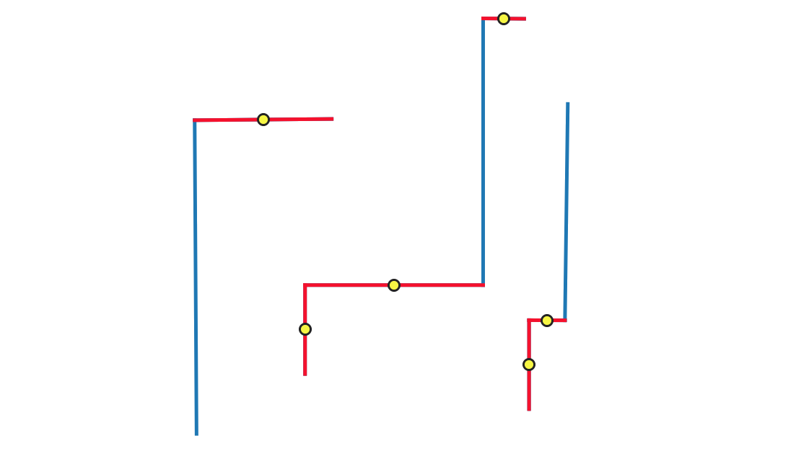

.. _checkgeometry_algorithms:

Check Geometry
===============

.. only:: html

   .. contents::
      :local:
      :depth: 1
      :class: toc-columns

.. _qgischeckgeometrydangle:

Dangle-end lines
----------------

Detects dangle-end lines in line geometries and reports them as errors.
A dangle-end line is a line feature that terminates at a vertex connected to only one segment,
resulting in an endpoint without a proper connection.

   Errors for dangle-end lines are reported on line features,
   and entire features with dangling ends are highlighted in red for clarity.

Parameters
..........

Basic parameters
^^^^^^^^^^^^^^^^

.. list-table::
   :header-rows: 1
   :widths: 20 20 20 40
   :class: longtable

   * - Label
     - Name
     - Type
     - Description
   * - **Input layer**
     - ``INPUT``
     - [vector: line]
     - Layer with the geometries to check.
   * - **Unique feature identifier**
     - ``UNIQUE_ID``
     - [tablefield: any]
     - Field storing unique values for feature identification.
   * - **Dangle-end errors**
     - ``ERRORS``
     - [vector: point]

       Default: ``[Create temporary layer]``
     - Specification of the output layer containing the errors location.
       :ref:`One of <output_parameter_widget>`:

       .. include:: ../algs_include.rst
          :start-after: **layer_output_types**
          :end-before: **end_layer_output_types**
   * - **Dangle-end features**

       Optional
     - ``OUTPUT``
     - [vector: line]

       Default: ``[Skip output]``
     - Line layer containing the identified dangle-end line features.
       :ref:`One of <output_parameter_widget>`:

       .. include:: ../algs_include.rst
          :start-after: **layer_output_types_skip**
          :end-before: **end_layer_output_types_skip**

Advanced parameters
^^^^^^^^^^^^^^^^^^^

.. list-table::
   :header-rows: 1
   :widths: 20 20 20 40
   :class: longtable

   * - Label
     - Name
     - Type
     - Description
   * - **Tolerance**
     - ``TOLERANCE``
     - [numeric: integer]

       Default: 8
     - Numerical precision of geometric operations, given as an integer n,
       meaning that two vertices less than 10\ :sup:`-n` apart (in map units)
       are considered to be merged.

Outputs
.......

.. list-table::
   :header-rows: 1
   :widths: 20 20 20 40
   :class: longtable

   * - Label
     - Name
     - Type
     - Description
   * - **Dangle-end errors**
     - ``ERRORS``
     - [vector: point]
     - Output point layer representing the error locations and information.
       The output layer contains the following fields:

       - ``gc_layerid``: the ID of the input layer.
       - ``gc_layername``: the name of the input layer.
       - ``gc_partidx``: the index of the feature's geometry part containing the dangle-end.
       - ``gc_ringidx``: the index of the feature's geometry ring containing the dangle-end.
       - ``gc_vertidx``: the vertex index of the dangle-end in the feature's geometry ring.
       - ``gc_errorx``: the x coordinate of the dangle-end.
       - ``gc_errory``: the y coordinate of the dangle-end.
       - ``gc_error``
       - ``UNIQUE_ID`` field: the unique ID of the input feature with the dangle-end.
   * - **Dangle-end features**
     - ``OUTPUT``
     - [vector: line]
     - Output line layer containing the input dangle-end features.
       If no dangle-end features are found, the output layer will be empty.
       Available fields are the same as in the ``ERRORS`` output.

Python code
...........

**Algorithm ID**: ``native:checkgeometrydangle``

.. include:: ../algs_include.rst
  :start-after: **algorithm_code_section**
  :end-before: **end_algorithm_code_section**

.. _qgischeckgeometrydegeneratepolygons:

Degenerate polygons
-------------------

Checks the polygons with less than 3 points, which are degenerate polygons.
Degenerate polygons are errors.

Parameters
..........

Basic parameters
^^^^^^^^^^^^^^^^

.. list-table::
   :header-rows: 1
   :widths: 20 20 20 40
   :class: longtable

   * - Label
     - Name
     - Type
     - Description
   * - **Input layer**
     - ``INPUT``
     - [vector: polygon]
     - Layer with the geometries to check.
   * - **Unique feature identifier**
     - ``UNIQUE_ID``
     - [tablefield: any]
     - Field storing unique values for feature identification.
   * - **Degenerate polygons errors**
     - ``ERRORS``
     - [vector: point]

       Default: ``[Create temporary layer]``
     - Specification of the output layer containing the centroid of the degenerate polygons.
       :ref:`One of <output_parameter_widget>`:

       .. include:: ../algs_include.rst
          :start-after: **layer_output_types**
          :end-before: **end_layer_output_types**
   * - **Degenerate polygons features**

       Optional
     - ``OUTPUT``
     - [vector: polygon]

       Default: ``[Skip output]``
     - Specification of the output layer containing the degenerate polygons.
       :ref:`One of <output_parameter_widget>`:

       .. include:: ../algs_include.rst
          :start-after: **layer_output_types_skip**
          :end-before: **end_layer_output_types_skip**

Advanced parameters
^^^^^^^^^^^^^^^^^^^

.. list-table::
   :header-rows: 1
   :widths: 20 20 20 40
   :class: longtable

   * - Label
     - Name
     - Type
     - Description
   * - **Tolerance**
     - ``TOLERANCE``
     - [numeric: integer]

       Default: 8
     - Numerical precision of geometric operations, given as an integer n,
       meaning that two vertices less than 10\ :sup:`-n` apart (in map units)
       are considered to be merged.

Outputs
.......

.. list-table::
   :header-rows: 1
   :widths: 20 20 20 40
   :class: longtable

   * - Label
     - Name
     - Type
     - Description
   * - **Degenerate polygons errors**
     - ``ERRORS``
     - [vector: point]
     - Output point layer representing the error locations and information.
       The output layer contains the following fields:

       - ``gc_layerid``: the ID of the input layer.
       - ``gc_layername``: the name of the input layer.
       - ``gc_partidx``: the index of the geometry part of the degenerate polygon.
       - ``gc_ringidx``: the index of the ring of the degenerate polygon.
       - ``gc_vertidx``
       - ``gc_errorx``: the x coordinate of the centroid of the degenerate polygon
       - ``gc_errory``: the y coordinate of the centroid of the degenerate polygon
       - ``gc_error``
       - ``UNIQUE_ID`` field: the unique ID of the input feature that is degenerate.
   * - **Degenerate polygons features**
     - ``OUTPUT``
     - [vector: polygon]
     - Output polygon layer with features containing the degenerate polygons.
       If no degenerate polygon features are found, the output layer will be empty.
       Available fields are the same as in the ``ERRORS`` output.

Python code
...........

**Algorithm ID**: ``native:checkgeometrydegeneratepolygon``

.. include:: ../algs_include.rst
  :start-after: **algorithm_code_section**
  :end-before: **end_algorithm_code_section**

.. _qgischeckgeometryduplicate:

Duplicated geometries
---------------------

Checks for duplicated geometries in a vector layer, and reports them as errors.

Parameters
..........

Basic parameters
^^^^^^^^^^^^^^^^

.. list-table::
   :header-rows: 1
   :widths: 20 20 20 40
   :class: longtable

   * - Label
     - Name
     - Type
     - Description
   * - **Input layer**
     - ``INPUT``
     - [vector: geometry]
     - Layer with the geometries to check
   * - **Unique feature identifier**
     - ``UNIQUE_ID``
     - [tablefield: any]
     - Field storing unique values for feature identification
   * - **Duplicate geometries errors**
     - ``ERRORS``
     - [vector: point]

       Default: ``[Create temporary layer]``
     - Specification of the output layer containing the errors location.
       :ref:`One of <output_parameter_widget>`:

       .. include:: ../algs_include.rst
          :start-after: **layer_output_types**
          :end-before: **end_layer_output_types**
   * - **Duplicate geometries**

       Optional
     - ``OUTPUT``
     - [vector: same as input]

       Default: ``[Skip output]``
     - Specification of the output layer containing the geometries
       that were found to be duplicated.
       :ref:`One of <output_parameter_widget>`:

       .. include:: ../algs_include.rst
          :start-after: **layer_output_types_skip**
          :end-before: **end_layer_output_types_skip**

Advanced parameters
^^^^^^^^^^^^^^^^^^^

.. list-table::
   :header-rows: 1
   :widths: 20 20 20 40
   :class: longtable

   * - Label
     - Name
     - Type
     - Description
   * - **Tolerance**
     - ``TOLERANCE``
     - [numeric: integer]

       Default: 8
     - Numerical precision of geometric operations, given as an integer n,
       meaning that two vertices less than 10\ :sup:`-n` apart (in map units)
       are considered to be merged.

Outputs
.......

.. list-table::
   :header-rows: 1
   :widths: 20 20 20 40
   :class: longtable

   * - Label
     - Name
     - Type
     - Description
   * - **Duplicate geometries errors**
     - ``ERRORS``
     - [vector: point]
     - Output point layer representing the error locations and information.
       The output layer contains the following fields:

       - ``gc_layerid``: the ID of the input layer.
       - ``gc_layername``: the name of the input layer.
       - ``gc_partidx``
       - ``gc_ringidx``
       - ``gc_vertidx``
       - ``gc_errorx``: the x coordinate of the centroid of the duplicate geometry.
       - ``gc_errory``: the y coordinate of the centroid of the duplicate geometry.
       - ``gc_error``: the indices of the duplicate geometry (all except the highest index).
       - ``UNIQUE_ID`` field: the unique ID of the input feature that is a duplicate.
   * - **Duplicate geometries**
     - ``OUTPUT``
     - [vector: same as input]
     - Output layer containing the geometries that were found to be duplicated.
       Available fields are the same as in the ``ERRORS`` output.

Python code
...........

**Algorithm ID**: ``native:checkgeometryduplicate``

.. include:: ../algs_include.rst
  :start-after: **algorithm_code_section**
  :end-before: **end_algorithm_code_section**

.. _qgischeckgeometryduplicatenodes:

Duplicated vertices
-------------------

Checks for duplicated vertices in line or polygon geometries,
and reports them as errors.

.. seealso:: :ref:`qgisfixgeometryduplicatenodes`, :ref:`qgisremoveduplicatevertices`

Parameters
..........

Basic parameters
^^^^^^^^^^^^^^^^

.. list-table::
   :header-rows: 1
   :widths: 20 20 20 40
   :class: longtable

   * - Label
     - Name
     - Type
     - Description
   * - **Input layer**
     - ``INPUT``
     - [vector: line, polygon]
     - Layer with the geometries to check
   * - **Unique feature identifier**
     - ``UNIQUE_ID``
     - [tablefield: any]
     - Field storing unique values for feature identification
   * - **Duplicated vertices errors**
     - ``ERRORS``
     - [vector: point]

       Default: ``[Create temporary layer]``
     - Specification of the output layer containing the errors location.
       :ref:`One of <output_parameter_widget>`:

       .. include:: ../algs_include.rst
          :start-after: **layer_output_types**
          :end-before: **end_layer_output_types**
   * - **Duplicated vertices features**

       Optional
     - ``OUTPUT``
     - [vector: same as input]

       Default: ``[Skip output]``
     - Specification of the output layer containing the features
       with duplicated vertices.
       :ref:`One of <output_parameter_widget>`:

        .. include:: ../algs_include.rst
            :start-after: **layer_output_types_skip**
            :end-before: **end_layer_output_types_skip**

Advanced parameters
^^^^^^^^^^^^^^^^^^^

.. list-table::
   :header-rows: 1
   :widths: 20 20 20 40
   :class: longtable

   * - Label
     - Name
     - Type
     - Description
   * - **Tolerance**
     - ``TOLERANCE``
     - [numeric: integer]

       Default: 8
     - Numerical precision of geometric operations, given as an integer n,
       meaning that two vertices less than 10\ :sup:`-n` apart (in map units)
       are considered to be merged.

Outputs
.......

.. list-table::
   :header-rows: 1
   :widths: 20 20 20 40
   :class: longtable

   * - Label
     - Name
     - Type
     - Description
   * - **Duplicated vertices errors**
     - ``ERRORS``
     - [vector: point]
     - Output point layer representing the error locations and information.
       The output layer contains the following fields:

       - ``gc_layerid``: the ID of the input layer.
       - ``gc_layername``: the name of the input layer.
       - ``gc_partidx``: the index of the feature's geometry part containing the duplicate vertex.
       - ``gc_ringidx``: the index of the feature's geometry ring containing the duplicate vertex.
       - ``gc_vertidx``: the index of the duplicate vertex in the feature's geometry ring.
       - ``gc_errorx``: the x coordinate of the duplicate vertex.
       - ``gc_errory``: the y coordinate of the duplicate vertex.
       - ``gc_error``
       - ``UNIQUE_ID`` field: the unique ID of the input feature that has duplicate vertices.
   * - **Duplicated vertices features**
     - ``OUTPUT``
     - [vector: same as input]
     - Output layer containing the features with duplicated vertices.
       Available fields are the same as in the ``ERRORS`` output.

Python code
...........

**Algorithm ID**: ``native:checkgeometryduplicatenodes``

.. include:: ../algs_include.rst
  :start-after: **algorithm_code_section**
  :end-before: **end_algorithm_code_section**

.. _qgischeckgeometrycontained:

Features inside polygon
-----------------------

Checks the input geometries contained in the polygons from the polygon layers list.
A polygon layer can be checked against itself.
Any contained features are reported as errors.

   Reporting errors on features inside a polygon.

.. seealso:: :ref:`qgisfixgeometrydeletefeatures`

Parameters
..........

Basic parameters
^^^^^^^^^^^^^^^^

.. list-table::
   :header-rows: 1
   :widths: 20 20 20 40
   :class: longtable

   * - Label
     - Name
     - Type
     - Description
   * - **Input layer**
     - ``INPUT``
     - [vector: geometry]
     - Layer with the geometries to check.
   * - **Unique feature identifier**
     - ``UNIQUE_ID``
     - [tablefield: any]
     - Field storing unique values for feature identification.
   * - **Polygon layers**
     - ``POLYGONS``
     - [vector: polygon][list]
     - List of polygon layers to check against.
   * - **Errors from contained features**
     - ``ERRORS``
     - [vector: point]

       Default: ``[Create temporary layer]``
     - Point layer representing the contained features.
       :ref:`One of <output_parameter_widget>`:

       .. include:: ../algs_include.rst
          :start-after: **layer_output_types**
          :end-before: **end_layer_output_types**
   * - **Contained features**

       Optional
     - ``OUTPUT``
     - [vector: same as input]

       Default: ``[Skip output]``
     - Specification of the output layer containing features within the checked polygons.
       :ref:`One of <output_parameter_widget>`:

       .. include:: ../algs_include.rst
          :start-after: **layer_output_types_skip**
          :end-before: **end_layer_output_types_skip**

Advanced parameters
^^^^^^^^^^^^^^^^^^^

.. list-table::
   :header-rows: 1
   :widths: 20 20 20 40
   :class: longtable

   * - Label
     - Name
     - Type
     - Description
   * - **Tolerance**
     - ``TOLERANCE``
     - [numeric: integer]

       Default: 8
     - Numerical precision of geometric operations, given as an integer n,
       meaning that two vertices less than 10\ :sup:`-n` apart (in map units)
       are considered to be merged.

Outputs
.......

.. list-table::
   :header-rows: 1
   :widths: 20 20 20 40
   :class: longtable

   * - Label
     - Name
     - Type
     - Description
   * - **Errors from contained features**
     - ``ERRORS``
     - [vector: point]
     - Output point layer representing the error locations and information.
       The output layer contains the following fields:

       - ``gc_layerid``: the ID of the input layer.
       - ``gc_layername``: the name of the input layer.
       - ``gc_partidx``
       - ``gc_ringidx``
       - ``gc_vertidx``
       - ``gc_errorx``: the x coordinate of the centroid of the contained feature.
       - ``gc_errory``: the y coordinate of the centroid of the contained feature.
       - ``gc_error``: the layer name and feature ID of a polygon that contains the feature.
       - ``UNIQUE_ID`` field: the unique ID of the input feature that is contained within another.
   * - **Contained features**
     - ``OUTPUT``
     - [vector: same as input]
     - Output layer containing features within the checked polygons.
       Available fields are the same as in the ``ERRORS`` output.

Python code
...........

**Algorithm ID**: ``native:checkgeometrycontained``

.. include:: ../algs_include.rst
  :start-after: **algorithm_code_section**
  :end-before: **end_algorithm_code_section**

.. _qgischeckgeometryhole:

Holes
------------

Detects holes in polygon geometries and reports them as errors.

   Reporting errors for holes on a polygon feature.

.. seealso:: :ref:`qgisfixgeometryhole`

Parameters
..........

Basic parameters
^^^^^^^^^^^^^^^^

.. list-table::
   :header-rows: 1
   :widths: 20 20 20 40
   :class: longtable

   * - Label
     - Name
     - Type
     - Description
   * - **Input layer**
     - ``INPUT``
     - [vector: polygon]
     - Layer with the geometries to check
   * - **Unique feature identifier**
     - ``UNIQUE_ID``
     - [tablefield: any]
     - Field storing unique values for feature identification
   * - **Holes errors**
     - ``ERRORS``
     - [vector: point]

       Default: ``[Create temporary layer]``
     - Specification of the output layer containing the errors location.
       :ref:`One of <output_parameter_widget>`:

       .. include:: ../algs_include.rst
          :start-after: **layer_output_types**
          :end-before: **end_layer_output_types**
   * - **Polygons with holes**

       Optional
     - ``OUTPUT``
     - [vector: polygon]

       Default: ``[Skip output]``
     - Polygon layer with the features containing holes.
       :ref:`One of <output_parameter_widget>`:

       .. include:: ../algs_include.rst
          :start-after: **layer_output_types_skip**
          :end-before: **end_layer_output_types_skip**

Advanced parameters
^^^^^^^^^^^^^^^^^^^

.. list-table::
   :header-rows: 1
   :widths: 20 20 20 40
   :class: longtable

   * - Label
     - Name
     - Type
     - Description
   * - **Tolerance**
     - ``TOLERANCE``
     - [numeric: integer]

       Default: 8
     - Numerical precision of geometric operations, given as an integer n,
       meaning that two vertices less than 10\ :sup:`-n` apart (in map units)
       are considered to be merged.

Outputs
.......

.. list-table::
   :header-rows: 1
   :widths: 20 20 20 40
   :class: longtable

   * - Label
     - Name
     - Type
     - Description
   * - **Holes errors**
     - ``ERRORS``
     - [vector: point]
     - Output point layer representing the error locations and information.
       The output layer contains the following fields:

       - ``gc_layerid``: the ID of the input layer.
       - ``gc_layername``: the name of the input layer.
       - ``gc_partidx``: the index of the feature's geometry part containing the hole.
       - ``gc_ringidx``: the index of the feature's geometry ring containing the hole.
       - ``gc_vertidx``
       - ``gc_errorx``: the x coordinate of the centroid of the hole.
       - ``gc_errory``: the y coordinate of the centroid of the hole.
       - ``gc_error``
       - ``UNIQUE_ID`` field: the unique ID of the input feature that has a hole.
   * - **Polygon with holes**
     - ``OUTPUT``
     - [vector: polygon]
     - Output polygon layer with features containing holes.
       If no holes are found, the output layer will be empty.
       Available fields are the same as in the ``ERRORS`` output.

Python code
...........

**Algorithm ID**: ``native:checkgeometryhole``

.. include:: ../algs_include.rst
  :start-after: **algorithm_code_section**
  :end-before: **end_algorithm_code_section**

.. _qgischeckgeometrylineintersection:

Lines intersecting each other
-----------------------------

Checks intersections between line geometries within a layer.
Intersections between two different lines are errors.

.. seealso:: :ref:`qgislineintersections`, :ref:`qgisintersection`, :ref:`qgischeckgeometryselfintersections`

Parameters
..........

Basic parameters
^^^^^^^^^^^^^^^^

.. list-table::
   :header-rows: 1
   :widths: 20 20 20 40
   :class: longtable

   * - Label
     - Name
     - Type
     - Description
   * - **Input layer**
     - ``INPUT``
     - [vector: line]
     - Layer with the geometries to check.
   * - **Unique feature identifier**
     - ``UNIQUE_ID``
     - [tablefield: any]
     - Field storing unique values for feature identification.
   * - **Intersection errors**
     - ``ERRORS``
     - [vector: point]

       Default: ``[Create temporary layer]``
     - Specification of the output layer containing the intersections location.
       :ref:`One of <output_parameter_widget>`:

       .. include:: ../algs_include.rst
          :start-after: **layer_output_types**
          :end-before: **end_layer_output_types**
   * - **Intersecting feature**

       Optional
     - ``OUTPUT``
     - [vector: line]

       Default: ``[Skip output]``
     - Specification of the output layer for features intersecting each other.
       :ref:`One of <output_parameter_widget>`:

       .. include:: ../algs_include.rst
          :start-after: **layer_output_types_skip**
          :end-before: **end_layer_output_types_skip**

Advanced parameters
^^^^^^^^^^^^^^^^^^^

.. list-table::
   :header-rows: 1
   :widths: 20 20 20 40
   :class: longtable

   * - Label
     - Name
     - Type
     - Description
   * - **Tolerance**
     - ``TOLERANCE``
     - [numeric: integer]

       Default: 8
     - Numerical precision of geometric operations, given as an integer n,
       meaning that two vertices less than 10\ :sup:`-n` apart (in map units)
       are considered to be merged.

Outputs
.......

.. list-table::
   :header-rows: 1
   :widths: 20 20 20 40
   :class: longtable

   * - Label
     - Name
     - Type
     - Description
   * - **Intersection errors**
     - ``ERRORS``
     - [vector: point]
     - Output point layer representing the error locations and information.
       The output layer contains the following fields:

       - ``gc_layerid``: the ID of the input layer.
       - ``gc_layername``: the name of the input layer.
       - ``gc_partidx``: the index of the feature's geometry part where the intersection occurs.
       - ``gc_ringidx``
       - ``gc_vertidx``
       - ``gc_errorx``: the x coordinate of the intersection point.
       - ``gc_errory``: the y coordinate of the intersection point.
       - ``UNIQUE_ID`` field: the unique ID of an intersecting input feature.
       - ``gc_error``: the layer name and index of the other intersecting feature.
   * - **Intersecting feature**
     - ``OUTPUT``
     - [vector: line]
     - Output layer containing, for each identified intersection, the feature (with same ``UNIQUE_ID`` value) it belongs to.
       If no intersections are found, the output layer will be empty.
       Available fields are the same as in the ``ERRORS`` output.

Python code
...........

**Algorithm ID**: ``native:checkgeometrylineintersection``

.. include:: ../algs_include.rst
  :start-after: **algorithm_code_section**
  :end-before: **end_algorithm_code_section**

.. _qgischeckgeometrylinelayerintersection:

Lines intersecting other layer
------------------------------

Checks if the input line layer features intersect with the check layer features.
An input feature that intersects with a check layer feature is an error.

.. seealso:: :ref:`qgislineintersections`, :ref:`qgisintersection`, :ref:`qgischeckgeometryselfintersections`

Parameters
..........

Basic parameters
^^^^^^^^^^^^^^^^

.. list-table::
   :header-rows: 1
   :widths: 20 20 20 40
   :class: longtable

   * - Label
     - Name
     - Type
     - Description
   * - **Input layer**
     - ``INPUT``
     - [vector: line]
     - Layer with the geometries to check.
   * - **Unique feature identifier**
     - ``UNIQUE_ID``
     - [tablefield: any]
     - Field storing unique values for feature identification.
   * - **Check layer**
     - ``CHECK_LAYER``
     - [vector: line, polygon]
     - Layer with the geometries to check against.
   * - **Line intersecting other layer errors**
     - ``ERRORS``
     - [vector: point]

       Default: ``[Create temporary layer]``
     - Specification of the output point layer containing the locations of intersection errors.
       :ref:`One of <output_parameter_widget>`:

       .. include:: ../algs_include.rst
          :start-after: **layer_output_types**
          :end-before: **end_layer_output_types**
   * - **Line intersecting other layer features**

       Optional
     - ``OUTPUT``
     - [line]

       Default: ``[Skip output]``
     - Line layer with the input features that intersect features in the check layer.
       :ref:`One of <output_parameter_widget>`:

       .. include:: ../algs_include.rst
          :start-after: **layer_output_types_skip**
          :end-before: **end_layer_output_types_skip**

Advanced parameters
^^^^^^^^^^^^^^^^^^^

.. list-table::
   :header-rows: 1
   :widths: 20 20 20 40
   :class: longtable

   * - Label
     - Name
     - Type
     - Description
   * - **Tolerance**
     - ``TOLERANCE``
     - [numeric: integer]

       Default: 8
     - Numerical precision of geometric operations, given as an integer n,
       meaning that two vertices less than 10\ :sup:`-n` apart (in map units)
       are considered to be merged.

Outputs
.......

.. list-table::
   :header-rows: 1
   :widths: 20 20 20 40
   :class: longtable

   * - Label
     - Name
     - Type
     - Description
   * - **Line intersecting other layer errors**
     - ``ERRORS``
     - [vector: point]
     - Output point layer representing the error location and information.
       The output layer contains the following fields:

       - ``gc_layerid``: the ID of the input layer.
       - ``gc_layername``: the name of the input layer.
       - ``gc_partidx``: the index of the feature's geometry part where the intersection occurs.
       - ``gc_ringidx``
       - ``gc_vertidx``
       - ``gc_errorx``: the x coordinate of the intersection point.
       - ``gc_errory``: the y coordinate of the intersection point.
       - ``UNIQUE_ID`` field: the unique ID of the intersecting input feature.
       - ``gc_error``: the index of the check layer where the intersection occurs.
   * - **Line intersecting other layer features**
     - ``OUTPUT``
     - [vector: line]
     - Output layer containing, for each identified intersection, the input feature it belongs to.
       If no intersections are found, the output layer will be empty.
       Available fields are the same as in the ``ERRORS`` output.

Python code
...........

**Algorithm ID**: ``native:checkgeometrylinelayerintersection``

.. include:: ../algs_include.rst
  :start-after: **algorithm_code_section**
  :end-before: **end_algorithm_code_section**

.. _qgischeckgeometryoverlap:

Overlaps
------------------

Calculates overlapping areas in polygon geometries, and reports areas smaller than a given minimum as errors.

   Hashed polygons indicate overlapping areas smaller than the specified minimum.

.. seealso:: :ref:`qgisfixgeometryoverlap`

Parameters
..........

Basic parameters
^^^^^^^^^^^^^^^^

.. list-table::
   :header-rows: 1
   :widths: 20 20 20 40
   :class: longtable

   * - Label
     - Name
     - Type
     - Description
   * - **Input layer**
     - ``INPUT``
     - [vector: polygon]
     - Layer with the geometries to check.
   * - **Unique feature identifier**
     - ``UNIQUE_ID``
     - [tablefield: any]
     - Field storing unique values for feature identification.
   * - **Minimum overlap area**
     - ``MIN_OVERLAP_AREA``
     - [numeric: double]
     - Minimum area of the overlap to be reported as an error.
       If set to 0, all overlaps are reported.
   * - **Overlap errors**
     - ``ERRORS``
     - [vector: point]

       Default: ``[Create temporary layer]``
     - Specification of the output layer containing centroid points of the overlapping areas.
       :ref:`One of <output_parameter_widget>`:

       .. include:: ../algs_include.rst
          :start-after: **layer_output_types**
          :end-before: **end_layer_output_types**
   * - **Overlap features**

       Optional
     - ``OUTPUT``
     - [vector: polygon]

       Default: ``[Skip output]``
     - Specification of the output layer for features containing overlaps.
       :ref:`One of <output_parameter_widget>`:

       .. include:: ../algs_include.rst
          :start-after: **layer_output_types_skip**
          :end-before: **end_layer_output_types_skip**

Advanced parameters
^^^^^^^^^^^^^^^^^^^

.. list-table::
   :header-rows: 1
   :widths: 20 20 20 40
   :class: longtable

   * - Label
     - Name
     - Type
     - Description
   * - **Tolerance**
     - ``TOLERANCE``
     - [numeric: integer]

       Default: 8
     - Numerical precision of geometric operations, given as an integer n,
       meaning that two vertices less than 10\ :sup:`-n` apart (in map units)
       are considered to be merged.

Outputs
.......

.. list-table::
   :header-rows: 1
   :widths: 20 20 20 40
   :class: longtable

   * - Label
     - Name
     - Type
     - Description
   * - **Overlap errors**
     - ``ERRORS``
     - [vector: point]
     - Output point layer representing the error locations and information.
       The output layer contains the following fields:

       - ``gc_layerid``: the ID of the input layer.
       - ``gc_layername``: the name of the input layer.
       - ``gc_errorx``: the x coordinate of the centroid of the overlapping area.
       - ``gc_errory``: the y coordinate of the centroid of the overlapping area.
       - ``gc_error``: the area of the overlapping geometry.
       - ``UNIQUE_ID`` field: the unique ID of an overlapped input feature.
       - ``gc_overlap_feature_{unique_id}``: the ``UNIQUE_ID`` field value for the other overlapping feature.
   * - **Overlap features**
     - ``OUTPUT``
     - [vector: polygon]
     - Output layer containing the overlapping areas.
       Available fields are the same as in the ``ERRORS`` output.

Python code
...........

**Algorithm ID**: ``native:checkgeometryoverlap``

.. include:: ../algs_include.rst
  :start-after: **algorithm_code_section**
  :end-before: **end_algorithm_code_section**

.. _qgischeckgeometrypointcoveredbyline:

Points outside lines
--------------------

Checks if the points in the input layer are covered by a line in the selected line layers.
A point not covered by a line is an error.

   Reporting errors on points not covered by a line.

Parameters
..........

Basic parameters
^^^^^^^^^^^^^^^^

.. list-table::
   :header-rows: 1
   :widths: 20 20 20 40
   :class: longtable

   * - Label
     - Name
     - Type
     - Description
   * - **Input layer**
     - ``INPUT``
     - [vector: point]
     - Layer with the geometries to check.
   * - **Unique feature identifier**
     - ``UNIQUE_ID``
     - [tablefield: any]
     - Field storing unique values for feature identification.
   * - **Line layers**
     - ``LINES``
     - [vector: line][list]
     - Layer(s) with the lines to check against.
   * - **Points not covered by a line**
     - ``ERRORS``
     - [vector: point]

       Default: ``[Create temporary layer]``
     - Specification of the output layer containing points not covered by a line.
       :ref:`One of <output_parameter_widget>`:

       .. include:: ../algs_include.rst
          :start-after: **layer_output_types**
          :end-before: **end_layer_output_types**

Advanced parameters
^^^^^^^^^^^^^^^^^^^

.. list-table::
   :header-rows: 1
   :widths: 20 20 20 40
   :class: longtable

   * - Label
     - Name
     - Type
     - Description
   * - **Tolerance**
     - ``TOLERANCE``
     - [numeric: integer]

       Default: 8
     - Numerical precision of geometric operations, given as an integer n,
       meaning that two vertices less than 10\ :sup:`-n` apart (in map units)
       are considered to be merged.

Outputs
.......

.. list-table::
   :header-rows: 1
   :widths: 20 20 20 40
   :class: longtable

   * - Label
     - Name
     - Type
     - Description
   * - **Points not covered by a line**
     - ``ERRORS``
     - [vector: point]
     - Output point layer representing the error locations and information.
       The output layer contains the following fields:

       - ``gc_layerid``: the ID of the input layer.
       - ``gc_layername``: the name of the input layer.
       - ``gc_partidx``
       - ``gc_ringidx``
       - ``gc_vertidx``
       - ``gc_errorx``: the x coordinate of point outside the lines.
       - ``gc_errory``: the y coordinate of point outside the lines.
       - ``gc_error``
       - ``UNIQUE_ID`` field: the unique ID of the input feature that is outside the lines.

Python code
...........

**Algorithm ID**: ``native:checkgeometrypointcoveredbyline``

.. include:: ../algs_include.rst
  :start-after: **algorithm_code_section**
  :end-before: **end_algorithm_code_section**

.. _qgischeckgeometrypointinpolygon:

Points outside polygons
-----------------------

Checks if points from the input layer are in polygons from the selected polygon layers.
Points that are not fully inside polygons are errors.

   Reporting errors on points outside polygons.

Parameters
..........

Basic parameters
^^^^^^^^^^^^^^^^

.. list-table::
   :header-rows: 1
   :widths: 20 20 20 40
   :class: longtable

   * - Label
     - Name
     - Type
     - Description
   * - **Input layer**
     - ``INPUT``
     - [vector: point]
     - Layer with the geometries to check.
   * - **Unique feature identifier**
     - ``UNIQUE_ID``
     - [tablefield: any]
     - Field storing unique values for feature identification.
   * - **Polygon layers**
     - ``POLYGONS``
     - [vector: polygon][list]
     - Layer(s) with the polygons to check against.
   * - **Points outside polygons errors**
     - ``ERRORS``
     - [vector: point]

       Default: ``[Create temporary layer]``
     - Specification of the output layer containing points outside the polygons.
       :ref:`One of <output_parameter_widget>`:

       .. include:: ../algs_include.rst
          :start-after: **layer_output_types**
          :end-before: **end_layer_output_types**

Advanced parameters
^^^^^^^^^^^^^^^^^^^

.. list-table::
   :header-rows: 1
   :widths: 20 20 20 40
   :class: longtable

   * - Label
     - Name
     - Type
     - Description
   * - **Tolerance**
     - ``TOLERANCE``
     - [numeric: integer]

       Default: 8
     - Numerical precision of geometric operations, given as an integer n,
       meaning that two vertices less than 10\ :sup:`-n` apart (in map units)
       are considered to be merged.

Outputs
.......

.. list-table::
   :header-rows: 1
   :widths: 20 20 20 40
   :class: longtable

   * - Label
     - Name
     - Type
     - Description
   * - **Points outside polygons errors**
     - ``ERRORS``
     - [vector: point]
     - Output point layer representing the error locations and information.
       The output layer contains the following fields:

       - ``gc_layerid``: the ID of the input layer.
       - ``gc_layername``: the name of the input layer.
       - ``gc_partidx``
       - ``gc_ringidx``
       - ``gc_vertidx``
       - ``gc_errorx``: the x coordinate of point outside the polygons.
       - ``gc_errory``: the y coordinate of point outside the polygons.
       - ``gc_error``
       - ``UNIQUE_ID`` field: the unique ID of the input feature that is outside the polygons.

Python code
...........

**Algorithm ID**: ``native:checkgeometrypointinpolygon``

.. include:: ../algs_include.rst
  :start-after: **algorithm_code_section**
  :end-before: **end_algorithm_code_section**

.. _qgischeckgeometryselfintersections:

Self-intersections
------------------

Detects self-intersections in line or polygon geometries, and reports them as errors.

   Reporting errors on features with self-intersections.

.. seealso:: :ref:`qgisfixgeometryselfintersection`

Parameters
..........

Basic parameters
^^^^^^^^^^^^^^^^

.. list-table::
   :header-rows: 1
   :widths: 20 20 20 40
   :class: longtable

   * - Label
     - Name
     - Type
     - Description
   * - **Input layer**
     - ``INPUT``
     - [vector: line, polygon]
     - Layer with the geometries to check
   * - **Unique feature identifier**
     - ``UNIQUE_ID``
     - [tablefield: any]
     - Field storing unique values for feature identification
   * - **Self-intersecting errors**
     - ``ERRORS``
     - [vector: point]

       Default: ``[Create temporary layer]``
     - Specification of the output layer containing the errors location.
       :ref:`One of <output_parameter_widget>`:

       .. include:: ../algs_include.rst
          :start-after: **layer_output_types**
          :end-before: **end_layer_output_types**
   * - **Self-intersecting features**

       Optional
     - ``OUTPUT``
     - [same as input]

       Default: ``[Skip output]``
     - Line or polygon layer containing self-intersected features.
       :ref:`One of <output_parameter_widget>`:

       .. include:: ../algs_include.rst
          :start-after: **layer_output_types_skip**
          :end-before: **end_layer_output_types_skip**

Advanced parameters
^^^^^^^^^^^^^^^^^^^

.. list-table::
   :header-rows: 1
   :widths: 20 20 20 40
   :class: longtable

   * - Label
     - Name
     - Type
     - Description
   * - **Tolerance**
     - ``TOLERANCE``
     - [numeric: integer]

       Default: 8
     - Numerical precision of geometric operations, given as an integer n,
       meaning that two vertices less than 10\ :sup:`-n` apart (in map units)
       are considered to be merged.

Outputs
.......

.. list-table::
   :header-rows: 1
   :widths: 20 20 20 40
   :class: longtable

   * - Label
     - Name
     - Type
     - Description
   * - **Self-intersecting errors**
     - ``ERRORS``
     - [vector: point]
     - Output point layer representing the error locations and information.
       The output layer contains the following fields:

       - ``gc_layerid``: the ID of the input layer.
       - ``gc_layername``: the name of the input layer.
       - ``gc_partidx``: the index of the feature's geometry part where the self-intersection occurs.
       - ``gc_ringidx``: the index of the feature's geometry ring where the self-intersection occurs.
       - ``gc_vertidx``
       - ``gc_errorx``: the x coordinate of the self-intersection.
       - ``gc_errory``: the y coordinate of the self-intersection.
       - ``gc_error``
       - ``gc_segment_1``: the index of the first segment involved in the intersection.
       - ``gc_segment_2``: the index of the second segment involved in the intersection.
       - ``UNIQUE_ID`` field: the unique ID of the self-intersecting input feature.
   * - **Self-intersecting features**
     - ``OUTPUT``
     - [vector: line, polygon]
     - Output polygon or line layer with features containing the self-intersecting features.
       If no self-intersecting features are found, the output layer will be empty.
       Available fields are the same as in the ``ERRORS`` output.

Python code
...........

**Algorithm ID**: ``native:checkgeometryselfintersection``

.. include:: ../algs_include.rst
  :start-after: **algorithm_code_section**
  :end-before: **end_algorithm_code_section**

.. _qgischeckgeometryangle:

Small angles
------------

Compares the angles within line or polygon geometries to a specified threshold,
and reports as error any angle below that value.

   Reporting errors on a line feature for angles lower than 15°.

.. seealso:: :ref:`qgisfixgeometryangle`

Parameters
..........

Basic parameters
^^^^^^^^^^^^^^^^

.. list-table::
   :header-rows: 1
   :widths: 20 20 20 40
   :class: longtable

   * - Label
     - Name
     - Type
     - Description
   * - **Input layer**
     - ``INPUT``
     - [vector: line, polygon]
     - Layer with the geometries to check.
   * - **Unique feature identifier**
     - ``UNIQUE_ID``
     - [tablefield: any]
     - Field storing unique values for feature identification.
   * - **Minimum angle**
     - ``MIN_ANGLE``
     - [numeric: double]
     - Allowed minimum angle between adjacent segments in a feature's geometry.
       Any angle below this threshold is reported as error.
   * - **Small angle errors**
     - ``ERRORS``
     - [vector: point]

       Default: ``[Create temporary layer]``
     - Specification of the output layer containing the errors location.
       :ref:`One of <output_parameter_widget>`:

       .. include:: ../algs_include.rst
          :start-after: **layer_output_types**
          :end-before: **end_layer_output_types**

Advanced parameters
^^^^^^^^^^^^^^^^^^^

.. list-table::
   :header-rows: 1
   :widths: 20 20 20 40
   :class: longtable

   * - Label
     - Name
     - Type
     - Description
   * - **Tolerance**
     - ``TOLERANCE``
     - [numeric: integer]

       Default: 8
     - Numerical precision of geometric operations, given as an integer n,
       meaning that two vertices less than 10\ :sup:`-n` apart (in map units)
       are considered to be merged.

Outputs
.......

.. list-table::
   :header-rows: 1
   :widths: 20 20 20 40
   :class: longtable

   * - Label
     - Name
     - Type
     - Description
   * - **Small angle errors**
     - ``ERRORS``
     - [vector: point]
     - Output point layer representing the error locations and information.
       The output layer contains the following fields:

       - ``gc_layerid``: the ID of the input layer.
       - ``gc_layername``: the name of the input layer.
       - ``gc_partidx``: the index of the feature's geometry part containing the small angle.
       - ``gc_ringidx``: the index of the feature's geometry ring containing the small angle.
       - ``gc_vertidx``: the index of the vertex with the small angle in the feature's geometry ring.
       - ``gc_errorx``: the x coordinate of the vertex with the small angle.
       - ``gc_errory``: the y coordinate of the vertex with the small angle.
       - ``gc_error``: the error angle value.
       - ``UNIQUE_ID`` field: the unique ID of the input feature with the small angle.

Python code
...........

**Algorithm ID**: ``native:checkgeometryangle``

.. include:: ../algs_include.rst
  :start-after: **algorithm_code_section**
  :end-before: **end_algorithm_code_section**

.. _qgischeckgeometrygap:

Small gaps
---------------------

Checks for gaps between polygons in the input layer.
Gaps with an area smaller than the gap threshold are reported as errors.
If an allowed gaps layer is provided, the algorithm ignores gaps that fall entirely within polygons from this layer.
An optional buffer can be applied to the allowed gaps.

   Reporting errors on polygon features for gaps smaller than the specified threshold.

.. seealso:: :ref:`qgisfixgeometrygap`

Parameters
..........

Basic parameters
^^^^^^^^^^^^^^^^

.. list-table::
   :header-rows: 1
   :widths: 20 20 20 40
   :class: longtable

   * - Label
     - Name
     - Type
     - Description
   * - **Input layer**
     - ``INPUT``
     - [vector: polygon]
     - Layer with the geometries to check.
   * - **Unique feature identifier**
     - ``UNIQUE_ID``
     - [tablefield: any]
     - Field storing unique values for feature identification.
   * - **Gap threshold**
     - ``GAP_THRESHOLD``
     - [numeric: double]

       Default: 0.0
     - Maximum area of gaps to be reported as errors, in map units.
       If set to 0, all the gaps are reported.
   * - **Allowed gaps layer**

       Optional
     - ``ALLOWED_GAPS_LAYER``
     - [vector: polygon]
     - Optional layer specifying polygons whose areas should be ignored during the gap check.
       Gaps that fall entirely within these polygons will not be reported as errors.
   * - **Allowed gaps buffer**

       Optional
     - ``ALLOWED_GAPS_BUFFER``
     - [numeric: double]

       Default: 0.0
     - Buffer distance to apply to the allowed gaps layer, in selected units.
       Gaps located within this buffered area are ignored.
       Allows adding a spatial tolerance around allowed gaps to avoid reporting near-boundary gaps as errors.
   * - **Neighbors layer**
     - ``NEIGHBORS``
     - [vector: table]

       Default: ``[Create temporary layer]``
     - Specification of the output table representing the gap ID and the unique ID of its neighbor features.
       :ref:`One of <output_parameter_widget>`:

       .. include:: ../algs_include.rst
          :start-after: **layer_output_types**
          :end-before: **end_layer_output_types**
   * - **Gap errors**

       Optional
     - ``ERRORS``
     - [vector: point]

       Default: ``[Skip output]``
     - Specification of the output layer containing the centroid points of the gaps.
       :ref:`One of <output_parameter_widget>`:

       .. include:: ../algs_include.rst
          :start-after: **layer_output_types_skip**
          :end-before: **end_layer_output_types_skip**
   * - **Gap features**
     - ``OUTPUT``
     - [vector: polygon]

       Default: ``[Create temporary layer]``
     - Specification of the output layer containing the gap geometries.
       :ref:`One of <output_parameter_widget>`:

       .. include:: ../algs_include.rst
          :start-after: **layer_output_types**
          :end-before: **end_layer_output_types**

Advanced parameters
^^^^^^^^^^^^^^^^^^^

.. list-table::
   :header-rows: 1
   :widths: 20 20 20 40
   :class: longtable

   * - Label
     - Name
     - Type
     - Description
   * - **Tolerance**
     - ``TOLERANCE``
     - [numeric: integer]

       Default: 8
     - Numerical precision of geometric operations, given as an integer n,
       meaning that two vertices less than 10\ :sup:`-n` apart (in map units)
       are considered to be merged.

Outputs
.......

.. list-table::
   :header-rows: 1
   :widths: 20 20 20 40
   :class: longtable

   * - Label
     - Name
     - Type
     - Description
   * - **Neighbors layer**
     - ``NEIGHBORS``
     - [vector: table]
     - A 1–N relational table, meaning that one gap can be associated with multiple neighboring polygons.
       The output table contains the following fields:

       - ``gc_errorid``: the ID of the gap.
       - ``UNIQUE_ID`` field: the unique ID of an input feature that is a neighbor of the gap.
   * - **Gap errors**
     - ``ERRORS``
     - [vector: point]
     - Output point layer representing the error locations and information.
       The output layer contains the following fields:

       - ``gc_layerid``: the ID of the input layer.
       - ``gc_layername``: the name of the input layer.
       - ``gc_partidx``
       - ``gc_ringidx``
       - ``gc_vertidx``
       - ``gc_errorx``: the x coordinate of the centroid of the gap.
       - ``gc_errory``: the y coordinate of the centroid of the gap.
       - ``gc_error``: the area of the gap.
       - ``gc_errorid``: the ID of the gap.
   * - **Gap features**
     - ``OUTPUT``
     - [vector: polygon]
     - Output layer containing the gap geometries.
       Available fields are the same as in the ``ERRORS`` output.

Python code
...........

**Algorithm ID**: ``native:checkgeometrygap``

.. include:: ../algs_include.rst
  :start-after: **algorithm_code_section**
  :end-before: **end_algorithm_code_section**

.. _qgischeckgeometrysegmentlength:

Small segments
---------------------

Calculates length of individual segments in line or polygon geometries,
and reports segments shorter than a minimum length as errors.

   Reporting errors (in red) on single line segments shorter than the given threshold.

.. seealso:: :ref:`qgisfixgeometrydeletefeatures`

Parameters
..........

Basic parameters
^^^^^^^^^^^^^^^^

.. list-table::
   :header-rows: 1
   :widths: 20 20 20 40
   :class: longtable

   * - Label
     - Name
     - Type
     - Description
   * - **Input layer**
     - ``INPUT``
     - [vector: line, polygon]
     - Layer with the geometries to check.
   * - **Unique feature identifier**
     - ``UNIQUE_ID``
     - [tablefield: any]
     - Field storing unique values for feature identification.
   * - **Minimum segment length**
     - ``MIN_SEGMENT_LENGTH``
     - [numeric: double]

       Default: 0.0
     - Minimum length of segments to be considered valid, in map units.
   * - **Short segments errors**
     - ``ERRORS``
     - [vector: point]

       Default: ``[Create temporary layer]``
     - Specification of the output layer containing centroid of short segments.
       :ref:`One of <output_parameter_widget>`:

       .. include:: ../algs_include.rst
          :start-after: **layer_output_types**
          :end-before: **end_layer_output_types**
   * - **Short segments features**

       Optional
     - ``OUTPUT``
     - [vector: same as input]

       Default: ``[Skip output]``
     - Specification of the output layer for features containing short segments.
       :ref:`One of <output_parameter_widget>`:

       .. include:: ../algs_include.rst
          :start-after: **layer_output_types_skip**
          :end-before: **end_layer_output_types_skip**

Advanced parameters
^^^^^^^^^^^^^^^^^^^

.. list-table::
   :header-rows: 1
   :widths: 20 20 20 40
   :class: longtable

   * - Label
     - Name
     - Type
     - Description
   * - **Tolerance**
     - ``TOLERANCE``
     - [numeric: integer]

       Default: 8
     - Numerical precision of geometric operations, given as an integer n,
       meaning that two vertices less than 10\ :sup:`-n` apart (in map units)
       are considered to be merged.

Outputs
.......

.. list-table::
   :header-rows: 1
   :widths: 20 20 20 40
   :class: longtable

   * - Label
     - Name
     - Type
     - Description
   * - **Short segments errors**
     - ``ERRORS``
     - [vector: point]
     - Output point layer representing the error locations and information.
       The output layer contains the following fields:

       - ``gc_layerid``: the ID of the input layer.
       - ``gc_layername``: the name of the input layer.
       - ``gc_partidx``: the index of the feature's geometry part containing the small segment.
       - ``gc_ringidx``: the index of the feature's geometry ring containing the small segment.
       - ``gc_vertidx``: the index of the end vertex of the small segment in the feature's geometry ring.
       - ``gc_errorx``: the x coordinate of the centroid of the small segment.
       - ``gc_errory``: the y coordinate of the centroid of the small segment.
       - ``gc_error``: the error segment length.
       - ``UNIQUE_ID`` field: the unique ID of the input feature with the small segment.
   * - **Short segments features**
     - ``OUTPUT``
     - [vector: same as input]
     - Output layer containing, for each identified short segment, the feature it belongs to.
       Available fields are the same as in the ``ERRORS`` output.

Python code
...........

**Algorithm ID**: ``native:checkgeometrysegmentlength``

.. include:: ../algs_include.rst
  :start-after: **algorithm_code_section**
  :end-before: **end_algorithm_code_section**
