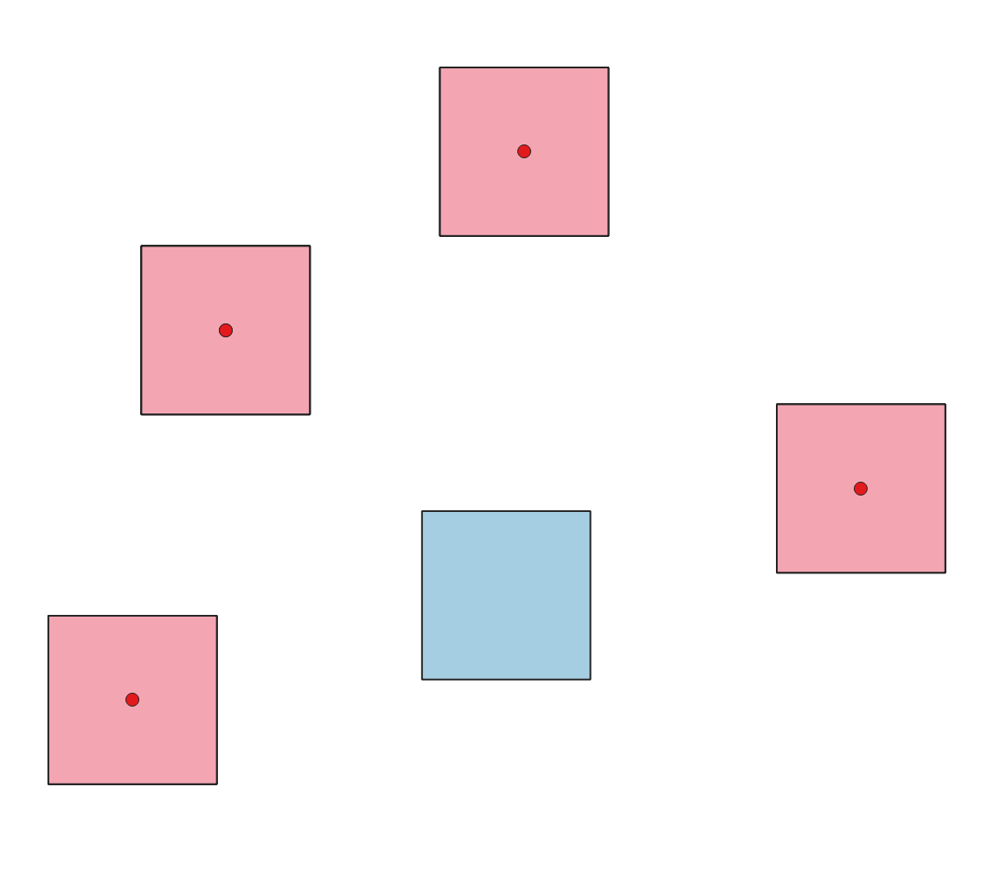

.. _checkgeometry_algorithms:

Check Geometry
===============

.. only:: html

   .. contents::
      :local:
      :depth: 1

.. _qgischeckgeometryangle:

Small angles
------------

Compares the angles within line or polygon geometries to a specified threshold,
and reports as error any angle below that value.

.. figure:: img/check_geometry_angle.png
   :align: center

   Reporting errors on a line feature for angles lower than 15°.

.. seealso:: :ref:`qgisfixgeometryangle`

Parameters
..........

Basic parameters
................

.. list-table::
   :header-rows: 1
   :widths: 20 20 20 40
   :class: longtable

   * - Label
     - Name
     - Type
     - Description
   * - **Input layer**
     - ``INPUT``
     - [vector: line, polygon]
     - Layer with the geometries to check
   * - **Unique feature identifier**
     - ``UNIQUE_ID``
     - [tablefield: any]
     - Field storing unique values for feature identification
   * - **Minimum angle**
     - ``MIN_ANGLE``
     - [numeric: double]
     - Allowed minimum angle between adjacent segments in a feature's geometry.
       Any angle below this threshold is reported as error.
   * - **Small angle errors**
     - ``ERRORS``
     - [vector: point]

       Default: ``[Create temporary layer]``
     - Specification of the output layer containing the errors location.
       :ref:`One of <output_parameter_widget>`:

       .. include:: ../algs_include.rst
          :start-after: **layer_output_types**
          :end-before: **end_layer_output_types**

Advanced parameters
...................

.. list-table::
   :header-rows: 1
   :widths: 20 20 20 40
   :class: longtable

   * - Label
     - Name
     - Type
     - Description
   * - **Tolerance**
     - ``TOLERANCE``
     - [numeric: integer]

       Default: 8
     - Numerical precision of geometric operations, given as an integer n,
       meaning that two vertices less than 10\ :sup:`-n` apart (in map units)
       are considered to be merged.

Outputs
.......

.. list-table::
   :header-rows: 1
   :widths: 20 20 20 40
   :class: longtable

   * - Label
     - Name
     - Type
     - Description
   * - **Small angle errors**
     - ``ERRORS``
     - [vector: point]
     - Output point layer representing the error locations and information
       (the ID and name of the input layer, the ID, geometry part,
       ring and vertex index of the erroneous feature,
       x and y coordinates of the error and the value of the erroneous angle).

Python code
...........

**Algorithm ID**: ``native:checkgeometryangle``

.. include:: ../algs_include.rst
  :start-after: **algorithm_code_section**
  :end-before: **end_algorithm_code_section**

.. _qgischeckgeometryduplicate:

Duplicated geometries
---------------------

Checks for duplicated geometries in a vector layer, and reports them as errors.

   Output layer identifying duplicated geometries

Parameters
..........

Basic parameters
^^^^^^^^^^^^^^^^

.. list-table::
   :header-rows: 1
   :widths: 20 20 20 40
   :class: longtable

   * - Label
     - Name
     - Type
     - Description
   * - **Input layer**
     - ``INPUT``
     - [vector: geometry]
     - Layer with the geometries to check
   * - **Unique feature identifier**
     - ``UNIQUE_ID``
     - [tablefield: any]
     - Field storing unique values for feature identification
   * - **Duplicate geometries errors**
     - ``ERRORS``
     - [vector: point]

       Default: ``[Create temporary layer]``
     - Specification of the output layer containing the errors location.
       :ref:`One of <output_parameter_widget>`:

       .. include:: ../algs_include.rst
          :start-after: **layer_output_types**
          :end-before: **end_layer_output_types**
   * - **Duplicate geometries**

       Optional
     - ``OUTPUT``
     - [vector: same as input]

       Default: ``[Skip output]``
     - Specification of the output layer containing the geometries
       that were found to be duplicated.
       :ref:`One of <output_parameter_widget>`:

       .. include:: ../algs_include.rst
          :start-after: **layer_output_types_skip**
          :end-before: **end_layer_output_types_skip**

Advanced parameters
^^^^^^^^^^^^^^^^^^^

.. list-table::
   :header-rows: 1
   :widths: 20 20 20 40
   :class: longtable

   * - Label
     - Name
     - Type
     - Description
   * - **Tolerance**
     - ``TOLERANCE``
     - [numeric: integer]

       Default: 8
     - Numerical precision of geometric operations, given as an integer n,
       meaning that two vertices less than 10\ :sup:`-n` apart (in map units)
       are considered to be merged.

Outputs
.......

.. list-table::
   :header-rows: 1
   :widths: 20 20 20 40
   :class: longtable

   * - Label
     - Name
     - Type
     - Description
   * - **Duplicate geometries errors**
     - ``ERRORS``
     - [vector: point]
     - Output point layer representing the error locations and information
       (the ID and name of the input layer, the geometry part,
       ring and vertex index of the erroneous feature,
       x and y coordinates of the error and affected feature IDs).
   * - **Duplicate geometries**
     - ``OUTPUT``
     - [vector: same as input]
     - Output layer containing the geometries that were found to be duplicated.

Python code
...........

**Algorithm ID**: ``native:checkgeometryduplicate``

.. include:: ../algs_include.rst
  :start-after: **algorithm_code_section**
  :end-before: **end_algorithm_code_section**