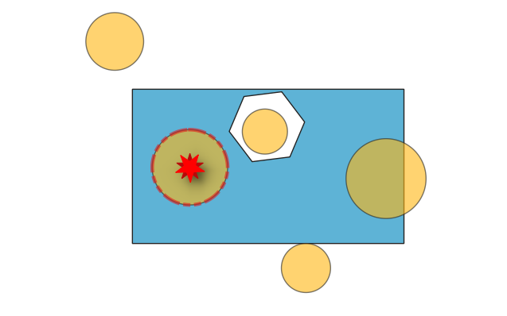

.. _checkgeometry_algorithms:

Check Geometry
===============

.. only:: html

   .. contents::
      :local:
      :depth: 1

.. _qgischeckgeometrydangle:

Dangle-end lines
----------------

Detects dangle-end lines in line geometries and reports them as errors.
A dangle-end line is a line feature that terminates at a vertex connected to only one segment,
resulting in an endpoint without a proper connection.

.. figure:: img/check_geometry_dangleendlines.png
   :align: center

   Errors for dangle-end lines are reported on line features, and entire features with dangling ends are highlighted in red for clarity.

Parameters
..........

Basic parameters
^^^^^^^^^^^^^^^^

.. list-table::
   :header-rows: 1
   :widths: 20 20 20 40
   :class: longtable

   * - Label
     - Name
     - Type
     - Description
   * - **Input layer**
     - ``INPUT``
     - [vector: line]
     - Layer with the geometries to check.
   * - **Unique feature identifier**
     - ``UNIQUE_ID``
     - [tablefield: any]
     - Field storing unique values for feature identification.
   * - **Dangle-end errors**
     - ``ERRORS``
     - [vector: point]

       Default: ``[Create temporary layer]``
     - Specification of the output layer containing the errors location.
       :ref:`One of <output_parameter_widget>`:

       .. include:: ../algs_include.rst
          :start-after: **layer_output_types**
          :end-before: **end_layer_output_types**
   * - **Dangle-end features**

       Optional
     - ``OUTPUT``
     - [vector: line]

       Default: ``[Skip output]``
     - Line layer containing the identified dangle-end line features.
       :ref:`One of <output_parameter_widget>`:

       .. include:: ../algs_include.rst
          :start-after: **layer_output_types_skip**
          :end-before: **end_layer_output_types_skip**

Advanced parameters
^^^^^^^^^^^^^^^^^^^

.. list-table::
   :header-rows: 1
   :widths: 20 20 20 40
   :class: longtable

   * - Label
     - Name
     - Type
     - Description
   * - **Tolerance**
     - ``TOLERANCE``
     - [numeric: integer]

       Default: 8
     - Numerical precision of geometric operations, given as an integer n,
       meaning that two vertices less than 10\ :sup:`-n` apart (in map units)
       are considered to be merged.

Outputs
.......

.. list-table::
   :header-rows: 1
   :widths: 20 20 20 40
   :class: longtable

   * - Label
     - Name
     - Type
     - Description
   * - **Dangle-end errors**
     - ``ERRORS``
     - [vector: point]
     - Output point layer representing the error locations and information.
       Other than the ``UNIQUE_ID`` field, the output layer also contains the following fields:
       
       - ``gc_layerid``: the ID of the input layer.
       - ``gc_layername``: the name of the input layer.
       - ``gc_partidx``: the index of the feature's geometry part containing the dangle-end.
       - ``gc_ringidx``: the index of the feature's geometry ring containing the dangle-end.
       - ``gc_vertidx``: the vertex index of the dangle-end in the feature.
       - ``gc_errorx``: the x coordinate of the dangle-end.
       - ``gc_errory``: the y coordinate of the dangle-end.
       - ``gc_error``
   * - **Dangle-end features**
     - ``OUTPUT``
     - [vector: line]
     - Output line layer containing the input dangle-end features.
       If no dangle-end features are found, the output layer will be empty.

Python code
...........

**Algorithm ID**: ``native:checkgeometrydangle``

.. include:: ../algs_include.rst
  :start-after: **algorithm_code_section**
  :end-before: **end_algorithm_code_section**

.. _qgischeckgeometryduplicate:

Duplicated geometries
---------------------

Checks for duplicated geometries in a vector layer, and reports them as errors.

Parameters
..........

Basic parameters
^^^^^^^^^^^^^^^^

.. list-table::
   :header-rows: 1
   :widths: 20 20 20 40
   :class: longtable

   * - Label
     - Name
     - Type
     - Description
   * - **Input layer**
     - ``INPUT``
     - [vector: geometry]
     - Layer with the geometries to check
   * - **Unique feature identifier**
     - ``UNIQUE_ID``
     - [tablefield: any]
     - Field storing unique values for feature identification
   * - **Duplicate geometries errors**
     - ``ERRORS``
     - [vector: point]

       Default: ``[Create temporary layer]``
     - Specification of the output layer containing the errors location.
       :ref:`One of <output_parameter_widget>`:

       .. include:: ../algs_include.rst
          :start-after: **layer_output_types**
          :end-before: **end_layer_output_types**
   * - **Duplicate geometries**

       Optional
     - ``OUTPUT``
     - [vector: same as input]

       Default: ``[Skip output]``
     - Specification of the output layer containing the geometries
       that were found to be duplicated.
       :ref:`One of <output_parameter_widget>`:

       .. include:: ../algs_include.rst
          :start-after: **layer_output_types_skip**
          :end-before: **end_layer_output_types_skip**

Advanced parameters
^^^^^^^^^^^^^^^^^^^

.. list-table::
   :header-rows: 1
   :widths: 20 20 20 40
   :class: longtable

   * - Label
     - Name
     - Type
     - Description
   * - **Tolerance**
     - ``TOLERANCE``
     - [numeric: integer]

       Default: 8
     - Numerical precision of geometric operations, given as an integer n,
       meaning that two vertices less than 10\ :sup:`-n` apart (in map units)
       are considered to be merged.

Outputs
.......

.. list-table::
   :header-rows: 1
   :widths: 20 20 20 40
   :class: longtable

   * - Label
     - Name
     - Type
     - Description
   * - **Duplicate geometries errors**
     - ``ERRORS``
     - [vector: point]
     - Output point layer representing the error locations and information.
       Other than the ``UNIQUE_ID`` field, the output layer also contains the following fields:
       
       - ``gc_layerid``: the ID of the input layer.
       - ``gc_layername``: the name of the input layer.
       - ``gc_partidx``
       - ``gc_ringidx``
       - ``gc_vertidx``
       - ``gc_errorx``: the x coordinate of the centroid of the duplicate geometry.
       - ``gc_errory``: the y coordinate of the centroid of the duplicate geometry.
       - ``gc_error``: the indices of the duplicate geometry (all except the highest index).
   * - **Duplicate geometries**
     - ``OUTPUT``
     - [vector: same as input]
     - Output layer containing the geometries that were found to be duplicated.
       Available fields are the same as in the ``ERRORS`` output.

Python code
...........

**Algorithm ID**: ``native:checkgeometryduplicate``

.. include:: ../algs_include.rst
  :start-after: **algorithm_code_section**
  :end-before: **end_algorithm_code_section**

.. _qgischeckgeometryduplicatenodes:

Duplicated vertices
-------------------

Checks for duplicated vertices in line or polygon geometries,
and reports them as errors.

.. seealso:: :ref:`qgisfixgeometryduplicatenodes`, :ref:`qgisremoveduplicatevertices`

Parameters
..........

Basic parameters
^^^^^^^^^^^^^^^^

.. list-table::
   :header-rows: 1
   :widths: 20 20 20 40
   :class: longtable

   * - Label
     - Name
     - Type
     - Description
   * - **Input layer**
     - ``INPUT``
     - [vector: line, polygon]
     - Layer with the geometries to check
   * - **Unique feature identifier**
     - ``UNIQUE_ID``
     - [tablefield: any]
     - Field storing unique values for feature identification
   * - **Duplicated vertices errors**
     - ``ERRORS``
     - [vector: point]

       Default: ``[Create temporary layer]``
     - Specification of the output layer containing the errors location.
       :ref:`One of <output_parameter_widget>`:

       .. include:: ../algs_include.rst
          :start-after: **layer_output_types**
          :end-before: **end_layer_output_types**
   * - **Duplicated vertices features**

       Optional
     - ``OUTPUT``
     - [vector: same as input]

       Default: ``[Skip output]``
     - Specification of the output layer containing the features
       with duplicated vertices.
       :ref:`One of <output_parameter_widget>`:

        .. include:: ../algs_include.rst
            :start-after: **layer_output_types_skip**
            :end-before: **end_layer_output_types_skip**

Advanced parameters
^^^^^^^^^^^^^^^^^^^

.. list-table::
   :header-rows: 1
   :widths: 20 20 20 40
   :class: longtable

   * - Label
     - Name
     - Type
     - Description
   * - **Tolerance**
     - ``TOLERANCE``
     - [numeric: integer]

       Default: 8
     - Numerical precision of geometric operations, given as an integer n,
       meaning that two vertices less than 10\ :sup:`-n` apart (in map units)
       are considered to be merged.

Outputs
.......

.. list-table::
   :header-rows: 1
   :widths: 20 20 20 40
   :class: longtable

   * - Label
     - Name
     - Type
     - Description
   * - **Duplicated vertices errors**
     - ``ERRORS``
     - [vector: point]
     - Output point layer representing the error locations and information.
       Other than the ``UNIQUE_ID`` field, the output layer also contains the following fields:

       - ``gc_layerid``: the ID of the input layer.
       - ``gc_layername``: the name of the input layer.
       - ``gc_partidx``: the index of the feature's geometry part containing the duplicate vertex.
       - ``gc_ringidx``: the index of the feature's geometry ring containing the duplicate vertex.
       - ``gc_vertidx``
       - ``gc_errorx``: the x coordinate of the duplicate vertex.
       - ``gc_errory``: the y coordinate of the duplicate vertex.
       - ``gc_error``
   * - **Duplicated vertices features**
     - ``OUTPUT``
     - [vector: same as input]
     - Output layer containing the features with duplicated vertices.
       Available fields are the same as in the ``ERRORS`` output.

Python code
...........

**Algorithm ID**: ``native:checkgeometryduplicatenodes``

.. include:: ../algs_include.rst
  :start-after: **algorithm_code_section**
  :end-before: **end_algorithm_code_section**

.. _qgischeckgeometrycontained:

Features inside polygon
-----------------------

Checks the input geometries contained in the polygons from the polygon layers list.
A polygon layer can be checked against itself.
Any contained features are reported as errors.

   Reporting errors on features inside a polygon.

.. seealso:: :ref:`qgisfixgeometrydeletefeatures`

Parameters
..........

Basic parameters
^^^^^^^^^^^^^^^^

.. list-table::
   :header-rows: 1
   :widths: 20 20 20 40
   :class: longtable

   * - Label
     - Name
     - Type
     - Description
   * - **Input layer**
     - ``INPUT``
     - [vector: geometry]
     - Layer with the geometries to check.
   * - **Unique feature identifier**
     - ``UNIQUE_ID``
     - [tablefield: any]
     - Field storing unique values for feature identification.
   * - **Polygon layers**
     - ``POLYGONS``
     - [vector: polygon][list]
     - List of polygon layers to check against.
   * - **Errors from contained features**
     - ``ERRORS``
     - [vector: point]

       Default: ``[Create temporary layer]``
     - Point layer representing the contained features.
       :ref:`One of <output_parameter_widget>`:

       .. include:: ../algs_include.rst
          :start-after: **layer_output_types**
          :end-before: **end_layer_output_types**
   * - **Contained features**

       Optional
     - ``OUTPUT``
     - [vector: same as input]

       Default: ``[Skip output]``
     - Specification of the output layer containing features within the checked polygons.
       :ref:`One of <output_parameter_widget>`:

       .. include:: ../algs_include.rst
          :start-after: **layer_output_types_skip**
          :end-before: **end_layer_output_types_skip**

Advanced parameters
^^^^^^^^^^^^^^^^^^^

.. list-table::
   :header-rows: 1
   :widths: 20 20 20 40
   :class: longtable

   * - Label
     - Name
     - Type
     - Description
   * - **Tolerance**
     - ``TOLERANCE``
     - [numeric: integer]

       Default: 8
     - Numerical precision of geometric operations, given as an integer n,
       meaning that two vertices less than 10\ :sup:`-n` apart (in map units)
       are considered to be merged.

Outputs
.......

.. list-table::
   :header-rows: 1
   :widths: 20 20 20 40
   :class: longtable

   * - Label
     - Name
     - Type
     - Description
   * - **Errors from contained features**
     - ``ERRORS``
     - [vector: point]
     - Output point layer representing the error locations and information.
       Other than the ``UNIQUE_ID`` field, the output layer also contains the following fields:
       
       - ``gc_layerid``: the ID of the input layer.
       - ``gc_layername``: the name of the input layer.
       - ``gc_partidx``
       - ``gc_ringidx``
       - ``gc_vertidx``
       - ``gc_errorx``: the x coordinate of the centroid of the contained feature.
       - ``gc_errory``: the y coordinate of the centroid of the contained feature.
       - ``gc_error``: the layer name and feature ID of a polygon that contains the feature.
   * - **Contained features**
     - ``OUTPUT``
     - [vector: same as input]
     - Output layer containing features within the checked polygons.
       Available fields are the same as in the ``ERRORS`` output.

Python code
...........

**Algorithm ID**: ``native:checkgeometrycontained``

.. include:: ../algs_include.rst
  :start-after: **algorithm_code_section**
  :end-before: **end_algorithm_code_section**

.. _qgischeckgeometryhole:

Holes
------------

Detects holes in polygon geometries and reports them as errors.

.. figure:: img/check_geometry_holes.png
   :align: center

   Reporting errors for holes on a polygon feature.

.. seealso:: :ref:`qgisfixgeometryhole`

Parameters
..........

Basic parameters
^^^^^^^^^^^^^^^^

.. list-table::
   :header-rows: 1
   :widths: 20 20 20 40
   :class: longtable

   * - Label
     - Name
     - Type
     - Description
   * - **Input layer**
     - ``INPUT``
     - [vector: polygon]
     - Layer with the geometries to check
   * - **Unique feature identifier**
     - ``UNIQUE_ID``
     - [tablefield: any]
     - Field storing unique values for feature identification
   * - **Holes errors**
     - ``ERRORS``
     - [vector: point]

       Default: ``[Create temporary layer]``
     - Specification of the output layer containing the errors location.
       :ref:`One of <output_parameter_widget>`:

       .. include:: ../algs_include.rst
          :start-after: **layer_output_types**
          :end-before: **end_layer_output_types**
   * - **Polygons with holes**

       Optional
     - ``OUTPUT``
     - [vector: polygon]

       Default: ``[Skip output]``
     - Polygon layer with the features containing holes.
       :ref:`One of <output_parameter_widget>`:

       .. include:: ../algs_include.rst
          :start-after: **layer_output_types_skip**
          :end-before: **end_layer_output_types_skip**

Advanced parameters
^^^^^^^^^^^^^^^^^^^

.. list-table::
   :header-rows: 1
   :widths: 20 20 20 40
   :class: longtable

   * - Label
     - Name
     - Type
     - Description
   * - **Tolerance**
     - ``TOLERANCE``
     - [numeric: integer]

       Default: 8
     - Numerical precision of geometric operations, given as an integer n,
       meaning that two vertices less than 10\ :sup:`-n` apart (in map units)
       are considered to be merged.

Outputs
.......

.. list-table::
   :header-rows: 1
   :widths: 20 20 20 40
   :class: longtable

   * - Label
     - Name
     - Type
     - Description
   * - **Holes errors**
     - ``ERRORS``
     - [vector: point]
     - Output point layer representing the error locations and information.
       Other than the ``UNIQUE_ID`` field, the output layer also contains the following fields:
       
       - ``gc_layerid``: the ID of the input layer.
       - ``gc_layername``: the name of the input layer.
       - ``gc_partidx``: the index of the feature's geometry part containing the hole.
       - ``gc_ringidx``: the index of the feature's geometry ring containing the hole.
       - ``gc_vertidx``
       - ``gc_errorx``: the x coordinate of the centroid of the hole.
       - ``gc_errory``: the y coordinate of the centroid of the hole.
       - ``gc_error``
   * - **Polygon with holes**
     - ``OUTPUT``
     - [vector: polygon]
     - Output polygon layer with features containing holes.
       If no holes are found, the output layer will be empty.
       Available fields are the same as in the ``ERRORS`` output.

Python code
...........

**Algorithm ID**: ``native:checkgeometryhole``

.. include:: ../algs_include.rst
  :start-after: **algorithm_code_section**
  :end-before: **end_algorithm_code_section**

.. _qgischeckgeometrylineintersection:

Lines intersecting each other
-----------------------------

Checks intersections between line geometries within a layer.
Intersections between two different lines are errors.

.. seealso:: :ref:`qgislineintersections`, :ref:`qgisintersection`, :ref:`qgischeckgeometryselfintersections`

Parameters
..........

Basic parameters
^^^^^^^^^^^^^^^^

.. list-table::
   :header-rows: 1
   :widths: 20 20 20 40
   :class: longtable

   * - Label
     - Name
     - Type
     - Description
   * - **Input layer**
     - ``INPUT``
     - [vector: line]
     - Layer with the geometries to check.
   * - **Unique feature identifier**
     - ``UNIQUE_ID``
     - [tablefield: any]
     - Field storing unique values for feature identification.
   * - **Intersection errors**
     - ``ERRORS``
     - [vector: point]

       Default: ``[Create temporary layer]``
     - Specification of the output layer containing the intersections location.
       :ref:`One of <output_parameter_widget>`:

       .. include:: ../algs_include.rst
          :start-after: **layer_output_types**
          :end-before: **end_layer_output_types**
   * - **Intersecting feature**

       Optional
     - ``OUTPUT``
     - [vector: line]

       Default: ``[Skip output]``
     - Specification of the output layer for features intersecting each other.
       :ref:`One of <output_parameter_widget>`:

       .. include:: ../algs_include.rst
          :start-after: **layer_output_types_skip**
          :end-before: **end_layer_output_types_skip**

Advanced parameters
^^^^^^^^^^^^^^^^^^^

.. list-table::
   :header-rows: 1
   :widths: 20 20 20 40
   :class: longtable

   * - Label
     - Name
     - Type
     - Description
   * - **Tolerance**
     - ``TOLERANCE``
     - [numeric: integer]

       Default: 8
     - Numerical precision of geometric operations, given as an integer n,
       meaning that two vertices less than 10\ :sup:`-n` apart (in map units)
       are considered to be merged.

Outputs
.......

.. list-table::
   :header-rows: 1
   :widths: 20 20 20 40
   :class: longtable

   * - Label
     - Name
     - Type
     - Description
   * - **Intersection errors**
     - ``ERRORS``
     - [vector: point]
     - Output point layer representing the error locations and information.
       Other than the ``UNIQUE_ID`` field referring to an intersecting input feature,
       the output layer also contains the following fields:

       - ``gc_layerid``: the ID of the input layer.
       - ``gc_layername``: the name of the input layer.
       - ``gc_partidx``: the index of the feature's geometry part where the intersection occurs.
       - ``gc_ringidx``
       - ``gc_vertidx``
       - ``gc_errorx``: the x coordinate of the intersection point.
       - ``gc_errory``: the y coordinate of the intersection point.
       - ``gc_error``: the layer name and index of the other intersecting feature.
   * - **Intersecting feature**
     - ``OUTPUT``
     - [vector: line]
     - Output layer containing, for each identified intersection, the feature (with same ``UNIQUE_ID`` value) it belongs to.
       If no intersections are found, the output layer will be empty.
       Additional fields are available (see ``ERRORS`` output).

Python code
...........

**Algorithm ID**: ``native:checkgeometrylineintersection``

.. include:: ../algs_include.rst
  :start-after: **algorithm_code_section**
  :end-before: **end_algorithm_code_section**

.. _qgischeckgeometrylinelayerintersection:

Lines intersecting other layer
------------------------------

Checks if the input line layer features intersect with the check layer features.
An input feature that intersects with a check layer feature is an error.

.. seealso:: :ref:`qgislineintersections`, :ref:`qgisintersection`, :ref:`qgischeckgeometryselfintersections`

Parameters
..........

Basic parameters
^^^^^^^^^^^^^^^^

.. list-table::
   :header-rows: 1
   :widths: 20 20 20 40
   :class: longtable

   * - Label
     - Name
     - Type
     - Description
   * - **Input layer**
     - ``INPUT``
     - [vector: line]
     - Layer with the geometries to check.
   * - **Unique feature identifier**
     - ``UNIQUE_ID``
     - [tablefield: any]
     - Field storing unique values for feature identification.
   * - **Check layer**
     - ``CHECK_LAYER``
     - [vector: line, polygon]
     - Layer with the geometries to check against.
   * - **Line intersecting other layer errors**
     - ``ERRORS``
     - [vector: point]

       Default: ``[Create temporary layer]``
     - Specification of the output point layer containing the locations of intersection errors.
       :ref:`One of <output_parameter_widget>`:

       .. include:: ../algs_include.rst
          :start-after: **layer_output_types**
          :end-before: **end_layer_output_types**
   * - **Line intersecting other layer features**

       Optional
     - ``OUTPUT``
     - [line]

       Default: ``[Skip output]``
     - Line layer with the input features that intersect features in the check layer.
       :ref:`One of <output_parameter_widget>`:

       .. include:: ../algs_include.rst
          :start-after: **layer_output_types_skip**
          :end-before: **end_layer_output_types_skip**

Advanced parameters
^^^^^^^^^^^^^^^^^^^

.. list-table::
   :header-rows: 1
   :widths: 20 20 20 40
   :class: longtable

   * - Label
     - Name
     - Type
     - Description
   * - **Tolerance**
     - ``TOLERANCE``
     - [numeric: integer]

       Default: 8
     - Numerical precision of geometric operations, given as an integer n,
       meaning that two vertices less than 10\ :sup:`-n` apart (in map units)
       are considered to be merged.

Outputs
.......

.. list-table::
   :header-rows: 1
   :widths: 20 20 20 40
   :class: longtable

   * - Label
     - Name
     - Type
     - Description
   * - **Line intersecting other layer errors**
     - ``ERRORS``
     - [vector: point]
     - Output point layer representing the error location and information.
       Other than the ``UNIQUE_ID`` field, the output layer also contains the following fields:

       - ``gc_layerid``: the ID of the input layer.
       - ``gc_layername``: the name of the input layer.
       - ``gc_partidx``: the index of the feature's geometry part where the intersection occurs.
       - ``gc_ringidx``
       - ``gc_vertidx``
       - ``gc_errorx``: the x coordinate of the intersection point.
       - ``gc_errory``: the y coordinate of the intersection point.
       - ``gc_error``: the index of the check layer where the intersection occurs.
   * - **Line intersecting other layer features**
     - ``OUTPUT``
     - [vector: line]
     - Output layer containing, for each identified intersection, the input feature it belongs to.
       If no intersections are found, the output layer will be empty.
       Additional fields are available (see ``ERRORS`` output).

Python code
...........

**Algorithm ID**: ``native:checkgeometrylinelayerintersection``

.. include:: ../algs_include.rst
  :start-after: **algorithm_code_section**
  :end-before: **end_algorithm_code_section**

.. _qgischeckgeometryoverlap:

Overlaps
------------------

Calculates area in polygon geometries, and reports areas smaller than the minimum overlapping area as errors.

.. figure:: img/check_geometry_overlaps.png
   :align: center

   Red polygons indicate errors on area smaller than five map units.

.. .. seealso:: :ref:`qgisfixgeometryoverlap`

Parameters
..........

Basic parameters
^^^^^^^^^^^^^^^^

.. list-table::
   :header-rows: 1
   :widths: 20 20 20 40
   :class: longtable

   * - Label
     - Name
     - Type
     - Description
   * - **Input layer**
     - ``INPUT``
     - [vector: polygon]
     - Layer with the geometries to check.
   * - **Unique feature identifier**
     - ``UNIQUE_ID``
     - [tablefield: any]
     - Field storing unique values for feature identification.
   * - **Min overlap area**
     - ``MIN_OVERLAP_AREA``
     - [numeric: double]
     - Minimum area of the overlap to be reported as an error.
       If set to 0, all overlaps are reported.
   * - **Overlap errors**
     - ``ERRORS``
     - [vector: point]

       Default: ``[Create temporary layer]``
     - Specification of the output layer containing centroid points of the overlapping polygons.
       :ref:`One of <output_parameter_widget>`:

       .. include:: ../algs_include.rst
          :start-after: **layer_output_types**
          :end-before: **end_layer_output_types**
   * - **Overlap features**

       Optional
     - ``OUTPUT``
     - [vector: polygon]

       Default: ``[Skip output]``
     - Specification of the output layer for features containing overlaps.
       :ref:`One of <output_parameter_widget>`:

       .. include:: ../algs_include.rst
          :start-after: **layer_output_types_skip**
          :end-before: **end_layer_output_types_skip**

Advanced parameters
^^^^^^^^^^^^^^^^^^^

.. list-table::
   :header-rows: 1
   :widths: 20 20 20 40
   :class: longtable

   * - Label
     - Name
     - Type
     - Description
   * - **Tolerance**
     - ``TOLERANCE``
     - [numeric: integer]

       Default: 8
     - Numerical precision of geometric operations, given as an integer n,
       meaning that two vertices less than 10\ :sup:`-n` apart (in map units)
       are considered to be merged.

Outputs
.......

.. list-table::
   :header-rows: 1
   :widths: 20 20 20 40
   :class: longtable

   * - Label
     - Name
     - Type
     - Description
   * - **Overlap errors**
     - ``ERRORS``
     - [vector: point]
     - Output point layer representing the error locations and information.
       Other than the input attributes, the output layer also contains the following fields:
       
       - ``gc_layerid``: the ID of the input layer.
       - ``gc_layername``: the name of the input layer.
       - ``gc_errorx``: the x coordinate of the centroid of the overlapping area.
       - ``gc_errory``: the y coordinate of the centroid of the overlapping area.
       - ``gc_error``: a description of the error.
       - ``gc_overlap_feature_fid``: the ID of the overlapping feature.
   * - **Overlap features**
     - ``OUTPUT``
     - [vector: polygon]
     - Output layer containing, for each identified small area, the feature it belongs to.
       Additional fields are available (see ``ERRORS`` output).

Python code
...........

**Algorithm ID**: ``native:checkgeometryoverlap``

.. include:: ../algs_include.rst
  :start-after: **algorithm_code_section**
  :end-before: **end_algorithm_code_section**

.. _qgischeckgeometryselfintersections:

Self-intersections
------------------

Detects self-intersections in line or polygon geometries, and reports them as errors.

.. figure:: img/check_geometry_selfintersections.png
   :align: center

   Reporting errors on features with self-intersections.

.. seealso:: :ref:`qgisfixgeometryselfintersection`

Parameters
..........

Basic parameters
^^^^^^^^^^^^^^^^

.. list-table::
   :header-rows: 1
   :widths: 20 20 20 40
   :class: longtable

   * - Label
     - Name
     - Type
     - Description
   * - **Input layer**
     - ``INPUT``
     - [vector: line, polygon]
     - Layer with the geometries to check
   * - **Unique feature identifier**
     - ``UNIQUE_ID``
     - [tablefield: any]
     - Field storing unique values for feature identification
   * - **Self-intersecting errors**
     - ``ERRORS``
     - [vector: point]

       Default: ``[Create temporary layer]``
     - Specification of the output layer containing the errors location.
       :ref:`One of <output_parameter_widget>`:

       .. include:: ../algs_include.rst
          :start-after: **layer_output_types**
          :end-before: **end_layer_output_types**
   * - **Self-intersecting features**

       Optional
     - ``OUTPUT``
     - [same as input]

       Default: ``[Skip output]``
     - Line or polygon layer containing self-intersected features.
       :ref:`One of <output_parameter_widget>`:

       .. include:: ../algs_include.rst
          :start-after: **layer_output_types_skip**
          :end-before: **end_layer_output_types_skip**

Advanced parameters
^^^^^^^^^^^^^^^^^^^

.. list-table::
   :header-rows: 1
   :widths: 20 20 20 40
   :class: longtable

   * - Label
     - Name
     - Type
     - Description
   * - **Tolerance**
     - ``TOLERANCE``
     - [numeric: integer]

       Default: 8
     - Numerical precision of geometric operations, given as an integer n,
       meaning that two vertices less than 10\ :sup:`-n` apart (in map units)
       are considered to be merged.

Outputs
.......

.. list-table::
   :header-rows: 1
   :widths: 20 20 20 40
   :class: longtable

   * - Label
     - Name
     - Type
     - Description
   * - **Self-intersecting errors**
     - ``ERRORS``
     - [vector: point]
     - Output point layer representing the error locations and information.
       Other than the ``UNIQUE_ID`` field, the output layer also contains the following fields:
       
       - ``gc_layerid``: the ID of the input layer.
       - ``gc_layername``: the name of the input layer.
       - ``gc_partidx``: the index of the feature's geometry part where the self-intersection occurs.
       - ``gc_ringidx``: the index of the feature's geometry ring where the self-intersection occurs.
       - ``gc_vertidx``
       - ``gc_errorx``: the x coordinate of the self-intersection.
       - ``gc_errory``: the y coordinate of the self-intersection.
       - ``gc_error``
       - ``gc_segment_1``: the index of the first segment involved in the intersection.
       - ``gc_segment_2``: the index of the second segment involved in the intersection.
   * - **Self-intersecting features**
     - ``OUTPUT``
     - [vector: line, polygon]
     - Output polygon or line layer with features containing the self-intersecting features.
       If no self-intersecting features are found, the output layer will be empty.
       Available fields are the same as in the ``ERRORS`` output.

Python code
...........

**Algorithm ID**: ``native:checkgeometryselfintersection``

.. include:: ../algs_include.rst
  :start-after: **algorithm_code_section**
  :end-before: **end_algorithm_code_section**

.. _qgischeckgeometryangle:

Small angles
------------

Compares the angles within line or polygon geometries to a specified threshold,
and reports as error any angle below that value.

.. figure:: img/check_geometry_angle.png
   :align: center

   Reporting errors on a line feature for angles lower than 15°.

.. seealso:: :ref:`qgisfixgeometryangle`

Parameters
..........

Basic parameters
^^^^^^^^^^^^^^^^

.. list-table::
   :header-rows: 1
   :widths: 20 20 20 40
   :class: longtable

   * - Label
     - Name
     - Type
     - Description
   * - **Input layer**
     - ``INPUT``
     - [vector: line, polygon]
     - Layer with the geometries to check.
   * - **Unique feature identifier**
     - ``UNIQUE_ID``
     - [tablefield: any]
     - Field storing unique values for feature identification.
   * - **Minimum angle**
     - ``MIN_ANGLE``
     - [numeric: double]
     - Allowed minimum angle between adjacent segments in a feature's geometry.
       Any angle below this threshold is reported as error.
   * - **Small angle errors**
     - ``ERRORS``
     - [vector: point]

       Default: ``[Create temporary layer]``
     - Specification of the output layer containing the errors location.
       :ref:`One of <output_parameter_widget>`:

       .. include:: ../algs_include.rst
          :start-after: **layer_output_types**
          :end-before: **end_layer_output_types**

Advanced parameters
^^^^^^^^^^^^^^^^^^^

.. list-table::
   :header-rows: 1
   :widths: 20 20 20 40
   :class: longtable

   * - Label
     - Name
     - Type
     - Description
   * - **Tolerance**
     - ``TOLERANCE``
     - [numeric: integer]

       Default: 8
     - Numerical precision of geometric operations, given as an integer n,
       meaning that two vertices less than 10\ :sup:`-n` apart (in map units)
       are considered to be merged.

Outputs
.......

.. list-table::
   :header-rows: 1
   :widths: 20 20 20 40
   :class: longtable

   * - Label
     - Name
     - Type
     - Description
   * - **Small angle errors**
     - ``ERRORS``
     - [vector: point]
     - Output point layer representing the error locations and information
       (the ID and name of the input layer, the ID, geometry part,
       ring and vertex index of the erroneous feature,
       x and y coordinates of the error and the value of the erroneous angle).

Python code
...........

**Algorithm ID**: ``native:checkgeometryangle``

.. include:: ../algs_include.rst
  :start-after: **algorithm_code_section**
  :end-before: **end_algorithm_code_section**
