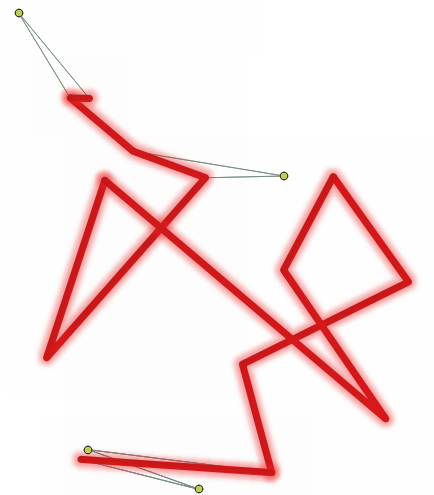

.. _fixgeometry_algorithms:

Fix Geometry
============

.. only:: html

   .. contents::
      :local:
      :depth: 1

.. _qgisfixgeometryangle:

Delete small angles
--------------------

Deletes vertices based on an error layer from the :ref:`qgischeckgeometryangle` algorithm.
When deletion of a vertex results in a duplicate vertex (when a spike vertex is deleted),
the duplicate vertex is deleted to keep a single vertex and preserve topology.

.. attention:: This algorithm removes the vertex at the reported small angles,
    generating new segments that may form a new small angle.

   Fixing reported errors on a line feature for angles lower than 15°.

.. seealso:: :ref:`qgischeckgeometryangle`

Parameters
..........

Basic parameters
................

.. list-table::
   :header-rows: 1
   :widths: 20 20 20 40
   :class: longtable

   * - Label
     - Name
     - Type
     - Description
   * - **Input layer**
     - ``INPUT``
     - [vector: line, polygon]
     - Layer with the geometries to fix, same as input in the check algorithm
   * - **Error layer**
     - ``ERRORS``
     - [vector: point]
     - Point layer with the errors location, generated by the check algorithm
   * - **Field of original feature unique identifier**
     - ``UNIQUE_ID``
     - [tablefield: any]
     - Field storing unique values for feature identification in input layer,
       as set in the check algorithm
   * - **Field of part index**
     - ``PART_IDX``
     - [tablefield: integer]
 
       Default: ``gc_partidx``
     - Field storing the erroneous feature's geometry part number.
   * - **Field of ring index**
     - ``RING_IDX``
     - [tablefield: integer]

       Default: ``gc_ringidx``
     - Field storing the erroneous feature's geometry ring number.
   * - **Field of vertex index**
     - ``VERTEX_IDX``
     - [tablefield: integer]

       Default: ``gc_vertidx``
     - Field storing the erroneous feature's geometry vertex number.
   * - **Small angle fixed layer**
     - ``OUTPUT``
     - [vector: same as input]

       Default: ``[Create temporary layer]``
     - Specification of the output layer containing fixed features.
       :ref:`One of <output_parameter_widget>`:

       .. include:: ../algs_include.rst
          :start-after: **layer_output_types**
          :end-before: **end_layer_output_types**

   * - **Report layer from fixing small angles**
     - ``REPORT``
     - [vector: point]

       Default: ``[Create temporary layer]``
     - Specification of the output layer containing the fixes location.
       :ref:`One of <output_parameter_widget>`:

       .. include:: ../algs_include.rst
          :start-after: **layer_output_types**
          :end-before: **end_layer_output_types**

Advanced parameters
...................

.. list-table::
   :header-rows: 1
   :widths: 20 20 20 40
   :class: longtable

   * - Label
     - Name
     - Type
     - Description
   * - **Tolerance**
     - ``TOLERANCE``
     - [numeric: integer]

       Default: 8
     - Numerical precision of geometric operations, given as an integer n,
       meaning that two vertices less than 10\ :sup:`-n` apart (in map units)
       are considered to be merged.

Outputs
.......

.. list-table::
   :header-rows: 1
   :widths: 20 20 20 40
   :class: longtable

   * - Label
     - Name
     - Type
     - Description
   * - **Report layer from fixing small angles**
     - ``REPORT``
     - [vector: point]
     - Output point layer representing the error locations and fix applied
       (the ID and name of the input layer, the ID, geometry part, ring and vertex index of the erroneous feature,
       x and y coordinates and value of the erroneous angle, the applied fix and its successfulness).
   * - **Small angle fixed layer**
     - ``OUTPUT``
     - [same as input]
     - Output layer with the geometry fix applied to the input features

Python code
...........

**Algorithm ID**: ``native:fixgeometryangle``

.. include:: ../algs_include.rst
  :start-after: **algorithm_code_section**
  :end-before: **end_algorithm_code_section**
