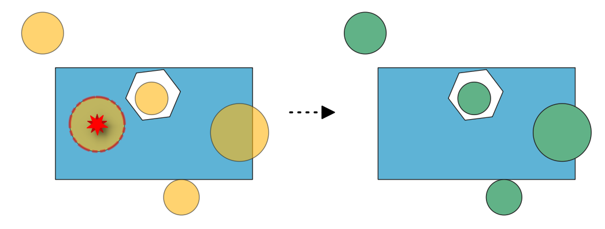
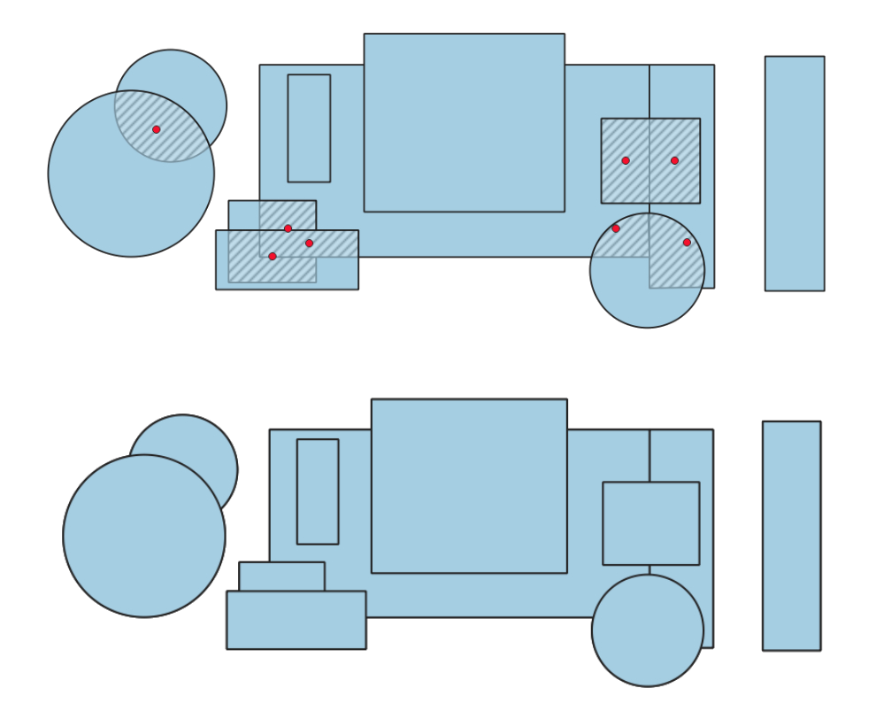
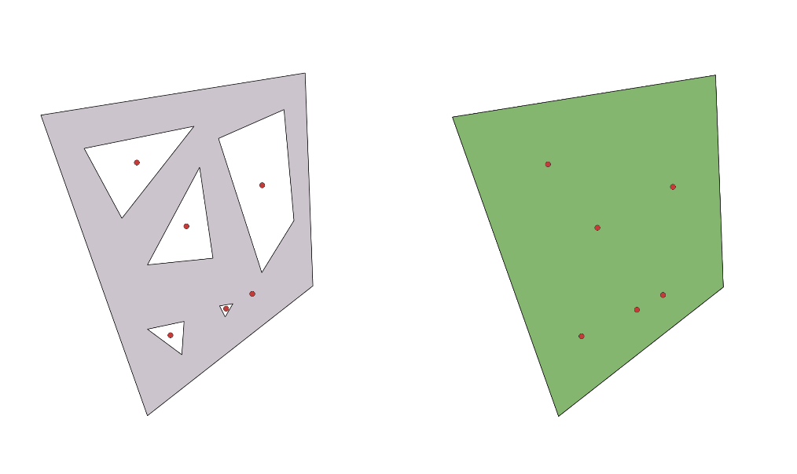
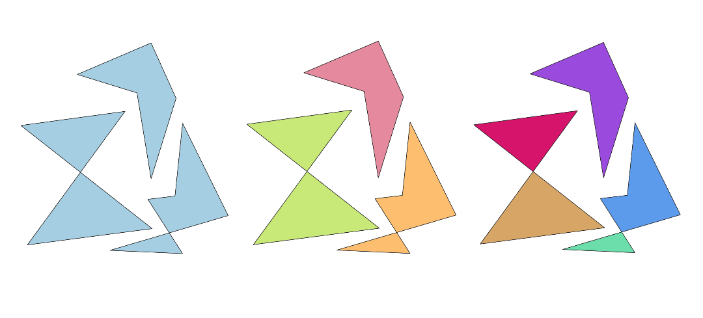

.. _fixgeometry_algorithms:

Fix Geometry
============

.. only:: html

   .. contents::
      :local:
      :depth: 1

.. _qgisfixgeometrymultipart:

Convert to strictly multipart
------------------------------

Converts multipart geometries that consists of only one geometry into singlepart geometries,
based on an error layer from the :ref:`qgischeckgeometrymultipart` algorithm.
Layer geometry type will not be changed and will remain multipart.

.. seealso:: :ref:`qgischeckgeometrymultipart`, :ref:`qgispromotetomulti`

Parameters
..........

Basic parameters
^^^^^^^^^^^^^^^^

.. list-table::
   :header-rows: 1
   :widths: 20 20 20 40
   :class: longtable

   * - Label
     - Name
     - Type
     - Description
   * - **Input layer**
     - ``INPUT``
     - [vector: line, polygon]
     - Layer with the geometries to fix, same as input in the check algorithm.
   * - **Error layer**
     - ``ERRORS``
     - [vector: point]
     - Point layer with the errors location, generated by the check algorithm.
   * - **Field of original feature unique identifier**
     - ``UNIQUE_ID``
     - [tablefield: any]
     - Field storing unique values for feature identification in input layer,
       as set in the check algorithm.
   * - **Strictly-multipart layer**
     - ``OUTPUT``
     - [vector: same as input]

       Default: ``[Create temporary layer]``
     - Specification of the output layer containing fixed features.
       :ref:`One of <output_parameter_widget>`:

       .. include:: ../algs_include.rst
          :start-after: **layer_output_types**
          :end-before: **end_layer_output_types**

   * - **Report layer from fixing multipart**
     - ``REPORT``
     - [vector: point]

       Default: ``[Create temporary layer]``
     - Specification of the output layer containing the centroids of the fixed geometries.
       :ref:`One of <output_parameter_widget>`:

       .. include:: ../algs_include.rst
          :start-after: **layer_output_types**
          :end-before: **end_layer_output_types**

Advanced parameters
^^^^^^^^^^^^^^^^^^^

.. list-table::
   :header-rows: 1
   :widths: 20 20 20 40
   :class: longtable

   * - Label
     - Name
     - Type
     - Description
   * - **Tolerance**
     - ``TOLERANCE``
     - [numeric: integer]

       Default: 8
     - Numerical precision of geometric operations, given as an integer n,
       meaning that two vertices less than 10\ :sup:`-n` apart (in map units)
       are considered to be merged.

Outputs
.......

.. list-table::
   :header-rows: 1
   :widths: 20 20 20 40
   :class: longtable

   * - Label
     - Name
     - Type
     - Description
   * - **Report layer from fixing multipart**
     - ``REPORT``
     - [vector: point]
     - Output point layer representing the error locations and fix applied.
       The output layer contains the following fields:

       - ``gc_layerid``: the ID of the input layer.
       - ``gc_layername``: the name of the input layer.
       - ``gc_partidx``
       - ``gc_ringidx``
       - ``gc_vertidx``
       - ``gc_errorx``: the x coordinate of the centroid of the multipart geometry that has only one part.
       - ``gc_errory``: the y coordinate of the centroid of the multipart geometry that has only one part.
       - ``gc_error``
       - ``report``: a text field describing the fix applied.
       - ``error_fixed``: a boolean field indicating whether the error was fixed.
       - ``UNIQUE_ID`` field: the unique ID of the input feature that is multipart but has only one part.
   * - **Strictly-multipart layer**
     - ``OUTPUT``
     - [vector: same as input]
     - Output layer with the geometry fix applied to the input features.
       The layer contains the same fields as in the input layer.

Python code
...........

**Algorithm ID**: ``native:fixgeometrymultipart``

.. include:: ../algs_include.rst
  :start-after: **algorithm_code_section**
  :end-before: **end_algorithm_code_section**

.. _qgisfixgeometryduplicatenodes:

Delete duplicated vertices
--------------------------

Deletes duplicated vertices from the input geometries, based on errors reported by the :ref:`qgischeckgeometryduplicatenodes` algorithm.

.. seealso:: :ref:`qgischeckgeometryduplicatenodes`, :ref:`qgisremoveduplicatevertices`

Parameters
..........

Basic parameters
^^^^^^^^^^^^^^^^

.. list-table::
   :header-rows: 1
   :widths: 20 20 20 40
   :class: longtable

   * - Label
     - Name
     - Type
     - Description
   * - **Input layer**
     - ``INPUT``
     - [vector: line, polygon]
     - Layer with the geometries to fix, same as input in the check algorithm.
   * - **Error layer**
     - ``ERRORS``
     - [vector: point]
     - Point layer with the errors location, generated by the check algorithm.
   * - **Field of original feature unique identifier**
     - ``UNIQUE_ID``
     - [tablefield: any]
     - Field storing unique values for feature identification in input layer,
       as set in the check algorithm.
   * - **Field of part index**
     - ``PART_IDX``
     - [tablefield: integer]

       Default: ``gc_partidx``
     - Field storing the erroneous feature's geometry part number.
   * - **Field of ring index**
     - ``RING_IDX``
     - [tablefield: integer]

       Default: ``gc_ringidx``
     - Field storing the erroneous feature's geometry ring number.
   * - **Field of vertex index**
     - ``VERTEX_IDX``
     - [tablefield: integer]

       Default: ``gc_vertidx``
     - Field storing the erroneous feature's geometry vertex number.
   * - **Fixed duplicate vertices layer**
     - ``OUTPUT``
     - [vector: same as input]

       Default: ``[Create temporary layer]``
     - Specification of the output layer containing fixed features.
       :ref:`One of <output_parameter_widget>`:

       .. include:: ../algs_include.rst
          :start-after: **layer_output_types**
          :end-before: **end_layer_output_types**

   * - **Report layer from fixing duplicate vertices**
     - ``REPORT``
     - [vector: point]

       Default: ``[Create temporary layer]``
     - Specification of the output layer containing the fixes location.
       :ref:`One of <output_parameter_widget>`:

       .. include:: ../algs_include.rst
          :start-after: **layer_output_types**
          :end-before: **end_layer_output_types**

Advanced parameters
^^^^^^^^^^^^^^^^^^^

.. list-table::
   :header-rows: 1
   :widths: 20 20 20 40
   :class: longtable

   * - Label
     - Name
     - Type
     - Description
   * - **Tolerance**
     - ``TOLERANCE``
     - [numeric: integer]

       Default: 8
     - Numerical precision of geometric operations, given as an integer n,
       meaning that two vertices less than 10\ :sup:`-n` apart (in map units)
       are considered to be merged.

Outputs
.......

.. list-table::
   :header-rows: 1
   :widths: 20 20 20 40
   :class: longtable

   * - Label
     - Name
     - Type
     - Description
   * - **Report layer from fixing duplicate vertices**
     - ``REPORT``
     - [vector: point]
     - Output point layer representing the error locations and fix applied.
       The output layer contains the following fields:

       - ``gc_layerid``: the ID of the input layer.
       - ``gc_layername``: the name of the input layer.
       - ``gc_partidx``: the index of the feature's geometry part containing the duplicate vertex.
       - ``gc_ringidx``: the index of the feature's geometry ring containing the duplicate vertex.
       - ``gc_vertidx``: the index of the duplicate vertex in the feature's geometry ring.
       - ``gc_errorx``: the x coordinate of the duplicate vertex.
       - ``gc_errory``: the y coordinate of the duplicate vertex.
       - ``gc_error``
       - ``report``: a text field describing the fix applied.
       - ``error_fixed``: a boolean field indicating whether the error was fixed.
       - ``UNIQUE_ID`` field: the unique ID of the input feature that has duplicate vertices.
   * - **Fixed duplicate vertices layer**
     - ``OUTPUT``
     - [vector: same as input]
     - Output layer with the geometry fix applied to the input features.
       The layer contains the same fields as in the input layer.

Python code
...........

**Algorithm ID**: ``native:fixgeometryduplicatenodes``

.. include:: ../algs_include.rst
  :start-after: **algorithm_code_section**
  :end-before: **end_algorithm_code_section**

.. _qgisfixgeometrydeletefeatures:

Delete features
---------------

Deletes error features based on an error layer from some check geometry algorithms, such as:

* :ref:`qgischeckgeometrycontained`
* :ref:`qgischeckgeometrydegeneratepolygons`
* :ref:`qgischeckgeometrysegmentlength`
* :ref:`qgischeckgeometryduplicate`

   Before and after deleting features inside a polygon.

.. seealso:: :ref:`qgisdeleteduplicategeometries`, :ref:`qgisdropgeometries`

Parameters
..........

Basic parameters
^^^^^^^^^^^^^^^^

.. list-table::
   :header-rows: 1
   :widths: 20 20 20 40
   :class: longtable

   * - Label
     - Name
     - Type
     - Description
   * - **Input layer**
     - ``INPUT``
     - [vector: geometry]
     - Layer with the geometries to fix, same as input in the check algorithm.
   * - **Error layer**
     - ``ERRORS``
     - [vector: point]
     - Point layer with the errors location, generated by the check algorithm.
   * - **Field of original feature unique identifier**
     - ``UNIQUE_ID``
     - [tablefield: any]
     - Field storing unique values for feature identification in input layer,
       as set in the check algorithm.
   * - **Cleaned layer**
     - ``OUTPUT``
     - [vector: same as input]

       Default: ``[Create temporary layer]``
     - Specification of the output layer containing fixed features.
       :ref:`One of <output_parameter_widget>`:

       .. include:: ../algs_include.rst
          :start-after: **layer_output_types**
          :end-before: **end_layer_output_types**

   * - **Report layer from deleting features**
     - ``REPORT``
     - [vector: point]

       Default: ``[Create temporary layer]``
     - Specification of the output layer containing the fixes location.
       :ref:`One of <output_parameter_widget>`:

       .. include:: ../algs_include.rst
          :start-after: **layer_output_types**
          :end-before: **end_layer_output_types**

Outputs
.......

.. list-table::
   :header-rows: 1
   :widths: 20 20 20 40
   :class: longtable

   * - Label
     - Name
     - Type
     - Description
   * - **Report layer from deleting features**
     - ``REPORT``
     - [vector: point]
     - Output point layer representing the error locations and fix applied.
       The output layer contains the following fields:

       - ``gc_layerid``: the ID of the input layer.
       - ``gc_layername``: the name of the input layer.
       - ``gc_partidx``
       - ``gc_ringidx``
       - ``gc_vertidx``
       - ``gc_errorx``: the x coordinate of the centroid of the erroneous geometry.
       - ``gc_errory``: the y coordinate of the centroid of the erroneous geometry.
       - ``gc_error``: the index of the feature where the error belongs.
       - ``report``: a text field describing the fix applied.
       - ``error_fixed``: a boolean field indicating whether the error was fixed.
       - ``UNIQUE_ID`` field: the unique ID of the input feature with the error.
   * - **Cleaned layer**
     - ``OUTPUT``
     - [vector: same as input]
     - Output layer with features removed based on detected errors.
       The layer contains the same fields as in the input layer.

Python code
...........

**Algorithm ID**: ``native:fixgeometrydeletefeatures``

.. include:: ../algs_include.rst
  :start-after: **algorithm_code_section**
  :end-before: **end_algorithm_code_section**

.. _qgisfixgeometryoverlap:

Delete overlaps
---------------

Deletes overlapping areas based on an error layer from the :ref:`qgischeckgeometryoverlap` algorithm.

   Before and after deleting overlapping areas.

.. seealso:: :ref:`qgischeckgeometryoverlap`

Parameters
..........

Basic parameters
^^^^^^^^^^^^^^^^

.. list-table::
   :header-rows: 1
   :widths: 20 20 20 40
   :class: longtable

   * - Label
     - Name
     - Type
     - Description
   * - **Input layer**
     - ``INPUT``
     - [vector: polygon]
     - Layer with the geometries to fix, same as input in the check algorithm.
   * - **Error layer**
     - ``ERRORS``
     - [vector: point]
     - Point layer with the errors location, generated by the check algorithm.
   * - **Field of original feature unique identifier**
     - ``UNIQUE_ID``
     - [tablefield: any]
     - Field storing unique values for feature identification in input layer,
       as set in the check algorithm.
   * - **Field of overlap feature unique identifier**
     - ``OVERLAP_FEATURE_UNIQUE_IDX``
     - [tablefield: any]
     - Field storing unique values for the overlapping feature identification in input layer,
       as set in the check algorithm.
   * - **Field of error value**
     - ``ERROR_VALUE_ID``
     - [tablefield: any]
     - Field storing the error value for each feature, as set in the check algorithm.
   * - **No-overlap layer**
     - ``OUTPUT``
     - [vector: polygon]

       Default: ``[Create temporary layer]``
     - Specification of the output layer containing fixed features.
       :ref:`One of <output_parameter_widget>`:

       .. include:: ../algs_include.rst
          :start-after: **layer_output_types**
          :end-before: **end_layer_output_types**

   * - **Report layer from fixing overlaps**
     - ``REPORT``
     - [vector: point]

       Default: ``[Create temporary layer]``
     - Specification of the output layer containing the fixes location.
       :ref:`One of <output_parameter_widget>`:

       .. include:: ../algs_include.rst
          :start-after: **layer_output_types**
          :end-before: **end_layer_output_types**

Advanced parameters
^^^^^^^^^^^^^^^^^^^

.. list-table::
   :header-rows: 1
   :widths: 20 20 20 40
   :class: longtable

   * - Label
     - Name
     - Type
     - Description
   * - **Tolerance**
     - ``TOLERANCE``
     - [numeric: integer]

       Default: 8
     - Numerical precision of geometric operations, given as an integer n,
       meaning that two vertices less than 10\ :sup:`-n` apart (in map units)
       are considered to be merged.

Outputs
.......

.. list-table::
   :header-rows: 1
   :widths: 20 20 20 40
   :class: longtable

   * - Label
     - Name
     - Type
     - Description
   * - **Report layer from fixing overlaps**
     - ``REPORT``
     - [vector: point]
     - Output point layer representing the error locations and fix applied.
       The output layer contains the following fields:

       - ``gc_layerid``: the ID of the input layer.
       - ``gc_layername``: the name of the input layer.
       - ``gc_errorx``: the x coordinate of the centroid of the overlapping area.
       - ``gc_errory``: the y coordinate of the centroid of the overlapping area.
       - ``gc_error``: the area of the overlapping geometry.
       - ``UNIQUE_ID`` field: the unique ID of the unique ID of an overlapped input feature.
       - ``gc_overlap_feature_{unique_id}``: the ``UNIQUE_ID`` field value for the other overlapping feature.
       - ``report``: a text field describing the fix applied or justifying the failure.
         Possible values are:

         * Remove overlapping area from neighboring polygon with shortest shared edge
         * Error is obsolete
       - ``error_fixed``: a boolean field indicating whether the error was fixed.
   * - **No-overlap layer**
     - ``OUTPUT``
     - [vector: polygon]
     - Output layer with input features edited.
       Overlapping areas reported as errors are removed.
       The layer contains the same fields as in the input layer.

Python code
...........

**Algorithm ID**: ``native:fixgeometryoverlap``

.. include:: ../algs_include.rst
  :start-after: **algorithm_code_section**
  :end-before: **end_algorithm_code_section**

.. _qgisfixgeometryangle:

Delete small angles
--------------------

Deletes vertices based on an error layer from the :ref:`qgischeckgeometryangle` algorithm.
When deletion of a vertex results in a duplicate vertex (when a spike vertex is deleted),
the duplicate vertex is deleted to keep a single vertex and preserve topology.

.. attention:: This algorithm removes the vertex at the reported small angles,
    generating new segments that may form a new small angle.

.. figure:: img/fix_geometry_angle.png
   :align: center

   Fixing reported errors on a line feature for angles lower than 15°.

.. seealso:: :ref:`qgischeckgeometryangle`

Parameters
..........

Basic parameters
^^^^^^^^^^^^^^^^

.. list-table::
   :header-rows: 1
   :widths: 20 20 20 40
   :class: longtable

   * - Label
     - Name
     - Type
     - Description
   * - **Input layer**
     - ``INPUT``
     - [vector: line, polygon]
     - Layer with the geometries to fix, same as input in the check algorithm
   * - **Error layer**
     - ``ERRORS``
     - [vector: point]
     - Point layer with the errors location, generated by the check algorithm
   * - **Field of original feature unique identifier**
     - ``UNIQUE_ID``
     - [tablefield: any]
     - Field storing unique values for feature identification in input layer,
       as set in the check algorithm
   * - **Field of part index**
     - ``PART_IDX``
     - [tablefield: integer]

       Default: ``gc_partidx``
     - Field storing the erroneous feature's geometry part number.
   * - **Field of ring index**
     - ``RING_IDX``
     - [tablefield: integer]

       Default: ``gc_ringidx``
     - Field storing the erroneous feature's geometry ring number.
   * - **Field of vertex index**
     - ``VERTEX_IDX``
     - [tablefield: integer]

       Default: ``gc_vertidx``
     - Field storing the erroneous feature's geometry vertex number.
   * - **Small angle fixed layer**
     - ``OUTPUT``
     - [vector: same as input]

       Default: ``[Create temporary layer]``
     - Specification of the output layer containing fixed features.
       :ref:`One of <output_parameter_widget>`:

       .. include:: ../algs_include.rst
          :start-after: **layer_output_types**
          :end-before: **end_layer_output_types**

   * - **Report layer from fixing small angles**
     - ``REPORT``
     - [vector: point]

       Default: ``[Create temporary layer]``
     - Specification of the output layer containing the fixes location.
       :ref:`One of <output_parameter_widget>`:

       .. include:: ../algs_include.rst
          :start-after: **layer_output_types**
          :end-before: **end_layer_output_types**

Advanced parameters
^^^^^^^^^^^^^^^^^^^

.. list-table::
   :header-rows: 1
   :widths: 20 20 20 40
   :class: longtable

   * - Label
     - Name
     - Type
     - Description
   * - **Tolerance**
     - ``TOLERANCE``
     - [numeric: integer]

       Default: 8
     - Numerical precision of geometric operations, given as an integer n,
       meaning that two vertices less than 10\ :sup:`-n` apart (in map units)
       are considered to be merged.

Outputs
.......

.. list-table::
   :header-rows: 1
   :widths: 20 20 20 40
   :class: longtable

   * - Label
     - Name
     - Type
     - Description
   * - **Report layer from fixing small angles**
     - ``REPORT``
     - [vector: point]
     - Output point layer representing the error locations and fix applied.
       The output layer contains the following fields:

       - ``gc_layerid``: the ID of the input layer.
       - ``gc_layername``: the name of the input layer.
       - ``gc_partidx``: the index of the feature's geometry part containing the small angle.
       - ``gc_ringidx``: the index of the feature's geometry ring containing the small angle.
       - ``gc_vertidx``: the index of the vertex with the small angle in the feature's geometry ring.
       - ``gc_errorx``: the x coordinate of the vertex with the small angle.
       - ``gc_errory``: the y coordinate of the vertex with the small angle.
       - ``gc_error``: the error angle value.
       - ``UNIQUE_ID`` field: the unique ID of the input feature with the small angle.
       - ``report``: a text field describing the fix applied or justifying the failure.
       - ``error_fixed``: a boolean field indicating whether the error was fixed.

   * - **Small angle fixed layer**
     - ``OUTPUT``
     - [same as input]
     - Output layer with the geometry fix applied to the input features
       The layer contains the same fields as in the input layer.

Python code
...........

**Algorithm ID**: ``native:fixgeometryangle``

.. include:: ../algs_include.rst
  :start-after: **algorithm_code_section**
  :end-before: **end_algorithm_code_section**

.. _qgisfixgeometryhole:

Fill holes
--------------------

Deletes holes in polygon geometries based on an error layer from the
:ref:`qgischeckgeometryhole` algorithm.

   Before and after fixing holes in a polygon feature.

.. seealso:: :ref:`qgischeckgeometryhole`, :ref:`qgisdeleteholes`

Parameters
..........

Basic parameters
^^^^^^^^^^^^^^^^

.. list-table::
   :header-rows: 1
   :widths: 20 20 20 40
   :class: longtable

   * - Label
     - Name
     - Type
     - Description
   * - **Input layer**
     - ``INPUT``
     - [vector: line, polygon]
     - Layer with the geometries to fix, same as input in the check algorithm
   * - **Error layer**
     - ``ERRORS``
     - [vector: point]
     - Point layer with the errors location, generated by the check algorithm
   * - **Field of original feature unique identifier**
     - ``UNIQUE_ID``
     - [tablefield: any]
     - Field storing unique values for feature identification in input layer,
       as set in the check algorithm
   * - **Field of part index**
     - ``PART_IDX``
     - [tablefield: integer]
       Default: ``gc_partidx``
     - Field storing the erroneous feature's geometry part number.
   * - **Field of ring index**
     - ``RING_IDX``
     - [tablefield: integer]

       Default: ``gc_ringidx``
     - Field storing the erroneous feature's geometry ring number.
   * - **Field of vertex index**
     - ``VERTEX_IDX``
     - [tablefield: integer]

       Default: ``gc_vertidx``
     - Field storing the erroneous feature's geometry vertex number.
   * - **Holes-filled layer**
     - ``OUTPUT``
     - [vector: polygon]

       Default: ``[Create temporary layer]``
     - Specification of the output layer containing fixed features.
       :ref:`One of <output_parameter_widget>`:

       .. include:: ../algs_include.rst
          :start-after: **layer_output_types**
          :end-before: **end_layer_output_types**

   * - **Report layer from fixing holes**
     - ``REPORT``
     - [vector: point]

       Default: ``[Create temporary layer]``
     - Specification of the output layer containing the fixes location.
       :ref:`One of <output_parameter_widget>`:

       .. include:: ../algs_include.rst
          :start-after: **layer_output_types**
          :end-before: **end_layer_output_types**

Advanced parameters
^^^^^^^^^^^^^^^^^^^

.. list-table::
   :header-rows: 1
   :widths: 20 20 20 40
   :class: longtable

   * - Label
     - Name
     - Type
     - Description
   * - **Tolerance**
     - ``TOLERANCE``
     - [numeric: integer]

       Default: 8
     - Numerical precision of geometric operations, given as an integer n,
       meaning that two vertices less than 10\ :sup:`-n` apart (in map units)
       are considered to be merged.

Outputs
.......

.. list-table::
   :header-rows: 1
   :widths: 20 20 20 40
   :class: longtable

   * - Label
     - Name
     - Type
     - Description
   * - **Report layer from fixing holes**
     - ``REPORT``
     - [vector: point]
     - Output point layer representing the error locations and fix applied.
       The output layer contains the following fields:

       - ``gc_layerid``: the ID of the input layer.
       - ``gc_layername``: the name of the input layer.
       - ``gc_partidx``: the index of the feature's geometry part containing the hole.
       - ``gc_ringidx``: the index of the feature's geometry ring containing the hole.
       - ``gc_vertidx``
       - ``gc_errorx``: the x coordinate of the centroid of the hole.
       - ``gc_errory``: the y coordinate of the centroid of the hole.
       - ``gc_error``
       - ``UNIQUE_ID`` field: the unique ID of the input feature that has a hole.
       - ``report``: a text field describing the fix applied or justifying the failure.
       - ``error_fixed``: a boolean field indicating whether the error was fixed.

   * - **Holes-filled layer**
     - ``OUTPUT``
     - [vector: polygon]
     - Output layer of polygons without holes.
       The layer contains the same fields as in the input layer.

Python code
...........

**Algorithm ID**: ``native:fixgeometryhole``

.. include:: ../algs_include.rst
  :start-after: **algorithm_code_section**
  :end-before: **end_algorithm_code_section**

.. _qgisfixgeometryselfintersection:

Split self-intersecting geometries
----------------------------------

Splits self-intersecting geometries based on an error layer from the
:ref:`qgischeckgeometryselfintersections` algorithm.

   Comparison between input layer, multi-object fix, and single-object fix geometries.

.. seealso:: :ref:`qgischeckgeometryselfintersections`

Parameters
..........

Basic parameters
^^^^^^^^^^^^^^^^

.. list-table::
   :header-rows: 1
   :widths: 20 20 20 40
   :class: longtable

   * - Label
     - Name
     - Type
     - Description
   * - **Input layer**
     - ``INPUT``
     - [vector: line, polygon]
     - Layer with the geometries to fix, same as input in the check algorithm
   * - **Error layer**
     - ``ERRORS``
     - [vector: point]
     - Point layer with the errors location, generated by the check algorithm
   * - **Method**
     - ``METHOD``
     - [enumeration]

     - Method to apply to the self-intersecting geometries:

       * 0 -- ``Split feature into a multi-object feature``:
         splits the self-intersecting geometry into multiple parts stored in a single multipart feature.
       * 1 -- ``Split feature into multiple single-object features``:
         splits the self-intersecting geometry into multiple parts, each part stored in a separate feature.
   * - **Field of original feature unique identifier**
     - ``UNIQUE_ID``
     - [tablefield: any]
     - Field storing unique values for feature identification in input layer,
       as set in the check algorithm
   * - **Field of part index**
     - ``PART_IDX``
     - [tablefield: integer]

       Default: ``gc_partidx``
     - Field storing the erroneous feature's geometry part number.
   * - **Field of ring index**
     - ``RING_IDX``
     - [tablefield: integer]

       Default: ``gc_ringidx``
     - Field storing the erroneous feature's geometry ring number.
   * - **Field of vertex index**
     - ``VERTEX_IDX``
     - [tablefield: integer]

       Default: ``gc_vertidx``
     - Field storing the erroneous feature's geometry vertex number.
   * - **Field of segment 1**
     - ``SEGMENT_1``
     - [tablefield: integer]

       Default: ``gc_segment_1``
     - Field storing the number of the first segment involved in the erroneous intersection.
   * - **Field of segment 2**
     - ``SEGMENT_2``
     - [tablefield: integer]

       Default: ``gc_segment_2``
     - Field storing the number of the second segment involved in the erroneous intersection.
   * - **Self-intersections fixed layer**
     - ``OUTPUT``
     - [vector: same as input]

       Default: ``[Create temporary layer]``
     - Specification of the output layer containing fixed features.
       :ref:`One of <output_parameter_widget>`:

       .. include:: ../algs_include.rst
          :start-after: **layer_output_types**
          :end-before: **end_layer_output_types**

   * - **Report layer from fixing self-intersections**
     - ``REPORT``
     - [vector: point]

       Default: ``[Create temporary layer]``
     - Specification of the output layer containing the fixes location.
       :ref:`One of <output_parameter_widget>`:

       .. include:: ../algs_include.rst
          :start-after: **layer_output_types**
          :end-before: **end_layer_output_types**

Advanced parameters
^^^^^^^^^^^^^^^^^^^

.. list-table::
   :header-rows: 1
   :widths: 20 20 20 40
   :class: longtable

   * - Label
     - Name
     - Type
     - Description
   * - **Tolerance**
     - ``TOLERANCE``
     - [numeric: integer]

       Default: 8
     - Numerical precision of geometric operations, given as an integer n,
       meaning that two vertices less than 10\ :sup:`-n` apart (in map units)
       are considered to be merged.

Outputs
.......

.. list-table::
   :header-rows: 1
   :widths: 20 20 20 40
   :class: longtable

   * - Label
     - Name
     - Type
     - Description
   * - **Report layer from fixing self-intersections**
     - ``REPORT``
     - [vector: point]
     - Output point layer representing the error locations and fix applied.
       The output layer contains the following fields:

       - ``gc_layerid``: the ID of the input layer.
       - ``gc_layername``: the name of the input layer.
       - ``gc_partidx``: the index of the feature's geometry part where the self-intersection occurs.
       - ``gc_ringidx``: the index of the feature's geometry ring where the self-intersection occurs.
       - ``gc_vertidx``
       - ``gc_errorx``: the x coordinate of the self-intersection.
       - ``gc_errory``: the y coordinate of the self-intersection.
       - ``gc_error``
       - ``gc_segment_1``: the index of the first segment involved in the intersection.
       - ``gc_segment_2``: the index of the second segment involved in the intersection.
       - ``UNIQUE_ID`` field: the unique ID of the self-intersecting input feature.
       - ``report``: a text field describing the fix applied.
       - ``error_fixed``: a boolean field indicating whether the error was fixed.
   * - **Self-intersections fixed layer**
     - ``OUTPUT``
     - [vector: same as input]
     - Output layer with the geometry fix applied to the input features.
       The layer contains the same fields as in the input layer.

Python code
...........

**Algorithm ID**: ``native:fixgeometryselfintersection``

.. include:: ../algs_include.rst
  :start-after: **algorithm_code_section**
  :end-before: **end_algorithm_code_section**
