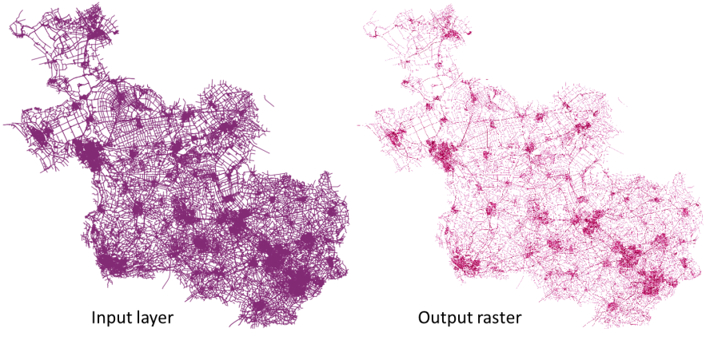

Interpolation
=============

.. only:: html

   .. contents::
      :local:
      :depth: 1

.. _qgisheatmapkerneldensityestimation:

Heatmap (kernel density estimation)
-----------------------------------
Creates a density (heatmap) raster of an input point vector layer
using kernel density estimation.

The density is calculated based on the number of points in a location,
with larger numbers of clustered points resulting in larger values.
Heatmaps allow easy identification of *hotspots* and clustering of
points.

Parameters
..........

.. list-table::
   :header-rows: 1
   :widths: 20 20 20 40
   :class: longtable

   * - Label
     - Name
     - Type
     - Description
   * - **Point layer**
     - ``INPUT``
     - [vector: point]
     - Point vector layer to use for the heatmap
   * - **Radius**
     - ``RADIUS``
     - [number]

       Default: 100.0
     - Heatmap search radius (or kernel bandwidth) in map units.
       The radius specifies the distance around a point at which the
       influence of the point will be felt.
       Larger values result in greater smoothing, but smaller values
       may show finer details and variation in point density.
   * - **Output raster size**
     - ``PIXEL_SIZE``
     - [number]

       Default: 0.1
     - Pixel size of the output raster layer in layer units.
       
       In the GUI, the size can be specified by the number of rows
       (``Number of rows``) / columns (``Number of columns``) **or**
       the pixel size( ``Pixel Size X`` / ``Pixel Size Y``).
       Increasing the number of rows or columns will decrease the cell
       size and increase the file size of the output raster.
       The values in ``Rows``, ``Columns``, ``Pixel Size X`` and
       ``Pixel Size Y`` will be updated simultaneously - doubling the
       number of rows will double the number of columns, and the cell
       size will be halved.
       The extent of the output raster will remain the same
       (approximately).
   * - **Radius from field**

       Optional
     - ``RADIUS_FIELD``
     - [tablefield: numeric]
     - Sets the search radius for each feature from an attribute
       field in the input layer.
   * - **Weight from field**

       Optional
     - ``WEIGHT_FIELD``
     - [tablefield: numeric]
     - Allows input features to be weighted by an attribute field.
       This can be used to increase the influence certain features
       have on the resultant heatmap.
   * - **Kernel shape**
     - ``KERNEL``
     - [enumeration]

       Default: *0*
     - Controls the rate at which the influence of a point decreases
       as the distance from the point increases.
       Different kernels decay at different rates, so a triweight
       kernel gives features greater weight for distances closer to
       the point then the Epanechnikov kernel does.
       Consequently, triweight results in “sharper” hotspots and
       Epanechnikov results in “smoother” hotspots.
       
       There are many shapes available (please see the
       `Wikipedia page <https://en.wikipedia.org/wiki/Kernel_(statistics)#Kernel_functions_in_common_use>`_
       for further information):

       * 0 --- Quartic
       * 1 --- Triangular
       * 2 --- Uniform
       * 3 --- Triweight
       * 4 --- Epanechnikov

   * - **Decay ratio (Triangular kernels only)**

       Optional
     - ``DECAY``
     - [number]

       Default: *0.0*
     - Can be used with Triangular kernels to further control
       how heat from a feature decreases with distance from the
       feature.

       * A value of 0 (=minimum) indicates that the heat will
         be concentrated in the center of the given radius and
         completely extinguished at the edge.
       * A value of 0.5 indicates that pixels at the edge of
         the radius will be given half the heat as pixels at
         the center of the search radius.
       * A value of 1 means the heat is spread evenly over
         the whole search radius circle.
         (This is equivalent to the ‘Uniform’ kernel.)
       * A value greater than 1 indicates that the heat is
         higher towards the edge of the search radius than at
         the center.

   * - **Output value scaling**
     - ``OUTPUT_VALUE``
     - [enumeration]

       Default: *Raw*
     - Allow to change the values of the output heatmap raster.
       One of:

       * 0 --- Raw
       * 1 --- Scaled

   * - **Heatmap**
     - ``OUTPUT``
     - [raster]
       
       Default: ``[Save to temporary file]``
     - Specify the output raster layer with kernel density values.
       One of:

       .. include:: ../algs_include.rst
          :start-after: **file_output_types**
          :end-before: **end_file_output_types**

Outputs
.......

.. list-table::
   :header-rows: 1
   :widths: 20 20 20 40
   :class: longtable

   * - Label
     - Name
     - Type
     - Description
   * - **Heatmap**
     - ``OUTPUT``
     - [raster]
     - Raster layer with kernel density values

Example: Creating a Heatmap
...........................
For the following example, we will use the ``airports`` vector point
layer from the QGIS sample dataset (see :ref:`label_sampledata`).
Another excellent QGIS tutorial on making heatmaps can be found at
`http://qgistutorials.com
<http://www.qgistutorials.com/en/docs/creating_heatmaps.html>`_.

In :numref:`Figure_Heatmap_data_processing`, the airports of Alaska are shown.

.. _figure_heatmap_data_processing:

.. figure:: img/heatmap_start.png
   :align: center

   Airports of Alaska

#. Open the :guilabel:`Heatmap (Kernel Density Estimation)` algorithm
   from the QGIS :guilabel:`Interpolation` group
#. In the :guilabel:`Point layer` |selectString| field, select
   ``airports`` from the list of point layers loaded in the current
   project.
#. Change the :guilabel:`Radius` to ``1000000`` meters.
#. Change the :guilabel:`Pixel size X` to ``1000``.
   The :guilabel:`Pixel size Y`, :guilabel:`Rows` and
   :guilabel:`Columns` will be automatically updated.
#. Click on :guilabel:`Run` to create and load the airports heatmap
   (see :numref:`Figure_Heatmap_created_processing`).

.. _figure_heatmap_settings_processing:

.. figure:: img/heatmap_dialog.png
   :align: center

   The Heatmap Dialog

QGIS will generate the heatmap and add it to your map window.
By default, the heatmap is shaded in greyscale, with lighter areas
showing higher concentrations of airports.
The heatmap can now be styled in QGIS to improve its appearance.

.. _figure_heatmap_created_processing:

.. figure:: img/heatmap_loaded_grey.png
   :align: center

   The heatmap after loading looks like a grey surface

#. Open the properties dialog of the ``heatmap_airports`` layer
   (select the layer ``heatmap_airports``, open the context menu with
   the right mouse button and select :guilabel:`Properties`).
#. Select the :guilabel:`Symbology` tab.
#. Change the :guilabel:`Render type` |selectString| to
   'Singleband pseudocolor'.
#. Select a suitable :guilabel:`Color ramp` |selectString|, for
   instance ``YlOrRd``.
#. Click the :guilabel:`Classify` button.
#. Press :guilabel:`OK` to update the layer.

The final result is shown in :numref:`Figure_Heatmap_styled_processing`.

.. _figure_heatmap_styled_processing:

.. figure:: img/heatmap_loaded_colour.png
   :align: center

   Styled heatmap of airports of Alaska

.. _Wikipedia: https://en.wikipedia.org/wiki/Kernel_(statistics)#Kernel_functions_in_common_use

Python code
...........

**Algorithm ID**: ``qgis:heatmapkerneldensityestimation``

.. include:: ../algs_include.rst
  :start-after: **algorithm_code_section**
  :end-before: **end_algorithm_code_section**

.. _qgisidwinterpolation:

IDW Interpolation
-----------------
Generates an Inverse Distance Weighted (IDW) interpolation of a point
vector layer.

Sample points are weighted during interpolation such that the
influence of one point relative to another declines with distance from
the unknown point you want to create.

The IDW interpolation method also has some disadvantages: the quality
of the interpolation result can decrease, if the distribution of
sample data points is uneven.

Furthermore, maximum and minimum values in the interpolated surface
can only occur at sample data points.

Parameters
..........

.. list-table::
   :header-rows: 1
   :widths: 20 20 20 40
   :class: longtable

   * - Label
     - Name
     - Type
     - Description

   * - **Input layer(s)**
     - ``INTERPOLATION_DATA``
     - [string]
     - Vector layer(s) and field(s) to use for the interpolation,
       coded
       in a string (see the ``ParameterInterpolationData`` class in
       :source:`InterpolationWidgets <python/plugins/processing/algs/qgis/ui/InterpolationWidgets.py>`
       for more details).

       The following GUI elements are provided to compose the
       interpolation data string:

       * **Vector layer** [vector: any]
       * **Interpolation attribute** [tablefield: numeric]:
         Attribute to use in the interpolation
       * **Use Z-coordinate for interpolation** [boolean]:
         Uses the layer's stored Z values (Default: False)

       For each of the added layer-field combinations, a type can
       be chosen:

       * :guilabel:`Points`
       * :guilabel:`Structured lines`
       * :guilabel:`Break lines`

       In the string, the layer-field elements are separated by
       ``'::|::'``.
       The sub-elements of the layer-field elements are separated by
       ``'::~::'``.
   * - **Distance coefficient P**
     - ``DISTANCE_COEFFICIENT``
     - [number]

       Default: 2.0
     - Sets the distance coefficient for the interpolation.
       Minimum: 0.0, maximum: 100.0.
   * - **Extent (xmin, xmax, ymin, ymax)**
     - ``EXTENT``
     - [extent]
     - Extent of the output raster layer.

       .. include:: ../algs_include.rst
          :start-after: **extent_options**
          :end-before: **end_extent_options**

   * - **Output raster size**
     - ``PIXEL_SIZE``
     - [number]

       Default: 0.1
     - Pixel size of the output raster layer in layer units.
       
       In the GUI, the size can be specified by the number of rows
       (``Number of rows``) / columns (``Number of columns``) **or**
       the pixel size( ``Pixel Size X`` / ``Pixel Size Y``).
       Increasing the number of rows or columns will decrease the cell
       size and increase the file size of the output raster.
       The values in ``Rows``, ``Columns``, ``Pixel Size X`` and
       ``Pixel Size Y`` will be updated simultaneously - doubling the
       number of rows will double the number of columns, and the cell
       size will be halved.
       The extent of the output raster will remain the same
       (approximately).
   * - **Interpolated**
     - ``OUTPUT``
     - [raster]
       
       Default: ``[Save to temporary file]``
     - Raster layer of interpolated values.
       One of:

       .. include:: ../algs_include.rst
          :start-after: **file_output_types**
          :end-before: **end_file_output_types**

Outputs
.......

.. list-table::
   :header-rows: 1
   :widths: 20 20 20 40
   :class: longtable

   * - Label
     - Name
     - Type
     - Description
   * - **Interpolated**
     - ``OUTPUT``
     - [raster]
     - Raster layer of interpolated values

Python code
...........

**Algorithm ID**: ``qgis:idwinterpolation``

.. include:: ../algs_include.rst
  :start-after: **algorithm_code_section**
  :end-before: **end_algorithm_code_section**

.. _qgislinedensity:

Line Density
-----------------------

Calculates for each raster cell, the density measure of linear
features within a circular neighbourhood. This measure is obtained by
summing all the line segments intersecting the circular neighbourhood
and dividing this sum by the area of such neighbourhood. 
A weighting factor can be applied to the line segments. 

  
  Line density example. Input layer source: Roads Overijssel - The
  Netherlands (OSM).

Parameters
..........

.. list-table::
   :header-rows: 1
   :widths: 20 20 20 40
   :class: longtable

   * - Label
     - Name
     - Type
     - Description
   * - **Input line layer**
     - ``INPUT``
     - [vector: any]
     - Input vector layer containing line features
   * - **Weight field**
     - ``WEIGHT``
     - [number]
     - Field of the layer containing the weight factor to use during
       the calculation
   * - **Search Radius**
     - ``RADIUS``
     - [number]

       Default: 10
     - Radius of the circular neighbourhood. Units can be specified
       here.
   * - **Pixel size**
     - ``PIXEL_SIZE``
     - [number]

       Default: 10
     - Pixel size of the output raster layer in layer units.
       The raster has square pixels.
   * - **Line density raster**
     - ``OUTPUT``
     - [raster]

       Default: ``[Save to temporary file]``
     - The output as a raster layer. One of:

       .. include:: ../algs_include.rst
          :start-after: **file_output_types**
          :end-before: **end_file_output_types**

Outputs
.......

.. list-table::
   :header-rows: 1
   :widths: 20 20 20 40
   :class: longtable

   * - Label
     - Name
     - Type
     - Description
   * - **Line density raster**
     - ``OUTPUT``
     - [raster]
     - The output line density raster layer.

Python code
...........

**Algorithm ID**: ``native:linedensity``

.. include:: ../algs_include.rst
  :start-after: **algorithm_code_section**
  :end-before: **end_algorithm_code_section**

.. _qgistininterpolation:

TIN Interpolation
-----------------
Generates a Triangulated Irregular Network (TIN) interpolation of a
point vector layer.

With the TIN method you can create a surface formed by triangles of
nearest neighbor points.
To do this, circumcircles around selected sample points are created
and their intersections are connected to a network of non overlapping
and as compact as possible triangles.
The resulting surfaces are not smooth.

The algorithm creates both the raster layer of the interpolated values
and the vector line layer with the triangulation boundaries.

Parameters
..........

.. list-table::
   :header-rows: 1
   :widths: 20 20 20 40
   :class: longtable

   * - Label
     - Name
     - Type
     - Description

   * - **Input layer(s)**
     - ``INTERPOLATION_DATA``
     - [string]
     - Vector layer(s) and field(s) to use for the interpolation,
       coded in a string (see the ``ParameterInterpolationData``
       class in
       :source:`InterpolationWidgets <python/plugins/processing/algs/qgis/ui/InterpolationWidgets.py>`
       for more details).

       The following GUI elements are provided to compose the
       interpolation data string:

       * **Vector layer** [vector: any]
       * **Interpolation attribute** [tablefield: numeric]:
         Attribute to use in the interpolation
       * **Use Z-coordinate for interpolation** [boolean]:
         Uses the layer's stored Z values (Default: False)

       For each of the added layer-field combinations, a type can
       be chosen:

       * :guilabel:`Points`
       * :guilabel:`Structured lines`
       * :guilabel:`Break lines`

       In the string, the layer-field elements are separated by
       ``'::|::'``.
       The sub-elements of the layer-field elements are separated by
       ``'::~::'``.
   * - **Interpolation method**
     - ``METHOD``
     - [enumeration]

       Default: 0
     - Set the interpolation method to be used. One of:
       
       * :guilabel:`Linear`
       * :guilabel:`Clough-Toucher (cubic)`
     
   * - **Extent (xmin, xmax, ymin, ymax)**
     - ``EXTENT``
     - [extent]
     - Extent of the output raster layer.

       .. include:: ../algs_include.rst
          :start-after: **extent_options**
          :end-before: **end_extent_options**

   * - **Output raster size**
     - ``PIXEL_SIZE``
     - [number]

       Default: 0.1
     - Pixel size of the output raster layer in layer units.
       
       In the GUI, the size can be specified by the number of rows
       (``Number of rows``) / columns (``Number of columns``) **or**
       the pixel size( ``Pixel Size X`` / ``Pixel Size Y``).
       Increasing the number of rows or columns will decrease the cell
       size and increase the file size of the output raster.
       The values in ``Rows``, ``Columns``, ``Pixel Size X`` and
       ``Pixel Size Y`` will be updated simultaneously - doubling the
       number of rows will double the number of columns, and the cell
       size will be halved.
       The extent of the output raster will remain the same
       (approximately).       
   * - **Interpolated**
     - ``OUTPUT``
     - [raster]

       Default: ``[Save to temporary file]``
     - The output TIN interpolation as a raster layer. One of:

       .. include:: ../algs_include.rst
          :start-after: **file_output_types**
          :end-before: **end_file_output_types**

   * - **Triangulation**
     - ``TRIANGULATION``
     - [vector: line]

       Default: ``[Skip output]``
     - The output TIN as a vector layer. One of:

       .. include:: ../algs_include.rst
          :start-after: **layer_output_types_skip**
          :end-before: **end_layer_output_types_skip**

Outputs
.......

.. list-table::
   :header-rows: 1
   :widths: 20 20 20 40
   :class: longtable

   * - Label
     - Name
     - Type
     - Description
   * - **Interpolated**
     - ``OUTPUT``
     - [raster]
     - The output TIN interpolation as a raster layer
   * - **Triangulation**
     - ``TRIANGULATION``
     - [vector: line]
     - The output TIN as a vector layer.

Python code
...........

**Algorithm ID**: ``qgis:tininterpolation``

.. include:: ../algs_include.rst
  :start-after: **algorithm_code_section**
  :end-before: **end_algorithm_code_section**

.. Substitutions definitions - AVOID EDITING PAST THIS LINE
   This will be automatically updated by the find_set_subst.py script.
   If you need to create a new substitution manually,
   please add it also to the substitutions.txt file in the
   source folder.

.. |selectString| image:: /static/common/selectstring.png
   :width: 2.5em
