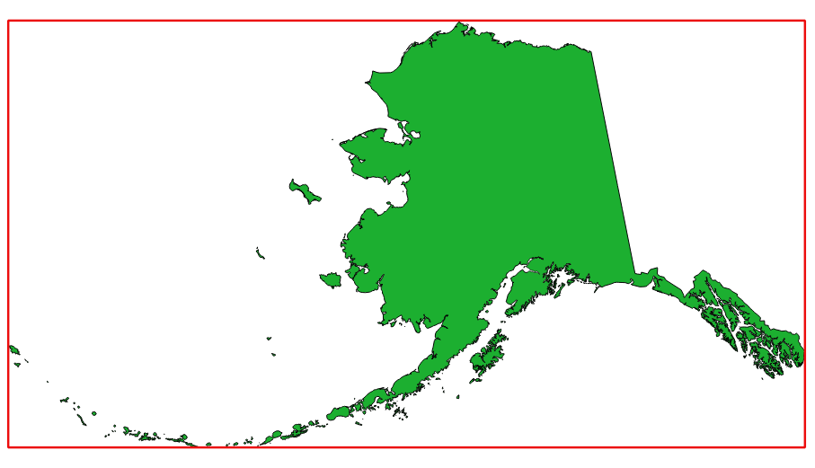

Layer tools
===========

.. only:: html

   .. contents::
      :local:
      :depth: 1

.. _qgisexportlayersinformation:

Export layer(s) information
---------------------------

Creates a polygon layer with features corresponding to the extent of selected layer(s).

Additional layer details (CRS, provider name, file path, layer name, subset filter,
abstract and attribution) are attached as attributes to each feature.

Parameters
..........

.. list-table::
   :header-rows: 1
   :widths: 20 20 20 40

   * - Label
     - Name
     - Type
     - Description
   * - **Input layers**
     - ``LAYERS``
     - [vector: any][list]
     - Input vector layers to get information on.
   * - **Output**
     - ``OUTPUT``
     - [vector: polygon]

       Default: ``[Create temporary layer]``
     - Specification of the output layer with information. One of:

       .. include:: ../algs_include.rst
          :start-after: **layer_output_types**
          :end-before: **end_layer_output_types**

Outputs
.......

.. list-table::
   :header-rows: 1
   :widths: 20 20 20 40

   * - Label
     - Name
     - Type
     - Description
   * - **Output**
     - ``OUTPUT``
     - [vector: polygon]
     - Polygon vector layer showing extent of input layers and associated information
       in attributes.

Python code
...........

**Algorithm ID**: ``native:exportlayersinformation``

.. include:: ../algs_include.rst
  :start-after: **algorithm_code_section**
  :end-before: **end_algorithm_code_section**

.. _qgisexporttospreadsheet:

Export to spreadsheet
---------------------

Exports the attributes of a selection of vector layers into a spreadsheet document
or optionally appends them to an existing spreadsheet as additional sheets. 

Parameters
..........

.. list-table::
   :header-rows: 1
   :widths: 20 20 20 40

   * - Label
     - Name
     - Type
     - Description
   * - **Input layers**
     - ``LAYERS``
     - [vector: any][list]
     - Input vector layers. The output spreadsheet will consist of a sheet,
       for each layer, that contains the attributes of this layer.
   * - **Use field aliases as column headings**
     - ``USE_ALIAS``
     - [boolean]

       Default: False
     - Use the field aliases from the attribute table for the spreadsheet.
   * - **Export formatted values instead of raw values**
     - ``FORMATTED_VALUES``
     - [boolean]

       Default: False
     - If ``True``, exports the formatted, human readable values (e.g., from a :ref:`value map
       or value relation <edit_widgets>`) to the spreadsheet.
   * - **Overwrite existing spreadsheet**
     - ``OVERWRITE``
     - [boolean]

       Default: True
     - If the specified spreadsheet exists, setting this option to ``True`` will overwrite the existing spreadsheet.
       If this option is ``False`` and the spreadsheet exists, the layers will be appended as additional sheets.

   * - **Destination spreadsheet**
     - ``OUTPUT``
     - [file]

       Default: ``[Save to temporary file]``
     - Output spreadsheet with a sheet for every layer. One of:

       .. include:: ../algs_include.rst
          :start-after: **file_output_types**
          :end-before: **end_file_output_types**

Outputs
.......

.. list-table::
   :header-rows: 1
   :widths: 20 20 20 40

   * - Label
     - Name
     - Type
     - Description
   * - **Destination spreadsheet**
     - ``OUTPUT``
     - [file]
     - Spreadsheet with a sheet for every layer.
   * - **Layers within spreadsheet**
     - ``OUTPUT_LAYERS``
     - [list]
     - The list of sheets added to the spreadsheet.

Python code
...........

**Algorithm ID**: ``native:exporttospreadsheet``

.. include:: ../algs_include.rst
  :start-after: **algorithm_code_section**
  :end-before: **end_algorithm_code_section**

.. _qgispolygonfromlayerextent:

Extract layer extent
--------------------

Generates a vector layer with the minimum bounding box (rectangle with
N-S orientation) that covers all the input features.

The output layer contains a single bounding box for the whole input
layer.

   In red the bounding box of the source layer

**Default menu**: :menuselection:`Vector --> Research Tools`

Parameters
..........

.. list-table::
   :header-rows: 1
   :widths: 20 20 20 40

   * - Label
     - Name
     - Type
     - Description
   * - **Layer**
     - ``INPUT``
     - [layer]
     - Input layer
   * - **Extent**
     - ``OUTPUT``
     - [vector: polygon]

       Default: ``[Create temporary layer]``
     - Specify the polygon vector layer for the output extent.
       One of:

       .. include:: ../algs_include.rst
          :start-after: **layer_output_types**
          :end-before: **end_layer_output_types**

Outputs
.......
.. list-table::
   :header-rows: 1
   :widths: 20 20 20 40

   *  - Label
      - Name
      - Type
      - Description
   *  - **Extent**
      - ``OUTPUT``
      - [vector: polygon]
      - Output (polygon) vector layer with the extent
        (minimum bounding box)

Python code
...........

**Algorithm ID**: ``qgis:polygonfromlayerextent``

.. include:: ../algs_include.rst
  :start-after: **algorithm_code_section**
  :end-before: **end_algorithm_code_section**
