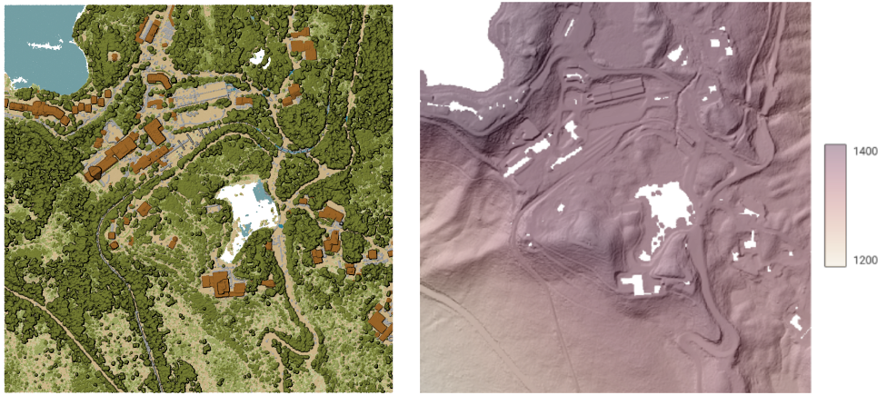
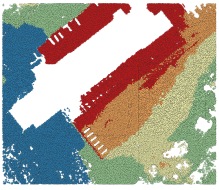

Point Cloud Conversion
======================

.. only:: html

   .. contents::
      :local:
      :depth: 1

.. _pdalconvertformat:

Convert format
--------------

Converts a point cloud to a different file format, e.g. creates a compressed :file:`.LAZ`.

Parameters
..........

.. list-table::
   :header-rows: 1
   :widths: 20 20 20 40

   * - Label
     - Name
     - Type
     - Description
   * - **Input layer**
     - ``INPUT``
     - [point cloud]
     - Input point cloud layer to convert
   * - **Converted**
     - ``OUTPUT``
     - [point cloud]

       Default: ``[Save to temporary file]``
     - Specify the point cloud file to use as output. One of:

       .. include:: ../algs_include.rst
          :start-after: **file_output_types**
          :end-before: **end_file_output_types**

Outputs
.......

.. list-table::
   :header-rows: 1
   :widths: 20 20 20 40

   * - Label
     - Name
     - Type
     - Description
   * - **Converted**
     - ``OUTPUT``
     - [point cloud]
     - Output point cloud layer in a modified file format.
       Currently supported formats are :file:`.LAS`, :file:`.LAZ`, :file:`.COPC.LAZ` and :file:`.VPC`.

Python code
...........

**Algorithm ID**: ``pdal:convertformat``

.. include:: ../algs_include.rst
  :start-after: **algorithm_code_section**
  :end-before: **end_algorithm_code_section**

.. _pdalexportraster:

Export to raster
----------------

Exports point cloud data to a 2D raster grid having cell size of given resolution,
writing values from the specified attribute.

.. figure:: img/point_cloud_exportraster.png
   :align: center

   Raster output using Intensity attribute of points

Parameters
..........

Basic parameters
^^^^^^^^^^^^^^^^

.. list-table::
   :header-rows: 1
   :widths: 20 20 20 40

   * - Label
     - Name
     - Type
     - Description
   * - **Input layer**
     - ``INPUT``
     - [point cloud]
     - Input point cloud layer to export
   * - **Attribute**
     - ``ATTRIBUTE``
     - [field] [enumeration]
     - A Field of the point cloud layer to extract the values from
   * - **Resolution of the density raster**
     - ``RESOLUTION``
     - [number]

       Default: 1.0
     - Cell size of the output raster
   * - **Tile size for parallel runs**
     - ``TILE_SIZE``
     - [number]

       Default: 1000
     -
   * - **Exported**
     - ``OUTPUT``
     - [raster]

       Default: ``[Save to temporary file]``
     - Specify the raster file to export the data to. One of:

       .. include:: ../algs_include.rst
          :start-after: **file_output_types**
          :end-before: **end_file_output_types**

Advanced parameters
^^^^^^^^^^^^^^^^^^^

.. list-table::
   :header-rows: 1
   :widths: 20 20 20 40

   * - Label
     - Name
     - Type
     - Description
   * - **Filter expression**

       Optional
     - ``FILTER_EXPRESSION``
     - [expression]
     - A :ref:`PDAL expression <pdal_expressions>` for selecting a subset of features in the point cloud data
   * - **Cropping extent**

       Optional
     - ``FILTER_EXTENT``
     - [extent]
     - A map extent for selecting a subset of features in the point cloud data

       .. include:: ../algs_include.rst
          :start-after: **extent_options**
          :end-before: **end_extent_options**

   * - **X origin of a tile for parallel runs**

       Optional
     - ``ORIGIN_X``
     - [number]
     -
   * - **Y origin of a tile for parallel runs**

       Optional
     - ``ORIGIN_Y``
     - [number]
     -

Outputs
.......

.. list-table::
   :header-rows: 1
   :widths: 20 20 20 40

   * - Label
     - Name
     - Type
     - Description
   * - **Exported**
     - ``OUTPUT``
     - [raster]
     - Output raster layer features of the point cloud layer are exported to.
       Currently supported format is :file:`.TIF`.

Python code
...........

**Algorithm ID**: ``pdal:exportraster``

.. include:: ../algs_include.rst
  :start-after: **algorithm_code_section**
  :end-before: **end_algorithm_code_section**

.. _pdalexportrastertin:

Export raster (using triangulation)
-----------------------------------

Exports point cloud data to a 2D raster grid using a triangulation of points
and then interpolating cell values from triangles.

.. note:: Using this algorithm can be slower if you are dealing with a large dataset.
   If your point cloud is dense, you can export your ground points as a raster using the :ref:`pdalexportraster` algorithm.

   Terrain raster output generated by point cloud triangulation

Parameters
..........

Basic parameters
^^^^^^^^^^^^^^^^

.. list-table::
   :header-rows: 1
   :widths: 20 20 20 40

   * - Label
     - Name
     - Type
     - Description
   * - **Input layer**
     - ``INPUT``
     - [point cloud]
     - Input point cloud layer to export
   * - **Resolution of the density raster**
     - ``RESOLUTION``
     - [number]

       Default: 1.0
     - Cell size of the output raster
   * - **Tile size for parallel runs**
     - ``TILE_SIZE``
     - [number]

       Default: 1000
     -
   * - **Exported**
     - ``OUTPUT``
     - [raster]

       Default: ``[Save to temporary file]``
     - Specify the raster file to export the data to. One of:

       .. include:: ../algs_include.rst
          :start-after: **file_output_types**
          :end-before: **end_file_output_types**

Advanced parameters
^^^^^^^^^^^^^^^^^^^

.. list-table::
   :header-rows: 1
   :widths: 20 20 20 40

   * - Label
     - Name
     - Type
     - Description
   * - **Filter expression**

       Optional
     - ``FILTER_EXPRESSION``
     - [expression]
     - A :ref:`PDAL expression <pdal_expressions>` for selecting a subset of features in the point cloud data
   * - **Cropping extent**

       Optional
     - ``FILTER_EXTENT``
     - [extent]
     - A map extent for selecting a subset of features in the point cloud data

       .. include:: ../algs_include.rst
          :start-after: **extent_options**
          :end-before: **end_extent_options**

   * - **X origin of a tile for parallel runs**

       Optional
     - ``ORIGIN_X``
     - [number]
     -
   * - **Y origin of a tile for parallel runs**

       Optional
     - ``ORIGIN_Y``
     - [number]
     -

Outputs
.......

.. list-table::
   :header-rows: 1
   :widths: 20 20 20 40

   * - Label
     - Name
     - Type
     - Description
   * - **Exported (using triangulation)**
     - ``OUTPUT``
     - [raster]
     - Output raster layer features of the point cloud layer are exported to.
       Currently supported format is :file:`.TIF`.

Python code
...........

**Algorithm ID**: ``pdal:exportrastertin``

.. include:: ../algs_include.rst
  :start-after: **algorithm_code_section**
  :end-before: **end_algorithm_code_section**

.. _pdalexportvector:

Export to vector
----------------

Exports point cloud data to a vector layer with 3D points (a GeoPackage),
optionally with extra attributes.

   Exporting point cloud (ground points) to a vector layer styled based on the elevation

Parameters
..........

Basic parameters
^^^^^^^^^^^^^^^^

.. list-table::
   :header-rows: 1
   :widths: 20 20 20 40

   * - Label
     - Name
     - Type
     - Description
   * - **Input layer**
     - ``INPUT``
     - [point cloud]
     - Input point cloud layer to export
   * - **Attribute**

       Optional
     - ``ATTRIBUTE``
     - [field] [list]
     - One or more fields of the point cloud layer to export with the points.
   * - **Exported**
     - ``OUTPUT``
     - [vector]

       Default: ``[Save to temporary file]``
     - Specify the vector file to export the data to. One of:

       .. include:: ../algs_include.rst
          :start-after: **file_output_types**
          :end-before: **end_file_output_types**

Advanced parameters
^^^^^^^^^^^^^^^^^^^

.. list-table::
   :header-rows: 1
   :widths: 20 20 20 40

   * - Label
     - Name
     - Type
     - Description
   * - **Filter expression**

       Optional
     - ``FILTER_EXPRESSION``
     - [expression]
     - A :ref:`PDAL expression <pdal_expressions>` for selecting a subset of features in the point cloud data
   * - **Cropping extent**

       Optional
     - ``FILTER_EXTENT``
     - [extent]
     - A map extent for selecting a subset of features in the point cloud data

       .. include:: ../algs_include.rst
          :start-after: **extent_options**
          :end-before: **end_extent_options**

Outputs
.......

.. list-table::
   :header-rows: 1
   :widths: 20 20 20 40

   * - Label
     - Name
     - Type
     - Description
   * - **Exported**
     - ``OUTPUT``
     - [vector]
     - Output vector layer features of the point cloud layer are exported to.
       Currently supported format is :file:`.GPKG`.

Python code
...........

**Algorithm ID**: ``pdal:exportvector``

.. include:: ../algs_include.rst
  :start-after: **algorithm_code_section**
  :end-before: **end_algorithm_code_section**
