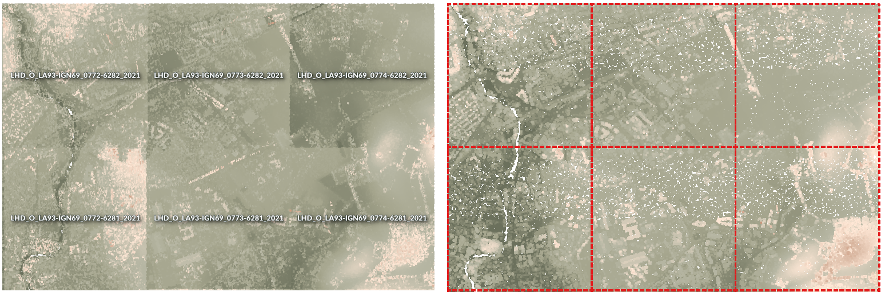
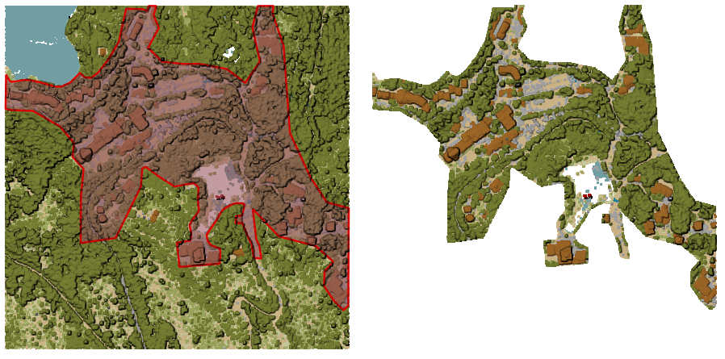

Point Cloud Data Management
===========================

.. only:: html

   .. contents::
      :local:
      :depth: 1

.. _pdalassignprojection:

Assign projection
-----------------

Assigns a Coordinate Reference System to a point cloud layer, if it is missing or wrong.
A new layer is created.

.. seealso:: :ref:`pdalreproject`

Parameters
..........

.. list-table::
   :header-rows: 1
   :widths: 20 20 20 40

   * - Label
     - Name
     - Type
     - Description
   * - **Input layer**
     - ``INPUT``
     - [point cloud]
     - Input point cloud layer to assign a CRS to
   * - **Desired CRS**
     - ``CRS``
     - [crs]
     - The CRS to apply to the layer
   * - **Output layer**
     - ``OUTPUT``
     - [point cloud]

       Default: ``[Save to temporary file]``
     - Specify the point cloud file to use as output. One of:

       .. include:: ../algs_include.rst
          :start-after: **file_output_types**
          :end-before: **end_file_output_types**

Outputs
.......

.. list-table::
   :header-rows: 1
   :widths: 20 20 20 40

   * - Label
     - Name
     - Type
     - Description
   * - **Converted**
     - ``OUTPUT``
     - [point cloud]
     - Output point cloud layer with a new CRS.
       Currently supported formats are :file:`.LAS`, :file:`.LAZ`, :file:`.COPC.LAZ` and :file:`.VPC`.

Python code
...........

**Algorithm ID**: ``pdal:assignprojection``

.. include:: ../algs_include.rst
  :start-after: **algorithm_code_section**
  :end-before: **end_algorithm_code_section**

.. _pdalvirtualpointcloud:

Build virtual point cloud (VPC)
-------------------------------

Creates a :ref:`virtual point cloud (VPC) <virtual_point_cloud>` from input point cloud data.

If you leave the optional parameters unchecked, the VPC file will be built very quickly
as the algorithm will only read metadata of input files.
With any of the optional parameters set, the algorithm will read all points which can take some time.

   Generating Virtual Point Cloud with overview from a set of point cloud tiles

.. seealso:: :ref:`pdalmerge`

Parameters
..........

.. list-table::
   :header-rows: 1
   :widths: 20 20 20 40

   * - Label
     - Name
     - Type
     - Description
   * - **Input layers**
     - ``LAYERS``
     - [point cloud] [list]
     - Input point cloud layers to combine inside a virtual point cloud layer
   * - **Calculate boundary polygon**
     - ``BOUNDARY``
     - [boolean]

       Default: False
     - Set to True to show the exact boundaries of data (rather than just rectangular extent)
   * - **Calculate statistics**
     - ``STATISTICS``
     - [boolean]

       Default: False
     - Set to True to understand ranges of values of the various attributes
   * - **Build overview point cloud**
     - ``OVERVIEW``
     - [boolean]

       Default: False
     - Generates a single “thinned” point cloud of all the input data
       (using only every 1000th point from original data).

       The overview point cloud will be created next to the VPC file -
       for example, for :file:`mydata.vpc`, the overview point cloud would be named :file:`mydata-overview.copc.laz`.
   * - **Virtual point cloud**
     - ``OUTPUT``
     - [point cloud]

       Default: ``[Save to temporary file]``
     - Specify the point cloud file to build the data into. One of:

       .. include:: ../algs_include.rst
          :start-after: **file_output_types**
          :end-before: **end_file_output_types**

Outputs
.......

.. list-table::
   :header-rows: 1
   :widths: 20 20 20 40

   * - Label
     - Name
     - Type
     - Description
   * - **Virtual point cloud**
     - ``OUTPUT``
     - [raster]
     - Output point cloud layer combining all the input data, as a virtual file.

Python code
...........

**Algorithm ID**: ``pdal:virtualpointcloud``

.. include:: ../algs_include.rst
  :start-after: **algorithm_code_section**
  :end-before: **end_algorithm_code_section**

.. _pdalclip:

Clip
----

Clips a point cloud layer by a polygon layer
so that the resulting point cloud contains only points within the polygons.

   Clipping an input point cloud layer with a polygon coverage

Parameters
..........

Basic parameters
^^^^^^^^^^^^^^^^

.. list-table::
   :header-rows: 1
   :widths: 20 20 20 40

   * - Label
     - Name
     - Type
     - Description
   * - **Input layer**
     - ``INPUT``
     - [point cloud]
     - Input point cloud layer to clip
   * - **Clipping polygons**
     - ``OVERLAY``
     - [vector: polygon]
     - Polygon vector layer to use as coverage for clipping the points
   * - **Clipped**
     - ``OUTPUT``
     - [point cloud]

       Default: ``[Save to temporary file]``
     - Specify the point cloud file to export the clipped points to. One of:

       .. include:: ../algs_include.rst
          :start-after: **file_output_types**
          :end-before: **end_file_output_types**

Advanced parameters
^^^^^^^^^^^^^^^^^^^

.. list-table::
   :header-rows: 1
   :widths: 20 20 20 40

   * - Label
     - Name
     - Type
     - Description
   * - **Filter expression**

       Optional
     - ``FILTER_EXPRESSION``
     - [expression]
     - A :ref:`PDAL expression <pdal_expressions>` for selecting a subset of features in the point cloud data
   * - **Cropping extent**

       Optional
     - ``FILTER_EXTENT``
     - [extent]
     - A map extent for selecting a subset of features in the point cloud data

       .. include:: ../algs_include.rst
          :start-after: **extent_options**
          :end-before: **end_extent_options**

Outputs
.......

.. list-table::
   :header-rows: 1
   :widths: 20 20 20 40

   * - Label
     - Name
     - Type
     - Description
   * - **Clipped**
     - ``OUTPUT``
     - [raster]
     - Output point cloud whose features are the points within the coverage polygon layer.

Python code
...........

**Algorithm ID**: ``pdal:clip``

.. include:: ../algs_include.rst
  :start-after: **algorithm_code_section**
  :end-before: **end_algorithm_code_section**

.. _pdalcreatecopc:

Create COPC
-----------

Creates the index for all the input point cloud files in a batch mode.

Parameters
..........

.. list-table::
   :header-rows: 1
   :widths: 20 20 20 40

   * - Label
     - Name
     - Type
     - Description
   * - **Input layers**
     - ``LAYERS``
     - [point cloud] [list]
     - Input point cloud layers to create an index for
   * - **Output directory**

       Optional
     - ``OUTPUT``
     - [folder]

       Default: ``[Skip output]``
     - Specify the folder to create the new files in. One of:

       .. include:: ../algs_include.rst
          :start-after: **directory_output_types_skip**
          :end-before: **end_directory_output_types_skip**

Outputs
.......

.. list-table::
   :header-rows: 1
   :widths: 20 20 20 40

   * - Label
     - Name
     - Type
     - Description
   * - **Output directory**
     - ``OUTPUT``
     - [folder]
     - Output folder containing point cloud layers with accompanying COPC index files.

Python code
...........

**Algorithm ID**: ``pdal:createcopc``

.. include:: ../algs_include.rst
  :start-after: **algorithm_code_section**
  :end-before: **end_algorithm_code_section**

.. _pdalinfo:

Information
-----------

Outputs basic metadata from an input point cloud file.

Example of output information::

    LAS           1.4
    point format  6
    count         56736130
    scale         0.001 0.001 0.001
    offset        431749.999 5440919.999 968.898
    extent        431250 5440420 424.266
                  432249.999 5441419.999 1513.531
    crs           ETRS89 / UTM zone 34N (N-E) (EPSG:3046)  (vertical CRS missing!)
    units         horizontal=metre  vertical=unknown

    Attributes:
    - X floating 8
    - Y floating 8
    - Z floating 8
    - Intensity unsigned 2
    - ReturnNumber unsigned 1
    - NumberOfReturns unsigned 1
    - ScanDirectionFlag unsigned 1
    - EdgeOfFlightLine unsigned 1
    - Classification unsigned 1
    - ScanAngleRank floating 4
    - UserData unsigned 1
    - PointSourceId unsigned 2
    - GpsTime floating 8
    - ScanChannel unsigned 1
    - ClassFlags unsigned 1

Parameters
..........

.. list-table::
   :header-rows: 1
   :widths: 20 20 20 40

   * - Label
     - Name
     - Type
     - Description
   * - **Input layer**
     - ``INPUT``
     - [point cloud]
     - Input point cloud layer to extract metadata information from
   * - **Layer information**
     - ``OUTPUT``
     - [file]

       Default: ``[Save to temporary file]``
     - Specify the file to store the metadata information. One of:

       .. include:: ../algs_include.rst
          :start-after: **file_output_types**
          :end-before: **end_file_output_types**

Outputs
.......

.. list-table::
   :header-rows: 1
   :widths: 20 20 20 40

   * - Label
     - Name
     - Type
     - Description
   * - **Layer information**
     - ``OUTPUT``
     - [vector]
     - :file:`HTML` file to store the metadata information.

Python code
...........

**Algorithm ID**: ``pdal:info``

.. include:: ../algs_include.rst
  :start-after: **algorithm_code_section**
  :end-before: **end_algorithm_code_section**

.. _pdalmerge:

Merge
-----

Merges multiple point cloud files into a single one.

.. seealso:: :ref:`pdalvirtualpointcloud`

Parameters
..........

Basic parameters
^^^^^^^^^^^^^^^^

.. list-table::
   :header-rows: 1
   :widths: 20 20 20 40

   * - Label
     - Name
     - Type
     - Description
   * - **Input layers**
     - ``LAYERS``
     - [point cloud] [list]
     - Input point cloud layers to merge into a single one
   * - **Merged**
     - ``OUTPUT``
     - [point cloud]

       Default: ``[Save to temporary file]``
     - Specify the output point cloud merging input files. One of:

       .. include:: ../algs_include.rst
          :start-after: **file_output_types**
          :end-before: **end_file_output_types**

Advanced parameters
^^^^^^^^^^^^^^^^^^^

.. list-table::
   :header-rows: 1
   :widths: 20 20 20 40

   * - Label
     - Name
     - Type
     - Description
   * - **Filter expression**

       Optional
     - ``FILTER_EXPRESSION``
     - [expression]
     - A :ref:`PDAL expression <pdal_expressions>` for selecting a subset of features in the point cloud data
   * - **Cropping extent**

       Optional
     - ``FILTER_EXTENT``
     - [extent]
     - A map extent for selecting a subset of features in the point cloud data

       .. include:: ../algs_include.rst
          :start-after: **extent_options**
          :end-before: **end_extent_options**

Outputs
.......

.. list-table::
   :header-rows: 1
   :widths: 20 20 20 40

   * - Label
     - Name
     - Type
     - Description
   * - **Merged**
     - ``OUTPUT``
     - [point cloud]
     - Output point cloud layer merging all the input files.

Python code
...........

**Algorithm ID**: ``pdal:merge``

.. include:: ../algs_include.rst
  :start-after: **algorithm_code_section**
  :end-before: **end_algorithm_code_section**

.. _pdalreproject:

Reproject
---------

Reprojects a point cloud to a different Coordinate Reference System (CRS).

.. seealso:: :ref:`pdalassignprojection`

Parameters
..........

.. list-table::
   :header-rows: 1
   :widths: 20 20 20 40

   * - Label
     - Name
     - Type
     - Description
   * - **Input layer**
     - ``INPUT``
     - [point cloud]
     - Input point cloud layer to reproject to a different CRS
   * - **Target CRS**
     - ``CRS``
     - [crs]
     - The CRS to apply to the layer
   * - **Reprojected**
     - ``OUTPUT``
     - [point cloud]

       Default: ``[Save to temporary file]``
     - Specify the reprojected point cloud file. One of:

       .. include:: ../algs_include.rst
          :start-after: **file_output_types**
          :end-before: **end_file_output_types**

Advanced parameters
^^^^^^^^^^^^^^^^^^^

.. list-table::
   :header-rows: 1
   :widths: 20 20 20 40

   * - Label
     - Name
     - Type
     - Description
   * - **Coordinate operation**

       Optional
     - ``OPERATION``
     - [datum]
     - The :ref:`datum transformation <datum_transformation>` to use to reproject the data
       between the origin and target systems.

Outputs
.......

.. list-table::
   :header-rows: 1
   :widths: 20 20 20 40

   * - Label
     - Name
     - Type
     - Description
   * - **REPROJECTED**
     - ``OUTPUT``
     - [point cloud]
     - Output point cloud layer in the target CRS.

Python code
...........

**Algorithm ID**: ``pdal:reproject``

.. include:: ../algs_include.rst
  :start-after: **algorithm_code_section**
  :end-before: **end_algorithm_code_section**

.. _pdalthinbyradius:

Thin (by sampling radius)
-------------------------

Creates a thinned version of the point cloud by performing sampling by distance point
(reduces the number of points within a certain radius).

.. only:: html

  .. figure:: img/point_cloud_thin.gif
     :align: center

     Thining point cloud (by sampling radius)

.. seealso:: :ref:`pdalthinbydecimate`

Parameters
..........

Basic parameters
^^^^^^^^^^^^^^^^

.. list-table::
   :header-rows: 1
   :widths: 20 20 20 40

   * - Label
     - Name
     - Type
     - Description
   * - **Input layer**
     - ``INPUT``
     - [point cloud]
     - Input point cloud layer to create a thinned version from
   * - **Sampling radius (in map units)**
     - ``SAMPLING_RADIUS``
     - [number]

       Default: 1.0
     - Distance within which points are sampled to a unique point
   * - **Thinned (by radius)**
     - ``OUTPUT``
     - [point cloud]

       Default: ``[Save to temporary file]``
     - Specify the output point cloud with reduced points. One of:

       .. include:: ../algs_include.rst
          :start-after: **file_output_types**
          :end-before: **end_file_output_types**

Advanced parameters
^^^^^^^^^^^^^^^^^^^

.. list-table::
   :header-rows: 1
   :widths: 20 20 20 40

   * - Label
     - Name
     - Type
     - Description
   * - **Filter expression**

       Optional
     - ``FILTER_EXPRESSION``
     - [expression]
     - A :ref:`PDAL expression <pdal_expressions>` for selecting a subset of features in the point cloud data
   * - **Cropping extent**

       Optional
     - ``FILTER_EXTENT``
     - [extent]
     - A map extent for selecting a subset of features in the point cloud data

       .. include:: ../algs_include.rst
          :start-after: **extent_options**
          :end-before: **end_extent_options**

Outputs
.......

.. list-table::
   :header-rows: 1
   :widths: 20 20 20 40

   * - Label
     - Name
     - Type
     - Description
   * - **Thinned (by radius)**
     - ``OUTPUT``
     - [point cloud]
     - Output point cloud layer with reduced points.

Python code
...........

**Algorithm ID**: ``pdal:thinbyradius``

.. include:: ../algs_include.rst
  :start-after: **algorithm_code_section**
  :end-before: **end_algorithm_code_section**

.. _pdalthinbydecimate:

Thin (by skipping points)
-------------------------

Creates a thinned version of the point cloud by keeping only every N-th point
(reduces the number of points by skipping nearby points).

.. seealso:: :ref:`pdalthinbyradius`

Parameters
..........

Basic parameters
^^^^^^^^^^^^^^^^

.. list-table::
   :header-rows: 1
   :widths: 20 20 20 40

   * - Label
     - Name
     - Type
     - Description
   * - **Input layer**
     - ``INPUT``
     - [point cloud]
     - Input point cloud layer to create a thinned version from
   * - **Number of points to skip**
     - ``POINTS_NUMBER``
     - [number]

       Default: 1
     - Keep only every N-th point in the input layer
   * - **Thinned (by decimation)**
     - ``OUTPUT``
     - [point cloud]

       Default: ``[Save to temporary file]``
     - Specify the output point cloud with reduced points. One of:

       .. include:: ../algs_include.rst
          :start-after: **file_output_types**
          :end-before: **end_file_output_types**

Advanced parameters
^^^^^^^^^^^^^^^^^^^

.. list-table::
   :header-rows: 1
   :widths: 20 20 20 40

   * - Label
     - Name
     - Type
     - Description
   * - **Filter expression**

       Optional
     - ``FILTER_EXPRESSION``
     - [expression]
     - A :ref:`PDAL expression <pdal_expressions>` for selecting a subset of features in the point cloud data
   * - **Cropping extent**

       Optional
     - ``FILTER_EXTENT``
     - [extent]
     - A map extent for selecting a subset of features in the point cloud data

       .. include:: ../algs_include.rst
          :start-after: **extent_options**
          :end-before: **end_extent_options**

Outputs
.......

.. list-table::
   :header-rows: 1
   :widths: 20 20 20 40

   * - Label
     - Name
     - Type
     - Description
   * - **Thinned (by decimation)**
     - ``OUTPUT``
     - [point cloud]
     - Output point cloud layer with reduced points.

Python code
...........

**Algorithm ID**: ``pdal:thinbydecimate``

.. include:: ../algs_include.rst
  :start-after: **algorithm_code_section**
  :end-before: **end_algorithm_code_section**

.. _pdaltile:

Tile
-----

Creates tiles from input point cloud files,
recommended for best performance (in display or analysis) with such datasets in QGIS.

.. seealso:: :ref:`pdalvirtualpointcloud`, :ref:`pdalcreatecopc`

Parameters
..........

Basic parameters
^^^^^^^^^^^^^^^^

.. list-table::
   :header-rows: 1
   :widths: 20 20 20 40

   * - Label
     - Name
     - Type
     - Description
   * - **Input layers**
     - ``LAYERS``
     - [point cloud] [list]
     - Input point cloud layers to create tiles from
   * - **Tile length**
     - ``LENGTH``
     - [number]

       Default: 1000.0
     - Size of the edge of each generated tile
   * - **Output directory**
     - ``OUTPUT``
     - [folder]

       Default: ``[Save to temporary folder]``
     - Specify the folder to store the generated tiles. One of:

       .. include:: ../algs_include.rst
          :start-after: **directory_output_types**
          :end-before: **end_directory_output_types**

Advanced parameters
^^^^^^^^^^^^^^^^^^^

.. list-table::
   :header-rows: 1
   :widths: 20 20 20 40

   * - Label
     - Name
     - Type
     - Description
   * - **Assign CRS**

       Optional
     - ``CRS``
     - [crs]
     - The CRS to apply to the layer

Outputs
.......

.. list-table::
   :header-rows: 1
   :widths: 20 20 20 40

   * - Label
     - Name
     - Type
     - Description
   * - **Output directory**
     - ``OUTPUT``
     - [folder]
     - Output folder containing the tiles generated from input files.

Python code
...........

**Algorithm ID**: ``pdal:tile``

.. include:: ../algs_include.rst
  :start-after: **algorithm_code_section**
  :end-before: **end_algorithm_code_section**
