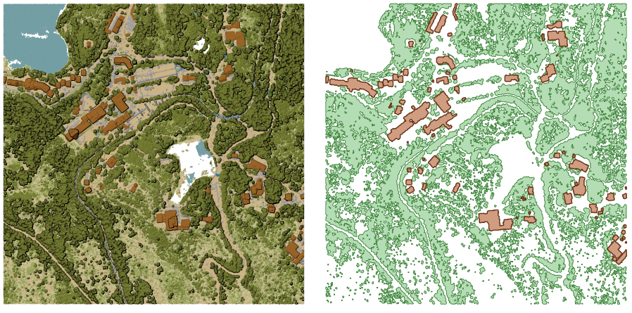
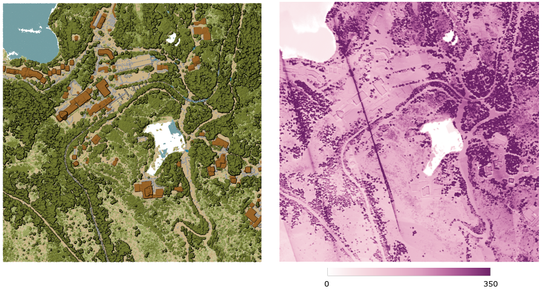
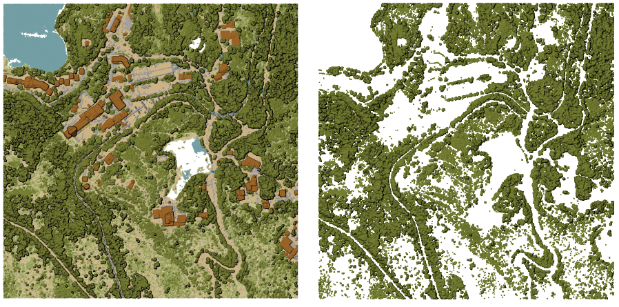

Point Cloud Extraction
======================

.. only:: html

   .. contents::
      :local:
      :depth: 1

.. _pdalboundary:

Boundary
--------

Exports a polygon file containing point cloud layer boundary.
It may contain holes and it may be a multi-part polygon.

   Extracting high vegetation and building polygons from an input point cloud layer

Parameters
..........

Basic parameters
^^^^^^^^^^^^^^^^

.. list-table::
   :header-rows: 1
   :widths: 20 20 20 40

   * - Label
     - Name
     - Type
     - Description
   * - **Input layer**
     - ``INPUT``
     - [point cloud]
     - Input point cloud layer to calculate boundary for
   * - **Resolution of cells used to calculate boundary**

       Optional
     - ``RESOLUTION``
     - [number]
     - Resolution of cells used to calculate boundary
   * - **Minimal number of points in a cell to consider cell occupied**

       Optional
     - ``THRESHOLD``
     - [number]
     - Minimal number of points in a cell to consider cell occupied
   * - **Boundary**
     - ``OUTPUT``
     - [vector: polygon]

       Default: ``[Save to temporary file]``
     - Specify the point cloud file to use as output. One of:

       .. include:: ../algs_include.rst
          :start-after: **file_output_types**
          :end-before: **end_file_output_types**

Advanced parameters
^^^^^^^^^^^^^^^^^^^

.. list-table::
   :header-rows: 1
   :widths: 20 20 20 40

   * - Label
     - Name
     - Type
     - Description
   * - **Filter expression**

       Optional
     - ``FILTER_EXPRESSION``
     - [expression]
     - A :ref:`PDAL expression <pdal_expressions>` for selecting a subset of features in the point cloud data
   * - **Cropping extent**

       Optional
     - ``FILTER_EXTENT``
     - [extent]
     - A map extent for selecting a subset of features in the point cloud data

       .. include:: ../algs_include.rst
          :start-after: **extent_options**
          :end-before: **end_extent_options**

Outputs
.......

.. list-table::
   :header-rows: 1
   :widths: 20 20 20 40

   * - Label
     - Name
     - Type
     - Description
   * - **Boundary**
     - ``OUTPUT``
     - [vector: polygon]
     - Output polygon vector layer with the point cloud boundary.
       Currently supported format is :file:`.GPKG`.

Python code
...........

**Algorithm ID**: ``pdal:boundary``

.. include:: ../algs_include.rst
  :start-after: **algorithm_code_section**
  :end-before: **end_algorithm_code_section**

.. _pdaldensity:

Density
-------

Exports a raster file based on the number of points within each raster cell -
useful for quality checking of point cloud datasets.

   Point density (number of points per 2x2 m) as a raster

Parameters
..........

Basic parameters
^^^^^^^^^^^^^^^^

.. list-table::
   :header-rows: 1
   :widths: 20 20 20 40

   * - Label
     - Name
     - Type
     - Description
   * - **Input layer**
     - ``INPUT``
     - [point cloud]
     - Input point cloud layer to export
   * - **Resolution of the density raster**
     - ``RESOLUTION``
     - [number]

       Default: 1.0
     - Cell size of the output raster
   * - **Tile size for parallel runs**
     - ``TILE_SIZE``
     - [number]

       Default: 1000
     - Size of the tiles to split the data into for parallel runs
   * - **Density**
     - ``OUTPUT``
     - [raster]

       Default: ``[Save to temporary file]``
     - Specify the raster file to export the data to. One of:

       .. include:: ../algs_include.rst
          :start-after: **file_output_types**
          :end-before: **end_file_output_types**

Advanced parameters
^^^^^^^^^^^^^^^^^^^

.. list-table::
   :header-rows: 1
   :widths: 20 20 20 40

   * - Label
     - Name
     - Type
     - Description
   * - **Filter expression**

       Optional
     - ``FILTER_EXPRESSION``
     - [expression]
     - A :ref:`PDAL expression <pdal_expressions>` for selecting a subset of features in the point cloud data
   * - **Cropping extent**

       Optional
     - ``FILTER_EXTENT``
     - [extent]
     - A map extent for selecting a subset of features in the point cloud data

       .. include:: ../algs_include.rst
          :start-after: **extent_options**
          :end-before: **end_extent_options**

   * - **X origin of a tile for parallel runs**

       Optional
     - ``ORIGIN_X``
     - [number]
     -
   * - **Y origin of a tile for parallel runs**

       Optional
     - ``ORIGIN_Y``
     - [number]
     -

Outputs
.......

.. list-table::
   :header-rows: 1
   :widths: 20 20 20 40

   * - Label
     - Name
     - Type
     - Description
   * - **Density**
     - ``OUTPUT``
     - [raster]
     - Output raster layer with number of points within each cell.
       Currently supported format is :file:`.TIF`.

Python code
...........

**Algorithm ID**: ``pdal:density``

.. include:: ../algs_include.rst
  :start-after: **algorithm_code_section**
  :end-before: **end_algorithm_code_section**

.. _pdalfilter:

filter
------

Extracts point from the input point cloud which match PDAL expression and/or are inside of a cropping rectangle.

   Filtering of high vegetation class from an input point cloud layer

Parameters
..........

.. list-table::
   :header-rows: 1
   :widths: 20 20 20 40

   * - Label
     - Name
     - Type
     - Description
   * - **Input layer**
     - ``INPUT``
     - [point cloud]
     - Input point cloud layer to export
   * - **Filter expression**

       Optional
     - ``FILTER_EXPRESSION``
     - [expression]
     - A :ref:`PDAL expression <pdal_expressions>` for selecting a subset of features in the point cloud data
   * - **Cropping extent**

       Optional
     - ``FILTER_EXTENT``
     - [extent]
     - A map extent for selecting a subset of features in the point cloud data

       .. include:: ../algs_include.rst
          :start-after: **extent_options**
          :end-before: **end_extent_options**

   * - **Filtered**
     - ``OUTPUT``
     - [point cloud]

       Default: ``[Save to temporary file]``
     - Specify the point cloud file to export the data to. One of:

       .. include:: ../algs_include.rst
          :start-after: **file_output_types**
          :end-before: **end_file_output_types**

Outputs
.......

.. list-table::
   :header-rows: 1
   :widths: 20 20 20 40

   * - Label
     - Name
     - Type
     - Description
   * - **Filtered**
     - ``OUTPUT``
     - [point cloud]
     - Output point cloud layer with the filtered features of the input point cloud layer.
       Currently supported formats are :file:`.LAS`, :file:`.LAZ`, :file:`.COPC.LAZ` and :file:`.VPC`.

Python code
...........

**Algorithm ID**: ``pdal:filter``

.. include:: ../algs_include.rst
  :start-after: **algorithm_code_section**
  :end-before: **end_algorithm_code_section**
