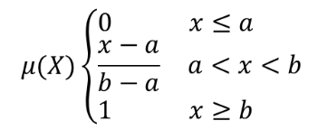

Raster analysis
===============

.. only:: html

   .. contents::
      :local:
      :depth: 1
      :class: toc_columns

.. _qgiscellstackpercentrankfromvalue:

Cell stack percent rank from value
----------------------------------

Calculates the cell-wise percentrank value of a stack of rasters based on
a single input value and writes them to an output raster.

At each cell location, the specified value is ranked among the respective values
in the stack of all overlaid and sorted cell values from the input rasters.
For values outside of the stack value distribution, the algorithm returns NoData
because the value cannot be ranked among the cell values.

There are two methods for percentile calculation:

* Inclusive linear interpolation (PERCENTRANK.INC)
* Exclusive linear interpolation (PERCENTRANK.EXC)

The linear interpolation methods return the unique percent rank for different values.
Both interpolation methods follow their counterpart methods implemented
by `LibreOffice <https://help.libreoffice.org/latest/en-US/text/scalc/01/04060184.html?DbPAR=CALC#bm_id3148807>`_
or Microsoft Excel.

The output raster's extent and resolution is defined by a reference raster.
Input raster layers that do not match the cell size of the reference
raster layer will be resampled using nearest neighbor resampling.
NoData values in any of the input layers will result in a NoData cell output
if the "Ignore NoData values" parameter is not set.
The output raster data type will always be ``Float32``.

.. figure:: img/percentrankfromvalue.png
  :align: center

  Percent ranking Value = 1. ``NoData`` cells (grey) are ignored.

.. seealso:: :ref:`qgiscellstackpercentile`, :ref:`qgiscellstackpercentrankfromrasterlayer`

Parameters
..........

Basic parameters
^^^^^^^^^^^^^^^^

.. list-table::
   :header-rows: 1
   :widths: 20 20 20 40
   :class: longtable

   * - Label
     - Name
     - Type
     - Description
   * - **Input layers**
     - ``INPUT``
     - [raster] [list]
     - Raster layers to evaluate.
       If multiband rasters are used in the data raster stack, the algorithm
       will always perform the analysis on the first band of the rasters
   * - **Method**
     - ``METHOD``
     - [enumeration]

       Default: 0
     - Method for percentile calculation:

       * 0 --- Inclusive linear interpolation (PERCENTRANK.INC)
       * 1 --- Exclusive linear interpolation (PERCENTRANK.EXC)
   * - **Value**
     - ``VALUE``
     - [number]

       Default: 10.0
     - Value to rank among the respective values in the stack of all overlaid
       and sorted cell values from the input rasters
   * - **Ignore NoData values**
     - ``IGNORE_NODATA``
     - [boolean]

       Default: True
     - If unchecked, any NoData cells in the input layers will result in a NoData
       cell in the output raster
   * - **Reference layer**
     - ``REFERENCE_LAYER``
     - [raster]
     - The reference layer for the output layer creation
       (extent, CRS, pixel dimensions)
   * - **Output layer**
     - ``OUTPUT``
     - [same as input]

       Default: ``[Save to temporary file]``
     - Specification of the output raster. One of:

       .. include:: ../algs_include.rst
          :start-after: **file_output_types**
          :end-before: **end_file_output_types**

Advanced parameters
^^^^^^^^^^^^^^^^^^^

.. list-table::
   :header-rows: 1
   :widths: 20 20 20 40
   :class: longtable

   * - Label
     - Name
     - Type
     - Description
   * - **Output NoData value**
     - ``OUTPUT_NODATA_VALUE``
     - [number]

       Default: -9999.0
     - Value to use for NoData in the output layer

Outputs
.......

.. list-table::
   :header-rows: 1
   :widths: 20 20 20 40

   * - Label
     - Name
     - Type
     - Description
   * - **Output layer**
     - ``OUTPUT``
     - [raster]
     - Output raster layer containing the result
   * - **CRS authority identifier**
     - ``CRS_AUTHID``
     - [string]
     - The coordinate reference system of the output raster layer
   * - **Extent**
     - ``EXTENT``
     - [string]
     - The spatial extent of the output raster layer
   * - **Width in pixels**
     - ``WIDTH_IN_PIXELS``
     - [integer]
     - The number of columns in the output raster layer
   * - **Height in pixels**
     - ``HEIGHT_IN_PIXELS``
     - [integer]
     - The number of rows in the output raster layer
   * - **Total pixel count**
     - ``TOTAL_PIXEL_COUNT``
     - [integer]
     - The count of pixels in the output raster layer

Python code
...........

**Algorithm ID**: ``native:cellstackpercentrankfromvalue``

.. include:: ../algs_include.rst
  :start-after: **algorithm_code_section**
  :end-before: **end_algorithm_code_section**

.. _qgiscellstackpercentile:

Cell stack percentile
---------------------

Calculates the cell-wise percentile value of a stack of rasters
and writes the results to an output raster. The percentile to return
is determined by the percentile input value (ranges between 0 and 1).
At each cell location, the specified percentile is obtained using the respective
value from the stack of all overlaid and sorted cell values of the input rasters.

There are three methods for percentile calculation:

* Nearest rank: returns the value that is nearest to the specified percentile
* Inclusive linear interpolation (PERCENTRANK.INC)
* Exclusive linear interpolation (PERCENTRANK.EXC)

The linear interpolation methods return the unique values for different percentiles.
Both interpolation methods follow their counterpart methods implemented
by `LibreOffice <https://help.libreoffice.org/latest/en-US/text/scalc/01/04060184.html?DbPAR=CALC#bm_id3148807>`_
or Microsoft Excel.

The output raster's extent and resolution is defined by a reference raster.
Input raster layers that do not match the cell size of the reference
raster layer will be resampled using nearest neighbor resampling.
NoData values in any of the input layers will result in a NoData cell output
if the "Ignore NoData values" parameter is not set.
The output raster data type will always be ``Float32``.

.. figure:: img/percentile.png
  :align: center

  Percentile = 0.25. ``NoData`` cells (grey) are ignored.

.. seealso:: :ref:`qgiscellstackpercentile`, :ref:`qgiscellstackpercentrankfromrasterlayer`

Parameters
..........

Basic parameters
^^^^^^^^^^^^^^^^

.. list-table::
   :header-rows: 1
   :widths: 20 20 20 40
   :class: longtable

   * - Label
     - Name
     - Type
     - Description
   * - **Input layers**
     - ``INPUT``
     - [raster] [list]
     - Raster layers to evaluate.
       If multiband rasters are used in the data raster stack, the algorithm
       will always perform the analysis on the first band of the rasters
   * - **Method**
     - ``METHOD``
     - [enumeration]

       Default: 0
     - Method for percentile calculation:

       * 0 --- Nearest rank: returns the value that is nearest to the specified percentile
       * 1 --- Inclusive linear interpolation (PERCENTILE.INC)
       * 2 --- Exclusive linear interpolation (PERCENTILE.EXC)
   * - **Percentile**
     - ``VALUE``
     - [number]

       Default: 0.25
     - Value to rank among the respective values in the stack of all overlaid
       and sorted cell values from the input rasters. Between 0 and 1.
   * - **Ignore NoData values**
     - ``IGNORE_NODATA``
     - [boolean]

       Default: True
     - If unchecked, any NoData cells in the input layers will result in a NoData
       cell in the output raster
   * - **Reference layer**
     - ``REFERENCE_LAYER``
     - [raster]
     - The reference layer for the output layer creation
       (extent, CRS, pixel dimensions)
   * - **Output layer**
     - ``OUTPUT``
     - [same as input]

       Default: ``[Save to temporary file]``
     - Specification of the output raster. One of:

       .. include:: ../algs_include.rst
          :start-after: **file_output_types**
          :end-before: **end_file_output_types**

Advanced parameters
^^^^^^^^^^^^^^^^^^^

.. list-table::
   :header-rows: 1
   :widths: 20 20 20 40
   :class: longtable

   * - Label
     - Name
     - Type
     - Description
   * - **Output NoData value**
     - ``OUTPUT_NODATA_VALUE``
     - [number]

       Default: -9999.0
     - Value to use for NoData in the output layer

Outputs
.......

.. list-table::
   :header-rows: 1
   :widths: 20 20 20 40

   * - Label
     - Name
     - Type
     - Description
   * - **Output layer**
     - ``OUTPUT``
     - [raster]
     - Output raster layer containing the result
   * - **CRS authority identifier**
     - ``CRS_AUTHID``
     - [string]
     - The coordinate reference system of the output raster layer
   * - **Extent**
     - ``EXTENT``
     - [string]
     - The spatial extent of the output raster layer
   * - **Width in pixels**
     - ``WIDTH_IN_PIXELS``
     - [integer]
     - The number of columns in the output raster layer
   * - **Height in pixels**
     - ``HEIGHT_IN_PIXELS``
     - [integer]
     - The number of rows in the output raster layer
   * - **Total pixel count**
     - ``TOTAL_PIXEL_COUNT``
     - [integer]
     - The count of pixels in the output raster layer

Python code
...........

**Algorithm ID**: ``native:cellstackpercentile``

.. include:: ../algs_include.rst
  :start-after: **algorithm_code_section**
  :end-before: **end_algorithm_code_section**

.. _qgiscellstackpercentrankfromrasterlayer:

Cell stack percentrank from raster layer
----------------------------------------

Calculates the cell-wise percentrank value of a stack of rasters based
on an input value raster and writes them to an output raster.

At each cell location, the current value of the value raster is ranked among
the respective values in the stack of all overlaid and sorted cell values of
the input rasters. For values outside of the the stack value distribution,
the algorithm returns NoData because the value cannot be ranked among the cell values.

There are two methods for percentile calculation:

* Inclusive linear interpolation (PERCENTRANK.INC)
* Exclusive linear interpolation (PERCENTRANK.EXC)

The linear interpolation methods return the unique values for different percentiles.
Both interpolation methods follow their counterpart methods implemented
by `LibreOffice <https://help.libreoffice.org/latest/en-US/text/scalc/01/04060184.html?DbPAR=CALC#bm_id3148807>`_
or Microsoft Excel.

The output raster's extent and resolution is defined by a reference raster.
Input raster layers that do not match the cell size of the reference
raster layer will be resampled using nearest neighbor resampling.
NoData values in any of the input layers will result in a NoData cell output
if the "Ignore NoData values" parameter is not set.
The output raster data type will always be ``Float32``.

.. figure:: img/percentrankfromrasterlayer.png
  :align: center

  Ranking the value raster layer cells. ``NoData`` cells (grey) are ignored.

.. seealso:: :ref:`qgiscellstackpercentile`, :ref:`qgiscellstackpercentrankfromvalue`

Parameters
..........

Basic parameters
^^^^^^^^^^^^^^^^

.. list-table::
   :header-rows: 1
   :widths: 20 20 20 40
   :class: longtable

   * - Label
     - Name
     - Type
     - Description
   * - **Input layers**
     - ``INPUT``
     - [raster] [list]
     - Raster layers to evaluate.
       If multiband rasters are used in the data raster stack, the algorithm
       will always perform the analysis on the first band of the rasters
   * - **Value raster layer**
     - ``INPUT_VALUE_RASTER``
     - [raster]
     - The layer to rank the values among the stack of all overlaid layers
   * - **Value raster band**
     - ``VALUE_RASTER_BAND``
     - [integer]

       Default: 1
     - Band of the "value raster layer" to compare to
   * - **Method**
     - ``METHOD``
     - [enumeration]

       Default: 0
     - Method for percentile calculation:

       * 0 --- Inclusive linear interpolation (PERCENTRANK.INC)
       * 1 --- Exclusive linear interpolation (PERCENTRANK.EXC)
   * - **Ignore NoData values**
     - ``IGNORE_NODATA``
     - [boolean]

       Default: True
     - If unchecked, any NoData cells in the input layers will result in a NoData
       cell in the output raster
   * - **Reference layer**
     - ``REFERENCE_LAYER``
     - [raster]
     - The reference layer for the output layer creation
       (extent, CRS, pixel dimensions)
   * - **Output layer**
     - ``OUTPUT``
     - [same as input]

       Default: ``[Save to temporary file]``
     - Specification of the output raster. One of:

       .. include:: ../algs_include.rst
          :start-after: **file_output_types**
          :end-before: **end_file_output_types**

Advanced parameters
^^^^^^^^^^^^^^^^^^^

.. list-table::
   :header-rows: 1
   :widths: 20 20 20 40
   :class: longtable

   * - Label
     - Name
     - Type
     - Description
   * - **Output NoData value**
     - ``OUTPUT_NODATA_VALUE``
     - [number]

       Default: -9999.0
     - Value to use for NoData in the output layer

Outputs
.......

.. list-table::
   :header-rows: 1
   :widths: 20 20 20 40

   * - Label
     - Name
     - Type
     - Description
   * - **Output layer**
     - ``OUTPUT``
     - [raster]
     - Output raster layer containing the result
   * - **CRS authority identifier**
     - ``CRS_AUTHID``
     - [string]
     - The coordinate reference system of the output raster layer
   * - **Extent**
     - ``EXTENT``
     - [string]
     - The spatial extent of the output raster layer
   * - **Width in pixels**
     - ``WIDTH_IN_PIXELS``
     - [integer]
     - The number of columns in the output raster layer
   * - **Height in pixels**
     - ``HEIGHT_IN_PIXELS``
     - [integer]
     - The number of rows in the output raster layer
   * - **Total pixel count**
     - ``TOTAL_PIXEL_COUNT``
     - [integer]
     - The count of pixels in the output raster layer

Python code
...........

**Algorithm ID**: ``native:cellstackpercentrankfromrasterlayer``

.. include:: ../algs_include.rst
  :start-after: **algorithm_code_section**
  :end-before: **end_algorithm_code_section**

.. _qgiscellstatistics:

Cell statistics
---------------

Computes per-cell statistics based on input raster layers
and for each cell writes the resulting statistics to an output raster. At each
cell location, the output value is defined as a function of all overlaid
cell values of the input rasters.

By default, a NoData cell in ANY of the input layers will result in a
NoData cell in the output raster.
If the :guilabel:`Ignore NoData values` option is checked,
then NoData inputs will be ignored in the statistic calculation. This
may result in NoData output for locations where all cells are NoData.

The :guilabel:`Reference layer` parameter specifies an existing raster layer to
use as a reference when creating the output raster.
The output raster will have the same extent, CRS, and pixel dimensions
as this layer.

**Calculation details:**
Input raster layers that do not match the cell size of the reference
raster layer will be resampled using ``nearest neighbor resampling``.
The output raster data type will be set to the most complex
data type present in the input datasets except when using the
functions ``Mean``, ``Standard deviation`` and ``Variance`` (data type is always
``Float32`` or ``Float64`` depending on input float type) or ``Count``
and ``Variety`` (data type is always ``Int32``).

- ``Count``: The count statistic will always result in the number of cells
  without NoData values at the current cell location.

- ``Median``: If the number of input layers is even, the median will be
  calculated as the arithmetic mean of the two middle values of the ordered cell input values.

- ``Minority/Majority``: If no unique minority or majority could be found,
  the result is NoData, except all input cell values are equal.

.. figure:: img/cell_statistics_all_stats.png
  :align: center

  Example with all the statistic functions. ``NoData`` cells (grey) are taken into account.

Parameters
..........

Basic parameters
^^^^^^^^^^^^^^^^

.. list-table::
   :header-rows: 1
   :widths: 20 20 20 40

   * - Label
     - Name
     - Type
     - Description
   * - **Input layers**
     - ``INPUT``
     - [raster] [list]
     - Input raster layers
   * - **Statistic**
     - ``STATISTIC``
     - [enumeration]

       Default: 0
     - Available statistics. Options:

       * 0 --- Sum
       * 1 --- Count
       * 2 --- Mean
       * 3 --- Median
       * 4 --- Standard deviation
       * 5 --- Variance
       * 6 --- Minimum
       * 7 --- Maximum
       * 8 --- Minority (least common value)
       * 9 --- Majority (most common value)
       * 10 --- Range (max - min)
       * 11 --- Variety (unique value count)
   * - **Ignore NoData values**
     - ``IGNORE_NODATA``
     - [boolean]

       Default: True
     - Calculate statistics also for all cells stacks, ignoring NoData occurrence.
   * - **Reference layer**
     - ``REF_LAYER``
     - [raster]
     - The reference layer to create the output layer
       from (extent, CRS, pixel dimensions)
   * - **Output layer**
     - ``OUTPUT``
     - [same as input]

       Default: ``[Save to temporary file]``
     - Specification of the output raster. One of:

       .. include:: ../algs_include.rst
          :start-after: **file_output_types**
          :end-before: **end_file_output_types**

Advanced parameters
^^^^^^^^^^^^^^^^^^^

.. list-table::
   :header-rows: 1
   :widths: 20 20 20 40
   :class: longtable

   * - Label
     - Name
     - Type
     - Description
   * - **Output NoData value**

       Optional
     - ``OUTPUT_NO_DATA_VALUE``
     - [number]

       Default: -9999.0
     - Value to use for NoData in the output layer

Outputs
.......

.. list-table::
  :header-rows: 1
  :widths: 20 20 20 40

  * - Label
    - Name
    - Type
    - Description
  * - **CRS authority identifier**
    - ``CRS_AUTHID``
    - [crs]
    - The coordinate reference system of the output raster layer
  * - **Extent**
    - ``EXTENT``
    - [string]
    - The spatial extent of the output raster layer
  * - **Height in pixels**
    - ``HEIGHT_IN_PIXELS``
    - [integer]
    - The number of rows in the output raster layer
  * - **Output raster**
    - ``OUTPUT``
    - [raster]
    - Output raster layer containing the result
  * - **Total pixel count**
    - ``TOTAL_PIXEL_COUNT``
    - [integer]
    - The count of pixels in the output raster layer
  * - **Width in pixels**
    - ``WIDTH_IN_PIXELS``
    - [integer]
    - The number of columns in the output raster layer

Python code
...........

**Algorithm ID**: ``native:cellstatistics``

.. include:: ../algs_include.rst
  :start-after: **algorithm_code_section**
  :end-before: **end_algorithm_code_section**

.. _qgisequaltofrequency:

Equal to frequency
------------------

Evaluates on a cell-by-cell basis the frequency (number of times) the values
of an input stack of rasters are equal to the value of a value layer.
The output raster extent and resolution are defined by the input raster layer
and is always of ``Int32`` type.

If multiband rasters are used in the data raster stack, the algorithm will always
perform the analysis on the first band of the rasters - use GDAL to use other bands
in the analysis.
The output NoData value can be set manually.

.. figure:: img/equaltofrequency.png
  :align: center

  For each cell in the output raster, the value represents the number of times
  that the corresponding cells in the list of rasters are the same as the value raster.
  ``NoData`` cells (grey) are taken into account.

.. seealso:: :ref:`qgisgreaterthanfrequency`, :ref:`qgislessthanfrequency`

.. **frequencyparams**
.. FYI, the next params description is shared with Greater/Less than frequency algorithms

Parameters
..........

Basic parameters
^^^^^^^^^^^^^^^^

.. list-table::
   :header-rows: 1
   :widths: 20 20 20 40
   :class: longtable

   * - Label
     - Name
     - Type
     - Description
   * - **Input value raster**
     - ``INPUT_VALUE_RASTER``
     - [raster]
     - The input value layer serves as reference layer for the sample layers
   * - **Value raster band**
     - ``INPUT_VALUE_RASTER_BAND``
     - [raster band]

       Default: The first band of the raster layer
     - Select the band you want to use as sample
   * - **Input raster layers**
     - ``INPUT_RASTERS``
     - [raster] [list]
     - Raster layers to evaluate.
       If multiband rasters are used in the data raster stack, the algorithm
       will always perform the analysis on the first band of the rasters
   * - **Ignore NoData values**
     - ``IGNORE_NODATA``
     - [boolean]

       Default: False
     - If unchecked, any NoData cells in the value raster or the data layer stack
       will result in a NoData cell in the output raster
   * - **Output layer**
     - ``OUTPUT``
     - [same as input]

       Default: ``[Save to temporary file]``
     - Specification of the output raster. One of:

       .. include:: ../algs_include.rst
          :start-after: **file_output_types**
          :end-before: **end_file_output_types**

Advanced parameters
^^^^^^^^^^^^^^^^^^^

.. list-table::
   :header-rows: 1
   :widths: 20 20 20 40
   :class: longtable

   * - Label
     - Name
     - Type
     - Description
   * - **Output NoData value**

       Optional
     - ``OUTPUT_NO_DATA_VALUE``
     - [number]

       Default: -9999.0
     - Value to use for NoData in the output layer

Outputs
.......

.. list-table::
   :header-rows: 1
   :widths: 20 20 20 40

   * - Label
     - Name
     - Type
     - Description
   * - **Output layer**
     - ``OUTPUT``
     - [raster]
     - Output raster layer containing the result
   * - **CRS authority identifier**
     - ``CRS_AUTHID``
     - [string]
     - The coordinate reference system of the output raster layer
   * - **Extent**
     - ``EXTENT``
     - [string]
     - The spatial extent of the output raster layer
   * - **Count of cells with equal value occurrences**
     - ``FOUND_LOCATIONS_COUNT``
     - [number]
     -
   * - **Height in pixels**
     - ``HEIGHT_IN_PIXELS``
     - [number]
     - The number of rows in the output raster layer
   * - **Total pixel count**
     - ``TOTAL_PIXEL_COUNT``
     - [integer]
     - The count of pixels in the output raster layer
   * - **Mean frequency at valid cell locations**
     - ``MEAN_FREQUENCY_PER_LOCATION``
     - [number]
     -
   * - **Count of value occurrences**
     - ``OCCURRENCE_COUNT``
     - [number]
     -
   * - **Width in pixels**
     - ``WIDTH_IN_PIXELS``
     - [integer]
     - The number of columns in the output raster layer

.. **endfrequencyparams**

Python code
...........

**Algorithm ID**: ``native:equaltofrequency``

.. include:: ../algs_include.rst
  :start-after: **algorithm_code_section**
  :end-before: **end_algorithm_code_section**

.. _qgisfuzzifyrastergaussianmembership:

Fuzzify raster (gaussian membership)
------------------------------------

Transforms an input raster to a fuzzified raster by assigning a
membership value to each pixel, using a Gaussian membership function.
Membership values range from 0 to 1.
In the fuzzified raster, a value of 0 implies no membership of the
defined fuzzy set, whereas a value of 1 means full membership.
The gaussian membership function is defined as |gaussian_formula|,
where *f1* is the spread and *f2* the midpoint.

.. figure:: img/gaussianimage.png
  :align: center

  Fuzzify raster example. Input raster source: Land Tirol -
  data.tirol.gv.at.

.. seealso:: :ref:`qgisfuzzifyrasterlargemembership`
  :ref:`qgisfuzzifyrasterlinearmembership`,
  :ref:`qgisfuzzifyrasternearmembership`,
  :ref:`qgisfuzzifyrasterpowermembership`,
  :ref:`qgisfuzzifyrastersmallmembership`

Parameters
..........

.. list-table::
   :header-rows: 1
   :widths: 20 20 20 40
   :class: longtable

   * - Label
     - Name
     - Type
     - Description
   * - **Input Raster**
     - ``INPUT``
     - [raster]
     - Input raster layer
   * - **Band Number**
     - ``BAND``
     - [raster band]

       Default: The first band of the raster layer
     - If the raster is multiband, choose the band that
       you want to fuzzify.
   * - **Function midpoint**
     - ``FUZZYMIDPOINT``
     - [number]

       Default: 10
     - Midpoint of the gaussian function
   * - **Function spread**
     - ``FUZZYSPREAD``
     - [number]

       Default: 0.01
     - Spread of the gaussian function
   * - **Fuzzified raster**
     - ``OUTPUT``
     - [same as input]

       Default: ``[Save to temporary file]``
     - Specification of the output raster. One of:

       .. include:: ../algs_include.rst
          :start-after: **file_output_types**
          :end-before: **end_file_output_types**

Outputs
.......

.. list-table::
   :header-rows: 1
   :widths: 20 20 20 40

   * - Label
     - Name
     - Type
     - Description
   * - **Fuzzified raster**
     - ``OUTPUT``
     - [same as input]
     - Output raster layer containing the result
   * - **CRS authority identifier**
     - ``CRS_AUTHID``
     - [crs]
     - The coordinate reference system of the output raster layer
   * - **Extent**
     - ``EXTENT``
     - [string]
     - The spatial extent of the output raster layer
   * - **Width in pixels**
     - ``WIDTH_IN_PIXELS``
     - [integer]
     - The number of columns in the output raster layer
   * - **Height in pixels**
     - ``HEIGHT_IN_PIXELS``
     - [integer]
     - The number of rows in the output raster layer
   * - **Total pixel count**
     - ``TOTAL_PIXEL_COUNT``
     - [integer]
     - The count of pixels in the output raster layer

Python code
...........

**Algorithm ID**: ``native:fuzzifyrastergaussianmembership``

.. include:: ../algs_include.rst
  :start-after: **algorithm_code_section**
  :end-before: **end_algorithm_code_section**

.. _qgisfuzzifyrasterlargemembership:

Fuzzify raster (large membership)
---------------------------------

Transforms an input raster to a fuzzified raster by assigning a
membership value to each pixel, using a Large membership function.
Membership values range from 0 to 1.
In the fuzzified raster, a value of 0 implies no membership of the
defined fuzzy set, whereas a value of 1 means full membership.
The large membership function is defined as |fuzzy_large_formula|,
where *f1* is the spread and *f2* the midpoint.

.. seealso:: :ref:`qgisfuzzifyrastergaussianmembership`,
  :ref:`qgisfuzzifyrasterlinearmembership`,
  :ref:`qgisfuzzifyrasternearmembership`,
  :ref:`qgisfuzzifyrasterpowermembership`,
  :ref:`qgisfuzzifyrastersmallmembership`

Parameters
..........

.. list-table::
   :header-rows: 1
   :widths: 20 20 20 40

   * - Label
     - Name
     - Type
     - Description
   * - **Input Raster**
     - ``INPUT``
     - [raster]
     - Input raster layer
   * - **Band Number**
     - ``BAND``
     - [raster band]

       Default: The first band of the raster layer
     - If the raster is multiband, choose the band that you want to
       fuzzify.
   * - **Function midpoint**
     - ``FUZZYMIDPOINT``
     - [number]

       Default: 50
     - Midpoint of the large function
   * - **Function spread**
     - ``FUZZYSPREAD``
     - [number]

       Default: 5
     - Spread of the large function
   * - **Fuzzified raster**
     - ``OUTPUT``
     - [same as input]

       Default: ``[Save to temporary file]``
     - Specification of the output raster. One of:

       .. include:: ../algs_include.rst
          :start-after: **file_output_types**
          :end-before: **end_file_output_types**

Outputs
.......

.. list-table::
   :header-rows: 1
   :widths: 20 20 20 40

   * - Label
     - Name
     - Type
     - Description
   * - **Fuzzified raster**
     - ``OUTPUT``
     - [same as input]
     - Output raster layer containing the result

   * - **CRS authority identifier**
     - ``CRS_AUTHID``
     - [crs]
     - The coordinate reference system of the output raster layer
   * - **Extent**
     - ``EXTENT``
     - [string]
     - The spatial extent of the output raster layer
   * - **Width in pixels**
     - ``WIDTH_IN_PIXELS``
     - [integer]
     - The number of columns in the output raster layer
   * - **Height in pixels**
     - ``HEIGHT_IN_PIXELS``
     - [integer]
     - The number of rows in the output raster layer
   * - **Total pixel count**
     - ``TOTAL_PIXEL_COUNT``
     - [integer]
     - The count of pixels in the output raster layer

Python code
...........

**Algorithm ID**: ``native:fuzzifyrasterlargemembership``

.. include:: ../algs_include.rst
  :start-after: **algorithm_code_section**
  :end-before: **end_algorithm_code_section**

.. _qgisfuzzifyrasterlinearmembership:

Fuzzify raster (linear membership)
----------------------------------

Transforms an input raster to a fuzzified raster by assigning a
membership value to each pixel, using a Linear membership function.
Membership values range from 0 to 1. In the fuzzified raster, a value
of 0 implies no membership of the defined fuzzy set, whereas a value
of 1 means full membership.
The linear function is defined as |fuzzy_linear_formula|, where *a*
is the low bound and *b* the high bound. This equation assigns
membership values using a linear transformation for pixel values
between the low and high bounds.
Pixels values smaller than the low bound are given 0 membership
whereas pixel values greater than the high bound are given 1
membership.

.. seealso:: :ref:`qgisfuzzifyrastergaussianmembership`,
  :ref:`qgisfuzzifyrasterlargemembership`,
  :ref:`qgisfuzzifyrasternearmembership`,
  :ref:`qgisfuzzifyrasterpowermembership`,
  :ref:`qgisfuzzifyrastersmallmembership`

Parameters
..........

.. list-table::
   :header-rows: 1
   :widths: 20 20 20 40

   * - Label
     - Name
     - Type
     - Description
   * - **Input Raster**
     - ``INPUT``
     - [raster]
     - Input raster layer
   * - **Band Number**
     - ``BAND``
     - [raster band]

       Default: The first band of the raster layer
     - If the raster is multiband, choose the band that you want to
       fuzzify.
   * - **Low fuzzy membership bound**
     - ``FUZZYLOWBOUND``
     - [number]

       Default: 0
     - Low bound of the linear function
   * - **High fuzzy membership bound**
     - ``FUZZYHIGHBOUND``
     - [number]

       Default: 1
     - High bound of the linear function
   * - **Fuzzified raster**
     - ``OUTPUT``
     - [same as input]

       Default: ``[Save to temporary file]``
     - Specification of the output raster. One of:

       .. include:: ../algs_include.rst
          :start-after: **file_output_types**
          :end-before: **end_file_output_types**

Outputs
.......

.. list-table::
   :header-rows: 1
   :widths: 20 20 20 40

   * - Label
     - Name
     - Type
     - Description
   * - **Fuzzified raster**
     - ``OUTPUT``
     - [same as input]
     - Output raster layer containing the result
   * - **CRS authority identifier**
     - ``CRS_AUTHID``
     - [crs]
     - The coordinate reference system of the output raster layer
   * - **Extent**
     - ``EXTENT``
     - [string]
     - The spatial extent of the output raster layer
   * - **Width in pixels**
     - ``WIDTH_IN_PIXELS``
     - [integer]
     - The number of columns in the output raster layer
   * - **Height in pixels**
     - ``HEIGHT_IN_PIXELS``
     - [integer]
     - The number of rows in the output raster layer
   * - **Total pixel count**
     - ``TOTAL_PIXEL_COUNT``
     - [integer]
     - The count of pixels in the output raster layer

Python code
...........

**Algorithm ID**: ``native:fuzzifyrasterlinearmembership``

.. include:: ../algs_include.rst
  :start-after: **algorithm_code_section**
  :end-before: **end_algorithm_code_section**

.. _qgisfuzzifyrasternearmembership:

Fuzzify raster (near membership)
--------------------------------

Transforms an input raster to a fuzzified raster by assigning a
membership value to each pixel, using a Near membership function.
Membership values range from 0 to 1.
In the fuzzified raster, a value of 0 implies no membership of the
defined fuzzy set, whereas a value of 1 means full membership.
The near membership function is defined as |near_formula|, where
*f1* is the spread and *f2* the midpoint.

.. seealso:: :ref:`qgisfuzzifyrastergaussianmembership`,
  :ref:`qgisfuzzifyrasterlargemembership`,
  :ref:`qgisfuzzifyrasterlinearmembership`,
  :ref:`qgisfuzzifyrasterpowermembership`,
  :ref:`qgisfuzzifyrastersmallmembership`

Parameters
..........

.. list-table::
   :header-rows: 1
   :widths: 20 20 20 40

   * - Label
     - Name
     - Type
     - Description
   * - **Input Raster**
     - ``INPUT``
     - [raster]
     - Input raster layer
   * - **Band Number**
     - ``BAND``
     - [raster band]

       Default: The first band of the raster layer
     - If the raster is multiband, choose the band that you want to
       fuzzify.
   * - **Function midpoint**
     - ``FUZZYMIDPOINT``
     - [number]

       Default: 50
     - Midpoint of the near function
   * - **Function spread**
     - ``FUZZYSPREAD``
     - [number]

       Default: 0.01
     - Spread of the near function
   * - **Fuzzified raster**
     - ``OUTPUT``
     - [same as input]

       Default: ``[Save to temporary file]``
     - Specification of the output raster. One of:

       .. include:: ../algs_include.rst
          :start-after: **file_output_types**
          :end-before: **end_file_output_types**

Outputs
.......

.. list-table::
   :header-rows: 1
   :widths: 20 20 20 40

   * - Label
     - Name
     - Type
     - Description
   * - **Fuzzified raster**
     - ``OUTPUT``
     - [same as input]
     - Output raster layer containing the result
   * - **CRS authority identifier**
     - ``CRS_AUTHID``
     - [crs]
     - The coordinate reference system of the output raster layer
   * - **Extent**
     - ``EXTENT``
     - [string]
     - The spatial extent of the output raster layer
   * - **Width in pixels**
     - ``WIDTH_IN_PIXELS``
     - [integer]
     - The number of columns in the output raster layer
   * - **Height in pixels**
     - ``HEIGHT_IN_PIXELS``
     - [integer]
     - The number of rows in the output raster layer
   * - **Total pixel count**
     - ``TOTAL_PIXEL_COUNT``
     - [integer]
     - The count of pixels in the output raster layer

Python code
...........

**Algorithm ID**: ``native:fuzzifyrasternearmembership``

.. include:: ../algs_include.rst
  :start-after: **algorithm_code_section**
  :end-before: **end_algorithm_code_section**

.. _qgisfuzzifyrasterpowermembership:

Fuzzify raster (power membership)
---------------------------------

Transforms an input raster to a fuzzified raster by assigning a
membership value to each pixel, using a Power membership function.
Membership values range from 0 to 1.
In the fuzzified raster, a value of 0 implies no membership of the
defined fuzzy set, whereas a value of 1 means full membership.
The power function is defined as |power_formula|, where *a* is the
low bound, *b* is the high bound, and *f1* the exponent.
This equation assigns membership values using the power transformation
for pixel values between the low and high bounds.
Pixels values smaller than the low bound are given 0 membership
whereas pixel values greater than the high bound are given 1
membership.

.. seealso:: :ref:`qgisfuzzifyrastergaussianmembership`, :ref:`qgisfuzzifyrasterlargemembership`,
  :ref:`qgisfuzzifyrasterlinearmembership`, :ref:`qgisfuzzifyrasternearmembership`,
  :ref:`qgisfuzzifyrastersmallmembership`

Parameters
..........

.. list-table::
   :header-rows: 1
   :widths: 20 20 20 40

   * - Label
     - Name
     - Type
     - Description
   * - **Input Raster**
     - ``INPUT``
     - [raster]
     - Input raster layer
   * - **Band Number**
     - ``BAND``
     - [raster band]

       Default: The first band of the raster layer
     - If the raster is multiband, choose the band that you want to
       fuzzify.
   * - **Low fuzzy membership bound**
     - ``FUZZYLOWBOUND``
     - [number]

       Default: 0
     - Low bound of the power function
   * - **High fuzzy membership bound**
     - ``FUZZYHIGHBOUND``
     - [number]

       Default: 1
     - High bound of the power function
   * - **High fuzzy membership bound**
     - ``FUZZYEXPONENT``
     - [number]

       Default: 2
     - Exponent of the power function
   * - **Fuzzified raster**
     - ``OUTPUT``
     - [same as input]

       Default: ``[Save to temporary file]``
     - Specification of the output raster. One of:

       .. include:: ../algs_include.rst
          :start-after: **file_output_types**
          :end-before: **end_file_output_types**

Outputs
.......

.. list-table::
   :header-rows: 1
   :widths: 20 20 20 40

   * - Label
     - Name
     - Type
     - Description
   * - **Fuzzified raster**
     - ``OUTPUT``
     - [same as input]
     - Output raster layer containing the result
   * - **CRS authority identifier**
     - ``CRS_AUTHID``
     - [crs]
     - The coordinate reference system of the output raster layer
   * - **Extent**
     - ``EXTENT``
     - [string]
     - The spatial extent of the output raster layer
   * - **Width in pixels**
     - ``WIDTH_IN_PIXELS``
     - [integer]
     - The number of columns in the output raster layer
   * - **Height in pixels**
     - ``HEIGHT_IN_PIXELS``
     - [integer]
     - The number of rows in the output raster layer
   * - **Total pixel count**
     - ``TOTAL_PIXEL_COUNT``
     - [integer]
     - The count of pixels in the output raster layer

Python code
...........

**Algorithm ID**: ``native:fuzzifyrasterpowermembership``

.. include:: ../algs_include.rst
  :start-after: **algorithm_code_section**
  :end-before: **end_algorithm_code_section**

.. _qgisfuzzifyrastersmallmembership:

Fuzzify raster (small membership)
---------------------------------

Transforms an input raster to a fuzzified raster by assigning a
membership value to each pixel, using a Small membership function.
Membership values range from 0 to 1.
In the fuzzified raster, a value of 0 implies no membership of the
defined fuzzy set, whereas a value of 1 means full membership.
The small membership function is defined as |small_formula|, where
*f1* is the spread and *f2* the midpoint.

.. seealso:: :ref:`qgisfuzzifyrastergaussianmembership`,
  :ref:`qgisfuzzifyrasterlargemembership`
  :ref:`qgisfuzzifyrasterlinearmembership`,
  :ref:`qgisfuzzifyrasternearmembership`,
  :ref:`qgisfuzzifyrasterpowermembership`

Parameters
..........

.. list-table::
   :header-rows: 1
   :widths: 20 20 20 40

   * - Label
     - Name
     - Type
     - Description
   * - **Input Raster**
     - ``INPUT``
     - [raster]
     - Input raster layer
   * - **Band Number**
     - ``BAND``
     - [raster band]

       Default: The first band of the raster layer
     - If the raster is multiband, choose the band that you want to
       fuzzify.
   * - **Function midpoint**
     - ``FUZZYMIDPOINT``
     - [number]

       Default: 50
     - Midpoint of the small function
   * - **Function spread**
     - ``FUZZYSPREAD``
     - [number]

       Default: 5
     - Spread of the small function
   * - **Fuzzified raster**
     - ``OUTPUT``
     - [same as input]

       Default: ``[Save to temporary file]``
     - Specification of the output raster. One of:

       .. include:: ../algs_include.rst
          :start-after: **file_output_types**
          :end-before: **end_file_output_types**

Outputs
.......

.. list-table::
   :header-rows: 1
   :widths: 20 20 20 40

   * - Label
     - Name
     - Type
     - Description
   * - **Fuzzified raster**
     - ``OUTPUT``
     - [same as input]
     - Output raster layer containing the result
   * - **CRS authority identifier**
     - ``CRS_AUTHID``
     - [crs]
     - The coordinate reference system of the output raster layer
   * - **Extent**
     - ``EXTENT``
     - [string]
     - The spatial extent of the output raster layer
   * - **Width in pixels**
     - ``WIDTH_IN_PIXELS``
     - [integer]
     - The number of columns in the output raster layer
   * - **Height in pixels**
     - ``HEIGHT_IN_PIXELS``
     - [integer]
     - The number of rows in the output raster layer
   * - **Total pixel count**
     - ``TOTAL_PIXEL_COUNT``
     - [integer]
     - The count of pixels in the output raster layer

Python code
...........

**Algorithm ID**: ``native:fuzzifyrastersmallmembership``

.. include:: ../algs_include.rst
  :start-after: **algorithm_code_section**
  :end-before: **end_algorithm_code_section**

.. _qgisgreaterthanfrequency:

Greater than frequency
----------------------

Evaluates on a cell-by-cell basis the frequency (number of times) the values
of an input stack of rasters are equal to the value of a value raster.
The output raster extent and resolution is defined by the input raster layer
and is always of ``Int32`` type.

If multiband rasters are used in the data raster stack, the algorithm will always
perform the analysis on the first band of the rasters - use GDAL to use other bands
in the analysis.
The output NoData value can be set manually.

.. figure:: img/greaterthanfrequency.png
  :align: center

  For each cell in the output raster, the value represents the number of times
  that the corresponding cells in the list of rasters are greater than the value raster.
  ``NoData`` cells (grey) are taken into account.

.. seealso:: :ref:`qgisequaltofrequency`, :ref:`qgislessthanfrequency`

.. The params description comes from the "Equal to frequency" algorithm

.. include:: ./rasteranalysis.rst
  :start-after: .. **frequencyparams**
  :end-before: .. **endfrequencyparams**

Python code
...........

**Algorithm ID**: ``native:greaterthanfrequency``

.. include:: ../algs_include.rst
  :start-after: **algorithm_code_section**
  :end-before: **end_algorithm_code_section**

.. _qgishighestpositioninrasterstack:

Highest position in raster stack
--------------------------------

Evaluates on a cell-by-cell basis the position of the raster with the highest value
in a stack of rasters. Position counts start with 1 and range to the total number
of input rasters. The order of the input rasters is relevant for the algorithm.
If multiple rasters feature the highest value, the first raster will be used for
the position value.

If multiband rasters are used in the data raster stack, the algorithm will
always perform the analysis on the first band of the rasters - use GDAL to use
other bands in the analysis.
Any NoData cells in the raster layer stack will result in a NoData cell
in the output raster unless the "ignore NoData" parameter is checked.
The output NoData value can be set manually. The output rasters extent and
resolution is defined by a reference raster layer and is always of ``Int32`` type.

.. figure:: img/highestposition.png
  :align: center

.. seealso:: :ref:`qgislowestpositioninrasterstack`

.. **positionparams**

Parameters
..........

Basic parameters
^^^^^^^^^^^^^^^^

.. list-table::
   :header-rows: 1
   :widths: 20 20 20 40
   :class: longtable

   * - Label
     - Name
     - Type
     - Description
   * - **Input raster layers**
     - ``INPUT_RASTERS``
     - [raster] [list]
     - List of raster layers to compare with
   * - **Reference layer**
     - ``REFERENCE_LAYER``
     - [raster]
     - The reference layer for the output layer creation
       (extent, CRS, pixel dimensions)
   * - **Ignore NoData values**
     - ``IGNORE_NODATA``
     - [boolean]

       Default: False
     - If unchecked, any NoData cells in the data layer stack
       will result in a NoData cell in the output raster
   * - **Output layer**
     - ``OUTPUT``
     - [raster]

       Default: ``[Save to temporary file]``
     - Specification of the output raster containing the result.
       One of:

       .. include:: ../algs_include.rst
          :start-after: **file_output_types**
          :end-before: **end_file_output_types**

Advanced parameters
^^^^^^^^^^^^^^^^^^^

.. list-table::
   :header-rows: 1
   :widths: 20 20 20 40
   :class: longtable

   * - Label
     - Name
     - Type
     - Description
   * - **Output NoData value**
     - ``OUTPUT_NODATA_VALUE``
     - [number]

       Default: -9999.0
     - Value to use for NoData in the output layer

Outputs
.......

.. list-table::
   :header-rows: 1
   :widths: 20 20 20 40

   * - Label
     - Name
     - Type
     - Description
   * - **Output layer**
     - ``OUTPUT``
     - [raster]
     - Output raster layer containing the result
   * - **CRS authority identifier**
     - ``CRS_AUTHID``
     - [string]
     - The coordinate reference system of the output raster layer
   * - **Extent**
     - ``EXTENT``
     - [string]
     - The spatial extent of the output raster layer
   * - **Width in pixels**
     - ``WIDTH_IN_PIXELS``
     - [integer]
     - The number of columns in the output raster layer
   * - **Height in pixels**
     - ``HEIGHT_IN_PIXELS``
     - [integer]
     - The number of rows in the output raster layer
   * - **Total pixel count**
     - ``TOTAL_PIXEL_COUNT``
     - [integer]
     - The count of pixels in the output raster layer

.. **endpositionparams**

Python code
...........

**Algorithm ID**: ``native:highestpositioninrasterstack``

.. include:: ../algs_include.rst
  :start-after: **algorithm_code_section**
  :end-before: **end_algorithm_code_section**

.. _qgislessthanfrequency:

Less than frequency
-------------------

Evaluates on a cell-by-cell basis the frequency (number of times) the values
of an input stack of rasters are less than the value of a value raster.
The output raster extent and resolution is defined by the input raster layer
and is always of ``Int32`` type.

If multiband rasters are used in the data raster stack, the algorithm will always
perform the analysis on the first band of the rasters - use GDAL to use other bands
in the analysis.
The output NoData value can be set manually.

.. figure:: img/lessthanfrequency.png
  :align: center

  For each cell in the output raster, the value represents the number of times
  that the corresponding cells in the list of rasters are less than the value raster.
  ``NoData`` cells (grey) are taken into account.

.. seealso:: :ref:`qgisequaltofrequency`, :ref:`qgisgreaterthanfrequency`

.. The params description comes from the "Equal to frequency" algorithm

.. include:: ./rasteranalysis.rst
  :start-after: .. **frequencyparams**
  :end-before: .. **endfrequencyparams**

Python code
...........

**Algorithm ID**: ``native:lessthanfrequency``

.. include:: ../algs_include.rst
  :start-after: **algorithm_code_section**
  :end-before: **end_algorithm_code_section**

.. _qgislowestpositioninrasterstack:

Lowest position in raster stack
-------------------------------

Evaluates on a cell-by-cell basis the position of the raster with the lowest value
in a stack of rasters. Position counts start with 1 and range to the total number
of input rasters. The order of the input rasters is relevant for the algorithm.
If multiple rasters feature the lowest value, the first raster will be used for
the position value.

If multiband rasters are used in the data raster stack, the algorithm will
always perform the analysis on the first band of the rasters - use GDAL to use
other bands in the analysis.
Any NoData cells in the raster layer stack will result in a NoData cell
in the output raster unless the "ignore NoData" parameter is checked.
The output NoData value can be set manually. The output rasters extent and
resolution is defined by a reference raster layer and is always of ``Int32`` type.

.. figure:: img/lowestposition.png
  :align: center

.. seealso:: :ref:`qgishighestpositioninrasterstack`

.. The params description comes from the "Highest position" algorithm

.. include:: ./rasteranalysis.rst
  :start-after: .. **positionparams**
  :end-before: .. **endpositionparams**

Python code
...........

**Algorithm ID**: ``native:lowestpositioninrasterstack``

.. include:: ../algs_include.rst
  :start-after: **algorithm_code_section**
  :end-before: **end_algorithm_code_section**

.. _qgisrasterbooleanand:

Raster boolean AND
-----------------------
Calculates the boolean ``AND`` for a set of input rasters.
If all of the input rasters have a non-zero value for a pixel, that
pixel will be set to ``1`` in the output raster.
If any of the input rasters have ``0`` values for the pixel it will
be set to ``0`` in the output raster.

The reference layer parameter specifies an existing raster layer to
use as a reference when creating the output raster.
The output raster will have the same extent, CRS, and pixel dimensions
as this layer.

By default, a NoData pixel in ANY of the input layers will result in a
NoData pixel in the output raster.
If the :guilabel:`Treat NoData values as false` option is checked,
then NoData inputs will be treated the same as a ``0`` input value.

.. seealso:: :ref:`qgisrasterbooleanor`

Parameters
..........

Basic parameters
^^^^^^^^^^^^^^^^

.. list-table::
   :header-rows: 1
   :widths: 20 20 20 40
   :class: longtable

   * - Label
     - Name
     - Type
     - Description
   * - **Input layers**
     - ``INPUT``
     - [raster] [list]
     - List of input raster layers
   * - **Reference layer**
     - ``REF_LAYER``
     - [raster]
     - The reference layer to create the output layer
       from (extent, CRS, pixel dimensions)
   * - **Treat NoData values as false**
     - ``NODATA_AS_FALSE``
     - [boolean]

       Default: False
     - Treat NoData values in the input files as 0 when performing the
       operation
   * - **Output layer**
     - ``OUTPUT``
     - [raster]

       Default: ``[Save to temporary file]``
     - Specification of the output raster containing the result.
       One of:

       .. include:: ../algs_include.rst
          :start-after: **file_output_types**
          :end-before: **end_file_output_types**

Advanced parameters
^^^^^^^^^^^^^^^^^^^

.. list-table::
   :header-rows: 1
   :widths: 20 20 20 40
   :class: longtable

   * - Label
     - Name
     - Type
     - Description
   * - **Output NoData value**
     - ``NO_DATA``
     - [number]

       Default: -9999.0
     - Value to use for NoData in the output layer
   * - **Output data type**
     - ``DATA_TYPE``
     - [enumeration]

       Default: 5
     - Output raster data type. Options:

       .. include:: ../algs_include.rst
          :start-after: **native_raster_data_types**
          :end-before: **end_native_raster_data_types**

Outputs
.......

.. list-table::
   :header-rows: 1
   :widths: 20 20 20 40
   :class: longtable

   * - Label
     - Name
     - Type
     - Description
   * - **Extent**
     - ``EXTENT``
     - [string]
     - The spatial extent of the output raster layer
   * - **CRS authority identifier**
     - ``CRS_AUTHID``
     - [crs]
     - The coordinate reference system of the output raster layer
   * - **Width in pixels**
     - ``WIDTH_IN_PIXELS``
     - [integer]
     - The number of columns in the output raster layer
   * - **Height in pixels**
     - ``HEIGHT_IN_PIXELS``
     - [integer]
     - The number of rows in the output raster layer
   * - **Total pixel count**
     - ``TOTAL_PIXEL_COUNT``
     - [integer]
     - The count of pixels in the output raster layer
   * - **NoData pixel count**
     - ``NODATA_PIXEL_COUNT``
     - [integer]
     - The count of NoData pixels in the output raster layer
   * - **True pixel count**
     - ``TRUE_PIXEL_COUNT``
     - [integer]
     - The count of True pixels (value = 1) in the output raster layer
   * - **False pixel count**
     - ``FALSE_PIXEL_COUNT``
     - [integer]
     - The count of False pixels (value = 0) in the output raster
       layer
   * - **Output layer**
     - ``OUTPUT``
     - [raster]
     - Output raster layer containing the result

Python code
...........

**Algorithm ID**: ``native:rasterbooleanand``

.. include:: ../algs_include.rst
  :start-after: **algorithm_code_section**
  :end-before: **end_algorithm_code_section**

.. _qgisrasterbooleanor:

Raster boolean OR
----------------------
Calculates the boolean ``OR`` for a set of input rasters.
If all of the input rasters have a zero value for a pixel, that
pixel will be set to ``0`` in the output raster.
If any of the input rasters have ``1`` values for the pixel it will
be set to ``1`` in the output raster.

The reference layer parameter specifies an existing raster layer to
use as a reference when creating the output raster.
The output raster will have the same extent, CRS, and pixel dimensions
as this layer.

By default, a NoData pixel in ANY of the input layers will result in a
NoData pixel in the output raster.
If the :guilabel:`Treat NoData values as false` option is checked,
then NoData inputs will be treated the same as a ``0`` input value.

.. seealso:: :ref:`qgisrasterbooleanand`

Parameters
..........

Basic parameters
^^^^^^^^^^^^^^^^

.. list-table::
   :header-rows: 1
   :widths: 20 20 20 40
   :class: longtable

   * - Label
     - Name
     - Type
     - Description
   * - **Input layers**
     - ``INPUT``
     - [raster] [list]
     - List of input raster layers
   * - **Reference layer**
     - ``REF_LAYER``
     - [raster]
     - The reference layer to create the output layer
       from (extent, CRS, pixel dimensions)
   * - **Treat NoData values as false**
     - ``NODATA_AS_FALSE``
     - [boolean]

       Default: False
     - Treat NoData values in the input files as 0 when performing the
       operation
   * - **Output layer**
     - ``OUTPUT``
     - [raster]

       Default: ``[Save to temporary file]``
     - Specification of the output raster containing the result.
       One of:

       .. include:: ../algs_include.rst
          :start-after: **file_output_types**
          :end-before: **end_file_output_types**

Advanced parameters
^^^^^^^^^^^^^^^^^^^

.. list-table::
   :header-rows: 1
   :widths: 20 20 20 40
   :class: longtable

   * - Label
     - Name
     - Type
     - Description
   * - **Output NoData value**
     - ``NO_DATA``
     - [number]

       Default: -9999.0
     - Value to use for NoData in the output layer
   * - **Output data type**
     - ``DATA_TYPE``
     - [enumeration]

       Default: 5
     - Output raster data type. Options:

       .. include:: ../algs_include.rst
          :start-after: **native_raster_data_types**
          :end-before: **end_native_raster_data_types**

Outputs
.......

.. list-table::
   :header-rows: 1
   :widths: 20 20 20 40
   :class: longtable

   * - Label
     - Name
     - Type
     - Description
   * - **Extent**
     - ``EXTENT``
     - [string]
     - The spatial extent of the output raster layer
   * - **CRS authority identifier**
     - ``CRS_AUTHID``
     - [crs]
     - The coordinate reference system of the output raster layer
   * - **Width in pixels**
     - ``WIDTH_IN_PIXELS``
     - [integer]
     - The number of columns in the output raster layer
   * - **Height in pixels**
     - ``HEIGHT_IN_PIXELS``
     - [integer]
     - The number of rows in the output raster layer
   * - **Total pixel count**
     - ``TOTAL_PIXEL_COUNT``
     - [integer]
     - The count of pixels in the output raster layer
   * - **NoData pixel count**
     - ``NODATA_PIXEL_COUNT``
     - [integer]
     - The count of NoData pixels in the output raster layer
   * - **True pixel count**
     - ``TRUE_PIXEL_COUNT``
     - [integer]
     - The count of True pixels (value = 1) in the output raster layer
   * - **False pixel count**
     - ``FALSE_PIXEL_COUNT``
     - [integer]
     - The count of False pixels (value = 0) in the output raster layer
   * - **Output layer**
     - ``OUTPUT``
     - [raster]
     - Output raster layer containing the result

Python code
...........

**Algorithm ID**: ``native:rasterbooleanor``

.. include:: ../algs_include.rst
  :start-after: **algorithm_code_section**
  :end-before: **end_algorithm_code_section**

.. _qgisrastercalc:

Raster calculator
-----------------

Performs algebraic operations using raster layers.

The resulting layer will have its values computed according to an expression.
The expression can contain numerical values, operators and references
to any of the layers in the current project.

.. Is this still true?

  .. note:: When using the calculator in :ref:`processing_batch` or from
  the :ref:`console` the files to use have to be specified.
  The corresponding layers are referred using the base name of the
  file (without the full path).
  For instance, if using a layer at ``path/to/my/rasterfile.tif``,
  the first band of that layer will be referred as
  ``rasterfile.tif@1``.

.. seealso:: :ref:`qgisvirtualrastercalc`, :ref:`gdalrastercalculator`, :ref:`label_raster_calc`

Parameters
..........

.. list-table::
   :header-rows: 1
   :widths: 20 20 20 40
   :class: longtable

   * - Label
     - Name
     - Type
     - Description
   * - **Input layers**
     - ``INPUT``
     - [raster] [list]
     - List of input raster layers
   * - **Expression**
     - ``EXPRESSION``
     - [expression]
     - :ref:`Raster-based expression <raster_expression>` that will be used to calculate the output raster layer.
   * - **Output extent**

       Optional
     - ``EXTENT``
     - [extent]
     - Specify the spatial extent of the output raster layer.
       If the extent is not specified, the minimum extent that covers
       all the selected reference layers will be used.

       .. include:: ../algs_include.rst
          :start-after: **extent_options**
          :end-before: **end_extent_options**

   * - **Output cell size (leave empty to set automatically)**

       Optional
     - ``CELLSIZE``
     - [number]
     - Cell size of the output raster layer.
       If the cell size is not specified, the minimum cell size of
       the selected reference layer(s) will be used.
       The cell size will be the same for the X and Y axes.
   * - **Output CRS**

       Optional
     - ``CRS``
     - [crs]
     - CRS of the output raster layer.
       If the output CRS is not specified, the CRS of the first
       reference layer will be used.
   * - **Calculated**
     - ``OUTPUT``
     - [raster]

       Default: ``[Save to temporary file]``
     - Specification of the output raster. One of:

       .. include:: ../algs_include.rst
          :start-after: **file_output_types**
          :end-before: **end_file_output_types**

Outputs
.......

.. list-table::
   :header-rows: 1
   :widths: 20 20 20 40

   * - Label
     - Name
     - Type
     - Description
   * - **Calculated**
     - ``OUTPUT``
     - [raster]
     - Output raster file with the calculated values.

Python code
...........

**Algorithm ID**: ``native:rastercalc``

.. include:: ../algs_include.rst
  :start-after: **algorithm_code_section**
  :end-before: **end_algorithm_code_section**

.. _qgisvirtualrastercalc:

Raster calculator (virtual)
---------------------------

Performs algebraic operations using raster layers and generates in-memory result.

The resulting layer will have its values computed according to an expression.
The expression can contain numerical values, operators and references
to any of the layers in the current project.

A virtual raster layer is a raster layer defined by its URI and whose pixels are calculated on-the-fly.
It's not a new file on disk; the virtual layer is still connected to the rasters used in the calculation
meaning that deleting or moving these rasters would break it.
A :guilabel:`Layer name` can be provided, otherwise the calculation expression is used as such.
Removing the virtual layer from the project deletes it, and it can be made persistent in file using the layer
:menuselection:`Export --> Save as...` contextual menu.

.. seealso:: :ref:`qgisrastercalc`, :ref:`gdalrastercalculator`, :ref:`label_raster_calc`

Parameters
..........

.. list-table::
   :header-rows: 1
   :widths: 20 20 20 40
   :class: longtable

   * - Label
     - Name
     - Type
     - Description
   * - **Input layers**
     - ``INPUT``
     - [raster] [list]
     - List of input raster layers
   * - **Expression**
     - ``EXPRESSION``
     - [expression]
     - :ref:`Raster-based expression <raster_expression>` that will be used to calculate the output raster layer.
   * - **Output extent**

       Optional
     - ``EXTENT``
     - [extent]
     - Specify the spatial extent of the output raster layer.
       If the extent is not specified, the minimum extent that covers
       all the selected reference layers will be used.

       .. include:: ../algs_include.rst
          :start-after: **extent_options**
          :end-before: **end_extent_options**

   * - **Output cell size (leave empty to set automatically)**

       Optional
     - ``CELLSIZE``
     - [number]
     - Cell size of the output raster layer.
       If the cell size is not specified, the minimum cell size of
       the selected reference layer(s) will be used.
       The cell size will be the same for the X and Y axes.
   * - **Output CRS**

       Optional
     - ``CRS``
     - [crs]
     - CRS of the output raster layer.
       If the output CRS is not specified, the CRS of the first
       reference layer will be used.
   * - **Output layer name**

       Optional
     - ``LAYER_NAME``
     - [string]
     - The name to assign to the generated layer.
       If not set, the text of the calculation expression is used.

Outputs
.......

.. list-table::
   :header-rows: 1
   :widths: 20 20 20 40

   * - Label
     - Name
     - Type
     - Description
   * - **Calculated**
     - ``OUTPUT``
     - [raster]
     - Output virtual raster layer with the calculated values.

Python code
...........

**Algorithm ID**: ``native:virtualrastercalc``

.. include:: ../algs_include.rst
  :start-after: **algorithm_code_section**
  :end-before: **end_algorithm_code_section**

.. _qgisrasterlayerproperties:

Raster layer properties
-----------------------

Returns basic properties of the given raster layer, including the extent,
size in pixels and dimensions of pixels (in map units), number of bands,
and NoData value.

This algorithm is intended for use as a means of extracting these useful properties
to use as the input values to other algorithms in a model - e.g. to allow to pass
an existing raster's pixel sizes over to a GDAL raster algorithm.

Parameters
..........

.. list-table::
   :header-rows: 1
   :widths: 20 20 20 40

   * - Label
     - Name
     - Type
     - Description
   * - **Input layer**
     - ``INPUT``
     - [raster]
     - Input raster layer
   * - **Band number**

       Optional
     - ``BAND``
     - [raster band]

       Default: Not set
     - Whether to also return properties of a specific band.
       If a band is specified, the noData value for the selected band is also returned.

Outputs
.......

.. list-table::
   :header-rows: 1
   :widths: 20 20 20 40

   * - Label
     - Name
     - Type
     - Description
   * - **Number of bands in raster**
     - ``BAND_COUNT``
     - [number]
     - The number of bands in the raster
   * - **CRS authority identifier**
     - ``CRS_AUTHID``
     - [string]
     - The coordinate reference system of the output raster layer
   * - **Extent**
     - ``EXTENT``
     - [string]
     - The raster layer extent in the CRS
   * - **Band has a NoData value set**
     - ``HAS_NODATA_VALUE``
     - [Boolean]
     - Indicates whether the raster layer has a value set for NoData pixels
       in the selected band
   * - **Height in pixels**
     - ``HEIGHT_IN_PIXELS``
     - [integer]
     - The number of columns in the raster layer
   * - **Band NoData value**
     - ``NODATA_VALUE``
     - [number]
     - The value (if set) of the NoData pixels in the selected band
   * - **Pixel size (height) in map units**
     - ``PIXEL_HEIGHT``
     - [integer]
     - Vertical size in map units of the pixel
   * - **Pixel size (width) in map units**
     - ``PIXEL_WIDTH``
     - [integer]
     - Horizontal size in map units of the pixel
   * - **Width in pixels**
     - ``WIDTH_IN_PIXELS``
     - [integer]
     - The number of rows in the raster layer
   * - **Maximum x-coordinate**
     - ``X_MAX``
     - [number]
     -
   * - **Minimum x-coordinate**
     - ``X_MIN``
     - [number]
     -
   * - **Maximum y-coordinate**
     - ``Y_MAX``
     - [number]
     -
   * - **Minimum y-coordinate**
     - ``Y_MIN``
     - [number]
     -

Python code
...........

**Algorithm ID**: ``native:rasterlayerproperties``

.. include:: ../algs_include.rst
  :start-after: **algorithm_code_section**
  :end-before: **end_algorithm_code_section**

.. _qgisrasterlayerstatistics:

Raster layer statistics
-----------------------
Calculates basic statistics from the values in a given band of the
raster layer.
The output is loaded in the
:menuselection:`Processing --> Results viewer` menu.

Parameters
..........

.. list-table::
   :header-rows: 1
   :widths: 20 20 20 40

   * - Label
     - Name
     - Type
     - Description
   * - **Input layer**
     - ``INPUT``
     - [raster]
     - Input raster layer
   * - **Band number**
     - ``BAND``
     - [raster band]

       Default: The first band of the input layer
     - If the raster is multiband, choose the band you want to get
       statistics for.
   * - **Statistics**
     - ``OUTPUT_HTML_FILE``
     - [html]

       Default: ``[Save to temporary file]``
     - Specification of the output file:

       .. include:: ../algs_include.rst
          :start-after: **file_output_types_skip**
          :end-before: **end_file_output_types_skip**

Outputs
.......

.. list-table::
   :header-rows: 1
   :widths: 20 20 20 40
   :class: longtable

   * - Label
     - Name
     - Type
     - Description
   * - **Maximum value**
     - ``MAX``
     - [number]
     -
   * - **Mean value**
     - ``MEAN``
     - [number]
     -
   * - **Minimum value**
     - ``MIN``
     - [number]
     -
   * - **Statistics**
     - ``OUTPUT_HTML_FILE``
     - [html]
     - The output file contains the following information:

       * Analyzed file: path of the raster layer
       * Minimum value: minimum value of the raster
       * Maximum value: maximum value of the raster
       * Range: difference between the maximum and minimum values
       * Sum: total sum of the values
       * Mean value: mean of the values
       * Standard deviation: standard deviation of the values
       * Sum of the squares: sum of the squared differences of
         each observation from the overall mean

   * - **Range**
     - ``RANGE``
     - [number]
     -
   * - **Standard deviation**
     - ``STD_DEV``
     - [number]
     -
   * - **Sum**
     - ``SUM``
     - [number]
     -
   * - **Sum of the squares**
     - ``SUM_OF_SQUARES``
     - [number]
     -

Python code
...........

**Algorithm ID**: ``native:rasterlayerstatistics``

.. include:: ../algs_include.rst
  :start-after: **algorithm_code_section**
  :end-before: **end_algorithm_code_section**

.. _qgisrasterlayeruniquevaluesreport:

Raster layer unique values report
---------------------------------
Returns the count and area of each unique value in a given raster layer.

Parameters
..........

.. list-table::
   :header-rows: 1
   :widths: 20 20 20 40
   :class: longtable

   * - Label
     - Name
     - Type
     - Description
   * - **Input layer**
     - ``INPUT``
     - [raster]
     - Input raster layer
   * - **Band number**
     - ``BAND``
     - [raster band]

       Default: The first band of the input layer
     - If the raster is multiband, choose the band you want to get
       statistics for.
   * - **Unique values report**
     - ``OUTPUT_HTML_FILE``
     - [file]

       Default: ``[Save to temporary file]``
     - Specification of the output file:

       .. include:: ../algs_include.rst
          :start-after: **file_output_types_skip**
          :end-before: **end_file_output_types_skip**

   * - **Unique values table**
     - ``OUTPUT_TABLE``
     - [table]

       Default: ``[Skip output]``
     - Specification of the table for unique values:

       .. include:: ../algs_include.rst
          :start-after: **layer_output_types_skip**
          :end-before: **end_layer_output_types_skip**

Outputs
.......

.. list-table::
   :header-rows: 1
   :widths: 20 20 20 40
   :class: longtable

   * - Label
     - Name
     - Type
     - Description
   * - **CRS authority identifier**
     - ``CRS_AUTHID``
     - [string]
     - The coordinate reference system of the output raster layer
   * - **Extent**
     - ``EXTENT``
     - [string]
     - The spatial extent of the output raster layer
   * - **Height in pixels**
     - ``HEIGHT_IN_PIXELS``
     - [integer]
     - The number of rows in the output raster layer
   * - **NoData pixel count**
     - ``NODATA_PIXEL_COUNT``
     - [number]
     - The number of NoData pixels in the output raster layer
   * - **Total pixel count**
     - ``TOTAL_PIXEL_COUNT``
     - [integer]
     - The count of pixels in the output raster layer
   * - **Unique values report**
     - ``OUTPUT_HTML_FILE``
     - [html]
     - The output HTML file contains the following information:

       * Analyzed file: the path of the raster layer
       * Extent: xmin, ymin, xmax, ymax coordinates of the extent
       * Projection: projection of the layer
       * Width in pixels: number of columns and pixel width size
       * Height in pixels: number of rows and pixel width size
       * Total pixel count: count of all the pixels
       * NoData pixel count: count of pixels with NoData value
   * - **Unique values table**
     - ``OUTPUT_TABLE``
     - [table]
     - A table with three columns:

       * *value*: pixel value
       * *count*: count of pixels with this value
       * *m*\ :sup:`2`: total area in square meters of pixels with
         this value.

   * - **Width in pixels**
     - ``WIDTH_IN_PIXELS``
     - [integer]
     - The number of columns in the output raster layer

Python code
...........

**Algorithm ID**: ``native:rasterlayeruniquevaluesreport``

.. include:: ../algs_include.rst
  :start-after: **algorithm_code_section**
  :end-before: **end_algorithm_code_section**

.. _qgisrasterlayerzonalstats:

Raster layer zonal statistics
----------------------------------
Calculates statistics for a raster layer's values, categorized by
zones defined in another raster layer.

.. seealso:: :ref:`qgiszonalstatisticsfb`

Parameters
..........

Basic parameters
^^^^^^^^^^^^^^^^

.. list-table::
   :header-rows: 1
   :widths: 20 20 20 40
   :class: longtable

   * - Label
     - Name
     - Type
     - Description
   * - **Input Layer**
     - ``INPUT``
     - [raster]
     - Input raster layer
   * - **Band number**
     - ``BAND``
     - [raster band]

       Default: The first band of the raster layer
     - If the raster is multiband choose the band for which you want
       to calculate the statistics.
   * - **Zones layer**
     - ``ZONES``
     - [raster]
     - Raster layer defining zones.
       Zones are given by contiguous pixels having the same pixel
       value.
   * - **Zones band number**
     - ``ZONES_BAND``
     - [raster band]

       Default: The first band of the raster layer
     - If the raster is multiband, choose the band that defines
       the zones
   * - **Statistics**
     - ``OUTPUT_TABLE``
     - [table]

       Default: ``[Create temporary layer]``
     - Specification of the output report. One of:

       .. include:: ../algs_include.rst
          :start-after: **layer_output_types**
          :end-before: **end_layer_output_types**

Advanced parameters
^^^^^^^^^^^^^^^^^^^

.. list-table::
   :header-rows: 1
   :widths: 20 20 20 40
   :class: longtable

   * - Label
     - Name
     - Type
     - Description
   * - **Reference layer**

       Optional
     - ``REF_LAYER``
     - [enumeration]

       Default: 0
     - Raster layer used to calculate the centroids that will be
       used as reference when determining the zones in the output
       layer. One of:

       * 0 --- Input layer: zones are determined by sampling the zone raster
         layer value at the centroid of each pixel from the source raster layer
       * 1 --- Zones layer: the input raster layer will be sampled at the centroid
         of each pixel from the zones raster layer

Outputs
.......

.. list-table::
   :header-rows: 1
   :widths: 20 20 20 40
   :class: longtable

   * - Label
     - Name
     - Type
     - Description
   * - **CRS authority identifier**
     - ``CRS_AUTHID``
     - [string]
     - The coordinate reference system of the output raster layer
   * - **Extent**
     - ``EXTENT``
     - [string]
     - The spatial extent of the output raster layer
   * - **Height in pixels**
     - ``HEIGHT_IN_PIXELS``
     - [integer]
     - The number of rows in the output raster layer
   * - **NoData pixel count**
     - ``NODATA_PIXEL_COUNT``
     - [number]
     - The number of NoData pixels in the output raster layer
   * - **Statistics**
     - ``OUTPUT_TABLE``
     - [table]
     - The output layer contains the following information
       **for each zone**:

       * Area: the area in square raster units in the zone;
       * Sum: the total sum of the pixel values in the zone;
       * Count: the number of pixels in the zone;
       * Min: the minimum pixel value in the zone;
       * Max: the maximum pixel value in the zone;
       * Mean: the mean of the pixel values in the zone;
   * - **Total pixel count**
     - ``TOTAL_PIXEL_COUNT``
     - [number]
     - The count of pixels in the output raster layer
   * - **Width in pixels**
     - ``WIDTH_IN_PIXELS``
     - [number]
     - The number of columns in the output raster layer

Python code
...........

**Algorithm ID**: ``native:rasterlayerzonalstats``

.. include:: ../algs_include.rst
  :start-after: **algorithm_code_section**
  :end-before: **end_algorithm_code_section**

.. _qgisrastersurfacevolume:

Raster surface volume
--------------------------
Calculates the volume under a raster surface relative to a given base
level. This is mainly useful for Digital Elevation Models (DEM).

Parameters
..........

.. list-table::
   :header-rows: 1
   :widths: 20 20 20 40
   :class: longtable

   * - Label
     - Name
     - Type
     - Description
   * - **INPUT layer**
     - ``INPUT``
     - [raster]
     - Input raster, representing a surface
   * - **Band number**
     - ``BAND``
     - [raster band]

       Default: The first band of the raster layer
     - If the raster is multiband, choose the band that shall define
       the surface.
   * - **Base level**
     - ``LEVEL``
     - [number]

       Default: 0.0
     - Define a base or reference value.
       This base is used in the volume calculation according to the
       ``Method`` parameter (see below).
   * - **Method**
     - ``METHOD``
     - [enumeration]

       Default: 0
     - Define the method for the volume calculation given by the
       difference between the raster pixel value and the
       ``Base level``.
       Options:

       * 0 --- Count Only Above Base Level: only pixels above the base
	 level will add to the volume.
       * 1 --- Count Only Below Base Level: only pixels below the base
	 level will add to the volume.
       * 2 --- Subtract Volumes Below Base level: pixels above the
	 base level will add to the volume, pixels below the base
	 level will subtract from the volume.
       * 3 --- Add Volumes Below Base level: Add the volume
         regardless whether the pixel is above or below the base
	 level.
         This is equivalent to sum the absolute values of the
         difference between the pixel value and the base level.
   * - **Surface volume report**
     - ``OUTPUT_HTML_FILE``
     - [html]

       Default: ``[Save to temporary file]``
     - Specification of the output HTML report. One of:

       .. include:: ../algs_include.rst
          :start-after: **layer_output_types_skip**
          :end-before: **end_layer_output_types_skip**

   * - **Surface volume table**
     - ``OUTPUT_TABLE``
     - [table]

       Default: ``[Skip output]``
     - Specification of the output table. One of:

       .. include:: ../algs_include.rst
          :start-after: **layer_output_types_skip**
          :end-before: **end_layer_output_types_skip**

Outputs
.......

.. list-table::
   :header-rows: 1
   :widths: 20 20 20 40

   * - Label
     - Name
     - Type
     - Description
   * - **Volume**
     - ``VOLUME``
     - [number]
     - The calculated volume
   * - **Area**
     - ``AREA``
     - [number]
     - The area in square map units
   * - **Pixel_count**
     - ``PIXEL_COUNT``
     - [number]
     - The total number of pixels that have been analyzed
   * - **Surface volume report**
     - ``OUTPUT_HTML_FILE``
     - [html]
     - The output report (containing volume, area and
       pixel count) in HTML format
   * - **Surface volume table**
     - ``OUTPUT_TABLE``
     - [table]
     - The output table (containing volume, area and
       pixel count)

Python code
...........

**Algorithm ID**: ``native:rastersurfacevolume``

.. include:: ../algs_include.rst
  :start-after: **algorithm_code_section**
  :end-before: **end_algorithm_code_section**

.. _qgisreclassifybylayer:

Reclassify by layer
-------------------
Reclassifies a raster band by assigning new class values based on the
ranges specified in a vector table.

Parameters
..........

Basic parameters
^^^^^^^^^^^^^^^^

.. list-table::
   :header-rows: 1
   :widths: 20 20 20 40
   :class: longtable

   * - Label
     - Name
     - Type
     - Description
   * - **Raster layer**
     - ``INPUT_RASTER``
     - [raster]
     - Raster layer to reclassify
   * - **Band number**
     - ``RASTER_BAND``
     - [raster band]

       Default: The first band of the raster layer
     - If the raster is multiband, choose the band you want to
       reclassify.
   * - **Layer containing class breaks**
     - ``INPUT_TABLE``
     - [vector: any]
     - Vector layer containing the values to use for classification.
   * - **Minimum class value field**
     - ``MIN_FIELD``
     - [tablefield: numeric]
     - Field with the minimum value of the range for the class.
       Use ``-inf`` to capture the lowest possible value.
   * - **Maximum class value field**
     - ``MAX_FIELD``
     - [tablefield: numeric]
     - Field with the maximum value of the range for the class.
       Use ``inf`` to capture the highest possible value.
   * - **Output value field**
     - ``VALUE_FIELD``
     - [tablefield: numeric]
     - Field with the value that will be assigned to the pixels that
       fall in the class (between the corresponding min and max
       values). Use ``nan`` to set the value of the range to NoData. 
   * - **Reclassified raster**
     - ``OUTPUT``
     - [raster]

       Default: ``[Save to temporary file]``
     - Specification of the output raster. One of:

       .. include:: ../algs_include.rst
          :start-after: **file_output_types**
          :end-before: **end_file_output_types**

Advanced parameters
^^^^^^^^^^^^^^^^^^^

.. list-table::
   :header-rows: 1
   :widths: 20 20 20 40
   :class: longtable

   * - Label
     - Name
     - Type
     - Description
   * - **Output NoData value**
     - ``NO_DATA``
     - [number]

       Default: -9999.0
     - Value to apply to NoData values.
   * - **Range boundaries**
     - ``RANGE_BOUNDARIES``
     - [enumeration]

       Default: 0
     - Defines comparison rules for the classification.
       Options:

       * 0 --- min < value <= max
       * 1 --- min <= value < max
       * 2 --- min <= value <= max
       * 3 --- min < value < max
   * - **Use NoData when no range matches value**
     - ``NODATA_FOR_MISSING``
     - [boolean]

       Default: False
     - Applies the NoData value to band values that do not fall in
       any class.
       If False, the original value is kept.
   * - **Output data type**
     - ``DATA_TYPE``
     - [enumeration]

       Default: 5
     - Defines the format of the output raster file.
       Options:

       .. include:: ../algs_include.rst
          :start-after: **native_raster_data_types**
          :end-before: **end_native_raster_data_types**

Outputs
.......

.. list-table::
   :header-rows: 1
   :widths: 20 20 20 40

   * - Label
     - Name
     - Type
     - Description
   * - **Reclassified raster**
     - ``OUTPUT``
     - [raster]
     - Output raster layer with reclassified band values

Python code
...........

**Algorithm ID**: ``native:reclassifybylayer``

.. include:: ../algs_include.rst
  :start-after: **algorithm_code_section**
  :end-before: **end_algorithm_code_section**

.. _qgisreclassifybytable:

Reclassify by table
-------------------
Reclassifies a raster band by assigning new class values based on the
ranges specified in a fixed table.

Parameters
..........

Basic parameters
^^^^^^^^^^^^^^^^

.. list-table::
   :header-rows: 1
   :widths: 20 20 20 40
   :class: longtable

   * - Label
     - Name
     - Type
     - Description
   * - **Raster layer**
     - ``INPUT_RASTER``
     - [raster]
     - Raster layer to reclassify
   * - **Band number**
     - ``RASTER_BAND``
     - [raster band]

       Default: 1
     - Raster band for which you want to recalculate values.
   * - **Reclassification table**
     - ``TABLE``
     - [table]
     - A 3-columns table to fill with the values to set the boundaries
       of each class (``Minimum`` and ``Maximum``) and the new
       ``Value`` to assign to the band values that fall in the class.
       The value ``-inf`` can be used as minimum, ``inf`` as maximum,
       and ``nan`` can be used to set the output value to NoData.
   * - **Reclassified raster**
     - ``OUTPUT``
     - [raster]

       Default: ``[Save to temporary file]``
     - Specification of the output raster layer.
       One of:

       .. include:: ../algs_include.rst
          :start-after: **file_output_types**
          :end-before: **end_file_output_types**

Advanced parameters
^^^^^^^^^^^^^^^^^^^

.. list-table::
   :header-rows: 1
   :widths: 20 20 20 40
   :class: longtable

   * - Label
     - Name
     - Type
     - Description
   * - **Output NoData value**
     - ``NO_DATA``
     - [number]

       Default: -9999.0
     - Value to apply to NoData values.
   * - **Range boundaries**
     - ``RANGE_BOUNDARIES``
     - [enumeration]

       Default: 0
     - Defines comparison rules for the classification.
       Options:

       * 0 --- min < value <= max
       * 1 --- min <= value < max
       * 2 --- min <= value <= max
       * 3 --- min < value < max
   * - **Use NoData when no range matches value**
     - ``NODATA_FOR_MISSING``
     - [boolean]

       Default: False
     - Applies the NoData value to band values that do not fall in
       any class.
       If False, the original value is kept.
   * - **Output data type**
     - ``DATA_TYPE``
     - [enumeration]

       Default: 5
     - Defines the format of the output raster file.
       Options:

       .. include:: ../algs_include.rst
          :start-after: **native_raster_data_types**
          :end-before: **end_native_raster_data_types**

Outputs
.......

.. list-table::
   :header-rows: 1
   :widths: 20 20 20 40

   * - Label
     - Name
     - Type
     - Description
   * - **Reclassified raster**
     - ``OUTPUT``
     - [raster]
     - Output raster layer with reclassified band values

Python code
...........

**Algorithm ID**: ``native:reclassifybytable``

.. include:: ../algs_include.rst
  :start-after: **algorithm_code_section**
  :end-before: **end_algorithm_code_section**

.. _qgisrescaleraster:

Rescale raster
--------------
Rescales raster layer to a new value range, while preserving the shape 
(distribution) of the raster's histogram (pixel values). Input values 
are mapped using a linear interpolation from the source raster's 
minimum and maximum pixel values to the destination minimum and miximum 
pixel range.

By default the algorithm preserves the original NoData value, but there 
is an option to override it.

.. figure:: img/rescale_raster.png
  :align: center

  Rescaling values of a raster layer from [0 - 50] to [100 - 1000]

Parameters
..........

.. list-table::
   :header-rows: 1
   :widths: 30 20 20 30

   * - Label
     - Name
     - Type
     - Description
   * - **Input Raster**
     - ``INPUT``
     - [raster]
     - Raster layer to use for rescaling
   * - **Band number**
     - ``BAND``
     - [raster band]

       Default: The first band of the input layer
     - If the raster is multiband, choose a band.
   * - **New minimum value**
     - ``MINIMUM``
     - [number]

       Default value: 0.0
     - Minimum pixel value to use in the rescaled layer
   * - **New maximum value**
     - ``MAXIMUM``
     - [number]

       Default value: 255.0
     - Maximum pixel value to use in the rescaled layer
   * - **New NoData value**
   
       Optional
     - ``NODATA``
     - [number]
     
       Default value: Not set
     - Value to assign to the NoData pixels.
       If unset, original NoData values are preserved.
   * - **Rescaled**
     - ``OUTPUT``
     - [raster]

       Default: ``[Save to temporary file]``
     - Specification of the output raster layer.
       One of:

       .. include:: ../algs_include.rst
          :start-after: **file_output_types**
          :end-before: **end_file_output_types**

Outputs
.......

.. list-table::
   :header-rows: 1
   :widths: 20 20 20 40

   * - Label
     - Name
     - Type
     - Description
   * - **Rescaled**
     - ``OUTPUT``
     - [raster]
     - Output raster layer with rescaled band values

Python code
...........

**Algorithm ID**: ``native:rescaleraster``

.. include:: ../algs_include.rst
  :start-after: **algorithm_code_section**
  :end-before: **end_algorithm_code_section**

.. _qgisroundrastervalues:

Round raster
------------

Rounds the cell values of a raster dataset according to the specified number of decimals.

Alternatively, a negative number of decimal places may be used to round values
to powers of a base n. For example, with a Base value n of 10 and Decimal places
of -1, the algorithm rounds cell values to multiples of 10,
-2 rounds to multiples of 100, and so on.
Arbitrary base values may be chosen, the algorithm applies the same multiplicative
principle. Rounding cell values to multiples of a base n may be used to generalize
raster layers.

The algorithm preserves the data type of the input raster. Therefore byte/integer
rasters can only be rounded to multiples of a base n, otherwise a warning is raised
and the raster gets copied as byte/integer raster.

.. figure:: img/round_raster.png
  :align: center

  Rounding values of a raster

Parameters
..........

Basic parameters
^^^^^^^^^^^^^^^^

.. list-table::
   :header-rows: 1
   :widths: 20 20 20 40
   :class: longtable

   * - Label
     - Name
     - Type
     - Description
   * - **Input raster**
     - ``INPUT``
     - [raster]
     - The raster to process.
   * - **Band number**
     - ``BAND``
     - [number]

       Default: 1
     - The band of the raster
   * - **Rounding direction**
     - ``ROUNDING_DIRECTION``
     - [list]

       Default: 1
     - How to choose the target rounded value. Options are:

       * 0 --- Round up
       * 1 --- Round to nearest
       * 2 --- Round down
   * - **Number of decimals places**
     - ``DECIMAL_PLACES``
     - [number]

       Default: 2
     - Number of decimals places to round to.
       Use negative values to round cell values to a multiple of a base n
   * - **Output raster**
     - ``OUTPUT``
     - [raster]

       Default: ``[Save to temporary file]``
     - Specification of the output file. One of:

       .. include:: ../algs_include.rst
          :start-after: **file_output_types**
          :end-before: **end_file_output_types**

Advanced parameters
^^^^^^^^^^^^^^^^^^^

.. list-table::
   :header-rows: 1
   :widths: 20 20 20 40
   :class: longtable

   * - Label
     - Name
     - Type
     - Description
   * - **Base n for rounding to multiples of n**
     - ``BASE_N``
     - [number]

       Default: 10
     - When the ``DECIMAL_PLACES`` parameter is negative,
       raster values are rounded to multiples of the base n value

Outputs
.......

.. list-table::
   :header-rows: 1
   :widths: 20 20 20 40

   * - Label
     - Name
     - Type
     - Description
   * - **Output raster**
     - ``OUTPUT``
     - [raster]
     - The output raster layer with values rounded for the selected band.

Python code
...........

**Algorithm ID**: ``native:roundrastervalues``

.. include:: ../algs_include.rst
  :start-after: **algorithm_code_section**
  :end-before: **end_algorithm_code_section**

.. _qgisrastersampling:

Sample raster values
--------------------
Extracts raster values at the point locations.
If the raster layer is multiband, each band is sampled.

The attribute table of the resulting layer will have as many new
columns as the raster layer band count.

Parameters
..........

.. list-table::
   :header-rows: 1
   :widths: 30 20 20 30

   * - Label
     - Name
     - Type
     - Description
   * - **Input Layer**
     - ``INPUT``
     - [vector: point]
     - Point vector layer to use for  sampling
   * - **Raster Layer**
     - ``RASTERCOPY``
     - [raster]
     - Raster layer to sample at the given point locations.
   * - **Output column prefix**
     - ``COLUMN_PREFIX``
     - [string]

       Default: 'SAMPLE\_'
     - Prefix for the names of the added columns.
   * - **Sampled**

       Optional
     - ``OUTPUT``
     - [vector: point]

       Default: ``[Create temporary layer]``
     - Specify the output layer containing the sampled values.
       One of:

       .. include:: ../algs_include.rst
          :start-after: **layer_output_types**
          :end-before: **end_layer_output_types**

Outputs
.......

.. list-table::
   :header-rows: 1
   :widths: 20 20 20 40

   * - Label
     - Name
     - Type
     - Description
   * - **Sampled**
     - ``OUTPUT``
     - [vector: point]
     - The output layer containing the sampled values.

Python code
...........

**Algorithm ID**: ``native:rastersampling``

.. include:: ../algs_include.rst
  :start-after: **algorithm_code_section**
  :end-before: **end_algorithm_code_section**

.. _qgiszonalhistogram:

Zonal histogram
---------------
Appends fields representing counts of each unique value from a raster
layer contained within polygon features.

The output layer attribute table will have as many fields as the
unique values of the raster layer that intersects the polygon(s).

.. figure:: img/raster_histogram.png
  :align: center

  Raster layer histogram example

Parameters
..........

.. list-table::
   :header-rows: 1
   :widths: 20 20 20 40

   * - Label
     - Name
     - Type
     - Description
   * - **Raster layer**
     - ``INPUT_RASTER``
     - [raster]
     - Input raster layer.
   * - **Band number**
     - ``RASTER_BAND``
     - [raster band]

       Default: The first band of the input layer
     - If the raster is multiband, choose a band.
   * - **Vector layer containing zones**
     - ``INPUT_VECTOR``
     - [vector: polygon]
     - Vector polygon layer that defines the zones.
   * - **Output column prefix**
     - ``COLUMN_PREFIX``

       Optional
     - [string]

       Default: 'HISTO\_'
     - Prefix for the output columns names.
   * - **Output zones**
     - ``OUTPUT``
     - [vector: polygon]

       Default: ``[Create temporary layer]``
     - Specify the output vector polygon layer.
       One of:

       .. include:: ../algs_include.rst
          :start-after: **layer_output_types**
          :end-before: **end_layer_output_types**

Outputs
.......

.. list-table::
   :header-rows: 1
   :widths: 20 20 20 40

   * - Label
     - Name
     - Type
     - Description
   * - **Output zones**
     - ``OUTPUT``
     - [vector: polygon]
     - The output vector polygon layer.

Python code
...........

**Algorithm ID**: ``native:zonalhistogram``

.. include:: ../algs_include.rst
  :start-after: **algorithm_code_section**
  :end-before: **end_algorithm_code_section**

.. _qgiszonalstatisticsfb:

Zonal statistics
----------------
Calculates statistics of a raster layer for each feature of an
overlapping polygon vector layer.

Parameters
..........

.. list-table::
   :header-rows: 1
   :widths: 20 20 20 40
   :class: longtable

   * - Label
     - Name
     - Type
     - Description
   * - **Input layer**
     - ``INPUT``
     - [vector: polygon]
     - Vector polygon layer that contains the zones.
   * - **Raster layer**
     - ``INPUT_RASTER``
     - [raster]
     - Input raster layer.
   * - **Raster band**
     - ``RASTER_BAND``
     - [raster band]

       Default: The first band of the input layer
     - If the raster is multiband, choose a band for the statistics.
   * - **Output column prefix**
     - ``COLUMN_PREFIX``
     - [string]

       Default: '_'
     - Prefix for the output columns names.
   * - **Statistics to calculate**
     - ``STATISTICS``
     - [enumeration] [list]

       Default: [0,1,2]
     - List of statistical operator for the output.
       Options:

       * 0 --- Count
       * 1 --- Sum
       * 2 --- Mean
       * 3 --- Median
       * 4 --- St. dev.
       * 5 --- Minimum
       * 6 --- Maximum
       * 7 --- Range
       * 8 --- Minority
       * 9 --- Majority
       * 10 --- Variety
       * 11 --- Variance
   * - **Zonal Statistics**
     - ``OUTPUT``
     - [vector: polygon]

       Default: ``[Create temporary layer]``
     - Specify the output vector polygon layer.
       One of:

       .. include:: ../algs_include.rst
          :start-after: **layer_output_types_append**
          :end-before: **end_layer_output_types_append**

Outputs
.......

.. list-table::
   :header-rows: 1
   :widths: 20 20 20 40

   * - Label
     - Name
     - Type
     - Description
   * - **Zonal Statistics**
     - ``OUTPUT``
     - [vector: polygon]
     - The zone vector layer with added statistics.

Python code
...........

**Algorithm ID**: ``native:zonalstatisticsfb``

.. include:: ../algs_include.rst
  :start-after: **algorithm_code_section**
  :end-before: **end_algorithm_code_section**

