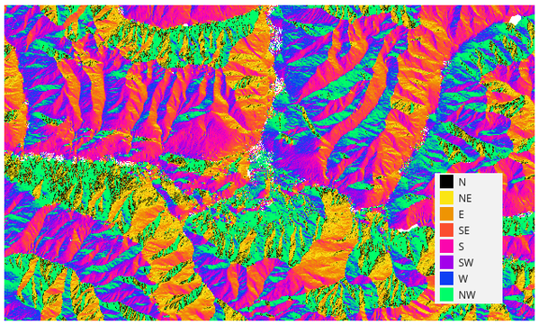
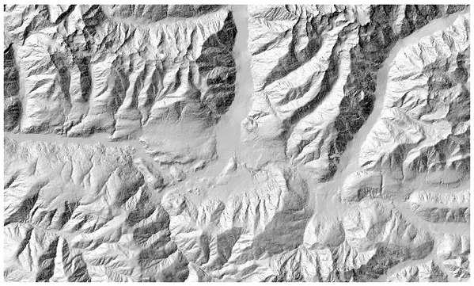
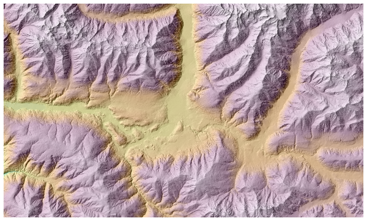
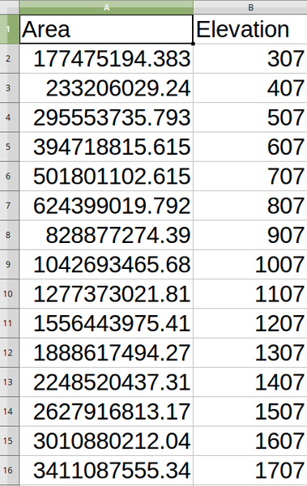
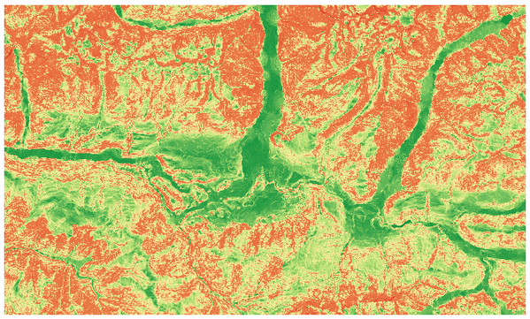
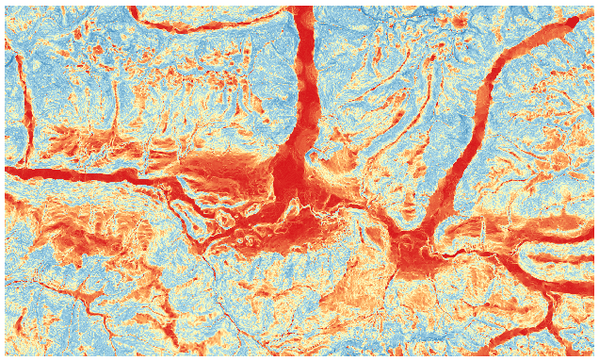

Raster terrain analysis
=======================

.. only:: html

   .. contents::
      :local:
      :depth: 1

.. _qgisaspect:

Aspect
------
Calculates the aspect of the Digital Terrain Model in input.
The final aspect raster layer contains values from 0 to 360 that
express the slope direction, starting from north (0°) and continuing
clockwise.

   Aspect values

The following picture shows the aspect layer reclassified with a color
ramp:

   Aspect layer reclassified

Parameters
..........

.. list-table::
   :header-rows: 1
   :widths: 20 20 20 40

   * - Label
     - Name
     - Type
     - Description
   * - **Elevation layer**
     - ``INPUT``
     - [raster]
     - Digital Terrain Model raster layer
   * - **Z factor**
     - ``Z_FACTOR``
     - [number]

       Default: 1.0
     - Vertical exaggeration.       
       This parameter is useful when the Z units differ from
       the X and Y units, for example feet and meters.
       You can use this parameter to adjust for this.
       The default is 1 (no exaggeration).
   * - **Aspect**
     - ``OUTPUT``
     - [raster]
     - Specify the output aspect raster layer. One of:

       * Save to a Temporary Layer (``TEMPORARY_OUTPUT``)
       * Save to File...

       The file encoding can also be changed here.

Outputs
.......

.. list-table::
   :header-rows: 1
   :widths: 20 20 20 40

   * - Label
     - Name
     - Type
     - Description
   * - **Aspect**
     - ``OUTPUT``
     - [raster]
     - The output aspect raster layer

Python code
...........

**Algorithm ID**: ``qgis:aspect``

.. include:: ../algs_include.rst
  :start-after: **algorithm_code_section**
  :end-before: **end_algorithm_code_section**

.. _qgishillshade:

Hillshade
---------
Calculates the hillshade raster layer given an input Digital Terrain
Model.

The shading of the layer is calculated according to the sun position:
you have the options to change both the horizontal angle (azimuth) and
the vertical angle (sun elevation) of the sun.

.. figure:: img/azimuth.png
   :align: center
   :scale: 50%

   Azimuth and vertical angle

The hillshade layer contains values from 0 (complete shadow) to 255
(complete sun).
Hillshade is used usually to better understand the relief of the area.

   Hillshade layer with azimuth 300 and vertical angle 45

Particularly interesting is to give the hillshade layer a transparency
value and overlap it with the elevation raster:

   Overlapping the hillshade with the elevation layer

Parameters
..........

.. list-table::
   :header-rows: 1
   :widths: 20 20 20 40
   :class: longtable

   * - Label
     - Name
     - Type
     - Description
   * - **Elevation layer**
     - ``INPUT``
     - [raster]
     - Digital Terrain Model raster layer
   * - **Z factor**
     - ``Z_FACTOR``
     - [number]

       Default: 1.0
     - Vertical exaggeration.       
       This parameter is useful when the Z units differ from
       the X and Y units, for example feet and meters.
       You can use this parameter to adjust for this.
       Increasing the value of this parameter will
       exaggerate the final result (making it look more "hilly").
       The default is 1 (no exaggeration).
   * - **Azimuth (horizontal angle)**
     - ``AZIMUTH``
     - [number]

       Default: 300.0
     - Set the horizontal angle (in degrees) of the sun (clockwise
       direction). Range: 0 to 360. 0 is north.
   * - **Vertical angle**
     - ``V_ANGLE``
     - [number]

       Default: 40.0
     - Set the vertical angle (in degrees) of the sun, that is the
       height of the sun.
       Values can go from 0 (minimum elevation) to 90 (maximum
       elevation).
   * - **Hillshade**
     - ``OUTPUT``
     - [raster]
     - Specify the output hillshade raster layer. One of:

       * Save to a Temporary Layer (``TEMPORARY_OUTPUT``)
       * Save to File...

       The file encoding can also be changed here.

Outputs
.......

.. list-table::
   :header-rows: 1
   :widths: 20 20 20 40

   * - Label
     - Name
     - Type
     - Description
   * - **Hillshade**
     - ``OUTPUT``
     - [raster]
     - The output hillshade raster layer

Python code
...........

**Algorithm ID**: ``qgis:hillshade``

.. include:: ../algs_include.rst
  :start-after: **algorithm_code_section**
  :end-before: **end_algorithm_code_section**

.. _qgishypsometriccurves:

Hypsometric curves
------------------
Calculates hypsometric curves for an input Digital Elevation Model.
Curves are produced as CSV files in an output folder specified by the
user.

A hypsometric curve is a cumulative histogram of elevation values in
a geographical area.

You can use hypsometric curves to detect differences in the landscape
due to the geomorphology of the territory.

Parameters
..........

.. list-table::
   :header-rows: 1
   :widths: 20 20 20 40
   :class: longtable

   * - Label
     - Name
     - Type
     - Description
   * - **DEM to analyze**
     - ``INPUT_DEM``
     - [raster]
     - Digital Terrain Model raster layer to use for
       calculating altitudes
   * - **Boundary layer**
     - ``BOUNDARY_LAYER``
     - [vector: polygon]
     - Polygon vector layer with boundaries of areas used
       to calculate hypsometric curves
   * - **Step**
     - ``STEP``
     - [number]

       Default: 100.0
     - Vertical distance between curves
   * - **Use % of area instead of absolute value**
     - ``USE_PERCENTAGE``
     - [boolean]

       Default: False
     - Write area percentage to “Area” field of the CSV file
       instead of the absolute area
   * - **Hypsometric curves**
     - ``OUTPUT_DIRECTORY``
     - [folder]
     - Specify the output folder for the hypsometric curves.
       One of:

       * Save to a Temporary Layer (``TEMPORARY_OUTPUT``)
       * Save to File...

       The file encoding can also be changed here.

Outputs
.......

.. list-table::
   :header-rows: 1
   :widths: 20 20 20 40

   * - Label
     - Name
     - Type
     - Description
   * - **Hypsometric curves**
     - ``OUTPUT_DIRECTORY``
     - [folder]
     - Directory containing the files with the hypsometric
       curves.
       For each feature from the input vector layer, a CSV file
       with area and altitude values will be created.
       
       The file names start with ``histogram_``, followed by
       layer name and feature ID.

Python code
...........

**Algorithm ID**: ``qgis:hypsometriccurves``

.. include:: ../algs_include.rst
  :start-after: **algorithm_code_section**
  :end-before: **end_algorithm_code_section**

.. _qgisrelief:

Relief
------
Creates a shaded relief layer from digital elevation data.
You can specify the relief color manually, or you can let the
algorithm choose automatically all the relief classes.

.. figure:: img/relief.png
   :align: center

   Relief layer

Parameters
..........

.. list-table::
   :header-rows: 1
   :widths: 20 20 20 40
   :class: longtable

   * - Label
     - Name
     - Type
     - Description
   * - **Elevation layer**
     - ``INPUT``
     - [raster]
     - Digital Terrain Model raster layer
   * - **Z factor**
     - ``Z_FACTOR``
     - [number]

       Default: 1.0
     - Vertical exaggeration.       
       This parameter is useful when the Z units differ from
       the X and Y units, for example feet and meters.
       You can use this parameter to adjust for this.
       Increasing the value of this parameter will
       exaggerate the final result (making it look more "hilly").
       The default is 1 (no exaggeration).
   * - **Generate relief classes automatically**
     - ``AUTO_COLORS``
     - [boolean]

       Default: False
     - If you check this option the algorithm will create all
       the relief color classes automatically       
   * - **Relief colors**

       Optional
     - ``COLORS``
     - [table widget]
     - Use the table widget if you want to choose the relief
       colors manually.
       You can add as many color classes as you want: for each
       class you can choose the lower and upper bound and
       finally by clicking on the color row you can choose the
       color thanks to the color widget.

       .. figure:: img/relief_table.png
          :align: center

          Manually setting of relief color classes

       The buttons in the right side panel give you the
       chance to: add or remove color classes, change the
       order of the color classes already defined, open an
       existing file with color classes and save the current
       classes as file.
   * - **Relief**
     - ``OUTPUT``
     - [raster]
       
       Default: ``[Save to temporary file]``
     - Specify the output relief raster layer. One of:

       * Save to a Temporary Layer (``TEMPORARY_OUTPUT``)
       * Save to File...

       The file encoding can also be changed here.
   * - **Frequency distribution**
     - ``FREQUENCY_DISTRIBUTION``
     - [table]
       
       Default: ``[Skip output]``
     - Specify the CSV table for the output frequency distribution.
       One of:

       * Skip Output
       * Save to a Temporary Layer (``TEMPORARY_OUTPUT``)
       * Save to File...

       The file encoding can also be changed here.

Outputs
.......

.. list-table::
   :header-rows: 1
   :widths: 20 20 20 40

   * - Label
     - Name
     - Type
     - Description
   * - **Relief**
     - ``OUTPUT``
     - [raster]
     - The output relief raster layer
   * - **Frequency distribution**
     - ``OUTPUT``
     - [table]
     - The output frequency distribution

Python code
...........

**Algorithm ID**: ``qgis:relief``

.. include:: ../algs_include.rst
  :start-after: **algorithm_code_section**
  :end-before: **end_algorithm_code_section**

.. _qgisruggednessindex:

Ruggedness index
----------------
Calculates the quantitative measurement of terrain heterogeneity
described by Riley et al. (1999).
It is calculated for every location, by summarizing the change in
elevation within the 3x3 pixel grid.

Each pixel contains the difference in elevation from a center cell and
the 8 cells surrounding it.

   Ruggedness layer from low (red) to high values (green)

Parameters
..........

.. list-table::
   :header-rows: 1
   :widths: 20 20 20 40

   * - Label
     - Name
     - Type
     - Description
   * - **Elevation layer**
     - ``INPUT``
     - [raster]
     - Digital Terrain Model raster layer
   * - **Z factor**
     - ``Z_FACTOR``
     - [number]

       Default: 1.0
     - Vertical exaggeration.       
       This parameter is useful when the Z units differ from
       the X and Y units, for example feet and meters.
       You can use this parameter to adjust for this.
       Increasing the value of this parameter will
       exaggerate the final result (making it look more rugged).
       The default is 1 (no exaggeration).
   * - **Ruggedness**
     - ``OUTPUT``
     - [raster]
       
       Default: ``[Save to temporary file]``
     - Specify the output ruggedness raster layer. One of:

       * Save to a Temporary Layer (``TEMPORARY_OUTPUT``)
       * Save to File...

       The file encoding can also be changed here.

Outputs
.......

.. list-table::
   :header-rows: 1
   :widths: 20 20 20 40

   * - Label
     - Name
     - Type
     - Description
   * - **Ruggedness**
     - ``OUTPUT``
     - [raster]
     - The output ruggedness raster layer

Python code
...........

**Algorithm ID**: ``qgis:ruggednessindex``

.. include:: ../algs_include.rst
  :start-after: **algorithm_code_section**
  :end-before: **end_algorithm_code_section**

.. _qgisslope:

Slope
-----
Calculates the slope from an input raster layer. The slope is the
angle of inclination of the terrain and is expressed in **degrees**.

In the following picture you can see to the left the DTM layer with
the elevation of the terrain while to the right the calculated slope:

   Flat areas in red, steep areas in blue

Parameters
..........

.. list-table::
   :header-rows: 1
   :widths: 20 20 20 40

   * - Label
     - Name
     - Type
     - Description
   * - **Elevation layer**
     - ``INPUT``
     - [raster]
     - Digital Terrain Model raster layer
   * - **Z factor**
     - ``Z_FACTOR``
     - [number]

       Default: 1.0
     - Vertical exaggeration.       
       This parameter is useful when the Z units differ from
       the X and Y units, for example feet and meters.
       You can use this parameter to adjust for this.
       Increasing the value of this parameter will
       exaggerate the final result (making it steeper).
       The default is 1 (no exaggeration).
   * - **Slope**
     - ``OUTPUT``
     - [raster]
       
       Default: ``[Save to temporary file]``
     - Specify the output slope raster layer. One of:

       * Save to a Temporary Layer (``TEMPORARY_OUTPUT``)
       * Save to File...

       The file encoding can also be changed here.

Outputs
.......

.. list-table::
   :header-rows: 1
   :widths: 20 20 20 40

   * - Label
     - Name
     - Type
     - Description
   * - **Slope**
     - ``OUTPUT``
     - [raster]
     - The output slope raster layer

Python code
...........

**Algorithm ID**: ``qgis:slope``

.. include:: ../algs_include.rst
  :start-after: **algorithm_code_section**
  :end-before: **end_algorithm_code_section**
