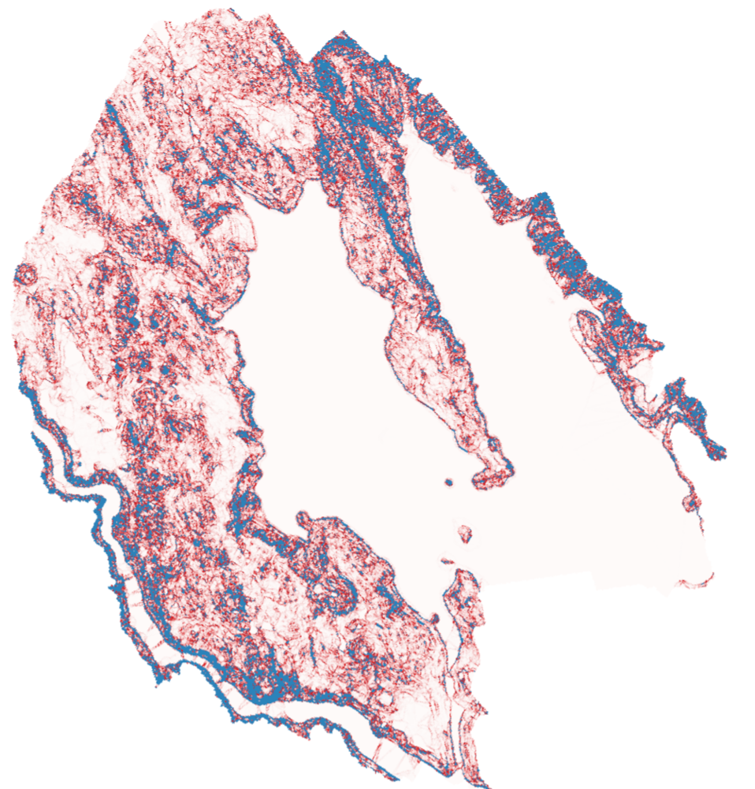

Raster terrain analysis
=======================

.. only:: html

   .. contents::
      :local:
      :depth: 1

.. _qgisaspect:

Aspect
------
Calculates the aspect of the Digital Terrain Model in input.
The final aspect raster layer contains values from 0 to 360 that
express the slope direction, starting from north (0°) and continuing
clockwise.

.. figure:: img/aspect.png
   :align: center
   :scale: 50%

   Aspect values

The following picture shows the aspect layer reclassified with a color
ramp:

.. figure:: img/aspect_2.png
   :align: center

   Aspect layer reclassified

Parameters
..........

Basic parameters
^^^^^^^^^^^^^^^^

.. list-table::
   :header-rows: 1
   :widths: 20 20 20 40
   :class: longtable

   * - Label
     - Name
     - Type
     - Description
   * - **Elevation layer**
     - ``INPUT``
     - [raster]
     - Digital Terrain Model raster layer
   * - **Z factor**
     - ``Z_FACTOR``
     - [numeric: double]

       Default: 1.0
     - Vertical exaggeration.
       This parameter is useful when the Z units differ from
       the X and Y units, for example feet and meters.
       You can use this parameter to adjust for this.
       The default is 1 (no exaggeration).
   * - **Aspect**
     - ``OUTPUT``
     - [raster]

       Default: ``[Save to temporary file]``
     - Specify the output aspect raster layer. :ref:`One of <output_parameter_widget>`:

       .. include:: ../algs_include.rst
          :start-after: **file_output_types**
          :end-before: **end_file_output_types**

Advanced parameters
^^^^^^^^^^^^^^^^^^^
|400|

.. list-table::
   :header-rows: 1
   :widths: 20 20 20 40
   :class: longtable

   * - Label
     - Name
     - Type
     - Description
   * - **Output NoData value**
     - ``NODATA``
     - [numeric: double]

       Default: -9999.0
     - Value to use for NoData cells in the output layer.
   * - **Creation options**

       Optional
     - ``CREATION_OPTIONS``
     - [string]

       Default: ''
     - For adding one or more creation options that control the raster
       to be created (colors, block size, file compression...).
       For convenience, you can rely on predefined profiles
       (see :ref:`GDAL driver options section <gdal_createoptions>`).

       Batch Process and Model Designer: separate multiple options
       with a pipe character (``|``).

Outputs
.......

.. list-table::
   :header-rows: 1
   :widths: 20 20 20 40
   :class: longtable

   * - Label
     - Name
     - Type
     - Description
   * - **Aspect**
     - ``OUTPUT``
     - [raster]
     - The output aspect raster layer

Python code
...........

**Algorithm ID**: ``native:aspect``

.. include:: ../algs_include.rst
  :start-after: **algorithm_code_section**
  :end-before: **end_algorithm_code_section**

.. _qgisdtmslopebasedfilter:

DTM filter (slope-based)
------------------------

Can be used to filter a digital elevation model in order to classify its cells into ground and object (non-ground) cells.

The tool uses concepts as described by Vosselman (2000)
and is based on the assumption that a large height difference between two nearby cells is unlikely to be caused by a steep slope in the terrain.
The probability that the higher cell might be non-ground increases when the distance between the two cells decreases.
Therefore the filter defines a maximum height difference (``dz_max``) between two cells as a function of the distance (``d``) between the cells (``dz_max( d ) = d``).
A cell is classified as terrain if there is no cell within the kernel radius
to which the height difference is larger than the allowed maximum height difference at the distance between these two cells.

The approximate terrain slope (``s``) parameter is used to modify the filter function
to match the overall slope in the study area (``dz_max( d ) = d * s``).
A 5 % confidence interval (``ci = 1.65 * sqrt( 2 * stddev )``) may be used to modify the filter function even further
by either relaxing (``dz_max( d ) = d * s + ci``) or amplifying (``dz_max( d ) = d * s - ci``) the filter criterium.

*References: Vosselman, G. (2000): Slope based filtering of laser altimetry data.
IAPRS, Vol. XXXIII, Part B3, Amsterdam, The Netherlands, 935-942*

.. seealso:: This tool is a port of the SAGA `DTM Filter (slope-based)`_

.. _`DTM Filter (slope-based)`: https://saga-gis.sourceforge.io/saga_tool_doc/9.9.1/grid_filter_7.html

Parameters
..........

Basic parameters
^^^^^^^^^^^^^^^^

.. list-table::
   :header-rows: 1
   :widths: 20 20 20 40
   :class: longtable

   * - Label
     - Name
     - Type
     - Description
   * - **Input layer**
     - ``INPUT``
     - [raster]
     - Digital Terrain Model raster layer
   * - **Band number**
     - ``BAND``
     - [raster band]
     - The band of the DEM to consider
   * - **Kernel radius (pixels)**
     - ``RADIUS``
     - [numeric: integer]

       Default: 5
     - The radius of the filter kernel (in pixels).
       Must be large enough to reach ground cells next to non-ground objects.
   * - **Terrain slope (%, pixel size/vertical units)**
     - ``TERRAIN_SLOPE``
     - [numeric: double]

       Default: 30.0
     - The approximate terrain slope in ``%``.
       The terrain slope must be adjusted to account for the ratio of height units vs raster pixel dimensions.
       Used to relax the filter criterium in steeper terrain.
   * - **Filter modification**
     - ``FILTER_MODIFICATION``
     - [list]

       Default: 0
     - Choose whether to apply the filter kernel without modification
       or to use a confidence interval to relax or amplify the height criterium.

       * 0 - None
       * 1 - Relax filter
       * 2 - Amplify
   * - **Standard deviation**
     - ``STANDARD_DEVIATION``
     - [numeric: double]

       Default: 0.1
     - The standard deviation used to calculate a 5% confidence interval applied to the height threshold.
   * - **Output layer (ground)**

       Optional
     - ``OUTPUT_GROUND``
     - [raster]

       Default: ``[Save to temporary file]``
     - Specify the filtered DEM containing only cells classified as ground.
       :ref:`One of <output_parameter_widget>`:

       .. include:: ../algs_include.rst
          :start-after: **file_output_types_skip**
          :end-before: **end_file_output_types_skip**

   * - **Output layer (non-ground objects)**

       Optional
     - ``OUTPUT_NONGROUND``
     - [raster]

       Default: ``[Skip output]``
     - Specify the non-ground objects removed by the filter.
       :ref:`One of <output_parameter_widget>`:

       .. include:: ../algs_include.rst
          :start-after: **file_output_types_skip**
          :end-before: **end_file_output_types_skip**

Advanced parameters
^^^^^^^^^^^^^^^^^^^

.. list-table::
   :header-rows: 1
   :widths: 20 20 20 40
   :class: longtable

   * - Label
     - Name
     - Type
     - Description
   * - **Creation options**

       Optional
     - ``CREATION_OPTIONS`` (for QGIS <= 3.42, this was ``CREATE_OPTIONS``)
     - [string]

       Default: ''
     - For adding one or more creation options that control the
       raster to be created (colors, block size, file
       compression...).
       For convenience, you can rely on predefined profiles (see
       :ref:`GDAL driver options section <gdal_createoptions>`).

       Batch Process and Model Designer: separate multiple options with a pipe
       character (``|``).

Outputs
.......

.. list-table::
   :header-rows: 1
   :widths: 20 20 20 40
   :class: longtable

   * - Label
     - Name
     - Type
     - Description
   * - **Output layer (ground)**
     - ``OUTPUT_GROUND``
     - [raster]
     - The filtered DEM containing only cells classified as ground.
   * - **Output layer (non-ground objects)**
     - ``OUTPUT_NONGROUND``
     - [raster]
     - The non-ground objects removed by the filter.

Python code
...........

**Algorithm ID**: ``native:dtmslopebasedfilter``

.. include:: ../algs_include.rst
  :start-after: **algorithm_code_section**
  :end-before: **end_algorithm_code_section**

.. _qgisfillsinkswangliu:

Fill sinks (Wang & Liu)
------------------------
|344|

Uses a method proposed by Wang & Liu to identify and fill surface depressions in digital elevation models.

The method was enhanced to allow the creation of hydrologically sound elevation models,
i.e. not only to fill the depression(s) but also to preserve a downward slope along the flow path.
If desired, this is accomplished by preserving a minimum slope gradient (and thus elevation difference) between cells.

*References: Wang, L. & H. Liu (2006): An efficient method for identifying and filling surface depressions
in digital elevation models for hydrologic analysis and modelling.
International Journal of Geographical Information Science, Vol. 20, No. 2: 193-213.*

.. seealso:: This tool is a port of the SAGA `Fill Sinks (Wang & Liu)`_ tool.

.. _`Fill Sinks (Wang & Liu)`: https://saga-gis.sourceforge.io/saga_tool_doc/9.9.1/ta_preprocessor_4.html

Parameters
..........

Basic parameters
^^^^^^^^^^^^^^^^

.. list-table::
   :header-rows: 1
   :widths: 20 20 20 40
   :class: longtable

   * - Label
     - Name
     - Type
     - Description
   * - **Input layer**
     - ``INPUT``
     - [raster]
     - Digital Terrain Model raster layer
   * - **Band number**
     - ``BAND``
     - [raster band]

       Default: 1
     - The band of the DEM to consider
   * - **Minimum slope (degrees)**
     - ``MIN_SLOPE``
     - [numeric: double]

       Default: 0.10
     - Minimum slope gradient to preserve from cell to cell;
       with a value of zero, sinks are filled up to the spill elevation
       (which results in flat areas).
   * - **Output layer (filled DEM)**

       Optional
     - ``OUTPUT_FILLED_DEM``
     - [raster]

       Default: ``[Save to temporary file]``
     - Specify the ouput raster corresponding to the depression-free DEM.
       :ref:`One of <output_parameter_widget>`:

       .. include:: ../algs_include.rst
          :start-after: **file_output_types_skip**
          :end-before: **end_file_output_types_skip**

   * - **Output layer (flow directions)**

       Optional
     - ``OUTPUT_FLOW_DIRECTIONS``
     - [raster]

       Default: ``[Skip output]``
     - Specify the output raster with computed flow directions.
       :ref:`One of <output_parameter_widget>`:

       .. include:: ../algs_include.rst
          :start-after: **file_output_types_skip**
          :end-before: **end_file_output_types_skip**

   * - **Output layer (watershed basins)**

       Optional
     - ``OUTPUT_WATERSHED_BASINS``
     - [raster]

       Default: ``[Skip output]``
     - Specify the output raster corresponding to the delineated watershed basins.
       :ref:`One of <output_parameter_widget>`:

       .. include:: ../algs_include.rst
          :start-after: **file_output_types_skip**
          :end-before: **end_file_output_types_skip**

Advanced parameters
^^^^^^^^^^^^^^^^^^^

.. list-table::
   :header-rows: 1
   :widths: 20 20 20 40
   :class: longtable

   * - Label
     - Name
     - Type
     - Description
   * - **Creation options**

       Optional
     - ``CREATION_OPTIONS``
     - [string]

       Default: ''
     - For adding one or more creation options that control the
       raster to be created (colors, block size, file
       compression...).
       For convenience, you can rely on predefined profiles (see
       :ref:`GDAL driver options section <gdal_createoptions>`).

       Batch Process and Model Designer: separate multiple options with a pipe
       character (``|``).

Outputs
.......

.. list-table::
   :header-rows: 1
   :widths: 20 20 20 40
   :class: longtable

   * - Label
     - Name
     - Type
     - Description
   * - **Output layer (filled DEM)**
     - ``OUTPUT_FILLED_DEM``
     - [raster]
     - Ouput raster corresponding to the depression-free digital elevation model.
   * - **Output layer (flow directions)**
     - ``OUTPUT_FLOW_DIRECTIONS``
     - [raster]
     - Output raster with computed flow directions; 0=N, 1=NE, 2=E, ... 7=NW.
   * - **Output layer (watershed basins)**
     - ``OUTPUT_WATERSHED_BASINS``
     - [raster]
     - Output raster corresponding to the delineated watershed basins.

Python code
...........

**Algorithm ID**: ``native:fillsinkswangliu``

.. include:: ../algs_include.rst
  :start-after: **algorithm_code_section**
  :end-before: **end_algorithm_code_section**

.. _qgishillshade:

Hillshade
---------
Calculates the hillshade raster layer given an input Digital Terrain
Model.

The shading of the layer is calculated according to the sun position:
you have the options to change both the horizontal angle (azimuth) and
the vertical angle (sun elevation) of the sun.

.. figure:: img/azimuth.png
   :align: center
   :scale: 50%

   Azimuth and vertical angle

The hillshade layer contains values from 0 (complete shadow) to 255
(complete sun).
Hillshade is used usually to better understand the relief of the area.

.. figure:: img/hillshade.png
   :align: center

   Hillshade layer with azimuth 300 and vertical angle 45

Particularly interesting is to give the hillshade layer a transparency
value and overlap it with the elevation raster:

.. figure:: img/hillshade_2.png
   :align: center

   Overlapping the hillshade with the elevation layer

Parameters
..........

Basic parameters
^^^^^^^^^^^^^^^^

.. list-table::
   :header-rows: 1
   :widths: 20 20 20 40
   :class: longtable

   * - Label
     - Name
     - Type
     - Description
   * - **Elevation layer**
     - ``INPUT``
     - [raster]
     - Digital Terrain Model raster layer
   * - **Z factor**
     - ``Z_FACTOR``
     - [numeric: double]

       Default: 1.0
     - Vertical exaggeration.
       This parameter is useful when the Z units differ from
       the X and Y units, for example feet and meters.
       You can use this parameter to adjust for this.
       Increasing the value of this parameter will
       exaggerate the final result (making it look more "hilly").
       The default is 1 (no exaggeration).
   * - **Azimuth (horizontal angle)**
     - ``AZIMUTH``
     - [numeric: double]

       Default: 300.0
     - Set the horizontal angle (in degrees) of the sun (clockwise
       direction). Range: 0 to 360. 0 is north.
   * - **Vertical angle**
     - ``V_ANGLE``
     - [numeric: double]

       Default: 40.0
     - Set the vertical angle (in degrees) of the sun, that is the
       height of the sun.
       Values can go from 0 (minimum elevation) to 90 (maximum
       elevation).
   * - **Hillshade**
     - ``OUTPUT``
     - [raster]

       Default: ``Save to temporary file``
     - Specify the output hillshade raster layer. :ref:`One of <output_parameter_widget>`:

       .. include:: ../algs_include.rst
          :start-after: **file_output_types**
          :end-before: **end_file_output_types**

Advanced parameters
^^^^^^^^^^^^^^^^^^^
|400|

.. list-table::
   :header-rows: 1
   :widths: 20 20 20 40
   :class: longtable

   * - Label
     - Name
     - Type
     - Description
   * - **Output NoData value**
     - ``NODATA``
     - [numeric: double]

       Default: -9999.0
     - Value to use for NoData cells in the output layer.
   * - **Creation options**

       Optional
     - ``CREATION_OPTIONS``
     - [string]

       Default: ''
     - For adding one or more creation options that control the raster
       to be created (colors, block size, file compression...).
       For convenience, you can rely on predefined profiles
       (see :ref:`GDAL driver options section <gdal_createoptions>`).

       Batch Process and Model Designer: separate multiple options
       with a pipe character (``|``).

Outputs
.......

.. list-table::
   :header-rows: 1
   :widths: 20 20 20 40
   :class: longtable

   * - Label
     - Name
     - Type
     - Description
   * - **Hillshade**
     - ``OUTPUT``
     - [raster]
     - The output hillshade raster layer

Python code
...........

**Algorithm ID**: ``native:hillshade``

.. include:: ../algs_include.rst
  :start-after: **algorithm_code_section**
  :end-before: **end_algorithm_code_section**

.. _qgishypsometriccurves:

Hypsometric curves
------------------
Calculates hypsometric curves for an input Digital Elevation Model.
Curves are produced as CSV files in an output folder specified by the
user.

A hypsometric curve is a cumulative histogram of elevation values in
a geographical area.

You can use hypsometric curves to detect differences in the landscape
due to the geomorphology of the territory.

Parameters
..........

.. list-table::
   :header-rows: 1
   :widths: 20 20 20 40
   :class: longtable

   * - Label
     - Name
     - Type
     - Description
   * - **DEM to analyze**
     - ``INPUT_DEM``
     - [raster]
     - Digital Terrain Model raster layer to use for
       calculating altitudes
   * - **Boundary layer**
     - ``BOUNDARY_LAYER``
     - [vector: polygon]
     - Polygon vector layer with boundaries of areas used
       to calculate hypsometric curves
   * - **Step**
     - ``STEP``
     - [numeric: double]

       Default: 100.0
     - Vertical distance between curves
   * - **Use % of area instead of absolute value**
     - ``USE_PERCENTAGE``
     - [boolean]

       Default: False
     - Write area percentage to “Area” field of the CSV file
       instead of the absolute area
   * - **Hypsometric curves**
     - ``OUTPUT_DIRECTORY``
     - [folder]
     - Specify the output folder for the hypsometric curves.
       :ref:`One of <output_parameter_widget>`:

       .. include:: ../algs_include.rst
          :start-after: **directory_output_types**
          :end-before: **end_directory_output_types**

Outputs
.......

.. list-table::
   :header-rows: 1
   :widths: 20 20 20 40
   :class: longtable

   * - Label
     - Name
     - Type
     - Description
   * - **Hypsometric curves**
     - ``OUTPUT_DIRECTORY``
     - [folder]
     - Directory containing the files with the hypsometric
       curves.
       For each feature from the input vector layer, a CSV file
       with area and altitude values will be created.

       The file names start with ``histogram_``, followed by
       layer name and feature ID.

.. figure:: img/hypsometric.png
   :align: center
   :scale: 50%

Python code
...........

**Algorithm ID**: ``qgis:hypsometriccurves``

.. include:: ../algs_include.rst
  :start-after: **algorithm_code_section**
  :end-before: **end_algorithm_code_section**

.. _qgisrelief:

Relief
------
Creates a shaded relief layer from digital elevation data.
You can specify the relief color manually, or you can let the
algorithm choose automatically all the relief classes.

.. figure:: img/relief.png
   :align: center

   Relief layer

Parameters
..........

.. list-table::
   :header-rows: 1
   :widths: 20 20 20 40
   :class: longtable

   * - Label
     - Name
     - Type
     - Description
   * - **Elevation layer**
     - ``INPUT``
     - [raster]
     - Digital Terrain Model raster layer
   * - **Z factor**
     - ``Z_FACTOR``
     - [numeric: double]

       Default: 1.0
     - Vertical exaggeration.
       This parameter is useful when the Z units differ from
       the X and Y units, for example feet and meters.
       You can use this parameter to adjust for this.
       Increasing the value of this parameter will
       exaggerate the final result (making it look more "hilly").
       The default is 1 (no exaggeration).
   * - **Generate relief classes automatically**
     - ``AUTO_COLORS``
     - [boolean]

       Default: False
     - If you check this option the algorithm will create all
       the relief color classes automatically
   * - **Relief colors**

       Optional
     - ``COLORS``
     - [table widget]
     - Use the table widget if you want to choose the relief
       colors manually.
       You can add as many color classes as you want: for each
       class you can choose the lower and upper bound and
       finally by clicking on the color row you can choose the
       color thanks to the color widget.

       .. figure:: img/relief_table.png
          :align: center

          Manually setting of relief color classes

       The buttons in the right side panel give you the
       chance to: add or remove color classes, change the
       order of the color classes already defined, open an
       existing file with color classes and save the current
       classes as file.
   * - **Relief**
     - ``OUTPUT``
     - [raster]

       Default: ``[Save to temporary file]``
     - Specify the output relief raster layer. :ref:`One of <output_parameter_widget>`:

       .. include:: ../algs_include.rst
          :start-after: **file_output_types**
          :end-before: **end_file_output_types**

   * - **Frequency distribution**

       Optional
     - ``FREQUENCY_DISTRIBUTION``
     - [vector: table]

       Default: ``[Skip output]``
     - Specify the CSV table for the output frequency distribution.
       :ref:`One of <output_parameter_widget>`:

       .. include:: ../algs_include.rst
          :start-after: **file_output_types_skip**
          :end-before: **end_file_output_types_skip**

Outputs
.......

.. list-table::
   :header-rows: 1
   :widths: 20 20 20 40
   :class: longtable

   * - Label
     - Name
     - Type
     - Description
   * - **Relief**
     - ``OUTPUT``
     - [raster]
     - The output relief raster layer
   * - **Frequency distribution**
     - ``OUTPUT``
     - [vector: table]
     - The output frequency distribution

Python code
...........

**Algorithm ID**: ``qgis:relief``

.. include:: ../algs_include.rst
  :start-after: **algorithm_code_section**
  :end-before: **end_algorithm_code_section**

.. _qgisruggednessindex:

Ruggedness index
----------------
Calculates the quantitative measurement of terrain heterogeneity
described by Riley et al. (1999).
It is calculated for every location, by summarizing the change in
elevation within the 3x3 pixel grid.

Each pixel contains the difference in elevation from a center cell and
the 8 cells surrounding it.

.. figure:: img/ruggedness.png
   :align: center

   Ruggedness layer from low (red) to high values (green)

Parameters
..........

Basic parameters
^^^^^^^^^^^^^^^^

.. list-table::
   :header-rows: 1
   :widths: 20 20 20 40
   :class: longtable

   * - Label
     - Name
     - Type
     - Description
   * - **Elevation layer**
     - ``INPUT``
     - [raster]
     - Digital Terrain Model raster layer
   * - **Z factor**
     - ``Z_FACTOR``
     - [numeric: double]

       Default: 1.0
     - Vertical exaggeration.
       This parameter is useful when the Z units differ from
       the X and Y units, for example feet and meters.
       You can use this parameter to adjust for this.
       Increasing the value of this parameter will
       exaggerate the final result (making it look more rugged).
       The default is 1 (no exaggeration).
   * - **Ruggedness**
     - ``OUTPUT``
     - [raster]

       Default: ``[Save to temporary file]``
     - Specify the output ruggedness raster layer. :ref:`One of <output_parameter_widget>`:

       .. include:: ../algs_include.rst
          :start-after: **file_output_types**
          :end-before: **end_file_output_types**

Advanced parameters
^^^^^^^^^^^^^^^^^^^
|400|

.. list-table::
   :header-rows: 1
   :widths: 20 20 20 40
   :class: longtable

   * - Label
     - Name
     - Type
     - Description
   * - **Output NoData value**
     - ``NODATA``
     - [numeric: double]

       Default: -9999.0
     - Value to use for NoData cells in the output layer.
   * - **Creation options**

       Optional
     - ``CREATION_OPTIONS``
     - [string]

       Default: ''
     - For adding one or more creation options that control the raster
       to be created (colors, block size, file compression...).
       For convenience, you can rely on predefined profiles
       (see :ref:`GDAL driver options section <gdal_createoptions>`).

       Batch Process and Model Designer: separate multiple options
       with a pipe character (``|``).

Outputs
.......

.. list-table::
   :header-rows: 1
   :widths: 20 20 20 40
   :class: longtable

   * - Label
     - Name
     - Type
     - Description
   * - **Ruggedness**
     - ``OUTPUT``
     - [raster]
     - The output ruggedness raster layer

Python code
...........

**Algorithm ID**: ``native:ruggednessindex``

.. include:: ../algs_include.rst
  :start-after: **algorithm_code_section**
  :end-before: **end_algorithm_code_section**

.. _qgisslope:

Slope
-----
Calculates the slope from an input raster layer. The slope is the
angle of inclination of the terrain and is expressed in **degrees**.

.. figure:: img/slope.png
   :align: center

   Flat areas in red, steep areas in blue

Parameters
..........

Basic parameters
^^^^^^^^^^^^^^^^

.. list-table::
   :header-rows: 1
   :widths: 20 20 20 40
   :class: longtable

   * - Label
     - Name
     - Type
     - Description
   * - **Elevation layer**
     - ``INPUT``
     - [raster]
     - Digital Terrain Model raster layer
   * - **Z factor**
     - ``Z_FACTOR``
     - [numeric: double]

       Default: 1.0
     - Vertical exaggeration.
       This parameter is useful when the Z units differ from
       the X and Y units, for example feet and meters.
       You can use this parameter to adjust for this.
       Increasing the value of this parameter will
       exaggerate the final result (making it steeper).
       The default is 1 (no exaggeration).
   * - **Slope**
     - ``OUTPUT``
     - [raster]

       Default: ``[Save to temporary file]``
     - Specify the output slope raster layer. :ref:`One of <output_parameter_widget>`:

       .. include:: ../algs_include.rst
          :start-after: **file_output_types**
          :end-before: **end_file_output_types**

Advanced parameters
^^^^^^^^^^^^^^^^^^^
|400|

.. list-table::
   :header-rows: 1
   :widths: 20 20 20 40
   :class: longtable

   * - Label
     - Name
     - Type
     - Description
   * - **Output NoData value**
     - ``NODATA``
     - [numeric: double]

       Default: -9999.0
     - Value to use for NoData cells in the output layer.
   * - **Creation options**

       Optional
     - ``CREATION_OPTIONS``
     - [string]

       Default: ''
     - For adding one or more creation options that control the raster
       to be created (colors, block size, file compression...).
       For convenience, you can rely on predefined profiles
       (see :ref:`GDAL driver options section <gdal_createoptions>`).

       Batch Process and Model Designer: separate multiple options
       with a pipe character (``|``).

Outputs
.......

.. list-table::
   :header-rows: 1
   :widths: 20 20 20 40
   :class: longtable

   * - Label
     - Name
     - Type
     - Description
   * - **Slope**
     - ``OUTPUT``
     - [raster]
     - The output slope raster layer

Python code
...........

**Algorithm ID**: ``native:slope``

.. include:: ../algs_include.rst
  :start-after: **algorithm_code_section**
  :end-before: **end_algorithm_code_section**

.. _nativetotalcurvature:

Total curvature
---------------
|400|

Calculates the total curvature from an input raster layer. The curvature is the second
derivative of the surface, revealing terrain features like ridges (positive curvature,
convex) and valleys (negative, concave), with zero indicating flat or saddle points.

   Total curvature

Parameters
..........

Basic parameters
^^^^^^^^^^^^^^^^

.. list-table::
   :header-rows: 1
   :widths: 20 20 20 40
   :class: longtable

   * - Label
     - Name
     - Type
     - Description
   * - **Elevation layer**
     - ``INPUT``
     - [raster]
     - Digital Terrain Model raster layer
   * - **Z factor**
     - ``Z_FACTOR``
     - [numeric: double]

       Default: 1.0
     - Vertical exaggeration.
       This parameter is useful when the Z units differ from
       the X and Y units, for example feet and meters.
       You can use this parameter to adjust for this.
       Increasing the value of this parameter will
       exaggerate the final result (making it steeper).
       The default is 1 (no exaggeration).
   * - **Total curvature**
     - ``OUTPUT``
     - [raster]

       Default: ``[Save to temporary file]``
     - Specify the output total curvature raster layer. :ref:`One of <output_parameter_widget>`:

       .. include:: ../algs_include.rst
          :start-after: **file_output_types**
          :end-before: **end_file_output_types**

Advanced parameters
^^^^^^^^^^^^^^^^^^^

.. list-table::
   :header-rows: 1
   :widths: 20 20 20 40
   :class: longtable

   * - Label
     - Name
     - Type
     - Description
   * - **Output NoData value**
     - ``NODATA``
     - [numeric: double]

       Default: -9999.0
     - Value to use for NoData cells in the output layer.
   * - **Creation options**

       Optional
     - ``CREATION_OPTIONS``
     - [string]

       Default: ''
     - For adding one or more creation options that control the raster
       to be created (colors, block size, file compression...).
       For convenience, you can rely on predefined profiles
       (see :ref:`GDAL driver options section <gdal_createoptions>`).

       Batch Process and Model Designer: separate multiple options
       with a pipe character (``|``).

Outputs
.......

.. list-table::
   :header-rows: 1
   :widths: 20 20 20 40
   :class: longtable

   * - Label
     - Name
     - Type
     - Description
   * - **Total curvature**
     - ``OUTPUT``
     - [raster]
     - The output total curvature raster layer

Python code
...........

**Algorithm ID**: ``native:totalcurvature``

.. include:: ../algs_include.rst
  :start-after: **algorithm_code_section**
  :end-before: **end_algorithm_code_section**

.. Substitutions definitions - AVOID EDITING PAST THIS LINE
   This will be automatically updated by the find_set_subst.py script.
   If you need to create a new substitution manually,
   please add it also to the substitutions.txt file in the
   source folder.

.. |344| replace:: ``NEW in 3.44``
.. |400| replace:: ``NEW in 4.0``
