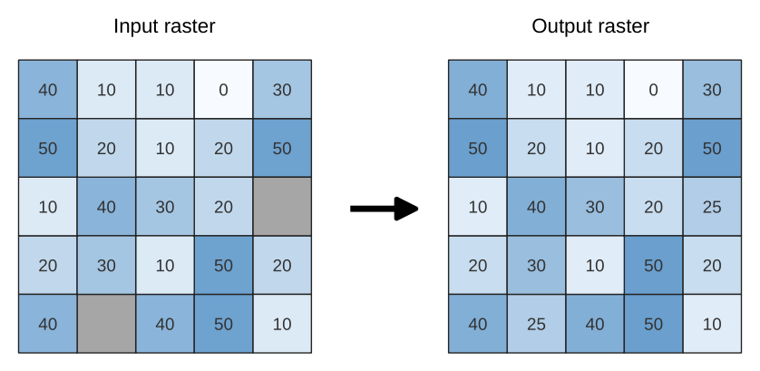

Raster tools
============

.. only:: html

   .. contents::
      :local:
      :depth: 1

.. _qgisrasterize:

Convert map to raster
---------------------
Creates a raster image of map canvas content.

A :ref:`map theme <map_themes>` can be selected to render a
predetermined set of layers with a defined style for each layer.

Alternatively, a single layer can be selected if no map theme is set.

If neither map theme nor layer is set, the current map content will be
rendered.
The minimum extent entered will internally be extended to be a
multiple of the tile size.

Parameters
..........

.. list-table::
   :header-rows: 1
   :widths: 20 20 20 40
   :class: longtable

   * - Label
     - Name
     - Type
     - Description
   * - **Minimum extent to render (xmin, xmax, ymin, ymax)**
     - ``EXTENT``
     - [extent]
     - Specify the extent of the output raster layer.
       It will internally be extended to a multiple of the tile size.

       .. include:: ../algs_include.rst
          :start-after: **extent_options**
          :end-before: **end_extent_options**

   * - **Tile size**
     - ``TILE_SIZE``
     - [number]
       
       Default: 1024
     - Size of the tile of the output raster layer. Minimum value: 64.
   * - **Map units per pixel**
     - ``MAP_UNITS_PER_PIXEL``
     - [number]
       
       Default: 100.0
     - Pixel size (in map units). Minimum value: 0.0
   * - **Make background transparent**
     - ``MAKE_BACKGROUND_TRANSPARENT``
     - [boolean]
        
       Default: False
     - Allows exporting the map with a transparent background.
       Outputs an RGBA (instead of RGB) image if set to ``True``.
   * - **Map theme to render**
       
       Optional
     - ``MAP_THEME``
     - [enumeration]
     - Use an existing :ref:`map theme <map_themes>` for the
       rendering.
   * - **Single layer to render**
       
       Optional
     - ``LAYER``
     - [enumeration]
     - Choose a single layer for the rendering
   * - **Output layer**
     - ``OUTPUT``
     - [raster]

       Default: ``[Save to temporary file]``
     - Specification of the output raster. One of:

       .. include:: ../algs_include.rst
          :start-after: **file_output_types**
          :end-before: **end_file_output_types**

Outputs
.......

.. list-table::
   :header-rows: 1
   :widths: 20 20 20 40

   * - Label
     - Name
     - Type
     - Description
   * - **Output layer**
     - ``OUTPUT``
     - [raster]
     - Output raster layer
  
Python code
...........

**Algorithm ID**: ``qgis:rasterize``

.. include:: ../algs_include.rst
  :start-after: **algorithm_code_section**
  :end-before: **end_algorithm_code_section**

.. _qgisfillnodata:

Fill NoData cells
-----------------

Resets the NoData values in the input raster to a chosen value, resulting in
raster dataset with no NoData pixels.

The algorithm respects the input raster data type, e.g. a floating point
fill value will be truncated when applied to an integer raster.

  Filling NoData values (in grey) of a raster

Parameters
..........

.. list-table::
   :header-rows: 1
   :widths: 20 20 20 40

   * - Label
     - Name
     - Type
     - Description
   * - **Input raster**
     - ``INPUT``
     - [raster]
     - The raster to process.
   * - **Band number**
     - ``BAND``
     - [number]

       Default: 1
     - The band of the raster
   * - **Fill value**
     - ``FILL_VALUE``
     - [number]

       Default: 1.0
     - Set the value to use for the NoData pixels
   * - **Output raster**
     - ``OUTPUT``
     - [raster]

       Default: ``[Save to temporary file]``
     - Specification of the output raster. One of:

       .. include:: ../algs_include.rst
          :start-after: **file_output_types**
          :end-before: **end_file_output_types**

Outputs
.......

.. list-table::
   :header-rows: 1
   :widths: 20 20 20 40

   * - Label
     - Name
     - Type
     - Description
   * - **Output raster**
     - ``OUTPUT``
     - [raster]
     - The output raster layer with filled data cells.

Python code
...........

**Algorithm ID**: ``native:fillnodata``

.. include:: ../algs_include.rst
  :start-after: **algorithm_code_section**
  :end-before: **end_algorithm_code_section**

.. _qgistilesxyzdirectory:

Generate XYZ tiles (Directory)
-----------------------------------

Generates raster “XYZ” tiles using the current QGIS project
as individual images to a directory structure.

Parameters
..........

.. list-table::
   :header-rows: 1
   :widths: 20 20 20 40
   :class: longtable

   * - Label
     - Name
     - Type
     - Description
   * - **Extent (xmin, xmax, ymin, ymax)**
     - ``EXTENT``
     - [extent]
     - Specify the extent of the tiles.
       It will internally be extended to a multiple of the tile size.

       .. include:: ../algs_include.rst
          :start-after: **extent_options**
          :end-before: **end_extent_options**

   * - **Minimum zoom**
     - ``ZOOM_MIN``
     - [number]

       Default: 12
     - Minimum 0, maximum 25.
   * - **Maximum zoom**
     - ``ZOOM_MAX``
     - [number]

       Default: 12
     - Minimum 0, maximum 25.
   * - **DPI**
     - ``DPI``
     - [number]

       Default: 96
     - Minimum 48, maximum 600.
   * - **Background color**

       Optional
     - ``BACKGROUND_COLOR``
     - [color]

       Default: QColor(0, 0, 0, 0)
     - Choose the background color for the tiles
   * - **Tile format**
     - ``TILE_FORMAT``
     - [enumeration]

       Default: 0
     - One of:

       * 0 --- PNG
       * 1 --- JPG

   * - **Quality (JPG only)**

       Optional
     - ``QUALITY``
     - [number]

       Default: 75
     - Minimum 1, maximum 100.
   * - **Metatile size**

       Optional
     - ``METATILESIZE``
     - [number]

       Default: 4
     - Specify a custom metatile size when generating XYZ tiles.
       Larger values may speed up the rendering of tiles and provide
       better labelling (fewer gaps without labels) at the expense of
       using more memory.
       Minimum 1, maximum 20.
   * - **Tile width**

       Optional
     - ``TILE_WIDTH``
     - [number]

       Default: 256
     - Minimum 1, maximum 4096.
   * - **Tile height**

       Optional
     - ``TILE_HEIGHT``
     - [number]

       Default: 256
     - Minimum 1, maximum 4096.
   * - **Use inverted tile Y axis (TMS conventions)**

       Optional
     - ``TMS_CONVENTION``
     - [boolean]

       Default: False
     - 
   * - **Output directory**
     - ``OUTPUT_DIRECTORY``
     - [folder]

       Default: ``[Save to temporary folder]``
     - Specification of the output raster. One of:

       .. include:: ../algs_include.rst
          :start-after: **directory_output_types_skip**
          :end-before: **end_directory_output_types_skip**

   * - **Output html (Leaflet)**
     - ``OUTPUT_HTML``
     - [html]

       Default: ``[Save to temporary file]``
     - Specification of the output HTML file. One of:

       .. include:: ../algs_include.rst
          :start-after: **file_output_types_skip**
          :end-before: **end_file_output_types_skip**

Outputs
.......

.. list-table::
   :header-rows: 1
   :widths: 20 20 20 40

   * - Label
     - Name
     - Type
     - Description
   * - **Output directory**
     - ``OUTPUT_DIRECTORY``
     - [folder]
     - Output directory (for the tiles)
   * - **Output html (Leaflet)**
     - ``OUTPUT_HTML``
     - [html]
     - The output HTML (Leaflet) file

Python code
...........

**Algorithm ID**: ``qgis:tilesxyzdirectory``

.. include:: ../algs_include.rst
  :start-after: **algorithm_code_section**
  :end-before: **end_algorithm_code_section**

.. _qgistilesxyzmbtiles:

Generate XYZ tiles (MBTiles)
---------------------------------

Generates raster “XYZ” tiles using the current QGIS project
as a single file in the “MBTiles” format.

Parameters
..........

.. list-table::
   :header-rows: 1
   :widths: 20 20 20 40
   :class: longtable

   * - Label
     - Name
     - Type
     - Description
   * - **Extent (xmin, xmax, ymin, ymax)**
     - ``EXTENT``
     - [extent]
     - Specify the extent of the tiles.
       It will internally be extended to a multiple of the tile size.

       .. include:: ../algs_include.rst
          :start-after: **extent_options**
          :end-before: **end_extent_options**

   * - **Minimum zoom**
     - ``ZOOM_MIN``
     - [number]

       Default: 12
     - Minimum 0, maximum 25.
   * - **Maximum zoom**
     - ``ZOOM_MAX``
     - [number]

       Default: 12
     - Minimum 0, maximum 25.
   * - **DPI**
     - ``DPI``
     - [number]

       Default: 96
     - Minimum 48, maximum 600.
   * - **Background color**

       Optional
     - ``BACKGROUND_COLOR``
     - [color]

       Default: QColor(0, 0, 0, 0)
     - Choose the background color for the tiles
   * - **Tile format**
     - ``TILE_FORMAT``
     - [enumeration]

       Default: 0
     - One of:

       * 0 --- PNG
       * 1 --- JPG

   * - **Quality (JPG only)**

       Optional
     - ``QUALITY``
     - [number]

       Default: 75
     - Minimum 1, maximum 100.
   * - **Metatile size**

       Optional
     - ``METATILESIZE``
     - [number]

       Default: 4
     - Specify a custom metatile size when generating XYZ tiles.
       Larger values may speed up the rendering of tiles and provide
       better labelling (fewer gaps without labels) at the expense of
       using more memory.
       Minimum 1, maximum 20.
   * - **Output file (for MBTiles)**
     - ``OUTPUT_FILE``
     - [file]

       Default: ``[Save to temporary file]``
     - Specification of the output file. One of:

       .. include:: ../algs_include.rst
          :start-after: **file_output_types_skip**
          :end-before: **end_file_output_types_skip**

Outputs
.......

.. list-table::
   :header-rows: 1
   :widths: 20 20 20 40

   * - Label
     - Name
     - Type
     - Description
   * - **Output file (for MBTiles)**
     - ``OUTPUT_FILE``
     - [file]
     - The output file.

Python code
...........

**Algorithm ID**: ``qgis:tilesxyzmbtiles``

.. include:: ../algs_include.rst
  :start-after: **algorithm_code_section**
  :end-before: **end_algorithm_code_section**
