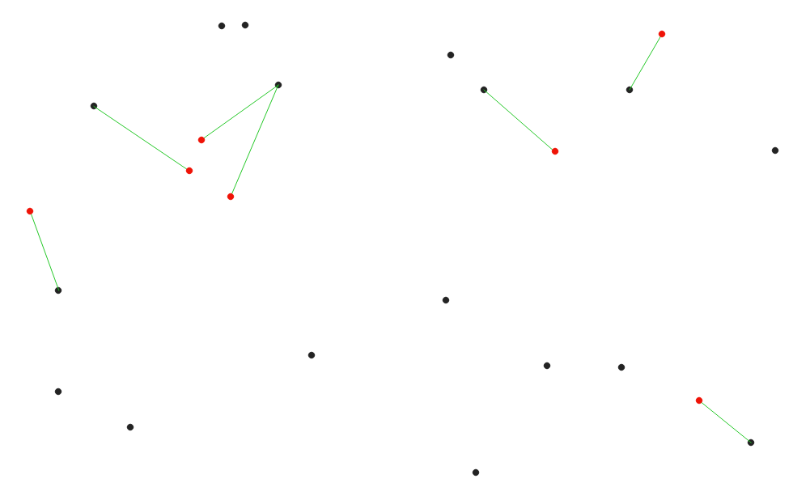
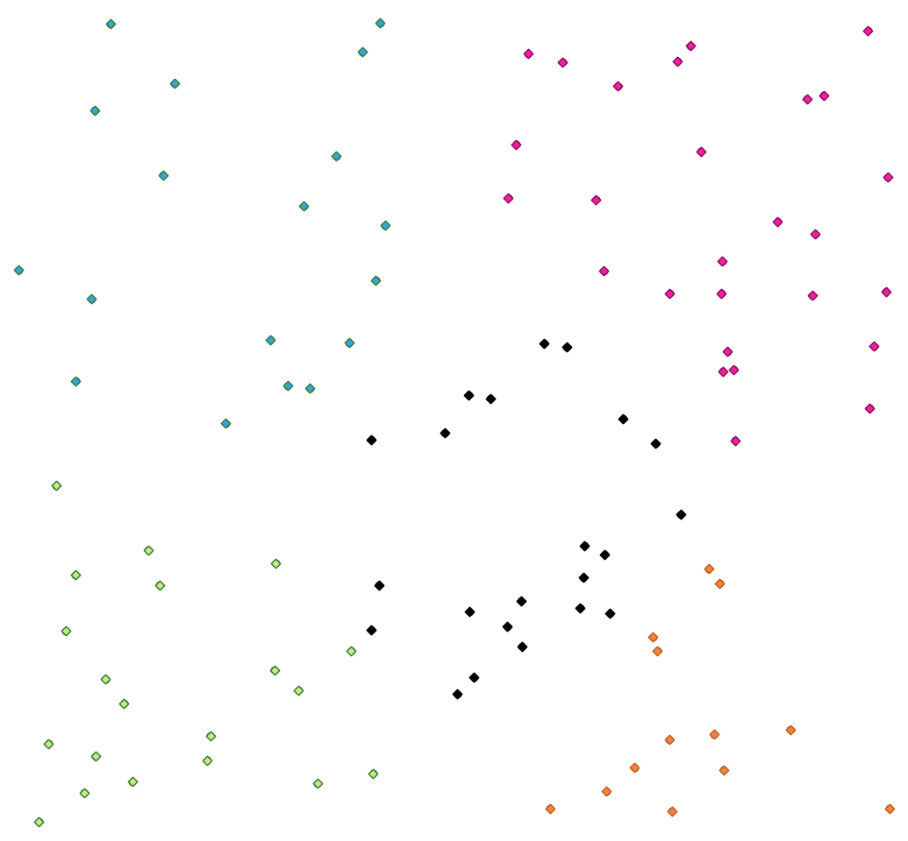

Vector analysis
===============

.. only:: html

   .. contents::
      :local:
      :depth: 1

.. _qgisbasicstatisticsforfields:

Basic statistics for fields
---------------------------
Generates basic statistics for a field of the attribute table of a
vector layer.

Numeric, date, time and string fields are supported.

The statistics returned will depend on the field type.

Statistics are generated as an HTML file and are available in the
:menuselection:`Processing --> Results viewer`.

**Default menu**: :menuselection:`Vector --> Analysis Tools`

Parameters
..........

.. list-table::
   :header-rows: 1
   :widths: 20 20 20 40

   * - Label
     - Name
     - Type
     - Description
   * - **Input vector**
     - ``INPUT_LAYER``
     - [vector: any]
     - Vector layer to calculate the statistics on
   * - **Field to calculate statistics on**
     - ``FIELD_NAME``
     - [tablefield: any]
     - Any supported table field to calculate the statistics
   * - **Statistics**

       Optional
     - ``OUTPUT_HTML_FILE``
     - [html]

       Default: ``[Save to temporary file]``
     - Specification of the file for the calculated statistics. One of:

       .. include:: ../algs_include.rst
          :start-after: **file_output_types_skip**
          :end-before: **end_file_output_types_skip**

Outputs
.......

.. list-table::
   :header-rows: 1
   :widths: 35 20 20 25
   :class: longtable

   * - Label
     - Name
     - Type
     - Description
   * - **Statistics**
     - ``OUTPUT_HTML_FILE``
     - [html]
     - HTML file with the calculated statistics
   * - **Count**
     - ``COUNT``
     - [number]
     -
   * - **Number of unique values**
     - ``UNIQUE``
     - [number]
     -
   * - **Number of empty (null) values**
     - ``EMPTY``
     - [number]
     -
   * - **Number of non-empty values**
     - ``FILLED``
     - [number]
     -
   * - **Minimum value**
     - ``MIN``
     - [same as input]
     -
   * - **Maximum value**
     - ``MAX``
     - [same as input]
     -
   * - **Minimum length**
     - ``MIN_LENGTH``
     - [number]
     -
   * - **Maximum length**
     - ``MAX_LENGTH``
     - [number]
     -
   * - **Mean length**
     - ``MEAN_LENGTH``
     - [number]
     -
   * - **Coefficient of Variation**
     - ``CV``
     - [number]
     -
   * - **Sum**
     - ``SUM``
     - [number]
     -
   * - **Mean value**
     - ``MEAN``
     - [number]
     -
   * - **Standard deviation**
     - ``STD_DEV``
     - [number]
     -
   * - **Range**
     - ``RANGE``
     - [number]
     -
   * - **Median**
     - ``MEDIAN``
     - [number]
     -
   * - **Minority (rarest occurring value)**
     - ``MINORITY``
     - [same as input]
     -
   * - **Majority (most frequently occurring value)**
     - ``MAJORITY``
     - [same as input]
     -
   * - **First quartile**
     - ``FIRSTQUARTILE``
     - [number]
     -
   * - **Third quartile**
     - ``THIRDQUARTILE``
     - [number]
     -
   * - **Interquartile Range (IQR)**
     - ``IQR``
     - [number]
     -

Python code
...........

**Algorithm ID**: ``qgis:basicstatisticsforfields``

.. include:: ../algs_include.rst
  :start-after: **algorithm_code_section**
  :end-before: **end_algorithm_code_section**

.. _qgisclimbalongline:

Climb along line
----------------------

Calculates the total climb and descent along line geometries.
The input layer must have Z values present. If Z values are not
available, the  :ref:`qgissetzfromraster` algorithm may be used to add
Z values from a DEM layer.

The output layer is a copy of the input layer with additional fields
that contain the total climb (``climb``), total descent (``descent``),
the minimum elevation (``minelev``) and the maximum elevation
(``maxelev``) for each line geometry.
If the input layer contains fields with the same names as these added
fields, they will be renamed (field names will be altered to "name_2",
"name_3", etc, finding the first non-duplicate name).

Parameters
..........

.. list-table::
   :header-rows: 1
   :widths: 20 20 20 40

   * - Label
     - Name
     - Type
     - Description
   * - **Line layer**
     - ``INPUT``
     - [vector: line]
     - Line layer to calculate the climb for. Must have Z values
   * - **Climb layer**
     - ``OUTPUT``
     - [vector: line]

       Default: ``[Create temporary layer]``
     - Specification of the output (line) layer. One of:

       .. include:: ../algs_include.rst
          :start-after: **layer_output_types**
          :end-before: **end_layer_output_types**

Outputs
.......

.. list-table::
   :header-rows: 1
   :widths: 20 20 20 40

   * - Label
     - Name
     - Type
     - Description
   * - **Climb layer**
     - ``OUTPUT``
     - [vector: line]
     - Line layer containing new attributes with the
       results from climb calculations.
   * - **Total climb**
     - ``TOTALCLIMB``
     - [number]
     - The sum of the climb for all the line geometries
       in the input layer
   * - **Total descent**
     - ``TOTALDESCENT``
     - [number]
     - The sum of the descent for all the line geometries
       in the input layer
   * - **Minimum elevation**
     - ``MINELEVATION``
     - [number]
     - The minimum elevation for the geometries in the
       layer
   * - **Maximum elevation**
     - ``MAXELEVATION``
     - [number]
     - The maximum elevation for the geometries in the
       layer

Python code
...........

**Algorithm ID**: ``qgis:climbalongline``

.. include:: ../algs_include.rst
  :start-after: **algorithm_code_section**
  :end-before: **end_algorithm_code_section**

.. _qgiscountpointsinpolygon:

Count points in polygon
-----------------------
Takes a point and a polygon layer and counts the number of points from
the point layer in each of the polygons of the polygon layer.

A new polygon layer is generated, with the exact same content as the
input polygon layer, but containing an additional field with the
points count corresponding to each polygon.

.. figure:: img/count_points_polygon.png
  :align: center

  The labels in the polygons show the point count

An optional weight field can be used to assign weights to each point.
Alternatively, a unique class field can be specified.
If both options are used, the weight field will take precedence and
the unique class field will be ignored.

|checkbox| Allows
:ref:`features in-place modification <processing_inplace_edit>` 
of polygon features

``Default menu``: :menuselection:`Vector --> Analysis Tools`

Parameters
..........

.. list-table::
   :header-rows: 1
   :widths: 20 20 20 40
   :class: longtable

   * - Label
     - Name
     - Type
     - Description
   * - **Polygons**
     - ``POLYGONS``
     - [vector: polygon]
     - Polygon layer whose features are associated with the count of
       points they contain
   * - **Points**
     - ``POINTS``
     - [vector: point]
     - Point layer with features to count
   * - **Weight field**

       Optional
     - ``WEIGHT``
     - [tablefield: any]
     - A field from the point layer.
       The count generated will be the sum of the weight field of the
       points contained by the polygon.
       If the weight field is not numeric, the count will be ``0``.
   * - **Class field**

       Optional
     - ``CLASSFIELD``
     - [tablefield: any]
     - Points are classified based on the selected attribute and if
       several points with the same attribute value are within the
       polygon, only one of them is counted.
       The final count of the points in a polygon is, therefore, the
       count of different classes that are found in it.
   * - **Count field name**
     - ``FIELD``
     - [string]

       Default: 'NUMPOINTS'
     - The name of the field to store the count of points
   * - **Count**
     - ``OUTPUT``
     - [vector: polygon]

       Default: ``[Create temporary layer]``
     - Specification of the output layer. One of:

       .. include:: ../algs_include.rst
          :start-after: **layer_output_types_append**
          :end-before: **end_layer_output_types_append**

Outputs
.......

.. list-table::
   :header-rows: 1
   :widths: 20 20 20 40

   * - Label
     - Name
     - Type
     - Description
   * - **Count**
     - ``OUTPUT``
     - [vector: polygon]
     - Resulting layer with the attribute table containing the
       new column with the points count

Python code
...........

**Algorithm ID**: ``native:countpointsinpolygon``

.. include:: ../algs_include.rst
  :start-after: **algorithm_code_section**
  :end-before: **end_algorithm_code_section**

.. _qgisdbscanclustering:

DBSCAN clustering
-----------------
Clusters point features based on a 2D implementation of Density-based
spatial clustering of applications with noise (DBSCAN) algorithm.

The algorithm requires two parameters, a minimum cluster size,
and the maximum distance allowed between clustered points.

.. seealso:: :ref:`qgisstdbscanclustering`, :ref:`qgiskmeansclustering`

Parameters
..........

Basic parameters
^^^^^^^^^^^^^^^^

.. list-table::
   :header-rows: 1
   :widths: 20 20 20 40
   :class: longtable

   * - Label
     - Name
     - Type
     - Description
   * - **Input layer**
     - ``INPUT``
     - [vector: point]
     - Layer to analyze
   * - **Minimum cluster size**
     - ``MIN_SIZE``
     - [number]

       Default: 5
     - Minimum number of features to generate a cluster
   * - **Maximum distance between clustered points**
     - ``EPS``
     - [number]

       Default: 1.0
     - Distance beyond which two features can not belong
       to the same cluster (eps)
   * - **Clusters**
     - ``OUTPUT``
     - [vector: point]

       Default: ``[Create temporary layer]``
     - Specify the vector layer for the result of the clustering. One of:

       .. include:: ../algs_include.rst
          :start-after: **layer_output_types**
          :end-before: **end_layer_output_types**

Advanced parameters
^^^^^^^^^^^^^^^^^^^

.. list-table::
   :header-rows: 1
   :widths: 20 20 20 40
   :class: longtable

   * - Label
     - Name
     - Type
     - Description
   * - **Treat border points as noise (DBSCAN\*)**

       Optional
     - ``DBSCAN*``
     - [boolean]

       Default: False
     - If checked, points on the border of a cluster are
       themselves treated as unclustered points, and only
       points in the interior of a cluster are tagged as
       clustered.
   * - **Cluster field name**
     - ``FIELD_NAME``
     - [string]

       Default: 'CLUSTER_ID'
     - Name of the field where the associated cluster number
       shall be stored
   * - **Cluster size field name**
     - ``SIZE_FIELD_NAME``
     - [string]

       Default: 'CLUSTER_SIZE'
     - Name of the field with the count of features in the same cluster

Outputs
.......

.. list-table::
   :header-rows: 1
   :widths: 20 20 20 40

   * - Label
     - Name
     - Type
     - Description
   * - **Clusters**
     - ``OUTPUT``
     - [vector: point]
     - Vector layer containing the original features with a
       field setting the cluster they belong to
   * - **Number of clusters**
     - ``NUM_CLUSTERS``
     - [number]
     - The number of clusters discovered

Python code
...........

**Algorithm ID**: ``native:dbscanclustering``

.. include:: ../algs_include.rst
  :start-after: **algorithm_code_section**
  :end-before: **end_algorithm_code_section**

.. _qgisdistancematrix:

Distance matrix
---------------
Calculates for point features distances to their nearest features in
the same layer or in another layer.

**Default menu**: :menuselection:`Vector --> Analysis Tools`

.. seealso:: :ref:`qgisjoinbynearest`

Parameters
..........

.. list-table::
   :header-rows: 1
   :widths: 20 20 20 40
   :class: longtable

   * - Label
     - Name
     - Type
     - Description
   * - **Input point layer**
     - ``INPUT``
     - [vector: point]
     - Point layer for which the distance matrix is calculated
       (**from** points)
   * - **Input unique ID field**
     - ``INPUT_FIELD``
     - [tablefield: any]
     - Field to use to uniquely identify features of the
       input layer. Used in the output attribute table.
   * - **Target point layer**
     - ``TARGET``
     - [vector: point]
     - Point layer containing the nearest point(s) to search
       (**to** points)
   * - **Target unique ID field**
     - ``TARGET_FIELD``
     - [tablefield: any]
     - Field to use to uniquely identify features of the target
       layer.
       Used in the output attribute table.
   * - **Output matrix type**
     - ``MATRIX_TYPE``
     - [enumeration]

       Default: 0
     - Different types of calculation are available:

       * 0 --- Linear (N * *k* x 3) distance matrix: for each
         input point, reports the distance to each of the *k*
         nearest target points.
         The output matrix consists of up to *k* rows per
         input point, and each row has three columns:
         *InputID*, *TargetID* and *Distance*.
       * 1 --- Standard (N x T) distance matrix
       * 2 --- Summary distance matrix (mean, std. dev., min,
         max): for each input point, reports statistics on
         the distances to its target points.
   * - **Use only the nearest (k) target points**
     - ``NEAREST_POINTS``
     - [number]

       Default: 0
     - You can choose to calculate the distance to all the
       points in the target layer (*0*) or limit to a number
       (*k*) of closest features.

   * - **Distance matrix**
     - ``OUTPUT``
     - [vector: point]

       Default: ``[Create temporary layer]``
     - Specification of the output vector layer. One of:

       .. include:: ../algs_include.rst
          :start-after: **layer_output_types**
          :end-before: **end_layer_output_types**

Outputs
.......

.. list-table::
   :header-rows: 1
   :widths: 20 20 20 40

   * - Label
     - Name
     - Type
     - Description
   * - **Distance matrix**
     - ``OUTPUT``
     - [vector: point]
     - Point (or MultiPoint for the "Linear (N * *k* x 3)"
       case) vector layer containing the distance calculation
       for each input feature.
       Its features and attribute table depend on the selected
       output matrix type.

Python code
...........

**Algorithm ID**: ``qgis:distancematrix``

.. include:: ../algs_include.rst
  :start-after: **algorithm_code_section**
  :end-before: **end_algorithm_code_section**

.. _qgisdistancetonearesthublinetohub:

Distance to nearest hub (line to hub)
-------------------------------------
Creates lines that join each feature of an input vector to the nearest
feature in a destination layer.
Distances are calculated based on the
:ref:`center <qgispointonsurface>` of each feature.

  Display the nearest hub for the red input features

.. seealso:: :ref:`qgisdistancetonearesthubpoints`,
   :ref:`qgisjoinbynearest`

Parameters
..........

.. list-table::
   :header-rows: 1
   :widths: 20 20 20 40

   * - Label
     - Name
     - Type
     - Description
   * - **Source points layer**
     - ``INPUT``
     - [vector: any]
     - Vector layer for which the nearest feature is searched
   * - **Destination hubs layer**
     - ``HUBS``
     - [vector: any]
     - Vector layer containing the features to search for
   * - **Hub layer name attribute**
     - ``FIELD``
     - [tablefield: any]
     - Field to use to uniquely identify features of the
       destination layer.
       Used in the output attribute table
   * - **Measurement unit**
     - ``UNIT``
     - [enumeration]

       Default: 0
     - Units in which to report the distance to the closest
       feature:

       * 0 --- Meters
       * 1 --- Feet
       * 2 --- Miles
       * 3 --- Kilometers
       * 4 --- Layer units
   * - **Hub distance**
     - ``OUTPUT``
     - [vector: line]

       Default: ``[Create temporary layer]``
     - Specify the output line vector layer connecting the matching points.
       One of:

       .. include:: ../algs_include.rst
          :start-after: **layer_output_types**
          :end-before: **end_layer_output_types**

Outputs
.......

.. list-table::
   :header-rows: 1
   :widths: 20 20 20 40

   * - Label
     - Name
     - Type
     - Description
   * - **Hub distance**
     - ``OUTPUT``
     - [vector: line]
     - Line vector layer with the attributes of the input
       features, the identifier of their closest feature
       and the calculated distance.

Python code
...........

**Algorithm ID**: ``qgis:distancetonearesthublinetohub``

.. include:: ../algs_include.rst
  :start-after: **algorithm_code_section**
  :end-before: **end_algorithm_code_section**

.. _qgisdistancetonearesthubpoints:

Distance to nearest hub (points)
--------------------------------
Creates a point layer representing the
:ref:`center <qgispointonsurface>` of the input features with the
addition of two fields containing the identifier of the nearest
feature (based on its center point) and the distance between the
points.

.. seealso:: :ref:`qgisdistancetonearesthublinetohub`,
   :ref:`qgisjoinbynearest`

Parameters
..........

.. list-table::
   :header-rows: 1
   :widths: 20 20 20 40
   :class: longtable

   * - Label
     - Name
     - Type
     - Description
   * - **Source points layer**
     - ``INPUT``
     - [vector: any]
     - Vector layer for which the nearest feature is searched
   * - **Destination hubs layer**
     - ``HUBS``
     - [vector: any]
     - Vector layer containing the features to search for
   * - **Hub layer name attribute**
     - ``FIELD``
     - [tablefield: any]
     - Field to use to uniquely identify features of the
       destination layer.
       Used in the output attribute table
   * - **Measurement unit**
     - ``UNIT``
     - [enumeration]

       Default: 0
     - Units in which to report the distance to the closest
       feature:

       * 0 --- Meters
       * 1 --- Feet
       * 2 --- Miles
       * 3 --- Kilometers
       * 4 --- Layer units
   * - **Hub distance**
     - ``OUTPUT``
     - [vector: point]

       Default: ``[Create temporary layer]``
     - Specify the output point vector layer with the nearest hub.
       One of:

       .. include:: ../algs_include.rst
          :start-after: **layer_output_types**
          :end-before: **end_layer_output_types**

Outputs
.......

.. list-table::
   :header-rows: 1
   :widths: 20 20 20 40

   * - Label
     - Name
     - Type
     - Description
   * - **Hub distance**
     - ``OUTPUT``
     - [vector: point]
     - Point vector layer representing the center of the source features
       with their attributes, the identifier of their closest
       feature and the calculated distance.

Python code
...........

**Algorithm ID**: ``qgis:distancetonearesthubpoints``

.. include:: ../algs_include.rst
  :start-after: **algorithm_code_section**
  :end-before: **end_algorithm_code_section**

.. _qgishublines:

Join by lines (hub lines)
-------------------------
Creates hub and spoke diagrams by connecting lines from points on
the Spoke layer to matching points in the Hub layer.

Determination of which hub goes with each point is based on a match
between the Hub ID field on the hub points and the Spoke ID field on
the spoke points.

If input layers are not point layers, a point on the surface of the
geometries will be taken as the connecting location.

Optionally, geodesic lines can be created, which represent the
shortest path on the surface of an ellipsoid.
When geodesic mode is used, it is possible to split the created lines
at the antimeridian (±180 degrees longitude), which can improve
rendering of the lines.
Additionally, the distance between vertices can be specified.
A smaller distance results in a denser, more accurate line.

.. figure:: img/join_lines.png
  :align: center

  Join points based on a common field / attribute

Parameters
..........

Basic parameters
^^^^^^^^^^^^^^^^

.. list-table::
   :header-rows: 1
   :widths: 20 20 20 40
   :class: longtable

   * - Label
     - Name
     - Type
     - Description
   * - **Hub layer**
     - ``HUBS``
     - [vector: any]
     - Input layer
   * - **Hub ID field**
     - ``HUB_FIELD``
     - [tablefield: any]
     - Field of the hub layer with ID to join
   * - **Hub layer fields to copy (leave empty to copy all fields)**

       Optional
     - ``HUB_FIELDS``
     - [tablefield: any] [list]
     - The field(s) of the hub layer to be copied.
       If no field(s) are chosen all fields are taken.
   * - **Spoke layer**
     - ``SPOKES``
     - [vector: any]
     - Additional spoke point layer
   * - **Spoke ID field**
     - ``SPOKE_FIELD``
     - [tablefield: any]
     - Field of the spoke layer with ID to join
   * - **Spoke layer fields to copy (leave empty to copy all fields)**

       Optional
     - ``SPOKE_FIELDS``
     - [tablefield: any] [list]
     - Field(s) of the spoke layer to be copied.
       If no fields are chosen all fields are taken.
   * - **Create geodesic lines**
     - ``GEODESIC``
     - [boolean]

       Default: False
     - Create geodesic lines (the shortest path on the surface of
       an ellipsoid)
   * - **Hub lines**
     - ``OUTPUT``
     - [vector: line]

       Default: ``[Create temporary layer]``
     - Specify the output hub line vector layer. One of:

       .. include:: ../algs_include.rst
          :start-after: **layer_output_types**
          :end-before: **end_layer_output_types**

Advanced parameters
^^^^^^^^^^^^^^^^^^^

.. list-table::
   :header-rows: 1
   :widths: 20 20 20 40
   :class: longtable

   * - Label
     - Name
     - Type
     - Description
   * - **Distance between vertices (geodesic lines only)**
     - ``GEODESIC_DISTANCE``
     - [number]

       Default: 1000.0 (kilometers)
     - Distance between consecutive vertices (in kilometers).
       A smaller distance results in a denser, more accurate line
   * - **Split lines at antimeridian (±180 degrees longitude)**
     - ``ANTIMERIDIAN_SPLIT``
     - [boolean]

       Default: False
     - Split lines at ±180 degrees longitude (to improve rendering
       of the lines)

Outputs
.......

.. list-table::
   :header-rows: 1
   :widths: 20 20 20 40

   * - Label
     - Name
     - Type
     - Description
   * - **Hub lines**
     - ``OUTPUT``
     - [vector: line]
     - The resulting line layer connecting matching points in input layers

Python code
...........

**Algorithm ID**: ``native:hublines``

.. include:: ../algs_include.rst
  :start-after: **algorithm_code_section**
  :end-before: **end_algorithm_code_section**

.. _qgiskmeansclustering:

K-means clustering
------------------
Calculates the 2D distance based k-means cluster number for each input
feature.

K-means clustering aims to partition the features into k clusters in
which each feature belongs to the cluster with the nearest mean.
The mean point is represented by the barycenter of the clustered
features.

If input geometries are lines or polygons, the clustering is based on
the centroid of the feature.

  A five class point clusters

.. seealso:: :ref:`qgisdbscanclustering`, :ref:`qgisstdbscanclustering`

Parameters
..........

.. list-table::
   :header-rows: 1
   :widths: 20 20 20 40

   * - Label
     - Name
     - Type
     - Description
   * - **Input layer**
     - ``INPUT``
     - [vector: any]
     - Layer to analyze
   * - **Number of clusters**
     - ``CLUSTERS``
     - [number]

       Default: 5
     - Number of clusters to create with the features
   * - **Clusters**
     - ``OUTPUT``
     - [vector: any]

       Default:``[Create temporary layer]``
     - Specify the output vector layer for generated the clusters.
       One of:

       .. include:: ../algs_include.rst
          :start-after: **layer_output_types**
          :end-before: **end_layer_output_types**

Advanced parameters
^^^^^^^^^^^^^^^^^^^

.. list-table::
   :header-rows: 1
   :widths: 20 20 20 40
   :class: longtable

   * - Label
     - Name
     - Type
     - Description
   * - **Cluster field name**
     - ``FIELD_NAME``
     - [string]

       Default: 'CLUSTER_ID'
     - Name of the field where the associated cluster number
       shall be stored
   * - **Cluster size field name**
     - ``SIZE_FIELD_NAME``
     - [string]

       Default: 'CLUSTER_SIZE'
     - Name of the field with the count of features in the same cluster

Outputs
.......

.. list-table::
   :header-rows: 1
   :widths: 20 20 20 40

   * - Label
     - Name
     - Type
     - Description
   * - **Clusters**
     - ``OUTPUT``
     - [vector: any]
     - Vector layer containing the original features with
       fields specifying the cluster they belong to and their number in it

Python code
...........

**Algorithm ID**: ``native:kmeansclustering``

.. include:: ../algs_include.rst
  :start-after: **algorithm_code_section**
  :end-before: **end_algorithm_code_section**

.. _qgislistuniquevalues:

List unique values
------------------
Lists unique values of an attribute table field and counts their
number.

**Default menu**: :menuselection:`Vector --> Analysis Tools`

Parameters
..........

.. list-table::
   :header-rows: 1
   :widths: 20 20 20 40

   * - Label
     - Name
     - Type
     - Description
   * - **Input layer**
     - ``INPUT``
     - [vector: any]
     - Layer to analyze
   * - **Target field(s)**
     - ``FIELDS``
     - [tablefield: any]
     - Field to analyze
   * - **Unique values**

       Optional
     - ``OUTPUT``
     - [table]

       Default:``[Create temporary layer]``
     - Specify the summary table layer with unique values. One of:

       .. include:: ../algs_include.rst
          :start-after: **layer_output_types_skip**
          :end-before: **end_layer_output_types_skip**

   * - **HTML report**

       Optional
     - ``OUTPUT_HTML_FILE``
     - [html]

       Default:``[Save to temporary file]``
     - HTML report of unique values in the
       :menuselection:`Processing --> Results viewer`. One of:

       .. include:: ../algs_include.rst
          :start-after: **file_output_types_skip**
          :end-before: **end_file_output_types_skip**

Outputs
.......

.. list-table::
   :header-rows: 1
   :widths: 20 20 20 40

   * - Label
     - Name
     - Type
     - Description
   * - **Unique values**
     - ``OUTPUT``
     - [table]
     - Summary table layer with unique values
   * - **HTML report**
     - ``OUTPUT_HTML_FILE``
     - [html]
     - HTML report of unique values. Can be opened from the
       :menuselection:`Processing --> Results viewer`
   * - **Total unique values**
     - ``TOTAL_VALUES``
     - [number]
     - The number of uniqe values in the input field
   * - **UNIQUE_VALUES**
     - ``Unique values``
     - [string]
     - A string with the comma separated list of unique values found
       in the input field

Python code
...........

**Algorithm ID**: ``qgis:listuniquevalues``

.. include:: ../algs_include.rst
  :start-after: **algorithm_code_section**
  :end-before: **end_algorithm_code_section**

.. _qgismeancoordinates:

Mean coordinate(s)
------------------
Computes a point layer with the center of mass of geometries in an
input layer.

An attribute can be specified as containing weights to be applied to
each feature when computing the center of mass.

If an attribute is selected in the parameter, features will be grouped
according to values in this field.
Instead of a single point with the center of mass of the whole layer,
the output layer will contain a center of mass for the features in
each category.

**Default menu**: :menuselection:`Vector --> Analysis Tools`

Parameters
..........

.. list-table::
   :header-rows: 1
   :widths: 20 20 20 40

   * - Label
     - Name
     - Type
     - Description
   * - **Input layer**
     - ``INPUT``
     - [vector: any]
     - Input vector layer
   * - **Weight field**

       Optional
     - ``WEIGHT``
     - [tablefield: numeric]
     - Field to use if you want to perform a weighted mean
   * - **Unique ID field**
     - ``UID``
     - [tablefield: numeric]
     - Unique field on which the calculation of the mean will
       be made
   * - **Mean coordinates**
     - ``OUTPUT``
     - [vector: point]

       Default:``[Create temporary layer]``
     - Specify the (point vector) layer for the result. One of:

       .. include:: ../algs_include.rst
          :start-after: **layer_output_types**
          :end-before: **end_layer_output_types**

Outputs
.......

.. list-table::
   :header-rows: 1
   :widths: 20 20 20 40

   * - Label
     - Name
     - Type
     - Description
   * - **Mean coordinates**
     - ``OUTPUT``
     - [vector: point]
     - Resulting point(s) layer

Python code
...........

**Algorithm ID**: ``native:meancoordinates``

.. include:: ../algs_include.rst
  :start-after: **algorithm_code_section**
  :end-before: **end_algorithm_code_section**

.. _qgisnearestneighbouranalysis:

Nearest neighbour analysis
--------------------------
Performs nearest neighbor analysis for a point layer. The output tells you
how your data are distributed (clustered, randomly or distributed).

Output is generated as an HTML file with the computed statistical
values:

* Observed mean distance
* Expected mean distance
* Nearest neighbour index
* Number of points
* Z-Score: Comparing the Z-Score with the normal distribution tells
  you how your data are distributed.
  A low Z-Score means that the data are unlikely to be the result of a
  spatially random process, while a high Z-Score means that your data
  are likely to be a result of a spatially random process.

  .. figure:: img/normal_distribution.png
     :align: center

**Default menu**: :menuselection:`Vector --> Analysis Tools`

.. seealso:: :ref:`qgisjoinbynearest`

Parameters
..........

.. list-table::
   :header-rows: 1
   :widths: 20 20 20 40

   * - Label
     - Name
     - Type
     - Description
   * - **Input layer**
     - ``INPUT``
     - [vector: point]
     - Point vector layer to calculate the statistics on
   * - **Nearest neighbour**

       Optional
     - ``OUTPUT_HTML_FILE``
     - [html]

       Default:``[Save to temporary file]``
     - Specification of the HTML file for the computed statistics.
       One of:

       .. include:: ../algs_include.rst
          :start-after: **file_output_types_skip**
          :end-before: **end_file_output_types_skip**

Outputs
.......

.. list-table::
   :header-rows: 1
   :widths: 20 20 20 40

   * - Label
     - Name
     - Type
     - Description
   * - **Nearest neighbour**
     - ``OUTPUT_HTML_FILE``
     - [html]
     - HTML file with the computed statistics
   * - **Observed mean distance**
     - ``OBSERVED_MD``
     - [number]
     - Observed mean distance
   * - **Expected mean distance**
     - ``EXPECTED_MD``
     - [number]
     - Expected mean distance
   * - **Nearest neighbour index**
     - ``NN_INDEX``
     - [number]
     - Nearest neighbour index
   * - **Number of points**
     - ``POINT_COUNT``
     - [number]
     - Number of points
   * - **Z-Score**
     - ``Z_SCORE``
     - [number]
     - Z-Score

Python code
...........

**Algorithm ID**: ``native:nearestneighbouranalysis``

.. include:: ../algs_include.rst
  :start-after: **algorithm_code_section**
  :end-before: **end_algorithm_code_section**

.. _qgiscalculatevectoroverlaps:

Overlap analysis
---------------------
Calculates the area and percentage cover by which features from an
input layer are overlapped by features from a selection of overlay
layers.

New attributes are added to the output layer reporting the
total area of overlap and percentage of the input feature
overlapped by each of the selected overlay layers.

Parameters
..........

.. list-table::
   :header-rows: 1
   :widths: 20 20 20 40

   * - Label
     - Name
     - Type
     - Description
   * - **Input layer**
     - ``INPUT``
     - [vector: any]
     - The input layer.
   * - **Overlap layers**
     - ``LAYERS``
     - [vector: any] [list]
     - The overlay layers.
   * - **Output layer**
     - ``OUTPUT``
     - [same as input]

       Default: ``[Create temporary layer]``
     - Specify the output vector layer. One of:

       .. include:: ../algs_include.rst
          :start-after: **layer_output_types**
          :end-before: **end_layer_output_types**

Outputs
.......

.. list-table::
   :header-rows: 1
   :widths: 20 20 20 40

   * - Label
     - Name
     - Type
     - Description
   * - **Output layer**
     - ``OUTPUT``
     - [same as input]
     - The output layer with additional fields reporting the
       overlap (in map units and percentage) of the input feature
       overlapped by each of the selected layers.

Python code
...........

**Algorithm ID**: ``native:calculatevectoroverlaps``

.. include:: ../algs_include.rst
  :start-after: **algorithm_code_section**
  :end-before: **end_algorithm_code_section**

.. _qgisstdbscanclustering:

ST-DBSCAN clustering
--------------------

Clusters point features based on a 2D implementation of spatiotemporal
Density-based clustering of applications with noise (ST-DBSCAN) algorithm.

.. seealso:: :ref:`qgisdbscanclustering`, :ref:`qgiskmeansclustering`

Parameters
..........

Basic parameters
^^^^^^^^^^^^^^^^

.. list-table::
   :header-rows: 1
   :widths: 20 20 20 40
   :class: longtable

   * - Label
     - Name
     - Type
     - Description
   * - **Input layer**
     - ``INPUT``
     - [vector: point]
     - Layer to analyze
   * - **Date/time field**
     - ``DATETIME_FIELD``
     - [tablefield: date]
     - Field containing the temporal information
   * - **Minimum cluster size**
     - ``MIN_SIZE``
     - [number]

       Default: 5
     - Minimum number of features to generate a cluster
   * - **Maximum distance between clustered points**
     - ``EPS``
     - [number]

       Default: 1.0
     - Distance beyond which two features can not belong
       to the same cluster (eps)
   * - **Maximum time duration between clustered points**
     - ``EPS2``
     - [number]

       Default: 0.0 (days)
     - Time duration beyond which two features can not belong
       to the same cluster (eps2).
       Available time units are milliseconds, seconds, minutes,
       hours, days and weeks.
   * - **Clusters**
     - ``OUTPUT``
     - [vector: point]

       Default: ``[Create temporary layer]``
     - Specify the vector layer for the result of the clustering. One of:

       .. include:: ../algs_include.rst
          :start-after: **layer_output_types**
          :end-before: **end_layer_output_types**

Advanced parameters
^^^^^^^^^^^^^^^^^^^

.. list-table::
   :header-rows: 1
   :widths: 20 20 20 40
   :class: longtable

   * - Label
     - Name
     - Type
     - Description
   * - **Treat border points as noise (DBSCAN\*)**

       Optional
     - ``DBSCAN*``
     - [boolean]

       Default: False
     - If checked, points on the border of a cluster are
       themselves treated as unclustered points, and only
       points in the interior of a cluster are tagged as
       clustered.
   * - **Cluster field name**
     - ``FIELD_NAME``
     - [string]

       Default: 'CLUSTER_ID'
     - Name of the field where the associated cluster number
       shall be stored
   * - **Cluster size field name**
     - ``SIZE_FIELD_NAME``
     - [string]

       Default: 'CLUSTER_SIZE'
     - Name of the field with the count of features in the same cluster

Outputs
.......

.. list-table::
   :header-rows: 1
   :widths: 20 20 20 40

   * - Label
     - Name
     - Type
     - Description
   * - **Clusters**
     - ``OUTPUT``
     - [vector: point]
     - Vector layer containing the original features with a
       field setting the cluster they belong to
   * - **Number of clusters**
     - ``NUM_CLUSTERS``
     - [number]
     - The number of clusters discovered

Python code
...........

**Algorithm ID**: ``native:stdbscanclustering``

.. include:: ../algs_include.rst
  :start-after: **algorithm_code_section**
  :end-before: **end_algorithm_code_section**

.. _qgisstatisticsbycategories:

Statistics by categories
------------------------
Calculates statistics of a field depending on a parent class.
The parent class is a combination of values from other fields.

Parameters
..........

.. list-table::
   :header-rows: 1
   :widths: 20 20 20 40

   * - Label
     - Name
     - Type
     - Description
   * - **Input vector layer**
     - ``INPUT``
     - [vector: any]
     - Input vector layer with unique classes and values
   * - **Field to calculate statistics on (if empty, only count is calculated)**

       Optional
     - ``VALUES_FIELD_NAME``
     - [tablefield: any]
     - If empty only the count will be calculated
   * - **Field(s) with categories**
     - ``CATEGORIES_FIELD_NAME``
     - [vector: any] [list]
     - The fields that (combined) define the categories
   * - **Statistics by category**
     - ``OUTPUT``
     - [table]

       Default: ``[Create temporary layer]``
     - Specify the output table for the generated statistics. One of:

       .. include:: ../algs_include.rst
          :start-after: **layer_output_types**
          :end-before: **end_layer_output_types**

Outputs
.......

.. list-table::
   :header-rows: 1
   :widths: 20 20 20 40

   * - Label
     - Name
     - Type
     - Description
   * - **Statistics by category**
     - ``OUTPUT``
     - [table]
     - Table containing the statistics

Depending on the type of the field being analyzed,
the following statistics are returned for each grouped value:

.. list-table::
   :header-rows: 1
   :widths: 62 12 12 12
   :class: longtable

   * - Statistics
     - String
     - Numeric
     - Date
   * - Count (``COUNT``)
     - |checkbox|
     - |checkbox|
     - |checkbox|
   * - Unique values (``UNIQUE``)
     - |checkbox|
     -
     - |checkbox|
   * - Empty (null) values (``EMPTY``)
     - |checkbox|
     -
     - |checkbox|
   * - Non-empty values (``FILLED``)
     - |checkbox|
     -
     - |checkbox|
   * - Minimal value (``MIN``)
     - |checkbox|
     - |checkbox|
     - |checkbox|
   * - Maximal value (``MAX``)
     - |checkbox|
     - |checkbox|
     - |checkbox|
   * - Range (``RANGE``)
     -
     - |checkbox|
     -
   * - Sum (``SUM``)
     -
     - |checkbox|
     -
   * - Mean value (``MEAN``)
     -
     - |checkbox|
     -
   * - Median value (``MEDIAN``)
     -
     - |checkbox|
     -
   * - Standard Deviation (``STD_DEV``)
     -
     - |checkbox|
     -
   * - Coefficient of variation (``CV``)
     -
     - |checkbox|
     -
   * - Minority (rarest occurring value - ``MINORITY``)
     -
     - |checkbox|
     -
   * - Majority (most frequently occurring value - ``MAJORITY``)
     -
     - |checkbox|
     -
   * - First Quartile (``FIRSTQUARTILE``)
     -
     - |checkbox|
     -
   * - Third Quartile (``THIRDQUARTILE``)
     -
     - |checkbox|
     -
   * - Inter Quartile Range (``IQR``)
     -
     - |checkbox|
     -
   * - Minimum Length (``MIN_LENGTH``)
     - |checkbox|
     -
     -
   * - Mean Length (``MEAN_LENGTH``)
     - |checkbox|
     -
     -
   * - Maximum Length (``MAX_LENGTH``)
     - |checkbox|
     -
     -

Python code
...........

**Algorithm ID**: ``qgis:statisticsbycategories``

.. include:: ../algs_include.rst
  :start-after: **algorithm_code_section**
  :end-before: **end_algorithm_code_section**

.. _qgissumlinelengths:

Sum line lengths
----------------
Takes a polygon layer and a line layer and measures the total length
of lines and the total number of them that cross each polygon.

The resulting layer has the same features as the input polygon layer,
but with two additional attributes containing the length and count of
the lines across each polygon.

|checkbox| Allows
:ref:`features in-place modification <processing_inplace_edit>` 
of polygon features

**Default menu**: :menuselection:`Vector --> Analysis Tools`

Parameters
..........

.. list-table::
   :header-rows: 1
   :widths: 20 20 20 40
   :class: longtable

   * - Label
     - Name
     - Type
     - Description
   * - **Lines**
     - ``LINES``
     - [vector: line]
     - Input vector line layer
   * - **Polygons**
     - ``POLYGONS``
     - [vector: polygon]
     - Polygon vector layer
   * - **Lines length field name**
     - ``LEN_FIELD``
     - [string]

       Default: 'LENGTH'
     - Name of the field for the lines length
   * - **Lines count field name**
     - ``COUNT_FIELD``
     - [string]

       Default: 'COUNT'
     - Name of the field for the lines count
   * - **Line length**
     - ``OUTPUT``
     - [vector: polygon]

       Default: ``[Create temporary layer]``
     - Specify the output polygon layer with generated statistics. One of:

       .. include:: ../algs_include.rst
          :start-after: **layer_output_types**
          :end-before: **end_layer_output_types**

Outputs
.......

.. list-table::
   :header-rows: 1
   :widths: 20 20 20 40

   * - Label
     - Name
     - Type
     - Description
   * - **Line length**
     - ``OUTPUT``
     - [vector: polygon]
     - Polygon output layer with fields of lines length and
       line count

Python code
...........

**Algorithm ID**: ``native:sumlinelengths``

.. include:: ../algs_include.rst
  :start-after: **algorithm_code_section**
  :end-before: **end_algorithm_code_section**

.. Substitutions definitions - AVOID EDITING PAST THIS LINE
   This will be automatically updated by the find_set_subst.py script.
   If you need to create a new substitution manually,
   please add it also to the substitutions.txt file in the
   source folder.

.. |checkbox| image:: /static/common/checkbox.png
   :width: 1.3em
