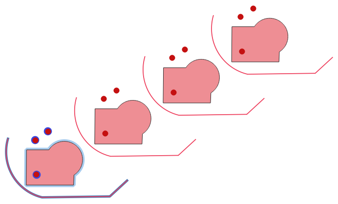

Vector creation
===============

.. only:: html

   .. contents::
      :local:
      :depth: 1
      :class: toc-columns

.. _qgisarrayoffsetlines:

Array of offset (parallel) lines
--------------------------------
Creates copies of line features in a layer, by creating multiple
offset versions of each feature.
Each new version is incrementally offset by a specified distance.

Positive distance will offset lines to the left, and negative
distances will offset them to the right.

.. figure:: img/offset_lines_array.png
   :align: center

   In blue the source layer, in red the offset one

|checkbox| Allows :ref:`features in-place modification <processing_inplace_edit>`
of line features

.. seealso:: :ref:`qgisoffsetline`, :ref:`qgisarraytranslatedfeatures`

Parameters
..........

Basic parameters
^^^^^^^^^^^^^^^^

.. list-table::
   :header-rows: 1
   :widths: 20 20 20 40
   :class: longtable

   * - Label
     - Name
     - Type
     - Description
   * - **Input layer**
     - ``INPUT``
     - [vector: line]
     - Input line vector layer to use for the offsets.
   * - **Number of features to create**
     - ``COUNT``
     - [number |dataDefine|]

       Default: 10
     - Number of offset copies to generate for each feature
   * - **Offset step distance**
     - ``OFFSET``
     - [number |dataDefine|]

       Default: 1.0
     - Distance between two consecutive offset copies
   * - **Offset lines**
     - ``OUTPUT``
     - [vector: line]

       Default: ``[Create temporary layer]``
     - Specify the output line layer with offset features. One of:

       .. include:: ../algs_include.rst
          :start-after: **layer_output_types_append**
          :end-before: **end_layer_output_types_append**

Advanced parameters
^^^^^^^^^^^^^^^^^^^

.. list-table::
   :header-rows: 1
   :widths: 20 20 20 40
   :class: longtable

   * - Label
     - Name
     - Type
     - Description
   * - **Segments**
     - ``SEGMENTS``
     - [number]

       Default: 8
     - Number of line segments to use to approximate a quarter
       circle when creating rounded offsets
   * - **Join style**
     - ``JOIN_STYLE``
     - [enumeration]

       Default: 0
     - Specify whether round, miter or beveled joins should be
       used when offsetting corners in a line. One of:

       * 0 --- Round
       * 1 --- Miter
       * 2 --- Bevel
  
       .. figure:: img/buffer_join_style.png
          :align: center
          :width: 100%

          Round, miter, and bevel join styles
   * - **Miter limit**
     - ``MITER_LIMIT``
     - [number]

       Default: 2.0
     - Sets the maximum distance from the offset geometry to use
       when creating a mitered join as a factor of the offset distance (only applicable for miter
       join styles).
       Minimum: 1.0
              
       .. figure:: img/buffer_miter_limit.png
          :align: center
          :width: 100%
         
          A 10m buffer with a limit of 2 and a 10m buffer with a limit of 1

Outputs
.......

.. list-table::
   :header-rows: 1
   :widths: 20 20 20 40

   * - Label
     - Name
     - Type
     - Description
   * - **Offset lines**
     - ``OUTPUT``
     - [vector: line]
     - Output line layer with offset features.
       The original features are also copied.

Python code
...........

**Algorithm ID**: ``native:arrayoffsetlines``

.. include:: ../algs_include.rst
  :start-after: **algorithm_code_section**
  :end-before: **end_algorithm_code_section**

.. _qgisarraytranslatedfeatures:

Array of translated features
----------------------------
Creates copies of features in a layer by creating multiple translated
versions of each.
Each copy is incrementally displaced by a preset amount in the X, Y
and/or Z axis.

M values present in the geometry can also be translated.

   Input layers in blue tones, output layers with translated features
   in red tones

|checkbox| Allows
:ref:`features in-place modification <processing_inplace_edit>`
of point, line, and polygon features

.. seealso:: :ref:`qgistranslategeometry`, :ref:`qgisarrayoffsetlines`

Parameters
..........

.. list-table::
   :header-rows: 1
   :widths: 20 20 20 40
   :class: longtable

   * - Label
     - Name
     - Type
     - Description
   * - **Input layer**
     - ``INPUT``
     - [vector: any]
     - Input vector layer to translate
   * - **Number of features to create**
     - ``COUNT``
     - [number |dataDefine|]

       Default: 10
     - Number of copies to generate for each feature
   * - **Step distance (x-axis)**
     - ``DELTA_X``
     - [number |dataDefine|]

       Default: 0.0
     - Displacement to apply on the X axis
   * - **Step distance (y-axis)**
     - ``DELTA_Y``
     - [number |dataDefine|]

       Default: 0.0
     - Displacement to apply on the Y axis
   * - **Step distance (z-axis)**
     - ``DELTA_Z``
     - [number |dataDefine|]

       Default: 0.0
     - Displacement to apply on the Z axis
   * - **Step distance (m values)**
     - ``DELTA_M``
     - [number |dataDefine|]

       Default: 0.0
     - Displacement to apply on M
   * - **Translated**
     - ``OUTPUT``
     - [same as input]

       Default: ``[Create temporary layer]``
     - Output vector layer with translated (moved) copies
       of the features.
       The original features are also copied. One of:

       .. include:: ../algs_include.rst
          :start-after: **layer_output_types_append**
          :end-before: **end_layer_output_types_append**

Outputs
.......

.. list-table::
   :header-rows: 1
   :widths: 20 20 20 40

   * - Label
     - Name
     - Type
     - Description
   * - **Translated**
     - ``OUTPUT``
     - [same as input]
     - Output vector layer with translated (moved)
       copies of the features.
       The original features are also copied.

Python code
...........

**Algorithm ID**: ``native:arraytranslatedfeatures``

.. include:: ../algs_include.rst
  :start-after: **algorithm_code_section**
  :end-before: **end_algorithm_code_section**

.. _qgiscreategrid:

Create grid
-----------
Creates a vector layer with a grid covering a given extent.
Grid cells can have different shapes:

.. figure:: img/create_grid.png
  :align: center

  Different grid cell shapes applied to the same extent, without overlaps

The size and/or placement of each element in the grid is defined using a horizontal and
vertical spacing.
The CRS of the output layer must be defined.
The grid extent and the spacing values must be expressed in the
coordinates and units of this CRS.

**Default menu**: :menuselection:`Vector --> Research Tools`

Parameters
..........

.. list-table::
   :header-rows: 1
   :widths: 20 20 20 40
   :class: longtable

   * - Label
     - Name
     - Type
     - Description
   * - **Grid type**
     - ``TYPE``
     - [enumeration]

       Default: 0
     - Shape of the grid. One of:

       * 0 --- Point
       * 1 --- Line
       * 2 --- Rectangle (polygon)
       * 3 --- Diamond (polygon)
       * 4 --- Hexagon (polygon)

   * - **Grid extent**
     - ``EXTENT``
     - [extent]
     - Extent of the grid

       .. include:: ../algs_include.rst
          :start-after: **extent_options**
          :end-before: **end_extent_options**

   * - **Horizontal spacing**
     - ``HSPACING``
     - [number]

       Default: 1.0
     - Size of a grid cell on the X-axis
   * - **Vertical spacing**
     - ``VSPACING``
     - [number]

       Default: 1.0
     - Size of a grid cell on the Y-axis
   * - **Horizontal overlay**
     - ``HOVERLAY``
     - [number]

       Default: 0.0
     - Overlay distance between two consecutive grid cells on the
       X-axis
   * - **Vertical overlay**
     - ``VOVERLAY``
     - [number]

       Default: 0.0
     - Overlay distance between two consecutive grid cells on the
       Y-axis
   * - **Grid CRS**
     - ``CRS``
     - [crs]

       Default: *Project CRS*
     - Coordinate reference system to apply to the grid
   * - **Grid**
     - ``OUTPUT``
     - [vector: any]

       Default: ``[Create temporary layer]``
     - Resulting vector grid layer. One of:

       .. include:: ../algs_include.rst
          :start-after: **layer_output_types**
          :end-before: **end_layer_output_types**

Outputs
.......

.. list-table::
   :header-rows: 1
   :widths: 20 20 20 40

   * - Label
     - Name
     - Type
     - Description
   * - **Grid**
     - ``OUTPUT``
     - [vector: any]
     - Resulting vector grid layer. The output geometry type (point,
       line or polygon) depends on the :guilabel:`Grid type`.
       Features are created from top to bottom, left to right.
       The attribute table is filled with:
       
       * an ``id``
       * coordinates on the ``left``, ``right``, ``top`` and ``bottom`` sides
       * and their placement in the grid: ``row_index`` and ``column_index``
         (available for point, rectangle and hexagon grid types)

Python code
...........

**Algorithm ID**: ``native:creategrid``

.. include:: ../algs_include.rst
  :start-after: **algorithm_code_section**
  :end-before: **end_algorithm_code_section**

.. _qgiscreatepointslayerfromtable:

Create points layer from table
------------------------------
Creates points layer from a table with columns that contain
coordinates fields.

Besides X and Y coordinates you can also specify Z and M fields.

Parameters
..........

.. list-table::
   :header-rows: 1
   :widths: 20 20 20 40
   :class: longtable

   * - Label
     - Name
     - Type
     - Description
   * - **Input layer**
     - ``INPUT``
     - [vector: any]
     - Input vector layer or a table.
   * - **X field**
     - ``XFIELD``
     - [tablefield: any]
     - Field containing the X coordinate
   * - **Y field**
     - ``YFIELD``
     - [tablefield: any]
     - Field containing the Y coordinate
   * - **Z field**

       Optional
     - ``ZFIELD``
     - [tablefield: any]
     - Field containing the Z coordinate
   * - **M field**

       Optional
     - ``MFIELD``
     - [tablefield: any]
     - Field containing the M value
   * - **Target CRS**
     - ``TARGET_CRS``
     - [crs]

       Default: ``EPSG:4326``
     - Coordinate reference system to use for layer.
       The provided coordinates are assumed to be compliant.

   * - **Points from table**
     - ``OUTPUT``
     - [vector: point]

       Default: ``[Create temporary layer]``
     - Specify the resulting point layer. One of:

       .. include:: ../algs_include.rst
          :start-after: **layer_output_types**
          :end-before: **end_layer_output_types**

Outputs
.......

.. list-table::
   :header-rows: 1
   :widths: 20 20 20 40

   * - Label
     - Name
     - Type
     - Description
   * - **Points from table**
     - ``OUTPUT``
     - [vector: point]
     - The resulting point layer

Python code
...........

**Algorithm ID**: ``native:createpointslayerfromtable``

.. include:: ../algs_include.rst
  :start-after: **algorithm_code_section**
  :end-before: **end_algorithm_code_section**

.. _qgisgeneratepointspixelcentroidsalongline:

Generate points (pixel centroids) along line
--------------------------------------------
Generates a point vector layer from an input raster and line layer.

The points correspond to the pixel centroids that intersect the line
layer.

.. figure:: img/points_centroids.png
  :align: center

  Points of the pixel centroids

Parameters
..........

.. list-table::
   :header-rows: 1
   :widths: 20 20 20 40

   * - Label
     - Name
     - Type
     - Description
   * - **Raster layer**
     - ``INPUT_RASTER``
     - [raster]
     - Input raster layer
   * - **Vector layer**
     - ``INPUT_VECTOR``
     - [vector: line]
     - Input line vector layer
   * - **Points along line**
     - ``OUTPUT``
     - [vector: point]

       Default: ``[Create temporary layer]``
     - Resulting point layer with pixel centroids. One of:

       .. include:: ../algs_include.rst
          :start-after: **layer_output_types**
          :end-before: **end_layer_output_types**

Outputs
.......

.. list-table::
   :header-rows: 1
   :widths: 20 20 20 40

   * - Label
     - Name
     - Type
     - Description
   * - **Points along line**
     - ``OUTPUT``
     - [vector: point]
     - Resulting point layer with pixel centroids

Python code
...........

**Algorithm ID**: ``qgis:generatepointspixelcentroidsalongline``

.. include:: ../algs_include.rst
  :start-after: **algorithm_code_section**
  :end-before: **end_algorithm_code_section**

.. _qgisgeneratepointspixelcentroidsinsidepolygons:

Generate points (pixel centroids) inside polygon
------------------------------------------------
Generates a point vector layer from an input raster and polygon layer.

The points correspond to the pixel centroids that intersect the
polygon layer.

.. figure:: img/points_centroids_polygon.png
  :align: center

  Points of the pixel centroids

Parameters
..........

.. list-table::
   :header-rows: 1
   :widths: 20 20 20 40

   * - Label
     - Name
     - Type
     - Description
   * - **Raster layer**
     - ``INPUT_RASTER``
     - [raster]
     - Input raster layer
   * - **Vector layer**
     - ``INPUT_VECTOR``
     - [vector: polygon]
     - Input polygon vector layer
   * - **Points inside polygons**
     - ``OUTPUT``
     - [vector: point]

       Default: ``[Create temporary layer]``
     - Resulting point layer of pixel centroids. One of:

       .. include:: ../algs_include.rst
          :start-after: **layer_output_types**
          :end-before: **end_layer_output_types**

Outputs
.......

.. list-table::
   :header-rows: 1
   :widths: 20 20 20 40

   * - Label
     - Name
     - Type
     - Description
   * - **Points inside polygons**
     - ``OUTPUT``
     - [vector: point]
     - Resulting point layer of pixel centroids

Python code
...........

**Algorithm ID**: ``native:generatepointspixelcentroidsinsidepolygons``

.. include:: ../algs_include.rst
  :start-after: **algorithm_code_section**
  :end-before: **end_algorithm_code_section**

.. _qgisimportphotos:

Import geotagged photos
-----------------------
Creates a point layer corresponding to the geotagged locations from
JPEG or HEIC/HEIF images from a source folder.

The point layer will contain a single PointZ feature per input file
from which the geotags could be read.
Any altitude information from the geotags will be used to set the
point's Z value.

Besides longitude and latitude also altitude, direction and timestamp
information, if present in the photo, will be added to the point as
attributes.

Parameters
..........

.. list-table::
   :header-rows: 1
   :widths: 20 20 20 40
   :class: longtable

   * - Label
     - Name
     - Type
     - Description
   * - **Input folder**
     - ``FOLDER``
     - [folder]
     - Path to the source folder containing the geotagged photos
   * - **Scan recursively**
     - ``RECURSIVE``
     - [boolean]

       Default: False
     - If checked, the folder and its subfolders will be scanned
   * - **Photos**

       Optional
     - ``OUTPUT``
     - [vector: point]

       Default: ``[Create temporary layer]``
     - Specify the point vector layer for the geotagged photos.
       One of:

       .. include:: ../algs_include.rst
          :start-after: **layer_output_types_skip**
          :end-before: **end_layer_output_types_skip**

   * - **Invalid photos table**

       Optional
     - ``INVALID``
     - [table]

       Default: ``[Skip output]``
     - Specify the table of unreadable or non-geotagged photos.
       One of:

       .. include:: ../algs_include.rst
          :start-after: **layer_output_types_skip**
          :end-before: **end_layer_output_types_skip**

Outputs
.......

.. list-table::
   :header-rows: 1
   :widths: 20 20 20 40

   * - Label
     - Name
     - Type
     - Description
   * - **Photos**
     - ``OUTPUT``
     - [vector: point]
     - Point vector layer with geotagged photos.
       The form of the layer is automatically filled with
       paths and photo previews settings.
   * - **Invalid photos table**

       Optional
     - ``INVALID``
     - [table]
     - Table of unreadable or non-geotagged photos can
       also be created.

Python code
...........

**Algorithm ID**: ``native:importphotos``

.. include:: ../algs_include.rst
  :start-after: **algorithm_code_section**
  :end-before: **end_algorithm_code_section**

.. _qgispointstopath:

Points to path
--------------

Converts a point layer to a line layer, by joining points in an
order defined by an expression or a field in the input point layer.

Points can be grouped by a field or an expression to distinguish line features.

In addition to the line vector layer, a text file is output
that describes the resulting line as a start point and a
sequence of bearings / directions (relative to azimuth) and
distances.

Parameters
..........

.. list-table::
   :header-rows: 1
   :widths: 20 20 20 40
   :class: longtable

   * - Label
     - Name
     - Type
     - Description
   * - **Input point layer**
     - ``INPUT``
     - [vector: point]
     - Input point vector layer
   * - **Create closed paths**
     - ``CLOSE_PATH``
     - [boolean]

       Default: False
     - If checked, the first and last points of the line will be connected
       and close the generated path
   * - **Order expression**

       Optional
     - ``ORDER_EXPRESSION``
     - [expression]
     - Field or expression providing the order to connect the points in the path.
       If not set, the feature ID (``$id``) is used.
   * - **Sort text containing numbers naturally**

       Optional
     - ``NATURAL_SORT``
     - [boolean]

       Default: False
     - If checked, naturally sorts the features based on the provided expression
       (i.e., 'a9' < 'a10').
   * - **Path group expression**

       Optional
     - ``GROUP_EXPRESSION``
     - [expression]
     - Point features of the same value in the field or expression will be
       grouped in the same line.
       If not set, a single path is drawn with all the input points.
   * - **Paths**
     - ``OUTPUT``
     - [vector: line]

       Default: ``[Create temporary layer]``
     - Specify the line vector layer of the path. One of:

       .. include:: ../algs_include.rst
          :start-after: **layer_output_types**
          :end-before: **end_layer_output_types**

   * - **Directory for text output**

       Optional
     - ``OUTPUT_TEXT_DIR``
     - [folder]

       Default: ``[Skip output]``
     - Specify the directory that will contain the description
       files of points and paths. One of:

       .. include:: ../algs_include.rst
          :start-after: **directory_output_types_skip**
          :end-before: **end_directory_output_types_skip**

Outputs
.......

.. list-table::
   :header-rows: 1
   :widths: 20 20 20 40

   * - Label
     - Name
     - Type
     - Description
   * - **Paths**
     - ``OUTPUT``
     - [vector: line]
     - Line vector layer of the path
   * - **Directory for text output**
     - ``OUTPUT_TEXT_DIR``
     - [folder]
     - Directory containing description files of points and paths

Python code
...........

**Algorithm ID**: ``native:pointstopath``

.. include:: ../algs_include.rst
  :start-after: **algorithm_code_section**
  :end-before: **end_algorithm_code_section**

.. _qgisrandompointsalongline:

Random points along line
------------------------
Creates a new point layer, with points placed on the lines of another
layer.

For each line in the input layer, a given number of points is added
to the resulting layer.
The procedure for adding a point is to:

1. randomly select a line feature from the input layer
2. if the feature is multi-part, randomly select a part of it
3. randomly select a segment of that line
4. randomly select a position on that segment.

The procedure means that curved parts of the lines (with relatively
short segments) will get more points than straight parts (with
relatively long segments), as demonstrated in the illustration below,
where the output of the *Random points along lines* algorithm can be
compared with the output of the *Random points on lines* algorithm
(that produces points with an, on average, even distribution along
the lines).

.. figure:: img/randompointsalonglines_illustration.png
   :align: center

   Example algorithm output. Left: *Random points along line*, right:
   *Random points on lines*

A minimum distance can be specified, to avoid points being too close
to each other.

.. seealso:: :ref:`qgisrandompointsonlines`

Parameters
..........

.. list-table::
   :header-rows: 1
   :widths: 20 20 20 40

   * - Label
     - Name
     - Type
     - Description
   * - **Input point layer**
     - ``INPUT``
     - [vector: line]
     - Input line vector layer
   * - **Number of points**
     - ``POINTS_NUMBER``
     - [number]

       Default: 1
     - Number of points to create
   * - **Minimum distance between points**
     - ``MIN_DISTANCE``
     - [number]

       Default: 0.0
     - The minimum distance between points
   * - **Random points**
     - ``OUTPUT``
     - [vector: point]

       Default: ``[Create temporary layer]``
     - The output random points. One of:

       .. include:: ../algs_include.rst
          :start-after: **layer_output_types**
          :end-before: **end_layer_output_types**

Outputs
.......

.. list-table::
   :header-rows: 1
   :widths: 20 20 20 40

   * - Label
     - Name
     - Type
     - Description
   * - **Random points**
     - ``OUTPUT``
     - [vector: point]
     - The output random points layer.

Python code
...........

**Algorithm ID**: ``qgis:qgisrandompointsalongline``

.. include:: ../algs_include.rst
  :start-after: **algorithm_code_section**
  :end-before: **end_algorithm_code_section**

.. _qgisrandompointsinextent:

Random points in extent
-----------------------
Creates a new point layer with a given number of random points, all
of them within a given extent.

A distance factor can be specified, to avoid points being too close to each 
other. If the minimum distance between points makes it impossible to create new 
points, either distance can be decreased or the maximum number of attempts may 
be increased.

**Default menu**: :menuselection:`Vector --> Research Tools`

Parameters
..........

Basic parameters
^^^^^^^^^^^^^^^^

.. list-table::
   :header-rows: 1
   :widths: 20 20 20 40

   * - Label
     - Name
     - Type
     - Description
   * - **Input extent**
     - ``EXTENT``
     - [extent]
     - Map extent for the random points

       .. include:: ../algs_include.rst
          :start-after: **extent_options**
          :end-before: **end_extent_options**

   * - **Number of points**
     - ``POINTS_NUMBER``
     - [number]

       Default: 1
     - Number of point to create
   * - **Minimum distance between points**
     - ``MIN_DISTANCE``
     - [number]

       Default: 0.0
     - The minimum distance between points
   * - **Target CRS**
     - ``TARGET_CRS``
     - [crs]

       Default: *Project CRS*
     - CRS of the random points layer
   * - **Random points**
     - ``OUTPUT``
     - [vector: point]

       Default: ``[Create temporary layer]``
     - The output random points. One of:

       .. include:: ../algs_include.rst
          :start-after: **layer_output_types**
          :end-before: **end_layer_output_types**

Advanced parameters
^^^^^^^^^^^^^^^^^^^

.. list-table::
   :header-rows: 1
   :widths: 20 20 20 40
   :class: longtable

   * - Label
     - Name
     - Type
     - Description
   * - **Maximum number of search attempts given the minimum distance**
     - ``MAX_ATTEMPTS``
     - [number]

       Default: 200
     - Maximum number of attempts to place the points

Outputs
.......

.. list-table::
   :header-rows: 1
   :widths: 20 20 20 40

   * - Label
     - Name
     - Type
     - Description
   * - **Random points**
     - ``OUTPUT``
     - [vector: point]
     - The output random points layer.

Python code
...........

**Algorithm ID**: ``native:randompointsinextent``

.. include:: ../algs_include.rst
  :start-after: **algorithm_code_section**
  :end-before: **end_algorithm_code_section**

.. _qgisrandompointsinlayerbounds:

Random points in layer bounds
-----------------------------
Creates a new point layer with a given number of random points,
all of them within the extent of a given layer.

A minimum distance can be specified, to avoid points being too
close to each other.

**Default menu**: :menuselection:`Vector --> Research Tools`

Parameters
..........

.. list-table::
   :header-rows: 1
   :widths: 20 20 20 40

   * - Label
     - Name
     - Type
     - Description
   * - **Input layer**
     - ``INPUT``
     - [vector: polygon]
     - Input polygon layer defining the area
   * - **Number of points**
     - ``POINTS_NUMBER``
     - [number]

       Default: 1
     - Number of points to create
   * - **Minimum distance between points**
     - ``MIN_DISTANCE``
     - [number]

       Default: 0.0
     - The minimum distance between points
   * - **Random points**
     - ``OUTPUT``
     - [vector: point]

       Default: ``[Create temporary layer]``
     - The output random points. One of:

       .. include:: ../algs_include.rst
          :start-after: **layer_output_types**
          :end-before: **end_layer_output_types**

Outputs
.......

.. list-table::
   :header-rows: 1
   :widths: 20 20 20 40

   * - Label
     - Name
     - Type
     - Description
   * - **Random points**
     - ``OUTPUT``
     - [vector: point]
     - The output random points layer.

Python code
...........

**Algorithm ID**: ``qgis:randompointsinlayerbounds``

.. include:: ../algs_include.rst
  :start-after: **algorithm_code_section**
  :end-before: **end_algorithm_code_section**

        
.. _qgisrandompointsinpolygons:

Random points in polygons
-------------------------

Creates a point layer with points placed inside the polygons of
another layer.

For each feature (polygon / multi-polygon) geometry in the input
layer, the given number of points is added to the result layer.

Per feature and global minimum distances can be specified in order to
avoid points being too close in the output point layer.
If a minimum distance is specified, it may not be possible to generate
the specified number of points for each feature.
The total number of generated points and missed points are available
as output from the algorithm.

The illustration below shows the effect of per feature and global
minimum distances and zero/non-zero minimum distances (generated with
the same seed, so at least the first point generated will be the
same).

.. figure:: img/randompointsinpolygons_mindistance.png
   :align: center

   Ten points per polygon feature, *left*: min. distances = 0,
   *middle*: min.distances = 1, *right*: min. distance = 1,
   global min. distance = 0

The maximum number of tries per point can be specified.
This is only relevant for non-zero minimum distance.

A seed for the random number generator can be provided, making it
possible to get identical random number sequences for different runs
of the algorithm.

The attributes of the polygon feature on which a point was generated
can be included (:guilabel:`Include polygon attributes`).

If you want approximately the same point density for all the
features, you can data-define the number of points using the area of
the polygon feature geometry.

.. seealso:: :ref:`qgisrandompointsinsidepolygons`

Parameters
..........

Basic parameters
^^^^^^^^^^^^^^^^

.. list-table::
   :header-rows: 1
   :widths: 20 20 20 40
   :class: longtable

   * - Label
     - Name
     - Type
     - Description
   * - **Input polygon layer**
     - ``INPUT``
     - [vector: line]
     - Input polygon vector layer
   * - **Number of points for each feature**
     - ``POINTS_NUMBER``
     - [number |dataDefine|]

       Default: 1
     - Number of points to create
   * - **Minimum distance between points**

       Optional
     - ``MIN_DISTANCE``
     - [number |dataDefine|]

       Default: 0.0
     - The minimum distance between points within one polygon feature
   * - **Random points in polygons**
     - ``OUTPUT``
     - [vector: point]

       Default: ``[Create temporary layer]``
     - The output random points. One of:

       .. include:: ../algs_include.rst
          :start-after: **layer_output_types**
          :end-before: **end_layer_output_types**

Advanced parameters
^^^^^^^^^^^^^^^^^^^

.. list-table::
   :header-rows: 1
   :widths: 20 20 20 40
   :class: longtable

   * - Label
     - Name
     - Type
     - Description
   * - **Global minimum distance between points**

       Optional
     - ``MIN_DISTANCE_GLOBAL``
     - [number |dataDefine|]

       Default: 0.0
     - The global minimum distance between points.
       Should be smaller than the *Minimum distance between
       points (per feature)* for that parameter to have an effect.
   * - **Maximum number of search attempts (for Min. dist. > 0)**

       Optional
     - ``MAX_TRIES_PER_POINT``
     - [number |dataDefine|]

       Default: 10
     - The maximum number of tries per point.
       Only relevant if the minimum distance between points is set
       (and greater than 0).
   * - **Random seed**

       Optional
     - ``SEED``
     - [number]

       Default: Not set
     - The seed to use for the random number generator.
   * - **Include polygon attributes**
     - ``INCLUDE_POLYGON_ATTRIBUTES``
     - [boolean]

       Default: True
     - If set, a point will get the attributes from the line on
       which it is placed.

Outputs
.......

.. list-table::
   :header-rows: 1
   :widths: 20 20 20 40
   :class: longtable

   * - Label
     - Name
     - Type
     - Description
   * - **Random points in polygons**
     - ``OUTPUT``
     - [vector: point]
     - The output random points layer.
   * - **Number of features with empty or no geometry**
     - ``FEATURES_WITH_EMPTY_OR_NO_GEOMETRY``
     - [number]
     - 
   * - **Total number of points generated**
     - ``OUTPUT_POINTS``
     - [number]
     - 
   * - **Number of missed points**
     - ``POINTS_MISSED``
     - [number]
     - The number of points that could not be generated due to
       the minimum distance constraint.
   * - **Number of features with missed points**
     - ``POLYGONS_WITH_MISSED_POINTS``
     - [number]
     - Not including features with empty or no geometry

Python code
...........

**Algorithm ID**: ``native:randompointsinpolygons``

.. include:: ../algs_include.rst
  :start-after: **algorithm_code_section**
  :end-before: **end_algorithm_code_section**

.. _qgisrandompointsinsidepolygons:

Random points inside polygons
-----------------------------
Creates a new point layer with a given number of random points
inside each polygon of the input polygon layer.

Two sampling strategies are available:

* Points count: number of points for each feature
* Points density: density of points for each feature

A minimum distance can be specified, to avoid points being too close
to each other.

**Default menu**: :menuselection:`Vector --> Research Tools`

.. seealso:: :ref:`qgisrandompointsinpolygons`

Parameters
..........

.. list-table::
   :header-rows: 1
   :widths: 20 20 20 40
   :class: longtable

   * - Label
     - Name
     - Type
     - Description
   * - **Input layer**
     - ``INPUT``
     - [vector: polygon]
     - Input polygon vector layer
   * - **Sampling strategy**
     - ``STRATEGY``
     - [enumeration]

       Default: 0
     - Sampling strategy to use. One of:

       * 0 --- Points count: number of points for each feature
       * 1 --- Points density: density of points for each feature

   * - **Point count or density**
     - ``VALUE``
     - [number |dataDefine|]

       Default: 1.0
     - The number or density of points, depending on the chosen
       :guilabel:`Sampling strategy`.
   * - **Minimum distance between points**
     - ``MIN_DISTANCE``
     - [number]

       Default: 0.0
     - The minimum distance between points
   * - **Random points**
     - ``OUTPUT``
     - [vector: point]

       Default: ``[Create temporary layer]``
     - The output random points. One of:

       .. include:: ../algs_include.rst
          :start-after: **layer_output_types**
          :end-before: **end_layer_output_types**

Outputs
.......

.. list-table::
   :header-rows: 1
   :widths: 20 20 20 40

   * - Label
     - Name
     - Type
     - Description
   * - **Random points**
     - ``OUTPUT``
     - [vector: point]
     - The output random points layer.

Python code
...........

**Algorithm ID**: ``qgis:randompointsinsidepolygons``

.. include:: ../algs_include.rst
  :start-after: **algorithm_code_section**
  :end-before: **end_algorithm_code_section**

.. _qgisrandompointsonlines:

Random points on lines
----------------------

Creates a point layer with points placed on the lines of another
layer.

For each feature (line / multi-line) geometry in the input layer, the
given number of points is added to the result layer.

Per feature and global minimum distances can be specified in order to
avoid points being too close in the output point layer.
If a minimum distance is specified, it may not be possible to generate
the specified number of points for each feature.
The total number of generated points and missed points are available
as output from the algorithm.

The illustration below shows the effect of per feature and global
minimum distances and zero/non-zero minimum distances (generated with
the same seed, so at least the first point generated will be the
same).

.. figure:: img/randompointsonlines_mindistance.png
   :align: center

   Five points per line feature, *left*: min. distances = 0,
   *middle*: min.distances != 0, *right*: min. distance != 0,
   global min. distance = 0

The maximum number of tries per point can be specified.
This is only relevant for non-zero minimum distance.

A seed for the random number generator can be provided, making it
possible to get identical random number sequences for different runs
of the algorithm.

The attributes of the line feature on which a point was generated can
be included (:guilabel:`Include line attributes`).

If you want approximately the same point density for all the line
features, you can data-define the number of points using the length of
the line feature geometry.

.. seealso:: :ref:`qgisrandompointsalongline`

Parameters
..........

Basic parameters
^^^^^^^^^^^^^^^^

.. list-table::
   :header-rows: 1
   :widths: 20 20 20 40
   :class: longtable

   * - Label
     - Name
     - Type
     - Description
   * - **Input line layer**
     - ``INPUT``
     - [vector: line]
     - Input line vector layer
   * - **Number of points for each feature**
     - ``POINTS_NUMBER``
     - [number |dataDefine|]

       Default: 1
     - Number of points to create
   * - **Minimum distance between points (per feature)**

       Optional
     - ``MIN_DISTANCE``
     - [number |dataDefine|]

       Default: 0.0
     - The minimum distance between points within one line feature
   * - **Random points on lines**
     - ``OUTPUT``
     - [vector: point]

       Default: ``[Create temporary layer]``
     - The output random points. One of:

       .. include:: ../algs_include.rst
          :start-after: **layer_output_types**
          :end-before: **end_layer_output_types**

Advanced parameters
^^^^^^^^^^^^^^^^^^^

.. list-table::
   :header-rows: 1
   :widths: 20 20 20 40
   :class: longtable

   * - Label
     - Name
     - Type
     - Description
   * - **Global minimum distance between points**

       Optional
     - ``MIN_DISTANCE_GLOBAL``
     - [number |dataDefine|]

       Default: 0.0
     - The global minimum distance between points.
       Should be smaller than the *Minimum distance between
       points (per feature)* for that parameter to have an effect.
   * - **Maximum number of search attempts (for Min. dist. > 0)**

       Optional
     - ``MAX_TRIES_PER_POINT``
     - [number |dataDefine|]

       Default: 10
     - The maximum number of tries per point.
       Only relevant if the minimum distance between points is set
       (and greater than 0).
   * - **Random seed**

       Optional
     - ``SEED``
     - [number]

       Default: Not set
     - The seed to use for the random number generator.
   * - **Include line attributes**
     - ``INCLUDE_LINE_ATTRIBUTES``
     - [boolean]

       Default: True
     - If set, a point will get the attributes from the line on
       which it is placed.

Outputs
.......

.. list-table::
   :header-rows: 1
   :widths: 20 20 20 40
   :class: longtable

   * - Label
     - Name
     - Type
     - Description
   * - **Random points on lines**
     - ``OUTPUT``
     - [vector: point]
     - The output random points layer.
   * - **Number of features with empty or no geometry**
     - ``FEATURES_WITH_EMPTY_OR_NO_GEOMETRY``
     - [number]
     - 
   * - **Number of features with missed points**
     - ``LINES_WITH_MISSED_POINTS``
     - [number]
     - Not including features with empty or no geometry
   * - **Total number of points generated**
     - ``POINTS_GENERATED``
     - [number]
     - 
   * - **Number of missed points**
     - ``POINTS_MISSED``
     - [number]
     - The number of points that could not be generated due to
       the minimum distance constraint.

Python code
...........

**Algorithm ID**: ``native:randompointsonlines``

.. include:: ../algs_include.rst
  :start-after: **algorithm_code_section**
  :end-before: **end_algorithm_code_section**

.. _qgispixelstopoints:

Raster pixels to points
-----------------------
Creates a vector layer of points corresponding to each pixel in a
raster layer.

Converts a raster layer to a vector layer, by creating point features
for each individual pixel's center in the raster layer.
Any NoData  pixels are skipped in the output.

Parameters
..........

.. list-table::
   :header-rows: 1
   :widths: 20 20 20 40

   * - Label
     - Name
     - Type
     - Description
   * - **Raster layer**
     - ``INPUT_RASTER``
     - [raster]
     - Input raster layer
   * - **Band number**
     - ``RASTER_BAND``
     - [raster band]
     - Raster band to extract data from
   * - **Field name**
     - ``FIELD_NAME``
     - [string]

       Default: 'VALUE'
     - Name of the field to store the raster band value
   * - **Vector points**
     - ``OUTPUT``
     - [vector: point]

       Default: ``[Create temporary layer]``
     - Specify the resulting point layer of pixels centroids.
       One of:

       .. include:: ../algs_include.rst
          :start-after: **layer_output_types**
          :end-before: **end_layer_output_types**

Outputs
.......

.. list-table::
   :header-rows: 1
   :widths: 20 20 20 40

   * - Label
     - Name
     - Type
     - Description
   * - **Vector points**
     - ``OUTPUT``
     - [vector: point]
     - Resulting point layer with pixels centroids

Python code
...........

**Algorithm ID**: ``native:pixelstopoints``

.. include:: ../algs_include.rst
  :start-after: **algorithm_code_section**
  :end-before: **end_algorithm_code_section**

.. _qgispixelstopolygons:

Raster pixels to polygons
-------------------------
Creates a vector layer of polygons corresponding to each pixel in a
raster layer.

Converts a raster layer to a vector layer, by creating polygon
features for each individual pixel's extent in the raster layer.
Any NoData  pixels are skipped in the output.

Parameters
..........

.. list-table::
   :header-rows: 1
   :widths: 20 20 20 40

   * - Label
     - Name
     - Type
     - Description
   * - **Raster layer**
     - ``INPUT_RASTER``
     - [raster]
     - Input raster layer
   * - **Band number**
     - ``RASTER_BAND``
     - [raster band]
     - Raster band to extract data from
   * - **Field name**
     - ``FIELD_NAME``
     - [string]

       Default: 'VALUE'
     - Name of the field to store the raster band value
   * - **Vector polygons**
     - ``OUTPUT``
     - [vector: polygon]

       Default: ``[Create temporary layer]``
     - Specify the resulting polygon layer of pixel extents.
       One of:

       .. include:: ../algs_include.rst
          :start-after: **layer_output_types**
          :end-before: **end_layer_output_types**

Outputs
.......

.. list-table::
   :header-rows: 1
   :widths: 20 20 20 40

   * - Label
     - Name
     - Type
     - Description
   * - **Vector polygons**
     - ``OUTPUT``
     - [vector: polygon]
     - Resulting polygon layer of pixel extents

Python code
...........

**Algorithm ID**: ``native:pixelstopolygons``

.. include:: ../algs_include.rst
  :start-after: **algorithm_code_section**
  :end-before: **end_algorithm_code_section**

.. _qgisregularpoints:

Regular points
--------------
Creates a new point layer with its points placed in a regular grid
within a given extent.

The grid is specified either by the spacing between the points (same
spacing for all dimensions) or by the number of points to generate.
In the latter case, the spacing will be determined from the extent.
In order to generate a full rectangular grid, at least the number of
points specified by the user is generated for the latter case.

Random offsets to the point spacing can be applied, resulting in a
non-regular point pattern.

**Default menu**: :menuselection:`Vector --> Research Tools`

Parameters
..........

.. list-table::
   :header-rows: 1
   :widths: 20 20 20 40
   :class: longtable

   * - Label
     - Name
     - Type
     - Description
   * - **Input extent (xmin, xmax, ymin, ymax)**
     - ``EXTENT``
     - [extent]
     - Map extent for the random points

       .. include:: ../algs_include.rst
          :start-after: **extent_options**
          :end-before: **end_extent_options**

   * - **Point spacing/count**
     - ``SPACING``
     - [number]

       Default: 100
     - Spacing between the points, or the number of points, depending
       on whether ``Use point spacing`` is checked or not.
   * - **Initial inset from corner (LH side)**
     - ``INSET``
     - [number]

       Default: 0.0
     - Offsets the points relative to the upper left corner.
       The value is used for both the X and Y axis.
   * - **Apply random offset to point spacing**
     - ``RANDOMIZE``
     - [boolean]

       Default: False
     - If checked the points will have a random spacing
   * - **Use point spacing**
     - ``IS_SPACING``
     - [boolean]

       Default: True
     - If unchecked the point spacing is not taken into account
   * - **Output layer CRS**
     - ``CRS``
     - [crs]

       Default: *Project CRS*
     - CRS of the random points layer
   * - **Regular points**
     - ``OUTPUT``
     - [vector: point]

       Default: ``[Create temporary layer]``
     - Specify the output regular point layer. One of:

       .. include:: ../algs_include.rst
          :start-after: **layer_output_types**
          :end-before: **end_layer_output_types**

Outputs
.......

.. list-table::
   :header-rows: 1
   :widths: 20 20 20 40

   * - Label
     - Name
     - Type
     - Description
   * - **Regular points**
     - ``OUTPUT``
     - [vector: point]
     - The output regular point layer.

Python code
...........

**Algorithm ID**: ``qgis:regularpoints``

.. include:: ../algs_include.rst
  :start-after: **algorithm_code_section**
  :end-before: **end_algorithm_code_section**

.. Substitutions definitions - AVOID EDITING PAST THIS LINE
   This will be automatically updated by the find_set_subst.py script.
   If you need to create a new substitution manually,
   please add it also to the substitutions.txt file in the
   source folder.

.. |checkbox| image:: /static/common/checkbox.png
   :width: 1.3em
.. |dataDefine| image:: /static/common/mIconDataDefine.png
   :width: 1.5em
