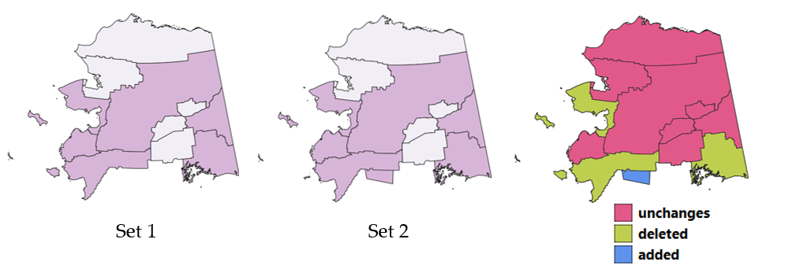
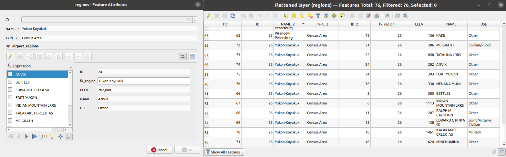
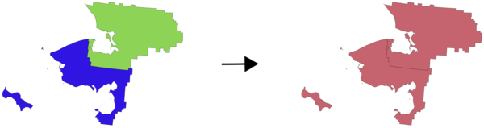

Vector general
==============

.. only:: html

   .. contents::
      :local:
      :depth: 1
      :class: toc-columns

.. _qgisassignprojection:

Assign projection
-----------------
Assigns a new projection to a vector layer.

It creates a new layer with the exact same features and geometries as
the input one, but assigned to a new CRS. The geometries are **not**
reprojected, they are just assigned to a different CRS.

This algorithm can be used to repair layers which have been assigned
an incorrect projection.

Attributes are not modified by this algorithm.

.. seealso:: :ref:`qgisdefinecurrentprojection`,
   :ref:`qgisfindprojection`, :ref:`qgisreprojectlayer`

Parameters
..........

.. list-table::
   :header-rows: 1
   :widths: 20 20 20 40

   * - Label
     - Name
     - Type
     - Description
   * - **Input layer**
     - ``INPUT``
     - [vector: any]
     - Vector layer with wrong or missing CRS
   * - **Assigned CRS**
     - ``CRS``
     - [crs]
       
       Default: ``EPSG:4326 - WGS84``
     - Select the new CRS to assign to the vector layer
   * - **Assigned CRS**

       Optional
     - ``OUTPUT``
     - [same as input]

       Default: ``[Create temporary layer]``
     - Specify the output vector layer.
       One of:

       .. include:: ../algs_include.rst
          :start-after: **layer_output_types_append**
          :end-before: **end_layer_output_types_append**

Outputs
..........

.. list-table::
   :header-rows: 1
   :widths: 20 20 20 40

   * - Label
     - Name
     - Type
     - Description
   * - **Assigned CRS**
     - ``OUTPUT``
     - [same as input]
     - Vector layer with assigned projection

Python code
...........

**Algorithm ID**: ``native:assignprojection``

.. include:: ../algs_include.rst
  :start-after: **algorithm_code_section**
  :end-before: **end_algorithm_code_section**

.. _qgisbatchnominatimgeocoder:

Batch Nominatim geocoder
------------------------

Performs batch geocoding using the Nominatim service against an input
layer string field.
The output layer will have a point geometry reflecting the geocoded location
as well as a number of attributes associated to the geocoded location.

|checkbox| Allows
:ref:`features in-place modification <processing_inplace_edit>` 
of point features

.. note:: This algorithm is compliant with the `usage policy
 <https://operations.osmfoundation.org/policies/nominatim/>`_ of the
 Nominatim geocoding service provided by the OpenStreetMap Foundation.

Parameters
..........

.. list-table::
   :header-rows: 1
   :widths: 20 20 20 40

   * - Label
     - Name
     - Type
     - Description
   * - **Input layer**
     - ``INPUT``
     - [vector: any]
     - Vector layer to geocode the features
   * - **Address field**
     - ``FIELD``
     - [tablefield: string]
     - Field containing the addresses to geocode
   * - **Geocoded**
     - ``OUTPUT``
     - [vector: point]

       Default: ``[Create temporary layer]``
     - Specify the output layer containing only the geocoded addresses.
       One of:

       .. include:: ../algs_include.rst
          :start-after: **layer_output_types_append**
          :end-before: **end_layer_output_types_append**

Outputs
..........

.. list-table::
   :header-rows: 1
   :widths: 20 20 20 40

   * - Label
     - Name
     - Type
     - Description
   * - **Geocoded**
     - ``OUTPUT``
     - [vector: point]
     - Vector layer with point features corresponding to the geocoded addresses

Python code
...........

**Algorithm ID**: ``native:batchnominatimgeocoder``

.. include:: ../algs_include.rst
  :start-after: **algorithm_code_section**
  :end-before: **end_algorithm_code_section**

.. _qgislayertobookmarks:

Convert layer to spatial bookmarks
----------------------------------------
Creates spatial bookmarks corresponding to the extent of features
contained in a layer.

Parameters
..........

.. list-table::
   :header-rows: 1
   :widths: 20 20 20 40

   * - Label
     - Name
     - Type
     - Description
   * - **Input Layer**
     - ``INPUT``
     - [vector: line, polygon]
     - The input vector layer
   * - **Bookmark destination**
     - ``DESTINATION``
     - [enumeration]
       
       Default: 0
     - Select the destination for the bookmarks.
       One of:
       
       * 0 --- Project bookmarks
       * 1 --- User bookmarks
   * - **Name field**
     - ``NAME_EXPRESSION``
     - [expression]
     - Field or expression that will give names to the generated
       bookmarks
   * - **Group field**
     - ``GROUP_EXPRESSION``
     - [expression]
     - Field or expression that will provide groups for the generated
       bookmarks

Outputs
..........

.. list-table::
   :header-rows: 1
   :widths: 20 20 20 40

   * - Label
     - Name
     - Type
     - Description
   * - **Count of bookmarks added**
     - ``COUNT``
     - [number]
     - 

Python code
...........

**Algorithm ID**: ``native:layertobookmarks``

.. include:: ../algs_include.rst
  :start-after: **algorithm_code_section**
  :end-before: **end_algorithm_code_section**

.. _qgisbookmarkstolayer:

Convert spatial bookmarks to layer
----------------------------------------
Creates a new layer containing polygon features for stored spatial
bookmarks.
The export can be filtered to only bookmarks belonging to the current
project, to all user bookmarks, or a combination of both.

Parameters
..........

.. list-table::
   :header-rows: 1
   :widths: 20 20 20 40

   * - Label
     - Name
     - Type
     - Description
   * - **Bookmark source**
     - ``SOURCE``
     - [enumeration] [list]
       
       Default: [0,1]
     - Select the source(s) of the bookmarks.
       One or more of:
       
       * 0 --- Project bookmarks
       * 1 --- User bookmarks
   * - **Output CRS**
     - ``CRS``
     - [crs]
       
       Default: ``EPSG:4326 - WGS 84``
     - The CRS of the output layer
   * - **Output**
     - ``OUTPUT``
     - [vector: polygon]

       Default: ``[Create temporary layer]``
     - Specify the output layer. One of:

       .. include:: ../algs_include.rst
          :start-after: **layer_output_types**
          :end-before: **end_layer_output_types**

Outputs
..........

.. list-table::
   :header-rows: 1
   :widths: 20 20 20 40

   * - Label
     - Name
     - Type
     - Description
   * - **Output**
     - ``OUTPUT``
     - [vector: polygon]
     - The output (bookmarks) vector layer

Python code
...........

**Algorithm ID**: ``native:bookmarkstolayer``

.. include:: ../algs_include.rst
  :start-after: **algorithm_code_section**
  :end-before: **end_algorithm_code_section**

.. _qgiscreateattributeindex:

Create attribute index
----------------------
Creates an index against a field of the attribute table to speed up
queries.
The support for index creation depends on both the layer's data
provider and the field type.

No outputs are created: the index is stored on the layer itself.

Parameters
..........

.. list-table::
   :header-rows: 1
   :widths: 20 20 20 40

   * - Label
     - Name
     - Type
     - Description
   * - **Input Layer**
     - ``INPUT``
     - [vector: any]
     - Select the vector layer you want to create an attribute index
       for
   * - **Attribute to index**
     - ``FIELD``
     - [tablefield: any]
     - Field of the vector layer

Outputs
..........

.. list-table::
   :header-rows: 1
   :widths: 20 20 20 40

   * - Label
     - Name
     - Type
     - Description
   * - **Indexed layer**
     - ``OUTPUT``
     - [same as input]
     - A copy of the input vector layer with an index for the
       specified field

Python code
...........

**Algorithm ID**: ``native:createattributeindex``

.. include:: ../algs_include.rst
  :start-after: **algorithm_code_section**
  :end-before: **end_algorithm_code_section**

.. _qgiscreatespatialindex:

Create spatial index
--------------------
Creates an index to speed up access to the features in a layer based
on their spatial location.
Support for spatial index creation is dependent on the layer's data
provider.

No new output layers are created.

**Default menu**: :menuselection:`Vector --> Data Management Tools`

Parameters
..........

.. list-table::
   :header-rows: 1
   :widths: 20 20 20 40

   * - Label
     - Name
     - Type
     - Description
   * - **Input Layer**
     - ``INPUT``
     - [vector: any]
     - Input vector layer

Outputs
..........

.. list-table::
   :header-rows: 1
   :widths: 20 20 20 40

   * - Label
     - Name
     - Type
     - Description
   * - Indexed layer
     - ``OUTPUT``
     - [same as input]
     - A copy of the input vector layer with a spatial index

Python code
...........

**Algorithm ID**: ``native:createspatialindex``

.. include:: ../algs_include.rst
  :start-after: **algorithm_code_section**
  :end-before: **end_algorithm_code_section**

.. _qgisdefinecurrentprojection:

Define Shapefile projection
---------------------------
Sets the CRS (projection) of an existing Shapefile format dataset to
the provided CRS.
It is very useful when a Shapefile format dataset is missing the
``prj`` file and you know the correct projection.

Contrary to the :ref:`qgisassignprojection` algorithm, it modifies the
current layer and will not output a new layer.

.. note:: For Shapefile datasets, the ``.prj`` and ``.qpj`` files will
   be overwritten - or created if missing - to match the provided CRS.

**Default menu**: :menuselection:`Vector --> Data Management Tools`

.. seealso:: :ref:`qgisassignprojection`, :ref:`qgisfindprojection`,
 :ref:`qgisreprojectlayer`

Parameters
..........

.. list-table::
   :header-rows: 1
   :widths: 20 20 20 40

   * - Label
     - Name
     - Type
     - Description
   * - **Input layer**
     - ``INPUT``
     - [vector: any]
     - Vector layer with missing projection information
   * - **CRS**
     - ``CRS``
     - [crs]
     - Select the CRS to assign to the vector layer

Outputs
..........

.. list-table::
   :header-rows: 1
   :widths: 20 20 20 40

   * - Label
     - Name
     - Type
     - Description
   * - 
     - ``INPUT``
     - [same as input]
     - The input vector layer with the defined projection

Python code
...........

**Algorithm ID**: ``qgis:definecurrentprojection``

.. include:: ../algs_include.rst
  :start-after: **algorithm_code_section**
  :end-before: **end_algorithm_code_section**

.. _qgisdeleteduplicategeometries:

Delete duplicate geometries
---------------------------
Finds and removes duplicated geometries.

Attributes are not checked, so in case two features have identical
geometries but different attributes, only one of them will be added to
the result layer.

.. seealso:: :ref:`qgisdropgeometries`,
   :ref:`qgisremovenullgeometries`,
   :ref:`qgisremoveduplicatesbyattribute`

Parameters
..........

.. list-table::
   :header-rows: 1
   :widths: 20 20 20 40

   * - Label
     - Name
     - Type
     - Description
   * - **Input layer**
     - ``INPUT``
     - [vector: any]
     - The layer with duplicate geometries you want to clean
   * - **Cleaned**
     - ``OUTPUT``
     - [same as input]

       Default: ``[Create temporary layer]``
     - Specify the output layer. One of:

       .. include:: ../algs_include.rst
          :start-after: **layer_output_types**
          :end-before: **end_layer_output_types**

Outputs
..........

.. list-table::
   :header-rows: 1
   :widths: 20 20 20 40

   * - Label
     - Name
     - Type
     - Description
   * - **Count of discarded duplicate records**
     - ``DUPLICATE_COUNT``
     - [number]
     - Count of discarded duplicate records
   * - **Cleaned**
     - ``OUTPUT``
     - [same as input]
     - The output layer without any duplicated geometries
   * - **Count of retained records**
     - ``RETAINED_COUNT``
     - [number]
     - Count of unique records

Python code
...........

**Algorithm ID**: ``native:deleteduplicategeometries``

.. include:: ../algs_include.rst
  :start-after: **algorithm_code_section**
  :end-before: **end_algorithm_code_section**

.. _qgisremoveduplicatesbyattribute:

Delete duplicates by attribute
-----------------------------------
Deletes duplicate rows by only considering the specified field
/ fields.
The first matching row will be retained, and duplicates will be
discarded.

Optionally, these duplicate records can be saved to a separate
output for analysis.

.. seealso:: :ref:`qgisdeleteduplicategeometries`

Parameters
..........

.. list-table::
   :header-rows: 1
   :widths: 20 20 20 40
   :class: longtable

   * - Label
     - Name
     - Type
     - Description
   * - **Input layer**
     - ``INPUT``
     - [vector: any]
     - The input layer
   * - **Fields to match duplicates by**
     - ``FIELDS``
     - [tablefield: any] [list]
     - Fields defining duplicates.
       Features with identical values for all these fields are
       considered duplicates.
   * - **Filtered (no duplicates)**
     - ``OUTPUT``
     - [same as input]

       Default: ``[Create temporary layer]``
     - Specify the output layer containing the unique features.
       One of:

       .. include:: ../algs_include.rst
          :start-after: **layer_output_types**
          :end-before: **end_layer_output_types**

   * - **Filtered (duplicates)**

       Optional
     - ``DUPLICATES``
     - [same as input]

       Default: ``[Skip output]``
     - Specify the output layer containing only the duplicates.
       One of:

       .. include:: ../algs_include.rst
          :start-after: **layer_output_types_skip**
          :end-before: **end_layer_output_types_skip**

Outputs
..........

.. list-table::
   :header-rows: 1
   :widths: 20 20 20 40
   :class: longtable

   * - Label
     - Name
     - Type
     - Description
   * - **Filtered (duplicates)**

       Optional
     - ``DUPLICATES``
     - [same as input]
     
       Default: ``[Skip output]``
     - Vector layer containing the removed features.
       Will not be produced if not specified (left as
       ``[Skip output]``).
   * - **Count of discarded duplicate records**
     - ``DUPLICATE_COUNT``
     - [number]
     - Count of discarded duplicate records
   * - **Filtered (no duplicates)**
     - ``OUTPUT``
     - [same as input]
     - Vector layer containing the unique features.
   * - **Count of retained records**
     - ``RETAINED_COUNT``
     - [number]
     - Count of unique records

Python code
...........

**Algorithm ID**: ``native:removeduplicatesbyattribute``

.. include:: ../algs_include.rst
  :start-after: **algorithm_code_section**
  :end-before: **end_algorithm_code_section**

.. _qgisdetectvectorchanges:

Detect dataset changes
----------------------

Compares two vector layers, and determines which features are
unchanged, added or deleted between the two.
It is designed for comparing two different versions of the same
dataset.

  Detect dataset change example

Parameters
..........

.. list-table::
   :header-rows: 1
   :widths: 20 20 20 40
   :class: longtable

   * - Label
     - Name
     - Type
     - Description
   * - **Original layer**
     - ``ORIGINAL``
     - [vector: any]
     - The vector layer considered as the original version
   * - **Revised layer**
     - ``REVISED``
     - [vector: any]
     - The revised or modified vector layer
   * - **Attributes to consider for match**
   
       Optional
     - ``COMPARE_ATTRIBUTES``
     - [tablefield: any] [list]
     - Attributes to consider for match. By default, all attributes
       are compared.  
   * - **Geometry comparison behavior**
   
       Optional
     - ``MATCH_TYPE``
     - [enumeration]
       
       Default: 1
     - Defines the criteria for comparison. Options:

       * 0 --- Exact Match: includes the order and vertices count of
         geometries
       * 1 --- Tolerant Match (Topological Equality): geometries are
         considered equal

   * - **Unchanged features**

       Optional
     - ``UNCHANGED``
     - [vector: same as Original layer]
     - Specify the output vector layer containing the unchanged
       features. One of:

       .. include:: ../algs_include.rst
          :start-after: **layer_output_types_skip**
          :end-before: **end_layer_output_types_skip**

   * - **Added features**

       Optional
     - ``ADDED``
     - [vector: same as Original layer]
     - Specify the output vector layer containing the added features.
       One of:

       .. include:: ../algs_include.rst
          :start-after: **layer_output_types_skip**
          :end-before: **end_layer_output_types_skip**

   * - **Deleted features**

       Optional
     - ``DELETED``
     - [vector: same as Original layer]
     - Specify the output vector layer containing the deleted
       features. One of:

       .. include:: ../algs_include.rst
          :start-after: **layer_output_types_skip**
          :end-before: **end_layer_output_types_skip**

Outputs
..........

.. list-table::
   :header-rows: 1
   :widths: 20 20 20 40
   :class: longtable

   * - Label
     - Name
     - Type
     - Description
   * - **Unchanged features**
     - ``UNCHANGED``
     - [vector: same as Original layer]
     - Vector layer containing the unchanged features. 
   * - **Added features**
     - ``ADDED``
     - [vector: same as Original layer]
     - Vector layer containing the added features.
   * - **Deleted features**
     - ``DELETED``
     - [vector: same as Original layer]
     - Vector layer containing the deleted features.
   * - **Count of unchanged features**
     - ``UNCHANGED_COUNT``
     - [number]
     - Count of unchanged features.
   * - **Count of features added in revised layer**
     - ``ADDED_COUNT``
     - [number]
     - Count of features added in revised layer.
   * - **Count of features deleted from original layer**
     - ``DELETED_COUNT``
     - [number]
     - Count of features deleted from original layer.

Python code
...........

**Algorithm ID**: ``native:detectvectorchanges``

.. include:: ../algs_include.rst
  :start-after: **algorithm_code_section**
  :end-before: **end_algorithm_code_section**

.. _qgisdropgeometries:

Drop geometries
---------------
Creates a simple *geometryless* copy of the input layer attribute
table.
It keeps the attribute table of the source layer.

If the file is saved in a local folder, you can choose between many
file formats.

|checkbox| Allows :ref:`features in-place modification <processing_inplace_edit>`
of point, line, and polygon features

.. seealso:: :ref:`qgisdeleteduplicategeometries`,
   :ref:`qgisremovenullgeometries`

Parameters
..........

.. list-table::
   :header-rows: 1
   :widths: 20 20 20 40

   * - Label
     - Name
     - Type
     - Description
   * - **Input layer**
     - ``INPUT``
     - [vector: any]
     - The input vector layer
   * - **Dropped geometries**
     - ``OUTPUT``
     - [table]
     - Specify the output geometryless layer. One of:

       .. include:: ../algs_include.rst
          :start-after: **layer_output_types_append**
          :end-before: **end_layer_output_types_append**

Outputs
..........

.. list-table::
   :header-rows: 1
   :widths: 20 20 20 40

   * - Label
     - Name
     - Type
     - Description
   * - **Dropped geometries**
     - ``OUTPUT``
     - [table]
     - The output geometryless layer.
       A copy of the original attribute table.

Python code
...........

**Algorithm ID**: ``native:dropgeometries``

.. include:: ../algs_include.rst
  :start-after: **algorithm_code_section**
  :end-before: **end_algorithm_code_section**

.. _qgisexecutesql:

Execute SQL
-----------
Runs a simple or complex query based only on SELECT with ``SQL`` syntax 
on the source layer.

Input datasources are identified with ``input1``, ``input2``... ``inputN`` and
a simple query will look like ``SELECT * FROM input1``.

Beside a simple query, you can add expressions or variables within the 
``SQL query`` parameter itself. This is particulary useful if this algorithm is
executed within a Processing model and you want to use a model input as a
parameter of the query. An example of a query will then be ``SELECT * FROM 
[% @table %]`` where ``@table`` is the variable that identifies the model input.

The result of the query will be added as a new layer.

.. seealso:: :ref:`qgisspatialiteexecutesql`,
   :ref:`qgispostgisexecutesql`

Parameters
..........

.. list-table::
   :header-rows: 1
   :widths: 20 20 20 40
   :class: longtable

   * - Label
     - Name
     - Type
     - Description
   * - **Additional input datasources (called input1, .., inputN in the query)**
     - ``INPUT_DATASOURCES``
     - [vector: any] [list]
     - List of layers to query. In the SQL editor you can
       refer these layers with their **real** name or also
       with **input1**, **input2**, **inputN** depending
       on how many layers have been chosen.
   * - **SQL query**
     - ``INPUT_QUERY``
     - [string]
     - Type the string of your SQL query, e.g.
       ``SELECT * FROM input1``.
   * - **Unique identifier field**

       Optional
     - ``INPUT_UID_FIELD``
     - [string]
     - Specify the column with unique ID
   * - **Geometry field**

       Optional
     - ``INPUT_GEOMETRY_FIELD``
     - [string]
     - Specify the geometry field
   * - **Geometry type**

       Optional
     - ``INPUT_GEOMETRY_TYPE``
     - [enumeration]

       Default: 0
     - Choose the geometry of the result.
       By default the algorithm will autodetect it.
       One of:

       * 0 --- Autodetect
       * 1 --- No geometry
       * 2 --- Point
       * 3 --- LineString
       * 4 --- Polygon
       * 5 --- MultiPoint
       * 6 --- MultiLineString
       * 7 --- MultiPolygon

   * - **CRS**

       Optional
     - ``INPUT_GEOMETRY_CRS``
     - [crs]
     - The CRS to assign to the output layer
   * - **SQL Output**
     - ``OUTPUT``
     - [vector: any]

       Default: ``[Create temporary layer]``
     - Specify the output layer created by the query. One of:

       .. include:: ../algs_include.rst
          :start-after: **layer_output_types**
          :end-before: **end_layer_output_types**

Outputs
..........

.. list-table::
   :header-rows: 1
   :widths: 20 20 20 40

   * - Label
     - Name
     - Type
     - Description
   * - **SQL Output**
     - ``OUTPUT``
     - [vector: any]
     - Vector layer created by the query

Python code
...........

**Algorithm ID**: ``qgis:executesql``

.. include:: ../algs_include.rst
  :start-after: **algorithm_code_section**
  :end-before: **end_algorithm_code_section**

.. _qgisdxfexport:

Export layers to DXF
--------------------

Exports layers to DXF file. For each layer, you can choose a field whose values
are used to split features in generated destination layers in DXF output.

.. seealso:: :ref:`create_dxf_files`

Parameters
..........

.. list-table::
   :header-rows: 1
   :widths: 20 20 20 40

   * - Label
     - Name
     - Type
     - Description
   * - **Input layers**
     - ``LAYERS``
     - [vector: any] [list]
     - Input vector layers to export
   * - **Symbology mode**
     - ``SYMBOLOGY_MODE``
     - [enumeration]

       Default: 0
     - Type of symbology to apply to output layers. You can choose between:
       
       * 0 --- No Symbology
       * 1 --- Feature Symbology
       * 2 --- Symbol Layer Symbology
       
   * - **Symbology scale**
     - ``SYMBOLOGY_SCALE``
     - [scale]

       Default: 1:1 000 000
     - Default scale of data export.
   * - **Encoding**
     - ``ENCODING``
     - [enumeration]
     - Encoding to apply to layers.
   * - **CRS**
     - ``CRS``
     - [crs]
     - Choose the CRS for the output layer.
   * - **Use layer title as name**
     - ``USE_LAYER_TITLE``
     - [boolean]

       Default: False
     - Name the output layer with the layer title (as set in QGIS) instead
       of the layer name.
   * - **Force 2D**
     - ``FORCE_2D``
     - [boolean]

       Default: False
     -
   * - **Export labels as MTEXT elements**
     - ``MTEXT``
     - [boolean]

       Default: False
     - Exports labels as MTEXT or TEXT elements
   * - **DXF**
     - ``OUTPUT``
     - [file]

       Default: ``[Save to temporary file]``
     - Specification of the output DXF file.
       One of:

       .. include:: ../algs_include.rst
          :start-after: **file_output_types**
          :end-before: **end_file_output_types**

Outputs
.......

.. list-table::
   :header-rows: 1
   :widths: 20 20 20 40

   * - Label
     - Name
     - Type
     - Description
   * - **DXF**
     - ``OUTPUT``
     - [file]
     - :file:`.DXF` file containing the input layers

Python code
...........

**Algorithm ID**: ``native:dxfexport``

.. include:: ../algs_include.rst
  :start-after: **algorithm_code_section**
  :end-before: **end_algorithm_code_section**

.. _qgissaveselectedfeatures:

Extract selected features
-------------------------
Saves the selected features as a new layer.

.. note:: If the selected layer has no selected features, the newly
   created layer will be empty.

Parameters
..........

.. list-table::
   :header-rows: 1
   :widths: 20 20 20 40

   * - Label
     - Name
     - Type
     - Description
   * - **Input Layer**
     - ``INPUT``
     - [vector: any]
     - Layer to save the selection from
   * - **Selected features**
     - ``OUTPUT``
     - [same as input]

       Default: ``[Create temporary layer]``
     - Specify the vector layer for the selected features.
       One of:

       .. include:: ../algs_include.rst
          :start-after: **layer_output_types**
          :end-before: **end_layer_output_types**

Outputs
..........

.. list-table::
   :header-rows: 1
   :widths: 20 20 20 40

   * - Label
     - Name
     - Type
     - Description
   * - **Selected features**
     - ``OUTPUT``
     - [same as input]
     - Vector layer with only the selected features,
       or no feature if none was selected.

Python code
...........

**Algorithm ID**: ``native:saveselectedfeatures``

.. include:: ../algs_include.rst
  :start-after: **algorithm_code_section**
  :end-before: **end_algorithm_code_section**

.. _qgisshpencodinginfo:

Extract Shapefile encoding
--------------------------

Extracts the attribute encoding information embedded in a Shapefile.
Both the encoding specified by an optional :file:`.cpg` file and
any encoding details present in the :file:`.dbf` LDID header block are considered.

Parameters
..........

.. list-table::
   :header-rows: 1
   :widths: 20 20 20 40
   :class: longtable

   * - Label
     - Name
     - Type
     - Description
   * - **Input Layer**
     - ``INPUT``
     - [vector: any]
     - ESRI Shapefile (:file:`.SHP`) Layer to extract the encoding information.

Outputs
..........

.. list-table::
   :header-rows: 1
   :widths: 20 20 20 40

   * - Label
     - Name
     - Type
     - Description
   * - **Shapefile encoding**
     - ``ENCODING``
     - [string]
     - Encoding information specified in the input file
   * - **CPG encoding**
     - ``CPG_ENCODING``
     - [string]
     - Encoding information specified in any optional :file:`.CPG` file
   * - **LDID encoding**
     - ``LDID_ENCODING``
     - [string]
     - Encoding information specified in :file:`.dbf` LDID header block

Python code
...........

**Algorithm ID**: ``native:shpencodinginfo``

.. include:: ../algs_include.rst
  :start-after: **algorithm_code_section**
  :end-before: **end_algorithm_code_section**

.. _qgisfindprojection:

Find projection
---------------
Creates a shortlist of candidate coordinate reference systems, for
instance for a layer with an unknown projection.

The area that the layer is expected to cover must be specified via the
target area parameter.
The coordinate reference system for this target area must be known to
QGIS.

The algorithm operates by testing the layer's extent in every known
reference system and then listing any for which the bounds would be
near the target area if the layer was in this projection.

.. seealso:: :ref:`qgisassignprojection`,
   :ref:`qgisdefinecurrentprojection`, :ref:`qgisreprojectlayer`

Parameters
..........

.. list-table::
   :header-rows: 1
   :widths: 20 20 20 40
   :class: longtable

   * - Label
     - Name
     - Type
     - Description
   * - **Input Layer**
     - ``INPUT``
     - [vector: any]
     - Layer with unknown projection
   * - **Target area for layer (xmin, xmax, ymin, ymax)**
     - ``TARGET_AREA``
     - [extent]
     - The area that the layer covers.

       .. include:: ../algs_include.rst
          :start-after: **extent_options**
          :end-before: **end_extent_options**

   * - **CRS candidates**
     - ``OUTPUT``
     - [table]

       Default: ``[Create temporary layer]``
     - Specify the table (geometryless layer) for the CRS
       suggestions (EPSG codes). One of:

       .. include:: ../algs_include.rst
          :start-after: **layer_output_types**
          :end-before: **end_layer_output_types**

Outputs
..........

.. list-table::
   :header-rows: 1
   :widths: 20 20 20 40

   * - Label
     - Name
     - Type
     - Description
   * - **CRS candidates**
     - ``OUTPUT``
     - [table]
     - A table with all the
       CRS (EPSG codes) of the matching criteria.

Python code
...........

**Algorithm ID**: ``qgis:findprojection``

.. include:: ../algs_include.rst
  :start-after: **algorithm_code_section**
  :end-before: **end_algorithm_code_section**

.. _qgisflattenrelationships:

Flatten relationship
--------------------

Flattens a :ref:`relationship <vector_relations>` for a vector layer,
exporting a single layer containing one parent feature per 
related child feature. This master feature contains all the 
attributes for the related features.
This allows to have the relation as a plain table that can be e.g. exported to CSV.

  Form of a region with related children (left) - A duplicate region feature for each related child, with joined attributes (right)

Parameters
..........

.. list-table::
   :header-rows: 1
   :widths: 20 20 20 40
   :class: longtable

   * - Label
     - Name
     - Type
     - Description
   * - **Input Layer**
     - ``INPUT``
     - [vector: any]
     - Layer with the relationship that should be de-normalized
   * - **Flattened Layer**

       Optional
     - ``OUTPUT``
     - [same as input]

       Default: ``[Create temporary layer]``
     - Specify the output (flattened) layer. One of:

       .. include:: ../algs_include.rst
          :start-after: **layer_output_types**
          :end-before: **end_layer_output_types**

Outputs
..........

.. list-table::
   :header-rows: 1
   :widths: 20 20 20 40

   * - Label
     - Name
     - Type
     - Description
   * - **Flattened layer**
     - ``OUTPUT``
     - [same as input]
     - A layer containing master features 
       with all the attributes for the related features

Python code
...........

**Algorithm ID**: ``native:flattenrelationships``

.. include:: ../algs_include.rst
  :start-after: **algorithm_code_section**
  :end-before: **end_algorithm_code_section**
  

.. _qgisjoinattributestable:

Join attributes by field value
------------------------------
Takes an input vector layer and creates a new vector layer that is an
extended version of the input one, with additional attributes in its
attribute table.

The additional attributes and their values are taken from a second
vector layer.
An attribute is selected in each of them to define the join criteria.

.. seealso:: :ref:`qgisjoinbynearest`,
   :ref:`qgisjoinattributesbylocation`

Parameters
..........

.. list-table::
   :header-rows: 1
   :widths: 20 20 20 40
   :class: longtable

   * - Label
     - Name
     - Type
     - Description
   * - **Input Layer**
     - ``INPUT``
     - [vector: any]
     - Input vector layer. The output layer will consist of
       the features of this layer with attributes from
       matching features in the second layer.
   * - **Table field**
     - ``FIELD``
     - [tablefield: any]
     - Field of the source layer to use for the join
   * - **Input layer 2**
     - ``INPUT_2``
     - [vector: any]
     - Layer with the attribute table to join
   * - **Table field 2**
     - ``FIELD_2``
     - [tablefield: any]
     - Field of the second (join) layer to use for the join
       The type of the field must be equal to (or compatible with)
       the input table field type.
   * - **Layer 2 fields to copy**

       Optional
     - ``FIELDS_TO_COPY``
     - [tablefield: any] [list]
     - Select the specific fields you want to add.
       By default all the fields are added.
   * - **Join type**
     - ``METHOD``
     - [enumeration]

       Default: 1
     - The type of the final joined layer. One of:

       * 0 --- Create separate feature for each matching feature
	 (one-to-many)
       * 1 --- Take attributes of the first matching feature only
	 (one-to-one)

   * - **Discard records which could not be joined**
     - ``DISCARD_NONMATCHING``
     - [boolean]

       Default: True
     - Check if you don't want to keep the features that could not be
       joined
   * - **Joined field prefix**

       Optional
     - ``PREFIX``
     - [string]
     - Add a prefix to joined fields in order to easily identify
       them and avoid field name collision
   * - **Joined layer**

       Optional
     - ``OUTPUT``
     - [same as input]

       Default: ``[Create temporary layer]``
     - Specify the output vector layer for the join.
       One of:

       .. include:: ../algs_include.rst
          :start-after: **layer_output_types_skip**
          :end-before: **end_layer_output_types_skip**

   * - **Unjoinable features from first layer**

       Optional
     - ``NON_MATCHING``
     - [same as input]

       Default: ``[Skip output]``
     - Specify the output vector layer for unjoinable
       features from first layer.
       One of:

       .. include:: ../algs_include.rst
          :start-after: **layer_output_types_skip**
          :end-before: **end_layer_output_types_skip**

Outputs
..........

.. list-table::
   :header-rows: 1
   :widths: 20 20 20 40

   * - Label
     - Name
     - Type
     - Description
   * - **Number of joined features from input table**
     - ``JOINED_COUNT``
     - [number]
     - 
   * - **Unjoinable features from first layer**

       Optional
     - ``NON_MATCHING``
     - [same as input]
     - Vector layer with the non-matched features
   * - **Joined layer**

       Optional
     - ``OUTPUT``
     - [same as input]
     - Output vector layer with added attributes from the join
   * - **Number of unjoinable features from input table**

       Optional
     - ``UNJOINABLE_COUNT``
     - [number]
     - 

Python code
...........

**Algorithm ID**: ``native:joinattributestable``

.. include:: ../algs_include.rst
  :start-after: **algorithm_code_section**
  :end-before: **end_algorithm_code_section**

.. _qgisjoinattributesbylocation:

Join attributes by location
---------------------------
Takes an input vector layer and creates a new vector layer that is an
extended version of the input one, with additional attributes in its
attribute table.

The additional attributes and their values are taken from a second
vector layer.
A spatial criteria is applied to select the values from the second
layer that are added to each feature from the first layer.

**Default menu**: :menuselection:`Vector --> Data Management Tools`

.. seealso:: :ref:`qgisjoinbynearest`,
   :ref:`qgisjoinattributestable`, :ref:`qgisjoinbylocationsummary`

Exploring spatial relations
...........................

.. include:: ../algs_include.rst
   :start-after: **geometric_predicates**
   :end-before: **end_geometric_predicates**

Parameters
..........

.. list-table::
   :header-rows: 1
   :widths: 20 20 20 40
   :class: longtable

   * - Label
     - Name
     - Type
     - Description
   * - **Join to features in**
     - ``INPUT``
     - [vector: any]
     - Input vector layer. The output layer will consist of
       the features of this layer with attributes from
       matching features in the second layer.
   * - **Where the features**
     - ``PREDICATE``
     - [enumeration] [list]

       Default: [0]
     - Type of spatial relation the source feature should have with the target
       feature so that they could be joined. One or more of:

       * 0 --- intersect
       * 1 --- contain
       * 2 --- equal
       * 3 --- touch
       * 4 --- overlap
       * 5 --- are within
       * 6 --- cross

       If more than one condition is chosen, at least one
       of them (OR operation) has to be met for a feature
       to be extracted.
   * - **By comparing to**
     - ``JOIN``
     - [vector: any]
     - The join layer. Features of this vector layer will **add** their attributes
       to the source layer attribute table if they satisfy the spatial relationship.
   * - **Fields to add (leave empty to use all fields)**

       Optional
     - ``JOIN_FIELDS``
     - [tablefield: any] [list]
     - Select the specific fields you want to add from the join layer.
       By default all the fields are added.
   * - **Join type**
     - ``METHOD``
     - [enumeration]
     - The type of the final joined layer. One of:

       * 0 --- Create separate feature for each matching feature
	 (one-to-many)
       * 1 --- Take attributes of the first matching feature only
	 (one-to-one)
       * 2 --- Take attributes of the feature with largest overlap
	 only (one-to-one)

   * - **Discard records which could not be joined**
     - ``DISCARD_NONMATCHING``
     - [boolean]
     
       Default: False
     - Remove from the output the input layer's features which could not
       be joined
   * - **Joined field prefix**

       Optional
     - ``PREFIX``
     - [string]
     - Add a prefix to joined fields in order to easily identify
       them and avoid field name collision
   * - **Joined layer**

       Optional
     - ``OUTPUT``
     - [same as input]

       Default: ``[Create temporary layer]``
     - Specify the output vector layer for the join.
       One of:

       .. include:: ../algs_include.rst
          :start-after: **layer_output_types_skip**
          :end-before: **end_layer_output_types_skip**

   * - **Unjoinable features from first layer**

       Optional
     - ``NON_MATCHING``
     - [same as input]

       Default: ``[Skip output]``
     - Specify the output vector layer for unjoinable
       features from first layer.
       One of:

       .. include:: ../algs_include.rst
          :start-after: **layer_output_types_skip**
          :end-before: **end_layer_output_types_skip**

Outputs
..........

.. list-table::
   :header-rows: 1
   :widths: 20 20 20 40

   * - Label
     - Name
     - Type
     - Description
   * - **Number of joined features from input table**
     - ``JOINED_COUNT``
     - [number]
     - 
   * - **Unjoinable features from first layer**

       Optional
     - ``NON_MATCHING``
     - [same as input]
     - Vector layer of the non-matched features
   * - **Joined layer**
     - ``OUTPUT``
     - [same as input]
     - Output vector layer with added attributes from the join

Python code
...........

**Algorithm ID**: ``native:joinattributesbylocation``

.. include:: ../algs_include.rst
  :start-after: **algorithm_code_section**
  :end-before: **end_algorithm_code_section**

.. _qgisjoinbylocationsummary:

Join attributes by location (summary)
-------------------------------------
Takes an input vector layer and creates a new vector layer that is an
extended version of the input one, with additional attributes in its
attribute table.

The additional attributes and their values are taken from a second
vector layer.
A spatial criteria is applied to select the values from the second
layer that are added to each feature from the first layer.

The algorithm calculates a statistical summary for the values from
matching features in the second layer (e.g. maximum value, mean value,
etc).

.. seealso:: :ref:`qgisjoinattributesbylocation`

Exploring spatial relations
...........................

.. include:: ../algs_include.rst
   :start-after: **geometric_predicates**
   :end-before: **end_geometric_predicates**

Parameters
..........

.. list-table::
   :header-rows: 1
   :widths: 20 20 20 40
   :class: longtable

   * - Label
     - Name
     - Type
     - Description
   * - **Join to features in**
     - ``INPUT``
     - [vector: any]
     - Input vector layer. The output layer will consist of
       the features of this layer with attributes from
       matching features in the second layer.
   * - **Where the features**
     - ``PREDICATE``
     - [enumeration] [list]

       Default: [0]
     - Type of spatial relation the source feature should have with the target
       feature so that they could be joined. One or more of:

       * 0 --- intersect
       * 1 --- contain
       * 2 --- equal
       * 3 --- touch
       * 4 --- overlap
       * 5 --- are within
       * 6 --- cross

       If more than one condition is chosen, at least one
       of them (OR operation) has to be met for a feature
       to be extracted.
   * - **By comparing to**
     - ``JOIN``
     - [vector: any]
     - The join layer. Features of this vector layer will **add** summaries
       of their attributes to the source layer attribute table if
       they satisfy the spatial relationship.
   * - **Fields to summarize (leave empty to use all fields)**

       Optional
     - ``JOIN_FIELDS``
     - [tablefield: any] [list]
     - Select the specific fields you want to add from the join layer.
       By default all the fields are added.
   * - **Summaries to calculate (leave empty to use all fields)**

       Optional
     - ``SUMMARIES``
     - [enumeration] [list]

       Default: []
     - For each input feature, statistics are calculated on joined fields of
       their matching features. One or more of:

       * 0 --- count
       * 1 --- unique
       * 2 --- min
       * 3 --- max
       * 4 --- range
       * 5 --- sum
       * 6 --- mean
       * 7 --- median
       * 8 --- stddev
       * 9 --- minority
       * 10 --- majority
       * 11 --- q1
       * 12 --- q3
       * 13 --- iqr
       * 14 --- empty
       * 15 --- filled
       * 16 --- min_length
       * 17 --- max_length
       * 18 --- mean_length

   * - **Discard records which could not be joined**
     - ``DISCARD_NONMATCHING``
     - [boolean]
     
       Default: False
     - Remove from the output the input layer's features which could not be joined
   * - **Joined layer**
     - ``OUTPUT``
     - [same as input]

       Default: ``[Create temporary layer]``
     - Specify the output vector layer for the join.
       One of:

       .. include:: ../algs_include.rst
          :start-after: **layer_output_types**
          :end-before: **end_layer_output_types**

Outputs
..........

.. list-table::
   :header-rows: 1
   :widths: 20 20 20 40

   * - Label
     - Name
     - Type
     - Description
   * - **Joined layer**
     - ``OUTPUT``
     - [same as input]
     - Output vector layer with summarized attributes from the join

Python code
...........

**Algorithm ID**: ``qgis:joinbylocationsummary``

.. include:: ../algs_include.rst
  :start-after: **algorithm_code_section**
  :end-before: **end_algorithm_code_section**

.. _qgisjoinbynearest:

Join attributes by nearest
-------------------------------
Takes an input vector layer and creates a new vector
layer with additional fields in its attribute table.
The additional attributes and their values are taken from a second
vector layer.
Features are joined by finding the closest features from each layer.

By default only the nearest feature is joined, but the join can also
join to the k-nearest neighboring features.

If a maximum distance is specified, only features which are closer
than this distance will be matched.

.. seealso:: :ref:`qgisnearestneighbouranalysis`,
   :ref:`qgisjoinattributestable`,
   :ref:`qgisjoinattributesbylocation`, :ref:`qgisdistancematrix`

Parameters
..........

.. list-table::
   :header-rows: 1
   :widths: 20 20 20 40
   :class: longtable

   * - Label
     - Name
     - Type
     - Description
   * - **Input layer**
     - ``INPUT``
     - [vector: any]
     - The input layer.
   * - **Input layer 2**
     - ``INPUT_2``
     - [vector: any]
     - The join layer.
   * - **Layer 2 fields to copy (leave empty to copy all fields)**
     - ``FIELDS_TO_COPY``
     - [fields]
     - Join layer fields to copy (if empty, all fields will be
       copied).
   * - **Discard records which could not be joined**
     - ``DISCARD_NONMATCHING``
     - [boolean]
     
       Default: False
     - Remove from the output the input layer records which could not
       be joined
   * - **Joined field prefix**
     - ``PREFIX``
     - [string]
     - Joined field prefix
   * - **Maximum nearest neighbors**
     - ``NEIGHBORS``
     - [number]
     
       Default: 1
     - Maximum number of nearest neighbors
   * - **Maximum distance**
     - ``MAX_DISTANCE``
     - [number]
     - Maximum search distance
   * - **Joined layer**

       Optional
     - ``OUTPUT``
     - [same as input]

       Default: ``[Create temporary layer]``
     - Specify the vector layer containing the joined features.
       One of:

       .. include:: ../algs_include.rst
          :start-after: **layer_output_types_skip**
          :end-before: **end_layer_output_types_skip**

   * - **Unjoinable features from first layer**
     - ``NON_MATCHING``
     - [same as input]

       Default: ``[Skip output]``
     - Specify the vector layer containing the features that could
       not be joined. One of:

       .. include:: ../algs_include.rst
          :start-after: **layer_output_types_skip**
          :end-before: **end_layer_output_types_skip**

Outputs
.......

.. list-table::
   :header-rows: 1
   :widths: 20 20 20 40
   :class: longtable

   * - Label
     - Name
     - Type
     - Description
   * - **Joined layer**
     - ``OUTPUT``
     - [same as input]
     - The output joined layer.
   * - **Unjoinable features from first layer**
     - ``NON_MATCHING``
     - [same as input]
     - Layer containing the features from first layer that
       could not be joined to any features in the join layer.
   * - **Number of joined features from input table**
     - ``JOINED_COUNT``
     - [number]
     - Number of features from the input table that have been
       joined.
   * - **Number of unjoinable features from input table**
     - ``UNJOINABLE_COUNT``
     - [number]
     - Number of features from the input table that could not
       be joined.

Python code
...........

**Algorithm ID**: ``native:joinbynearest``

.. include:: ../algs_include.rst
  :start-after: **algorithm_code_section**
  :end-before: **end_algorithm_code_section**

.. _qgismergevectorlayers:

Merge vector layers
-------------------
Combines multiple vector layers of the **same geometry** type into a
single one.

The attribute table of the resulting layer will contain the fields from all
input layers. If fields with the same name but different types are found then
the exported field will be automatically converted into a string type field.
New fields storing the original layer name and source are also added.

If any input layers contain Z or M values, then the output layer will
also contain these values.
Similarly, if any of the input layers are multi-part, the output layer
will also be a multi-part layer.

Optionally, the destination coordinate reference system (CRS) for the
merged layer can be set. If it is not set, the CRS will be taken from
the first input layer.
All layers will be reprojected to match this CRS.

**Default menu**: :menuselection:`Vector --> Data Management Tools`

.. seealso:: :ref:`qgissplitvectorlayer`

Parameters
..........

.. list-table::
   :header-rows: 1
   :widths: 20 20 20 40

   * - Label
     - Name
     - Type
     - Description
   * - **Input Layers**
     - ``LAYERS``
     - [vector: any] [list]
     - The layers that are to be merged into a
       single layer.
       Layers should be of the same geometry type.
   * - **Destination CRS**

       Optional
     - ``CRS``
     - [crs]
     - Choose the CRS for the output layer.
       If not specified, the CRS of the first input
       layer is used.
   * - **Merged**
     - ``OUTPUT``
     - [same as input]

       Default: ``[Create temporary layer]``
     - Specify the output vector layer. One of:

       .. include:: ../algs_include.rst
          :start-after: **layer_output_types**
          :end-before: **end_layer_output_types**

Outputs
..........

.. list-table::
   :header-rows: 1
   :widths: 20 20 20 40

   * - Label
     - Name
     - Type
     - Description
   * - **Merged**
     - ``OUTPUT``
     - [same as input]
     - Output vector layer containing all the
       features and attributes from the input layers.

Python code
...........

**Algorithm ID**: ``native:mergevectorlayers``

.. include:: ../algs_include.rst
  :start-after: **algorithm_code_section**
  :end-before: **end_algorithm_code_section**

.. _qgisorderbyexpression:

Order by expression
-------------------
Sorts a vector layer according to an expression: changes the feature
index according to an expression.

Be careful, it might not work as expected with some providers, the
order might not be kept every time.

Parameters
..........

.. list-table::
   :header-rows: 1
   :widths: 20 20 20 40

   * - Label
     - Name
     - Type
     - Description
   * - **Input Layer**
     - ``INPUT``
     - [vector: any]
     - Input vector layer to sort
   * - **Expression**
     - ``EXPRESSION``
     - [expression]
     - Expression to use for the sorting
   * - **Sort ascending**
     - ``ASCENDING``
     - [boolean]
       
       Default: True
     - If checked the vector layer will be sorted from
       small to large values.
   * - **Sort nulls first**
     - ``NULLS_FIRST``
     - [boolean]
       
       Default: False
     - If checked, Null values are placed first
   * - **Ordered**
     - ``OUTPUT``
     - [same as input]

       Default: ``[Create temporary layer]``
     - Specify the output vector layer. One of:

       .. include:: ../algs_include.rst
          :start-after: **layer_output_types**
          :end-before: **end_layer_output_types**

Outputs
..........

.. list-table::
   :header-rows: 1
   :widths: 20 20 20 40

   * - Label
     - Name
     - Type
     - Description
   * - **Ordered**
     - ``OUTPUT``
     - [same as input]
     - Output (sorted) vector layer

Python code
...........

**Algorithm ID**: ``native:orderbyexpression``

.. include:: ../algs_include.rst
  :start-after: **algorithm_code_section**
  :end-before: **end_algorithm_code_section**

.. _qgisrepairshapefile:

Repair Shapefile
----------------

Repairs a broken ESRI Shapefile dataset by (re)creating the SHX file.

Parameters
..........

.. list-table::
   :header-rows: 1
   :widths: 20 20 20 40

   * - Label
     - Name
     - Type
     - Description
   * - **Input Shapefile**
     - ``INPUT``
     - [file]
     - Full path to the ESRI Shapefile dataset with a missing or
       broken SHX file

Outputs
..........

.. list-table::
   :header-rows: 1
   :widths: 20 20 20 40

   * - Label
     - Name
     - Type
     - Description
   * - **Repaired layer**
     - ``OUTPUT``
     - [vector: any]
     - The input vector layer with the SHX file repaired

Python code
...........

**Algorithm ID**: ``native:repairshapefile``

.. include:: ../algs_include.rst
  :start-after: **algorithm_code_section**
  :end-before: **end_algorithm_code_section**

.. _qgisreprojectlayer:

Reproject layer
---------------
Reprojects a vector layer in a different CRS. The reprojected layer
will have the same features and attributes of the input layer.

|checkbox| Allows :ref:`features in-place modification <processing_inplace_edit>`
of point, line, and polygon features

.. seealso:: :ref:`qgisassignprojection`,
   :ref:`qgisdefinecurrentprojection`, :ref:`qgisfindprojection`

Parameters
..........

Basic parameters
^^^^^^^^^^^^^^^^

.. list-table::
   :header-rows: 1
   :widths: 20 20 20 40

   * - Label
     - Name
     - Type
     - Description
   * - **Input Layer**
     - ``INPUT``
     - [vector: any]
     - Input vector layer to reproject
   * - **Target CRS**
     - ``TARGET_CRS``
     - [crs]

       Default: ``EPSG:4326 - WGS 84``
     - Destination coordinate reference system
   * - **Convert curved geometries to straight segments**

       Optional
     - ``CONVERT_CURVED_GEOMETRIES``
     - [boolean]

       Default: False
     - If checked, curved geometries will be converted to straight segments in the process,
       avoiding potential distortion issues.
   * - **Reprojected**
     - ``OUTPUT``
     - [same as input]

       Default: ``[Create temporary layer]``
     - Specify the output vector layer. One of:

       .. include:: ../algs_include.rst
          :start-after: **layer_output_types_append**
          :end-before: **end_layer_output_types_append**

Advanced parameters
^^^^^^^^^^^^^^^^^^^

.. list-table::
   :header-rows: 1
   :widths: 20 20 20 40

   * - Label
     - Name
     - Type
     - Description
   * - **Coordinate Operation**

       Optional
     - ``OPERATION``
     - [string]
     - Specific operation to use for a particular reprojection task, instead
       of always forcing use of the current project's transformation settings.
       Useful when reprojecting a particular layer and control over the exact
       transformation pipeline is required. Requires proj version >= 6.

       Read more at :ref:`datum_transformation`.

Outputs
..........

.. list-table::
   :header-rows: 1
   :widths: 20 20 20 40

   * - Label
     - Name
     - Type
     - Description
   * - **Reprojected**
     - ``OUTPUT``
     - [same as input]
     - Output (reprojected) vector layer

Python code
...........

**Algorithm ID**: ``native:reprojectlayer``

.. include:: ../algs_include.rst
  :start-after: **algorithm_code_section**
  :end-before: **end_algorithm_code_section**

.. _qgissavefeatures:

Save vector features to file
----------------------------

Saves vector features to a specified file dataset.

For dataset formats supporting layers, an optional layer name parameter
can be used to specify a custom string. Optional GDAL-defined dataset and
layer options can be specified. For more information on this, read the online
`GDAL documentation <https://gdal.org/drivers/vector/index.html>`_ on the format.

Parameters
..........

Basic parameters
^^^^^^^^^^^^^^^^

.. list-table::
   :header-rows: 1
   :widths: 20 20 20 40

   * - Label
     - Name
     - Type
     - Description
   * - **Vector features**
     - ``INPUT``
     - [vector: any]
     - Input vector layer.
   * - **Saved features**
     - ``OUTPUT``
     - [same as input]

       Default: ``[Save to temporary file]``
     - Specify the file to save the features to. One of:

       .. include:: ../algs_include.rst
          :start-after: **file_output_types**
          :end-before: **end_file_output_types**

Advanced parameters
^^^^^^^^^^^^^^^^^^^

.. list-table::
   :header-rows: 1
   :widths: 20 20 20 40

   * - Label
     - Name
     - Type
     - Description
   * - **Layer name**

       Optional
     - ``LAYER_NAME``
     - [string]
     - Name to use for the output layer
   * - **GDAL dataset options**

       Optional
     - ``DATASOURCE_OPTIONS``
     - [string]
     - GDAL dataset creation options of the output format.
       Separate individual options with semicolons.
   * - **GDAL layer options**

       Optional
     - ``LAYER_OPTIONS``
     - [string]
     - GDAL layer creation options of the output format.
       Separate individual options with semicolons.
   * - **Action to take on pre-existing file**

     - ``ACTION_ON_EXISTING_FILE``
     - [enumeration]

       Default: 0
     - How to manage existing features. Valid methods are:

       0 --- Create or overwrite file
       1 --- Create or overwrite layer
       2 --- Append features to existing layer, but do not create new fields
       3 --- Append features to existing layer, and create new fields if needed  

Outputs
.......

.. list-table::
   :header-rows: 1
   :widths: 20 20 20 40

   * - Label
     - Name
     - Type
     - Description
   * - **Saved features**
     - ``OUTPUT``
     - [same as input]
     - Vector layer with the saved features.
   * - **File name and path**
     - ``FILE_PATH``
     - [string]
     - Output file name and path.
   * - **Layer name**
     - ``LAYER_NAME``
     - [string]
     - Name of the layer, if any.

Python code
...........

**Algorithm ID**: ``native:savefeatures``

.. include:: ../algs_include.rst
  :start-after: **algorithm_code_section**
  :end-before: **end_algorithm_code_section**

.. _qgissetlayerencoding:

Set layer encoding
------------------

Sets the encoding used for reading a layer's attributes.
No permanent changes are made to the layer, rather it affects only
how the layer is read during the current session.

.. note:: Changing the encoding is only supported for some vector layer data sources.

Parameters
..........

.. list-table::
   :header-rows: 1
   :widths: 20 20 20 40

   * - Label
     - Name
     - Type
     - Description
   * - **Saved features**
     - ``INPUT``
     - [vector: any]
     - Vector layer to set the encoding.
   * - **Encoding**
     - ``ENCODING``
     - [string]
     - Text encoding to assign to the layer in the current QGIS session.

Outputs
.......

.. list-table::
   :header-rows: 1
   :widths: 20 20 20 40

   * - Label
     - Name
     - Type
     - Description
   * - **Output layer**
     - ``OUTPUT``
     - [same as input]
     - Input vector layer with the set encoding.

Python code
...........

**Algorithm ID**: ``native:setlayerencoding``

.. include:: ../algs_include.rst
  :start-after: **algorithm_code_section**
  :end-before: **end_algorithm_code_section**

.. _qgissplitfeaturesbycharacter:

Split features by character
---------------------------------
Features are split into multiple output features by splitting
a field's value at a specified character.
For instance, if a layer contains features with multiple
comma separated values contained in a single field, this
algorithm can be used to split these values up across multiple
output features.
Geometries and other attributes remain unchanged in the output.
Optionally, the separator string can be a regular expression
for added flexibility.

|checkbox| Allows
:ref:`features in-place modification <processing_inplace_edit>` 
of point, line, and polygon features

Parameters
..........

.. list-table::
   :header-rows: 1
   :widths: 20 20 20 40
   :class: longtable

   * - Label
     - Name
     - Type
     - Description
   * - **Input Layer**
     - ``INPUT``
     - [vector: any]
     - Input vector layer
   * - **Split using values in the field**
     - ``FIELD``
     - [tablefield: any]
     - Field to use for splitting
   * - **Split value using character**
     - ``CHAR``
     - [string]
     - Character to use for splitting
   * - **Use regular expression separator**
     - ``REGEX``
     - [boolean]
       
       Default: False
     - 
   * - **Split**
     - ``OUTPUT``
     - [same as input]
       
       Default: ``Create temporary layer``
     - Specify output vector layer. One of:

       .. include:: ../algs_include.rst
          :start-after: **layer_output_types_append**
          :end-before: **end_layer_output_types_append**

Outputs
..........

.. list-table::
   :header-rows: 1
   :widths: 20 20 20 40

   * - Label
     - Name
     - Type
     - Description
   * - **Split**
     - ``OUTPUT``
     - [same as input]
     - The output vector layer.

Python code
...........

**Algorithm ID**: ``native:splitfeaturesbycharacter``

.. include:: ../algs_include.rst
  :start-after: **algorithm_code_section**
  :end-before: **end_algorithm_code_section**

.. _qgissplitvectorlayer:

Split vector layer
------------------
Creates a set of vectors in an output folder based on an input layer
and an attribute.
The output folder will contain as many layers as the unique values
found in the desired field.

The number of files generated is equal to the number of different
values found for the specified attribute.

It is the opposite operation of *merging*.

**Default menu**: :menuselection:`Vector --> Data Management Tools`

.. seealso:: :ref:`qgismergevectorlayers`

Parameters
..........

Basic parameters
^^^^^^^^^^^^^^^^

.. list-table::
   :header-rows: 1
   :widths: 20 20 20 40

   * - Label
     - Name
     - Type
     - Description
   * - **Input Layer**
     - ``INPUT``
     - [vector: any]
     - Input vector layer
   * - **Unique ID field**
     - ``FIELD``
     - [tablefield: any]
     - Field to use for splitting
   * - **Output directory**
     - ``OUTPUT``
     - [folder]
       
       Default: ``[Save to temporary folder]``
     - Specify the directory for the output layers.
       One of:

       .. include:: ../algs_include.rst
          :start-after: **directory_output_types**
          :end-before: **end_directory_output_types**

Advanced parameters
^^^^^^^^^^^^^^^^^^^

.. list-table::
   :header-rows: 1
   :widths: 20 20 20 40

   * - Label
     - Name
     - Type
     - Description
   * - **Output file type**

       Optional
     - ``FILE_TYPE``
     - [enumeration]

       Default: ``gpkg`` in the dialog window
     - Select the extension of the output files.
       If not specified or invalid, the output files format will
       be the one set in the "Default output vector layer extension"
       Processing setting.

Outputs
..........

.. list-table::
   :header-rows: 1
   :widths: 20 20 20 40

   * - Label
     - Name
     - Type
     - Description
   * - **Output directory**
     - ``OUTPUT``
     - [folder]
     - The directory for the output layers
   * - **Output layers**
     - ``OUTPUT_LAYERS``
     - [same as input] [list]
     - The output vector layers resulting from the split.

Python code
...........

**Algorithm ID**: ``native:splitvectorlayer``

.. include:: ../algs_include.rst
  :start-after: **algorithm_code_section**
  :end-before: **end_algorithm_code_section**

.. _qgistruncatetable:

Truncate table
--------------
Truncates a layer, by deleting all features from within the layer.

.. warning:: This algorithm modifies the layer in place, and deleted
   features cannot be restored!

Parameters
..........

.. list-table::
   :header-rows: 1
   :widths: 20 20 20 40

   * - Label
     - Name
     - Type
     - Description
   * - **Input Layer**
     - ``INPUT``
     - [vector: any]
     - Input vector layer

Outputs
..........

.. list-table::
   :header-rows: 1
   :widths: 20 20 20 40

   * - Label
     - Name
     - Type
     - Description
   * - **Truncated layer**
     - ``OUTPUT``
     - [folder]
     - The truncated (empty) layer

Python code
...........

**Algorithm ID**: ``native:truncatetable``

.. include:: ../algs_include.rst
  :start-after: **algorithm_code_section**
  :end-before: **end_algorithm_code_section**

.. Substitutions definitions - AVOID EDITING PAST THIS LINE
   This will be automatically updated by the find_set_subst.py script.
   If you need to create a new substitution manually,
   please add it also to the substitutions.txt file in the
   source folder.

.. |checkbox| image:: /static/common/checkbox.png
   :width: 1.3em
