Vector geometry
===============

.. only:: html

   .. contents::
      :local:
      :depth: 1
      :class: toc-columns

.. _qgisexportaddgeometrycolumns:

Add geometry attributes
-----------------------
Computes geometric properties of the features in a vector layer and
includes them in the output layer.

It generates a new vector layer with the same content as the input one,
but with additional attributes, containing geometric measurements
based on a selected CRS.

The attributes added to the table depend on the geometry type and
dimension of the input layer:

* for **point** layers: X (``xcoord``), Y (``ycoord``), Z (``zcoord``)
  coordinates and/or M value (``mvalue``)
* for **line** layers: ``length`` and, for the LineString and
  CompoundCurve geometry types, the feature ``sinuosity`` and straight
  distance (``straightdis``)
* for **polygon** layers: ``perimeter`` and ``area``

**Default menu**: :menuselection:`Vector --> Geometry Tools`

Parameters
..........

.. list-table::
   :header-rows: 1
   :widths: 20 20 20 40
   :class: longtable

   * - Label
     - Name
     - Type
     - Description
   * - **Input layer**
     - ``INPUT``
     - [vector: any]
     - Input vector layer
   * - **Calculate using**
     - ``CALC_METHOD``
     - [enumeration]

       Default: 0
     - Calculation parameters to use for the geometric properties.
       One of:

       * 0 --- Layer CRS
       * 1 --- Project CRS
       * 2 --- Ellipsoidal

   * - **Added geom info**
     - ``OUTPUT``
     - [same as input]

       Default: ``[Create temporary layer]``
     - Specify the output (input copy with geometry) layer.
       One of:

       .. include:: ../algs_include.rst
          :start-after: **layer_output_types**
          :end-before: **end_layer_output_types**

Outputs
.......

.. list-table::
   :header-rows: 1
   :widths: 20 20 20 40
   :class: longtable

   * - Label
     - Name
     - Type
     - Description
   * - **Added geom info**
     - ``OUTPUT``
     - [same as input]
     - Copy of the input vector layer with the addition of the geometry fields

Python code
...........

**Algorithm ID**: ``qgis:exportaddgeometrycolumns``

.. include:: ../algs_include.rst
  :start-after: **algorithm_code_section**
  :end-before: **end_algorithm_code_section**

.. _qgisaffinetransform:

Affine transform
----------------

Applies an affine transformation to the layer geometries.
Affine transformations can include translation, scaling and rotation.
The operations are performed in the following order: scale, rotation, and translation.

Z and M values (if present) can be translated and scaled.

.. figure:: img/affinetransform.png
   :align: center

   Vector point layer (green dots) before (left), and after (right) an affine transformation (translation). 

|checkbox| Allows
:ref:`features in-place modification <processing_inplace_edit>` 
of point, line, and polygon features

.. seealso:: :ref:`qgistranslategeometry` 

Parameters
..........

.. list-table::
   :header-rows: 1
   :widths: 20 20 20 40
   :class: longtable

   * - Label
     - Name
     - Type
     - Description
   * - **Input layer**
     - ``INPUT``
     - [vector: any]
     - Input vector layer
   * - **Translation (x-axis)**
     - ``DELTA_X``
     - [number |dataDefine|]

       Default: 0
     - Displacement to apply on the X axis.
   * - **Translation (y-axis)**
     - ``DELTA_Y``
     - [number |dataDefine|]

       Default: 0
     - Displacement to apply on the Y axis.
   * - **Translation (z-axis)**
     - ``DELTA_Z``
     - [number |dataDefine|]

       Default: 0
     - Displacement to apply on the Z axis.
   * - **Translation (m-values)**
     - ``DELTA_M``
     - [number |dataDefine|]

       Default: 0
     - Offset to apply on m values.
   * - **Scale factor (x-axis)**
     - ``SCALE_X``
     - [number |dataDefine|]

       Default: 1
     - Scaling value (expansion or contraction) to apply on the X axis. 
   * - **Scale factor (y-axis)**
     - ``SCALE_Y``
     - [number |dataDefine|]

       Default: 1
     - Scaling value (expansion or contraction) to apply on the Y axis.
   * - **Scale factor (z-axis)**
     - ``SCALE_Z``
     - [number |dataDefine|]

       Default: 1
     - Scaling value (expansion or contraction) to apply on the Z axis.
   * - **Scale factor (m-values)**
     - ``SCALE_M``
     - [number |dataDefine|]

       Default: 1
     - Scaling value (expansion or contraction) to apply on m values.
   * - **Rotation around z-axis (degrees counter-clockwise)**
     - ``ROTATION_Z``
     - [number |dataDefine|]

       Default: 0
     - Angle of the rotation in degrees.	

   * - **Transformed**
     - ``OUTPUT``
     - [same as input]

       Default: ``[Create temporary layer]``
     - Specify the output vector layer.
       One of:

       .. include:: ../algs_include.rst
          :start-after: **layer_output_types_append**
          :end-before: **end_layer_output_types_append**
   
Outputs
.......

.. list-table::
   :header-rows: 1
   :widths: 20 20 20 40
   :class: longtable

   * - Label
     - Name
     - Type
     - Description
   * - **Transformed**
     - ``OUTPUT``
     - [same as input]
     - Output (transformed) vector layer.

Python code
...........

**Algorithm ID**: ``native:affinetransform``

.. include:: ../algs_include.rst
  :start-after: **algorithm_code_section**
  :end-before: **end_algorithm_code_section**

.. _qgisaggregate:

Aggregate
---------
Takes a vector or table layer and creates a new layer by aggregating
features based on a ``group by`` expression.

Features for which ``group by`` expression returns the same value are
grouped together.

It is possible to group all source features together using constant
value in ``group by`` parameter, example: NULL.

It is also possible to group features by multiple fields using Array
function, example: Array("Field1", "Field2").

Geometries (if present) are combined into one multipart geometry for
each group.
Output attributes are computed depending on each given aggregate
definition.

This algorithm allows to use the default
:ref:`aggregates functions <aggregates_function>` of the QGIS Expression engine.

.. seealso:: :ref:`qgiscollect`, :ref:`qgisdissolve`

Parameters
..........

.. list-table::
   :header-rows: 1
   :widths: 20 20 20 40
   :class: longtable

   * - Label
     - Name
     - Type
     - Description
   * - **Input layer**
     - ``INPUT``
     - [vector: any]
     - Input vector layer
   * - **Group by expression**
     - ``GROUP_BY``
     - [tablefield: any]

       Default: 'NULL'
     - Choose the grouping field.
       If *NULL* all features will be grouped.
   * - **Aggregates**
     - ``AGGREGATES``
     - [list]
     - List of output layer field definitions.
       Example of a field definition:

       *{'aggregate': 'sum', 'delimiter': ',', 'input': ' $area',
       'length': 10, 'name': 'totarea', 'precision': 0, 'type': 6}*

       By default, the list contains all the fields of the input layer.
       In the GUI, you can edit these fields and their definitions,
       and you can also:

       * Click the |newAttribute| button to add a new field.
       * Click |deleteAttribute| to delete the selected field.
       * Use |arrowUp| and |arrowDown| to change order of the fields.
       * Click |clearText| to reset to the default (the fields of the
         input layer).

       For each of the fields you'd like to retrieve information from,
       you need to define the following:

       ``Input expression`` [expression] (``input``)
         Field or expression from the input layer.

       ``Aggregate function`` [enumeration] (``aggregate``)
         :ref:`Function <aggregates_function>` to use on the input
         expression to return the aggregated value.

         Default: *concatenate* (for string data type), *sum* (for
         numeric data type)

       ``Delimiter`` [string] (``delimiter``)
         Text string to separate aggregated values, for example in
         case of concatenation.

         Default: *,*

       ``Output field name`` [string] (``name``)
         Name of the aggregated field in the output layer.
         By default input field name is kept.

       ``Type`` [enumeration] (``type``)
         Data type of the output field. One of:

         * 1 --- Boolean
         * 2 --- Integer
         * 4 --- Integer64
         * 6 --- Double
         * 10 --- String
         * 14 --- Date
         * 16 --- DateTime

       ``Length`` [number] (``length``)
         Length of the output field.

       ``Precision`` [number] (``precision``)
         Precision of the output field.

   * - **Load fields from layer**
     - GUI only
     - [vector: any]
     - You can load fields from another layer and use them for the
       aggregation
   * - **Aggregated**
     - ``OUTPUT``
     - [same as input]

       Default: ``[Create temporary layer]``
     - Specify the output (aggregate) layer
       One of:

       .. include:: ../algs_include.rst
          :start-after: **layer_output_types**
          :end-before: **end_layer_output_types**

Outputs
.......

.. list-table::
   :header-rows: 1
   :widths: 20 20 20 40

   * - Label
     - Name
     - Type
     - Description
   * - **Aggregated**
     - ``OUTPUT``
     - [same as input]
     - Multigeometry vector layer with the aggregated values

Python code
...........

**Algorithm ID**: ``native:aggregate``

.. include:: ../algs_include.rst
  :start-after: **algorithm_code_section**
  :end-before: **end_algorithm_code_section**

.. _qgisboundary:

Boundary
---------
Returns the closure of the combinatorial boundary of the input
geometries (i.e. the topological boundary of the geometry).

Only for polygon and line layers.

For **polygon geometries** , the boundary consists of all the lines
making up the rings of the polygon.

.. figure:: img/boundary_polygon.png
   :align: center

   Boundaries (black dashed line) of the source polygon layer

For **lines geometries**, the boundaries are their end points.

.. figure:: img/boundary_lines.png
   :align: center

   Boundary layer (red points) for lines. In yellow a selected feature.

Parameters
..........

.. list-table::
   :header-rows: 1
   :widths: 20 20 20 40

   * - Label
     - Name
     - Type
     - Description
   * - **Input layer**
     - ``INPUT``
     - [vector: line, polygon]
     - Input line or polygon vector layer
   * - **Boundary**
     - ``OUTPUT``
     - [vector: point, line]

       Default: ``[Create temporary layer]``
     - Specify the output (boundary) layer.
       One of:

       .. include:: ../algs_include.rst
          :start-after: **layer_output_types_append**
          :end-before: **end_layer_output_types_append**

Outputs
.......

.. list-table::
   :header-rows: 1
   :widths: 20 20 20 40

   * - Label
     - Name
     - Type
     - Description
   * - **Boundary**
     - ``OUTPUT``
     - [vector: point, line]
     - Boundaries from the input layer (point for line, and line
       for polygon)

Python code
...........

**Algorithm ID**: ``native:boundary``

.. include:: ../algs_include.rst
  :start-after: **algorithm_code_section**
  :end-before: **end_algorithm_code_section**

.. _qgisboundingboxes:

Bounding boxes
---------------
Calculates the bounding box (envelope) of each feature in an input layer.
Polygon and line geometries are supported.

.. figure:: img/bounding_box.png
   :align: center

   Black lines represent the bounding boxes of each polygon feature

|checkbox| Allows
:ref:`features in-place modification <processing_inplace_edit>` 
of polygon features

.. seealso:: :ref:`qgisminimumboundinggeometry`

Parameters
..........

.. list-table::
   :header-rows: 1
   :widths: 20 20 20 40

   * - Label
     - Name
     - Type
     - Description
   * - **Input layer**
     - ``INPUT``
     - [vector: line, polygon]
     - Input line or polygon vector layer
   * - **Bounds**
     - ``OUTPUT``
     - [vector: polygon]

       Default: ``[Create temporary layer]``
     - Specify the output (bounding box) layer.
       One of:

       .. include:: ../algs_include.rst
          :start-after: **layer_output_types_append**
          :end-before: **end_layer_output_types_append**

Outputs
.......

.. list-table::
   :header-rows: 1
   :widths: 20 20 20 40

   * - Label
     - Name
     - Type
     - Description
   * - **Bounds**
     - ``OUTPUT``
     - [vector: polygon]
     - Bounding boxes of input layer.
       Other than the input attributes, the output layer also contains following fields:
       ``width``, ``height``, ``area`` and ``perimeter`` of the generated polygon.

Python code
...........

**Algorithm ID**: ``native:boundingboxes``

.. include:: ../algs_include.rst
  :start-after: **algorithm_code_section**
  :end-before: **end_algorithm_code_section**

.. _qgisbuffer:

Buffer
------
Computes a buffer area for all the features in an input layer, using
a fixed or data defined distance.

It is possible to use a negative distance for polygon input layers.
In this case the buffer will result in a smaller polygon (setback).

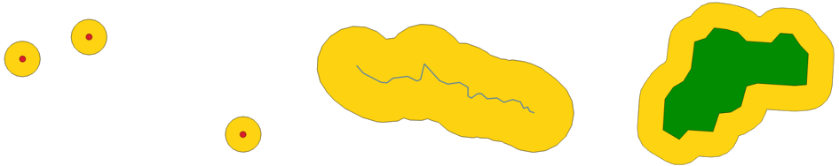

   Buffer (in yellow) of points, line, polygon with positive buffer, 
   and polygon with negative buffer 

|checkbox| Allows
:ref:`features in-place modification <processing_inplace_edit>` 
of polygon features

**Default menu**: :menuselection:`Vector --> Geoprocessing Tools`

.. seealso:: :ref:`qgisvariabledistancebuffer`,
   :ref:`qgismultiringconstantbuffer`, :ref:`qgisbufferbym`

Parameters
..........

Basic parameters
^^^^^^^^^^^^^^^^

.. list-table::
   :header-rows: 1
   :widths: 20 20 20 40
   :class: longtable

   * - Label
     - Name
     - Type
     - Description
   * - **Input layer**
     - ``INPUT``
     - [vector: any]
     - Input vector layer
   * - **Distance**
     - ``DISTANCE``
     - [number |dataDefine|]

       Default: 10.0
     - Buffer distance (from the boundary of each feature).
       You can use the Data Defined button on the right to choose
       a field from which the radius will be calculated.
       This way you can have different radius for each feature
       (see :ref:`qgisvariabledistancebuffer`).
   * - **Segments**
     - ``SEGMENTS``
     - [number]

       Default: 5
     - Controls the number of line segments to use to approximate
       a quarter circle when creating rounded offsets.
   * - **End cap style**
     - ``END_CAP_STYLE``
     - [enumeration]

       Default: 0
     - Controls how line endings are handled in the buffer.
       One of:

       * 0 --- Round
       * 1 --- Flat
       * 2 --- Square

       .. figure:: img/buffer_cap_style.png
          :align: center
          :width: 100%

          Round, flat and square cap styles
   * - **Join style**
     - ``JOIN_STYLE``
     - [enumeration]

       Default: 0
     - Specifies whether round, miter or beveled joins should be
       used when offsetting corners in a line.
       Options are:

       * 0 --- Round
       * 1 --- Miter
       * 2 --- Bevel

       .. figure:: img/buffer_join_style.png
          :align: center
          :width: 100%

          Round, miter, and bevel join styles
   * - **Miter limit**
     - ``MITER_LIMIT``
     - [number]

       Default: 2.0
     - Sets the maximum distance from the offset geometry to use
       when creating a mitered join as a factor of the offset distance (only applicable for miter
       join styles).
       Minimum: 1.0
              
       .. figure:: img/buffer_miter_limit.png
          :align: center
          :width: 100%
         
          A 10m buffer with a limit of 2 and a 10m buffer with a limit of 1
   * - **Dissolve result**
     - ``DISSOLVE``
     - [boolean]

       Default: False
     - Dissolve the final buffer. If ``True`` (checked), overlapping
       buffers will be dissolved (combined) into a single multipart feature.

       .. figure:: img/buffer_dissolve.png
          :align: center
          :width: 100%

          Standard (three single part features - left), dissolved (1 multipart feature with 2 parts - right)
   * - **Buffered**
     - ``OUTPUT``
     - [vector: polygon]

       Default: ``[Create temporary layer]``
     - Specify the output (buffer) layer.
       One of:

       .. include:: ../algs_include.rst
          :start-after: **layer_output_types_append**
          :end-before: **end_layer_output_types_append**

Advanced parameters
^^^^^^^^^^^^^^^^^^^

.. list-table::
   :header-rows: 1
   :widths: 20 20 20 40

   * - Label
     - Name
     - Type
     - Description
   * - **Keep disjoint features separate**
     - ``SEPARATE_DISJOINT``
     - [boolean]

       Default: False
     - If ``True`` (checked) and dissolved is checked, features that do not overlap or touch will be exported as 
       separate features
       (instead of parts of a multipart feature).

       .. figure:: img/buffer_disjoint.png
          :align: center

          Results in 2 single part features

Outputs
.......

.. list-table::
   :header-rows: 1
   :widths: 20 20 20 40

   * - Label
     - Name
     - Type
     - Description
   * - **Buffered**
     - ``OUTPUT``
     - [vector: polygon]
     - Output (buffer) polygon layer

Python code
...........

**Algorithm ID**: ``native:buffer``

.. include:: ../algs_include.rst
  :start-after: **algorithm_code_section**
  :end-before: **end_algorithm_code_section**

.. _qgiscentroids:

Centroids
---------
Creates a new point layer, with points representing the centroids
of the geometries of the input layer.

The centroid is a single point representing the barycenter (of all
parts) of the feature, so it can be outside the feature borders.
But can also be a point on each part of the feature.

The attributes of the points in the output layer are the same
as for the original features.

.. figure:: img/centroids.png
   :align: center

   The red stars represent the centroids of the features of the
   input layer.

|checkbox| Allows
:ref:`features in-place modification <processing_inplace_edit>`
of point features

**Default menu**: :menuselection:`Vector --> Geometry Tools`

.. seealso:: :ref:`qgispointonsurface`

Parameters
..........

.. list-table::
   :header-rows: 1
   :widths: 20 20 20 40

   * - Label
     - Name
     - Type
     - Description
   * - **Input layer**
     - ``INPUT``
     - [vector: any]
     - Input vector layer
   * - **Create centroid for each part**
     - ``ALL_PARTS``
     - [boolean |dataDefine|]

       Default: False
     - If True (checked), a centroid will be created for each part
       of the geometry
   * - **Centroids**
     - ``OUTPUT``
     - [vector: point]

       Default: ``[Create temporary layer]``
     - Specify the output (centroid) layer.
       One of:

       .. include:: ../algs_include.rst
          :start-after: **layer_output_types_append**
          :end-before: **end_layer_output_types_append**

Outputs
.......

.. list-table::
   :header-rows: 1
   :widths: 20 20 20 40

   * - Label
     - Name
     - Type
     - Description
   * - **Centroids**
     - ``OUTPUT``
     - [vector: point]
     - Output point vector layer (centroids)

Python code
...........

**Algorithm ID**: ``native:centroids``

.. include:: ../algs_include.rst
  :start-after: **algorithm_code_section**
  :end-before: **end_algorithm_code_section**

.. _qgischeckvalidity:

Check validity
--------------
Performs a validity check on the geometries of a vector layer.

The geometries are classified in three groups (valid, invalid and
error) and for each group, a vector layer with its features is
generated:

* The **Valid output** layer contains only the valid features (without
  topological errors).
* The **Invalid output** layer contains all the invalid features found
  by the algorithm.
* The **Error output** layer is a point layer that points to where the
  invalid features were found.

The attribute tables of the generated layers will contain some
additional information ("message" for the **error** layer, "FID" and
"_errors" for the **invalid** layer and  only "FID" for the **valid**
layer):

The attribute table of each generated vector layer will contain some
additional information (number of errors found and types of error):

.. figure:: img/check_validity.png
   :align: center

   Left: the input layer. Right: the valid layer (green), the invalid
   layer (orange)

**Default menu**: :menuselection:`Vector --> Geometry Tools`

.. seealso:: :ref:`qgisfixgeometries` and the core plugin
   :ref:`geometry_checker`

Parameters
..........

.. list-table::
   :header-rows: 1
   :widths: 20 20 20 40
   :class: longtable

   * - Label
     - Name
     - Type
     - Description
   * - **Input layer**
     - ``INPUT_LAYER``
     - [vector: any]
     - Input vector layer
   * - **Method**
     - ``METHOD``
     - [enumeration]

       Default: 2
     - Method to use to check validity.
       Options:

       * 0: The one selected in digitizing settings
       * 1: QGIS
       * 2: GEOS
   * - **Ignore ring self intersection**
     - ``IGNORE_RING_SELF_INTERSECTION``
     - [boolean]

       Default: False
     - Ignore self intersecting rings when checking for validity.
   * -  **Valid output**
     - ``VALID_OUTPUT``
     - [same as input]

       Default: ``[Create temporary layer]``
     - Specify the vector layer to contain a copy of the valid
       features of the source layer. One of:

       .. include:: ../algs_include.rst
          :start-after: **layer_output_types_skip**
          :end-before: **end_layer_output_types_skip**

   * - **Invalid output**
     - ``INVALID_OUTPUT``
     - [same as input]

       Default: ``[Create temporary layer]``
     - Vector layer containing copy of the invalid features of
       the source layer with the field  ``_errors`` listing the
       summary of the error(s) found. One of:

       .. include:: ../algs_include.rst
          :start-after: **layer_output_types_skip**
          :end-before: **end_layer_output_types_skip**

   * - **Error output**
     - ``ERROR_OUTPUT``
     - [vector: point]

       Default: ``[Create temporary layer]``
     - Point layer of the exact position of the validity
       problems detected with the ``message`` field describing
       the error(s) found. One of:

       .. include:: ../algs_include.rst
          :start-after: **layer_output_types_skip**
          :end-before: **end_layer_output_types_skip**

Outputs
.......

.. list-table::
   :header-rows: 1
   :widths: 20 20 20 40
   :class: longtable

   * - Label
     - Name
     - Type
     - Description
   * - **Count of errors**
     - ``ERROR_COUNT``
     - [number]
     - The number of geometries that caused errors.
   * - **Error output**
     - ``ERROR_OUTPUT``
     - [vector: point]
     - Point layer of the exact position of the validity
       problems detected with the ``message`` field describing
       the error(s) found.
   * - **Count of invalid features**
     - ``INVALID_COUNT``
     - [number]
     - The number of invalid geometries.
   * - **Invalid output**
     - ``INVALID_OUTPUT``
     - [same as input]
     - Vector layer containing copy of the invalid features of
       the source layer with the field  ``_errors`` listing the
       summary of the error(s) found.
   * -  **Count of valid features**
     - ``VALID_COUNT``
     - [number]
     - The number of valid geometries.
   * -  **Valid output**
     - ``VALID_OUTPUT``
     - [same as input]
     - Vector layer containing a copy of the valid features of
       the source layer.

Python code
...........

**Algorithm ID**: ``qgis:checkvalidity``

.. include:: ../algs_include.rst
  :start-after: **algorithm_code_section**
  :end-before: **end_algorithm_code_section**

.. index:: GEOS, QGIS
.. _typesofgeomerrors:

Types of error messages and their meanings
..........................................

.. list-table:: If the GEOS method is used the following error messages can occur:
   :widths: 30 30 40
   :header-rows: 1
   :class: longtable

   * - Error message
     - Explanation
     - Example

   * - Repeated point
     - This error happens when a given vertex is repeated.
     - .. figure:: img/geos_rep_point.png
          :align: center

   * - Ring self-intersection
     - This error happens when a geometry touches itself and generates
       a ring.
     - .. figure:: img/geos_ring_inter.png
          :align: center

   * - Self-intersection
     - This error happens when a geometry touches itself.
     - .. figure:: img/geos_self_inter.png
          :align: center

   * - Topology validation error
     -
     -

   * - Hole lies outside shell
     -
     -

   * - Holes are nested
     -
     -

   * - Interior is disconnected
     -
     -

   * - Nested shells
     - This error happens when a polygon geometry is on top of another
       polygon geometry.
     - .. figure:: img/geos_nest_shell.png
          :align: center

   * - Duplicate rings
     - This error happens when two rings (exterior or interior) of a
       polygon geometry are identical

     - .. figure:: img/geos_dupl_rings.png
          :align: center

   * - Too few points in geometry component
     -
     -

   * - Invalid coordinate
     - For a point geometry, this error happens when the geometry does
       not have a proper coordinate pair.
       The coordinate pair does not contain a latitude value and a
       longitude value in that order.
     -

   * - Ring is not closed
     -
     -

.. list-table:: If the QGIS method is used the following error messages can occur:
   :widths: 50 50 50
   :header-rows: 1
   :class: longtable

   * - Error message
     - Explanation
     - Example

   * - Segment %1 of ring %2 of polygon %3 intersects segment %4
       of ring %5 of polygon %6 at %7
     -
     -

   * - Ring %1 with less than four points
     -
     -

   * - Ring %1 not closed
     -
     -

   * - Line %1 with less than two points
     -
     -

   * - Line %1 contains %n duplicate node(s) at %2
     - This error happens when consecutive points on a line have the
       same coordinates.
     - .. figure:: img/geos_rep_point.png
          :align: center

   * - Segments %1 and %2 of line %3 intersect at %4
     - This error happens when a line self intersects (two segments
       of the line intersect each other).
     - .. figure:: img/qgis_seg_line_int.png
          :align: center

   * - Ring self-intersection
     - This error happens when an outer or inner (island) ring /
       boundary of a polygon geometry intersects itself.
     - .. figure:: img/geos_ring_inter.png
          :align: center

   * - Ring %1 of polygon %2 not in exterior ring
     -
     -

   * - Polygon %1 lies inside polygon %2
     - This error happens when a part of a MultiPolygon geometry is
       inside a hole of a MultiPolygon geometry.
     - .. figure:: img/qgis_poliinside_.png
          :align: center

.. _qgiscollect:

Collect geometries
------------------
Takes a vector layer and collects its geometries into new multipart
geometries.

One or more attributes can be specified to collect only geometries
belonging to the same class (having the same value for the specified
attributes), alternatively all geometries can be collected.

All output geometries will be converted to multi geometries, even
those with just a single part.
This algorithm does not dissolve overlapping geometries - they will
be collected together without modifying the shape of each geometry
part.

See the 'Promote to multipart' or 'Aggregate' algorithms for
alternative options.

**Default menu**: :menuselection:`Vector --> Geometry Tools`

.. seealso:: :ref:`qgisaggregate`, :ref:`qgispromotetomulti`,
   :ref:`qgisdissolve`

Parameters
..........

.. list-table::
   :header-rows: 1
   :widths: 20 20 20 40

   * - Label
     - Name
     - Type
     - Description
   * - **Input layer**
     - ``INPUT``
     - [vector: any]
     - Input vector layer
   * - **Unique ID fields**
     - ``FIELD``
     - [tablefield: any] [list]
     - Choose one or more attributes to collect the geometries
   * - **Collected**
     - ``OUTPUT``
     - [same as input]
     - Vector layer with collected geometries

Outputs
.......

.. list-table::
   :header-rows: 1
   :widths: 20 20 20 40

   * - Label
     - Name
     - Type
     - Description
   * - **Collected**
     - ``OUTPUT``
     - [same as input]

       Default: ``[Create temporary layer]``
     - Specify the output vector layer for the collected geometries.
       One of:

       .. include:: ../algs_include.rst
          :start-after: **layer_output_types**
          :end-before: **end_layer_output_types**

Python code
...........

**Algorithm ID**: ``native:collect``

.. include:: ../algs_include.rst
  :start-after: **algorithm_code_section**
  :end-before: **end_algorithm_code_section**

.. _qgisconcavehull:

Concave hull
------------
Computes the concave hull of the features from an input point layer.

.. figure:: img/concave_hull_threshold.png
    :align: center

    Concave hulls with different thresholds (0.3, 0.6, 0.9)

.. seealso:: :ref:`qgisconvexhull`

Parameters
..........

.. list-table::
   :header-rows: 1
   :widths: 20 20 20 40
   :class: longtable

   * - Label
     - Name
     - Type
     - Description
   * - **Input point layer**
     - ``INPUT``
     - [vector: point]
     - Input point vector layer
   * - **Threshold**
     - ``ALPHA``
     - [number]

       Default: 0.3
     - Number from 0 (maximum concave hull) to 1 (convex hull).
   * - **Allow holes**
     - ``HOLES``
     - [boolean]

       Default: True
     - Choose whether to allow holes in the final concave hull
   * - **Split multipart geometry into singlepart geometries**
     - ``NO_MULTIGEOMETRY``
     - [boolean]

       Default: False
     - Check if you want to have singlepart geometries
       instead of multipart ones.
   * - **Concave hull**
     - ``OUTPUT``
     - [vector: polygon]

       Default: ``[Create temporary layer]``
     - Specify the output vector layer. One of:

       .. include:: ../algs_include.rst
          :start-after: **layer_output_types**
          :end-before: **end_layer_output_types**

Outputs
.......

.. list-table::
   :header-rows: 1
   :widths: 20 20 20 40

   * - Label
     - Name
     - Type
     - Description
   * - **Concave hull**
     - ``OUTPUT``
     - [vector: polygon]
     - The output vector layer

Python code
...........

**Algorithm ID**: ``native:concavehull``

.. include:: ../algs_include.rst
  :start-after: **algorithm_code_section**
  :end-before: **end_algorithm_code_section**

.. _qgisconvertgeometrytype:

Convert geometry type
---------------------
Generates a new layer based on an existing one, with a different type
of geometry.

The attribute table of the output layer is the same as the one of
the input layer.

Not all conversions are possible. For instance, a line layer
can be converted to a point layer, but a point layer cannot
be converted to a line layer.

.. seealso:: :ref:`qgispolygonize`, :ref:`qgislinestopolygons`, :ref:`qgispolygonstolines`,
   :ref:`qgispointstopath`

Parameters
..........

.. list-table::
   :header-rows: 1
   :widths: 20 20 20 40

   * - Label
     - Name
     - Type
     - Description
   * - **Input layer**
     - ``INPUT``
     - [vector: any]
     - Input vector layer
   * - **New geometry type**
     - ``TYPE``
     - [enumeration]

       Default: 0
     - Geometry type to apply to the output features.
       One of:

       * 0 --- Centroids
       * 1 --- Nodes
       * 2 --- Linestrings
       * 3 --- Multilinestrings
       * 4 --- Polygons

   * - **Converted**
     - ``OUTPUT``
     - [vector: any]

       Default: ``[Create temporary layer]``
     - Specify the output vector layer.
       One of:

       .. include:: ../algs_include.rst
          :start-after: **layer_output_types**
          :end-before: **end_layer_output_types**

Outputs
.......

.. list-table::
   :header-rows: 1
   :widths: 20 20 20 40

   * - Label
     - Name
     - Type
     - Description
   * - **Converted**
     - ``OUTPUT``
     - [vector: any]
     - Output vector layer - the type depends on the parameters

Python code
...........

**Algorithm ID**: ``qgis:convertgeometrytype``

.. include:: ../algs_include.rst
  :start-after: **algorithm_code_section**
  :end-before: **end_algorithm_code_section**

.. _qgisconverttocurves:

Convert to curved geometries
----------------------------

Converts a geometry into its curved geometry equivalent.

Already curved geometries will be retained without change.

|checkbox| Allows
:ref:`features in-place modification <processing_inplace_edit>`
of line and polygon features

Parameters
..........

.. list-table::
   :header-rows: 1
   :widths: 20 20 20 40
   :class: longtable

   * - Label
     - Name
     - Type
     - Description
   * - **Input layer**
     - ``INPUT``
     - [vector: line or polygon]
     - Input vector layer
   * - **Maximum distance tolerance**
     - ``DISTANCE``
     - [number]

       Default: 0.000001
     - The maximum distance allowed between the original location of vertices
       and where they would fall on the converted curved geometries
   * - **Maximum angle tolerance**
     - ``ANGLE``
     - [number]

       Default: 0.000001
     - Segments are considered as suitable for replacing with an arc
       if the points are all regularly spaced on the candidate arc.
       This parameter specifies the maximum angular deviation (in degrees)
       allowed when testing for regular point spacing. Between 0 and 45\°.
   * - **Curves**
     - ``OUTPUT``
     - [vector: compoundcurve or curvepolygon]

       Default: ``[Create temporary layer]``
     - Specify the output vector layer.
       One of:

       .. include:: ../algs_include.rst
          :start-after: **layer_output_types_append**
          :end-before: **end_layer_output_types_append**

Outputs
.......

.. list-table::
   :header-rows: 1
   :widths: 20 20 20 40

   * - Label
     - Name
     - Type
     - Description
   * - **Curves**
     - ``OUTPUT``
     - [vector: compoundcurve or curvepolygon]
     - Output vector layer with curved geometries

Python code
...........

**Algorithm ID**: ``native:converttocurves``

.. include:: ../algs_include.rst
  :start-after: **algorithm_code_section**
  :end-before: **end_algorithm_code_section**

.. _qgisconvexhull:

Convex hull
-----------
Calculates the convex hull for each feature in an input layer.

See the 'Minimum bounding geometry' algorithm for a convex hull
calculation which covers the whole layer or grouped subsets of
features.

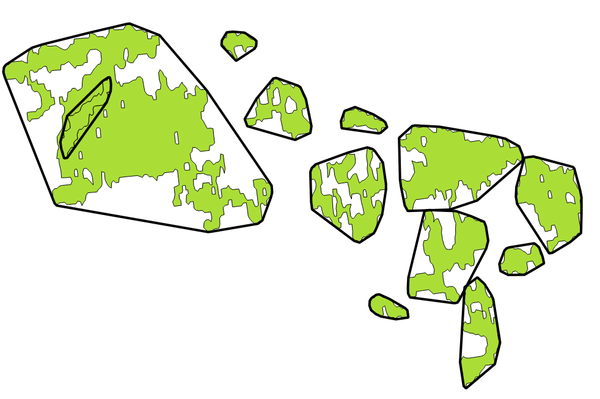

   Black lines identify the convex hull for each layer feature

|checkbox| Allows
:ref:`features in-place modification <processing_inplace_edit>`
of polygon features

**Default menu**: :menuselection:`Vector --> Geoprocessing Tools`

.. seealso:: :ref:`qgisminimumboundinggeometry`,
   :ref:`qgisconcavehull`

Parameters
..........

.. list-table::
   :header-rows: 1
   :widths: 20 20 20 40

   * - Label
     - Name
     - Type
     - Description
   * - **Input layer**
     - ``INPUT``
     - [vector: any]
     - Input vector layer
   * - **Convex hull**
     - ``OUTPUT``
     - [vector: polygon]

       Default: ``[Create temporary layer]``
     - Specify the output vector layer. One of:

       .. include:: ../algs_include.rst
          :start-after: **layer_output_types_append**
          :end-before: **end_layer_output_types_append**

Outputs
.......

.. list-table::
   :header-rows: 1
   :widths: 20 20 20 40

   * - Label
     - Name
     - Type
     - Description
   * - **Convex hull**
     - ``OUTPUT``
     - [vector: polygon]
     - The output (convex hull) vector layer

Python code
...........

**Algorithm ID**: ``native:convexhull``

.. include:: ../algs_include.rst
  :start-after: **algorithm_code_section**
  :end-before: **end_algorithm_code_section**

.. _qgisextenttolayer:

Create layer from extent
------------------------
Creates a new vector layer that contains a single feature with
geometry matching the extent of the input layer.

It can be used in models to convert a literal extent (``xmin``,
``xmax``, ``ymin``, ``ymax`` format) into a layer which can be used
for other algorithms which require a layer based input.

.. seealso:: :ref:`qgispointtolayer`

Parameters
..........

.. list-table::
   :header-rows: 1
   :widths: 20 20 20 40

   * - Label
     - Name
     - Type
     - Description
   * - **Extent (xmin, xmax, ymin, ymax)**
     - ``INPUT``
     - [extent]
     - Input extent

       .. include:: ../algs_include.rst
          :start-after: **extent_options**
          :end-before: **end_extent_options**

   * - **Extent**
     - ``OUTPUT``
     - [vector: polygon]

       Default: ``[Create temporary layer]``
     - Specify the output vector layer. One of:

       .. include:: ../algs_include.rst
          :start-after: **layer_output_types**
          :end-before: **end_layer_output_types**

Outputs
.......

.. list-table::
   :header-rows: 1
   :widths: 20 20 20 40

   * - Label
     - Name
     - Type
     - Description
   * - **Extent**
     - ``OUTPUT``
     - [vector: polygon]
     - The output (extent) vector layer

Python code
...........

**Algorithm ID**: ``native:extenttolayer``

.. include:: ../algs_include.rst
  :start-after: **algorithm_code_section**
  :end-before: **end_algorithm_code_section**

.. _qgispointtolayer:

Create layer from point
-----------------------------

Creates a new vector layer that contains a single feature with
geometry matching a point parameter.
It can be used in models to convert a point into a point layer for
algorithms which require a layer based input.

.. seealso:: :ref:`qgisextenttolayer`

Parameters
..........

.. list-table::
   :header-rows: 1
   :widths: 20 20 20 40

   * - Label
     - Name
     - Type
     - Description
   * - **Point**
     - ``INPUT``
     - [coordinates]
     - Input point, including CRS info
       (example: ``397254,6214446 [EPSG:32632]``).

       If the CRS is not provided, the Project CRS will be used.

       The point can be specified by clicking on the map canvas.
   * - **Point**
     - ``OUTPUT``
     - [vector: point]

       Default: ``[Create temporary layer]``
     - Specify the output layer.
       One of:

       .. include:: ../algs_include.rst
          :start-after: **layer_output_types**
          :end-before: **end_layer_output_types**

Outputs
.......

.. list-table::
   :header-rows: 1
   :widths: 20 20 20 40

   * - Label
     - Name
     - Type
     - Description
   * - **Point**
     - ``OUTPUT``
     - [vector: point]
     - The output point vector layer containing the input point.

Python code
...........

**Algorithm ID**: ``native:pointtolayer``

.. include:: ../algs_include.rst
  :start-after: **algorithm_code_section**
  :end-before: **end_algorithm_code_section**

.. _qgiswedgebuffers:

Create wedge buffers
--------------------
Creates wedge shaped buffers from input points.

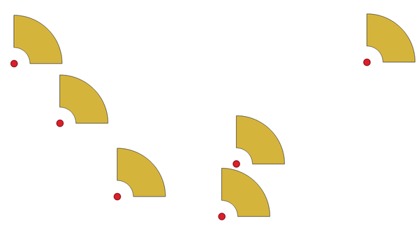

   Wedge buffers

The native output from this algorithm are CurvePolygon geometries,
but these may be automatically segmentized to Polygons depending
on the output format.

.. seealso:: :ref:`qgisbuffer`, :ref:`qgisbufferbym`,
   :ref:`qgistaperedbuffer`

Parameters
..........

.. list-table::
   :header-rows: 1
   :widths: 20 20 20 40
   :class: longtable

   * - Label
     - Name
     - Type
     - Description
   * - **Input layer**
     - ``INPUT``
     - [vector: point]
     - Input point vector layer
   * - **Azimuth (degrees from North)**
     - ``AZIMUTH``
     - [number |dataDefine|]

       Default: 0.0
     - Angle (in degrees) as the middle value of the wedge
   * - **Wedge width (in degrees)**
     - ``WIDTH``
     - [number |dataDefine|]

       Default: 45.0
     - Width (in degrees) of the buffer.
       The wedge will extend to half of the angular width either side
       of the azimuth direction.

       .. figure:: img/wedge_buffers_azimuth_width.png
         :align: center

         Azimuth and width values of the wedge buffer

   * - **Outer radius**
     - ``OUTER_RADIUS``
     - [number |dataDefine|]

       Default: 1.0
     - The outer *size* (length) of the wedge:
       the size is meant from the source point to the edge of the
       wedge shape.
   * - **Inner radius**

       Optional
     - ``INNER_RADIUS``
     - [number |dataDefine|]

       Default: 0.0
     - Inner radius value.
       If 0 the wedge will begin from the source point.
   * - **Buffers**
     - ``OUTPUT``
     - [vector: polygon]

       Default: ``[Create temporary layer]``
     - Specify the output vector layer. One of:

       .. include:: ../algs_include.rst
          :start-after: **layer_output_types_append**
          :end-before: **end_layer_output_types_append**

Outputs
.......

.. list-table::
   :header-rows: 1
   :widths: 20 20 20 40

   * - Label
     - Name
     - Type
     - Description
   * - **Buffers**
     - ``OUTPUT``
     - [vector: polygon]
     - The output (wedge buffer) vector layer

Python code
...........

**Algorithm ID**: ``native:wedgebuffers``

.. include:: ../algs_include.rst
  :start-after: **algorithm_code_section**
  :end-before: **end_algorithm_code_section**

.. _qgisdelaunaytriangulation:

Delaunay triangulation
----------------------
Creates a polygon layer with the Delaunay triangulation corresponding
to the input point layer.

.. figure:: img/delaunay.png
   :align: center

   Delaunay triangulation on points

**Default menu**: :menuselection:`Vector --> Geometry Tools`

Parameters
..........

.. list-table::
   :header-rows: 1
   :widths: 20 20 20 40

   * - Label
     - Name
     - Type
     - Description
   * - **Input layer**
     - ``INPUT``
     - [vector: point]
     - Input point vector layer
   * - **Tolerance**

       Optional
     - ``TOLERANCE``
     - [number]

       Default: 0.0
     - Specifies an optional snapping tolerance which can be used to improve the robustness of the triangulation.
   * - **Add point IDs to output**
     - ``ADD_ATTRIBUTES``
     - [boolean]

       Default: True
     - Specifies whether fields storing involved point features ID should be added to the output.
       If False, an ``id`` field is used to identify the polygons.
   * - **Delaunay triangulation**
     - ``OUTPUT``
     - [vector: polygon]

       Default: ``[Create temporary layer]``
     - Specify the output vector layer. One of:

       .. include:: ../algs_include.rst
          :start-after: **layer_output_types**
          :end-before: **end_layer_output_types**

Outputs
.......

.. list-table::
   :header-rows: 1
   :widths: 20 20 20 40

   * - Label
     - Name
     - Type
     - Description
   * - **Delaunay triangulation**
     - ``OUTPUT``
     - [vector: polygon]
     - The output (Delaunay triangulation) vector layer

Python code
...........

**Algorithm ID**: ``native:delaunaytriangulation``

.. include:: ../algs_include.rst
  :start-after: **algorithm_code_section**
  :end-before: **end_algorithm_code_section**

.. _qgisdeleteholes:

Delete holes
------------
Takes a polygon layer and removes holes in polygons.
It creates a new vector layer in which polygons with holes have been
replaced by polygons with only their external ring.
Attributes are not modified.

An optional minimum area parameter allows removing only holes which
are smaller than a specified area threshold. Leaving this parameter at
``0.0`` results in all holes being removed.

.. figure:: img/delete_holes.png
   :align: center

   Before and after the cleaning

|checkbox| Allows
:ref:`features in-place modification <processing_inplace_edit>`
of polygon features

Parameters
..........

.. list-table::
   :header-rows: 1
   :widths: 20 20 20 40

   * - Label
     - Name
     - Type
     - Description
   * - **Input layer**
     - ``INPUT``
     - [vector: polygon]
     - Input polygon vector layer
   * - **Remove holes with area less than**

       Optional
     - ``MIN_AREA``
     - [number |dataDefine|]

       Default: 0.0
     - Only holes with an area less than this threshold will be
       deleted.
       With a value of ``0.0``, **all** the holes will be deleted.
   * - **Cleaned**
     - ``OUTPUT``
     - [same as input]

       Default: ``[Create temporary layer]``
     - Specify the output vector layer. One of:

       .. include:: ../algs_include.rst
          :start-after: **layer_output_types_append**
          :end-before: **end_layer_output_types_append**

Outputs
.......

.. list-table::
   :header-rows: 1
   :widths: 20 20 20 40

   * - Label
     - Name
     - Type
     - Description
   * - **Cleaned**
     - ``OUTPUT``
     - [same as input]
     - The output (cleaned) vector layer

Python code
...........

**Algorithm ID**: ``native:deleteholes``

.. include:: ../algs_include.rst
  :start-after: **algorithm_code_section**
  :end-before: **end_algorithm_code_section**

.. _qgisdensifygeometries:

Densify by count
----------------
Takes a polygon or line layer and generates a new one in which the
geometries have a larger number of vertices than the original one.

If the geometries have Z or M values present then these will be
linearly interpolated at the added vertices.

The number of new vertices to add to each segment is specified as an
input parameter.

.. figure:: img/densify_geometry.png
   :align: center

   Red points show the vertices before and after the densify

|checkbox| Allows
:ref:`features in-place modification <processing_inplace_edit>`
of line and polygon features

**Default menu**: :menuselection:`Vector --> Geometry Tools`

.. seealso:: :ref:`qgisdensifygeometriesgivenaninterval`

Parameters
..........

.. list-table::
   :header-rows: 1
   :widths: 20 20 20 40

   * - Label
     - Name
     - Type
     - Description
   * - **Input layer**
     - ``INPUT``
     - [vector: line, polygon]
     - Input line or polygon vector layer
   * - **Vertices to add**
     - ``VERTICES``
     - [number]

       Default: 1
     - Number of vertices to add to each segment
   * - **Densified**
     - ``OUTPUT``
     - [same as input]

       Default: ``[Create temporary layer]``
     - Specify the output vector layer. One of:

       .. include:: ../algs_include.rst
          :start-after: **layer_output_types_append**
          :end-before: **end_layer_output_types_append**

Outputs
.......

.. list-table::
   :header-rows: 1
   :widths: 20 20 20 40

   * - Label
     - Name
     - Type
     - Description
   * - **Densified**
     - ``OUTPUT``
     - [same as input]
     - The output (densified) vector layer

Python code
...........

**Algorithm ID**: ``native:densifygeometries``

.. include:: ../algs_include.rst
  :start-after: **algorithm_code_section**
  :end-before: **end_algorithm_code_section**

.. _qgisdensifygeometriesgivenaninterval:

Densify by interval
-------------------
Takes a polygon or line layer and generates a new one in which the
geometries have a larger number of vertices than the original one.

The geometries are densified by adding regularly placed extra
vertices inside each segment so that the maximum distance between
any two vertices does not exceed the specified distance.

If the geometries have Z or M values present then these will be
linearly interpolated at the added vertices.

**Example**

Specifying a distance of 3 would cause the segment
``[0 0] -> [10 0]`` to be converted to
``[0 0] -> [2.5 0] -> [5 0] -> [7.5 0] -> [10 0]``,
since 3 extra vertices are required on the segment and spacing these
at 2.5 increments allows them to be evenly spaced over the segment.

.. figure:: img/densify_geometry_interval.png
   :align: center

   Densify geometry at a given interval

|checkbox| Allows
:ref:`features in-place modification <processing_inplace_edit>`
of line and polygon features

.. seealso:: :ref:`qgisdensifygeometries`

Parameters
..........

.. list-table::
   :header-rows: 1
   :widths: 20 20 20 40

   * - Label
     - Name
     - Type
     - Description
   * - **Input layer**
     - ``INPUT``
     - [vector: line, polygon]
     - Input line or polygon vector layer
   * - **Interval between vertices to add**
     - ``INTERVAL``
     - [number |dataDefine|]

       Default: 1.0
     - Maximum distance between two consecutive vertices
   * - **Densified**
     - ``OUTPUT``
     - [same as input]

       Default: ``[Create temporary layer]``
     - Specify the output vector layer. One of:

       .. include:: ../algs_include.rst
          :start-after: **layer_output_types_append**
          :end-before: **end_layer_output_types_append**

Outputs
.......

.. list-table::
   :header-rows: 1
   :widths: 20 20 20 40

   * - Label
     - Name
     - Type
     - Description
   * - **Densified**
     - ``OUTPUT``
     - [same as input]
     - The output (densified) vector layer

Python code
...........

**Algorithm ID**: ``native:densifygeometriesgivenaninterval``

.. include:: ../algs_include.rst
  :start-after: **algorithm_code_section**
  :end-before: **end_algorithm_code_section**

.. _qgisdissolve:

Dissolve
--------
Takes a vector layer and combines its features into new features.
One or more attributes can be specified to dissolve features
belonging to the same class (having the same value for the specified
attributes), alternatively all features can be dissolved to a single
feature.

All output geometries will be converted to multi geometries.
In case the input is a polygon layer, common boundaries of adjacent
polygons being dissolved will get erased.
If enabled, the optional "Keep disjoint features separate" setting will
cause features and parts that do not overlap or touch to be exported as 
separate features (instead of parts of a single multipart feature).

The resulting attribute table will have the same fields as the input
layer.
The values in the output layer's fields are the ones of the first
input feature that happens to be processed.

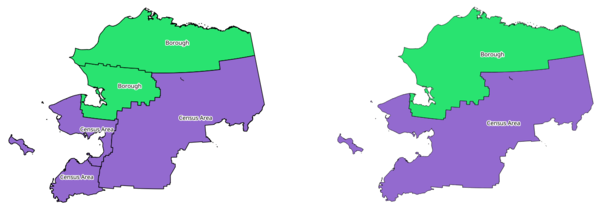

   Dissolving a layer into a single multipart feature

**Default menu**: :menuselection:`Vector --> Geoprocessing Tools`

.. seealso:: :ref:`qgisaggregate`, :ref:`qgiscollect`

Parameters
..........

Basic parameters
^^^^^^^^^^^^^^^^

.. list-table::
   :header-rows: 1
   :widths: 20 20 20 40

   * - Label
     - Name
     - Type
     - Description
   * - **Input layer**
     - ``INPUT``
     - [vector: any]
     - Input vector layer
   * - **Dissolve field(s)**

       Optional
     - ``FIELD``
     - [tablefield: any] [list]

       Default: []
     - Features having the same value for the
       selected field(s) will be replaced with a
       single one and their geometries are merged.

       If no field is provided then all the
       features are dissolved, resulting in a
       single (multipart) feature.

       .. figure:: img/dissolve_field.png
          :align: center

          Dissolve the polygon layer on a common attribute (2 multipart features)

   * - **Dissolved**
     - ``OUTPUT``
     - [same as input]

       Default: ``[Create temporary layer]``
     - Specify the output vector layer. One of:

       .. include:: ../algs_include.rst
          :start-after: **layer_output_types**
          :end-before: **end_layer_output_types**

Advanced parameters
^^^^^^^^^^^^^^^^^^^

.. list-table::
   :header-rows: 1
   :widths: 20 20 20 40

   * - Label
     - Name
     - Type
     - Description
   * - **Keep disjoint features separate**
     - ``SEPARATE_DISJOINT``
     - [boolean]

       Default: False
     - Parts of dissolved features are exported as separate features
       (instead of parts of a multipart feature).

       .. figure:: img/dissolve_disjoint.png
          :align: center

          source (left), dissolve all (3 distinct features - right)

       .. figure:: img/dissolve_disjoint_field.png
          :align: center

          source (left), dissolve on field (5 distinct features - right)

Outputs
.......

.. list-table::
   :header-rows: 1
   :widths: 20 20 20 40

   * - Label
     - Name
     - Type
     - Description
   * - **Dissolved**
     - ``OUTPUT``
     - [same as input]
     - The output vector layer with dissolved geometries

Python code
...........

**Algorithm ID**: ``native:dissolve``

.. include:: ../algs_include.rst
  :start-after: **algorithm_code_section**
  :end-before: **end_algorithm_code_section**

.. _qgissetzfromraster:

Drape (set Z value from raster)
-------------------------------
Uses values sampled from a band within a raster layer to set the Z
value for every overlapping vertex in the feature geometry.
The raster values can optionally be scaled by a preset amount.

If Z values already exist in the layer, they will be overwritten with
the new value.
If no Z values exist, the geometry will be upgraded to include the Z
dimension.

|checkbox| Allows
:ref:`features in-place modification <processing_inplace_edit>`
of point, line, and polygon features with Z enabled

.. seealso:: :ref:`qgissetmfromraster`, :ref:`qgissetzvalue`

Parameters
..........

.. list-table::
   :header-rows: 1
   :widths: 20 20 20 40
   :class: longtable

   * - Label
     - Name
     - Type
     - Description
   * - **Input layer**
     - ``INPUT``
     - [vector: any]
     - Input vector layer
   * - **Raster layer**
     - ``RASTER``
     - [raster]
     - Raster layer with Z values
   * - **Band number**
     - ``BAND``
     - [raster band]

       Default: 1
     - The raster band to take the Z values from
   * - **Value for NoData or non-intersecting vertices**
     - ``NODATA``
     - [number |dataDefine|]

       Default: 0
     - Value to use in case the vertex does not intersect
       (a valid pixel of) the raster
   * - **Scale factor**
     - ``SCALE``
     - [number |dataDefine|]

       Default: 1.0
     - Scaling value: the band values are multiplied
       by this value.
   * - **Offset**
     - ``OFFSET``
     - [number |dataDefine|]

       Default: 0.0
     - Offset value: it is algebraically added to the band
       values after applying the "Scale factor".
   * - **Updated**
     - ``OUTPUT``
     - [same as input]

       Default: ``[Create temporary layer]``
     - Specify the output vector layer (with Z values
       from the raster layer). One of:

       .. include:: ../algs_include.rst
          :start-after: **layer_output_types_append**
          :end-before: **end_layer_output_types_append**

Outputs
.......

.. list-table::
   :header-rows: 1
   :widths: 20 20 20 40

   * - Label
     - Name
     - Type
     - Description
   * - **Updated**
     - ``OUTPUT``
     - [same as input]
     - The output vector layer with Z values from the
       raster layer

Python code
...........

**Algorithm ID**: ``native:setzfromraster``

.. include:: ../algs_include.rst
  :start-after: **algorithm_code_section**
  :end-before: **end_algorithm_code_section**

.. _qgisdropmzvalues:

Drop M/Z values
---------------
Removes M (measure) or Z (altitude) values from input geometries.

.. seealso:: :ref:`qgissetmvalue`, :ref:`qgissetzvalue`

Parameters
..........

.. list-table::
   :header-rows: 1
   :widths: 20 20 20 40

   * - Label
     - Name
     - Type
     - Description
   * - **Input layer**
     - ``INPUT``
     - [vector: any]
     - Input vector layer with M or Z values
   * - **Drop M Values**
     - ``DROP_M_VALUES``
     - [boolean]

       Default: False
     - Removes the M values from the geometries
   * - **Drop Z Values**
     - ``DROP_Z_VALUES``
     - [boolean]

       Default: False
     - Removes the Z values from the geometries
   * - **Z/M Dropped**
     - ``OUTPUT``
     - [same as input]

       Default: ``[Create temporary layer]``
     - Specify the output vector layer. One of:

       .. include:: ../algs_include.rst
          :start-after: **layer_output_types_append**
          :end-before: **end_layer_output_types_append**

Outputs
.......

.. list-table::
   :header-rows: 1
   :widths: 20 20 20 40

   * - Label
     - Name
     - Type
     - Description
   * - **Z/M Dropped**
     - ``OUTPUT``
     - [same as input]
     - The output vector layer (identical to the input layer,
       except that the M and/or Z dimensions have been removed
       from the geometries).

Python code
...........

**Algorithm ID**: ``native:dropmzvalues``

.. include:: ../algs_include.rst
  :start-after: **algorithm_code_section**
  :end-before: **end_algorithm_code_section**

.. _qgiseliminateselectedpolygons:

Eliminate selected polygons
---------------------------
Combines selected polygons of the input layer with certain adjacent
polygons by erasing their common boundary.
The adjacent polygon can be either the one with the largest or
smallest area or the one sharing the largest common boundary with the
polygon to be eliminated.

Eliminate is normally used to get rid of sliver polygons, i.e. tiny
polygons that are a result of polygon intersection processes where
boundaries of the inputs are similar but not identical.

**Default menu**: :menuselection:`Vector --> Geoprocessing Tools`

.. seealso:: :ref:`qgisfixgeometries`

Parameters
..........

.. list-table::
   :header-rows: 1
   :widths: 20 20 20 40

   * - Label
     - Name
     - Type
     - Description
   * - **Input layer**
     - ``INPUT``
     - [vector: polygon]
     - Input polygon vector layer
   * - **Merge selection with the neighboring polygon with the**
     - ``MODE``
     - [enumeration]

       Default: None
     - Choose the parameter to use in order to get rid of
       the selected polygons:

       * 0 --- Largest Area
       * 1 --- Smallest Area
       * 2 --- Largest Common Boundary

   * - **Eliminated**
     - ``OUTPUT``
     - [vector: polygon]

       Default: ``[Create temporary layer]``
     - Specify the output vector layer. One of:

       .. include:: ../algs_include.rst
          :start-after: **layer_output_types**
          :end-before: **end_layer_output_types**

Outputs
.......

.. list-table::
   :header-rows: 1
   :widths: 20 20 20 40

   * - Label
     - Name
     - Type
     - Description
   * - **Eliminated**
     - ``OUTPUT``
     - [vector: polygon]
     - The output polygon vector layer.

Python code
...........

**Algorithm ID**: ``qgis:eliminateselectedpolygons``

.. include:: ../algs_include.rst
  :start-after: **algorithm_code_section**
  :end-before: **end_algorithm_code_section**

.. _qgisexplodelines:

Explode lines
-------------
Takes a lines layer and creates a new one in which each line layer is
replaced by a set of lines representing the segments in the original
line.

Each line in the resulting layer contains only a start and an end
point, with no intermediate vertices between them.

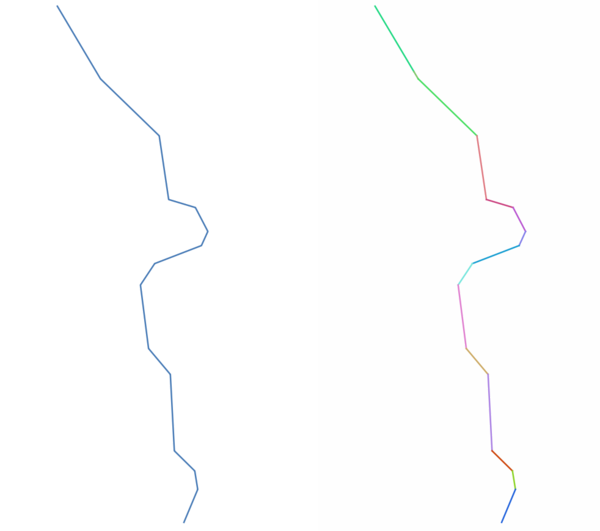

   The original line layer and the exploded one

|checkbox| Allows
:ref:`features in-place modification <processing_inplace_edit>`
of line features

.. seealso:: :ref:`qgissubdivide`, :ref:`qgislinesubstring`

Parameters
..........

.. list-table::
   :header-rows: 1
   :widths: 20 20 20 40

   * - Label
     - Name
     - Type
     - Description
   * - **Input layer**
     - ``INPUT``
     - [vector: line]
     - Input line vector layer
   * - **Exploded**
     - ``OUTPUT``
     - [vector: line]

       Default: ``[Create temporary layer]``
     - Specify the output vector layer. One of:

       .. include:: ../algs_include.rst
          :start-after: **layer_output_types_append**
          :end-before: **end_layer_output_types_append**

Outputs
.......

.. list-table::
   :header-rows: 1
   :widths: 20 20 20 40

   * - Label
     - Name
     - Type
     - Description
   * - **Exploded**
     - ``OUTPUT``
     - [vector: line]
     - The output line vector layer with features representing
       each segment of the input layer.

Python code
...........

**Algorithm ID**: ``native:explodelines``

.. include:: ../algs_include.rst
  :start-after: **algorithm_code_section**
  :end-before: **end_algorithm_code_section**

.. _qgisextendlines:

Extend lines
------------
Extends line geometry by a specified amount at the start and end of
the line.

Lines are extended using the bearing of the first and last segment in
the line.

.. figure:: img/extend_lines.png
   :align: center

   The red dashes represent the initial and final extension of the
   original layer

|checkbox| Allows
:ref:`features in-place modification <processing_inplace_edit>`
of line features

.. seealso:: :ref:`qgislinesubstring`

Parameters
..........

.. list-table::
   :header-rows: 1
   :widths: 20 20 20 40

   * - Label
     - Name
     - Type
     - Description
   * - **Input layer**
     - ``INPUT``
     - [vector: line]
     - Input line vector layer
   * - **Start distance**
     - ``START_DISTANCE``
     - [number |dataDefine|]
     - Distance by which to extend the first segment of the line
       (starting point)
   * - **End distance**
     - ``END_DISTANCE``
     - [number |dataDefine|]
     - Distance by which to extend the last segment of the line
       (ending point)
   * - **Extended**
     - ``OUTPUT``
     - [vector: line]

       Default: ``[Create temporary layer]``
     - Specify the output vector layer. One of:

       .. include:: ../algs_include.rst
          :start-after: **layer_output_types_append**
          :end-before: **end_layer_output_types_append**

Outputs
.......

.. list-table::
   :header-rows: 1
   :widths: 20 20 20 40

   * - Label
     - Name
     - Type
     - Description
   * - **Extended**
     - ``OUTPUT``
     - [vector: line]
     - The output (extended) line vector layer.

Python code
...........

**Algorithm ID**: ``native:extendlines``

.. include:: ../algs_include.rst
  :start-after: **algorithm_code_section**
  :end-before: **end_algorithm_code_section**

.. _qgisextractmvalues:

Extract M values
---------------------

Extracts M values from geometries into feature attributes.

By default only the M value from the first vertex of each feature is
extracted, however the algorithm can optionally calculate statistics
on all of the geometry's M values, including sum, mean, minimum and
maximum.

.. seealso:: :ref:`qgisextractzvalues`, :ref:`qgissetmvalue`, :ref:`qgisdropmzvalues`

Parameters
..........

.. list-table::
   :header-rows: 1
   :widths: 20 20 20 40
   :class: longtable

   * - Label
     - Name
     - Type
     - Description
   * - **Input layer**
     - ``INPUT``
     - [vector: any]
     - Input vector layer
   * - **Summaries to calculate**
     - ``SUMMARIES``
     - [enumeration]

       Default: [0]
     - Statistics on the M values of a geometry.
       One or more of:

       * 0 --- First
       * 1 --- Last
       * 2 --- Count
       * 3 --- Sum
       * 4 --- Mean
       * 5 --- Median
       * 6 --- St.dev (pop)
       * 7 --- Minimum
       * 8 --- Maximum
       * 9 --- Range
       * 10 --- Minority
       * 11 --- Majority
       * 12 --- Variety
       * 13 --- Q1
       * 14 --- Q3
       * 15 --- IQR

   * - **Output column prefix**
     - ``COLUMN_PREFIX``
     - [string]

       Default: 'm\_'
     - The prefix for the output (M) column
   * - **Extracted**
     - ``OUTPUT``
     - [same as input]

       Default: ``[Create temporary layer]``
     - Specify the output layer.
       One of:

       .. include:: ../algs_include.rst
          :start-after: **layer_output_types_append**
          :end-before: **end_layer_output_types_append**

Outputs
.......

.. list-table::
   :header-rows: 1
   :widths: 20 20 20 40

   * - Label
     - Name
     - Type
     - Description
   * - **Extracted**
     - ``OUTPUT``
     - [same as input]
     - The output vector layer (with M values)

Python code
...........

**Algorithm ID**: ``native:extractmvalues``

.. include:: ../algs_include.rst
  :start-after: **algorithm_code_section**
  :end-before: **end_algorithm_code_section**

.. _qgisextractspecificvertices:

Extract specific vertices
-------------------------
Takes a vector layer and generates a point layer with points
representing specific vertices in the input geometries.

For instance, this algorithm can be used to extract the first or last
vertices in the geometry.
The attributes associated to each point are the same ones associated
to the feature that the vertex belongs to.

The vertex indices parameter accepts a comma separated string
specifying the indices of the vertices to extract.
The first vertex corresponds to an index of 0, the second vertex has
an index of 1, etc. Negative indices can be used to find vertices at
the end of the geometry, e.g., an index of -1 corresponds to the last
vertex, -2 corresponds to the second last vertex, etc.

Additional fields are added to the vertices indicating the specific
vertex position (e.g., 0, -1, etc), the original vertex index, the
vertex’s part and its index within the part (as well as its ring for
polygons), distance along the original geometry and bisector angle of
vertex for the original geometry.

|checkbox| Allows
:ref:`features in-place modification <processing_inplace_edit>`
of point features

.. seealso:: :ref:`qgisextractvertices`, :ref:`qgisfilterverticesbym`,
   :ref:`qgisfilterverticesbyz`

Parameters
..........

.. list-table::
   :header-rows: 1
   :widths: 20 20 20 40

   * - Label
     - Name
     - Type
     - Description
   * - **Input layer**
     - ``INPUT``
     - [vector: any]
     - Input vector layer
   * - **Vertex indices**
     - ``VERTICES``
     - [string]

       Default: '0'
     - Comma-separated string of the indices of the vertices to
       extract.
   * - **Vertices**
     - ``OUTPUT``
     - [vector: point]

       Default: ``[Create temporary layer]``
     - Specify the output vector layer. One of:

       .. include:: ../algs_include.rst
          :start-after: **layer_output_types_append**
          :end-before: **end_layer_output_types_append**

Outputs
.......

.. list-table::
   :header-rows: 1
   :widths: 20 20 20 40

   * - Label
     - Name
     - Type
     - Description
   * - **Vertices**
     - ``OUTPUT``
     - [vector: point]
     - The output (point) vector layer containing the specified
       vertices from the input layer geometries.

Python code
...........

**Algorithm ID**: ``native:extractspecificvertices``

.. include:: ../algs_include.rst
  :start-after: **algorithm_code_section**
  :end-before: **end_algorithm_code_section**

.. _qgisextractvertices:

Extract vertices
----------------
Takes a vector layer and generates a point layer with points
representing the vertices in the input geometries.

The attributes associated to each point are the same ones associated
to the feature that the vertex belongs to.

Additional fields are added to the vertices indicating the vertex
index (beginning at 0), the feature’s part and its index within the
part (as well as its ring for polygons), distance along original
geometry and bisector angle of vertex for original geometry.

.. figure:: img/extract_nodes.png
   :align: center

   Vertices extracted for line and polygon layer

|checkbox| Allows
:ref:`features in-place modification <processing_inplace_edit>`
of point features

**Default menu**: :menuselection:`Vector --> Geometry Tools`

.. seealso:: :ref:`qgisextractspecificvertices`,
   :ref:`qgisfilterverticesbym`, :ref:`qgisfilterverticesbyz`

Parameters
..........

.. list-table::
   :header-rows: 1
   :widths: 20 20 20 40

   * - Label
     - Name
     - Type
     - Description
   * - **Input layer**
     - ``INPUT``
     - [vector: any]
     - Input vector layer
   * - **Vertices**
     - ``OUTPUT``
     - [vector: point]

       Default: ``[Create temporary layer]``
     - Specify the output vector layer. One of:

       .. include:: ../algs_include.rst
          :start-after: **layer_output_types_append**
          :end-before: **end_layer_output_types_append**

Outputs
.......

.. list-table::
   :header-rows: 1
   :widths: 20 20 20 40

   * - Label
     - Name
     - Type
     - Description
   * - **Vertices**
     - ``OUTPUT``
     - [vector: point]
     - The output (point) vector layer containing the vertices from
       the input layer geometries.

Python code
...........

**Algorithm ID**: ``native:extractvertices``

.. include:: ../algs_include.rst
  :start-after: **algorithm_code_section**
  :end-before: **end_algorithm_code_section**

.. _qgisextractzvalues:

Extract Z values
---------------------

Extracts Z values from geometries into feature attributes.

By default only the Z value from the first vertex of each feature is
extracted, however the algorithm can optionally calculate statistics
on all of the geometry's Z values, including sum, mean, minimum and
maximum.

.. seealso:: :ref:`qgisextractmvalues`, :ref:`qgissetzvalue`,
   :ref:`qgisdropmzvalues`

Parameters
..........

.. list-table::
   :header-rows: 1
   :widths: 20 20 20 40
   :class: longtable

   * - Label
     - Name
     - Type
     - Description
   * - **Input layer**
     - ``INPUT``
     - [vector: any]
     - Input vector layer
   * - **Summaries to calculate**
     - ``SUMMARIES``
     - [enumeration]

       Default: [0]
     - Statistics on the Z values of a geometry.
       One or more of:

       * 0 --- First
       * 1 --- Last
       * 2 --- Count
       * 3 --- Sum
       * 4 --- Mean
       * 5 --- Median
       * 6 --- St.dev (pop)
       * 7 --- Minimum
       * 8 --- Maximum
       * 9 --- Range
       * 10 --- Minority
       * 11 --- Majority
       * 12 --- Variety
       * 13 --- Q1
       * 14 --- Q3
       * 15 --- IQR

   * - **Output column prefix**
     - ``COLUMN_PREFIX``
     - [string]

       Default: 'z\_'
     - The prefix for the output (Z) column
   * - **Extracted**
     - ``OUTPUT``
     - [same as input]

       Default: ``[Create temporary layer]``
     - Specify the output layer.
       One of:

       .. include:: ../algs_include.rst
          :start-after: **layer_output_types_append**
          :end-before: **end_layer_output_types_append**

Outputs
.......

.. list-table::
   :header-rows: 1
   :widths: 20 20 20 40

   * - Label
     - Name
     - Type
     - Description
   * - **Extracted**
     - ``OUTPUT``
     - [same as input]
     - The output vector layer (with Z values)

Python code
...........

**Algorithm ID**: ``native:extractzvalues``

.. include:: ../algs_include.rst
  :start-after: **algorithm_code_section**
  :end-before: **end_algorithm_code_section**

.. _qgisfilterverticesbym:

Filter vertices by M value
--------------------------
Filters away vertices based on their M value, returning geometries
with only vertex points that have a M value greater than or equal to
the specified minimum value and/or less than or equal to the maximum
value.

If the minimum value is not specified then only the maximum value is
tested, and similarly if the maximum value is not specified then only
the minimum value is tested.

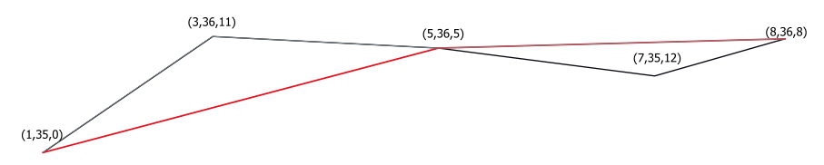

   The red line represents the black line with only vertices whose M
   value is <=10.
   
|checkbox| Allows
:ref:`features in-place modification <processing_inplace_edit>`
of point, line and polygon features with M enabled

.. note:: Depending on the input geometry attributes and the filters
   used, the resultant geometries created by this algorithm may no
   longer be valid.

.. seealso:: :ref:`qgisfilterverticesbyz`, :ref:`qgisextractvertices`,
 :ref:`qgisextractspecificvertices`

Parameters
..........

.. list-table::
   :header-rows: 1
   :widths: 20 20 20 40

   * - Label
     - Name
     - Type
     - Description
   * - **Input layer**
     - ``INPUT``
     - [vector: any]
     - Input vector layer
       to remove vertices from
   * - **Minimum**

       Optional
     - ``MIN``
     - [number |dataDefine|]

       Default: *Not set*
     - Minimum of M values allowed
   * - **Maximum**

       Optional
     - ``MAX``
     - [number |dataDefine|]

       Default: *Not set*
     - Maximum of M values allowed
   * - **Filtered**
     - ``OUTPUT``
     - [same as input]

       Default: ``[Create temporary layer]``
     - Specify the output vector layer. One of:

       .. include:: ../algs_include.rst
          :start-after: **layer_output_types_append**
          :end-before: **end_layer_output_types_append**

Outputs
.......

.. list-table::
   :header-rows: 1
   :widths: 20 20 20 40

   * - Label
     - Name
     - Type
     - Description
   * - **Filtered**
     - ``OUTPUT``
     - [same as input]
     - The output vector layer of features
       with only the filtered vertices.

Python code
...........

**Algorithm ID**: ``native:filterverticesbym``

.. include:: ../algs_include.rst
  :start-after: **algorithm_code_section**
  :end-before: **end_algorithm_code_section**

.. _qgisfilterverticesbyz:

Filter vertices by Z value
--------------------------
Filters away vertices based on their Z value, returning geometries
with only vertex points that have a Z value greater than or equal to
the specified minimum value and/or less than or equal to the maximum
value.

If the minimum value is not specified then only the maximum value is
tested, and similarly if the maximum value is not specified then only
the minimum value is tested.

   The red line represents the black line with only vertices whose Z
   value is <=10.
   
|checkbox| Allows
:ref:`features in-place modification <processing_inplace_edit>`
of point, line and polygon features with Z enabled

.. note:: Depending on the input geometry attributes and the filters
   used, the resultant geometries created by this algorithm may no
   longer be valid.
   You may need to run the :ref:`qgisfixgeometries` algorithm to
   ensure their validity.

.. seealso:: :ref:`qgisfilterverticesbym`, :ref:`qgisextractvertices`,
 :ref:`qgisextractspecificvertices`

Parameters
..........

.. list-table::
   :header-rows: 1
   :widths: 20 20 20 40

   * - Label
     - Name
     - Type
     - Description
   * - **Input layer**
     - ``INPUT``
     - [vector: any]
     - Input vector layer
       to remove vertices from
   * - **Minimum**

       Optional
     - ``MIN``
     - [number |dataDefine|]

       Default: *Not set*
     - Minimum of Z values allowed
   * - **Maximum**

       Optional
     - ``MAX``
     - [number |dataDefine|]

       Default: *Not set*
     - Maximum of Z values allowed
   * - **Filtered**
     - ``OUTPUT``
     - [same as input]

       Default: ``[Create temporary layer]``
     - Specify the output vector layer. One of:

       .. include:: ../algs_include.rst
          :start-after: **layer_output_types_append**
          :end-before: **end_layer_output_types_append**

Outputs
.......

.. list-table::
   :header-rows: 1
   :widths: 20 20 20 40

   * - Label
     - Name
     - Type
     - Description
   * - **Filtered**
     - ``OUTPUT``
     - [same as input]
     - The output vector layer of features
       with only the filtered vertices.

Python code
...........

**Algorithm ID**: ``native:filterverticesbyz``

.. include:: ../algs_include.rst
  :start-after: **algorithm_code_section**
  :end-before: **end_algorithm_code_section**

.. _qgisfixgeometries:

Fix geometries
--------------
Attempts to create a valid representation of a given invalid geometry
without losing any of the input vertices.
Already valid geometries are returned without further intervention.
Always outputs multi-geometry layer.

|checkbox| Allows
:ref:`features in-place modification <processing_inplace_edit>`
of point, line, and polygon features without M enabled

.. note:: M values will be dropped from the output.

.. seealso:: :ref:`qgischeckvalidity`

Parameters
..........

.. list-table::
   :header-rows: 1
   :widths: 20 20 20 40

   * - Label
     - Name
     - Type
     - Description
   * - **Input layer**
     - ``INPUT``
     - [vector: any]
     - Input vector layer
   * - **Repair method**
     - ``METHOD``
     - [enumeration]

       Default: 1
     - Method used to repair the geometries. One of:

       * 0 --- ``Linework``: combines all rings into a set of noded lines and
         then extracts valid polygons from that linework
       * 1 --- ``Structure``: first makes all rings valid and then merges shells
         and subtracts holes from shells to generate valid result.
         Assumes that holes and shells are correctly categorized.
         Requires QGIS version built with GEOS 3.10 or later
         (check :menuselection:`Help --> About` menu).
   * - **Fixed geometries**
     - ``OUTPUT``
     - [same as input]

       Default: ``[Create temporary layer]``
     - Specify the output vector layer. One of:

       .. include:: ../algs_include.rst
          :start-after: **layer_output_types_append**
          :end-before: **end_layer_output_types_append**

Outputs
.......

.. list-table::
   :header-rows: 1
   :widths: 20 20 20 40

   * - Label
     - Name
     - Type
     - Description
   * - **Fixed geometries**
     - ``OUTPUT``
     - [same as input]
     - The output vector layer with fixed geometries.

Python code
...........

**Algorithm ID**: ``native:fixgeometries``

.. include:: ../algs_include.rst
  :start-after: **algorithm_code_section**
  :end-before: **end_algorithm_code_section**

.. _qgisforcerhr:

Force right-hand-rule
--------------------------

Forces polygon geometries to respect the Right-Hand-Rule, in which
the area that is bounded by a polygon is to the right of the boundary.
In particular, the exterior ring is oriented in a clockwise
direction and any interior rings in a counter-clockwise direction.

|checkbox| Allows
:ref:`features in-place modification <processing_inplace_edit>`
of polygon features

Parameters
..........

.. list-table::
   :header-rows: 1
   :widths: 20 20 20 40

   * - Label
     - Name
     - Type
     - Description
   * - **Input layer**
     - ``INPUT``
     - [vector: polygon]
     - Input vector layer
   * - **Reoriented**
     - ``OUTPUT``
     - [vector: polygon]

       Default: ``[Create temporary layer]``
     - Specify the output vector layer. One of:

       .. include:: ../algs_include.rst
          :start-after: **layer_output_types_append**
          :end-before: **end_layer_output_types_append**

Outputs
.......

.. list-table::
   :header-rows: 1
   :widths: 20 20 20 40

   * - Label
     - Name
     - Type
     - Description
   * - **Reoriented**
     - ``OUTPUT``
     - [vector: polygon]
     - The output vector layer with reoriented geometries.

Python code
...........

**Algorithm ID**: ``native:forcerhr``

.. include:: ../algs_include.rst
  :start-after: **algorithm_code_section**
  :end-before: **end_algorithm_code_section**

.. _qgisantimeridiansplit:

Geodesic line split at antimeridian
----------------------------------------

Splits a line into multiple geodesic segments, whenever
the line crosses the antimeridian (±180 degrees longitude).

Splitting at the antimeridian helps the visual display of the lines in
some projections.
The returned geometry will always be a multi-part geometry.

Whenever line segments in the input geometry cross the antimeridian,
they will be split into two segments, with the latitude of the
breakpoint being determined using a geodesic line connecting the
points either side of this segment.
The current project ellipsoid setting will be used when calculating
this breakpoint.

If the input geometry contains M or Z values, these will be linearly
interpolated for the new vertices created at the antimeridian.

|checkbox| Allows
:ref:`features in-place modification <processing_inplace_edit>`
of line features

Parameters
..........

.. list-table::
   :header-rows: 1
   :widths: 20 20 20 40

   * - Label
     - Name
     - Type
     - Description
   * - **Input layer**
     - ``INPUT``
     - [vector: line]
     - Input line vector layer
   * - **Split**
     - ``OUTPUT``
     - [vector: line]

       Default: ``[Create temporary layer]``
     - Specify the output line vector layer. One of:

       .. include:: ../algs_include.rst
          :start-after: **layer_output_types_append**
          :end-before: **end_layer_output_types_append**

Outputs
.......

.. list-table::
   :header-rows: 1
   :widths: 20 20 20 40

   * - Label
     - Name
     - Type
     - Description
   * - **Split**
     - ``OUTPUT``
     - [vector: line]
     - The output line vector layer split at the antimeridian.

Python code
...........

**Algorithm ID**: ``native:antimeridiansplit``

.. include:: ../algs_include.rst
  :start-after: **algorithm_code_section**
  :end-before: **end_algorithm_code_section**

.. _qgisgeometrybyexpression:

Geometry by expression
----------------------
Updates existing geometries (or creates new geometries) for input
features by use of a QGIS expression.

This allows complex geometry modifications which can utilize all the
flexibility of the QGIS expression engine to manipulate and create
geometries for output features.

For help with QGIS expression functions, see the inbuilt help available
in the :ref:`expression builder <vector_expressions>`.

Parameters
..........

.. list-table::
   :header-rows: 1
   :widths: 20 20 20 40
   :class: longtable

   * - Label
     - Name
     - Type
     - Description
   * - **Input layer**
     - ``INPUT``
     - [vector: any]
     - Input vector layer
   * - **Output geometry type**
     - ``OUTPUT_GEOMETRY``
     - [enumeration]

       Default: 0
     - The output geometry strongly depends on the expression: for
       instance, if you create a buffer the geometry type has to be
       polygon.
       One of:

       * 0 --- Polygon
       * 1 --- Line
       * 2 --- Point

   * - **Output geometry has z values**
     - ``WITH_Z``
     - [boolean]

       Default: False
     - Choose if the output geometry should include the Z dimension
   * - **Output geometry has m values**
     - ``WITH_M``
     - [boolean]

       Default: False
     - Choose if the output geometry should include the M dimension
   * - **Geometry expression**
     - ``EXPRESSION``
     - [expression]

       Default: '$geometry'
     - Add the geometry expression you want to use.
       You can use the button to open the Expression Dialog.
       The dialog lists all the relevant expressions, together
       with their help and guide.
   * - **Modified geometry**
     - ``OUTPUT``
     - [vector: any]

       Default: ``[Create temporary layer]``
     - Specify the output vector layer. One of:

       .. include:: ../algs_include.rst
          :start-after: **layer_output_types_append**
          :end-before: **end_layer_output_types_append**

Outputs
.......

.. list-table::
   :header-rows: 1
   :widths: 20 20 20 40

   * - Label
     - Name
     - Type
     - Description
   * - **Modified geometry**
     - ``OUTPUT``
     - [vector: any]
     - The output vector layer

Python code
...........

**Algorithm ID**: ``native:geometrybyexpression``

.. include:: ../algs_include.rst
  :start-after: **algorithm_code_section**
  :end-before: **end_algorithm_code_section**

.. _qgisinterpolatepoint:

Interpolate point on line
-------------------------
Creates a point geometry interpolated at a set distance along line or
curve geometries.

Z and M values are linearly interpolated from existing values.

If a multipart geometry is encountered, only the first part is
considered when calculating the substring.

If the specified distance is greater than the input feature's length,
the resultant feature will have a null geometry.

.. figure:: img/interpolated_point.png
   :align: center

   Interpolated point at 500m of the beginning of the line

.. seealso:: :ref:`qgispointsalonglines`

Parameters
..........

.. list-table::
   :header-rows: 1
   :widths: 20 20 20 40
   :class: longtable

   * - Label
     - Name
     - Type
     - Description
   * - **Input layer**
     - ``INPUT``
     - [vector: line, polygon]
     - Input line or polygon vector layer
   * - **Distance**
     - ``DISTANCE``
     - [number |dataDefine|]

       Default: 0.0
     - Distance from the beginning of the line
   * - **Interpolated points**
     - ``OUTPUT``
     - [vector: point]

       Default: ``[Create temporary layer]``
     - Specify the output vector layer. One of:

       .. include:: ../algs_include.rst
          :start-after: **layer_output_types_append**
          :end-before: **end_layer_output_types_append**

Outputs
.......

.. list-table::
   :header-rows: 1
   :widths: 20 20 20 40

   * - Label
     - Name
     - Type
     - Description
   * - **Interpolated points**
     - ``OUTPUT``
     - [vector: point]
     - The output point vector layer with features
       at a set distance along the line or polygon boundary

Python code
...........

**Algorithm ID**: ``native:interpolatepoint``

.. include:: ../algs_include.rst
  :start-after: **algorithm_code_section**
  :end-before: **end_algorithm_code_section**

.. _qgiskeepnbiggestparts:

Keep N biggest parts
--------------------
Takes a layer with polygons or multipolygons and returns a new layer
in which only the *n* largest polygons of each multipolygon feature
are kept.
If a feature has *n* or fewer parts, the feature will just be copied.

.. figure:: img/n_biggest.png
   :align: center

   Clockwise from top left: original multipart feature, one, two and
   three biggest parts kept

Parameters
..........

.. list-table::
   :header-rows: 1
   :widths: 20 20 20 40

   * - Label
     - Name
     - Type
     - Description
   * - **Polygons**
     - ``INPUT``
     - [vector: polygon]
     - Input polygon vector layer
   * - **Parts to keep**
     - ``PARTS``
     - [number]

       Default: 1
     - Number of parts to keep. If 1, only the biggest part of the
       feature will be kept.
   * - **Parts**
     - ``OUTPUT``
     - [vector: polygon]

       Default: ``[Create temporary layer]``
     - Specify the output polygon vector layer. One of:

       .. include:: ../algs_include.rst
          :start-after: **layer_output_types**
          :end-before: **end_layer_output_types**

Outputs
.......

.. list-table::
   :header-rows: 1
   :widths: 20 20 20 40

   * - Label
     - Name
     - Type
     - Description
   * - **Parts**
     - ``OUTPUT``
     - [vector: polygon]
     - The output polygon vector layer with the N biggest parts of
       each feature

Python code
...........

**Algorithm ID**: ``qgis:keepnbiggestparts``

.. include:: ../algs_include.rst
  :start-after: **algorithm_code_section**
  :end-before: **end_algorithm_code_section**

.. _qgislinesubstring:

Line substring
--------------
Returns the portion of a line (or curve) which falls between the
specified start and end distances (measured from the beginning of the
line).

Z and M values are linearly interpolated from existing values.

If a multipart geometry is encountered, only the first part is
considered when calculating the substring.

.. figure:: img/substring.png
   :align: center

   Substring line with starting distance set at 0 meters and the
   ending distance at 250 meters.

|checkbox| Allows :ref:`features in-place modification <processing_inplace_edit>`
of line features

.. seealso:: :ref:`qgisextendlines`

Parameters
..........

.. list-table::
   :header-rows: 1
   :widths: 20 20 20 40

   * - Label
     - Name
     - Type
     - Description
   * - **Input layer**
     - ``INPUT``
     - [vector: line]
     - Input line vector layer
   * - **Start distance**
     - ``START_DISTANCE``
     - [number |dataDefine|]
     - Distance along the input line to the start point of
       the output feature
   * - **End distance**
     - ``END_DISTANCE``
     - [number |dataDefine|]
     - Distance along the input line to the end point of
       the output feature
   * - **Substring**
     - ``OUTPUT``
     - [vector: line]

       Default: ``[Create temporary layer]``
     - Specify the output line vector layer. One of:

       .. include:: ../algs_include.rst
          :start-after: **layer_output_types_append**
          :end-before: **end_layer_output_types_append**

Outputs
.......

.. list-table::
   :header-rows: 1
   :widths: 20 20 20 40

   * - Label
     - Name
     - Type
     - Description
   * - **Substring**
     - ``OUTPUT``
     - [vector: line]
     - The output line vector layer.

Python code
...........

**Algorithm ID**: ``native:linesubstring``

.. include:: ../algs_include.rst
  :start-after: **algorithm_code_section**
  :end-before: **end_algorithm_code_section**

.. _qgislinestopolygons:

Lines to polygons
-----------------
Generates a polygon layer using as polygon rings the lines from an
input line layer.

The attribute table of the output layer is the same as the one of
the input layer.

**Default menu**: :menuselection:`Vector --> Geometry Tools`

.. seealso:: :ref:`qgispolygonstolines`, :ref:`qgispolygonize`, :ref:`qgisconvertgeometrytype`

Parameters
..........

.. list-table::
   :header-rows: 1
   :widths: 20 20 20 40

   * - Label
     - Name
     - Type
     - Description
   * - **Input layer**
     - ``INPUT``
     - [vector: line]
     - Input line vector layer
   * - **Polygons**
     - ``OUTPUT``
     - [vector: polygon]

       Default: ``[Create temporary layer]``
     - Specify the output polygon vector layer. One of:

       .. include:: ../algs_include.rst
          :start-after: **layer_output_types_append**
          :end-before: **end_layer_output_types_append**

Outputs
.......

.. list-table::
   :header-rows: 1
   :widths: 20 20 20 40

   * - Label
     - Name
     - Type
     - Description
   * - **Polygons**
     - ``OUTPUT``
     - [vector: polygon]
     - The output polygon vector layer.

Python code
...........

**Algorithm ID**: ``qgis:linestopolygons``

.. include:: ../algs_include.rst
  :start-after: **algorithm_code_section**
  :end-before: **end_algorithm_code_section**

.. _qgismergelines:

Merge lines
-----------
Joins all connected parts of MultiLineString geometries into single
LineString geometries.

If any parts of the input MultiLineString geometries are not
connected, the resultant geometry will be a MultiLineString containing
any lines which could be merged and any non-connected line parts.

|checkbox| Allows
:ref:`features in-place modification <processing_inplace_edit>`
of line features

Parameters
..........

.. list-table::
   :header-rows: 1
   :widths: 20 20 20 40

   * - Label
     - Name
     - Type
     - Description
   * - **Input layer**
     - ``INPUT``
     - [vector: line]
     - Input line vector layer
   * - **Merged**
     - ``OUTPUT``
     - [vector: line]

       Default: ``[Create temporary layer]``
     - Specify the output line vector layer. One of:

       .. include:: ../algs_include.rst
          :start-after: **layer_output_types_append**
          :end-before: **end_layer_output_types_append**

Outputs
.......

.. list-table::
   :header-rows: 1
   :widths: 20 20 20 40

   * - Label
     - Name
     - Type
     - Description
   * - **Merged**
     - ``OUTPUT``
     - [vector: line]
     - The output (merged) line vector layer.

Python code
...........

**Algorithm ID**: ``native:mergelines``

.. include:: ../algs_include.rst
  :start-after: **algorithm_code_section**
  :end-before: **end_algorithm_code_section**

.. _qgisminimumboundinggeometry:

Minimum bounding geometry
-------------------------
Creates geometries which enclose the features from an input layer.
The features can be grouped by a field.
The output layer will then contain one feature per group value with
a geometry (MBB) that covers the geometries of the features with
matching value.

The following enclosing geometry types are supported:

* bounding box (envelope)
* oriented rectangle
* circle
* convex hull

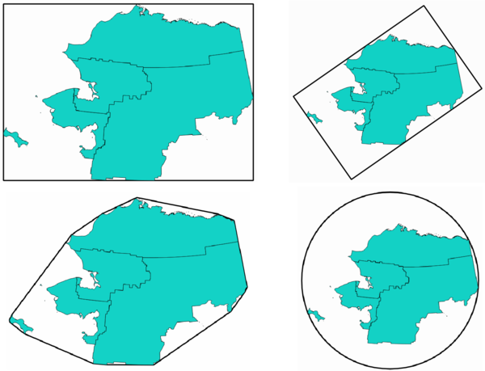

    Clockwise from top left: envelope, oriented rectangle,
    circle, convex hull

.. seealso:: :ref:`qgisminimumenclosingcircle`

Parameters
..........

.. list-table::
   :header-rows: 1
   :widths: 20 20 20 40
   :class: longtable

   * - Label
     - Name
     - Type
     - Description
   * - **Input layer**
     - ``INPUT``
     - [vector: any]
     - Input vector layer
   * - **Field**

       Optional
     - ``FIELD``
     - [tablefield: any]
     - Features can be grouped by a field.
       If set, this causes the output layer to contain one feature per
       grouped value with a minimal geometry covering only the
       features with matching values.
   * - **Geometry type**
     - ``TYPE``
     - [enumeration]

       Default: 0
     - Enclosing geometry types. One of:

       * 0 --- Envelope (Bounding Box)
       * 1 --- Minimum Oriented Rectangle
       * 2 --- Minimum Enclosing Circle
       * 3 --- Convex Hull

   * - **Bounding geometry**
     - ``OUTPUT``
     - [vector: polygon]

       Default: ``[Create temporary layer]``
     - Specify the output polygon vector layer. One of:

       .. include:: ../algs_include.rst
          :start-after: **layer_output_types**
          :end-before: **end_layer_output_types**

Outputs
.......

.. list-table::
   :header-rows: 1
   :widths: 20 20 20 40

   * - Label
     - Name
     - Type
     - Description
   * - **Bounding geometry**
     - ``OUTPUT``
     - [vector: polygon]
     - The output (bounding) polygon vector layer.

Python code
...........

**Algorithm ID**: ``qgis:minimumboundinggeometry``

.. include:: ../algs_include.rst
  :start-after: **algorithm_code_section**
  :end-before: **end_algorithm_code_section**

.. _qgisminimumenclosingcircle:

Minimum enclosing circles
-------------------------
Calculates the minimum enclosing circles of the features in the input
layer.

.. figure:: img/minimum_enclosing_circles.png
   :align: center

   Enclosing circles for each feature

|checkbox| Allows
:ref:`features in-place modification <processing_inplace_edit>`
of polygon features

.. seealso:: :ref:`qgisminimumboundinggeometry`

Parameters
..........

.. list-table::
   :header-rows: 1
   :widths: 20 20 20 40

   * - Label
     - Name
     - Type
     - Description
   * - **Input layer**
     - ``INPUT``
     - [vector: any]
     - Input vector layer
   * - **Number of segments in circles**
     - ``SEGMENTS``
     - [number]

       Default: 72
     - The number of segments used to approximate a circle.
       Minimum 8, maximum 100000.
   * - **Minimum enclosing circles**
     - ``OUTPUT``
     - [vector: polygon]

       Default: ``[Create temporary layer]``
     - Specify the output polygon vector layer. One of:

       .. include:: ../algs_include.rst
          :start-after: **layer_output_types_append**
          :end-before: **end_layer_output_types_append**

Outputs
.......

.. list-table::
   :header-rows: 1
   :widths: 20 20 20 40

   * - Label
     - Name
     - Type
     - Description
   * - **Minimum enclosing circles**
     - ``OUTPUT``
     - [vector: polygon]
     - The output polygon vector layer.

Python code
...........

**Algorithm ID**: ``native:minimumenclosingcircle``

.. include:: ../algs_include.rst
  :start-after: **algorithm_code_section**
  :end-before: **end_algorithm_code_section**

.. _qgismultiringconstantbuffer:

Multi-ring buffer (constant distance)
-------------------------------------
Computes multi-ring (*donut*) buffer for the features of the
input layer, using a fixed or dynamic distance and number of rings.

.. figure:: img/multiringbuffer.png
   :align: center

   Multi-ring buffer for a line, point and polygon layer

|checkbox| Allows
:ref:`features in-place modification <processing_inplace_edit>`
of polygon features

.. seealso:: :ref:`qgisbuffer`,
   :ref:`qgisvariabledistancebuffer`,
   :ref:`qgisrectanglesovalsdiamonds`,
   :ref:`qgissinglesidedbuffer`

Parameters
..........

.. list-table::
   :header-rows: 1
   :widths: 20 20 20 40
   :class: longtable

   * - Label
     - Name
     - Type
     - Description
   * - **Input layer**
     - ``INPUT``
     - [vector: any]
     - Input vector layer
   * - **Number of rings**
     - ``RINGS``
     - [number |dataDefine|]

       Default: 1
     - The number of rings.
       It can be a unique value (same number of rings for all the
       features) or it can be taken from features data (the number of
       rings depends on feature values).
   * - **Distance between rings**
     - ``DISTANCE``
     - [number |dataDefine|]

       Default: 1.0
     - Distance between the rings.
       It can be a unique value (same distance for all the features)
       or it can be taken from features data (the distance depends on
       feature values).
   * - **Multi-ring buffer (constant distance)**
     - ``OUTPUT``
     - [vector: polygon]

       Default: ``[Create temporary layer]``
     - Specify the output polygon vector layer. One of:

       .. include:: ../algs_include.rst
          :start-after: **layer_output_types_append**
          :end-before: **end_layer_output_types_append**

Outputs
.......

.. list-table::
   :header-rows: 1
   :widths: 20 20 20 40

   * - Label
     - Name
     - Type
     - Description
   * - **Multi-ring buffer (constant distance)**
     - ``OUTPUT``
     - [vector: polygon]
     - The output polygon vector layer.

Python code
...........

**Algorithm ID**: ``native:multiringconstantbuffer``

.. include:: ../algs_include.rst
  :start-after: **algorithm_code_section**
  :end-before: **end_algorithm_code_section**

.. _qgismultiparttosingleparts:

Multipart to singleparts
------------------------
Splits multipart features in the input layer into singlepart
features.

The attributes of the output layer are the same as the original ones
but divided into single features.

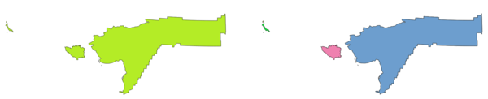

   Left the multipart source layer and right the single part output
   result

|checkbox| Allows
:ref:`features in-place modification <processing_inplace_edit>`
of point, line, and polygon features

**Default menu**: :menuselection:`Vector --> Geometry Tools`

.. seealso:: :ref:`qgiscollect`, :ref:`qgispromotetomulti`

Parameters
..........

.. list-table::
   :header-rows: 1
   :widths: 20 20 20 40

   * - Label
     - Name
     - Type
     - Description
   * - **Input layer**
     - ``INPUT``
     - [vector: any]
     - Input vector layer
   * - **Single parts**
     - ``OUTPUT``
     - [same as input]

       Default: ``[Create temporary layer]``
     - Specify the output polygon vector layer. One of:

       .. include:: ../algs_include.rst
          :start-after: **layer_output_types_append**
          :end-before: **end_layer_output_types_append**

Outputs
.......

.. list-table::
   :header-rows: 1
   :widths: 20 20 20 40

   * - Label
     - Name
     - Type
     - Description
   * - **Single parts**
     - ``OUTPUT``
     - [same as input]
     - The output vector layer.

Python code
...........

**Algorithm ID**: ``native:multiparttosingleparts``

.. include:: ../algs_include.rst
  :start-after: **algorithm_code_section**
  :end-before: **end_algorithm_code_section**

.. _qgisoffsetline:

Offset lines
------------
Offsets lines by a specified distance.
Positive distances will offset lines to the left, and negative
distances will offset them to the right.

.. figure:: img/offset_lines.png
   :align: center

   In blue the source layer, in red the offset one

|checkbox| Allows
:ref:`features in-place modification <processing_inplace_edit>`
of line features

.. seealso:: :ref:`qgisarrayoffsetlines`, :ref:`qgistranslategeometry`

Parameters
..........

.. list-table::
   :header-rows: 1
   :widths: 20 20 20 40
   :class: longtable

   * - Label
     - Name
     - Type
     - Description
   * - **Input layer**
     - ``INPUT``
     - [vector: line]
     - Input line vector layer
   * - **Distance**
     - ``DISTANCE``
     - [number |dataDefine|]

       Default: 10.0
     - Offset distance.
       You can use the Data Defined button on the right to choose
       a field from which the radius will be calculated.
       This way you can have different radius for each feature
       (see :ref:`qgisvariabledistancebuffer`).
   * - **Segments**
     - ``SEGMENTS``
     - [number]

       Default: 8
     - Controls the number of line segments to use to approximate
       a quarter circle when creating rounded offsets.
   * - **Join style**
     - ``JOIN_STYLE``
     - [enumeration]

       Default: 0
     - Specifies whether round, miter or beveled joins should be
       used when offsetting corners in a line.
       Options are:

       * 0 --- Round
       * 1 --- Miter
       * 2 --- Bevel

       .. figure:: img/buffer_join_style.png
          :align: center
          :width: 100%

          Round, miter, and bevel join styles
   * - **Miter limit**
     - ``MITER_LIMIT``
     - [number]

       Default: 2.0
     - Sets the maximum distance from the offset geometry to use
       when creating a mitered join as a factor of the offset distance (only applicable for miter
       join styles).
       Minimum: 1.0              

       .. figure:: img/buffer_miter_limit.png
          :align: center
          :width: 100%
         
          A 10m buffer with a limit of 2 and a 10m buffer with a limit of 1
   * - **Offset**
     - ``OUTPUT``
     - [vector: line]

       Default: ``[Create temporary layer]``
     - Specify the output (offset) layer.
       One of:

       .. include:: ../algs_include.rst
          :start-after: **layer_output_types_append**
          :end-before: **end_layer_output_types_append**

Outputs
.......

.. list-table::
   :header-rows: 1
   :widths: 20 20 20 40

   * - Label
     - Name
     - Type
     - Description
   * - **Offset**
     - ``OUTPUT``
     - [vector: line]
     - Output (offset) line layer

Python code
...........

**Algorithm ID**: ``native:offsetline``

.. include:: ../algs_include.rst
  :start-after: **algorithm_code_section**
  :end-before: **end_algorithm_code_section**

.. _qgisorientedminimumboundingbox:

Oriented minimum bounding box
-----------------------------
Calculates the minimum area rotated rectangle for each feature in the
input layer.

.. figure:: img/oriented_minimum_bounding_box.png
   :align: center

   Oriented minimum bounding box

|checkbox| Allows
:ref:`features in-place modification <processing_inplace_edit>`
of polygon features

.. seealso:: :ref:`qgisminimumboundinggeometry`

Parameters
..........

.. list-table::
   :header-rows: 1
   :widths: 20 20 20 40

   * - Label
     - Name
     - Type
     - Description
   * - **Input layer**
     - ``INPUT``
     - [vector: any]
     - Input vector layer
   * - **Bounding boxes**
     - ``OUTPUT``
     - [vector: polygon]

       Default: ``[Create temporary layer]``
     - Specify the output polygon vector layer. One of:

       .. include:: ../algs_include.rst
          :start-after: **layer_output_types_append**
          :end-before: **end_layer_output_types_append**

Outputs
.......

.. list-table::
   :header-rows: 1
   :widths: 20 20 20 40

   * - Label
     - Name
     - Type
     - Description
   * - **Bounding boxes**
     - ``OUTPUT``
     - [vector: polygon]
     - The output polygon vector layer.

Python code
...........

**Algorithm ID**: ``native:orientedminimumboundingbox``

.. include:: ../algs_include.rst
  :start-after: **algorithm_code_section**
  :end-before: **end_algorithm_code_section**

.. _qgisorthogonalize:

Orthogonalize
-------------
Attempts to orthogonalize the geometries of the input line or polygon
layer.
This process shifts the vertices in the geometries to try to make
every angle in the geometry either a right angle or a straight line.

.. figure:: img/orthogonize.png
   :align: center

   In blue the source layer and in the red orthogonalized
   result

|checkbox| Allows
:ref:`features in-place modification <processing_inplace_edit>`
of line and polygon features

Parameters
..........

.. list-table::
   :header-rows: 1
   :widths: 20 20 20 40
   :class: longtable

   * - Label
     - Name
     - Type
     - Description
   * - **Input layer**
     - ``INPUT``
     - [vector: line, polygon]
     - Input line or polygon vector layer
   * - **Maximum angle tolerance (degrees)**
     - ``ANGLE_TOLERANCE``
     - [number]

       Default: 15
     - Specify the maximum deviation from a right angle or straight
       line a vertex can have for it to be adjusted.
       Smaller tolerances mean that only vertices which are already
       closer to right angles will be adjusted, and larger tolerances
       mean that vertices which deviate further from right angles will
       also be adjusted.
   * - **Maximum algorithm iterations**
     - ``MAX_ITERATIONS``
     - [number]

       Default: 1000
     - Setting a larger number for the maximum number of iterations
       will result in a more orthogonal geometry at the cost of extra
       processing time.
   * - **Orthogonalized**
     - ``OUTPUT``
     - [same as input]

       Default: ``[Create temporary layer]``
     - Specify the output polygon vector layer. One of:

       .. include:: ../algs_include.rst
          :start-after: **layer_output_types_append**
          :end-before: **end_layer_output_types_append**

Outputs
.......

.. list-table::
   :header-rows: 1
   :widths: 20 20 20 40

   * - Label
     - Name
     - Type
     - Description
   * - **Orthogonalized**
     - ``OUTPUT``
     - [same as input]
     - The output polygon vector layer with adjusted angles.

Python code
...........

**Algorithm ID**: ``native:orthogonalize``

.. include:: ../algs_include.rst
  :start-after: **algorithm_code_section**
  :end-before: **end_algorithm_code_section**

.. _qgispointonsurface:

Point on Surface
----------------
For each feature of the input layer, returns a point that is
guaranteed to lie on the surface of the feature geometry.

|checkbox| Allows
:ref:`features in-place modification <processing_inplace_edit>`
of point features

.. seealso:: :ref:`qgiscentroids`

Parameters
..........

.. list-table::
   :header-rows: 1
   :widths: 20 20 20 40

   * - Label
     - Name
     - Type
     - Description
   * - **Input layer**
     - ``INPUT``
     - [vector: any]
     - Input vector layer
   * - **Create point on surface for each part**
     - ``ANGLE_TOLERANCE``
     - [boolean |dataDefine|]
     - If checked, a point will be created for each part of the
       geometry.
   * - **Point**
     - ``OUTPUT``
     - [vector: point]

       Default: ``[Create temporary layer]``
     - Specify the output point vector layer. One of:

       .. include:: ../algs_include.rst
          :start-after: **layer_output_types_append**
          :end-before: **end_layer_output_types_append**

Outputs
.......

.. list-table::
   :header-rows: 1
   :widths: 20 20 20 40

   * - Label
     - Name
     - Type
     - Description
   * - **Point**
     - ``OUTPUT``
     - [vector: point]
     - The output point vector layer.

Python code
...........

**Algorithm ID**: ``native:pointonsurface``

.. include:: ../algs_include.rst
  :start-after: **algorithm_code_section**
  :end-before: **end_algorithm_code_section**

.. _qgispointsalonglines:

Points along geometry
---------------------
Creates points at regular intervals along line or polygon geometries.
Created points will have new attributes added for the distance along
the geometry and the angle of the line at the point.

An optional start and end offset can be specified, which controls how
far from the start and end of the geometry the points should be
created.

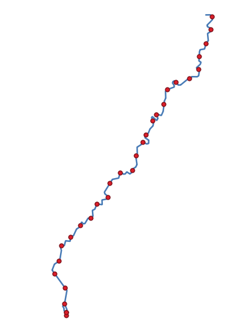

   Points created along the source line layer

.. seealso:: :ref:`qgisinterpolatepoint`

Parameters
..........

.. list-table::
   :header-rows: 1
   :widths: 20 20 20 40
   :class: longtable

   * - Label
     - Name
     - Type
     - Description
   * - **Input layer**
     - ``INPUT``
     - [vector: line, polygon]
     - Input line or polygon vector layer
   * - **Distance**
     - ``DISTANCE``
     - [number |dataDefine|]

       Default: 1.0
     - Distance between two consecutive points along the line
   * - **Start offset**
     - ``START_OFFSET``
     - [number |dataDefine|]

       Default: 0.0
     - Distance from the beginning of the input line, representing the
       position of the first point.
   * - **End offset**
     - ``END_OFFSET``
     - [number |dataDefine|]

       Default: 0.0
     - Distance from the end of the input line, representing the
       position beyond which no point feature shoud be created.
   * - **Interpolated points**
     - ``OUTPUT``
     - [vector: point]

       Default: ``[Create temporary layer]``
     - Specify the output vector layer. One of:

       .. include:: ../algs_include.rst
          :start-after: **layer_output_types_append**
          :end-before: **end_layer_output_types_append**

Outputs
.......

.. list-table::
   :header-rows: 1
   :widths: 20 20 20 40

   * - Label
     - Name
     - Type
     - Description
   * - **Interpolated points**
     - ``OUTPUT``
     - [vector: point]
     - Point vector layer with features placed along lines or polygon
       boundaries of the input layer.

Python code
...........

**Algorithm ID**: ``native:pointsalonglines``

.. include:: ../algs_include.rst
  :start-after: **algorithm_code_section**
  :end-before: **end_algorithm_code_section**

.. _qgispointsdisplacement:

Points displacement
-------------------
Given a distance of proximity, identifies nearby point features and
radially distributes them over a circle whose center represents their
barycenter.
A convenient tool to scatter overlaid features.

Parameters
..........

.. list-table::
   :header-rows: 1
   :widths: 20 20 20 40
   :class: longtable

   * - Label
     - Name
     - Type
     - Description
   * - **Input layer**
     - ``INPUT``
     - [vector: point]
     - Input point vector layer
   * - **Minimum distance to other points**
     - ``PROXIMITY``
     - [number]

       Default: 1.0
     - Distance below which point features are
       considered close.
       Close features are distributed altogether.
   * - **Displacement distance**
     - ``DISTANCE``
     - [number]

       Default: 1.0
     - Radius of the circle on which close features are placed
   * - **Horizontal distribution for two point case**
     - ``HORIZONTAL``
     - [boolean]

       Default: False
     - When only two points are identified as close, aligns them
       horizontally on the circle instead of vertically.

   * - **Displaced**
     - ``OUTPUT``
     - [vector: point]

       Default: ``[Create temporary layer]``
     - Specify the output vector layer. One of:

       .. include:: ../algs_include.rst
          :start-after: **layer_output_types**
          :end-before: **end_layer_output_types**

Outputs
.......

.. list-table::
   :header-rows: 1
   :widths: 20 20 20 40

   * - Label
     - Name
     - Type
     - Description
   * - **Displaced**
     - ``OUTPUT``
     - [vector: point]
     - Output point vector layer

Python code
...........

**Algorithm ID**: ``qgis:pointsdisplacement``

.. include:: ../algs_include.rst
  :start-after: **algorithm_code_section**
  :end-before: **end_algorithm_code_section**

.. _qgispoleofinaccessibility:

Pole of inaccessibility
-----------------------
Calculates the pole of inaccessibility for a polygon layer, which is
the most distant internal point from the boundary of the surface.

This algorithm uses the 'polylabel' algorithm (Vladimir Agafonkin,
2016), which is an iterative approach guaranteed to find the true pole
of inaccessibility within a specified tolerance.
A more precise tolerance (lower value) requires more iterations and
will take longer to calculate.

The distance from the calculated pole to the polygon boundary will be
stored as a new attribute in the output layer.

.. figure:: img/pole_inaccessibility.png
   :align: center

   Pole of inaccessibility

Parameters
..........

.. list-table::
   :header-rows: 1
   :widths: 20 20 20 40

   * - Label
     - Name
     - Type
     - Description
   * - **Input layer**
     - ``INPUT``
     - [vector: polygon]
     - Input vector layer
   * - **Tolerance**
     - ``TOLERANCE``
     - [number]

       Default: 1.0
     - Set the tolerance for the calculation
   * - **Point**
     - ``OUTPUT``
     - [vector: point]

       Default: ``[Create temporary layer]``
     - Specify the output polygon vector layer. One of:

       .. include:: ../algs_include.rst
          :start-after: **layer_output_types_append**
          :end-before: **end_layer_output_types_append**

Outputs
.......

.. list-table::
   :header-rows: 1
   :widths: 20 20 20 40

   * - Label
     - Name
     - Type
     - Description
   * - **Point**
     - ``OUTPUT``
     - [vector: point]
     - The output point vector layer

Python code
...........

**Algorithm ID**: ``native:poleofinaccessibility``

.. include:: ../algs_include.rst
  :start-after: **algorithm_code_section**
  :end-before: **end_algorithm_code_section**

.. _qgispolygonize:

Polygonize
----------
Creates a polygon layer whose features boundaries are generated from a
line layer of **closed** features.

.. figure:: img/polygonize.png
   :align: center

   The yellow polygons generated from the closed lines

.. note:: The line layer must have closed shapes in order to be
   transformed into a polygon.

.. seealso:: :ref:`qgispolygonstolines`, :ref:`qgislinestopolygons`, :ref:`qgisconvertgeometrytype`

Parameters
..........

.. list-table::
   :header-rows: 1
   :widths: 20 20 20 40

   * - Label
     - Name
     - Type
     - Description
   * - **Input layer**
     - ``INPUT``
     - [vector: line]
     - Input line vector layer
   * - **Keep fields from the input layer**

       Optional
     - ``KEEP_FIELDS``
     - [boolean]

       Default: False
     - Check to keep the fields (only the table structure, not the values) of the input layer
   * - **Polygons from lines**
     - ``OUTPUT``
     - [vector: polygon]

       Default: ``[Create temporary layer]``
     - Specify the output polygon vector layer. One of:

       .. include:: ../algs_include.rst
          :start-after: **layer_output_types**
          :end-before: **end_layer_output_types**

Outputs
.......

.. list-table::
   :header-rows: 1
   :widths: 20 20 20 40

   * - Label
     - Name
     - Type
     - Description
   * - **Polygons from lines**
     - ``OUTPUT``
     - [vector: polygon]
     - The output polygon vector layer from lines

Python code
...........

**Algorithm ID**: ``native:polygonize``

.. include:: ../algs_include.rst
  :start-after: **algorithm_code_section**
  :end-before: **end_algorithm_code_section**

.. _qgispolygonstolines:

Polygons to lines
-----------------
Takes a polygon layer and creates a line layer, with lines
representing the boundaries of the polygons in the input layer.

The attribute table of the output layer is the same as the one of
the input layer.

.. figure:: img/polygon_to_lines.png
   :align: center

   Black lines as the result of the algorithm

**Default menu**: :menuselection:`Vector --> Geometry Tools`

.. seealso:: :ref:`qgislinestopolygons`, :ref:`qgispolygonize`, :ref:`qgisconvertgeometrytype`

Parameters
..........

.. list-table::
   :header-rows: 1
   :widths: 20 20 20 40

   * - Label
     - Name
     - Type
     - Description
   * - **Input layer**
     - ``INPUT``
     - [vector: polygon]
     - Input polygon vector layer
   * - **Lines**
     - ``OUTPUT``
     - [vector: line]

       Default: ``[Create temporary layer]``
     - Specify the output line vector layer. One of:

       .. include:: ../algs_include.rst
          :start-after: **layer_output_types_append**
          :end-before: **end_layer_output_types_append**

Outputs
.......

.. list-table::
   :header-rows: 1
   :widths: 20 20 20 40

   * - Label
     - Name
     - Type
     - Description
   * - **Lines**
     - ``OUTPUT``
     - [vector: line]
     - The output line vector layer from polygons

Python code
...........

**Algorithm ID**: ``native:polygonstolines``

.. include:: ../algs_include.rst
  :start-after: **algorithm_code_section**
  :end-before: **end_algorithm_code_section**

.. _qgisprojectpointcartesian:

Project points (Cartesian)
--------------------------
Projects point geometries by a specified distance and bearing (azimuth).

|checkbox| Allows
:ref:`features in-place modification <processing_inplace_edit>`
of point features

Parameters
..........

.. list-table::
   :header-rows: 1
   :widths: 20 20 20 40
   :class: longtable

   * - Label
     - Name
     - Type
     - Description
   * - **Input layer**
     - ``INPUT``
     - [vector: point]
     - Input point vector layer
   * - **Bearing (degrees from North)**
     - ``BEARING``
     - [number |dataDefine|]

       Default: 0.0
     - Clockwise angle starting from North, in degree (°) unit
   * - **Distance**
     - ``DISTANCE``
     - [number |dataDefine|]

       Default: 1.0
     - Distance to offset geometries, in layer units
   * - **Projected**
     - ``OUTPUT``
     - [vector: point]

       Default: ``[Create temporary layer]``
     - Specify the output point vector layer. One of:

       .. include:: ../algs_include.rst
          :start-after: **layer_output_types_append**
          :end-before: **end_layer_output_types_append**

Outputs
.......

.. list-table::
   :header-rows: 1
   :widths: 20 20 20 40

   * - Label
     - Name
     - Type
     - Description
   * - **Projected**
     - ``OUTPUT``
     - [vector: point]
     - The output (projected) point vector layer

Python code
...........

**Algorithm ID**: ``native:projectpointcartesian``

.. include:: ../algs_include.rst
  :start-after: **algorithm_code_section**
  :end-before: **end_algorithm_code_section**

.. _qgispromotetomulti:

Promote to multipart
--------------------
Takes a vector layer with singlepart geometries and generates a new
one in which all geometries are multipart.

Input features which are already multipart features will remain
unchanged.

This algorithm can be used to force geometries to multipart types in
order to be compatible with data providers that require multipart
features.

|checkbox| Allows
:ref:`features in-place modification <processing_inplace_edit>`
of point, line, and polygon features

.. seealso:: :ref:`qgisaggregate`, :ref:`qgiscollect`

Parameters
..........

.. list-table::
   :header-rows: 1
   :widths: 20 20 20 40

   * - Label
     - Name
     - Type
     - Description
   * - **Input layer**
     - ``INPUT``
     - [vector: any]
     - Input vector layer
   * - **Multiparts**
     - ``OUTPUT``
     - [same as input]

       Default: ``[Create temporary layer]``
     - Specify the output multipart vector layer. One of:

       .. include:: ../algs_include.rst
          :start-after: **layer_output_types_append**
          :end-before: **end_layer_output_types_append**

Outputs
.......

.. list-table::
   :header-rows: 1
   :widths: 20 20 20 40

   * - Label
     - Name
     - Type
     - Description
   * - **Multiparts**
     - ``OUTPUT``
     - [same as input]
     - The output multipart vector layer

Python code
...........

**Algorithm ID**: ``native:promotetomulti``

.. include:: ../algs_include.rst
  :start-after: **algorithm_code_section**
  :end-before: **end_algorithm_code_section**

.. _qgisrectanglesovalsdiamonds:

Rectangles, ovals, diamonds
-----------------------------------
Creates a buffer area with a rectangle, oval or diamond shape
for each feature of the input point layer.

The shape parameters can be fixed for all features or dynamic using a field or
an expression.

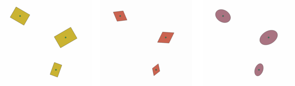

   Different buffer shapes with dynamic parameters

Parameters
..........

.. list-table::
   :header-rows: 1
   :widths: 20 20 20 40
   :class: longtable

   * - Label
     - Name
     - Type
     - Description
   * - **Input layer**
     - ``INPUT``
     - [vector: point]
     - Input point vector layer
   * - **Buffer shape**
     - ``SHAPE``
     - [enumeration]
     - The shape to use. One of:

       * 0 --- Rectangles
       * 1 --- Ovals
       * 2 --- Diamonds

   * - **Width**
     - ``WIDTH``
     - [number |dataDefine|]

       Default: 1.0
     - Width of the buffer shape
   * - **Height**
     - ``HEIGHT``
     - [number |dataDefine|]

       Default: 1.0
     - Height of the buffer shape
   * - **Rotation**

       Optional
     - ``ROTATION``
     - [number |dataDefine|]

       Default: None
     - Rotation of the buffer shape
   * - **Number of segments**
     - ``SEGMENTS``
     - [number]

       Default: 36
     - Number of segments for a full circle (*Ovals* shape)
   * - **Output**
     - ``OUTPUT``
     - [vector: polygon]

       Default: ``[Create temporary layer]``
     - Specify the output vector layer. One of:

       .. include:: ../algs_include.rst
          :start-after: **layer_output_types_append**
          :end-before: **end_layer_output_types_append**

Outputs
.......

.. list-table::
   :header-rows: 1
   :widths: 20 20 20 40

   * - Label
     - Name
     - Type
     - Description
   * - **Output**
     - ``OUTPUT``
     - [vector: polygon]
     - The output vector layer (with the buffer shapes)

Python code
...........

**Algorithm ID**: ``native:rectanglesovalsdiamonds``

.. include:: ../algs_include.rst
  :start-after: **algorithm_code_section**
  :end-before: **end_algorithm_code_section**

.. _qgisremoveduplicatevertices:

Remove duplicate vertices
-------------------------
Removes duplicate vertices from features, wherever removing the
vertices does not result in a degenerate geometry.

The tolerance parameter specifies the tolerance for coordinates when
determining whether vertices are identical.

By default, Z values are not considered when detecting duplicate
vertices.
E.g. two vertices with the same X and Y coordinate but different Z
values will still be considered duplicate and one will be removed.
If the :guilabel:`Use Z Value` parameter is true, then the Z values
are also tested and vertices with the same X and Y but different Z
will be maintained.

|checkbox| Allows :ref:`features in-place modification <processing_inplace_edit>`
of point, line, and polygon features

.. note:: Duplicate vertices are not tested between different parts
   of a multipart geometry, e.g. a multipoint geometry with
   overlapping points will not be changed by this method.

.. seealso:: :ref:`qgisextractvertices`,
   :ref:`qgisextractspecificvertices`,
   :ref:`qgisdeleteduplicategeometries`

Parameters
..........

.. list-table::
   :header-rows: 1
   :widths: 20 20 20 40
   :class: longtable

   * - Label
     - Name
     - Type
     - Description
   * - **Input layer**
     - ``INPUT``
     - [vector: any]
     - Input vector layer
   * - **Tolerance**
     - ``TOLERANCE``
     - [number |dataDefine|]

       Default: 0.000001
     - Vertices closer than the specified distance are considered
       duplicates
   * - **Use Z value**
     - ``USE_Z_VALUE``
     - [boolean |dataDefine|]

       Default: False
     - If the :guilabel:`Use Z Value` parameter is true, then the Z
       values are also tested and vertices with the same X and Y but
       different Z will be maintained.
   * - **Cleaned**
     - ``OUTPUT``
     - [same as input]

       Default: ``[Create temporary layer]``
     - Specify the output vector layer. One of:

       .. include:: ../algs_include.rst
          :start-after: **layer_output_types_append**
          :end-before: **end_layer_output_types_append**

Outputs
.......

.. list-table::
   :header-rows: 1
   :widths: 20 20 20 40

   * - Label
     - Name
     - Type
     - Description
   * - **Cleaned**
     - ``OUTPUT``
     - [same as input]
     - The output vector layer (without duplicate vertices)

Python code
...........

**Algorithm ID**: ``native:removeduplicatevertices``

.. include:: ../algs_include.rst
  :start-after: **algorithm_code_section**
  :end-before: **end_algorithm_code_section**

.. _qgisremovenullgeometries:

Remove null geometries
----------------------

Removes any features which do not have a geometry from a vector layer.
All other features will be copied unchanged.

The features with null geometries can be saved to a separate layer.

If :guilabel:`Also remove empty geometries` is checked, the algorithm
removes features whose geometries have no coordinates, i.e., geometries
that are empty.
In that case, also the null output will reflect this option, containing
both null and empty geometries.

.. seealso:: :ref:`qgisdeleteduplicategeometries`

Parameters
..........

.. list-table::
   :header-rows: 1
   :widths: 20 20 20 40
   :class: longtable

   * - Label
     - Name
     - Type
     - Description
   * - **Input layer**
     - ``INPUT``
     - [vector: any]
     - Input vector layer (with non-NULL geometries)
   * - **Also remove empty geometries**
     - ``REMOVE_EMPTY``
     - [boolean]
     - 
   * - **Non null geometries**
     - ``OUTPUT``

       Optional
     - [same as input]

       Default: ``[Create temporary layer]``
     - Specify the output vector layer for the non-NULL (and
       non-empty) geometries.
       One of:

       .. include:: ../algs_include.rst
          :start-after: **layer_output_types_skip**
          :end-before: **end_layer_output_types_skip**

   * - **Null geometries**

       Optional
     - ``NULL_OUTPUT``
     - [same as input]

       Default: ``[Skip output]``
     - Specify the output vector layer for the NULL (and empty) geometries.
       One of:

       .. include:: ../algs_include.rst
          :start-after: **layer_output_types_skip**
          :end-before: **end_layer_output_types_skip**

Outputs
.......

.. list-table::
   :header-rows: 1
   :widths: 20 20 20 40

   * - Label
     - Name
     - Type
     - Description
   * - **Null geometries**
     - ``NULL_OUTPUT``
     - [same as input]
     - Output vector layer (for NULL and, if chosen, empty geometries)
   * - **Non null geometries**
     - ``OUTPUT``
     - [same as input]
     - The output vector layer (without NULL and, if chosen, empty geometries)

Python code
...........

**Algorithm ID**: ``native:removenullgeometries``

.. include:: ../algs_include.rst
  :start-after: **algorithm_code_section**
  :end-before: **end_algorithm_code_section**

.. _qgisreverselinedirection:

Reverse line direction
----------------------
Inverts the direction of a line layer.

.. figure:: img/reverse_line.png
   :align: center

   Before and after the direction inversion

|checkbox| Allows :ref:`features in-place modification <processing_inplace_edit>`
of line features

Parameters
..........

.. list-table::
   :header-rows: 1
   :widths: 20 20 20 40

   * - Label
     - Name
     - Type
     - Description
   * - **Input layer**
     - ``INPUT``
     - [vector: line]
     - Input line vector layer
   * - **Reversed**
     - ``OUTPUT``
     - [vector: line]

       Default: ``[Create temporary layer]``
     - Specify the output line vector layer.
       One of:

       .. include:: ../algs_include.rst
          :start-after: **layer_output_types_append**
          :end-before: **end_layer_output_types_append**

Outputs
.......

.. list-table::
   :header-rows: 1
   :widths: 20 20 20 40

   * - Label
     - Name
     - Type
     - Description
   * - **Reversed**
     - ``OUTPUT``
     - [vector: line]
     - The output line vector layer (with reversed lines)

Python code
...........

**Algorithm ID**: ``native:reverselinedirection``

.. include:: ../algs_include.rst
  :start-after: **algorithm_code_section**
  :end-before: **end_algorithm_code_section**

.. _qgisrotatefeatures:

Rotate
------
Rotates feature geometries by the specified angle clockwise.
The rotation occurs around each feature's centroid, or optionally
around a unique preset point.

|checkbox| Allows
:ref:`features in-place modification <processing_inplace_edit>`
of point, line, and polygon features

.. seealso:: :ref:`qgistranslategeometry`, :ref:`qgisswapxy`

Parameters
..........

.. list-table::
   :header-rows: 1
   :widths: 20 20 20 40

   * - Label
     - Name
     - Type
     - Description
   * - **Input layer**
     - ``INPUT``
     - [vector: any]
     - Input vector layer
   * - **Rotation (degrees clockwise)**
     - ``ANGLE``
     - [number |dataDefine|]

       Default: 0.0
     - Angle of the rotation in degrees
   * - **Rotation anchor point (x, y)**

       Optional
     - ``ANCHOR``
     - [point]

       Default: None
     - X,Y coordinates of the point to rotate the
       features around.
       If not set the rotation occurs around each
       feature's centroid.
   * - **Rotated**
     - ``OUTPUT``
     - [same as input]

       Default: ``[Create temporary layer]``
     - Specify the output vector layer (with rotated geometries).
       One of:

       .. include:: ../algs_include.rst
          :start-after: **layer_output_types_append**
          :end-before: **end_layer_output_types_append**

Outputs
.......

.. list-table::
   :header-rows: 1
   :widths: 20 20 20 40

   * - Label
     - Name
     - Type
     - Description
   * - **Rotated**
     - ``OUTPUT``
     - [same as input]
     - The output vector layer with rotated geometries

Python code
...........

**Algorithm ID**: ``native:rotatefeatures``

.. include:: ../algs_include.rst
  :start-after: **algorithm_code_section**
  :end-before: **end_algorithm_code_section**

.. _qgisroundness:

Roundness
---------

Calculates the roundness of each feature and stores it as a new field. The input vector layer must contain polygons.

The roundness of a polygon is defined as 4π × polygon area / perimeter².
The roundness value varies between 0 and 1. A perfect circle has a roundness of 1,
while a completely flat polygon has a roundness of 0.

.. note:: The algorithm returns NULL for multipart polygon features.

|checkbox| Allows
:ref:`features in-place modification <processing_inplace_edit>`
of polygon features

Parameters
..........

.. list-table::
   :header-rows: 1
   :widths: 20 20 20 40

   * - Label
     - Name
     - Type
     - Description
   * - **Input layer**
     - ``INPUT``
     - [vector: polygon]
     - Input vector layer
   * - **Roundness**
     - ``OUTPUT``
     - [vector: polygon]

       Default: ``[Create temporary layer]``
     - Specify the output vector layer (with roundness field).
       One of:

       .. include:: ../algs_include.rst
          :start-after: **layer_output_types_append**
          :end-before: **end_layer_output_types_append**

Outputs
.......

.. list-table::
   :header-rows: 1
   :widths: 20 20 20 40

   * - Label
     - Name
     - Type
     - Description
   * - **Rotated**
     - ``OUTPUT``
     - [same as input]
     - The output vector layer with roundness value in a field

Python code
...........

**Algorithm ID**: ``native:roundness``

.. include:: ../algs_include.rst
  :start-after: **algorithm_code_section**
  :end-before: **end_algorithm_code_section**

.. _qgissegmentizebymaxangle:

Segmentize by maximum angle
---------------------------
Segmentizes a geometry by converting curved sections to linear
sections.

The segmentization is performed by specifying the maximum allowed
radius angle between vertices on the straightened geometry (e.g the
angle of the arc created from the original arc center to consecutive
output vertices on the linearized geometry).
Non-curved geometries will be retained without change.

.. seealso:: :ref:`qgissegmentizebymaxdistance`,
   :ref:`qgissimplifygeometries`, :ref:`qgissmoothgeometry`

Parameters
..........

.. list-table::
   :header-rows: 1
   :widths: 20 20 20 40

   * - Label
     - Name
     - Type
     - Description
   * - **Input layer**
     - ``INPUT``
     - [vector: line, polygon]
     - Input line or polygon vector layer
   * - **Maximum angle between vertices (degrees)**
     - ``ANGLE``
     - [number |dataDefine|]

       Default: 5.0
     - Maximum allowed radius angle between vertices
       on the straightened geometry
   * - **Segmentized**
     - ``OUTPUT``
     - [same as input]

       Default: ``[Create temporary layer]``
     - Specify the output vector layer (with segmentized geometries).
       One of:

       .. include:: ../algs_include.rst
          :start-after: **layer_output_types_append**
          :end-before: **end_layer_output_types_append**

Outputs
.......

.. list-table::
   :header-rows: 1
   :widths: 20 20 20 40

   * - Label
     - Name
     - Type
     - Description
   * - **Segmentized**
     - ``OUTPUT``
     - [same as input]
     - The output vector layer with segmentized geometries

Python code
...........

**Algorithm ID**: ``native:segmentizebymaxangle``

.. include:: ../algs_include.rst
  :start-after: **algorithm_code_section**
  :end-before: **end_algorithm_code_section**

.. _qgissegmentizebymaxdistance:

Segmentize by maximum distance
------------------------------
Segmentizes a geometry by converting curved sections to linear
sections.

The segmentization is performed by specifying the maximum allowed
offset distance between the original curve and the segmentized
representation.
Non-curved geometries will be retained without change.

.. seealso:: :ref:`qgissegmentizebymaxangle`,
   :ref:`qgissimplifygeometries`, :ref:`qgissmoothgeometry`

Parameters
..........

.. list-table::
   :header-rows: 1
   :widths: 20 20 20 40

   * - Label
     - Name
     - Type
     - Description
   * - **Input layer**
     - ``INPUT``
     - [vector: line, polygon]
     - Input line or polygon vector layer
   * - **Maximum offset distance**
     - ``DISTANCE``
     - [number |dataDefine|]

       Default: 1.0
     - Maximum allowed offset distance between the
       original curve and the segmentized representation,
       in the layer units.
   * - **Segmentized**
     - ``OUTPUT``
     - [same as input]

       Default: ``[Create temporary layer]``
     - Specify the output vector layer (with segmentized geometries).
       One of:

       .. include:: ../algs_include.rst
          :start-after: **layer_output_types_append**
          :end-before: **end_layer_output_types_append**

Outputs
.......

.. list-table::
   :header-rows: 1
   :widths: 20 20 20 40

   * - Label
     - Name
     - Type
     - Description
   * - **Segmentized**
     - ``OUTPUT``
     - [same as input]
     - The output vector layer with segmentized geometries

Python code
...........

**Algorithm ID**: ``native:segmentizebymaxdistance``

.. include:: ../algs_include.rst
  :start-after: **algorithm_code_section**
  :end-before: **end_algorithm_code_section**

.. _qgissetmvalue:

Set M value
-----------
Sets the M value for geometries in a layer.

If M values already exist in the layer, they will be overwritten
with the new value.
If no M values exist, the geometry will be upgraded to include M
values and the specified value used as the initial M value for all
geometries.
    
|checkbox| Allows
:ref:`features in-place modification <processing_inplace_edit>`
of point, line, and polygon features with M enabled

.. tip:: Use the |identify|:sup:`Identify Features` button to check
   the added M value: the results are available in the
   :guilabel:`Identify Results` dialog.

.. seealso:: :ref:`qgissetmfromraster`, :ref:`qgissetzvalue`,
   :ref:`qgisdropmzvalues`

Parameters
..........

.. list-table::
   :header-rows: 1
   :widths: 20 20 20 40

   * - Label
     - Name
     - Type
     - Description
   * - **Input layer**
     - ``INPUT``
     - [vector: any]
     - Input vector layer
   * - **M Value**
     - ``M_VALUE``
     - [number |dataDefine|]

       Default: 0.0
     - M value to assign to the feature geometries
   * - **M Added**
     - ``OUTPUT``
     - [same as input]

       Default: ``[Create temporary layer]``
     - Specify the output vector layer.
       One of:

       .. include:: ../algs_include.rst
          :start-after: **layer_output_types_append**
          :end-before: **end_layer_output_types_append**

Outputs
.......

.. list-table::
   :header-rows: 1
   :widths: 20 20 20 40

   * - Label
     - Name
     - Type
     - Description
   * - **M Added**
     - ``OUTPUT``
     - [same as input]
     - The output vector layer (with M values assigned to the
       geometries)

Python code
...........

**Algorithm ID**: ``native:setmvalue``

.. include:: ../algs_include.rst
  :start-after: **algorithm_code_section**
  :end-before: **end_algorithm_code_section**

.. _qgissetmfromraster:

Set M value from raster
-----------------------

Uses values sampled from a band within a raster layer to set the M
value for every overlapping vertex in the feature geometry.
The raster values can optionally be scaled by a preset amount.

If M values already exist in the layer, they will be overwritten with
the new value.
If no M values exist, the geometry will be upgraded to include M
values.

|checkbox| Allows
:ref:`features in-place modification <processing_inplace_edit>`
of point, line, and polygon features with M enabled

.. seealso:: :ref:`qgissetzfromraster`, :ref:`qgissetmvalue`

Parameters
..........

.. list-table::
   :header-rows: 1
   :widths: 20 20 20 40
   :class: longtable

   * - Label
     - Name
     - Type
     - Description
   * - **Input layer**
     - ``INPUT``
     - [vector: any]
     - Input vector layer
   * - **Raster layer**
     - ``RASTER``
     - [raster]
     - Raster layer with M values
   * - **Band number**
     - ``BAND``
     - [raster band]

       Default: 1
     - The raster band from which the M values are taken
   * - **Value for NoData or non-intersecting vertices**
     - ``NODATA``
     - [number |dataDefine|]

       Default: 0.0
     - Value to use in case the vertex does not intersect
       (a valid pixel of) the raster
   * - **Scale factor**
     - ``SCALE``
     - [number |dataDefine|]

       Default: 1.0
     - Scaling value: the band values are multiplied by this value.
   * - **Offset**
     - ``OFFSET``
     - [number |dataDefine|]

       Default: 0.0
     - Offset value: it is algebraically added to the band
       values after applying the "Scale factor".
   * - **Updated**
     - ``OUTPUT``
     - [same as input]

       Default: ``[Create temporary layer]``
     - Specify the output vector layer (with updated M values).
       One of:

       .. include:: ../algs_include.rst
          :start-after: **layer_output_types_append**
          :end-before: **end_layer_output_types_append**

Outputs
.......

.. list-table::
   :header-rows: 1
   :widths: 20 20 20 40

   * - Label
     - Name
     - Type
     - Description
   * - **Updated**
     - ``OUTPUT``
     - [same as input]
     - The output vector layer (with updated M values)

Python code
...........

**Algorithm ID**: ``native:setmfromraster``

.. include:: ../algs_include.rst
  :start-after: **algorithm_code_section**
  :end-before: **end_algorithm_code_section**

.. _qgissetzvalue:

Set Z value
-----------
Sets the Z value for geometries in a layer.

If Z values already exist in the layer, they will be overwritten
with the new value.
If no Z values exist, the geometry will be upgraded to include Z
values and the specified value used as the initial Z value for all
geometries.
 
|checkbox| Allows
:ref:`features in-place modification <processing_inplace_edit>`
of point, line, and polygon features with Z enabled

.. tip:: Use the |identify|:sup:`Identify Features` button to check
 the added Z value: the results are available in the
 :guilabel:`Identify Results` dialog.

.. seealso:: :ref:`qgissetzfromraster`, :ref:`qgissetmvalue`,
   :ref:`qgisdropmzvalues`

Parameters
..........

.. list-table::
   :header-rows: 1
   :widths: 20 20 20 40

   * - Label
     - Name
     - Type
     - Description
   * - **Input layer**
     - ``INPUT``
     - [vector: any]
     - Input vector layer
   * - **Z Value**
     - ``Z_VALUE``
     - [number |dataDefine|]

       Default: 0.0
     - Z value to assign to the feature geometries
   * - **Z Added**
     - ``OUTPUT``
     - [same as input]

       Default: ``[Create temporary layer]``
     - Specify the output vector layer.
       One of:

       .. include:: ../algs_include.rst
          :start-after: **layer_output_types_append**
          :end-before: **end_layer_output_types_append**

Outputs
.......

.. list-table::
   :header-rows: 1
   :widths: 20 20 20 40

   * - Label
     - Name
     - Type
     - Description
   * - **Z Added**
     - ``OUTPUT``
     - [same as input]
     - The output vector layer (with Z values assigned)

Python code
...........

**Algorithm ID**: ``native:setzvalue``

.. include:: ../algs_include.rst
  :start-after: **algorithm_code_section**
  :end-before: **end_algorithm_code_section**

.. _qgissimplifygeometries:

Simplify
--------
Simplifies the geometries in a line or polygon layer.
It creates a new layer with the same features as the ones in the input
layer, but with geometries containing a lower number of vertices.

The algorithm gives a choice of simplification methods, including
distance based (the "Douglas-Peucker" algorithm), area based
("Visvalingam" algorithm) and snapping geometries to grid.

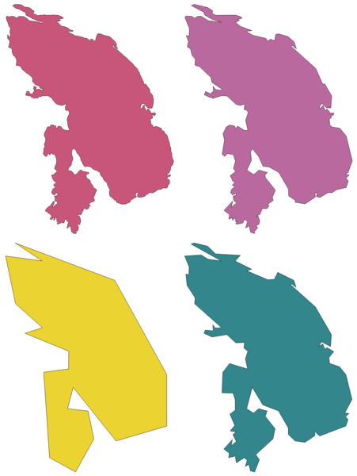

   Clockwise from top left: source layer and increasing
   simplification tolerances

|checkbox| Allows :ref:`features in-place modification <processing_inplace_edit>`
of line and polygon features

**Default menu**: :menuselection:`Vector --> Geometry Tools`

.. seealso:: :ref:`qgissmoothgeometry`, :ref:`qgisdensifygeometries`,
 :ref:`qgisdensifygeometriesgivenaninterval`

Parameters
..........

.. list-table::
   :header-rows: 1
   :widths: 20 20 20 40
   :class: longtable

   * - Label
     - Name
     - Type
     - Description
   * - **Input layer**
     - ``INPUT``
     - [vector: line, polygon]
     - Input line or polygon vector layer
   * - **Simplification method**
     - ``METHOD``
     - [enumeration]

       Default: 0
     - Simplification method. One of:

       * 0 --- Distance (Douglas-Peucker)
       * 1 --- Snap to grid
       * 2 --- Area (Visvalingam)

   * - **Tolerance**
     - ``TOLERANCE``
     - [number |dataDefine|]

       Default: 1.0
     - Threshold tolerance (in units of the layer):
       if the distance between two nodes is smaller than
       the tolerance value, the segment will be simplified
       and vertices will be removed.
   * - **Simplified**
     - ``OUTPUT``
     - [same as input]

       Default: ``[Create temporary layer]``
     - Specify the output (simplified) vector layer.
       One of:

       .. include:: ../algs_include.rst
          :start-after: **layer_output_types_append**
          :end-before: **end_layer_output_types_append**

Outputs
.......

.. list-table::
   :header-rows: 1
   :widths: 20 20 20 40

   * - Label
     - Name
     - Type
     - Description
   * - **Simplified**
     - ``OUTPUT``
     - [same as input]
     - The output (simplified) vector layer

Python code
...........

**Algorithm ID**: ``native:simplifygeometries``

.. include:: ../algs_include.rst
  :start-after: **algorithm_code_section**
  :end-before: **end_algorithm_code_section**

.. _qgissinglesidedbuffer:

Single sided buffer
-------------------
Computes a buffer on lines by a specified distance on one side of
the line only.

Buffer always results in a polygon layer.

.. figure:: img/single_side_buffer.png
   :align: center

   Left versus right side buffer on the same vector line layer

.. seealso:: :ref:`qgisbuffer`

Parameters
..........

.. list-table::
   :header-rows: 1
   :widths: 20 20 20 40
   :class: longtable

   * - Label
     - Name
     - Type
     - Description
   * - **Input layer**
     - ``INPUT``
     - [vector: line]
     - Input line vector layer
   * - **Distance**
     - ``DISTANCE``
     - [number]

       Default: 10.0
     - Buffer distance.
   * - **Side**
     - ``SIDE``
     - [enumeration]
  
       Default: 0
     - Which side to create the buffer on.
       One of:

       * 0 -- Left
       * 1 -- Right

   * - **Segments**
     - ``SEGMENTS``
     - [number]

       Default: 8
     - Controls the number of line segments to use to approximate
       a quarter circle when creating rounded offsets.
   * - **Join style**
     - ``JOIN_STYLE``
     - [enumeration]

       Default: 0
     - Specifies whether round, miter or beveled joins should be
       used when offsetting corners in a line.
       Options are:

       * 0 --- Round
       * 1 --- Miter
       * 2 --- Bevel
  
       .. figure:: img/buffer_join_style.png
          :align: center
          :width: 100%

          Round, miter, and bevel join styles
   * - **Miter limit**
     - ``MITER_LIMIT``
     - [number]

       Default: 2.0
     - Sets the maximum distance from the offset geometry to use
       when creating a mitered join as a factor of the offset distance (only applicable for miter
       join styles).
       Minimum: 1.0
                     
       .. figure:: img/buffer_miter_limit.png
          :align: center
          :width: 100%
         
          A 10m buffer with a limit of 2 and a 10m buffer with a limit of 1
   * - **Buffer**
     - ``OUTPUT``
     - [vector: polygon]

       Default: ``[Create temporary layer]``
     - Specify the output (buffer) layer.
       One of:

       .. include:: ../algs_include.rst
          :start-after: **layer_output_types_append**
          :end-before: **end_layer_output_types_append**

Outputs
.......

.. list-table::
   :header-rows: 1
   :widths: 20 20 20 40

   * - Label
     - Name
     - Type
     - Description
   * - **Buffer**
     - ``OUTPUT``
     - [vector: polygon]
     - Output (buffer) polygon layer

Python code
...........

**Algorithm ID**: ``native:singlesidedbuffer``

.. include:: ../algs_include.rst
  :start-after: **algorithm_code_section**
  :end-before: **end_algorithm_code_section**

.. _qgissmoothgeometry:

Smooth
------
Smooths the geometries in a line or polygon layer by
adding more **vertices and corners** to the feature geometries.

The iterations parameter dictates how many smoothing iterations will
be applied to each geometry.
A higher number of iterations results in smoother geometries with the
cost of greater number of nodes in the geometries.

.. figure:: img/smooth_geometry_1.png
    :align: center

    Increasing number of iterations causes smoother geometries

The offset parameter controls how "tightly" the smoothed geometries
follow the original geometries. Smaller values results in a tighter
fit, and larger values will create a looser fit.

.. figure:: img/smooth_geometry_2.png
    :align: center

    Blue: the input layer. Offset 0.25 gives the red line, while
    offset 0.50 gives the green line.

The maximum angle parameter can be used to prevent smoothing of nodes
with large angles.
Any node where the angle of the segments to either side is larger than
this will not be smoothed. For example, setting the maximum angle to
90 degrees or lower would preserve right angles in the geometry.

|checkbox| Allows
:ref:`features in-place modification <processing_inplace_edit>`
of line and polygon features

.. seealso:: :ref:`qgissimplifygeometries`,
   :ref:`qgisdensifygeometries`,
   :ref:`qgisdensifygeometriesgivenaninterval`

Parameters
..........

.. list-table::
   :header-rows: 1
   :widths: 20 20 20 40
   :class: longtable

   * - Label
     - Name
     - Type
     - Description
   * - **Input layer**
     - ``INPUT``
     - [vector: line, polygon]
     - Input line or polygon vector layer
   * - **Iterations**
     - ``ITERATIONS``
     - [number |dataDefine|]

       Default: 1
     - Increasing the number of iterations will give smoother
       geometries (and more vertices).
   * - **Offset**
     - ``OFFSET``
     - [number |dataDefine|]

       Default: 0.25
     - Increasing values will *move* the smoothed lines / boundaries
       further away from the input lines / boundaries.
   * - **Maximum node angle to smooth**
     - ``MAX_ANGLE``
     - [number |dataDefine|]

       Default: 180.0
     - Every node below this value will be smoothed
   * - **Smoothed**
     - ``OUTPUT``
     - [same as input]

       Default: ``[Create temporary layer]``
     - Specify the output (smoothed) layer.
       One of:

       .. include:: ../algs_include.rst
          :start-after: **layer_output_types_append**
          :end-before: **end_layer_output_types_append**

Outputs
.......

.. list-table::
   :header-rows: 1
   :widths: 20 20 20 40

   * - Label
     - Name
     - Type
     - Description
   * - **Smoothed**
     - ``OUTPUT``
     - [same as input]
     - Output (smoothed) vector layer

Python code
...........

**Algorithm ID**: ``native:smoothgeometry``

.. include:: ../algs_include.rst
  :start-after: **algorithm_code_section**
  :end-before: **end_algorithm_code_section**

.. _qgissnapgeometries:

Snap geometries to layer
------------------------
Snaps the geometries in a layer either to the geometries from
another layer, or to geometries within the same layer.

Matching is done based on a tolerance distance, and vertices will be
inserted or removed as required to make the geometries match the
reference geometries.

|checkbox| Allows
:ref:`features in-place modification <processing_inplace_edit>`
of point, line, and polygon features

.. seealso:: :ref:`qgissnappointstogrid`

Parameters
..........

.. list-table::
   :header-rows: 1
   :widths: 20 20 20 40
   :class: longtable

   * - Label
     - Name
     - Type
     - Description
   * - **Input layer**
     - ``INPUT``
     - [vector: any]
     - Input vector layer
   * - **Reference layer**
     - ``REFERENCE_LAYER``
     - [vector: any]
     - Vector layer to snap to
   * - **Tolerance**
     - ``TOLERANCE``
     - [number]

       Default: 10.0
     - Control how close input vertices need to be to the
       reference layer geometries before they are snapped.
   * - **Behavior**
     - ``BEHAVIOR``
     - [enumeration]

       Default: 0
     - Snapping can be done to an existing node or a
       segment (its closest point to the vertex to move).
       Available snapping options:

       * 0 --- Prefer aligning nodes, insert extra vertices where
         required

         Prefer to snap to nodes, even when a segment may be closer
         than a node. New nodes will be inserted to make geometries
         follow each other exactly when inside allowable tolerance.

       * 1 --- Prefer closest point, insert extra vertices where
         required

         Snap to closest point, regardless of it is a node or a
         segment. New nodes will be inserted to make geometries
         follow each other exactly when inside allowable tolerance.

       * 2 --- Prefer aligning nodes, don't insert new vertices

         Prefer to snap to nodes, even when a segment may be closer
         than a node. No new nodes will be inserted.

       * 3 --- Prefer closest point, don't insert new vertices

         Snap to closest point, regardless of it is a node or a
         segment. No new nodes will be inserted.

       * 4 --- Move end points only, prefer aligning nodes

         Only snap start/end points of lines (point features will
         also be snapped, polygon features will not be modified),
         prefer to snap to nodes.

       * 5 --- Move end points only, prefer closest point

         Only snap start/end points of lines (point features will
         also be snapped, polygon features will not be modified),
         snap to closest point

       * 6 --- Snap end points to end points only

         Only snap the start/end points of lines to other start/end points of lines

       * 7 --- Snap to anchor nodes (single layer only)

   * - **Snapped geometry**
     - ``OUTPUT``
     - [same as input]

       Default: ``[Create temporary layer]``
     - Specify the output (snapped) layer.
       One of:

       .. include:: ../algs_include.rst
          :start-after: **layer_output_types**
          :end-before: **end_layer_output_types**

Outputs
.......

.. list-table::
   :header-rows: 1
   :widths: 20 20 20 40

   * - Label
     - Name
     - Type
     - Description
   * - **Snapped geometry**
     - ``OUTPUT``
     - [same as input]
     - Output (snapped) vector layer

Python code
...........

**Algorithm ID**: ``native:snapgeometries``

.. include:: ../algs_include.rst
  :start-after: **algorithm_code_section**
  :end-before: **end_algorithm_code_section**

.. _qgissnappointstogrid:

Snap points to grid
-------------------
Modifies the coordinates of geometries in a vector layer, so that all
points or vertices are snapped to the closest point of a grid.

If the snapped geometry cannot be calculated (or is totally collapsed)
the feature's geometry will be cleared.

Snapping can be performed on the X, Y, Z or M axis. A grid spacing of
0 for any axis will disable snapping for that axis.

|checkbox| Allows
:ref:`features in-place modification <processing_inplace_edit>`
of point, line, and polygon features

.. note:: Snapping to grid may generate an invalid geometry in some
   corner cases.

.. seealso:: :ref:`qgissnapgeometries`

Parameters
..........

.. list-table::
   :header-rows: 1
   :widths: 20 20 20 40
   :class: longtable

   * - Label
     - Name
     - Type
     - Description
   * - **Input layer**
     - ``INPUT``
     - [vector: any]
     - Input vector layer
   * - **X Grid Spacing**
     - ``HSPACING``
     - [number |dataDefine|]

       Default: 1.0
     - Grid spacing on the X axis
   * - **Y Grid Spacing**
     - ``VSPACING``
     - [number |dataDefine|]

       Default: 1.0
     - Grid spacing on the Y axis
   * - **Z Grid Spacing**
     - ``ZSPACING``
     - [number |dataDefine|]

       Default: 0.0
     - Grid spacing on the Z axis
   * - **M Grid Spacing**
     - ``MSPACING``
     - [number |dataDefine|]

       Default: 0.0
     - Grid spacing on the M axis
   * - **Snapped**
     - ``OUTPUT``
     - [same as input]

       Default: ``[Create temporary layer]``
     - Specify the output (snapped) layer.
       One of:

       .. include:: ../algs_include.rst
          :start-after: **layer_output_types_append**
          :end-before: **end_layer_output_types_append**

Outputs
.......

.. list-table::
   :header-rows: 1
   :widths: 20 20 20 40

   * - Label
     - Name
     - Type
     - Description
   * - **Snapped**
     - ``OUTPUT``
     - [same as input]
     - Output (snapped) vector layer

Python code
...........

**Algorithm ID**: ``native:snappointstogrid``

.. include:: ../algs_include.rst
  :start-after: **algorithm_code_section**
  :end-before: **end_algorithm_code_section**

.. _qgissplitlinesbylength:

Split lines by maximum length
----------------------------------
Takes a line (or curve) layer and splits each feature into
multiple parts, where each part is of a specified maximum length.
Z and M values at the start and end of the new line substrings are
linearly interpolated from existing values.

|checkbox| Allows
:ref:`features in-place modification <processing_inplace_edit>`
of line features

Parameters
..........

.. list-table::
   :header-rows: 1
   :widths: 20 20 20 40

   * - Label
     - Name
     - Type
     - Description
   * - **Input layer**
     - ``INPUT``
     - [vector: line]
     - The input line vector layer
   * - **Maximum line length**
     - ``LENGTH``
     - [number |dataDefine|]

       Default: 10.0
     - The maximum length of a line in the output.
   * - **Split**
     - ``OUTPUT``
     - [vector: line]

       Default: ``[Create temporary layer]``
     - Specify the output line vector layer.
       One of:

       .. include:: ../algs_include.rst
          :start-after: **layer_output_types_append**
          :end-before: **end_layer_output_types_append**

Outputs
.......

.. list-table::
   :header-rows: 1
   :widths: 20 20 20 40

   * - Label
     - Name
     - Type
     - Description

   * - **Split**
     - ``OUTPUT``
     - [vector: line]
     - The new line vector layer - the length of the feature geometries
       is less than or equal to the length specified in
       the LENGTH parameter.

Python code
...........

**Algorithm ID**: ``native:splitlinesbylength``

.. include:: ../algs_include.rst
  :start-after: **algorithm_code_section**
  :end-before: **end_algorithm_code_section**

.. _qgissubdivide:

Subdivide
---------
Subdivides the geometry. The returned geometry will be a collection
containing subdivided parts from the original geometry, where no part
has more than the specified maximum number of nodes.

This is useful for dividing a complex geometry into less complex
parts, easier to spatially index and faster to perform spatial
operations.
Curved geometries will be segmentized before subdivision.

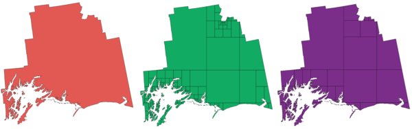

   Left the input layer, middle maximum nodes value is 100 and right
   maximum value is 200

|checkbox| Allows
:ref:`features in-place modification <processing_inplace_edit>` 
of point, line, and polygon features

.. note:: Subdividing a geometry can generate geometry parts that may
   not be valid and may contain self-intersections.

.. seealso:: :ref:`qgisexplodelines`, :ref:`qgislinesubstring`

Parameters
..........

.. list-table::
   :header-rows: 1
   :widths: 20 20 20 40

   * - Label
     - Name
     - Type
     - Description

   * - **Input layer**
     - ``INPUT``
     - [vector: any]
     - The input vector layer
   * - **Maximum nodes in parts**
     - ``MAX_NODES``
     - [number |dataDefine|]

       Default: 256
     - Maximum number of vertices each new
       geometry part is allowed to have.
       Fewer *sub-parts* for higher values.
   * - **Subdivided**
     - ``OUTPUT``
     - [same as input]

       Default: ``[Create temporary layer]``
     - Specify the output (subdivided) vector layer.
       One of:

       .. include:: ../algs_include.rst
          :start-after: **layer_output_types_append**
          :end-before: **end_layer_output_types_append**

Outputs
.......

.. list-table::
   :header-rows: 1
   :widths: 20 20 20 40

   * - Label
     - Name
     - Type
     - Description

   * - **Subdivided**
     - ``OUTPUT``
     - [same as input]
     - Output vector layer

Python code
...........

**Algorithm ID**: ``native:subdivide``

.. include:: ../algs_include.rst
  :start-after: **algorithm_code_section**
  :end-before: **end_algorithm_code_section**

.. _qgisswapxy:

Swap X and Y coordinates
------------------------
Switches the X and Y coordinate values in input geometries.

It can be used to repair geometries which have accidentally had their
latitude and longitude values reversed.

|checkbox| Allows
:ref:`features in-place modification <processing_inplace_edit>`
of point, line, and polygon features

.. seealso:: :ref:`qgistranslategeometry`, :ref:`qgisrotatefeatures`

Parameters
..........

.. list-table::
   :header-rows: 1
   :widths: 20 20 20 40

   * - Label
     - Name
     - Type
     - Description

   * - **Input layer**
     - ``INPUT``
     - [vector: any]
     - The input vector layer
   * - **Swapped**
     - ``OUTPUT``
     - [same as input]

       Default: ``[Create temporary layer]``
     - Specify the output vector layer.
       One of:

       .. include:: ../algs_include.rst
          :start-after: **layer_output_types_append**
          :end-before: **end_layer_output_types_append**

Outputs
.......

.. list-table::
   :header-rows: 1
   :widths: 20 20 20 40

   * - Label
     - Name
     - Type
     - Description

   * - **Swapped**
     - ``OUTPUT``
     - [same as input]
     - Output (swapped) vector layer

Python code
...........

**Algorithm ID**: ``native:swapxy``

.. include:: ../algs_include.rst
  :start-after: **algorithm_code_section**
  :end-before: **end_algorithm_code_section**

.. _qgistaperedbuffer:

Tapered buffers
---------------
Creates tapered buffer along line geometries, using a specified start
and end buffer diameter.

.. figure:: img/tapered_buffer.png
   :align: center

   Tapered buffer example

.. seealso:: :ref:`qgisbufferbym`, :ref:`qgisbuffer`,
   :ref:`qgiswedgebuffers`

Parameters
..........

.. list-table::
   :header-rows: 1
   :widths: 20 20 20 40
   :class: longtable

   * - Label
     - Name
     - Type
     - Description
   * - **Input layer**
     - ``INPUT``
     - [vector: line]
     - Input line vector layer
   * - **Start width**
     - ``START_WIDTH``
     - [number |dataDefine|]

       Default: 0.0
     - Represents the radius of the buffer applied
       at the start point of the line feature
   * - **End width**
     - ``END_WIDTH``
     - [number |dataDefine|]

       Default: 0.0
     - Represents the radius of the buffer applied
       at the end point of the line feature.
   * - **Segments**
     - ``SEGMENTS``
     - [number |dataDefine|]

       Default: 16
     - Controls the number of line segments to use to approximate
       a quarter circle when creating rounded offsets.
   * - **Buffered**
     - ``OUTPUT``
     - [vector: polygon]

       Default: ``[Create temporary layer]``
     - Specify the output (buffer) layer.
       One of:

       .. include:: ../algs_include.rst
          :start-after: **layer_output_types_append**
          :end-before: **end_layer_output_types_append**

Outputs
.......

.. list-table::
   :header-rows: 1
   :widths: 20 20 20 40

   * - Label
     - Name
     - Type
     - Description
   * - **Buffered**
     - ``OUTPUT``
     - [vector: polygon]
     - Output (buffer) polygon layer

Python code
...........

**Algorithm ID**: ``native:taperedbuffer``

.. include:: ../algs_include.rst
  :start-after: **algorithm_code_section**
  :end-before: **end_algorithm_code_section**

.. _qgistessellate:

Tessellate
----------
Tessellates a polygon geometry layer, dividing the geometries into
triangular components.

The output layer consists of multipolygon geometries for each input
feature, with each multipolygon consisting of multiple triangle
component polygons.

.. figure:: img/tessellated.png
   :align: center

   Tessellated polygon (right)

|checkbox| Allows
:ref:`features in-place modification <processing_inplace_edit>`
of polygon features

Parameters
..........

.. list-table::
   :header-rows: 1
   :widths: 20 20 20 40

   * - Label
     - Name
     - Type
     - Description
   * - **Input layer**
     - ``INPUT``
     - [vector: polygon]
     - Input polygon vector layer
   * - **Tesselated**
     - ``OUTPUT``
     - [vector: polygon]

       Default: ``[Create temporary layer]``
     - Specify the output layer.
       One of:

       .. include:: ../algs_include.rst
          :start-after: **layer_output_types_append**
          :end-before: **end_layer_output_types_append**

Outputs
.......

.. list-table::
   :header-rows: 1
   :widths: 20 20 20 40

   * - Label
     - Name
     - Type
     - Description
   * - **Tesselated**
     - ``OUTPUT``
     - [vector: polygon]
     - Output multipolygonZ layer

Python code
...........

**Algorithm ID**: ``3d:tessellate``

.. include:: ../algs_include.rst
  :start-after: **algorithm_code_section**
  :end-before: **end_algorithm_code_section**

.. _qgistransect:

Transect
--------
Creates transects on vertices for (multi)linestring.

A transect is a line oriented from an angle (by default perpendicular)
to the input polylines (at vertices).

Field(s) from feature(s) are returned in the transect with these
new fields:

* TR_FID: ID of the original feature
* TR_ID: ID of the transect. Each transect have an unique ID
* TR_SEGMENT: ID of the segment of the linestring
* TR_ANGLE: Angle in degrees from the original line at the vertex
* TR_LENGTH: Total length of the transect returned
* TR_ORIENT: Side of the transect (only on the left or right of
  the line, or both side)

.. figure:: img/transect.png
   :align: center

   Dashed red lines represent the transect of the input line layer

Parameters
..........

.. list-table::
   :header-rows: 1
   :widths: 20 20 20 40
   :class: longtable

   * - Label
     - Name
     - Type
     - Description
   * - **Input layer**
     - ``INPUT``
     - [vector: line]
     - Input line vector layer
   * - **Length of the transect**
     - ``LENGTH``
     - [number |dataDefine|]

       Default: 5.0
     - Length in map unit of the transect
   * - **Angle in degrees from the original line at the vertices**
     - ``ANGLE``
     - [number |dataDefine|]

       Default: 90.0
     - Change the angle of the transect
   * - **Side to create the transect**
     - ``SIDE``
     - [enumeration]
     - Choose the side of the transect. Available options are:

       * 0 --- Left
       * 1 --- Right
       * 2 --- Both

   * - **Transect**
     - ``OUTPUT``
     - [vector: line]

       Default: ``[Create temporary layer]``
     - Specify the output line layer.
       One of:

       .. include:: ../algs_include.rst
          :start-after: **layer_output_types**
          :end-before: **end_layer_output_types**

Outputs
.......

.. list-table::
   :header-rows: 1
   :widths: 20 20 20 40

   * - Label
     - Name
     - Type
     - Description
   * - **Transect**
     - ``OUTPUT``
     - [vector: line]
     - Output line layer

Python code
...........

**Algorithm ID**: ``native:transect``

.. include:: ../algs_include.rst
  :start-after: **algorithm_code_section**
  :end-before: **end_algorithm_code_section**

.. _qgistranslategeometry:

Translate
---------
Moves the geometries within a layer, by offsetting with a predefined
X and Y displacement.

Z and M values present in the geometry can also be translated.

.. figure:: img/translate_geometry.png
   :align: center

   Dashed lines represent the translated geometry of the input layer

|checkbox| Allows
:ref:`features in-place modification <processing_inplace_edit>`
of point, line, and polygon features

.. seealso:: :ref:`qgisarraytranslatedfeatures`,
   :ref:`qgisoffsetline`, :ref:`qgisrotatefeatures`, :ref:`qgisswapxy`

Parameters
..........

.. list-table::
   :header-rows: 1
   :widths: 20 20 20 40
   :class: longtable

   * - Label
     - Name
     - Type
     - Description
   * - **Input layer**
     - ``INPUT``
     - [vector: any]
     - Input vector layer
   * - **Offset distance (x-axis)**
     - ``DELTA_X``
     - [number |dataDefine|]

       Default: 0.0
     - Displacement to apply on the X axis
   * - **Offset distance (y-axis)**
     - ``DELTA_Y``
     - [number |dataDefine|]

       Default: 0.0
     - Displacement to apply on the Y axis
   * - **Offset distance (z-axis)**
     - ``DELTA_Z``
     - [number |dataDefine|]

       Default: 0.0
     - Displacement to apply on the Z axis
   * - **Offset distance (m values)**
     - ``DELTA_M``
     - [number |dataDefine|]

       Default: 0.0
     - Displacement to apply on the M axis
   * - **Translated**
     - ``OUTPUT``
     - [same as input]

       Default: ``[Create temporary layer]``
     - Specify the output vector layer.
       One of:

       .. include:: ../algs_include.rst
          :start-after: **layer_output_types_append**
          :end-before: **end_layer_output_types_append**

Outputs
.......

.. list-table::
   :header-rows: 1
   :widths: 20 20 20 40

   * - Label
     - Name
     - Type
     - Description
   * - **Translated**
     - ``OUTPUT``
     - [same as input]
     - Output vector layer

Python code
...........

**Algorithm ID**: ``native:translategeometry``

.. include:: ../algs_include.rst
  :start-after: **algorithm_code_section**
  :end-before: **end_algorithm_code_section**

.. _qgisbufferbym:

Variable width buffer (by M value)
----------------------------------
Creates variable width buffers along lines, using the M value of the
line geometries as the diameter of the buffer at each vertex.

.. figure:: img/variable_buffer_m.png
   :align: center

   Variable buffer example

.. seealso:: :ref:`qgistaperedbuffer`, :ref:`qgisbuffer`,
   :ref:`qgissetmvalue`, :ref:`qgisvariabledistancebuffer`

Parameters
..........

.. list-table::
   :header-rows: 1
   :widths: 20 20 20 40

   * - Label
     - Name
     - Type
     - Description
   * - **Input layer**
     - ``INPUT``
     - [vector: line]
     - Input line vector layer
   * - **Segments**
     - ``SEGMENTS``
     - [number |dataDefine|]

       Default: 16
     - Number of the buffer segments per quarter circle.
       It can be a unique value (same value for all the features),
       or it can be taken from features data (the value can
       depend on feature attributes).
   * - **Buffered**
     - ``OUTPUT``
     - [vector: polygon]

       Default: ``[Create temporary layer]``
     - Specify the output (buffer) layer.
       One of:

       .. include:: ../algs_include.rst
          :start-after: **layer_output_types_append**
          :end-before: **end_layer_output_types_append**

Outputs
.......

.. list-table::
   :header-rows: 1
   :widths: 20 20 20 40

   * - Label
     - Name
     - Type
     - Description
   * - **Buffered**
     - ``OUTPUT``
     - [vector: polygon]
     - Variable buffer polygon layer

Python code
...........

**Algorithm ID**: ``native:bufferbym``

.. include:: ../algs_include.rst
  :start-after: **algorithm_code_section**
  :end-before: **end_algorithm_code_section**

.. _qgisvoronoipolygons:

Voronoi polygons
----------------
Takes a point layer and generates a polygon layer containing
the Voronoi polygons (known also as Thiessen polygons) corresponding
to those input points.

Any location within a Voronoi polygon is closer to the associated
point than to any other point.

.. figure:: img/voronoi.png
   :align: center

   Voronoi polygons

**Default menu**: :menuselection:`Vector --> Geometry Tools`

Parameters
..........

.. list-table::
   :header-rows: 1
   :widths: 20 20 20 40

   * - Label
     - Name
     - Type
     - Description
   * - **Input layer**
     - ``INPUT``
     - [vector: point]
     - Input point vector layer
   * - **Buffer region (% of extent)**
     - ``BUFFER``
     - [number]

       Default: 0.0
     - The extent of the output layer will be this much
       bigger than the extent of the input layer
   * - **Tolerance**

       Optional
     - ``TOLERANCE``
     - [number]

       Default: 0.0
     - Specifies an optional snapping tolerance which can be used to improve the robustness of the voronoi.
   * - **Copy attributes from input features**
     - ``COPY_ATTRIBUTES``
     - [boolean]

       Default: True
     - Specifies whether fields storing involved point features ID should be added to the output.
       If False, an ``id`` field is created to identify the polygons.
   * - **Voronoi polygons**
     - ``OUTPUT``
     - [vector: polygon]

       Default: ``[Create temporary layer]``
     - Specify the output layer (with the Voronoi polygons).
       One of:

       .. include:: ../algs_include.rst
          :start-after: **layer_output_types**
          :end-before: **end_layer_output_types**

Outputs
.......

.. list-table::
   :header-rows: 1
   :widths: 20 20 20 40

   * - Label
     - Name
     - Type
     - Description
   * - **Voronoi polygons**
     - ``OUTPUT``
     - [vector: polygon]
     - Voronoi polygons of the input point vector layer

Python code
...........

**Algorithm ID**: ``native:voronoipolygons``

.. include:: ../algs_include.rst
  :start-after: **algorithm_code_section**
  :end-before: **end_algorithm_code_section**

.. Substitutions definitions - AVOID EDITING PAST THIS LINE
   This will be automatically updated by the find_set_subst.py script.
   If you need to create a new substitution manually,
   please add it also to the substitutions.txt file in the
   source folder.

.. |arrowDown| image:: /static/common/mActionArrowDown.png
   :width: 1.5em
.. |arrowUp| image:: /static/common/mActionArrowUp.png
   :width: 1.5em
.. |checkbox| image:: /static/common/checkbox.png
   :width: 1.3em
.. |clearText| image:: /static/common/mIconClearText.png
   :width: 1.5em
.. |dataDefine| image:: /static/common/mIconDataDefine.png
   :width: 1.5em
.. |deleteAttribute| image:: /static/common/mActionDeleteAttribute.png
   :width: 1.5em
.. |identify| image:: /static/common/mActionIdentify.png
   :width: 1.5em
.. |newAttribute| image:: /static/common/mActionNewAttribute.png
   :width: 1.5em
