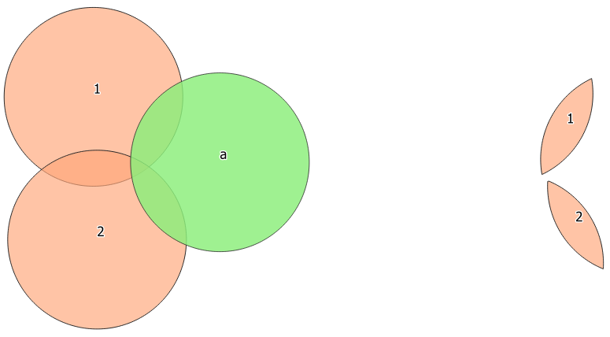
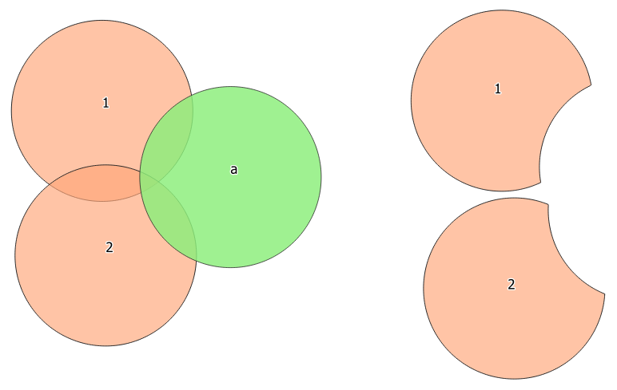
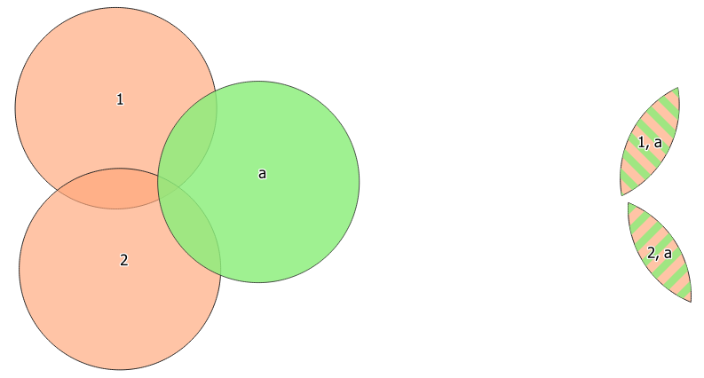
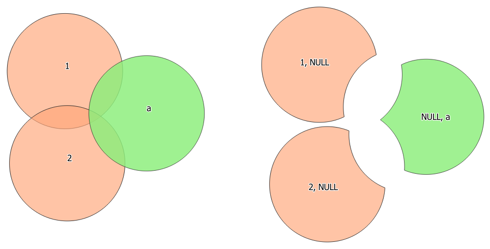
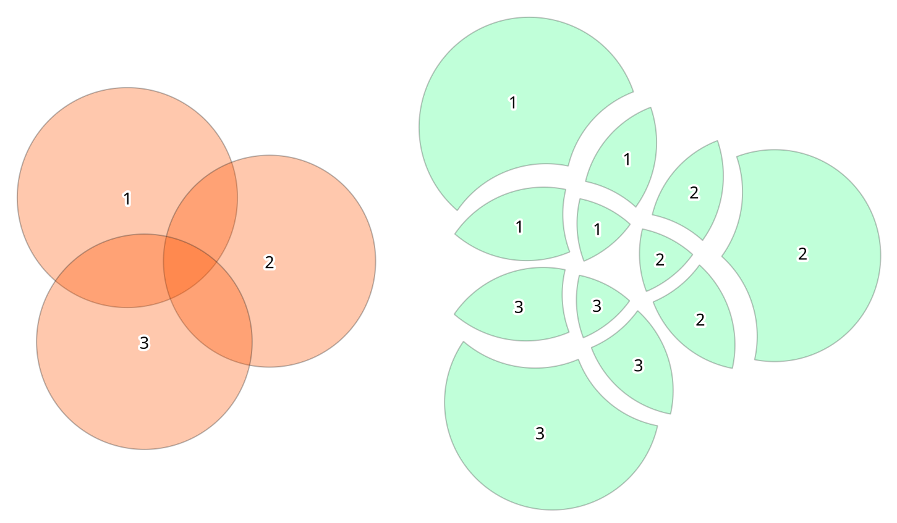
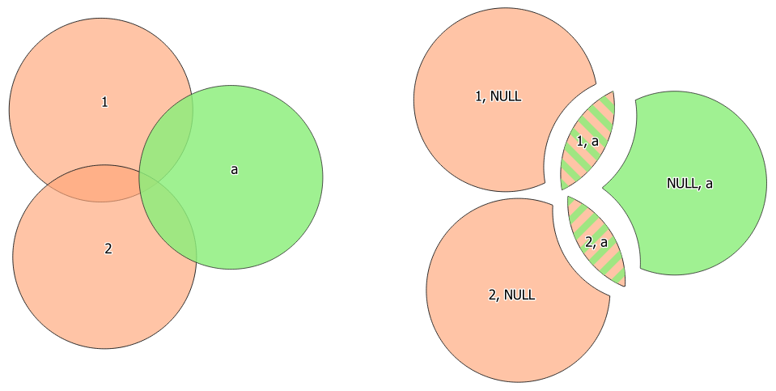

Vector overlay
==============

.. only:: html

   .. contents::
      :local:
      :depth: 1

.. _qgisclip:

Clip
----
Clips a vector layer using the features of an additional polygon
layer.

Only the parts of the features in the input layer that fall within the
polygons of the overlay layer will be added to the resulting layer.

.. include:: ../algs_include.rst
   :start-after: **warning_attributes**
   :end-before: **end_warning_attributes**

This algorithm uses spatial indexes on the providers, prepared
geometries and apply a clipping operation if the geometry isn't wholly
contained by the mask geometry.

  Clipping operation between a two-features input layer and a single
  feature overlay layer (left) - resulting features are moved for
  clarity (right)

|checkbox| Allows :ref:`features in-place modification <processing_inplace_edit>`
of point, line, and polygon features

**Default menu**: :menuselection:`Vector --> Geoprocessing Tools`

.. seealso:: :ref:`qgisintersection`, :ref:`qgisdifference`

Parameters
..........

.. list-table::
   :header-rows: 1
   :widths: 20 20 20 40

   * - Label
     - Name
     - Type
     - Description
   * - **Input layer**
     - ``INPUT``
     - [vector: any]
     - Layer containing the features to be clipped
   * - **Overlay layer**
     - ``OVERLAY``
     - [vector: polygon]
     - Layer containing the clipping features
   * - **Clipped**
     - ``OUTPUT``
     - [same as input]
       
       Default: ``[Create temporary layer]``
     - Specify the layer to contain the features from the input layer
       that are inside the overlay (clipping) layer.
       One of:

       .. include:: ../algs_include.rst
          :start-after: **layer_output_types**
          :end-before: **end_layer_output_types**

Outputs
.......

.. list-table::
   :header-rows: 1
   :widths: 20 20 20 40

   * - Label
     - Name
     - Type
     - Description
   * - **Clipped**
     - ``OUTPUT``
     - [same as input]
     - Layer containing features from the input layer split by the
       overlay layer.

Python code
...........

**Algorithm ID**: ``qgis:clip``

.. include:: ../algs_include.rst
  :start-after: **algorithm_code_section**
  :end-before: **end_algorithm_code_section**

.. _qgisdifference:

Difference
----------
Extracts features from the input layer that don't fall within the
boundaries of the overlay layer.

Input layer features that partially overlap the overlay layer
feature(s) are split along the boundary of those feature(s) and only
the portions outside the overlay layer features are retained.

.. include:: ../algs_include.rst
   :start-after: **warning_attributes**
   :end-before: **end_warning_attributes**

  Difference operation between a two-features input layer and a single
  feature overlay layer (left) - resulting features are moved for
  clarity (right)

|checkbox| Allows :ref:`features in-place modification <processing_inplace_edit>`
of point, line, and polygon features

**Default menu**: :menuselection:`Vector --> Geoprocessing Tools`

.. seealso:: :ref:`qgismultidifference`, :ref:`qgissymmetricaldifference`, :ref:`qgisclip`

Parameters
..........

.. list-table::
   :header-rows: 1
   :widths: 20 20 20 40

   * - Label
     - Name
     - Type
     - Description
   * - **Input layer**
     - ``INPUT``
     - [vector: any]
     - Layer to extract (parts of) features from.
   * - **Overlay layer**
     - ``OVERLAY``
     - [vector: any]
     
     - Layer containing the geometries that will be subtracted from
       the input layer geometries.
       It is expected to have at least as many dimensions (point: 0D,
       line: 1D, polygon: 2D, volume: 3D) as the input layer
       geometries.
   * - **Difference**
     - ``OUTPUT``
     - [same as input]
       
       Default: ``[Create temporary layer]``
     - Specify the layer to contain the (parts of) features from the
       input layer that are not inside the overlay layer.
       One of:

       .. include:: ../algs_include.rst
          :start-after: **layer_output_types**
          :end-before: **end_layer_output_types**

Outputs
.......

.. list-table::
   :header-rows: 1
   :widths: 20 20 20 40

   * - Label
     - Name
     - Type
     - Description
   * - **Difference**
     - ``OUTPUT``
     - [same as input]
     - Layer containing (parts of) features from the input layer
       not overlapping the overlay layer.

Python code
...........

**Algorithm ID**: ``qgis:difference``

.. include:: ../algs_include.rst
  :start-after: **algorithm_code_section**
  :end-before: **end_algorithm_code_section**

.. _qgismultidifference:

Difference (multiple)
---------------------
|326|

Extracts features from the input layer that fall completely outside or
only partially overlap the features from any of the overlay layer(s).

For each overlay layer the difference is calculated between the result of
all previous difference operations and this overlay layer.
Input layer features that partially overlap feature(s) in the overlay layer
are split along those features' boundary and only the portions outside the
overlay layer features are retained.

.. include:: ../algs_include.rst
   :start-after: **warning_attributes**
   :end-before: **end_warning_attributes**

.. todo: Add an image
    .. figure:: img/multidifference.png
       :align: center

       CAPTION of image

.. seealso:: :ref:`qgisdifference`, :ref:`qgissymmetricaldifference`, :ref:`qgisclip`

Parameters
..........

.. list-table::
   :header-rows: 1
   :widths: 20 20 20 40

   * - Label
     - Name
     - Type
     - Description
   * - **Input layer**
     - ``INPUT``
     - [vector: any]
     - Layer to extract (parts of) features from.
   * - **Overlay layers**
     - ``OVERLAYS``
     - [vector: any] [list]
     - List of layers containing the geometries that will be subtracted from
       the input layer geometries.
       They are expected to have at least as many dimensions (point: 0D,
       line: 1D, polygon: 2D, volume: 3D) as the input layer geometries.
   * - **Difference**
     - ``OUTPUT``
     - [same as input]

       Default: ``[Create temporary layer]``
     - Specify the layer to contain the (parts of) features from the
       input layer that do not overlap features of the overlay layers.
       One of:

       .. include:: ../algs_include.rst
          :start-after: **layer_output_types**
          :end-before: **end_layer_output_types**

Outputs
.......

.. list-table::
   :header-rows: 1
   :widths: 20 20 20 40

   * - Label
     - Name
     - Type
     - Description
   * - **Difference**
     - ``OUTPUT``
     - [same as input]
     - Layer containing (parts of) features from the input layer
       not overlapping features from the overlay layers.

Python code
...........

**Algorithm ID**: ``qgis:multidifference``

.. include:: ../algs_include.rst
  :start-after: **algorithm_code_section**
  :end-before: **end_algorithm_code_section**

.. _qgisextractbyextent:

Extract/clip by extent
----------------------
Creates a new vector layer that only contains features which fall
within a specified extent.

Any features which intersect the extent will be included.

.. seealso:: :ref:`qgisclip`

Parameters
..........

.. list-table::
   :header-rows: 1
   :widths: 20 20 20 40

   * - Label
     - Name
     - Type
     - Description
   * - **Input layer**
     - ``INPUT``
     - [vector: any]
     - Layer to extract (parts of) features from.
   * - **Extent (xmin, xmax, ymin, ymax)**
     - ``EXTENT``
     - [extent]
     - Extent for clipping.

       .. include:: ../algs_include.rst
          :start-after: **extent_options**
          :end-before: **end_extent_options**

   * - **Clip features to extent**
     - ``CLIP``
     - [boolean]
       
       Default: False
     - If checked, output geometries will be automatically converted
       to multi geometries to ensure uniform output types.
       Moreover the geometries will be clipped to the extent chosen
       instead of taking the whole geometry as output.
   * - **Extracted**
     - ``OUTPUT``
     - [same as input]
       
       Default: ``[Create temporary layer]``
     - Specify the layer to contain the features from the input layer
       that are inside the clip extent.
       One of:

       .. include:: ../algs_include.rst
          :start-after: **layer_output_types**
          :end-before: **end_layer_output_types**

Outputs
.......

.. list-table::
   :header-rows: 1
   :widths: 20 20 20 40

   * - Label
     - Name
     - Type
     - Description
   * - **Extracted**
     - ``OUTPUT``
     - [same as input]
     - Layer containing the clipped features.

Python code
...........

**Algorithm ID**: ``qgis:extractbyextent``

.. include:: ../algs_include.rst
  :start-after: **algorithm_code_section**
  :end-before: **end_algorithm_code_section**

.. _qgisintersection:

Intersection
------------
Extracts the portions of features from the input layer that overlap
features in the overlay layer.

Features in the intersection layer are assigned the attributes of the
overlapping features from both the input and overlay layers.

.. include:: ../algs_include.rst
   :start-after: **warning_attributes**
   :end-before: **end_warning_attributes**

  The intersection operation: A two-features input layer and a single
  feature overlay layer (left) - resulting features are moved for
  clarity (right)

**Default menu**: :menuselection:`Vector --> Geoprocessing Tools`

.. seealso:: :ref:`qgismultiintersection`, :ref:`qgisclip`, :ref:`qgisdifference`

Parameters
..........

.. list-table::
   :header-rows: 1
   :widths: 20 20 20 40
   :class: longtable

   * - Label
     - Name
     - Type
     - Description
   * - **Input layer**
     - ``INPUT``
     - [vector: any]
     - Layer to extract (parts of) features from.
   * - **Overlay layer**
     - ``OVERLAY``
     - [vector: any]
     - Layer containing the features to check for overlap.
       Its features' geometry is expected to have at least as many
       dimensions (point: 0D, line: 1D, polygon: 2D, volume: 3D)
       as the input layer's.
   * - **Input fields to keep (leave empty to keep all fields)**
       
       Optional
     - ``INPUT_FIELDS``
     - [tablefield: any] [list]
       
       Default: None
     - Field(s) of the input layer to keep in the output.
       If no fields are chosen all fields are taken.
   * - **Overlay fields to keep (leave empty to keep all fields)**
       
       Optional
     - ``OVERLAY_FIELDS``
     - [tablefield: any] [list]
       
       Default: None
     - Field(s) of the overlay layer to keep in the output.
       If no fields are chosen all fields are taken.
   * - **Overlay fields prefix**
       
       Optional
     - ``OVERLAY_FIELDS_PREFIX``
     - [string]
     - Prefix to add to the field names of the intersect
       layer's fields to avoid name collisions with fields
       in the input layer.
   * - **Intersection**
     - ``OUTPUT``
     - [same as input]
       
       Default: ``[Create temporary layer]``
     - Specify the layer to contain (the parts of) the features from
       the input layer that overlap one or more features from the
       overlay layer.
       One of:

       .. include:: ../algs_include.rst
          :start-after: **layer_output_types**
          :end-before: **end_layer_output_types**

Outputs
.......

.. list-table::
   :header-rows: 1
   :widths: 20 20 20 40
   :class: longtable

   * - Label
     - Name
     - Type
     - Description
   * - **Intersection**
     - ``OUTPUT``
     - [same as input]
     - Layer containing (parts of) features from the input
       layer that overlap the overlay layer.

Python code
...........

**Algorithm ID**: ``qgis:intersection``

.. include:: ../algs_include.rst
  :start-after: **algorithm_code_section**
  :end-before: **end_algorithm_code_section**

.. _qgismultiintersection:

Intersection (multiple)
-----------------------
|326|

Extracts the overlapping portions of features in the input and all overlay layers.

Features in the output layer are assigned the attributes of the overlapping
features from both the input and overlay layers.

.. include:: ../algs_include.rst
   :start-after: **warning_attributes**
   :end-before: **end_warning_attributes**

.. todo: Add an image
    .. figure:: img/multiintersection.png
       :align: center

       CAPTION of image

.. seealso:: :ref:`qgisintersection`, :ref:`qgisclip`, :ref:`qgisdifference`

Parameters
..........

Basic parameters
^^^^^^^^^^^^^^^^

.. list-table::
   :header-rows: 1
   :widths: 20 20 20 40
   :class: longtable

   * - Label
     - Name
     - Type
     - Description
   * - **Input layer**
     - ``INPUT``
     - [vector: any]
     - Layer to extract (parts of) features from.
   * - **Overlay layers**
     - ``OVERLAYS``
     - [vector: any] [list]
     - Layers containing the features to check for overlap.
       The features' geometry is expected to have at least as many
       dimensions (point: 0D, line: 1D, polygon: 2D, volume: 3D)
       as the input layer's.

Advanced parameters
^^^^^^^^^^^^^^^^^^^

.. list-table::
   :header-rows: 1
   :widths: 20 20 20 40
   :class: longtable

   * - Label
     - Name
     - Type
     - Description
   * - **Overlay fields prefix**

       Optional
     - ``OVERLAY_FIELDS_PREFIX``
     - [string]
     - Prefix to add to the field names of the overlay
       layers fields to avoid name collisions with fields
       in the input layer.

Outputs
.......

.. list-table::
   :header-rows: 1
   :widths: 20 20 20 40
   :class: longtable

   * - Label
     - Name
     - Type
     - Description
   * - **Intersection**
     - ``OUTPUT``
     - [same as input]
     - Layer containing (parts of) features from the input
       layer that overlap all the overlay layers.

Python code
...........

**Algorithm ID**: ``qgis:intersection``

.. include:: ../algs_include.rst
  :start-after: **algorithm_code_section**
  :end-before: **end_algorithm_code_section**

.. _qgislineintersections:

Line intersections
------------------
Creates point features where the lines from the two layers intersect.

.. figure:: img/line_intersection.png
  :align: center

  Points of intersection

**Default menu**: :menuselection:`Vector --> Analysis Tools`

Parameters
..........

Basic parameters
^^^^^^^^^^^^^^^^

.. list-table::
   :header-rows: 1
   :widths: 20 20 20 40
   :class: longtable

   * - Label
     - Name
     - Type
     - Description
   * - **Input layer**
     - ``INPUT``
     - [vector: line]
     - Input line layer.
   * - **Intersect layer**
     - ``INTERSECT``
     - [vector: line]
     - Layer to use to find line intersections.
   * - **Input fields to keep (leave empty to keep all fields)**
       
       Optional
     - ``INPUT_FIELDS``
     - [tablefield: any] [list]
       
       Default: None
     - Field(s) of the input layer to keep in the output.
       If no fields are chosen all fields are taken.
   * - **Intersect fields to keep (leave empty to keep all fields)**
       
       Optional
     - ``INTERSECT_FIELDS``
     - [tablefield: any] [list]
       
       Default: None
     - Field(s) of the intersect layer to keep in the output.
       If no fields are chosen all fields are taken.
   * - **Intersection**
     - ``OUTPUT``
     - [vector: point]
       
       Default: ``[Create temporary layer]``
     - Specify the layer to contain the intersection points of the
       lines from the input and overlay layers.
       One of:

       .. include:: ../algs_include.rst
          :start-after: **layer_output_types**
          :end-before: **end_layer_output_types**

Advanced parameters
^^^^^^^^^^^^^^^^^^^^

.. list-table::
   :header-rows: 1
   :widths: 20 20 20 40
   :class: longtable

   * - Label
     - Name
     - Type
     - Description
   * - **Intersect fields prefix**

       Optional
     - ``INTERSECT_FIELDS_PREFIX``
     - [string]
     - Prefix to add to the field names of the intersect
       layer's fields to avoid name collisions with fields
       in the input layer.

Outputs
.......

.. list-table::
   :header-rows: 1
   :widths: 20 20 20 40

   * - Label
     - Name
     - Type
     - Description
   * - **Intersections**
     - ``OUTPUT``
     - [vector: point]
     - Point vector layer with the intersections.

Python code
...........

**Algorithm ID**: ``qgis:lineintersections``

.. include:: ../algs_include.rst
  :start-after: **algorithm_code_section**
  :end-before: **end_algorithm_code_section**

.. _qgissplitwithlines:

Split with lines
----------------
Splits the lines or polygons in one layer using the lines in another
layer to define the breaking points.
Intersection between geometries in both layers are considered as split
points.

Output will contain multi geometries for split features.

.. figure:: img/split_with_lines.png
  :align: center

  Split lines

|checkbox| Allows :ref:`features in-place modification <processing_inplace_edit>`
of line and polygon features

Parameters
..........

.. list-table::
   :header-rows: 1
   :widths: 20 20 20 40

   * - Label
     - Name
     - Type
     - Description
   * - **Input layer**
     - ``INPUT``
     - [vector: line, polygon]
     - Layer containing the lines or polygons to split.
   * - **Split layer**
     - ``LINES``
     - [vector: line]
     - Line layer whose lines are used to define the breaking points.
   * - **Split**
     - ``OUTPUT``
     - [same as input]
       
       Default: ``[Create temporary layer]``
     - Specify the layer to contain the splitted (in case they are
       intersected by a line in the split layer) line/polygon features
       from the input layer.
       One of:

       .. include:: ../algs_include.rst
          :start-after: **layer_output_types**
          :end-before: **end_layer_output_types**

Outputs
.......

.. list-table::
   :header-rows: 1
   :widths: 20 20 20 40

   * - Label
     - Name
     - Type
     - Description
   * - **Split**
     - ``OUTPUT``
     - [same as input]
     - Output vector layer with split lines or polygons from input
       layer.

Python code
...........

**Algorithm ID**: ``qgis:splitwithlines``

.. include:: ../algs_include.rst
  :start-after: **algorithm_code_section**
  :end-before: **end_algorithm_code_section**

.. _qgissymmetricaldifference:

Symmetrical difference
-----------------------
Creates a layer containing features from both the input and overlay
layers but with the overlapping areas between the two layers removed.

The attribute table of the symmetrical difference layer contains
attributes and fields from both the input and overlay layers.

.. include:: ../algs_include.rst
   :start-after: **warning_attributes**
   :end-before: **end_warning_attributes**

  Symmetrical difference operation between a two-features input layer
  and a single feature overlay layer (left) - resulting features are
  moved for clarity (right)

**Default menu**: :menuselection:`Vector --> Geoprocessing Tools`

.. seealso:: :ref:`qgisdifference`, :ref:`qgisclip`,
   :ref:`qgisintersection`

Parameters
..........

Basic parameters
^^^^^^^^^^^^^^^^

.. list-table::
   :header-rows: 1
   :widths: 20 20 20 40

   * - Label
     - Name
     - Type
     - Description
   * - **Input layer**
     - ``INPUT``
     - [vector: any]
     - First layer to extract (parts of) features from.
   * - **Overlay layer**
     - ``OVERLAY``
     - [vector: any]
     - Second layer to extract (parts of) features from.
       Ideally the geometry type should be the same as input layer.
   * - **Symmetrical difference**
     - ``OUTPUT``
     - [same as input]

       Default: ``[Create temporary layer]``
     - Specify the layer to contain (the parts of) the features from
       the input and overlay layers that do not overlap features from
       the other layer.
       One of:

       .. include:: ../algs_include.rst
          :start-after: **layer_output_types**
          :end-before: **end_layer_output_types**

Advanced parameters
^^^^^^^^^^^^^^^^^^^^

.. list-table::
   :header-rows: 1
   :widths: 20 20 20 40
   :class: longtable

   * - Label
     - Name
     - Type
     - Description
   * - **Overlay fields prefix**

       Optional
     - ``OVERLAY_FIELDS_PREFIX``
     - [string]
     - Prefix to add to the field names of the overlay
       layer's fields to avoid name collisions with fields
       in the input layer.

Outputs
.......

.. list-table::
   :header-rows: 1
   :widths: 20 20 20 40

   * - Label
     - Name
     - Type
     - Description
   * - **Symmetrical difference**
     - ``OUTPUT``
     - [same as input]
     - Layer containing (parts of) features from each layer
       not overlapping the other layer.

Python code
...........

**Algorithm ID**: ``qgis:symmetricaldifference``

.. include:: ../algs_include.rst
  :start-after: **algorithm_code_section**
  :end-before: **end_algorithm_code_section**

.. _qgisunion:

Union
-----
Checks overlaps between features within the input layer and creates
separate features for overlapping and non-overlapping parts.
The area of overlap will create as many identical overlapping features
as there are features that participate in that overlap.

  Union operation with a single input layer of three overlapping
  features (left) - resulting features are moved for clarity (right)

An overlay layer can also be used, in which case features from each
layer are split at their overlap with features from the other one,
creating a layer containing all the portions from both input and
overlay layers.
The attribute table of the union layer is filled with attribute values
from the respective original layer for non-overlapping features, and
attribute values from both layers for overlapping features.

  Union operation between a two-features input layer and a single
  feature overlay layer (left) - resulting features are moved for
  clarity (right)

.. note::
   For ``union(A,B)`` algorithm, if there are overlaps among
   geometries of layer A or among geometries of layer B, these are not
   resolved: you need to do ``union(union(A,B))`` to resolve all
   overlaps, i.e. run single layer ``union(X)`` on the produced result
   ``X=union(A,B)``.

**Default menu**: :menuselection:`Vector --> Geoprocessing Tools`

.. seealso:: :ref:`qgismultiunion`, :ref:`qgisclip`, :ref:`qgisdifference`,
   :ref:`qgisintersection`

Parameters
..........

Basic parameters
^^^^^^^^^^^^^^^^

.. list-table::
   :header-rows: 1
   :widths: 20 20 20 40

   * - Label
     - Name
     - Type
     - Description
   * - **Input layer**
     - ``INPUT``
     - [vector: any]
     - Input vector layer to split at any intersections.
   * - **Overlay layer**

       Optional
     - ``OVERLAY``
     - [vector: any]
     - Layer that will be combined to the first one.
       Ideally the geometry type should be the same as input layer.
   * - **Union**
     - ``OUTPUT``
     - [same as input]

       Default: ``[Create temporary layer]``
     - Specify the layer to contain the (split and duplicated)
       features from the input layer and the overlay layer.
       One of:

       .. include:: ../algs_include.rst
          :start-after: **layer_output_types**
          :end-before: **end_layer_output_types**

Advanced parameters
^^^^^^^^^^^^^^^^^^^^

.. list-table::
   :header-rows: 1
   :widths: 20 20 20 40
   :class: longtable

   * - Label
     - Name
     - Type
     - Description
   * - **Overlay fields prefix**

       Optional
     - ``OVERLAY_FIELDS_PREFIX``
     - [string]
     - Prefix to add to the field names of the overlay
       layer's fields to avoid name collisions with fields
       in the input layer.

Outputs
.......

.. list-table::
   :header-rows: 1
   :widths: 20 20 20 40

   * - Label
     - Name
     - Type
     - Description
   * - **Union**
     - ``OUTPUT``
     - [same as input]
     - Layer containing all the overlapping and
       non-overlapping parts from the processed layer(s).

Python code
...........

**Algorithm ID**: ``qgis:union``

.. include:: ../algs_include.rst
  :start-after: **algorithm_code_section**
  :end-before: **end_algorithm_code_section**

.. _qgismultiunion:

Union (multiple)
----------------
|326|

Checks overlaps between features within the input layer and creates
separate features for overlapping and non-overlapping parts.
The area of overlap will create as many identical overlapping features
as there are features that participate in that overlap.

  Union operation with a single input layer of three overlapping
  features (left) - resulting features are moved for clarity (right)

Multiple overlay layers can also be used, in which case features from each
layer are split at their overlap with features from all other layers,
creating a layer containing all the portions from both input and
overlay layers. Features on the same layer will not split each other.
The attribute table of the Union layer is filled with attribute values
from the respective original layer for non-overlapping features, and
attribute values from overlay layers for overlapping features.

.. todo: Add an image
    .. figure:: img/multiunion.png
       :align: center

       CAPTION of image

.. I'm not sure if the note below is relevant/true with the multiunion alg

   .. note::
   For ``multiunion(A,B,C,...)`` algorithm, if there are overlaps among
   geometries of any layer, these are not
   resolved: you need to do ``union(multiunion(A,B,C...))`` to resolve all
   overlaps, i.e. run single layer ``union(X)`` on the produced result
   ``X=multiunion(A,B,C,...)``.

.. seealso:: :ref:`qgisunion`, :ref:`qgisclip`, :ref:`qgisdifference`,
   :ref:`qgisintersection`

Parameters
..........

Basic parameters
^^^^^^^^^^^^^^^^

.. list-table::
   :header-rows: 1
   :widths: 20 20 20 40

   * - Label
     - Name
     - Type
     - Description
   * - **Input layer**
     - ``INPUT``
     - [vector: any]
     - Input vector layer to split at any intersections.
   * - **Overlay layers**

       Optional
     - ``OVERLAYS``
     - [vector: any] [list]
     - Layers that will be combined to the first one.
       Ideally the geometry type should be the same as input layer.
   * - **Union**
     - ``OUTPUT``
     - [same as input]

       Default: ``[Create temporary layer]``
     - Specify the layer to contain the (split and duplicated)
       features from the input layer and the overlay layers.
       One of:

       .. include:: ../algs_include.rst
          :start-after: **layer_output_types**
          :end-before: **end_layer_output_types**

Advanced parameters
^^^^^^^^^^^^^^^^^^^^

.. list-table::
   :header-rows: 1
   :widths: 20 20 20 40
   :class: longtable

   * - Label
     - Name
     - Type
     - Description
   * - **Overlay fields prefix**

       Optional
     - ``OVERLAY_FIELDS_PREFIX``
     - [string]
     - Prefix to add to the field names of the overlay
       layers fields to avoid name collisions with fields
       in the input layer.

Outputs
.......

.. list-table::
   :header-rows: 1
   :widths: 20 20 20 40

   * - Label
     - Name
     - Type
     - Description
   * - **Union**
     - ``OUTPUT``
     - [same as input]
     - Layer containing all the overlapping and
       non-overlapping parts from the processed layer(s).

Python code
...........

**Algorithm ID**: ``qgis:multiunion``

.. include:: ../algs_include.rst
  :start-after: **algorithm_code_section**
  :end-before: **end_algorithm_code_section**

.. Substitutions definitions - AVOID EDITING PAST THIS LINE
   This will be automatically updated by the find_set_subst.py script.
   If you need to create a new substitution manually,
   please add it also to the substitutions.txt file in the
   source folder.

.. |326| replace:: ``NEW in 3.26``
.. |checkbox| image:: /static/common/checkbox.png
   :width: 1.3em
