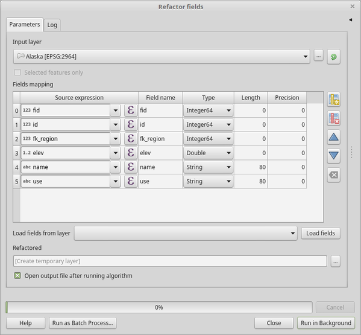

Vector table
============

.. only:: html

   .. contents::
      :local:
      :depth: 1

.. _qgisaddautoincrementalfield:

Add autoincremental field
-------------------------
Adds a new integer field to a vector layer, with a sequential value
for each feature.

This field can be used as a unique ID for features in the layer.
The new attribute is not added to the input layer but a new layer is
generated instead.

The initial starting value for the incremental series can be
specified.
Optionally, the incremental series can be based on grouping fields and
a sort order for features can also be specified.

Parameters
..........

.. list-table::
   :header-rows: 1
   :widths: 20 20 20 40
   :class: longtable

   * - Label
     - Name
     - Type
     - Description
   * - **Input layer**
     - ``INPUT``
     - [vector: any]
     - The input vector layer.
   * - **Field name**
     - ``FIELD_NAME``
     - [string]
       
       Default: 'AUTO'
     - Name of the field with autoincremental values
   * - **Start values at**
       
       Optional
     - ``START``
     - [number]
       
       Default: 0
     - Choose the initial number of the incremental count
   * - **Group values by**
       
       Optional
     - ``GROUP_FIELDS``
     - [tablefield: any] [list]
     - Select grouping field(s): instead of a single count
       run for the whole layer, a separate count is processed
       for each value returned by the combination of these
       fields.
   * - **Sort expression**
       
       Optional
     - ``SORT_EXPRESSION``
     - [expression]
     - Use an expression to sort the features in the layer
       either globally or if set, based on group fields.
   * - **Sort ascending**
     - ``SORT_ASCENDING``
     - [boolean]
       
       Default: True
     - When a ``sort expression`` is set, use this option
       to control the order in which features are assigned
       values.
   * - **Sort nulls first**
     - ``SORT_NULLS_FIRST``
     - [boolean]
       
       Default: False
     - When a ``sort expression`` is set, use this option
       to set whether *Null* values are counted first or
       last.
   * - **Incremented**
     - ``OUTPUT``
     - [same as input]
       
       Default: ``[Create temporary layer]``
     - Specify the output vector layer with the auto increment
       field.
       One of:
      
       * Create Temporary Layer (``TEMPORARY_OUTPUT``)
       * Save to File...
       * Save to Geopackage...
       * Save to PostGIS Table...
      
       The file encoding can also be changed here.

Outputs
.......

.. list-table::
   :header-rows: 1
   :widths: 20 20 20 40

   * - Label
     - Name
     - Type
     - Description
   * - **Incremented**
     - ``OUTPUT``
     - [same as input]
     - Vector layer with auto incremental field

Python code
...........

**Algorithm ID**: ``qgis:addautoincrementalfield``

.. include:: qgis_algs_include.rst
  :start-after: **algorithm_code_section**
  :end-before: **end_algorithm_code_section**

.. _qgisaddfieldtoattributestable:

Add field to attributes table
-----------------------------
Adds a new field to a vector layer.

The name and characteristics of the attribute are defined as
parameters.

The new attribute is not added to the input layer but a new layer is
generated instead.

Parameters
..........

.. list-table::
   :header-rows: 1
   :widths: 20 20 20 40
   :class: longtable

   * - Label
     - Name
     - Type
     - Description

   * - **Input layer**
     - ``INPUT``
     - [vector: any]
     - The input layer
   * - **Field name**
     - ``FIELD_NAME``
     - [string]
     - Name of the new field
   * - **Field type**
     - ``FIELD_TYPE``
     - [enumeration]
       
       Default: 0
     - Type of the new field. You can choose between:
       
       * 0 --- Integer
       * 1 --- Float
       * 2 --- String
       
   * - **Field length**
     - ``FIELD_LENGTH``
     - [number]
       
       Default: 10
     - Length of the field
   * - **Field precision**
     - ``FIELD_PRECISION``
     - [number]
       
       Default: 0
     - Precision of the field. Useful with Float field type.
   * - **Added**
     - ``OUTPUT``
     - [same as input]
       
       Default: ``[Create temporary layer]``
     - Specify the output vector layer.
       One of:
       
       * Create Temporary Layer (``TEMPORARY_OUTPUT``)
       * Save to File...
       * Save to Geopackage...
       * Save to PostGIS Table......
       
       The file encoding can also be changed here.

Outputs
.......

.. list-table::
   :header-rows: 1
   :widths: 20 20 20 40

   * - Label
     - Name
     - Type
     - Description
   * - **Added**
     - ``OUTPUT``
     - [same as input]
     - Vector layer with new field added

Python code
...........

**Algorithm ID**: ``qgis:addfieldtoattributestable``

.. include:: qgis_algs_include.rst
  :start-after: **algorithm_code_section**
  :end-before: **end_algorithm_code_section**

.. _qgisadduniquevalueindexfield:

Add unique value index field
----------------------------
Takes a vector layer and an attribute and adds a new numeric field.

Values in this field correspond to values in the specified attribute,
so features with the same value for the attribute will have the same
value in the new numeric field.

This creates a numeric equivalent of the specified attribute, which
defines the same classes.

The new attribute is not added to the input layer but a new layer is
generated instead.

Parameters
..........

.. list-table::
   :header-rows: 1
   :widths: 20 20 20 40
   :class: longtable

   * - Label
     - Name
     - Type
     - Description
   * - **Input layer**
     - ``INPUT``
     - [vector: any]
     - The input layer.
   * - **Class field**
     - ``FIELD``
     - [tablefield: any]
     - Features that have the same value for this field will get the
       same index.
   * - **Output field name**
     - ``FIELD_NAME``
     - [string]
       
       Default: 'NUM_FIELD'
     - Name of the new field containing the indexes.
   * - **Layer with index field**
     - ``OUTPUT``
     - [vector: any]
       
       Default: ``[Create temporary layer]``
     - Vector layer with the numeric field containing indexes.
       One of:
      
       * Skip Output
       * Create Temporary Layer
       * Save to File...
       * Save to Geopackage...
       * Save to PostGIS Table......
       
       The file encoding can also be changed here.
   * - **Class summary**
     - ``SUMMARY_OUTPUT``
     - [table]
       
       Default: ``[Skip output]``
     - Specify the table to contain the summary of the class field
       mapped to the corresponding unique value.
       One of:
      
       * Skip Output
       * Create Temporary Layer
       * Save to File...
       * Save to Geopackage...
       * Save to PostGIS Table......
       
       The file encoding can also be changed here.

Outputs
.......

.. list-table::
   :header-rows: 1
   :widths: 20 20 20 40

   * - Label
     - Name
     - Type
     - Description
   * - **Layer with index field**
     - ``OUTPUT``
     - [same as input]
     - Vector layer with the numeric field containing indexes.
   * - **Class summary**
     - ``SUMMARY_OUTPUT``
     - [table]
       
       Default: ``[Skip Output]``
     - Table with summary of the class field mapped to the
       corresponding unique value.  

Python code
...........

**Algorithm ID**: ``qgis:adduniquevalueindexfield``

.. include:: qgis_algs_include.rst
  :start-after: **algorithm_code_section**
  :end-before: **end_algorithm_code_section**

.. _qgisaddxyfieldstolayer:

Add X/Y fields to layer
----------------------------
Adds X and Y (or latitude/longitude) fields to a point layer.
The X/Y fields can be calculated in a different CRS to the layer
(e.g. creating latitude/longitude fields for a layer in a projected
CRS).

Parameters
..........

.. list-table::
   :header-rows: 1
   :widths: 20 20 20 40
   :class: longtable

   * - Label
     - Name
     - Type
     - Description
   * - **Input layer**
     - ``INPUT``
     - [vector: point]
     - The input layer.
   * - **Coordinate system**
     - ``CRS``
     - [crs]
       
       Default: "EPSG:4326"
     - Coordinate reference system to use for the generated x and
       y fields.
   * - **Field prefix**
       
       Optional
     - ``PREFIX``
     - [string]
     - Prefix to add to the new field names to avoid name collisions
       with fields in the input layer.
   * - **Added fields**
     - ``OUTPUT``
     - [vector: point]

       Default: ``[Create temporary layer]``
     - Specify the output layer.
       One of:

       * Create Temporary Layer
       * Save to File...
       * Save to Geopackage...
       * Save to PostGIS Table...

       The file encoding can also be changed here.

Outputs
.......

.. list-table::
   :header-rows: 1
   :widths: 20 20 20 40

   * - Label
     - Name
     - Type
     - Description
   * - **Added fields**
     - ``OUTPUT``
     - [vector: point]
     - The output layer - identical to the input layer but with two
       new double fields, ``x`` and ``y``.

Python code
...........

**Algorithm ID**: ``qgis:addxyfieldstolayer``

.. include:: qgis_algs_include.rst
  :start-after: **algorithm_code_section**
  :end-before: **end_algorithm_code_section**

.. _qgisadvancedpythonfieldcalculator:

Advanced Python field calculator
--------------------------------
Adds a new attribute to a vector layer, with values resulting from
applying an expression to each feature.

The expression is defined as a Python function.

Parameters
..........

.. list-table::
   :header-rows: 1
   :widths: 20 20 20 40
   :class: longtable

   * - Label
     - Name
     - Type
     - Description
   * - **Input layer**
     - ``INPUT``
     - [vector: any]
     - Input vector layer
   * - **Result field name**
     - ``FIELD_NAME``
     - [string]
       
       Default: 'NewField'
     - Name of the new field
   * - **Field type**
     - ``FIELD_TYPE``
     - [enumeration]
       
       Default: 0
     - Type of the new field. One of:
       
       * 0 --- Integer
       * 1 --- Float
       * 2 --- String
       
   * - **Field length**
     - ``FIELD_LENGTH``
     - [number]
       
       Default: 10
     - Length of the field
   * - **Field precision**
     - ``FIELD_PRECISION``
     - [number]
       
       Default: 3
     - Precision of the field. Useful with Float field type.
   * - **Global expression**
       
       Optional
     - ``GLOBAL``
     - [string]
     - The code in the global expression section will be
       executed only once before the calculator starts
       iterating through all the features of the input layer.
       Therefore, this is the correct place to import
       necessary modules or to calculate variables that
       will be used in subsequent calculations.
   * - **Formula**
     - ``FORMULA``
     - [string]
     - The Python formula to evaluate.
       Example: To calculate the area of an input polygon layer you
       can add::
       
         value = $geom.area()
       
   * - **Calculated**
     - ``OUTPUT``
     - [same as input]
       
       Default: ``[Create temporary layer]``
     - Specify the vector layer with the new calculated
       field. One of:
       
       * Create Temporary Layer
       * Save to File...
       * Save to Geopackage...
       * Save to PostGIS Table......
       
       The file encoding can also be changed here.

Outputs
.......

.. list-table::
   :header-rows: 1
   :widths: 20 20 20 40

   * - Label
     - Name
     - Type
     - Description
   * - **Calculated**
     - ``OUTPUT``
     - [same as input]
     - Vector layer with the new calculated field

Python code
...........

**Algorithm ID**: ``qgis:advancedpythonfieldcalculator``

.. include:: qgis_algs_include.rst
  :start-after: **algorithm_code_section**
  :end-before: **end_algorithm_code_section**

.. _qgisdeletecolumn:

Drop field(s)
-------------
Takes a vector layer and generates a new one that has the same
features but without the selected columns.

Parameters
..........

.. list-table::
   :header-rows: 1
   :widths: 20 20 20 40

   * - Label
     - Name
     - Type
     - Description
   * - **Input layer**
     - ``INPUT``
     - [vector: any]
     - Input vector layer to drop field(s) from
   * - **Fields to drop**
     - ``COLUMN``
     - [tablefield: any] [list]
     - The field(s) to drop
   * - **Remaining fields**
     - ``OUTPUT``
     - [same as input]
       
       Default: ``[Create temporary layer]``
     - Specify the output vector layer with the remaining fields.
       One of:
       
       * Create Temporary Layer
       * Save to File...
       * Save to Geopackage...
       * Save to PostGIS Table......
       
       The file encoding can also be changed here.

Outputs
.......

.. list-table::
   :header-rows: 1
   :widths: 20 20 20 40

   * - Label
     - Name
     - Type
     - Description
   * - **Remaining fields**
     - ``OUTPUT``
     - [same as input]
     - Vector layer with the remaining fields

Python code
...........

**Algorithm ID**: ``qgis:deletecolumn``

.. include:: qgis_algs_include.rst
  :start-after: **algorithm_code_section**
  :end-before: **end_algorithm_code_section**

.. _qgisexplodehstorefield:

Explode HStore Field
-------------------------
Creates a copy of the input layer and adds a new field
for every unique key in the HStore field.

The expected field list is an optional comma separated
list.
If this list is specified, only these fields are added
and the HStore field is updated.
By default, all unique keys are added.

The PostgreSQL `HStore <https://www.postgresql.org/docs/10/hstore.html>`_
is a simple key-value store used in PostgreSQL and OGR (when reading
an
`OSM file <https://gdal.org/drivers/vector/osm.html#other-tags-field>`_
with the ``other_tags`` field.

Parameters
..........

.. list-table::
   :header-rows: 1
   :widths: 20 20 20 40
   :class: longtable

   * - Label
     - Name
     - Type
     - Description
   * - **Input layer**
     - ``INPUT``
     - [vector: any]
     - Input vector layer
   * - **HStore field**
     - ``FIELD``
     - [tablefield: any]
     - The field(s) to drop
   * - **Expected list of fields separated by a comma**

       Optional
     - ``EXPECTED_FIELDS``
     - [string]

       Default: ''
     - Comma-separated list of fields to extract.
       The HStore field will be updated by removing these keys.

   * - **Exploded**
     - ``OUTPUT``
     - [same as input]
       
       Default: ``[Create temporary layer]``
     - Specify the output vector layer. One of:
       
       * Create Temporary Layer
       * Save to File...
       * Save to Geopackage...
       * Save to PostGIS Table......
       
       The file encoding can also be changed here.

Outputs
.......

.. list-table::
   :header-rows: 1
   :widths: 20 20 20 40

   * - Label
     - Name
     - Type
     - Description
   * - **Exploded**
     - ``OUTPUT``
     - [same as input]
     - Output vector layer

Python code
...........

**Algorithm ID**: ``qgis:explodehstorefield``

.. include:: qgis_algs_include.rst
  :start-after: **algorithm_code_section**
  :end-before: **end_algorithm_code_section**

.. _qgisextractbinary:

Extract binary field
-------------------------
Extracts contents from a binary field, saving them to individual
files.
Filenames can be generated using values taken from an attribute in the
source table or based on a more complex expression.

Parameters
..........

.. list-table::
   :header-rows: 1
   :widths: 20 20 20 40

   * - Label
     - Name
     - Type
     - Description
   * - **Input layer**
     - ``INPUT``
     - [vector: any]
     - Input vector layer containing the binary data
   * - **Binary field**
     - ``FIELD``
     - [tablefield: any]
     - Field containing the binary data
   * - **File name**
     - ``FILENAME``
     - [expression]
     - Field or expression-based text to name each output file
   * - **Destination folder**
     - ``FOLDER``
     - [folder]
       
       Default: ``[Save to a temporary folder]``
     - Folder in which to store the output files.  One of:
       
       * Save to a Temporary Directory
       * Save to Directory...
       
       The file encoding can also be changed here.

Outputs
.......

.. list-table::
   :header-rows: 1
   :widths: 20 20 20 40

   * - Label
     - Name
     - Type
     - Description
   * - **Folder**
     - ``FOLDER``
     - [folder]
     - The folder that contains the output files.

Python code
...........

**Algorithm ID**: ``qgis:extractbinary``

.. include:: qgis_algs_include.rst
  :start-after: **algorithm_code_section**
  :end-before: **end_algorithm_code_section**

.. _qgisfeaturefilter:

Feature filter
-----------------------------
Filters features from the input layer and redirects
them to one or several outputs.
If you do not know about any attribute names that are common to all
possible input layers, filtering is only possible on the feature
geometry and general record mechanisms, such as ``$id`` and ``uuid``.

.. note:: This algorithm is only available from the
  :ref:`Graphical modeler <processing.modeler>`.

Parameters
..........

.. list-table::
   :header-rows: 1
   :widths: 20 20 20 40

   * - Label
     - Name
     - Type
     - Description
   * - **Input layer**
     - ``INPUT``
     - [vector: any]
     - The input layer.
   * - **Outputs and filters**
       
       (one or more)
     - ``OUTPUT_<name of the filter>``
     - [same as input]
     - The output layers with filters (as many as there are filters).

Outputs
.......

.. list-table::
   :header-rows: 1
   :widths: 20 20 20 40

   * - Label
     - Name
     - Type
     - Description
   * - **Output**
       
       (one or more)
     - ``native:filter_1:OUTPUT_<name of filter>``
     - [same as input]
     - The output layers with filtered features (as many as there are
       filters).

Python code
...........

**Algorithm ID**: ``qgis:featurefilter``

.. include:: qgis_algs_include.rst
  :start-after: **algorithm_code_section**
  :end-before: **end_algorithm_code_section**

.. _qgisfieldcalculator:

Field calculator
----------------
Opens the field calculator (see :ref:`vector_expressions`).
You can use all the supported expressions and functions.

A new layer is created with the result of the expression.

The field calculator is very useful when used in
:ref:`processing.modeler`.

Parameters
..........

.. list-table::
   :header-rows: 1
   :widths: 20 20 20 40
   :class: longtable

   * - Label
     - Name
     - Type
     - Description
   * - **Input layer**
     - ``INPUT``
     - [vector: any]
     - The layer to calculate on
   * - **Output field name**
     - ``FIELD_NAME``
     - [string]
     - The name of the field for the results
   * - **Output field type**
     - ``FIELD_TYPE``
     - [enumeration]
       
       Default: 0
     - The type of the field.  One of:
       
       * 0 --- Float
       * 1 --- Integer
       * 2 --- String
       * 3 --- Date
       
   * - **Output field width**
     - ``FIELD_LENGTH``
     - [number]
       
       Default: 10
     - The length of the result field (minimum 0)
   * - **Field precision**
     - ``FIELD_PRECISION``
     - [number]
       
       Default: 3
     - The precision of the result field (minimum 0, maximum 15)
   * - **Create new field**
     - ``NEW_FIELD``
     - [boolean]
       
       Default: True
     - Should the result field be a new field
   * - **Formula**
     - ``FORMULA``
     - [expression]
     - The formula to use to calculate the result
   * - **Output file**
     - ``OUTPUT``
     - [vector: any]
       
       Default: ``[Save to temporary file]``
     - Specification of the output layer.

Outputs
.......

.. list-table::
   :header-rows: 1
   :widths: 20 20 20 40

   * - Label
     - Name
     - Type
     - Description
   * - **Calculated**
     - ``OUTPUT``
     - [vector: any]
     - Output layer with the calculated field values

Python code
...........

**Algorithm ID**: ``qgis:fieldcalculator``

.. include:: qgis_algs_include.rst
  :start-after: **algorithm_code_section**
  :end-before: **end_algorithm_code_section**

.. _qgisrefactorfields:

Refactor fields
---------------
Allows editing the structure of the attribute table of a vector layer.

Fields can be modified in their type and name, using a fields mapping.

The original layer is not modified. A new layer is generated, which
contains a modified attribute table, according to the provided fields
mapping.

Refactor layer fields allows to:

* Change field names and types
* Add and remove fields
* Reorder fields
* Calculate new fields based on expressions
* Load field list from another layer

  Refactor fields dialog

Parameters
..........

.. list-table::
   :header-rows: 1
   :widths: 20 20 20 40
   :class: longtable

   * - Label
     - Name
     - Type
     - Description
   * - **Input layer**
     - ``INPUT``
     - [vector: any]
     - The layer to modify
   * - **Fields mapping**
     - ``FIELDS_MAPPING``
     - [list]
     - List of output fields with their definitions.
       The embedded table lists all the fields of the source
       layer and allows you to edit them:

       * Click |newAttribute| to create a new field.
       * Click |deleteAttribute| to remove a field.
       * Use |arrowUp| and |arrowDown| to change the selected field
	 order.
       * Click |clearText| to reset to the default view.

       For each of the fields you'd like to reuse, you need to
       fill the following options:

       :guilabel:`Source expression` (``expression``) [expression]
         Field or expression from the input layer.
     
       :guilabel:`Field name` (``name``) [string]
         Name of the field in the output layer.
         By default input field name is kept.

       :guilabel:`Type` (``type``) [enumeration]
         Data type of the output field.
         One of:
         
         * Date (14)
         * DateTime (16)
         * Double (6)
         * Integer (2)
         * Integer64 (4)
         * String (10)
         * Boolean (1)

       :guilabel:`Length` (``length``) [number]
         Length of the output field.

       :guilabel:`Precision` (``precision``) [number]
         Precision of the output field.

       Fields from another layer can be loaded into the field list
       in :guilabel:`Load fields from layer`.
   * - **Refactored**
     - ``OUTPUT``
     - [vector: any]
       
       Default: ``[Create temporary layer]``
     - Specification of the output layer.
       One of:
       
       * Create Temporary Layer
       * Save to File...
       * Save to Geopackage...
       * Save to PostGIS Table......
       
       The file encoding can also be changed here.

Outputs
.......

.. list-table::
   :header-rows: 1
   :widths: 20 20 20 40

   * - Label
     - Name
     - Type
     - Description
   * - **Refactored**
     - ``OUTPUT``
     - [vector: any]
     - Output layer with refactored fields

Python code
...........

**Algorithm ID**: ``qgis:refactorfields``

.. include:: qgis_algs_include.rst
  :start-after: **algorithm_code_section**
  :end-before: **end_algorithm_code_section**

.. _qgisrenametablefield:

Rename vector field
-------------------
Renames an existing field from a vector layer.

The original layer is not modified. A new layer is generated where
the attribute table contains the renamed field.

.. seealso:: :ref:`qgisrefactorfields`

Parameters
..........

.. list-table::
   :header-rows: 1
   :widths: 20 20 20 40
   :class: longtable

   * - Label
     - Name
     - Type
     - Description
   * - **Input layer**
     - ``INPUT``
     - [vector: any]
     - The input vector layer
   * - **Field to rename**
     - ``FIELD``
     - [string]
     - The field to be altered
   * - **New field name**
     - ``NEW_NAME``
     - [string]
     - The new field name
   * - **Renamed**
     - ``OUTPUT``
     - [vector: any]
       
       Default: ``[Create temporary layer]``
     - Specification of the output layer.
       One of:
       
       * Create Temporary Layer
       * Save to File...
       * Save to Geopackage...
       * Save to PostGIS Table......
       
       The file encoding can also be changed here.

Outputs
.......

.. list-table::
   :header-rows: 1
   :widths: 20 20 20 40

   * - Label
     - Name
     - Type
     - Description
   * - **Renamed**
     - ``OUTPUT``
     - [vector: any]
     - Output layer with the renamed field

Python code
...........

**Algorithm ID**: ``qgis:renametablefield``

.. include:: qgis_algs_include.rst
  :start-after: **algorithm_code_section**
  :end-before: **end_algorithm_code_section**

.. _qgistexttofloat:

Text to float
-------------
Modifies the type of a given attribute in a vector layer, converting a
text attribute containing numeric strings into a numeric attribute
(e.g. '1' to ``1.0``).

The algorithm creates a new vector layer so the source one is not
modified.

If the conversion is not possible the selected column will have
``NULL`` values.

Parameters
..........

.. list-table::
   :header-rows: 1
   :widths: 20 20 20 40

   * - Label
     - Name
     - Type
     - Description
   * - **Input layer**
     - ``INPUT``
     - [vector: any]
     - The input vector layer.
   * - **Text attribute to convert to float**
     - ``FIELD``
     - [tablefield: string]
     - The string field for the input layer that is to be converted
       to a float field.
   * - **Float from text**
     - ``OUTPUT``
     - [same as input]
       
       Default: ``[Create Temporary Layer]``
     - Specify the output layer. One of:
       
       * Create Temporary Layer
       * Save to File...
       * Save to Geopackage...
       * Save to PostGIS Table......
       
       The file encoding can also be changed here.

Outputs
.......

.. list-table::
   :header-rows: 1
   :widths: 20 20 20 40

   * - Label
     - Name
     - Type
     - Description
   * - **Float from text**
     - ``OUTPUT``
     - [same as input]
     - Output vector layer with the string field converted into
       a float field

Python code
...........

**Algorithm ID**: ``qgis:texttofloat``

.. include:: qgis_algs_include.rst
  :start-after: **algorithm_code_section**
  :end-before: **end_algorithm_code_section**

.. Substitutions definitions - AVOID EDITING PAST THIS LINE
   This will be automatically updated by the find_set_subst.py script.
   If you need to create a new substitution manually,
   please add it also to the substitutions.txt file in the
   source folder.

.. |arrowDown| image:: /static/common/mActionArrowDown.png
   :width: 1.5em
.. |arrowUp| image:: /static/common/mActionArrowUp.png
   :width: 1.5em
.. |clearText| image:: /static/common/mIconClearText.png
   :width: 1.5em
.. |deleteAttribute| image:: /static/common/mActionDeleteAttribute.png
   :width: 1.5em
.. |newAttribute| image:: /static/common/mActionNewAttribute.png
   :width: 1.5em
