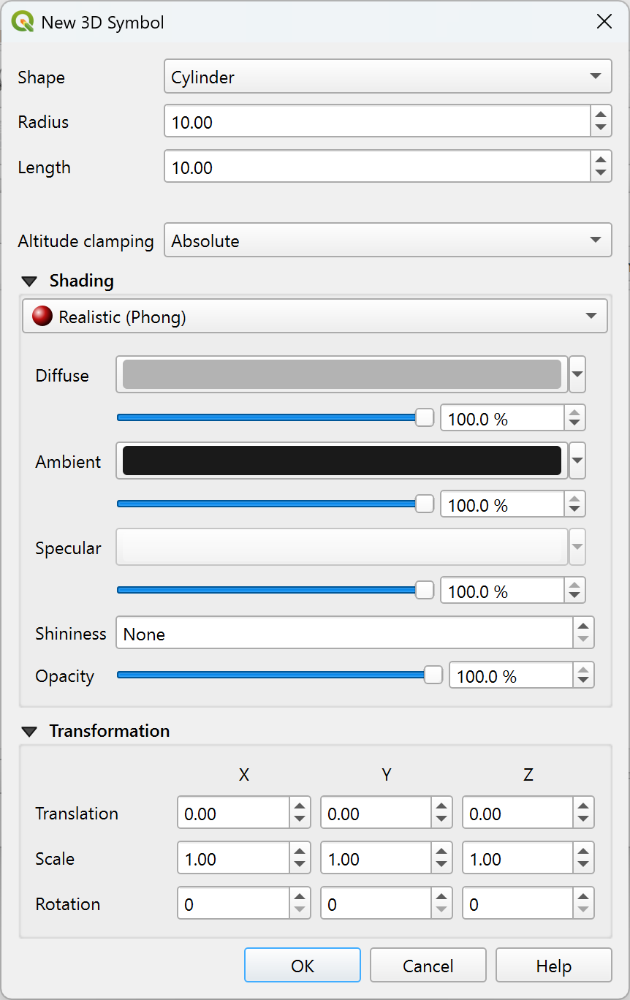
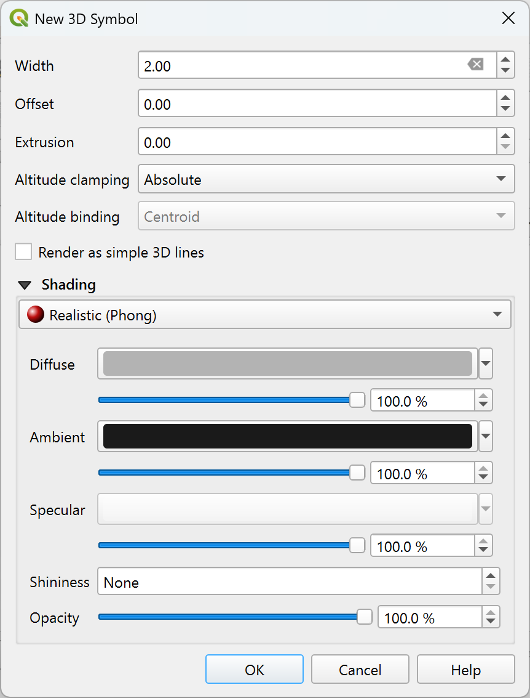
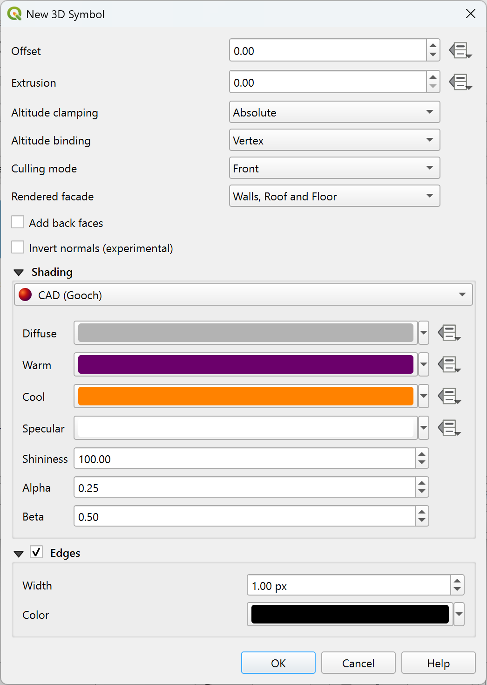

.. _`3dsymbols`:

*********************
 Creating 3D Symbols
*********************

.. only:: html

   .. contents::
      :local:

The :guilabel:`Style Manager` helps you create and store 3D symbols for every geometry type
to render in the :ref:`3D map view <label_3dmapview>`.

As of the other items, enable the |3d| :guilabel:`3D Symbols` tab and expand the |symbologyAdd|
button menu to create:

* :ref:`3D point symbols <3d_pointlayers>`
* :ref:`3D line symbols <3d_linelayers>`
* :ref:`3D polygon symbols <3d_polygonlayers>`

.. _`3d_pointlayers`:

Point Layers
============

.. _figure_3d_point_symbol:

   Properties of a 3D point symbol

* You can define different types of 3D :guilabel:`Shape` to use for point symbols.
  They are mainly defined by their dimensions whose unit refers to the CRS of the
  project. Available types are:

  * :guilabel:`Sphere` defined by a :guilabel:`Radius`
  * :guilabel:`Cylinder` defined by a :guilabel:`Radius` and :guilabel:`Length`
  * :guilabel:`Cube` defined by a :guilabel:`Size`
  * :guilabel:`Cone` defined by a :guilabel:`Top radius`, a :guilabel:`Bottom radius`
    and a :guilabel:`Length`
  * :guilabel:`Plane` defined by a :guilabel:`Size`
  * :guilabel:`Torus` defined by a :guilabel:`Radius` and a :guilabel:`Minor radius`
  * :guilabel:`3D Model`, using a 3D model file: supported formats include
    wavefront :file:`.obj`, :file:`.glTF` and :file:`.fbx`. 
    Models can be a file on disk, a remote URL or :ref:`embedded in the project
    <embedded_file_selector>`. Community-created models are shared on the QGIS Hub 
    at https://plugins.qgis.org/wavefronts.
  * :guilabel:`Billboard`, defined by the :guilabel:`Billboard height` and
    the :guilabel:`Billboard symbol` (usually based on a :ref:`marker symbol
    <vector_marker_symbols>`). The symbol will have a stable size.
    Convenient for visualizing 3D point clouds Shapes.
* The :guilabel:`Altitude clamping` can be set to :guilabel:`Absolute`,
  :guilabel:`Relative` or :guilabel:`Terrain`. The :guilabel:`Absolute` setting
  can be used when height values of the 3d vectors are provided as absolute
  measures from 0. :guilabel:`Relative` and :guilabel:`Terrain` add given
  elevation values to the underlying terrain elevation.
* The :ref:`shading <shading_texture>` properties can be defined.
* Under the :guilabel:`Transformations` frame, you can apply affine transformation
  to the symbol:

  * :guilabel:`Translation` to move objects in x, y and z axis.
  * :guilabel:`Scale` to resize the 3D shapes
  * :guilabel:`Rotation` around the x-, y- and z-axis.

.. _`3d_linelayers`:

Line layers
===========

.. _figure_3d_line_symbol:

   Properties of a 3D line symbol

* Beneath the :guilabel:`Width` and :guilabel:`Height` settings you can
  define the :guilabel:`Extrusion` of the vector lines. If the lines do not have
  z-values, you can define the 3d volumes with this setting.
* With the :guilabel:`Altitude clamping` you define the position of the
  3D lines relative to the underlying terrain surface, if you have included
  raster elevation data or other 3D vectors.
* The :guilabel:`Altitude binding` defines how the feature is clamped to the
  terrain. Either every :guilabel:`Vertex` of the feature will be clamped
  to the terrain or this will be done by the :guilabel:`Centroid`.
* It is possible to |checkbox|:guilabel:`Render as simple 3D lines`.
* The :ref:`shading <shading_texture>` properties can be defined.

.. _`3d_polygonlayers`:

Polygon Layers
==============

.. _figure_3d_polygon_symbol:

   Properties of a 3D polygon symbol

* As for the other ones, :guilabel:`Height` can be defined in CRS units. You can
  also use the |dataDefine| button to overwrite the value with a custom
  expression, a variable or an entry of the attribute table

* Again, :guilabel:`Extrusion` is possible for missing z-values. Also for the
  extrusion you can use the |dataDefine| button in order to use the values of
  the vector layer and have different results for each polygon:

  .. figure:: img/3d_extrusion.png
     :align: center

     Data Defined Extrusion

* The :guilabel:`Altitude clamping`, :guilabel:`Altitude binding` can be defined
  as explained above.
* The :guilabel:`Culling mode` to apply to the symbol; it can be:

  * :guilabel:`No Culling`: this can help to avoid seemingly missing surfaces
    when polygonZ/multipatch data do not have consistent ordering of vertices
    (e.g. all clock-wise or counter clock-wise)
  * :guilabel:`Front`
  * or :guilabel:`Back`
* The :guilabel:`Rendered facade` determines the faces to display. Possible values
  are :guilabel:`No facades`, :guilabel:`Walls`, :guilabel:`Roofs`, or
  :guilabel:`Walls and roofs`
* |checkbox| :guilabel:`Add back faces`: for each triangle, creates both front and
  back face with correct normals - at the expense of increased number of vertex data.
  This option can be used to fix shading issues (e.g., due to data with inconsistent
  order of vertices).
* |checkbox| :guilabel:`Invert normals (experimental)`: can be useful for fixing
  clockwise/counter-clockwise face vertex orders
* The :ref:`shading <shading_texture>` properties can be defined.
* Display of the |checkbox| :guilabel:`Edges` of the symbols can be enabled
  and assigned a :guilabel:`Width` and :guilabel:`Color`.

.. hint:: **Combination for best rendering of 3D data**

 :guilabel:`Culling mode`, :guilabel:`Add back faces` and :guilabel:`Invert normals`
 are all meant to fix the look of 3D data if it does not look right. 
 Typically when loading some data, it is best to first try ``culling mode=back``
 and ``add back faces=disabled`` - it is the most efficient.
 If the rendering does not look correct, try ``add back faces=enabled`` and
 keep ``culling mode=no culling``. Other combinations are more advanced and
 useful only in some scenarios based on how mixed up is the input dataset.

.. _shading_texture:

Shading the texture
===================

Shading helps you reveal 3d details of objects which may otherwise be hidden
due to the scene's lighting. Ultimately, it's an easier material to work with
as you don't need to worry about setting up appropriate scene lighting
in order to visualise features.

Various techniques of shading are used in QGIS and their availability depends
on the geometry type of the symbol:

* :guilabel:`Realistic (Phong)`: describes the way a surface reflects light as
  a combination of the :guilabel:`Diffuse` reflection of rough surfaces with
  the :guilabel:`Specular` reflection of shiny surfaces (:guilabel:`Shininess`).
  It also includes an :guilabel:`Ambient` option to account for the small amount
  of light that is scattered about the entire scene.
  Use the :guilabel:`Opacity` slider to render semi-transparent objects in 3D.
  Read more at `Phong reflection description <https://en.wikipedia.org/wiki/Phong_reflection_model#Description>`_.
* :guilabel:`Realistic Textured (Phong)`: same as the :guilabel:`Realistic (Phong)`
  except that an image is used as :guilabel:`Diffuse Texture`.
  The image can be a file on disk, a remote URL or :ref:`embedded in the project
  <embedded_file_selector>`.
  The :guilabel:`Texture scale` and :guilabel:`Texture rotation` are required.
  Use the :guilabel:`Opacity` slider to render semi-transparent objects in 3D.
* :guilabel:`CAD (Gooch)`: this technique allows shading to occur only in mid-tones
  so that edge lines and highlights remain visually prominent. Along with the
  :guilabel:`Diffuse`, :guilabel:`Specular`, :guilabel:`Shininess` options,
  you need to provide a :guilabel:`Warm` color (for surface facing toward the light)
  and a :guilabel:`Cool` color (for the ones facing away).
  Also, the relative contributions to the cool and warm colors by the diffuse color
  are controlled by :guilabel:`Alpha` and :guilabel:`Beta` properties respectively.
  See also `Gooch shading <https://en.wikipedia.org/wiki/Gooch_shading>`_.
* :guilabel:`Metal Roughness`: a physically based rendering material
  that provides an accurate representation of how light interacts with surfaces.
  Options are available for setting the material :guilabel:`Base color`,
  :guilabel:`Metalness` and :guilabel:`Roughness`.
* :guilabel:`Embedded Textures` with 3D models shape

Application example
===================

To go through the settings explained above you can have a look at
https://app.merginmaps.com/projects/saber/luxembourg/tree.

.. Substitutions definitions - AVOID EDITING PAST THIS LINE
   This will be automatically updated by the find_set_subst.py script.
   If you need to create a new substitution manually,
   please add it also to the substitutions.txt file in the
   source folder.

.. |3d| image:: /static/common/3d.png
   :width: 1.5em
.. |checkbox| image:: /static/common/checkbox.png
   :width: 1.3em
.. |dataDefine| image:: /static/common/mIconDataDefine.png
   :width: 1.5em
.. |symbologyAdd| image:: /static/common/symbologyAdd.png
   :width: 1.5em
