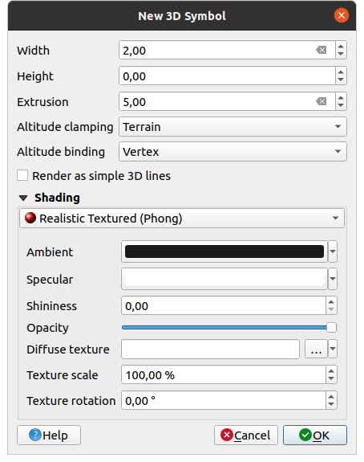

.. _`3dsymbols`:

*********************
 Creating 3D Symbols
*********************

.. only:: html

   .. contents::
      :local:

The :guilabel:`Style Manager` helps you create and store 3D symbols for every geometry type
to render in the :ref:`3D map view <label_3dmapview>`.

As of the other items, enable the |3d| :guilabel:`3D Symbols` tab and expand the |signPlus|
button menu to create:

* :ref:`3D point symbols <3d_pointlayers>`
* :ref:`3D line symbols <3d_linelayers>`
* :ref:`3D polygon symbols <3d_polygonlayers>`

.. _`3d_pointlayers`:

Point Layers
============

.. _figure_3d_point_symbol:

.. figure:: img/3d_point_symbol.png
   :align: center

   Properties of a 3D point symbol

* You can define different simple 3D shapes like :guilabel:`Sphere`, :guilabel:`Cylinder`,
  :guilabel:`Cube`, :guilabel:`Cone`, :guilabel:`Plane` and :guilabel:`Torus`
  defined by their :guilabel:`Radius`, :guilabel:`Size` or :guilabel:`Length`.
  The unit of size of the 3D shapes refers to the CRS of the project.
* The shading of the 3D shapes can be defined by the menus :guilabel:`Diffuse`,
  :guilabel:`Ambient`, :guilabel:`Specular` and :guilabel:`Shininess`
  (see https://en.wikipedia.org/wiki/Phong_reflection_model#Description)
* If you choose :guilabel:`3D Model`, the location will be determined
  by a simple point coordinate.
* For visualizing 3D point clouds you can use :guilabel:`Billboard` Shapes
  defined by the :guilabel:`Billboard Height`, :guilabel:`Billboard symbol` and
  :guilabel:`Altitude clamping`. The symbol will have a stable size.
* :guilabel:`Altitude clamping` can be set to :guilabel:`Absolute`, :guilabel:`Relative`
  or :guilabel:`Terrain`. The :guilabel:`Absolute` setting can be used when height values
  of the 3d vectors are provided as absolute measures from 0. :guilabel:`Relative` and
  :guilabel:`Terrain` add given elevation values to the underlying terrain elevation.
* :guilabel:`Translation` can be used to move objects in x, y and z axis.
* You can define a :guilabel:`Scale factor` for the 3D shape as well as a
  :guilabel:`Rotation` around the x-, y- and z-axis.

.. _`3d_linelayers`:

Line layers
===========

.. _figure_3d_line_symbol:

   Properties of a 3D line symbol

* Beneath the :guilabel:`Width` and :guilabel:`Height` settings you can
  define the :guilabel:`Extrusion` of the vector lines. If the lines do not have
  z-values, you can define the 3d volumes with this setting.
* With the :guilabel:`Altitude clamping` you define the position of the
  3D lines relative to the underlying terrain surface, if you have included
  raster elevation data or other 3D vectors.
* The :guilabel:`Altitude binding` defines how the feature is clamped to the
  terrain. Either every :guilabel:`Vertex` of the feature will be clamped
  to the terrain or this will be done by the :guilabel:`Centroid`.
* It is possible to |checkbox|:guilabel:`Render as simple 3D lines`.
* The shading can be defined in the menus :guilabel:`Diffuse`, :guilabel:`Ambient`,
  :guilabel:`Specular` and :guilabel:`Shininess`.

.. _`3d_polygonlayers`:

Polygon Layers
==============

.. _figure_3d_polygon_symbol:

.. figure:: img/3d_polygon_symbol.png
   :align: center

   Properties of a 3D polygon symbol

* As for the other ones, :guilabel:`Height` can be defined in CRS units. You can
  also use the |dataDefined| button to overwrite the value with a custom
  expression, a variable or an entry of the attribute table

* Again, :guilabel:`Extrusion` is possible for missing z-values. Also for the
  extrusion you can use the |dataDefined| button in order to use the values of
  the vector layer and have different results for each polygon:

   .. figure:: img/3d_extrusion.png
      :align: center

      Data Defined Extrusion

* The :guilabel:`Altitude clamping`, :guilabel:`Altitude binding` can be defined
  as explained above.
* There is an additional option to |checkbox|:guilabel:`Add back faces`
  and |checkbox|:guilabel:`Invert normals`.
* You can define |checkbox|:guilabel:`Edges` by :guilabel:`Width` and :guilabel:`Color`.

Application example
===================

To go through the settings explained above you can have a look at
https://public.cloudmergin.com/projects/saber/luxembourg/tree.

.. Substitutions definitions - AVOID EDITING PAST THIS LINE
   This will be automatically updated by the find_set_subst.py script.
   If you need to create a new substitution manually,
   please add it also to the substitutions.txt file in the
   source folder.

.. |3d| image:: /static/common/3d.png
   :width: 1.5em
.. |checkbox| image:: /static/common/checkbox.png
   :width: 1.3em
.. |dataDefined| image:: /static/common/mIconDataDefine.png
   :width: 1.5em
.. |signPlus| image:: /static/common/symbologyAdd.png
   :width: 1.5em
