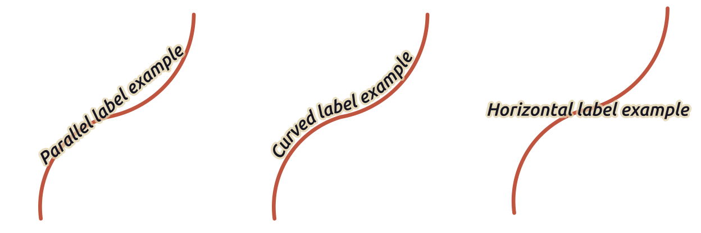

.. _showlabels:

*****************
 Setting a label
*****************

.. only:: html

   .. contents::
      :local:

Labels are textual information you can display on vector features or maps.
They add details you could not necessarily represent using symbols.
Two types of text-related items are available in QGIS:

* :guilabel:`Text Format`: defines the appearance of the text, including
  :ref:`font, size, colors <labels_text>`, :ref:`shadow <labels_shadow>`,
  :ref:`background <labels_background>`, :ref:`buffer <labels_buffer>`, ...

  They can be used to render texts over the map (layout/map title,
  decorations, scale bar, ...), usually through the :ref:`font <font_selector>`
  widget.

  To create a :guilabel:`Text Format` item:

  #. Open the |styleManager| :guilabel:`Style Manager` dialog
  #. Activate the :guilabel:`Text format` tab

     .. _figure_textformats:

     .. figure:: img/stylemanager_textformat.png
        :align: center

        Text formats in Style Manager dialog

  #. Press the |symbologyAdd| :sup:`Add item` button. The :guilabel:`Text Format`
     dialog opens for :ref:`configuration <text_format>`.
     As usual, these properties are :ref:`data-definable <data_defined>`.

* :guilabel:`Label Settings`: extend the text format settings with properties
  related to the location or the interaction with other texts or features
  (:ref:`callouts <labels_callouts>`, :ref:`placement <labels_placement>`,
  :ref:`overlay, scale visibility <labels_rendering>`, mask ...).

  They are used to configure smart labelling for vector layers through the
  |labelingSingle| :guilabel:`Labels` tab of the vector :guilabel:`Layer Properties`
  dialog or :guilabel:`Layer Styling` panel or using the |labelingSingle| :sup:`Layer
  Labeling Options` button of the :ref:`Label toolbar <label_toolbar>`.

  To create a :guilabel:`Label Settings` item:

  #. Open the |styleManager| :guilabel:`Style Manager` dialog
  #. Activate the :guilabel:`Label Settings` tab

     .. _figure_label_settings:

     .. figure:: img/stylemanager_labelsettings.png
        :align: center

        Label Settings in Style Manager dialog

  #. Press the |symbologyAdd| :sup:`Add item` menu and select the entry corresponding
     to the geometry type of the features you want to label.

  The :guilabel:`Label Settings` dialog opens with the following properties.
  As usual, these properties are :ref:`data-definable <data_defined>`.

.. _text_format:

Formatting the label text
=========================

Whether you are configuring a :guilabel:`Text Format` or :guilabel:`Label Settings`
item, you will be given the following options:

.. list-table::
   :header-rows: 1
   :class: longtable

   * - Properties tab
     - Text format
     - Label settings
   * - :guilabel:`Text`
     - |checkbox|
     - |checkbox|
   * - :guilabel:`Formatting`
     - |checkbox|
     - |checkbox|
   * - :guilabel:`Buffer`
     - |checkbox|
     - |checkbox|
   * - :guilabel:`Mask`
     - 
     - |checkbox|
   * - :guilabel:`Background`
     - |checkbox|
     - |checkbox|
   * - :guilabel:`Shadow`
     - |checkbox|
     - |checkbox|
   * - :guilabel:`Callout`
     -
     - |checkbox|
   * - :guilabel:`Placement`
     -
     - |checkbox|
   * - :guilabel:`Rendering`
     -
     - |checkbox|

.. _labels_text:

Text tab
--------

.. _figure_label_text:

.. figure:: img/label_text.png
   :align: center

   Labels settings - Text tab

In the |text| :guilabel:`Text` tab, you can set:

* the :guilabel:`Font`, from the ones available on your machine
* the :guilabel:`Style`: along with the common styles of the font, you can set
  whether the text should be underlined or striked through
* the :guilabel:`Size` in any :ref:`supported unit <unit_selector>`
* the :guilabel:`Color`
* the :guilabel:`Opacity`
* and :guilabel:`Allow HTML Formatting`:
  The HTML formatting option enables the proper rendering of some HTML tags to customize the label.
  The supported HTML tags are:

  * Color, applicable to text, underline, strikethrough, and overline
  * Font properties (font family, font size, bold and italic)
  * Superscript and subscript components in text,
    where the text will be vertically :sup:`super` or :sub:`sub` aligned
    and automatically sized to 2/3 of the parent font size.
    You can also set a fixed font size for the superscript/subscript
    by including css rules, e.g.:

    .. code:: html

      my superscript text

    The CSS formatting rules ``vertical-align: super`` or ``vertical-align: sub``
    are also available in any other HTML element (annotation, layout label or HTML items, ...).

  In order to use the HTML formatting, you need to provide the HTML code in the :guilabel:`Value` field.
  The expression is parsed and any supported HTML tag overrides its corresponding setting in the labels properties.
  They also combine well with other background, shadow, buffer... properties of labels.

  Below an example of a HTML-based expression and rendering
  (applies different colors and underline to the same label):

  .. code:: html

    format(
      '%1 ( <u>%2 ft</u> )',
      title( lower( "Name" ) ),
      round($length)
    )

  .. _figure_label_html_formatting:

  .. figure:: img/label_HTML_formatting.png
     :align: center

     Labeling with HTML formatting enabled

At the bottom of the tab, a widget shows a filterable list of compatible items
stored in your :ref:`style manager database <vector_style_manager>`.
This allows you to easily configure the current text format or label setting
based on an existing one, and also save a new item to the style database:
Press the :guilabel:`Save format...` or :guilabel:`Save settings...` button
and provide a name and tag(s).

.. note:: When configuring a :guilabel:`Label Settings` item, text format items
 are also available in this widget. Select one to quickly overwrite the current
 :ref:`textual properties <text_format>` of the label.
 Likewise, you can create/overwrite a text format from there.

.. _labels_formatting:

Formatting tab
--------------

.. _figure_label_formatting:

   Label settings - Formatting tab

In the |labelformatting| :guilabel:`Formatting` tab, you can:

* Use the :guilabel:`Type case` option to change the capitalization style of
  the text. You have the possibility to render the text as:

  * :guilabel:`No change`
  * :guilabel:`All uppercase`
  * :guilabel:`All lowercase`
  * :guilabel:`Title case`: modifies the first letter of each word into capital,
    and turns the other letters into lower case if the original text is using
    a single type case. In case of mixed type cases in the text, the other
    letters are left untouched.
  * :guilabel:`Force first letter to capital`: modifies the first letter of each
    word into capital and leaves the other letters in the text untouched.

* Under :guilabel:`Spacing`, change the space between words and between
  individual letters.
* :guilabel:`Stretch` ratio: allows text to be horizontally stretched or
  condensed by a factor. Handy for tweaking the widths of fonts to fit a bit
  of extra text into labels.
* |checkbox| :guilabel:`Enable kerning` of the text font
* Set the :guilabel:`Text orientation` which can be :guilabel:`Horizontal`
  or :guilabel:`Vertical`. It can also be :guilabel:`Rotation-based` when
  setting a label (e.g., to properly label line features in :ref:`parallel
  <labels_line_placement>` placement mode).
* Use the :guilabel:`Blend mode` option to determine how your labels will mix
  with the map features below them (more details at :ref:`blend-modes`).
* The |unchecked| :guilabel:`Apply label text substitutes` option allows you
  to specify a list of texts to substitute to texts in feature labels (e.g.,
  abbreviating street types). Replacement texts are used when displaying
  labels on the map. Users can also export and import lists of
  substitutes to make reuse and sharing easier.
* Configure :guilabel:`Multiple lines`:

  * Set a character that will force a line break in the text with the
    :guilabel:`Wrap on character` option
  * Set an ideal line size for auto-wrapping using the :guilabel:`Wrap lines to`
    option. The size can represent either the :guilabel:`Maximum line length`
    or the :guilabel:`Minimum line length`.
  * Decide the :guilabel:`Line Height`: values can be set to be in
    :guilabel:`Millimeters`, :guilabel:`Points`, :guilabel:`Pixels`, 
    :guilabel:`Percentage`, or :guilabel:`Inches`.
    When line height is set to percentage it is the percentage of the 
    default text line spacing of that font family. Typically 1.2 to 1.5 times the text size.  
  * Format the :guilabel:`Alignment`: typical values available are
    :guilabel:`Left`, :guilabel:`Right`, :guilabel:`Justify` and :guilabel:`Center`.

    When setting point labels properties, the text alignment can also be
    :guilabel:`Follow label placement`. In that case, the alignment will depend
    on the final placement of the label relative to the point. E.g., if the
    label is placed to the left of the point, then the label will be right
    aligned, while if it is placed to the right, it will be left aligned.

  .. note:: The :guilabel:`Multiple lines` formatting is not yet supported by curve based
    :ref:`label placement <labels_placement>`. The options will then be deactivated.

* For line labels you can include :guilabel:`Line direction symbol`
  to help determine the line directions, with symbols to use to indicate the
  :guilabel:`Left` or :guilabel:`Right`. They work particularly well when
  used with the *curved* or *Parallel* placement options from the
  :guilabel:`Placement` tab. There are options to set the symbols position, and
  to |unchecked| :guilabel:`Reverse direction`.
* Use the |unchecked| :guilabel:`Formatted numbers` option to format numeric
  texts. You can set the number of :guilabel:`Decimal places`. By default, ``3``
  decimal places will be used. Use the |checkbox| :guilabel:`Show plus sign` if
  you want to show the plus sign for positive numbers.

.. _labels_buffer:

Buffer tab
----------

.. _figure_label_buffer:

.. figure:: img/label_buffer.png
   :align: center

   Label settings - Buffer tab

To create a buffer around the label, activate the |checkbox| :guilabel:`Draw
text buffer` checkbox in the |labelbuffer| :guilabel:`Buffer` tab. Then you can:

* Set the buffer's :guilabel:`Size` in any :ref:`supported unit <unit_selector>`
* Select the buffer's :guilabel:`Color`
* |checkbox| :guilabel:`Color buffer's fill`: The buffer expands from the
  label's outline, so, if the option is activated, the label's interior is
  filled. This may be relevant when using partially transparent labels or with
  non-normal blending modes, which will allow seeing behind the label's text.
  Unchecking the option (while using totally transparent labels) will allow you
  to create outlined text labels.
* Define the buffer's :guilabel:`Opacity`
* Apply a :guilabel:`Pen join style`: it can be :guilabel:`Round`,
  :guilabel:`Miter` or :guilabel:`Bevel`
* Use the :guilabel:`Blend mode` option to determine how your label's buffer
  will mix with the map components below them (more details at
  :ref:`blend-modes`).
* Check |unchecked| :guilabel:`Draw effects` to add advanced |paintEffects|
  :ref:`paint effects <draw_effects>` for improving text readability,
  eg through outer glows and blurs.

.. _labels_background:

Background tab
--------------

The |labelbackground| :guilabel:`Background` tab allows you to configure a
shape that stays below each label. To add a background, activate
the |unchecked| :guilabel:`Draw Background` checkbox and select
the :guilabel:`Shape` type. It can be:

* a regular shape such as :guilabel:`Rectangle`, :guilabel:`Square`,
  :guilabel:`Circle` or :guilabel:`Ellipse` using full properties of a
  :ref:`fill symbol <vector_fill_symbols>`
* an :guilabel:`SVG` symbol from a file, a URL or embedded in the project
  or style database (:ref:`more details <embedded_file_selector>`)
* or a :guilabel:`Marker Symbol` you can create or select from the
  :ref:`symbol library <vector_marker_symbols>`.

.. _figure_label_background:

.. figure:: img/label_background.png
   :align: center

   Label settings - Background tab

Depending on the selected shape, you need to configure some of the following
properties:

* The :guilabel:`Size type` of the frame, which can be:

  * :guilabel:`Fixed`: using the same size for all the labels, regardless the
    size of the text
  * or a :guilabel:`Buffer` over the text's bounding box
* The :guilabel:`Size` of the frame in X and Y directions, using any
  :ref:`supported units <unit_selector>`
* A :guilabel:`Rotation` of the background, between :guilabel:`Sync with label`,
  :guilabel:`Offset of label` and :guilabel:`Fixed`. The last two require
  an angle in degrees.
* An :guilabel:`Offset X,Y` to shift the background item in the X and/or Y directions
* A :guilabel:`Radius X,Y` to round the corners of the background shape (applies
  to rectangle and square shapes only)
* An :guilabel:`Opacity` of the background
* A :guilabel:`Blend mode` to mix the background with the other items in the
  rendering (see :ref:`blend-modes`).
* For SVG symbol, you can use its default properties (:guilabel:`Load symbol
  parameters`) or set a custom :guilabel:`Fill color`, :guilabel:`Stroke color`
  and :guilabel:`Stroke width`.
* |unchecked| :guilabel:`Draw effects` to add advanced |paintEffects|
  :ref:`paint effects <draw_effects>` for improving text readability,
  eg through outer glows and blurs.

.. _labels_shadow:

Shadow tab
----------

.. _figure_label_shadow:

.. figure:: img/label_shadow.png
   :align: center

   Label settings - Shadow tab

To add a shadow to the text, enable the |labelshadow| :guilabel:`Shadow`
tab and activate the |checkbox| :guilabel:`Draw drop shadow`. Then you can:

* Indicate the item used to generate the shadow with :guilabel:`Draw under`.
  It can be the :guilabel:`Lowest label component` or a particular
  component such as the :guilabel:`Text` itself, the :guilabel:`Buffer` or
  the :guilabel:`Background`.
* Set the shadow's :guilabel:`Offset` from the item being shadowded, ie:

  * The angle: clockwise, it depends on the underlying item orientation
  * The distance of offset from the item being shadowded
  * The units of the offset

  If you tick the |checkbox| :guilabel:`Use global shadow` checkbox,
  then the zero point of the angle is always oriented to the north and
  doesn't depend on the orientation of the label's item.

* Influence the appearance of the shadow with the :guilabel:`Blur
  radius`. The higher the number, the softer the shadows, in the units of
  your choice.

.. comment FIXME: at the moment there is an error in this setting

   |checkbox| :guilabel:`Blur only alpha pixels`:
   It is supposed to show only those
   pixels that have a partial alpha component beyond the base opaque pixels of
   the component being blurred. For example, if you set the shadow of some
   text to be gray and turn on that option, it should still show a duplication
   of the text, colored as per the shadow color option, but with any blurred
   shadow that extends beyond its text. With the option off, in this example,
   it will blur all pixels of the duplicated text.
   This is useful for creating a shadow that increases legibility at smaller
   output sizes, e.g. like duplicating text and offsetting it a bit in
   illustration programs, while still showing a bit of shadow at larger sizes.
   Apparently, there is an error with re-painting the opaque pixels back over
   top of the shadow (depending upon the shadow's color), when that setting is
   used.

* Define the shadow's :guilabel:`Opacity`
* Rescale the shadow's size using the :guilabel:`Scale`
  factor
* Choose the shadow's :guilabel:`Color`
* Use the :guilabel:`Blend mode` option to determine how your label's shadow
  will mix with the map components below them (more details at
  :ref:`blend-modes`).

Configuring interaction with labels
===================================

Other than the text formatting settings exposed above, you can also set how labels
interact with each others or with the features.

.. _labels_mask:

Mask tab
--------

The |labelmask| :guilabel:`Mask` tab allows you to define a mask area around
the labels. This feature is very useful when you have overlapping symbols and
labels with similar colors, and you want to make the labels visible. A label mask 
prevents specified features from drawing within the boundary set for the mask. 
For example, you could set a label mask so that a specified layer does not draw 
within 2mm of the label, but allow features from another layer to still show. 
Label masks are similar to label buffers in that they allow control of the legibility 
of labels that cover other features. The label buffer draws on top of any underlying
features, while the label mask selectively stops other layers from drawing. 

.. _figure_label_mask:

.. figure:: img/label_mask.png
   :align: center

   Labels settings - Mask tab (with the text sample showing a green background 
   representing another layer being excluded)

To create masking effects on labels:

#. Activate the |checkbox| :guilabel:`Enable mask` checkbox in the |labelmask| tab.
#. Then you can set:

   * the mask's :guilabel:`Size` in the :ref:`supported units <unit_selector>`
   * the :guilabel:`Opacity` of the mask area around the label
   * a :guilabel:`Pen Join Style`
   * :ref:`paint effects <draw_effects>` through the |checkbox|
     :guilabel:`Draw effects` checkbox.

#. Select this mask shape as a mask source in the overlapping layer properties
   |labelmask| :guilabel:`Mask` tab (see :ref:`vector_mask_menu`).

.. _labels_callouts:

Callouts tab
------------

A common practice when placing labels on a crowded map is to use **callouts** -
labels which are placed outside (or displaced from) their associated feature
are identified with a dynamic line connecting the label and the feature.
If one of the two endings (either the label or the feature) is moved,
the shape of the connector is recomputed.

.. _figure_label_callouts:

.. figure:: img/label_callouts.png
   :align: center

   Labels with various callouts settings

To add a callout to a label, enable the |labelcallout| :guilabel:`Callouts`
tab and activate the |checkbox| :guilabel:`Draw callouts`. Then you can:

#. Select the :guilabel:`Style` of connector, one of:

   * :guilabel:`Simple lines`: a straight line, the shortest path
   * :guilabel:`Manhattan style`: a 90° broken line
   * :guilabel:`Curved lines`: a curved line
   * :guilabel:`Balloons`: a speech bubble surrounding the label and pointing
     to the feature. It can have rounded corners.

#. For a line-based callout:

   #. Select the :guilabel:`Line style` with full capabilities of a :ref:`line
      symbol <vector_line_symbols>` including layer effects, and data-defined
      settings
   #. If curved, you also define:

      * the percentage of :guilabel:`Curvature` of the connection line
      * and its :guilabel:`Orientation`: starting from the label to the feature,
        it can be :guilabel:`Clockwise` or :guilabel:`Counter-clockwise`, or
        :guilabel:`Automatic` (determining an optimal orientation for each label)
   #. Set the :guilabel:`Minimum length` of callout lines
   #. Check whether to |checkbox| :guilabel:`Draw lines to all feature parts`
      from the feature's label
   #. Set the :guilabel:`Label anchor point`: controls where the connector
      line should join to the label text. Available options:

      * :guilabel:`Closest point`
      * :guilabel:`Centroid`
      * Fixed position at the edge (:guilabel:`Top left`, :guilabel:`Top center`,
        :guilabel:`Top right`, :guilabel:`Left middle`, :guilabel:`Right middle`,
        :guilabel:`Bottom left`, :guilabel:`Bottom center` and :guilabel:`Bottom right`).
   #. Set the :guilabel:`Offset from label area` option: controls the distance
      from the label anchor point (where the callout line ends).
      This avoids drawing lines right up against the text.

#. For a balloon callout, you'd need to set:

   * the :guilabel:`Fill style` with full capabilities of a :ref:`fill
     symbol <vector_fill_symbols>` including layer effects, and data-defined
     settings
   * the :guilabel:`Corner radius` of the speech bubble
   * the :guilabel:`Wedge width`: how large the bubble speech connection with
     feature's pointer should be
   * the :guilabel:`Margins` around the label's text

#. Set the :guilabel:`Offset from feature` option: controls the distance
   from the feature (or its anchor point if a polygon) where callout lines end.
   Eg, this avoids drawing lines right up against the edges of the features.
#. Set the :guilabel:`Feature anchor point` for the (polygon) feature (the end
   point of the connector line). Available options:

   * :guilabel:`Pole of inaccessibility`
   * :guilabel:`Point on exterior`
   * :guilabel:`Point on surface`
   * :guilabel:`Centroid`
#. Set the :guilabel:`Blend mode`: controls the :ref:`blending <blend-modes>`
   of the callout.

Under the :guilabel:`Data defined placement` group, coordinates of the
:guilabel:`Origin` (on the label side) and/or :guilabel:`Destination`
(on the feature side) points of the callout can be controlled.
Callouts can also be controlled manually by using the |moveLabel|
:sup:`Move Label, Diagram or Callout` tool in the :ref:`Labeling Toolbar
<label_toolbar>`.
The start and end points of each callout can be moved this way.
The nodes should be highlighted when the mouse pointer is nearby.
If needed the :kbd:`Shift` Key can be held during the movement.
This will snap the point in a way that the angle between the two callout points
increments by 15 degrees.

.. _labels_placement:

Placement tab
-------------

Choose the |labelplacement| :guilabel:`Placement` tab for configuring label placement
and labeling priority. Note that the placement options differ according to the
type of vector layer, namely point, line or polygon, and are affected by
the global :ref:`PAL setting <automated_placement>`.

.. _labels_point_placement:

Placement for point layers
..........................

Point labels placement modes available are:

.. _cartographic:

* :guilabel:`Cartographic`: point labels are generated with a
  better visual relationship with the point feature, following ideal
  cartographic placement rules. Labels can be placed:

  * at a set :guilabel:`Distance` in :ref:`supported units <unit_selector>`,
    either from the point feature itself or from the bounds of the symbol
    used to represent the feature (set in :guilabel:`Distance offset from`).
    The latter option is especially useful when the symbol size isn't fixed,
    e.g. if it's set by a data defined size or when using different symbols
    in a :ref:`categorized <categorized_renderer>` renderer.
  * following a :guilabel:`Position priority` that can be customized or set for
    an individual feature using a data defined list of prioritised positions.
    This also allows only certain placements to be used, so e.g.
    for coastal features you can prevent labels being placed over the land.

    By default, cartographic mode placements are prioritised in the following
    order (respecting the `guidelines from Krygier and Wood (2011)
    <https://www.researchgate.net/publication/44463780_Making_maps_a_visual_guide_to_map_design_for_GIS_John_Krygier_Denis_Wood>`_
    and other cartographic textbooks):

    #. top right
    #. top left
    #. bottom right
    #. bottom left
    #. middle right
    #. middle left
    #. top, slightly right
    #. bottom, slightly left.

* :guilabel:`Around Point`: labels are placed in a circle around the feature.
  equal radius (set in :guilabel:`Distance`) circle around the feature.
  The placement priority is clockwise from the "top right". The position can
  be constrained using the data-defined :guilabel:`Quadrant` option.

* :guilabel:`Offset from Point`: labels are placed at an :guilabel:`Offset X,Y`
  distance from the point feature, in various units, or preferably over the
  feature. You can use a data-defined :guilabel:`Quadrant` to constrain the
  placement and can assign a :guilabel:`Rotation` to the label.

.. _labels_line_placement:

Placement for line layers
.........................

Label modes for line layers include:

* :guilabel:`Parallel`: draws the label parallel to a generalised line
  representing the feature, with preference for placement over straighter
  portions of the line. You can define:

  * :guilabel:`Allowed positions`: :guilabel:`Above line`, :guilabel:`On line`,
    :guilabel:`Below line` and :guilabel:`Line orientation dependent position`
    (placing the label at the left or the right of the line). It's possible to
    select several options at once. In that case, QGIS will look for the optimal
    label position.
  * :guilabel:`Distance` between the label and the line
* :guilabel:`Curved`: draws the label following the curvature of the line
  feature. In addition to the parameters available with the :guilabel:`Parallel`
  mode, you can set the :guilabel:`Maximum angle between curved characters`,
  either inside or outside.
* :guilabel:`Horizontal`: draws labels horizontally along the length of the
  line feature.

.. _figure_labels_placement_line:

   Label placement examples for lines

Next to placement modes, you can set:

* :guilabel:`Repeating Labels` :guilabel:`Distance` to display multiple
  times the label over the length of the feature. The distance can be in
  ``Millimeters``, ``Points``, ``Pixels``, ``Meters at scale``, ``Map Units``
  and ``Inches``.
* A :guilabel:`Label Overrun` :guilabel:`Distance` (not available for
  horizontal mode): specifies the maximal allowable distance a label may run
  past the end (or start) of line features. Increasing this value can allow
  for labels to be shown for shorter line features.
* :guilabel:`Label Anchoring`: controls the placement of the labels along the
  line feature they refer to. Click on :guilabel:`Settings ...` to choose:

  * the position along the line (as a ratio) which labels will be
    placed close to. It can be data-defined and possible values are:

    * |labelAnchorCenter| :guilabel:`Center of Line`
    * |labelAnchorStart| :guilabel:`Start of Line`
    * |labelAnchorEnd| :guilabel:`End of Line`
    * or |labelAnchorCustom| :guilabel:`Custom...`.

  * :guilabel:`Clipping`: Determines how the label placement on a line is calculated.
    By default only the visible extent of the line is used but the whole extent
    can be used to have more consistent results.
  * :guilabel:`Anchor text`: controls which part of the text (start, center or end)
    will line up with the anchor point. Using :guilabel:`Automatic` anchoring
    means that:

    * For labels anchored near the start of the line (0-25%), the anchor placement
      will be the **start** of the label text
    * For labels anchored near the end of the line (75-100%), the anchor placement
      will be the **end** of the label text
    * For labels anchored near the center of the line (25-75%), the anchor placement
      will be the **center** of the label text
  * :guilabel:`Placement Behavior`: use :guilabel:`Preferred Placement Hint`
    to treat the label anchor only as a hint for the label placement.
    By choosing :guilabel:`Strict`, labels are placed exactly on the label
    anchor.

Placement for polygon layers
............................

You can choose one of the following modes for placing labels of polygons:

.. _figure_labels_placement_polygon:

.. figure:: img/polygon_label_placement.png
   :align: center

   Label placement examples for polygons

* :guilabel:`Offset from Centroid`: labels are placed over the feature centroid
  or at a fixed :guilabel:`Offset X,Y` distance (in :ref:`supported units
  <unit_selector>`) from the centroid.
  The reference centroid can be determined based on the
  part of the polygon rendered in the map canvas (:guilabel:`visible polygon`)
  or the :guilabel:`whole polygon`, no matter if you can see it. You can also:

  * force the centroid point to lay inside their polygon
  * place the label within a specific quadrant
  * assign a rotation
  * :guilabel:`Allow placing labels outside of polygons` when it is not
    possible to place them inside the polygon. Thanks to data-defined properties,
    this makes possible to either allow outside labels, prevent outside labels,
    or force outside labels on a feature-by-feature basis.

* :guilabel:`Around Centroid`: places the label within a preset distance around
  the centroid, with a preference for the placement directly over the centroid.
  Again, you can define whether the centroid is the one of the
  :guilabel:`visible polygon` or the :guilabel:`whole polygon`, and whether
  to force the centroid point inside the polygon.

* :guilabel:`Horizontal`: places at the best position a horizontal label inside
  the polygon. The preferred placement is further from the edges of the polygon.
  It's possible to :guilabel:`Allow placing labels outside of polygons`.

* :guilabel:`Free (Angled)`: places at the best position a rotated label
  inside the polygon. The rotation respects the polygon's orientation and
  the preferred placement is further from the edges of the polygon.
  It's possible to :guilabel:`Allow placing labels outside of polygons`.

* :guilabel:`Using Perimeter`: draws the label parallel to a generalised line
  representing the polygon boundary, with preference for straighter portions
  of the perimeter. You can define:

  * :guilabel:`Allowed positions`: :guilabel:`Above line`, :guilabel:`On line`,
    :guilabel:`Below line` and :guilabel:`Line orientation dependent position`
    (placing the label at the left or the right of the polygon's boundary).
    It's possible to select several options at once. In that case, QGIS will
    look for the optimal label position.
  * :guilabel:`Distance` between the label and the polygon's outline
  * the :guilabel:`Repeating Labels` :guilabel:`Distance` to display multiple
    times the label over the length of the perimeter.

* :guilabel:`Using Perimeter (Curved)`: draws the label following the curvature
  of the polygon's boundary. In addition to the parameters available with the
  :guilabel:`Using Perimeter` mode, you can set the
  :guilabel:`Maximum angle between curved characters polygon`, either inside
  or outside.

* :guilabel:`Outside Polygons`: always places labels outside the polygons,
  at a set :guilabel:`Distance`

Common placement settings
.........................

Some label placement settings are available for all layer geometry types:

Geometry Generator
^^^^^^^^^^^^^^^^^^

The :guilabel:`Geometry Generator` section allows a user to alter the underlying
geometry used to place and render the label, by using :ref:`expressions <vector_expressions>`.
This can be useful to perform displacement of the geometry dynamically
or to convert it to another geometry (type).

In order to use the geometry generator:

#. Check the |checkbox| :guilabel:`Geometry generator` option
#. Enter the expression generating the geometry to rely on
#. If relevant, select the geometry type of the expression output:
   the label geometry-based settings such as placement or rendering
   are updated to match the new geometry type capabilities.

Some use cases include:

* Use a geometry which is saved in another field "label_position"
* Use the :ref:`generated geometry <geometry_generator_symbol>` from the symbology
  also for labeling
* Use the @map_scale variable to calculate distances / sizes be zoom level independent.
* Combined with the curved placement mode, creates a circular label around a point feature::

     exterior_ring(make_circle($geometry, 20))
* Add a label at the start and the end of a line feature::

    collect_geometries( start_point($geometry), end_point($geometry) )
* Rely on a smoothed line of a river to get more room for label placement::

    smooth( $geometry, iterations:=30, offset:=0.25, min_length:=10 )

Data Defined
^^^^^^^^^^^^

The :guilabel:`Data Defined` group provides direct control on labels
placement, on a feature-by-feature basis. It relies on their attributes
or an expression to set:

* the :guilabel:`X` and :guilabel:`Y` coordinate
* the text alignment over the custom position set above:

  * :guilabel:`Horizontal`: it can be **Left**, **Center** or **Right**
  * the text :guilabel:`Vertical`: it can be **Bottom**, **Base**, **Half**,
    **Cap** or **Top**
* the text :guilabel:`Rotation`. Different units can be defined for the
  labeling rotation (e.g. ``degrees``, ``minutes of arc``, ``turns``).
  Check the :guilabel:`Preserve data rotation values` entry if you want to keep
  the rotation value in the associated field and apply it to the label, whether
  the label is pinned or not. If unchecked, unpinning the label rotation is
  reset and its value cleared from the attribute table.
  
  .. note:: Data-defined rotation with polygon features is currently supported
   only with the :guilabel:`Around centroid` placement mode.

.. note:: Expressions can not be used in combination with the labels map tools
   (ie the :guilabel:`Rotate label` and :guilabel:`Move label` tools)
   to :ref:`data-define <data_defined>` labels placement.
   The widget will be reset to the corresponding :ref:`auxiliary storage field
   <vector_auxiliary_storage>`.

.. _`labels_priority`:

Priority
^^^^^^^^

In the :guilabel:`Priority` section you can define the placement priority rank
of each label, ie if there are different diagrams or labels candidates for the
same location, the item with the higher priority will be displayed and the
others could be left out.

The priority rank is also used to evaluate whether a label could be omitted
due to a greater weighted :ref:`obstacle feature <labels_obstacles>`.

.. _`labels_obstacles`:

Obstacles
^^^^^^^^^

In some contexts (eg, high density labels, overlapping features...), the
labels placement can result in labels being placed over unrelated features.

An obstacle is a feature over which QGIS avoids placing other features' labels
or diagrams. This can be controlled from the :guilabel:`Obstacles` section:

#. Activate the |checkbox| :guilabel:`Features act as obstacles`
   option to decide that features of the layer should act as obstacles for
   any label and diagram (including items from other features in the same layer).

   Instead of the whole layer, you can select a subset of features to use as
   obstacles, using the |dataDefine| :sup:`Data-defined override` control next
   to the option.

#. Use the :guilabel:`Settings` button to tweak the obstacle's weighting.

   * For every potential obstacle feature you can assign an :guilabel:`Obstacle
     weight`: any :ref:`label <labels_priority>` or :ref:`diagram <diagram_placement>`
     whose placement priority rank is greater than this value can be placed
     over. Labels or diagrams with lower rank will be omitted if no other
     placement is possible.

     This weighting can also be data-defined, so that within the same layer,
     certain features are more likely to be covered than others.
   * For polygon layers, you can choose the kind of obstacle the feature is:

     * **over the feature's interior**: avoids placing labels over the interior
       of the polygon (prefers placing labels totally outside or just slightly
       inside the polygon)
     * or **over the feature's boundary**: avoids placing labels over the
       boundary of the polygon (prefers placing labels outside or completely
       inside the polygon). This can be useful for layers where the features
       cover the whole area (administrative units, categorical coverages, ...).
       In this case, it is impossible to avoid
       placing labels within these features, and it looks much better when
       placing them over the boundaries between features is avoided.

.. _labels_rendering:

Rendering tab
-------------

In the |render| :guilabel:`Rendering` tab, you can tune when the labels can
be rendered and their interaction with other labels and features.

Label options
.............

Under :guilabel:`Label options`:

* You find the :ref:`scale-based <label_scaledepend>`
  and the :guilabel:`Pixel size-based` visibility settings.

* The :guilabel:`Label z-index` determines the order in which labels are rendered,
  as well in relation with other feature labels in the layer (using data-defined
  override expression), as with labels from other layers. Labels with a higher
  z-index are rendered on top of labels (from any layer) with lower z-index.

  Additionally, the logic has been tweaked so that if two labels have
  matching z-indexes, then:

  * if they are from the same layer, the smaller label will be drawn above the
    larger label
  * if they are from different layers, the labels will be drawn in the same order
    as their layers themselves (ie respecting the order set in the map legend).

  .. note:: This setting doesn't make labels to be drawn below the
     features from other layers, it just controls the order in which
     labels are drawn on top of all the layers' features.

* :guilabel:`Allow inferior fallback placements`: By default QGIS tries to
  render labels at their best placement, following your settings.
  Check this mode to allow features to fallback to worse placement options
  when there's no other choice, e.g. when a line is too short to fit a curved
  label text then the label may be placed horizontally just over the feature's
  center point.
* With data-defined expressions in :guilabel:`Show label` and :guilabel:`Always Show`
  you can fine tune which labels should be rendered.
* Allow to :guilabel:`Show upside-down labels`: alternatives are **Never**,
  **when rotation defined** or **always**.
* The :guilabel:`Overlapping labels` group allows you to control whether
  overlapping labels are permitted for features in the layer and
  how each of them should be handled:

  * :guilabel:`Never overlap`: never ever place overlapping labels for the layer,
    even if it means some labels will be missing
  * :guilabel:`Allow overlaps if required`: if the label can't otherwise be placed,
    draw an overlapping label. This mode will cause the label to be moved to
    a less ideal placement if possible, e.g. moving the label further from the
    center of a line or polygon, IF doing so will avoid overlapping labels.
    But if there's no other positions possible, then draw the label overlapping.
  * :guilabel:`Allow overlaps without penalty`: It doesn't matter at all if
    the label overlaps other labels or obstacles, that's fine to do and
    the best placement (e.g most central placement) should always be used even
    if an alternate further placement is possible which avoids overlaps entirely.

  Allowing both overlapping labels and fallback placements options will
  guarantee that all features in the layer are labeled... not necessarily at
  their best rendering!

Feature options
...............

Under :guilabel:`Feature options`:

* You can choose to :guilabel:`Label every part of a multi-part features`
  and :guilabel:`Limit number of features to be labeled to`.
* Both line and polygon layers offer the option to set a minimum size for
  the features to be labeled, using :guilabel:`Suppress labeling of features
  smaller than`.
* For polygon features, you can also filter the labels to show according to
  whether they completely fit within their feature or not.
* For line features, you can choose to :guilabel:`Merge connected lines
  to avoid duplicate labels`, rendering a quite airy map in conjunction with
  the :guilabel:`Distance` or :guilabel:`Repeat` options in the :ref:`Placement
  <labels_line_placement>` tab.

.. Substitutions definitions - AVOID EDITING PAST THIS LINE
   This will be automatically updated by the find_set_subst.py script.
   If you need to create a new substitution manually,
   please add it also to the substitutions.txt file in the
   source folder.

.. |checkbox| image:: /static/common/checkbox.png
   :width: 1.3em
.. |dataDefine| image:: /static/common/mIconDataDefine.png
   :width: 1.5em
.. |labelAnchorCenter| image:: /static/common/mActionLabelAnchorCenter.png
   :width: 1.5em
.. |labelAnchorCustom| image:: /static/common/mActionLabelAnchorCustom.png
   :width: 1.5em
.. |labelAnchorEnd| image:: /static/common/mActionLabelAnchorEnd.png
   :width: 1.5em
.. |labelAnchorStart| image:: /static/common/mActionLabelAnchorStart.png
   :width: 1.5em
.. |labelbackground| image:: /static/common/labelbackground.png
   :width: 1.5em
.. |labelbuffer| image:: /static/common/labelbuffer.png
   :width: 1.5em
.. |labelcallout| image:: /static/common/labelcallout.png
   :width: 1.5em
.. |labelformatting| image:: /static/common/labelformatting.png
   :width: 1.5em
.. |labelingSingle| image:: /static/common/labelingSingle.png
   :width: 1.5em
.. |labelmask| image:: /static/common/labelmask.png
   :width: 1.5em
.. |labelplacement| image:: /static/common/labelplacement.png
   :width: 1.5em
.. |labelshadow| image:: /static/common/labelshadow.png
   :width: 1.5em
.. |moveLabel| image:: /static/common/mActionMoveLabel.png
   :width: 1.5em
.. |paintEffects| image:: /static/common/mIconPaintEffects.png
   :width: 1.5em
.. |render| image:: /static/common/render.png
   :width: 1.5em
.. |styleManager| image:: /static/common/mActionStyleManager.png
   :width: 1.5em
.. |symbologyAdd| image:: /static/common/symbologyAdd.png
   :width: 1.5em
.. |text| image:: /static/common/text.png
   :width: 1.5em
.. |unchecked| image:: /static/common/unchecked.png
   :width: 1.3em
