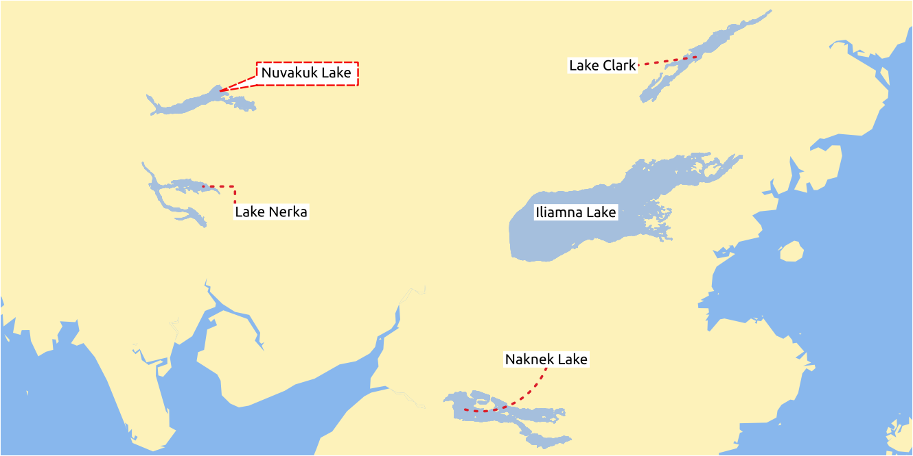
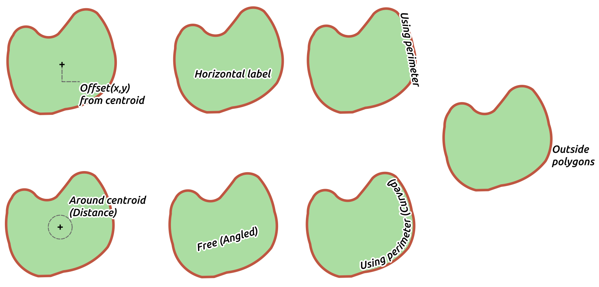

.. _showlabels:

*****************
 Setting a label
*****************

.. only:: html

   .. contents::
      :local:

Labels are textual information you can display on vector features. They add
details you could not necessarily represent using symbols.

The :guilabel:`Style Manager` dialog allows you to create a set of labels or
text formats (ie the appearance of the text, including font, size, colors,
shadow, background...). Each of these items could later be applied to layers in
the |labeling| :guilabel:`Labels` tab of the vector :guilabel:`Layer Properties`
dialog or :guilabel:`Layer Styling` panel or using the |labeling| :sup:`Layer
Labeling Options` button of the **Labels toolbar**. You can also directly
configure them in the abovementioned dialogs.

.. It could be nice to briefly expose the "label settings" tab of the style
 manager, with some sample of label settings in it.

The :guilabel:`Label Settings` dialog allows you to configure smart labeling
for vector layers. Setting a label includes configuring the :ref:`text format
<text_format>`, and how the label relates with the features or other labels
(through :ref:`placement <labels_placement>`, :ref:`rendering <labels_rendering>`
and :ref:`callout <labels_callouts>`).

.. _text_format:

Formatting the label text
=========================

To create text formats, you can:

#. Open the |styleManager| :guilabel:`Style Manager` dialog
#. Activate the :guilabel:`Text format` tab

   .. _figure_textformats:

   .. figure:: img/stylemanager_textformat.png
      :align: center

      Text formats in Style Manager dialog

#. Press the |signPlus| :sup:`Add item` button. The :guilabel:`Text Settings`
   dialog opens with the following properties. As usual, these properties
   are :ref:`data-definable <data_defined>`.

.. _labels_text:

Text tab
--------

.. _figure_textsettings_text:

.. figure:: img/textsettings_text.png
   :align: center

   Text settings - Text tab

In the |text| :guilabel:`Text` tab, you can set:

* the :guilabel:`Font`, from the ones available on your machine
* the :guilabel:`Style`: along with the common styles of the font, you can set
  whether the text should be underlined or striked through
* the :guilabel:`Size` in any :ref:`supported unit <unit_selector>`
* the :guilabel:`Color`
* and the :guilabel:`Opacity`.

At the bottom, a text formats list widget shows a filterable list of text
formats stored within your :ref:`style manager database <vector_style_manager>`.
This allows you to easily set text formats to match styles saved in the local
style database, and also to add a new text format to the style database based on
the current settings. Press the :guilabel:`Save format...` button to store the
current text format in the :guilabel:`Style Manager`, providing a name and tag(s).

Likewise, a label settings list widget is shown when configuring labels, allowing
you to pick from the |styleManager| :sup:`Style Manager` widget or to add new
styles to it.

.. _labels_formatting:

Formatting tab
--------------

.. _figure_textsettings_formatting:

.. figure:: img/textsettings_formatting.png
   :align: center

   Text settings - Formatting tab

In the |labelformatting| :guilabel:`Formatting` tab, you can:

* Use the :guilabel:`Type case` option to change the capitalization style of
  the text. You have the possibility to render the text as :guilabel:`All
  uppercase`, :guilabel:`All lowercase`, :guilabel:`Title case`
  and :guilabel:`Force First Letter to Capital`.
  Note that the last option modifies only the first letter of each word and
  leaves the other letters in the text untouched.
  Choosing :guilabel:`No Change` you don't change the capitalization.
* Under :guilabel:`Spacing`, change the space between words and between
  individual letters.
* |checkbox| :guilabel:`Enable kerning` of the text font
* Set the :guilabel:`Text orientation` which can be :guilabel:`Horizontal`
  or :guilabel:`Vertical`. It can also be :guilabel:`Rotation-based` when
  setting a label.
* Use the :guilabel:`Blend mode` option to determine how your labels will mix
  with the map features below them (more details at :ref:`blend-modes`).
* Configure :guilabel:`Multiple lines` by deciding the :guilabel:`Line Height`.

.. _labels_buffer:

Buffer tab
----------

.. _figure_textsettings_buffer:

.. figure:: img/textsettings_buffer.png
   :align: center

   Text settings - Buffer tab

To create a buffer around the label, activate the |checkbox| :guilabel:`Draw
text buffer` checkbox in the |labelbuffer| :guilabel:`Buffer` tab. Then you can:

* Set the buffer's :guilabel:`Size` in any :ref:`supported unit <unit_selector>`
* Select the buffer's :guilabel:`Color`
* |checkbox| :guilabel:`Color buffer's fill`: The buffer expands from the
  label's outline, so, if the option is activated, the label's interior is
  filled. This may be relevant when using partially transparent labels or with
  non-normal blending modes, which will allow seeing behind the label's text.
  Unchecking the option (while using totally transparent labels) will allow you
  to create outlined text labels.
* Define the buffer's :guilabel:`Opacity`
* Apply a :guilabel:`Pen join style`: it can be :guilabel:`Round`,
  :guilabel:`Miter` or :guilabel:`Bevel`
* Use the :guilabel:`Blend mode` option to determine how your label's buffer
  will mix with the map components below them (more details at
  :ref:`blend-modes`).
* Check |unchecked| :guilabel:`Draw effects` to add advanced |paintEffects|
  :ref:`paint effects <draw_effects>` for improving text readability,
  eg through outer glows and blurs.

.. _labels_background:

Background tab
--------------

The |labelbackground| :guilabel:`Background` tab allows you to configure a
shape that stays below each label. To add a background, activate
the |unchecked| :guilabel:`Draw Background` checkbox and select
the :guilabel:`Shape` type. It can be:

* a regular shape such as :guilabel:`Rectangle`, :guilabel:`Square`,
  :guilabel:`Circle` or :guilabel:`Ellipse`
* an :guilabel:`SVG` symbol from a file, a URL or embedded in the project
  or style database (:ref:`more details <svg_paths>`)
* or a :guilabel:`Marker Symbol` you can create or select from the
  :ref:`symbol library <vector_marker_symbols>`.

.. _figure_textsettings_background:

.. figure:: img/textsettings_background.png
   :align: center

   Text settings - Background tab

Depending on the selected shape, you need to configure some of the following
properties:

* The :guilabel:`Size type` of the frame, which can be:

  * :guilabel:`Fixed`: using the same size for all the labels, regardless the
    size of the text
  * or a :guilabel:`Buffer` over the text's bounding box
* The :guilabel:`Size` of the frame in X and Y directions, using any
  :ref:`supported units <unit_selector>`
* A :guilabel:`Rotation` of the background, between :guilabel:`Sync with label`,
  :guilabel:`Offset of label` and :guilabel:`Fixed`. The last two require
  an angle in degrees.
* An :guilabel:`Offset X,Y` to shift the background item in the X and/or Y directions
* A :guilabel:`Radius X,Y` to round the corners of the background shape (applies
  to rectangle and square shapes only)
* An :guilabel:`Opacity` of the background
* A :guilabel:`Blend mode` to mix the background with the other items in the
  rendering (see :ref:`blend-modes`).
* The :guilabel:`Fill color`, :guilabel:`Stroke color` and
  :guilabel:`Stroke width` for shape types other than the marker symbol.
  Use the :guilabel:`Load symbol parameters` to revert changes on an SVG symbol
  to its default settings.
* A :guilabel:`Pen join style`: it can be :guilabel:`Round`, :guilabel:`Miter`
  or :guilabel:`Bevel` (applies to rectangle and square shapes only)
* |unchecked| :guilabel:`Draw effects` to add advanced |paintEffects|
  :ref:`paint effects <draw_effects>` for improving text readability,
  eg through outer glows and blurs.

.. _labels_shadow:

Shadow tab
----------

.. _figure_textsettings_shadow:

.. figure:: img/textsettings_shadow.png
   :align: center

   Text settings - Shadow tab

To add a shadow to the text, enable the |labelshadow| :guilabel:`Shadow`
tab and activate the |checkbox| :guilabel:`Draw drop shadow`. Then you can:

* Indicate the item used to generate the shadow with :guilabel:`Draw under`.
  It can be the :guilabel:`Lowest label component` or a particular
  component such as the :guilabel:`Text` itself, the :guilabel:`Buffer` or
  the :guilabel:`Background`.
* Set the shadow's :guilabel:`Offset` from the item being shadowded, ie:

  * The angle: clockwise, it depends on the underlying item orientation
  * The distance of offset from the item being shadowded
  * The units of the offset

  If you tick the |checkbox| :guilabel:`Use global shadow` checkbox,
  then the zero point of the angle is always oriented to the north and
  doesn't depend on the orientation of the label's item.

* Influence the appearance of the shadow with the :guilabel:`Blur
  radius`. The higher the number, the softer the shadows, in the units of
  your choice.

.. comment FIXME: at the moment there is an error in this setting

   |checkbox| :guilabel:`Blur only alpha pixels`:
   It is supposed to show only those
   pixels that have a partial alpha component beyond the base opaque pixels of
   the component being blurred. For example, if you set the shadow of some
   text to be gray and turn on that option, it should still show a duplication
   of the text, colored as per the shadow color option, but with any blurred
   shadow that extends beyond its text. With the option off, in this example,
   it will blur all pixels of the duplicated text.
   This is useful for creating a shadow that increases legibility at smaller
   output sizes, e.g. like duplicating text and offsetting it a bit in
   illustration programs, while still showing a bit of shadow at larger sizes.
   Apparently, there is an error with re-painting the opaque pixels back over
   top of the shadow (depending upon the shadow's color), when that setting is
   used.

* Define the shadow's :guilabel:`Opacity`
* Rescale the shadow's size using the :guilabel:`Scale`
  factor
* Choose the shadow's :guilabel:`Color`
* Use the :guilabel:`Blend mode` option to determine how your label's shadow
  will mix with the map components below them (more details at
  :ref:`blend-modes`).

.. _labels_callouts:

Callouts tab
============

A common practice when placing labels on a crowded map is to use **callouts** -
labels which are placed outside (or displaced from) their associated feature
are identified with a dynamic line connecting the label and the feature.
If one of the two endings (either the label or the feature) is moved,
the shape of the connector is recomputed.

.. _figure_label_callouts:

   Labels with various callouts settings

To add a callout to a label, choose |label| :guilabel:`Label Settings`
and click the |signPlus| :guilabel:`Add item` button. Then enable the
|labelcallout| :guilabel:`Callouts` tab and activate the
|checkbox| :guilabel:`Draw callouts`. Then you can:

#. Select the :guilabel:`Style` of connector, one of:

   * :guilabel:`Simple lines`: a straight line, the shortest path
   * :guilabel:`Manhattan style`: a 90° broken line

#. Select the :guilabel:`Line style` with full capabilities of a :ref:`line
   symbol <vector_line_symbols>` including layer effects, and data-defined
   settings
#. Set the :guilabel:`Minimum length` of callout lines
#. Set the :guilabel:`Offset from feature` option: controls the distance
   from the feature (or its anchor point if a polygon) where callout lines end.
   Eg, this avoids drawing lines right up against the edges of the features.
#. Set the :guilabel:`Offset from label area` option: controls the distance
   from the label anchor point (where the callout line ends).
   This avoids drawing lines right up against the text.
#. |checkbox| :guilabel:`Draw lines to all feature parts` from the feature's
   label
#. Set the :guilabel:`Anchor point` for the (polygon) feature (the end
   point of the connector line). Available options:

   * :guilabel:`Pole of inaccessibility`
   * :guilabel:`Point on exterior`
   * :guilabel:`Point on surface`
   * :guilabel:`Centroid`
#. Set the :guilabel:`Label anchor point`: controls where the connector
   line should join to the label text. Available options:

   * :guilabel:`Closest point`
   * :guilabel:`Centroid`
   * Fixed position at the edge (:guilabel:`Top left`, :guilabel:`Top center`,
     :guilabel:`Top right`, :guilabel:`Left middle`, :guilabel:`Right middle`,
     :guilabel:`Bottom left`, :guilabel:`Bottom center` and :guilabel:`Bottom right`).

.. _labels_placement:

Placement tab
=============

Choose the |labelplacement| :guilabel:`Placement` tab from the label settings
list widged for configuring label placement and labeling priority. Note that
the placement options differ according to the type of vector layer, namely point,
line or polygon, and are affected by the global :ref:`PAL setting <automated_placement>`.

.. _cartographic:

Placement for point layers
--------------------------

Point labels placement modes available are:

.. _cartographic:

* :guilabel:`Cartographic`: point labels are generated with a
  better visual relationship with the point feature, following ideal
  cartographic placement rules. Labels can be placed at a set
  :guilabel:`Distance` in :ref:`supported units <unit_selector>`, either
  from the point feature itself or from the bounds of the symbol used
  to represent the feature (set in :guilabel:`Distance offset from`). 
  The latter option is especially useful when the symbol size isn't fixed,
  e.g. if it's set by a data defined size or when using different symbols
  in a :ref:`categorized <categorized_renderer>` renderer.

  By default, cartographic mode placements are prioritised in the following
  order (respecting the `guidelines from Krygier and Wood (2011) 
  <https://www.researchgate.net/publication/44463780_Making_maps_a_visual_guide_to_map_design_for_GIS_John_Krygier_Denis_Wood>`_
  and other cartographic textbooks):

  #. top right
  #. top left
  #. bottom right
  #. bottom left
  #. middle right
  #. middle left
  #. top, slightly right
  #. bottom, slightly left.

  The placement mode can, however, be customized or set for an
  individual feature using a data defined list of prioritised positions.
  This also allows only certain placements to be used, so e.g.
  for coastal features you can prevent labels being placed over the land.

* :guilabel:`Around point`: labels are placed in an
  equal radius (set in :guilabel:`Distance`) circle around the feature. The
  default placement priority follows a clockwise circle from top and can be
  constrained using the data-defined :guilabel:`Quadrant` option.

* :guilabel:`Offset from point`: labels are placed at an :guilabel:`Offset X,Y`
  distance from the point feature, in various units. You can select a
  data-defined :guilabel:`Quadrant` in which to place your label and assign
  a :guilabel:`Rotation` to them.

.. _labels_line_placement:

Placement for line layers
-------------------------

Label placment modes for line layers include
* :guilabel:`Parallel`: draws a line parallel
* :guilabel:`Curved`: draws a curved label, following the line feature geometry
* :guilabel:`Horizontal`: draws a horizontal label.

.. _figure_labels_placement_line:

.. figure:: img/line_label_placement.png
   :align: center

   Label placement examples in lines

For the :guilabel:`Parallel` and :guilabel:`Curved` modes,
you can set the position to |checkbox|:guilabel:`Above line`,
|checkbox| :guilabel:`On line` and |checkbox|:guilabel:`Below line`.
It's possible to select several options at once. In
that case, QGIS will look for the optimal label position. For Parallel and
curved placement mode, you can also use the line orientation for the
position of the label. Additionally, you can define a :guilabel:`Maximum
angle between curved characters` when selecting the :guilabel:`Curved` mode
(see Figure_labels_placement_line).
The :guilabel:`Label overrun` allows to specify the maximal allowable distance
a label may run past the end (or start) of line features. Convenient when the
lines are too short but you still want to display their label. It supports
data-defined distances, in various units.
The :guilabel:`Label Anchoring` allows you to control the placement
of labels along line features. Click on :guilabel:`Settings ...` and
choose the position along the line which labels will be placed close to.
You can select |LabelAnchorCenter| :guilabel:`Center of Line`, 
|labelAnchorStart| :guilabel:`Start of Line`, |labelAnchorEnd| :guilabel:`End of Line`
or |labelAnchorCustom| :guilabel:`Custom ...`.
There are two :guilabel:`Placement Behaviours`: if you choose 
:guilabel:`Preferred Placement Hint` the label anchor is only treated as
hint for the preferred label placement. By choosing :guilabel:`Strict`
labels are placed exactly on the label anchor.
For all placement modes, in :guilabel:`Repeating Labels`, you can set up
a data-defined minimum distance for repeating labels, in any supported unit.

Placement for polygon layers
----------------------------

You can choose one of the following options for placing labels in polygons
(see figure_labels_placement_polygon_):

* :guilabel:`Offset from centroid`: labels are placed at a fixed :guilabel:`Offset X,Y`
  distance of the centroid. The reference centroid can be determined based on the
  part of the polygon rendered in the map canvas (:guilabel:`visible polygon`)
  or the :guilabel:`whole polygon`, no matter if you can see it. You can also:

  * force the label anchor point to lay inside their polygon
  * place the label within a specific quadrant
  * assign a rotation
  * :guilabel:`Allow placing labels outside of polygons` when it is not possible
    to place them inside the polygon. Thanks to data-defined properties, this makes
    possible to either allow outside labels, prevent outside labels, or force outside
    labels on a feature-by-feature basis.

* :guilabel:`Horizontal`: places at the best position a horizontal 
  label inside the polygon. Again, it's possible to :guilabel:`Allow placing
  labels outside of polygons`.
* :guilabel:`Around centroid`: places the label at a specified distance
  around the centroid. Again, you can define whether the centroid is the one
  of the :guilabel:`visible polygon` or the :guilabel:`whole polygon`.
* :guilabel:`Free (angled)`: places at the best position a rotated label
  inside the polygon.
* :guilabel:`Using perimeter`: draws the label next to the polygon boundary
  The label will behave like the :ref:`parallel option for lines <labels_line_placement>`.
  You can define a position and a distance for the label. For the position,
  :guilabel:`Above line`, :guilabel:`On line`, :guilabel:`Below line` and
  :guilabel:`Line orientation dependent position` are possible. You can
  specify the distance between the label and the polygon outline, as well as
  the repeat interval for the label.
* :guilabel:`Using perimeter (Curved)`: draws the label along
  the polygon boundary, using a curved labeling. In addition to the parameters
  available with :guilabel:`Using perimeter` setting, you can set the
  :guilabel:`Maximum angle between curved characters polygon`, either inside
  or outside.
* :guilabel:`Outside polygons`: always places polygon labels
  for the layer outside the features, at a set :guilabel:`Distance`.

.. _figure_labels_placement_polygon:

   Label placement examples in polygons

Common placement settings
-------------------------

Some label placement settings are available for all layer geometry types:

Data Defined
............

The :guilabel:`Data Defined` group provides direct control on labels
placement, on a feature-by-feature basis. It relies on their attributes
or an expression to set:

* the :guilabel:`X` and :guilabel:`Y` coordinate
* the text alignment over the custom position set above:

  * :guilabel:`Horizontal`: it can be **Left**, **Center** or **Right**
  * the text :guilabel:`Vertical`: it can be **Bottom**, **Base**, **Half**,
    **Cap** or **Top**
* the text :guilabel:`Rotation`. Check the :guilabel:`Preserve data rotation
  values` entry if you want to keep the rotation value in the associated field
  and apply it to the label, whether the label is pinned or not. If unchecked,
  unpinning the label rotation is reset and its value cleared from the attribute
  table.
  
  .. note:: Data-defined rotation with polygon features is currently supported
   only with the :guilabel:`Around centroid` placement mode.

.. note:: Expressions can not be used in combination with the labels map tools
   (ie the :guilabel:`Rotate label` and :guilabel:`Move label` tools)
   to :ref:`data-define <data_defined>` labels placement.
   The widget will be reset to the corresponding :ref:`auxiliary storage field
   <vector_auxiliary_storage>`.

.. _`labels_priority`:

Priority
........

In the :guilabel:`Priority` section you can define the placement priority rank
of each label, ie if there are different diagrams or labels candidates for the
same location, the item with the higher priority will be displayed and the
others could be left out.

The priority rank is also used to evaluate whether a label could be omitted
due to a greater weighted :ref:`obstacle feature <labels_obstacles>`.

.. _`labels_obstacles`:

Obstacles
.........

In some contexts (eg, high density labels, overlapping features...), the
labels placement can result in labels being placed over unrelated features.

An obstacle is a feature over which QGIS avoids placing other features' labels
or diagrams. This can be controlled from the :guilabel:`Obstacles` section:

#. Activate the |checkbox| :guilabel:`Features act as obstacles`
   option to decide that features of the layer should act as obstacles for
   any label and diagram (including items from other features in the same layer).

   Instead of the whole layer, you can select a subset of features to use as
   obstacles, using the |dataDefined| :sup:`data-defined override` control next
   to the option.

#. Use the :guilabel:`Settings` button to tweak the obstacle's weighting.

   * For every potential obstacle feature you can assign an :guilabel:`Obstacle
     weight`: any :ref:`label <labels_priority>` or :ref:`diagram <diagram_placement>`
     whose placement priority rank is greater than this value can be placed
     over. Labels or diagrams with lower rank will be omitted if no other
     placement is possible.

     This weighting can also be data-defined, so that within the same layer,
     certain features are more likely to be covered than others.
   * For polygon layers, you can choose the kind of obstacle the feature is:

     * **Over the Feature's Interior**: avoids placing labels over the interior
       of the polygon (prefers placing labels totally outside or just slightly
       inside the polygon)
     * or **Over the Feature's Boundary**: avoids placing labels over the
       boundary of the polygon (prefers placing labels outside or completely
       inside the polygon). This can be useful for layers where the features
       cover the whole area (administrative units, categorical coverages, ...).
       In this case, it is impossible to avoid
       placing labels within these features, and it looks much better when
       placing them over the boundaries between features is avoided.

.. _labels_rendering:

Rendering tab
=============

In the |render| :guilabel:`Rendering` tab, you can tune when the labels can
be rendered and their interaction with other labels and features.

Label options
-------------

Under :guilabel:`Label options`:

* You find the :ref:`scale-based <label_scaledepend>`
  and the :guilabel:`Pixel size-based` visibility settings.

* The :guilabel:`Label z-index` determines the order in which labels are rendered,
  as well in relation with other feature labels in the layer (using data-defined
  override expression), as with labels from other layers. Labels with a higher
  z-index are rendered on top of labels (from any layer) with lower z-index.

  Additionally, the logic has been tweaked so that if two labels have
  matching z-indexes, then:

  * if they are from the same layer, the smaller label will be drawn above the
    larger label
  * if they are from different layers, the labels will be drawn in the same order
    as their layers themselves (ie respecting the order set in the map legend).

  .. note:: This setting doesn't make labels to be drawn below the
     features from other layers, it just controls the order in which
     labels are drawn on top of all the layers' features.

* While rendering labels and in order to display readable labels,
  QGIS automatically evaluates the position of the labels and can hide some of them
  in case of collision. You can however choose to |checkbox| :guilabel:`Show all
  labels for this layer (including colliding labels)` in order to manually fix
  their placement (see :ref:`label_toolbar`).
* With data-defined expressions in :guilabel:`Show label` and :guilabel:`Always Show`
  you can fine tune which labels should be rendered.
* Allow to :guilabel:`Show upside-down labels`: alternatives are **Never**,
  **when rotation defined** or **always**.

Feature options
---------------

Under :guilabel:`Feature options`:

* You can choose to :guilabel:`Label every part of a multi-part features`
  and :guilabel:`Limit number of features to be labeled to`.
* Both line and polygon layers offer the option to set a minimum size for
  the features to be labeled, using :guilabel:`Suppress labeling of features
  smaller than`.
* For polygon features, you can also filter the labels to show according to
  whether they completely fit within their feature or not.
* For line features, you can choose to :guilabel:`Merge connected lines
  to avoid duplicate labels`, rendering a quite airy map in conjunction with
  the :guilabel:`Distance` or :guilabel:`Repeat` options in the :ref:`Placement
  <labels_line_placement>` tab.

.. Substitutions definitions - AVOID EDITING PAST THIS LINE
   This will be automatically updated by the find_set_subst.py script.
   If you need to create a new substitution manually,
   please add it also to the substitutions.txt file in the
   source folder.

.. |checkbox| image:: /static/common/checkbox.png
   :width: 1.3em
.. |dataDefined| image:: /static/common/mIconDataDefine.png
   :width: 1.5em
.. |labelAnchorCenter| image:: /static/commmon/mActionLabelAnchorCenter.png
   :width: 1.5em
.. |labelAnchorCustom| image:: /static/commmon/mActionLabelAnchorCustom.png
   :width: 1.5em
.. |labelAnchorEnd| image:: /static/commmon/mActionLabelAnchorEnd.png
   :width: 1.5em
.. |labelAnchorStart| image::/static/common/mActionLabelAnchorStart.png
   :width: 1.5em
.. |labelbackground| image:: /static/common/labelbackground.png
   :width: 1.5em
.. |labelbuffer| image:: /static/common/labelbuffer.png
   :width: 1.5em
.. |labelcallout| image:: /static/common/labelcallout.png
   :width: 1.5em
.. |labelformatting| image:: /static/common/labelformatting.png
   :width: 1.5em
.. |labeling| image:: /static/common/labelingSingle.png
   :width: 1.5em
.. |labelmask| image:: /static/common/labelmask.png
   :width: 1.5em
.. |labelplacement| image:: /static/common/labelplacement.png
   :width: 1.5em
.. |labelshadow| image:: /static/common/labelshadow.png
   :width: 1.5em
.. |paintEffects| image:: /static/common/mIconPaintEffects.png
   :width: 1.5em
.. |radioButtonOff| image:: /static/common/radiobuttonoff.png
   :width: 1.5em
.. |radioButtonOn| image:: /static/common/radiobuttonon.png
   :width: 1.5em
.. |render| image:: /static/common/render.png
   :width: 1.5em
.. |signPlus| image:: /static/common/symbologyAdd.png
   :width: 1.5em
.. |styleManager| image:: /static/common/mActionStyleManager.png
   :width: 1.5em
.. |text| image:: /static/common/text.png
   :width: 1.5em
.. |unchecked| image:: /static/common/checkbox_unchecked.png
   :width: 1.3em
