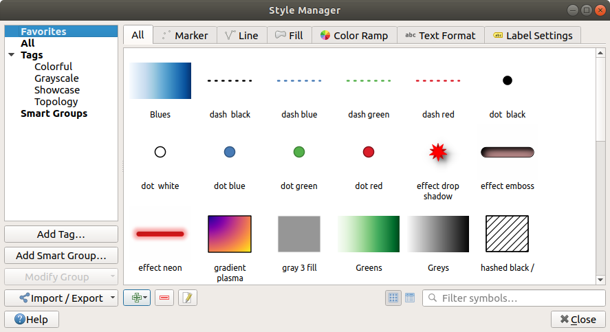
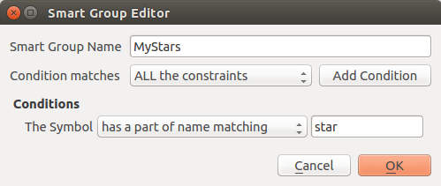
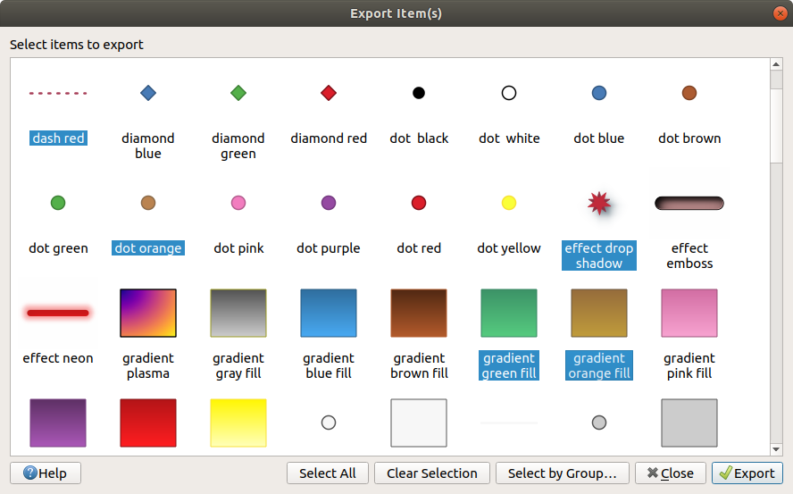
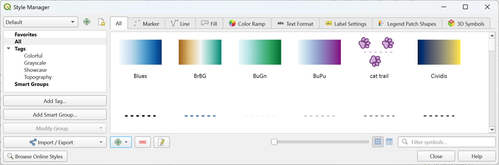
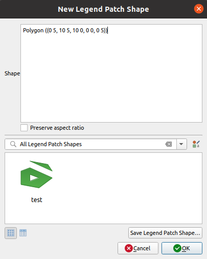
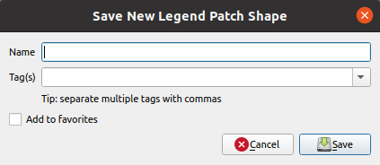

.. index::
    single: Style manager

.. _vector_style_manager:

*******************
 The Style Manager
*******************

.. only:: html

   .. contents::
      :local:

The Style Manager dialog
========================

The :guilabel:`Style Manager` is the place where you can manage and create
generic style items. These are symbols, color ramps, text formats or label
settings that can be used to symbolize features, layers or print layouts.
They are stored in the :file:`symbology-style.db` database under the active
:ref:`user profile <user_profiles>` and shared with all the project files
opened with that profile.
Style items can also be shared with others thanks to the export/import
capabilities of the :guilabel:`Style Manager` dialog.

You can open that modeless dialog either:

* from the :menuselection:`Settings -->` |styleManager| :menuselection:`Style
  Manager...` menu
* with the |styleManager| :sup:`Style Manager` button from the Project toolbar
* or with the |styleManager| :sup:`Style Manager` button from a vector
  :menuselection:`Layer Properties -->` menu (while :ref:`configuring
  a symbol <symbol-selector>` or :ref:`formatting a text <showlabels>`).

.. _figure_style_manager:

   The Style Manager

.. index:: Style items
.. _group_symbols:

Organizing style items
----------------------

In the upper left corner of the :guilabel:`Style Manager` dialog, within
the drop-down menu, you can choose the style database you want to connect to.
If you choose :guilabel:`Default` you will be connected to the default style database
where you can find all available default style items and the ones that you saved in this database.
Choosing :guilabel:`Project Styles` will connect you to the Project Style database
where you can find only symbols that you saved in this database.
If you created more style databases, they will be listed in the drop-down menu.
There are also options to |symbologyAdd| :sup:`Add existing style database to project`
and |newPage| :sup:`Create new style database` (see more :ref:`Style database <style_database>`).

For each style database, you can organize the elements into different categories,
listed in the panel on the left:

* **Favorites**: displayed by default when configuring an item, it shows an
  extensible set of items;
* **All**: lists all the available items for the active type;
* **Tags**: shows a list of labels you can use to identify the items.
  An item can be tagged more than once. Select a tag in the list and the tabs
  are updated to show only their items that belong to it.
  To create a new tag you could later attach to a set of items, use the
  :guilabel:`Add Tag...` button or select the |symbologyAdd| :guilabel:`Add Tag...`
  from any tag contextual menu;
* **Smart Group**: a smart group dynamically fetches its symbols according to
  conditions set (see eg, :numref:`figure_smart_group`). Click the :guilabel:`Add Smart Group...`
  button to create smart groups. The dialog box allows you to enter an expression
  to filter the items to select (has a particular tag, have a string in its name,
  etc.). Any symbol, color ramp, text format or label setting that satisfies
  the entered condition(s) is automatically added to the smart group.

.. _figure_smart_group:

   Creating a Smart Group

Tags and smart groups are not mutually exclusive: they are simply two different
ways to organize your style elements. 
Unlike the smart groups that automatically fetch their belonged items based on
the input constraints, tags are filled by the user. To edit any of those
categories, you can either:

* select the items, right-click and choose :menuselection:`Add to Tag -->`
  and then select the tag name or create a new tag;
* select the tag and press :menuselection:`Modify group... --> Attach Selected Tag
  to Symbols`. A checkbox appears next to each item to help you select
  or deselect it. When selection is finished, press :menuselection:`Modify
  group... --> Finish Tagging`.
* select the smart group, press :menuselection:`Modify group... --> Edit smart
  group...` and configure a new set of constraints in the :guilabel:`Smart Group
  Editor` dialog.
  This option is also available in the contextual menu of the smart group.

To remove a tag or a smart group, right-click on it and select the |symbologyRemove|
:guilabel:`Remove` button. Note that this does not delete the items grouped in the
category.

The :guilabel:`Style Manager` dialog displays in its center a frame with
previewed items organized into tabs:

* :guilabel:`All` for a complete collection of point, linear and surface symbols
  and label settings as well as predefined color ramps and text formats;
* |pointLayer| :guilabel:`Marker` for point symbols only;
* |lineLayer| :guilabel:`Line` for linear symbols only;
* |polygonLayer| :guilabel:`Fill` for surface symbols only;
* |color| :guilabel:`Color ramp`;
* |text| :guilabel:`Text format` to manage :ref:`text formats <text_format>`,
  which store the font, color, buffers, shadows, and backgrounds of texts
  (i.e. all the formatting parts of the label settings, which for instance can
  be used in layouts);
* |labelingSingle| :guilabel:`Label settings` to manage :ref:`label settings
  <showlabels>`, which include the text formats and some layer-type specific
  settings such as label placement, priority, callouts, rendering...
* |legend| :guilabel:`Legend Patch Shapes` to manage custom legend patch
  shapes, which include :guilabel:`Marker`, :guilabel:`Line` and
  :guilabel:`Fill` geometries.
* |3d| :guilabel:`3D Symbols` to configure symbols with :ref:`3D properties
  <3dsymbols>` (extrusion, shading, altitude, ...) for the features to render
  in a :ref:`3D Map view <label_3dmapview>`

You can arrange the Styles in |iconView| :guilabel:`Icon View` or in
|openTable| :guilabel:`List View` on the bottom right side. In both views
the tooltip shows a larger instance of the style.
The thumbnail size slider at the left of the icons helps you adjust the actual
thumbnail sizes in the dialog, for a better preview of the symbols!

Adding, editing or removing an item
-----------------------------------

As seen earlier, style elements are listed under different tabs whose
contents depend on the active category (tag, smart group, favorites...).
When a tab is enabled, you can:

* Add new items: press the |symbologyAdd| :sup:`Add item` button and configure the
  item following :ref:`symbols <symbol-selector>`, :ref:`color ramps
  <color-ramp>` or :ref:`text format and label <showlabels>` builder description.
* Modify an existing item: select an item and press |symbologyEdit| :sup:`Edit
  item` button and configure as mentioned above. 
* Delete existing items: to delete an element you no longer need, select it and
  click |symbologyRemove| :sup:`Remove item` (also available through right-click).
  The item will be deleted from the local database.

Note that the :guilabel:`All` tab provides access to these options for every type
of item.

Right-clicking over a selection of items also allows you to:

* :guilabel:`Add to Favorites`;
* :guilabel:`Remove from Favorites`;
* :menuselection:`Add to Tag -->` and select the appropriate tag or create a new
  one to use; the currently assigned tags are checked;
* :guilabel:`Clear Tags`: detaching the symbols from any tag;
* :guilabel:`Remove Item(s)`;
* :guilabel:`Edit Item`: applies to the item you right-click over;
* :guilabel:`Copy Item`;
* :guilabel:`Paste Item ...`: pasting to one of the categories of the style manager
  or elsewhere in QGIS (symbol or color buttons) 
* :guilabel:`Export Selected Symbol(s) as PNG...` (only available with symbols);
* :guilabel:`Export Selected Symbol(s) as SVG...` (only available with symbols);

.. _share_symbols:

Sharing style items
-------------------

The |sharing| :guilabel:`Import/Export` tool, at the left bottom of the Style
Manager dialog, offers options to easily share symbols, color ramps, text
formats and label settings with
others. These options are also available through right-click over the items.

Exporting items
...............

You can export a set of items to an :file:`.XML` file:

#. Expand the |sharing| :guilabel:`Import/Export` drop-down menu and select
   |fileSave| :guilabel:`Export Item(s)...`
#. Choose the items you'd like to integrate. Selection
   can be done with the mouse or using a tag or a group previously set.
#. Press :guilabel:`Export` when ready. You'll be prompted to indicate the
   destination of the saved file. The XML format generates a single file
   containing all the selected items. This file can then be imported in
   another user's style library.

.. _figure_symbol_export:

   Exporting style items

When symbols are selected, you can also export them to :file:`.PNG` or
:file:`.SVG`. Exporting to :file:`.PNG` or :file:`.SVG` (both not available for
other style item types)
creates a file for each selected symbol in a given folder. The SVG folder can be
added to the :guilabel:`SVG paths` in :menuselection:`Settings --> Options -->
System` menu of another user, allowing him direct access to all these symbols.

.. _import_style_items:

Importing items
...............

You can extend your style library by importing new items:

#. Expand the |sharing| :guilabel:`Import/Export` drop-down menu and select
   |fileOpen| :guilabel:`Import Item(s)` at the left bottom of the dialog.
#. In the new dialog, indicate the source of the style items (it can be an
   :file:`.xml` file on the disk or a url).
#. Set whether to |unchecked| :guilabel:`Add to favorites` the items to import.
#. Check |unchecked| :guilabel:`Do not import embedded tags` to avoid the import
   of tags associated to the items being imported.
#. Give the name of any :guilabel:`Additional tag(s)` to apply to the new items.
#. Select from the preview the symbols you want to add to your library.
#. And press :guilabel:`Import`.

.. _figure_symbol_import:

.. figure:: img/import_styles.png
   :align: center

   Importing style items

.. index::
   pair: Browser; Style items

Using the Browser panel
.......................

It's also possible to import style items into the active user profile style
database directly from the :guilabel:`Browser` panel:
   
#. Select the style :file:`.xml` file in the browser
#. Drag-and-drop it over the map canvas or right-click and select
   :guilabel:`Import Style...`
#. Fill the :guilabel:`Import Items` dialog following :ref:`import_style_items`
#. Press :guilabel:`Import` and the selected style items are added to the
   style database

Double-clicking the style file in the browser opens the :guilabel:`Style
Manager` dialog showing the items in the file. You can select them and press
:guilabel:`Copy to Default Style...` to import them into the active style
database. Tags can be assigned to items. Also available through right-click,
:guilabel:`Open Style...` command.

.. _figure_symbol_open:

   Opening a style items file

The dialog also allows to export single symbols as :file:`.PNG` or :file:`.SVG`
files.

Using the online repository
...........................

The QGIS project maintains a repository with a collection of styles shared by
QGIS users. This is available at https://plugins.qgis.org/styles and can be
accessed from the :guilabel:`Style Manager` dialog, pressing the |search|
:guilabel:`Browse Online Styles` button at the bottom.

From that repository, you can:

#. Browse and search for any style items, based on their type or name
#. Download the style file and unzip it
#. Load the :file:`.xml` based file into your style database in QGIS,
   using any of the aforementioned import methods.

.. _color-ramp:

Setting a Color Ramp
====================

.. index:: Colors
   single: Colors; Color ramp
   single: Colors; Gradient color ramp
   single: Colors; Color brewer
   single: Colors; Custom color ramp

The Color ramp tab in the :guilabel:`Style Manager` dialog helps you preview
different color ramps based on the category selected in the left panel.

To create a custom color ramp, activate the Color ramp tab and click the
|symbologyAdd| :sup:`Add item` button. The button reveals a drop-down list to
choose the ramp type:

* :guilabel:`Gradient`: given a start and end colors, generates a color ramp
  which can be **continuous** or **discrete**.
  With double-clicking the ramp preview, you can add as many intermediate color stops as you want.
  Click on the color stop indicator and under :guilabel:`Gradient stop` you can:

  * adjust its :guilabel:`Relative position` from the color ramp start.
    Also possible dragging the indicator with the mouse, or pressing the arrow keys
    (combine with :kbd:`Shift` key for a larger move)
  * specify the color model to use when interpolating between colors:
    it can be :guilabel:`RGB`, :guilabel:`HSL` or :guilabel:`HSV`.
    In some circumstances, this option can help avoid desaturated mid tones,
    resulting in more visually pleasing gradients.
  * set the direction which the interpolation should follow for the **Hue** component
    of a :guilabel:`HSL` or :guilabel:`HSV` color specification.
    It can be :guilabel:`Clockwise` or :guilabel:`Counterclockwise`.
  * set the :ref:`color properties <color-selector>`
  * remove the color stop pressing :guilabel:`Delete stop` or :kbd:`DEL`

  The :guilabel:`Plots` group provides another graphical way to design the color ramp,
  changing the position or the opacity and HSL components of the color stops.

  .. _figure_color_custom_ramp:

  .. figure:: img/customColorRampGradient.png
     :align: center

     Example of custom gradient color ramp with multiple stops

  .. hint:: Drag-and-drop a color from a color spot onto the gradient ramp preview
    adds a new color stop.

* :guilabel:`Color presets`: allows to create a color ramp consisting of a list of
  colors selected by the user;
* :guilabel:`Random`: creates a random set of colors based on range of values for
  :guilabel:`Hue`, :guilabel:`Saturation`, :guilabel:`Value` and :guilabel:`Opacity`
  and a number of colors (:guilabel:`Classes`);
* :guilabel:`Catalog: ColorBrewer`: a set of predefined discrete color gradients
  you can customize the number of colors in the ramp;
* or :guilabel:`Catalog: cpt-city`: an access to a whole catalog of color gradients to
  locally :guilabel:`save as standard gradient`. The cpt-city option opens a new
  dialog with hundreds of themes included 'out of the box'.

.. _figure_color_cpt_city:

.. figure:: img/cpt-cityColorRamps.png
   :align: center

   cpt-city dialog with hundreds of color ramps

.. _legend_patch:

Creating a Legend Patch Shape
=============================

To create a new Legend Patch Shape, activate the :guilabel:`Legend Patch Shapes` tab and
click the |symbologyAdd| :sup:`Add item` button. The button reveals a drop-down
list to choose the geometry type:

* :guilabel:`Marker Legend Patch Shape...`: to use with point geometries.
* :guilabel:`Line Legend Patch Shape...`: to use with line geometries.
* :guilabel:`Fill Legend Patch Shape...`: to use with polygon geometries.

All three options will show the same dialog.

.. _figure_legend_patch:

   Create a new Legend Patch Shape

Only the shape type and displayed legend patch shapes will differ regarding
to the chosen geometry type. The following options will be available:

* :guilabel:`Shape`: define the shape of the legend patch shape as a
  WKT string. Single and multipart geometries may be used, but no
  GeometryCollection.
* |checkbox| :guilabel:`Preserve aspect ratio`
* |iconView| :guilabel:`Icon View` or |openTable| :guilabel:`List View` of
  available legend patch shapes, filtered by tags.

When the new Shape is defined you can :guilabel:`Save Legend Patch Shape...`
or press :guilabel:`OK`, which will both lead to the same dialog.

.. _figure_safe_legend_patch:

   Save a new Legend Patch Shape

Here you have to choose a name, tags to describe the shape and if it should
be added to favorites.

If you press :guilabel:`Save...`, the shape is added to the list and you are directed
back to the :guilabel:`New Legend Patch Shape` dialog to keep creating new shapes.

.. Substitutions definitions - AVOID EDITING PAST THIS LINE
   This will be automatically updated by the find_set_subst.py script.
   If you need to create a new substitution manually,
   please add it also to the substitutions.txt file in the
   source folder.

.. |3d| image:: /static/common/3d.png
   :width: 1.5em
.. |checkbox| image:: /static/common/checkbox.png
   :width: 1.3em
.. |color| image:: /static/common/color.png
.. |fileOpen| image:: /static/common/mActionFileOpen.png
   :width: 1.5em
.. |fileSave| image:: /static/common/mActionFileSave.png
   :width: 1.5em
.. |iconView| image:: /static/common/mActionIconView.png
   :width: 1.5em
.. |labelingSingle| image:: /static/common/labelingSingle.png
   :width: 1.5em
.. |legend| image:: /static/common/legend.png
   :width: 1.2em
.. |lineLayer| image:: /static/common/mIconLineLayer.png
   :width: 1.5em
.. |newPage| image:: /static/common/mActionNewPage.png
   :width: 1.5em
.. |openTable| image:: /static/common/mActionOpenTable.png
   :width: 1.5em
.. |pointLayer| image:: /static/common/mIconPointLayer.png
   :width: 1.5em
.. |polygonLayer| image:: /static/common/mIconPolygonLayer.png
   :width: 1.5em
.. |search| image:: /static/common/search.png
   :width: 1.5em
.. |sharing| image:: /static/common/mActionSharing.png
   :width: 1.5em
.. |styleManager| image:: /static/common/mActionStyleManager.png
   :width: 1.5em
.. |symbologyAdd| image:: /static/common/symbologyAdd.png
   :width: 1.5em
.. |symbologyEdit| image:: /static/common/symbologyEdit.png
   :width: 1.5em
.. |symbologyRemove| image:: /static/common/symbologyRemove.png
   :width: 1.5em
.. |text| image:: /static/common/text.png
   :width: 1.5em
.. |unchecked| image:: /static/common/unchecked.png
   :width: 1.3em
