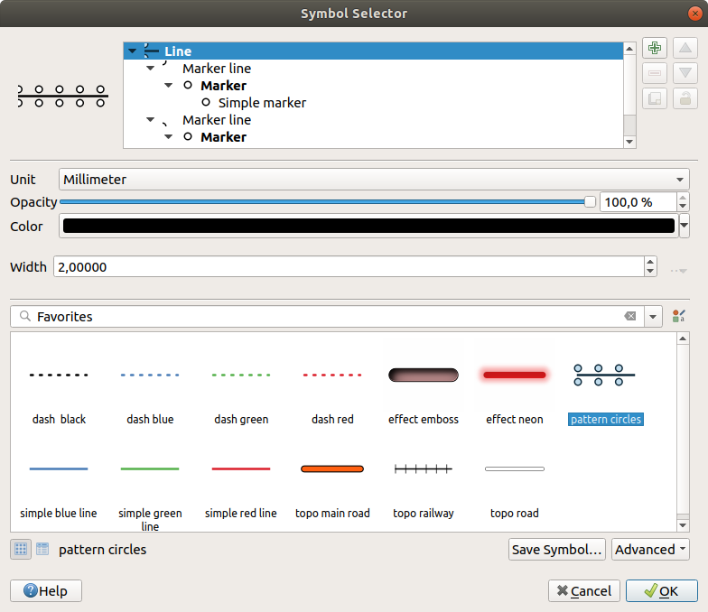
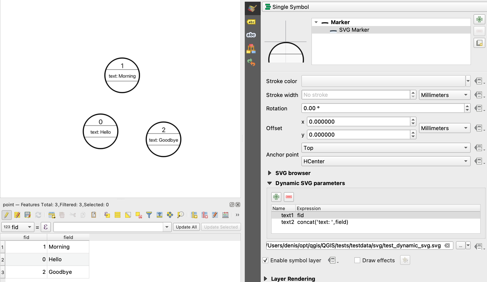

.. _symbol-selector:

********************
The Symbol Selector
********************

.. only:: html

   .. contents::
      :local:

The Symbol selector is the main dialog to design a symbol.
You can create or edit Marker, Line or Fill Symbols.

.. _figure_symbol_selector:

   Designing a Line symbol

Two main components structure the symbol selector dialog:

* the symbol tree, showing symbol layers that are combined afterwards to shape a
  new global symbol
* and settings to configure the selected symbol layer in the tree.

.. _symbol_tree:

The symbol layer tree
=====================

A symbol can consist of several :guilabel:`Symbol layers`. The symbol tree shows
the overlay of these symbol layers that are combined afterwards to shape a
new global symbol. Besides, a dynamic symbol representation is updated as soon as
symbol properties change.

Depending on the level selected in the symbol tree items, various tools are
made available to help you manage the tree:

* |symbologyAdd| add new symbol layer: you can stack as many symbols as you want
* |symbologyRemove| remove the selected symbol layer
* lock colors of symbol layer: a |locked| locked color stays unchanged when
  user changes the color at the global (or upper) symbol level
* |duplicateLayer| duplicate a (group of) symbol layer(s)
* move up or down the symbol layer

.. _edit_symbol:

Configuring a symbol
====================

In QGIS, configuring a symbol is done in two steps: the symbol and then the
symbol layer.

The symbol
----------

At the top level of the tree, it depends on the layer geometry and can be of
**Marker**, **Line** or **Fill** type. Each symbol can embed one or
more symbols (including, of any other type) or symbol layers.

You can setup some parameters that apply to the global symbol:

* :guilabel:`Unit`: it can be **Millimeters**, **Points**, **Pixels**,
  **Meters at Scale**, **Map units** or **Inches** (see :ref:`unit_selector`
  for more details)
* :guilabel:`Opacity`
* :guilabel:`Color`: when this parameter is changed by the user, its value is
  echoed to all unlocked sub-symbols color
* :guilabel:`Size` and :guilabel:`Rotation` for marker symbols
* :guilabel:`Width` for line symbols

  .. tip::

    Use the :guilabel:`Size` (for marker symbols) or the :guilabel:`Width` (for
    line symbols) properties at the symbol level to proportionally resize all
    of its embedded :ref:`symbol layers <symbol_layer>` dimensions.

  .. note::

    The :ref:`Data-defined override <data_defined>` button next to the width, size
    or rotation parameters is inactive when setting the symbol from the Style manager
    dialog. When the symbol is connected to a map layer, this button helps you create
    :ref:`proportional or multivariate analysis <proportional_symbols>` rendering.

* A preview of the :ref:`symbols library <vector_style_manager>`: Symbols of the
  same type are shown and, through the editable drop-down list just above, can be
  filtered by free-form text or by :ref:`categories <group_symbols>`.
  You can also update the list of symbols using the
  |styleManager| :sup:`Style Manager` button and open the eponym dialog. There,
  you can use any capabilities as exposed in :ref:`vector_style_manager` section.

  The symbols are displayed either:

  * in an icon list (with thumbnail, name and associated tags) using the
    |openTable| :sup:`List View` button below the frame;
  * or as icon preview using the |iconView| :sup:`Icon View` button.

* Press the :guilabel:`Save Symbol` button to open the :guilabel:`Save New Symbol` dialog.
  Here, you can choose the :guilabel:`Destination` where you want to add the symbol being edited,
  give it a :guilabel:`Name` and add :guilabel:`Tag(s)`.
  You also have the option to |checkbox| :sup:`Add to favorites` your new symbol.
* With the :guilabel:`Advanced` |selectString| option, you can:

  * for line and fill symbols, :guilabel:`Clip features to canvas extent`.

    .. Todo: Explain what does advanced "clip features to canvas" option mean for the symbol?

  * for fill symbols, :guilabel:`Force right-hand rule orientation`: allows
    forcing rendered fill symbols to follow the standard "right hand rule" for ring
    orientation (i.e, polygons where the exterior ring is clockwise, and the interior
    rings are all counter-clockwise).

    The orientation fix is applied while rendering only, and the original feature
    geometry is unchanged. This allows for creation of fill symbols with consistent
    appearance, regardless of the dataset being rendered and the ring orientation
    of individual features.
  * Depending on the :ref:`symbology <vector_style_menu>` of the layer a symbol is
    being applied to, additional settings are available in the :guilabel:`Advanced`
    menu:

    * :ref:`Symbol levels... <Symbols_levels>` to define the order of symbols rendering
    * :ref:`Data-defined Size Legend <data_defined_size_legend>`
    * :guilabel:`Match to Saved Symbols...` and :guilabel:`Match to Symbols from File...`
      to automatically :ref:`assign symbols to classes <categorized_advanced_menu>`
    * :ref:`Animation settings <animation_settings>` 

.. _symbol_layer:

The symbol layer
----------------

At a lower level of the tree, you can customize the symbol layers. The available
symbol layer types depend on the upper symbol type. You can apply on the symbol
layer |paintEffects| :ref:`paint effects <draw_effects>` to enhance its rendering.

Because describing all the options of all the symbol layer types would not be
possible, only particular and significant ones are mentioned below.

Common parameters
.................

Some common options and widgets are available to build a symbol layer,
regardless it's of marker, line or fill sub-type:

* the :ref:`color selector <color-selector>` widget to ease color manipulation
* :guilabel:`Units`: it can be **Millimeters**, **Points**, **Pixels**,
  **Meters at Scale**, **Map units** or **Inches** (see :ref:`unit_selector`
  for more details)
* the |dataDefine| :sup:`Data-defined override` widget near almost all options,
  extending capabilities of customizing each symbol (see :ref:`data_defined` for
  more information)
* the |checkbox| :guilabel:`Enable symbol layer` option controls the symbol layer's
  visibility. Disabled symbol layers are not drawn when rendering the symbol but
  are saved in the symbol. Being able to hide symbol layers is convenient when
  looking for the best design of your symbol as you don't need to remove any for
  the testing. The data-defined override then makes it possible to hide or
  display different symbol layers based on expressions (using, for instance, feature attributes).
* the |checkbox| :guilabel:`Draw effects` button for :ref:`effects rendering
  <draw_effects>`.

.. note::

 While the description below assumes that the symbol layer type is bound to the
 feature geometry, keep in mind that you can embed symbol layers in each others.
 In that case, the lower level symbol layer parameter (placement, offset...)
 might be bound to the upper-level symbol, and not to the feature geometry
 itself.

.. _vector_marker_symbols:

Marker Symbols
..............

Appropriate for point geometry features, marker symbols have several
:guilabel:`Symbol layer types`:

.. _simple_marker_symbol:

* **Simple marker** (default)

  .. _figure_simple_marker_symbol:

  .. figure:: img/simpleMarkerSymbol.png
     :align: center

     Designing a Simple Marker Symbol

  The simple marker symbol layer type has the following properties:

  * :guilabel:`Size` in various supported units
  * :guilabel:`Fill color`
  * :guilabel:`Stroke color`, :guilabel:`Stroke style` from a predefined
    list and :guilabel:`Stroke size`
  * :guilabel:`Join style`: it can be **Bevel**, **Miter** or **Round**
  * :guilabel:`Cap style`: it can be **Square**, **Flat** or **Round**
  * :guilabel:`Rotation`
  * :guilabel:`Offset` in :guilabel:`X` and :guilabel:`Y` directions
    from the feature
  * :guilabel:`Anchor point`: defining the quadrant point on the symbol to settle
    as placement origin. This is the point the :guilabel:`Offset` is applied on.

* **Animated marker** (see :ref:`animated_marker`)
* **Ellipse marker**: a simple marker symbol layer, with customizable width and
  height
* **Filled marker**: similar to the simple marker symbol layer, except that it
  uses a :ref:`fill sub symbol <vector_fill_symbols>` to render the marker.
  This allows use of all the existing QGIS fill (and stroke) styles for
  rendering markers, e.g. gradient or shapeburst fills.
* **Font marker**: similar to the simple marker symbol layer, except that it
  uses installed fonts to render the marker. Its additional properties
  are:

  * :guilabel:`Font family`
  * :guilabel:`Font style`
  * :guilabel:`Character(s)`, representing the text to display as symbol.
    They can be typed in or selected from the font characters collection widget
    and you can live :guilabel:`Preview` them with the selected settings.

* **Geometry generator** (see :ref:`geometry_generator_symbol`)

.. _mask_marker_symbol:

* **Mask**: its sub-symbol defines a mask shape whose color property will be
  ignored and only the opacity will be used. This is convenient when the marker
  symbol overlaps with labels or other symbols whose colors are close,
  making it hard to decipher. More details at :ref:`vector_mask_menu`.

.. _raster_image_marker:

* **Raster image marker**: use an image (:file:`PNG`, :file:`JPG`, :file:`BMP` ...)
  as marker symbol. The image can be a file on the disk, a remote URL, embedded
  in the style database (:ref:`more details <embedded_file_selector>`) or it can
  be encoded as a base64 string.
  Width and height of the image can be set independently or using the
  |lockedGray| :sup:`Lock aspect ratio`. The size can be set using any of the
  :ref:`common units <unit_selector>` or as a percentage of the image's original
  size (scaled by the width).
* **Vector Field marker** (see :ref:`vector_field_marker`)

.. _svg_marker:

* **SVG marker**: provides you with images from your SVG paths (set in
  :menuselection:`Settings --> Options... --> System` menu) to render as marker
  symbol. Width and height of the symbol can be set independently or using the
  |lockedGray| :sup:`Lock aspect ratio`. Each SVG file colors and stroke can
  also be adapted. The image can be a file on the disk, a remote URL, embedded
  in the style database (:ref:`more details <embedded_file_selector>`) or it can
  be encoded as a base64 string.

  The symbol can also be set with :guilabel:`Dynamic SVG parameters`.
  See :ref:`svg_symbol` section to parametrize an SVG symbol.

  .. note:: SVG version requirements

   QGIS renders SVG files that follow the `SVG Tiny 1.2 profile
   <https://www.w3.org/TR/SVGMobile12/>`_, intended for implementation on a
   range of devices, from cellphones and PDAs to laptop and desktop computers,
   and thus includes a subset of the features included in SVG 1.1 Full,
   along with new features to extend the capabilities of SVG.

   Some features not included in these specifications might not be rendered
   correctly in QGIS.

.. _vector_line_symbols:

Line Symbols
............

Appropriate for line geometry features, line symbols have the following symbol
layer types:

.. _simple_line_symbol:

* **Simple line** (default)

  .. _figure_simple_line_symbol:

  .. figure:: img/simpleLineSymbol.png
     :align: center

     Designing a Simple Line Symbol

  The simple line symbol layer type has many of the same properties as the
  :ref:`simple marker symbol <simple_marker_symbol>`, and in addition:

  * |checkbox| :guilabel:`Use custom dash pattern`: overrides the
    :guilabel:`Stroke style` setting with a custom dash. You would need to
    define length of consecutive dashes and spaces shaping the model,
    in the chosen unit.
    The total length of the pattern is displayed at the bottom of the dialog.
  * :guilabel:`Pattern offset`: the positioning of the dashes/spaces in the line
    can be tweaked, so that they can be placed at nicer positions to account for corners
    in the line (also can be used potentially to "align" adjacent dash pattern borders)
  * |checkbox| :guilabel:`Align dash pattern to line length`: the dash pattern
    length will be adjusted so that the line will end with a complete dash 
    element, instead of a gap.
  * |checkbox| :guilabel:`Tweak dash pattern at sharp corners`: dynamically 
    adjusts the dash pattern placement so that sharp corners are represented
    by a full dash element coming into and out of the sharp corner.
    Dependent on :guilabel:`Align dash pattern to line length`.
  * :guilabel:`Trim lines` from :guilabel:`Start` and/or :guilabel:`End`:
    allows for the line rendering to trim off the first x mm and last y mm
    from the actual line string when drawing the line.
    It supports a range of :ref:`units <unit_selector>`, including percentage
    of the overall line length, and can be data defined for extra control.
    The start/end trim distance can be used e.g. when creating complex symbols
    where a line layer should not overlap marker symbol layers placed at
    the start and end of the line.

.. _arrow_symbol:

* **Arrow**: draws lines as curved (or not) arrows with a single or a double
  head with configurable (and data-defined):

  * :guilabel:`Head type`
  * :guilabel:`Arrow type`
  * :guilabel:`Arrow width`
  * :guilabel:`Arrow width at start`
  * :guilabel:`Head length`
  * :guilabel:`Head thickness`
  * :guilabel:`Offset`

  It is possible to create |checkbox| :guilabel:`Curved arrows`
  (the line feature must have at least three vertices) and
  |checkbox| :guilabel:`Repeat arrow on each segment`.
  It also uses a :ref:`fill symbol <vector_fill_symbols>` such as gradients or
  shapeburst to render the arrow body. Combined with the geometry generator,
  this type of layer symbol helps you representing flow maps.
* **Geometry generator** (see :ref:`geometry_generator_symbol`)

.. _interpolated_line_symbol:

* **Interpolated line**: allows to render a line whose :guilabel:`Stroke width`
  and/or :guilabel:`Color` may be constant (given a :guilabel:`Fixed width` and
  :guilabel:`Single color` parameters) or vary along the geometry.
  When varying, necessary inputs are:

  * :guilabel:`Start value` and :guilabel:`End value`: Values that will be used
    for interpolation at the extremities of the features geometry.
    They can be fixed values, feature's attributes or based on an expression.
  * :guilabel:`Min. value` and :guilabel:`Max. value`: Values between which
    the interpolation is performed.
    Press the |refresh| :sup:`Load` button to automatically fill them based
    on the minimum and maximum start/end values applied to the layer.
  * Only available for the stroke option:

    * :guilabel:`Min. width` and :guilabel:`Max. width`: define the range of
      the varying width. :guilabel:`Min. width` is assigned to the
      :guilabel:`Min. value` and :guilabel:`Max. width` to the
      :guilabel:`Max. value`.
      A :ref:`unit <unit_selector>` can be associated.
    * |checkbox| :guilabel:`Use absolute value`: only consider absolute value
      for interpolation (negative values are used as positive).
    * |checkbox| :guilabel:`Ignore out of range`: by default, when
      the ``[start value - end value]`` range of a feature is not included in
      the ``[min. value - max. value]`` range, the out-of-bounds parts of
      the feature's geometry are rendered with the min or max width.
      Check this option to not render them at all.
  * For varying color, you can use any of the interpolation methods of
    :ref:`color ramp classification <color_ramp_shader>`

  .. _figure_interpolated_line_symbol:

  .. figure:: img/interpolatedLineSymbol.png
     :align: center
     :width: 100%

     Examples of interpolated lines

.. _marker_line_symbol:

* **Marker line**: repeats a :ref:`marker symbol
  <vector_marker_symbols>` over the length of a line.

  * The :guilabel:`Marker placement` can be set using a regular interval setting
    (starting from the first vertex)
    and/or the line geometry property (on first or last vertex, inner vertices,
    the central point of the line or of each segment, or on every curve point).
  * When first or last vertex placement is enabled, the |checkbox|
    :guilabel:`Place on every part extremity` option will make the markers
    render also at the first or last vertex for every part of multipart geometries.
  * :guilabel:`Offset along line`: the markers placement can also be given
    an offset along the line, in the ref:`unit <unit_selector>` of your choice
    (millimeters, points, map unit, meters at scale, percentage, ...):

    * A positive value offsets the markers symbols in the line direction (with
      :guilabel:`On first vertex` and :guilabel:`With interval` placements)
      and backwards (with :guilabel:`On last vertex` placement).
    * A negative value on a not closed line will result in no offset (for
      :guilabel:`On first vertex` and :guilabel:`On last vertex` placements)
      or backwards offset of the symbols (from the last vertex).
    * With a closed ring, QGIS treats the offset as continuing to loop around
      the ring (forward or backward).
      E.g. setting the offset to 150% (resp. -10% or -110%) results in the
      offset being treated as 50% (resp. 90%) of the length of the closed ring.

  * The |checkbox| :guilabel:`Rotate marker to follow line direction` option
    sets whether each marker symbol should be oriented relative to the line
    direction or not.

    Because a line is often a succession of segments of different directions,
    the rotation of the marker is calculated by averaging over a specified
    distance along the line. For example, setting the
    :guilabel:`Average angle over` property to ``4mm`` means that the two points
    along the line that are ``2mm`` before and after the symbol placement are used
    to calculate the line angle for that marker symbol.
    This has the effect of smoothing (or removing) any tiny local deviations
    from the overall line direction, resulting in much nicer visual orientations
    of the marker line symbols.
  * :guilabel:`Line offset`: the marker symbols can also be offset from the line
    feature.

.. _hashed_line_symbol:

* **Hashed line**: repeats a line segment (a hash)
  over the length of a line symbol, with a line sub-symbol used to render each
  individual segment. In other words, a hashed line is like a marker line in
  which marker symbols are replaced with segments. As such, the hashed lines
  have the :ref:`same properties <marker_line_symbol>` as marker line symbols,
  along with:

  * :guilabel:`Hash length`
  * :guilabel:`Hash rotation`

  .. _figure_hashed_line_symbol:

  .. figure:: img/hashedLineSymbol.png
     :align: center
     :width: 100%

     Examples of hashed lines

.. _raster_line_symbol:

* **Raster line**: renders and repeats a raster image following the length 
  of a line feature shape. The :guilabel:`Stroke width`, :guilabel:`Offset`,
  :guilabel:`Join style`, :guilabel:`Cap style` and :guilabel:`Opacity`
  can be adjusted.

  .. _figure_raster_line_symbol:

  .. figure:: img/rasterLineSymbol.png
     :align: center
     :width: 100%

     Examples of raster lines

.. _lineburst_symbol:

* **Lineburst**: renders a gradient along the width of a line.
  You can choose between :guilabel:`Two color` or :guilabel:`Color ramp` and
  the :guilabel:`Stroke width`, :guilabel:`Offset`,
  :guilabel:`Join style`, :guilabel:`Cap style` can be adjusted.

  .. _figure_lineburst_symbol:

  .. figure:: img/lineburstSymbol.png
     :align: center
     :width: 100%

     Examples of lineburst lines

.. _filled_line_symbol:

* **Filled line**: renders the interior of the lines using a fill symbol
  allowing for lines filled with gradients, line hatches, etc.
  The :guilabel:`Stroke width`, :guilabel:`Offset`,
  :guilabel:`Join style`, :guilabel:`Cap style` can be adjusted.

  .. _figure_filled_line_symbol:

  .. figure:: img/filledLineSymbol.png
     :align: center
     :width: 100%

     Examples of filled lines

.. _vector_fill_symbols:

Fill Symbols
............

Appropriate for polygon geometry features, fill symbols have also several
symbol layer types:

* **Simple fill** (default): fills a polygon with a uniform color

  .. _figure_simple_fill_symbol:

  .. figure:: img/simpleFillSymbol.png
     :align: center

     Designing a Simple Fill Symbol

* **Centroid fill**: places a :ref:`marker symbol <vector_marker_symbols>`
  at the centroid of the visible feature.
  The position of the marker may not be the real centroid
  of the feature, because calculation takes into account the polygon(s)
  clipped to area visible in map canvas for rendering and ignores holes.
  Use the :ref:`geometry generator symbol <geometry_generator_symbol>`
  if you want the exact centroid. 

  You can:

  * :guilabel:`Force placement of markers inside polygons`
  * :guilabel:`Draw markers on every part of multi-part features` or place
    the point only on its biggest part
  * display the marker symbol(s) in whole or in part, keeping parts overlapping
    the current feature geometry (:guilabel:`Clip markers to polygon boundary`)
    or the geometry part the symbol belongs to (:guilabel:`Clip markers to current
    part boundary only`)

* **Geometry generator** (see :ref:`geometry_generator_symbol`)
* **Gradient fill**: uses a radial, linear or conical gradient, based on either
  simple two color gradients or a predefined :ref:`gradient color ramp
  <color-ramp>` to fill polygons. The gradient can be rotated and applied on
  a single feature basis or across the whole map extent. Also start and end
  points can be set via coordinates or using the centroid (of feature or map).
  A data-defined offset can be defined.
* **Line pattern fill**: fills the polygon with a hatching pattern of
  :ref:`line symbol layer <vector_line_symbols>`. You can set:

  * :guilabel:`Alignment`: defines how the pattern is positioned relative
    to the feature(s):

    * :guilabel:`Align pattern to feature`: lines are rendered within
      each feature
    * :guilabel:`Align pattern to map extent`: a pattern is rendered over
      the whole map extent, allowing lines to align nicely across features
  * :guilabel:`Rotation` of the lines, counter-clockwise
  * :guilabel:`Spacing`: distance between consecutive lines
  * :guilabel:`Offset` distance of the lines from the feature boundary
  * :guilabel:`Clipping`: allows to control how lines in the fill should
    be clipped to the polygon shape. Options are:

    * :guilabel:`Clip During Render Only`: lines are created covering
      the whole bounding box of the feature and then clipped while drawing.
      Line extremities (beginning and end) will not be visible.
    * :guilabel:`Clip Lines Before Render`: lines are clipped to the exact shape
      of the polygon prior to rendering. Line extremities (including cap styles,
      start/end marker line objects, ...) will be visible, and may sometimes
      extend outside of the polygon (depending on the line symbol settings).
    * :guilabel:`No Clipping`: no clipping at all is done - lines will cover
      the whole bounding box of the feature

* **Point pattern fill**: fills the polygon with a grid pattern of 
  :ref:`marker symbol <vector_marker_symbols>`. You can set:

  * :guilabel:`Alignment`: defines how the pattern is positioned relative
    to the feature(s):

    * :guilabel:`Align pattern to feature`: marker lines are rendered within
      each feature
    * :guilabel:`Align pattern to map extent`: a pattern is rendered over
      the whole map extent, allowing markers to align nicely across features

      .. _figure_point_pattern_alignment:

      .. figure:: img/pointPatternAlignment.png
         :align: center

         Aligning point pattern to feature (left) and to map extent (right)

  * :guilabel:`Distance`: :guilabel:`Horizontal` and :guilabel:`Vertical` distances
    between consecutive markers
  * :guilabel:`Displacement`: a :guilabel:`Horizontal` (resp. :guilabel:`Vertical`)
    offset of alignment between consecutive markers in a column (resp. in a row)
  * :guilabel:`Offset`: :guilabel:`Horizontal` and :guilabel:`Vertical` distances
    from the feature boundary
  * :guilabel:`Clipping`: allows to control how markers in the fill should
    be clipped to the polygon shape. Options are:

    * :guilabel:`Clip to shape`: markers are clipped so that only the portions
      inside the polygon are visible
    * :guilabel:`Marker centroid within shape`: only markers where the center
      of the marker falls inside the polygon are drawn, but these markers won't
      be clipped to the outside of the polygon
    * :guilabel:`Marker completely within shape`: only markers which fall completely
      within the polygon are shown
    * :guilabel:`No clipping`: any marker which intersects at all with the polygon
      will be completely rendered (strictly speaking its the "intersects with the
      bounding box of the marker")

      .. _figure_clip_point_pattern_fill:

      .. figure:: img/clipPointPatternFill.png
         :align: center

         Clipping markers in fill - From left to right: Clip to shape,
         Marker centroid within shape, Marker completely within shape, No clipping

  * :guilabel:`Rotation` of the whole pattern, clockwise
  * The :guilabel:`Randomize pattern` group setting allows each point in a point
    pattern fill to be randomly shifted up to the specified maximum distance
    :guilabel:`Horizontally` or :guilabel:`Vertically`.
    You can specify the maximum offset in any supported units, such as millimeters,
    points, map units, or even "percentage" (where percentage is relative
    to the pattern width or height).

    You can set an optional random number seed to avoid the symbol patterns
    "jumping" around between map refreshes. Data defined overrides are also supported.

    .. note:: The main difference between the :guilabel:`Randomize pattern` and
     the :ref:`random marker fill <random_marker_fill>` symbol type is that
     the random offset with a point pattern allows for quasi-"regular" placement
     of markers – because the points in the pattern are effectively constrained
     to a grid, this allows creation of semi-random fills which don’t have empty
     areas or overlapping markers. (As opposed to the random marker fill,
     which will always place points completely randomly… sometimes resulting
     in visual clusters of points or unwanted empty areas).

.. _random_marker_fill:

* **Random marker fill**: fills the polygon with a :ref:`marker symbol 
  <vector_marker_symbols>` placed at random locations within the polygon
  boundary. You can set:

  * :guilabel:`Count method`: whether the number of marker symbols to render
    is considered as an absolute count or density-based
  * :guilabel:`Point count`: the number of marker symbols to render,
  * an optional random number :guilabel:`seed`, to give consistent placement
  * :guilabel:`Density area`: in case of density-based count method, ensures
    the fill density of markers remains the same on different scale / zoom levels
    of markers whenever maps are refreshed (also allows random placement
    to play nice with QGIS server and tile-based rendering)
  * :guilabel:`Clip markers to polygon boundary`: whether markers rendered near
    the edges of polygons should be clipped to the polygon boundary or not

* **Raster image fill**: fills the polygon with tiles from a raster image (:file:`PNG`
  :file:`JPG`, :file:`BMP` ...). The image can be a file on the disk, a remote URL
  or an embedded file encoded as a string (:ref:`more details <embedded_file_selector>`).
  Options include (data defined) opacity, size, coordinate mode (object
  or viewport), rotation and offset. Under the option Size you can 
  independently adjust the width and height of the fill pattern, enabling 
  stretched raster fills in either the horizontal or vertical directions. 
  The image width and height can be set using any of the
  :ref:`common units <unit_selector>` or as a percentage of the original size.
* **SVG fill**: fills the polygon using :ref:`SVG markers <svg_marker>`
  of a given size (:guilabel:`Texture width`).
* **Shapeburst fill**: buffers a gradient fill, where a gradient
  is drawn from the boundary of a polygon towards the polygon's centre.
  Configurable parameters include distance from the boundary to shade, use of
  color ramps or simple two color gradients, optional blurring of the fill and
  offsets.
* **Outline: Arrow**: uses a line :ref:`arrow symbol <arrow_symbol>` layer to
  represent the polygon boundary. The settings for the outline arrow are the same
  as for arrow line symbols.
* **Outline: Hashed line**: uses a :ref:`hash line symbol <hashed_line_symbol>`
  layer to represent the polygon boundary (:guilabel:`Rings`) which can be the
  interior rings only, the exterior ring only or all the rings).
  The other settings for the outline hashed line are the same as for hashed line symbols.
* **Outline: Marker line**: uses a :ref:`marker line symbol <marker_line_symbol>`
  layer to represent the polygon boundary (:guilabel:`Rings`) which can be the
  interior rings only, the exterior ring only or all the rings).
  The other settings for the outline marker line are same as for marker line symbols.
* **Outline: simple line**: uses a :ref:`simple line symbol <simple_line_symbol>`
  layer to represent the polygon boundary (:guilabel:`Rings`) which can be the
  interior rings only, the exterior ring only or all the rings).
  The :guilabel:`Draw line only inside polygon` option displays the
  polygon borders inside the polygon and can be useful to clearly represent
  adjacent polygon boundaries.
  The other settings for the outline simple line are the same as for simple line symbols.

.. note::

 When geometry type is polygon, you can choose to disable the automatic
 clipping of lines/polygons to the canvas extent. In some cases this clipping
 results in unfavourable symbology (e.g. centroid fills where the centroid must
 always be the actual feature's centroid).

.. _svg_symbol:

Parametrizable SVG
..................

You have the possibility to change the colors of a :guilabel:`SVG marker`.
You have to add the placeholders ``param(fill)`` for fill color, ``param(fill-opacity)`` for
fill opacity, ``param(outline)`` and ``param(outline-opacity)`` for stroke color and opacity respectively,
and ``param(outline-width)`` for stroke width. These placeholders can optionally
be followed by a default value, e.g.:

.. code-block:: xml

    <svg width="100%" height="100%">
    <rect fill="param(fill) #ff0000" fill-opacity="param(fill-opacity) 1" stroke="param(outline) #00ff00" stroke-opacity="param(outline-opacity) 1" stroke-width="param(outline-width) 10" width="100" height="100">
    </rect>
    </svg>

More generally, SVG can be freely parametrized using ``param(param_name)``.
This param can either be used as an attribute value or a node text:

.. code-block:: xml

    <g stroke-width=".265" text-anchor="middle" alignment-baseline="param(align)">
      <text x="98" y="147.5" font-size="6px">param(text1)</text>
      <text x="98" y="156.3" font-size="4.5px">param(text2)</text>
    </g>

The parameters can then be defined as expressions in the :guilabel:`Dynamic SVG parameters` table.

   Dynamic SVG parameters table

.. note::

 QGIS is looking for a complete SVG node. So if your parameter is within a more complex node, 
 you need to inject the complete node with the expression. 
 For instance, ``transform="rotate(param(angle)"`` will not work.
 Instead, you need to do ``transform="param(rotation)"`` and ``rotation`` parameter will be defined 
 with the expression ``'rotate(' || coalesce(my_field, 0) || ')'``.

.. _geometry_generator_symbol: 
 
The Geometry Generator
......................

Available with all types of symbols, the :guilabel:`geometry generator` symbol
layer allows to use :ref:`expression syntax <expression_builder>` to generate a
geometry on the fly during the rendering process. The resulting geometry does
not have to match with the original :guilabel:`Geometry type` and you can add
several differently modified symbol layers on top of each other.

A :guilabel:`Units` property can be set: when the geometry generator symbol
is not applied to a layer (e.g., it is used on a layout item), this allows
more control over the generated output.

Some examples:

* Render symbol as the centroid of a feature

  ::

   centroid( $geometry ) 

* Visually overlap features within a 100 map units distance from a point feature,
  i.e generate a 100m buffer around the point

  ::

    buffer( $geometry, 100 )

* Create a radial effect of points surrounding the central feature point
  when used as a MultiPoint geometry generator

  .. list-table::
     :widths: 15 85

     * - ::

          collect_geometries(
           array_foreach(
            generate_series( 0, 330, 30 ),
            project( $geometry, 3, radians( @element ) )
           )
          )
       - .. figure:: img/radial_symbols.png
            :align: center
            :width: 100%

* Create a radial effect of points surrounding the central feature point.
  The number of points varies based on a field.

  .. list-table::
     :widths: 15 85

     * - ::

          with_variable(
           'symbol_numbers',
           ceil(fid/10),
           collect_geometries(
            array_foreach(
             generate_series( 0, 360, 360/@symbol_numbers ),
             project( $geometry, 2, radians( @element ) )
            )
           )
          )
       - .. figure:: img/radial_symbols_datadefined.png
            :align: center
            :width: 100%

* Create a curved arrow line connecting features of two layers based on their :ref:`relation <project_relations>`

  .. list-table::
     :widths: 15 85

     * - ::

          collect_geometries(
           with_variable(
            'destination_points',
            relation_aggregate(
             'the_relation_id',
             'array_agg',
             centroid( $geometry )
            ),
            array_foreach(
             @destination_points,
             make_line(
              centroid( @geometry ),
              project(
               centroid(
                make_line( centroid( @geometry ), @element )
               ),
               10, 50
              ),
              @element
             )
            )
           )
          )
       - .. figure:: img/arrow_relations.png
            :align: center
            :width: 100%

.. _vector_field_marker:

The Vector Field Marker
.......................

The vector field marker is used to display vector field data such as earth
deformation, tidal flows, and the like. It displays the vectors as lines
(preferably arrows) that are scaled and oriented according to selected
attributes of data points. It can only be used to render point data; line and
polygon layers are not drawn by this symbology.

The vector field is defined by attributes in the data, which can represent the
field either by:

* **cartesian** components (``x`` and ``y`` components of the field)
* or **polar** coordinates: in this case, attributes define ``Length`` and
  ``Angle``. The angle may be measured either clockwise from north, or
  Counterclockwise from east, and may be either in degrees or radians.
* or as **height only** data, which displays a vertical arrow scaled using an
  attribute of the data. This is appropriate for displaying the vertical
  component of deformation, for example.

The magnitude of field can be scaled up or down to an appropriate size for
viewing the field.

.. index:: Animation
.. _animated_marker:

Animated marker
...............

Animated marker symbol type allows you to use a :file:`.GIF`, :file:`.WebP`,
:file:`.MNG`, etc. animation file to represent points on your map. 
You can specify:

* :guilabel:`File` path,
* :guilabel:`Frame rate`: number of steps that are shown per second,
  indicating how fast the animation is played,
* :guilabel:`Size` in any :ref:`supported unit <unit_selector>`,
* :guilabel:`Opacity`,
* :guilabel:`Rotation`,
* :guilabel:`Offset` in :guilabel:`x` and :guilabel:`y` directions 
  from the marker position,
* :guilabel:`Anchor point`   

There are two ways to handle animated symbols:

* **When your map is not configured as an animation** (i.e. it's a standard QGIS 
  project without animations), the frame for the animated markers will be 
  determined solely by the current timestamp. 

  .. only:: html

    .. figure:: img/animated_marker_map.gif
       :align: center
       :width: 100%

       Animated marker when map is not configured as animation

* **When your map is** :ref:`configured as an animation <maptimecontrol>`, 
  the animated markers will sync with the animation's timeline.
  This means that animated markers will pause when the animation is paused,
  progress with the animation, and so forth. The map will also be redrawn 
  according to the frame rate established for temporal animation. This mode
  is also applied when exporting an animation using the temporal controller.

  .. only:: html

    .. figure:: img/animated_marker_animation.gif
       :align: center
       :width: 100%

       Animated marker when map is configured as animation

.. Substitutions definitions - AVOID EDITING PAST THIS LINE
   This will be automatically updated by the find_set_subst.py script.
   If you need to create a new substitution manually,
   please add it also to the substitutions.txt file in the
   source folder.

.. |checkbox| image:: /static/common/checkbox.png
   :width: 1.3em
.. |dataDefine| image:: /static/common/mIconDataDefine.png
   :width: 1.5em
.. |duplicateLayer| image:: /static/common/mActionDuplicateLayer.png
   :width: 1.5em
.. |iconView| image:: /static/common/mActionIconView.png
   :width: 1.5em
.. |locked| image:: /static/common/locked.png
   :width: 1.5em
.. |lockedGray| image:: /static/common/lockedGray.png
   :width: 1.2em
.. |openTable| image:: /static/common/mActionOpenTable.png
   :width: 1.5em
.. |paintEffects| image:: /static/common/mIconPaintEffects.png
   :width: 1.5em
.. |refresh| image:: /static/common/mActionRefresh.png
   :width: 1.5em
.. |selectString| image:: /static/common/selectstring.png
   :width: 2.5em
.. |styleManager| image:: /static/common/mActionStyleManager.png
   :width: 1.5em
.. |symbologyAdd| image:: /static/common/symbologyAdd.png
   :width: 1.5em
.. |symbologyRemove| image:: /static/common/symbologyRemove.png
   :width: 1.5em
