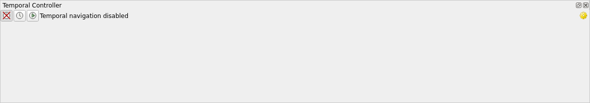
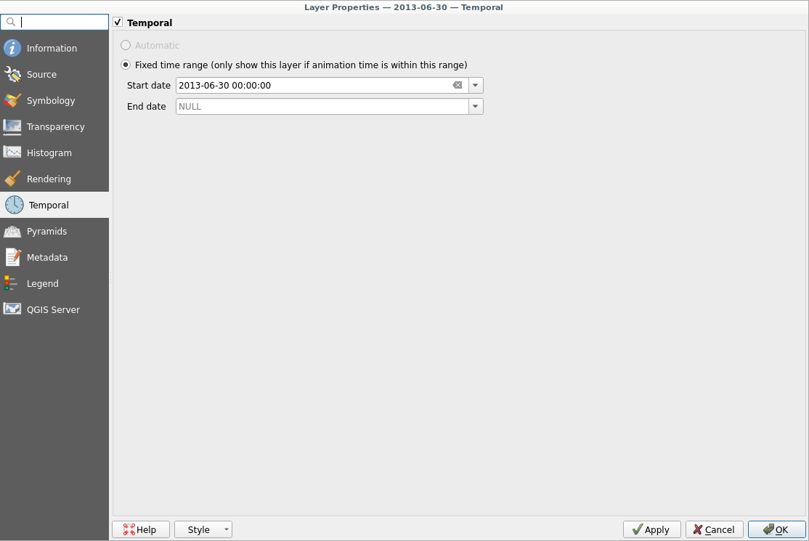
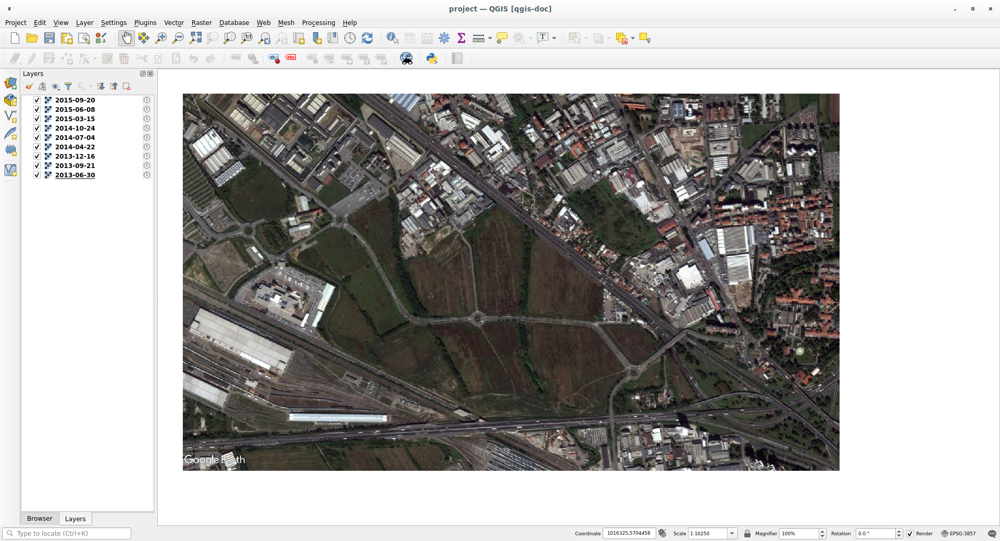
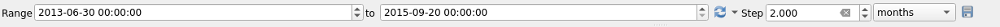
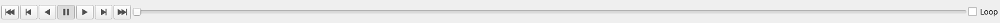

.. _`temporal`:

*********************
Temporal Data Support
*********************

.. only:: html

   .. contents::
      :local:

QGIS can handle temporal control on loaded layers depending on the information
of the data. 

Different providers are supported:

* raster layers
* vector layers
* mesh layers
* WMS-T

Activating the temporal control support means setting up the temporal options on
the layer(s) and then enabling the temporal view QGIS-wide.

The temporal support is also available in the print layout: you can export time
based maps.

Furthermore, many variables are added to the Expression Builder so that you can
use them to change the appearance of the layer(s) depending on the current map
frame.

General concepts
================
Temporal control settings are available at different levels:

* in the :guilabel:`Temporal` tab within the project properties
  :menuselection:`Project --> Properties` dialog * in the properties on the
  single layer(s)

The whole temporal control is activated with the |temporal| icon located in the
:guilabel:`Map Navigation` toolbar. Once clicked the temporal panel will appear:

.. _temporal_controller:

   Temporal Controller Panel

The temporal panel has the following buttons:

* |temporalNavigationOff| :guilabel:`Turn off temporal navigation`: all the temporal 
  settings are disabled
* |temporalNavigationFixedRange| :guilabel:`Fixed range temporal navigation`: a 
  fixed time range is set and only layers that fit this range will be displayed
  in the map
* |temporalNavigationAnimated| :guilabel:`Animated temporal navigation`: the map
  will be animated depending on the layer settings and temporal customization

In order to link the visible layers with the time range you have first to tweak
the single layer temporal settings.

.. _raster_temporal:

Raster Layers
=============
Normally raster layers don't have any temporal metadata set. Therefore you have
to choose layer by layer the temporal settings like the start date and
eventually the end date:

   Raster Layer Temporal Settings

In this example the raster layer has a ``Start date`` set to ``2013-06-30 00:00:00``
and no ``End Date``. It means that the raster will be covered by other rasters
that have a more recent start date set.

Once you have enabled the temporal control on the layer the
|temporalNavigationFixedRange| icon will be displayed next to the layer name in
the legend to remind you that the layer is temporally controlled:

   Temporal icon in the legend

You can click on the icon to quickly go to the temporal settings of the layer.

If you have many different raster layers loaded in the project be sure to tweak
the temporal settings for each layer. In the following example the name of the
layers describes the date at which they are set to display.

If you open the main temporal panel with the |temporal| button you can animate
the map by clicking the |temporalNavigationAnimated| :guilabel:`Animated
temporal navigation` button.

Before to play the map you have to set the temporal options shown in the bottom
part of the :guilabel:`Animated temporal navigation` panel:

* :guilabel:`Range`: the starting and ending datetime range
* :guilabel:`Step`: how often the map should update

   Animated Temporal Navigation Options

Once you have set the temporal options you can animate the map with the |play|
button. Use all the other buttons to pause, stop, rewind and forward the map:

   Animated Temporal Navigation Buttons

If the |unchecked| :guilabel:`Loop` checkbox in the upper right part of the bar
is checked the animation will be endlessly repeated.

.. figure:: img/temporal.gif
   :align: center

.. Substitutions definitions - AVOID EDITING PAST THIS LINE
   This will be automatically updated by the find_set_subst.py script.
   If you need to create a new substitution manually,
   please add it also to the substitutions.txt file in the
   source folder.

.. |play| image:: /static/common/mActionPlay.png
   :width: 1.5em
.. |temporal| image:: /static/common/temporal.png
   :width: 1.5em
.. |temporalNavigationAnimated| image:: /static/common/mTemporalNavigationAnimated.png
   :width: 1.5em
.. |temporalNavigationFixedRange| image:: /static/common/mTemporalNavigationFixedRange.png
   :width: 1.5em
.. |temporalNavigationOff| image:: /static/common/mTemporalNavigationOff.png
   :width: 1.5em
.. |unchecked| image:: /static/common/checkbox_unchecked.png
   :width: 1.3em
