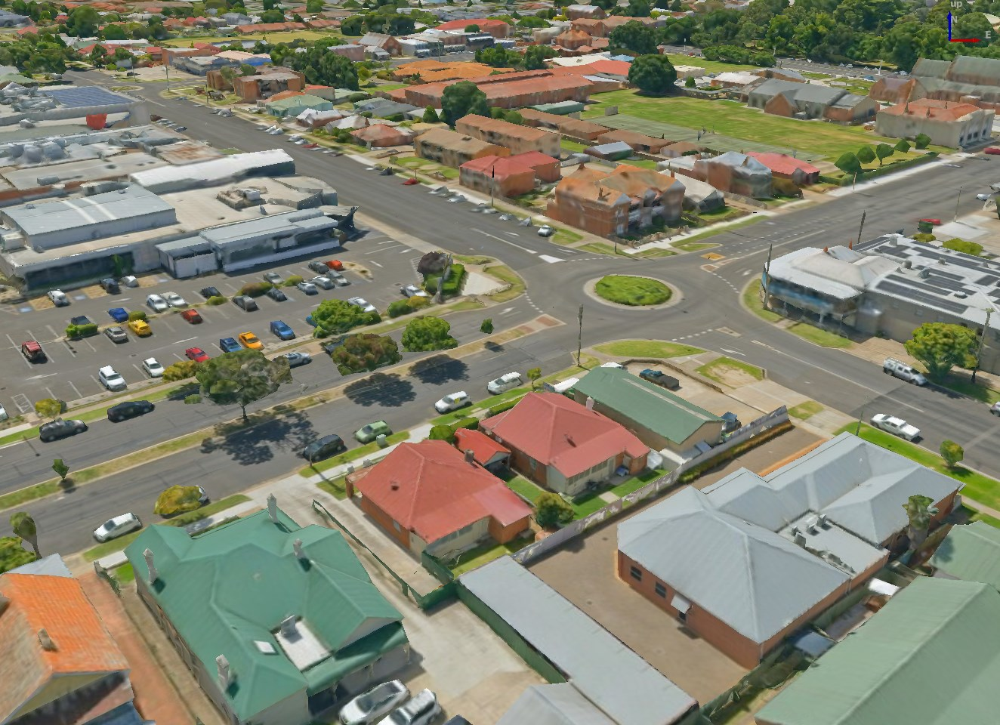
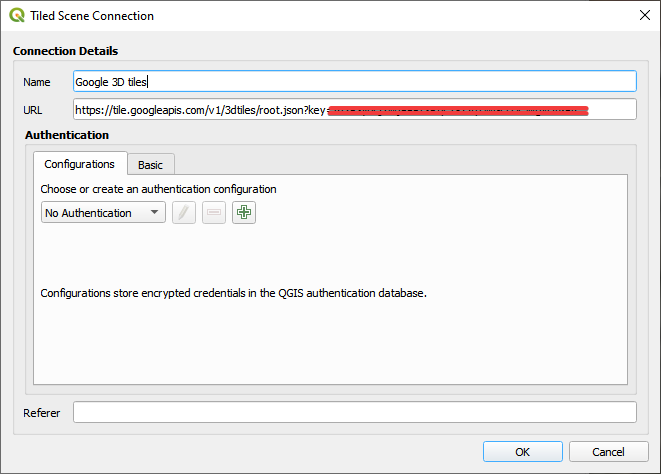
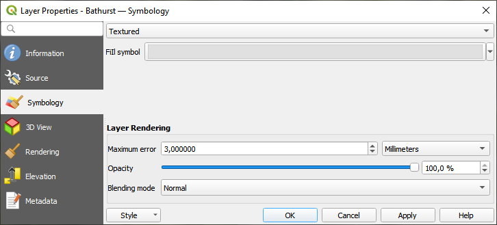
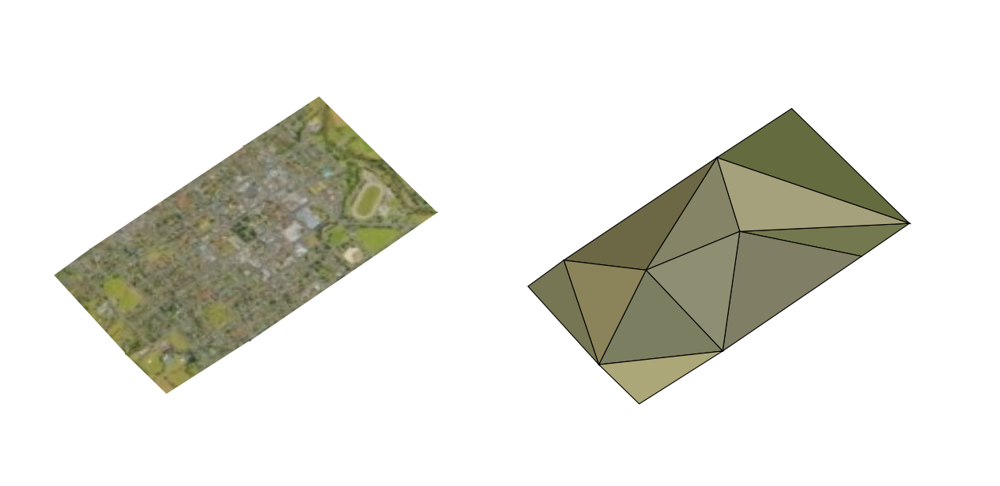
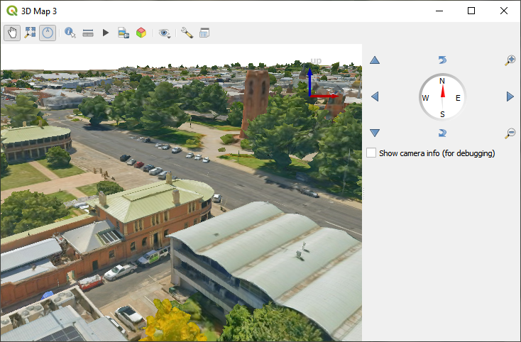

.. index:: 3D Tiles, 3d tiles properties
.. _`label_3d_tiles`:

*************************
Working with 3D Tiles
*************************

.. only:: html

   .. contents::
      :local:

What are 3D Tiles?
======================

3D tiles are specification for streaming and rendering large-scale 3D
geospatial datasets. They use a hierarchical structure to efficiently manage 
and display 3D content, optimising performance by dynamically loading
appropriate levels of detail. This technology is widely used in urban 
planning, architecture, simulation, gaming, and virtual reality, providing
a standardised and interoperable solution for visualising complex geographical
data. Read :ref:`3d_tiles` for more details.

.. _figure_3d_tiles_example:

   Example of 3D tiles

Data Sources
============

Support for 3D tiles:

* Remote source - ``http://example.com/tileset.json``
* Local files - ``file:///path/to/tiles/tileset.json``

Using data from Cesium ion 
--------------------------

*Cesium ion* is a cloud-based platform for managing and streaming 3D geospatial
data. It simplifies data management, visualisation and sharing. To add 3D tiles
from Cesium ion, you need to first sign up to their service 
here: https://ion.cesium.com.

You can also use Cesium ion plugin from the QGIS repository 
to add the data to QGIS.

Using Google 3D data
--------------------

To use Google Photorealistic 3D tiles in QGIS, get an API key for 3D tiles. 
Once you have the key, simply add Google tiles using the same 
connection process.

.. _figure_google_3d_tiles:

   Google 3D Tiles connection 

.. _3dtiles_properties:

3D Tiles Properties
===================

The 3D tiles :guilabel:`Layer Properties` dialog provides the following sections:

.. list-table::

   * - |metadata| :ref:`Information <3dtilesinformationmenu>`
     - |system| :ref:`Source <3dtilessourcemenu>`
     - |symbology| :ref:`Symbology <3dtilessymbologymenu>`:sup:`[1]`
   * - |3d| :ref:`3D View <3dtiles3dviewmenu>`:sup:`[1]`
     - |rendering| :ref:`Rendering <3dtilesrenderingmenu>`
     - |elevationscale| :ref:`Elevation <3dtileselevationmenu>`:sup:`[1]`
   * - |editMetadata| :ref:`Metadata <3dtilesmetadatamenu>`
     -
     -

:sup:`[1]` Also available in the :ref:`Layer styling panel <layer_styling_panel>`

.. _3dtilesinformationmenu:

Information Properties
----------------------

The :guilabel:`Information` tab is read-only and represents an interesting
place to quickly grab summarized information and metadata on the current layer.
Provided information are:

* based on the provider of the layer: name, URL, source type and path, number
  of zoom levels
* the Coordinate Reference System: name, units, method, accuracy, reference
  (i.e. whether it's static or dynamic)
* picked from the :ref:`filled metadata <3dtilesmetadatamenu>`: access,
  extents, links, contacts, history...

.. _3dtilessourcemenu:

Source Properties
-----------------

The |system| :guilabel:`Source` tab displays basic information about
the selected 3D tile, including:

* the :guilabel:`Layer name` to display in the :guilabel:`Layers Panel`;
* the :guilabel:`Coordinate Reference System`:
  Displays the layer's
  :ref:`Coordinate Reference System (CRS) <layer_crs>`.
  You can change the layer's CRS, by selecting a recently used one in
  the drop-down list or clicking on the |setProjection|
  :sup:`Select CRS` button (see :ref:`crs_selector`).
  Use this process only if the layer CRS is wrong or not specified.

.. _3dtilessymbologymenu:

Symbology Properties
--------------------

.. _figure_3d_tiles_symbology:

   3D Tile Layer Symbology

By default, the layer is styled using texture, but you can change it 
to see the wireframe mesh behind the scene by choosing :guilabel:`Wireframe` 
in the drop-down menu. You can also, change the mesh fill and line symbols 
similar to the vector polygons. 
Checking |checkbox| :guilabel:`Use texture colors` will render each mesh element 
with the average value of the full texture. 
This is a good option to try when dealing with a large dataset and
want to get a quick overview of the data.

.. _figure_3d_tiles_textured_and_wireframe:

   3D Tiles - textured and wireframe 

To view the data you can open |new3DMap| :guilabel:`New 3D map view`.

.. _figure_3d_tiles_map_view:

   3D Map View  

From the :guilabel:`Symbology` tab, you can also set some options that 
invariably act on all features of the layer:

* :guilabel:`Maximum error`: This parameter determines the level of detail 
  displayed in the 3D model. Similar to point clouds, 3D tiles 
  often contain more information than necessary for visual representation.
  By adjusting this setting, you control the balance between display density 
  and rendering speed. A larger value (e.g., 5 mm) may introduce noticeable
  gaps between elements, while a smaller value (e.g., 0.1 mm) could lead to
  the rendering of an excessive number of details, potentially slowing down
  the rendering process. Different units can be selected to tailor the setting
  to your specific needs.
* :guilabel:`Opacity`: Adjust the visibility of the underlying layer on the 
  map canvas using this tool. Use slider to tailor the visibility 
  of your scene layer according to your preferences. Alternatively, specify the 
  exact percentage of visibility through the menu next to the slider.
* :guilabel:`Blending mode`: You can achieve special rendering effects with these tools
  that you may previously only know from graphics programs.
  The pixels of your overlaying and underlaying layers are mixed through the settings
  described in :ref:`blend-modes`.

.. _3dtiles3dviewmenu:

3D View Properties
------------------

* :guilabel:`Maximum screen space error` determines the threshold for swapping
  terrain tiles with more detailed ones (and vice versa) - i.e. how soon the 3D 
  view will use higher quality tiles. Lower numbers mean more details in the 
  scene at the expenses of increased rendering complexity.

* |unchecked| :guilabel:`Show bounding boxes` Show 3D bounding boxes of the 
  terrain tiles (useful for troubleshooting terrain issues).

.. _3dtilesrenderingmenu:

Rendering Properties
--------------------

Under |unchecked| :guilabel:`Scale dependent visibility`,
you can set the :guilabel:`Maximum (inclusive)`
and :guilabel:`Minimum (exclusive)` scales,
defining a range of scales in which features will be visible.
Out of this range, they are hidden.
The |mapIdentification| :sup:`Set to current canvas scale` button helps you
use the current map canvas scale as boundary of the range visibility.
See :ref:`label_scaledepend` for more information.

.. _3dtileselevationmenu:

Elevation Properties
--------------------

The |elevationscale| :guilabel:`Elevation` tab provides options to control
the layer elevation properties within a :ref:`3D map view <label_3dmapview>`.
Specifically, you can set:

* :guilabel:`Elevation Surface`: how the 3D layer vertices Z values
  should be interpreted as terrain elevation.
  You can apply a :guilabel:`Scale` factor and an :guilabel:`Offset`.

.. index:: Metadata, Metadata editor, Keyword
.. _3dtilesmetadatamenu:

Metadata Properties
-------------------

The |editMetadata| :guilabel:`Metadata` tab provides you with options
to create and edit a metadata report on your layer.
See :ref:`metadatamenu` for more information.

.. Substitutions definitions - AVOID EDITING PAST THIS LINE
   This will be automatically updated by the find_set_subst.py script.
   If you need to create a new substitution manually,
   please add it also to the substitutions.txt file in the
   source folder.

.. |3d| image:: /static/common/3d.png
   :width: 1.5em
.. |checkbox| image:: /static/common/checkbox.png
   :width: 1.3em
.. |editMetadata| image:: /static/common/editmetadata.png
   :width: 1.2em
.. |elevationscale| image:: /static/common/elevationscale.png
   :width: 1.5em
.. |mapIdentification| image:: /static/common/mActionMapIdentification.png
   :width: 1.5em
.. |metadata| image:: /static/common/metadata.png
   :width: 1.5em
.. |new3DMap| image:: /static/common/mActionNew3DMap.png
   :width: 1.5em
.. |rendering| image:: /static/common/rendering.png
   :width: 1.5em
.. |setProjection| image:: /static/common/mActionSetProjection.png
   :width: 1.5em
.. |symbology| image:: /static/common/symbology.png
   :width: 2em
.. |system| image:: /static/common/system.png
   :width: 1.5em
.. |unchecked| image:: /static/common/unchecked.png
   :width: 1.3em
