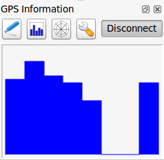
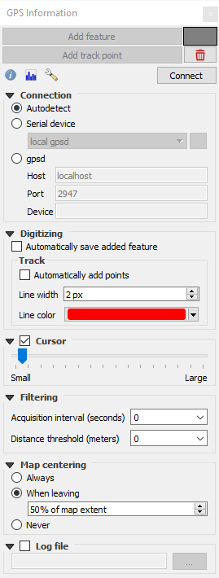

.. index:: GPS tracking
.. _`sec_gpstracking`:

Live GPS tracking
==================

.. only:: html

   .. contents::
      :local:

To activate live GPS tracking in QGIS, you need to select :menuselection:`View
--> Panels` |checkbox| :guilabel:`GPS Information Panel` or press :kbd:`Ctrl+0`.
You will get a new docked window on the left side of the canvas.

There are three possible screens in this GPS tracking window:

* |metadata| :sup:`Position`: GPS position coordinates and an interface for manually entering
  vertices and features
* |gpsTrackBarChart| :sup:`Signal`: signal strength of satellite connections
* |options| :sup:`Options`: GPS options screen (see :numref:`figure_gps_options`)

With a plugged-in GPS receiver (has to be supported by your operating system),
a simple click on :guilabel:`Connect` connects the GPS to QGIS. A second click (now
on :guilabel:`Disconnect`) disconnects the GPS receiver from your computer. For GNU/Linux,
gpsd support is integrated to support connection to most GPS receivers. Therefore,
you first have to configure gpsd properly to connect QGIS to it.

With the :guilabel:`Recenter` button the map will jump to the current GPS position.

.. warning::
   If you want to record your position to the canvas, you have to create a new
   vector layer first and switch it to editable status to be able to record your
   track.

When a GPS device is connected and the user moves the cursor over the map canvas,
a live status bar message displays the distance and bearing from the cursor to
the GPS position. Project distance and bearing settings are respected in this display.

.. tip:: **Touch Screen Devices**

 On a touch screen device use a tap-and-hold event to trigger the live status bar
 message.

Position and additional attributes
----------------------------------

|metadata| If the GPS is receiving signals from satellites, you will
see your position in latitude, longitude and altitude together with additional
attributes.

.. _figure_gps_position:

.. figure:: img/gpstrack_main.png
   :align: center

   GPS tracking position and additional attributes

GPS signal strength
-------------------

|gpsTrackBarChart| Here, you can see the signal strength of the satellites you
are receiving signals from.

.. _figure_gps_strength:

   GPS tracking signal strength

GPS options
-----------

.. _figure_gps_options:

   GPS tracking options window

Here you can specify: 

* :guilabel:`Connection`

  * In case of connection problems, you can switch between:

    * |radioButtonOn| :guilabel:`Autodetect`
    * |radioButtonOff| :guilabel:`Serial device` (reload required if a new GPS Device is connected)
    * |radioButtonOff| :guilabel:`gpsd` (selecting the Host, Port and Device your
      GPS is connected to)

  * A click on :guilabel:`Connect` again initiates the connection to the GPS receiver.

* :guilabel:`Digitizing`

  * You can activate |checkbox| :menuselection:`Automatically save added features`
    when you are in editing mode. Or you can activate |checkbox|
    :guilabel:`Automatically add points` to the map canvas with a certain width
    and color.
  * The :guilabel:`Calculate bearing from travel direction` can be used if the device
    reports faulty bearing measurements and it will calculate the GPS bearing based
    on the previous two recorded locations.

* :guilabel:`Cursor`: you can use a slider |slider| to shrink
  and grow the position cursor on the canvas.

* :guilabel:`Filtering`: You can also set an :guilabel:`Acquisition interval (seconds)` 
  and a :guilabel:`Distance threshold (meters)` parameters to keep the cursor still
  active when the receiver is in static conditions.

* :guilabel:`Map Centering and Rotation`

  * Activating |radioButtonOn| :guilabel:`Map centering` allows you to decide in which
    way the canvas will be updated. This includes 'always', 'when leaving', if your
    recorded coordinates start to move out of the canvas, or 'never', to keep map
    extent.
  * Activating :guilabel:`Rotate map to match GPS direction` will automatically
    rotate the map canvas so that it is oriented in the same direction as the GPS bearing.

* Activating :guilabel:`Show Bearing Line` will show a line from the GPS location
  pointing in current path direction of the GPS.

* Finally, you can activate |checkbox| :guilabel:`Log file` and define a path
  and a file where log messages about the GPS tracking are logged.

If you want to set a feature manually, you have to go back to |metadata|
:sup:`Position` and click on :guilabel:`Add Point` or :guilabel:`Add Track Point`.

Connect to a Bluetooth GPS for live tracking
--------------------------------------------

With QGIS you can connect a Bluetooth GPS for field data collection. To perform
this task you need a GPS Bluetooth device and a Bluetooth receiver on your
computer.

At first you must let your GPS device be recognized and paired to the computer.
Turn on the GPS, go to the Bluetooth icon on your notification area and search
for a New Device.

On the right side of the Device selection mask make sure that all devices are
selected so your GPS unit will probably appear among those available. In the
next step a serial connection service should be available, select it and click
on :guilabel:`Configure` button.

Remember the number of the COM port assigned to the GPS connection as resulting
by the Bluetooth properties.

After the GPS has been recognized, make the pairing for the connection. Usually
the authorization code is ``0000``.

Now open :guilabel:`GPS information` panel and switch to |options| GPS
options screen. Select the COM port assigned to the GPS connection and click
the :guilabel:`Connect`. After a while a cursor indicating your position should
appear.

If QGIS can't receive GPS data, then you should restart your GPS device, wait
5-10 seconds then try to connect again. Usually this solution work. If you
receive again a connection error make sure you don't have another Bluetooth
receiver near you, paired with the same GPS unit.

Using GPSMAP 60cs
-----------------

MS Windows
..........

Easiest way to make it work is to use a middleware (freeware, not open) called
`GPSGate <https://gpsgate.com/gpsgate-splitter>`_.

Launch the program, make it scan for GPS devices (works for both USB and BT
ones) and then in QGIS just click :guilabel:`Connect` in the Live tracking panel
using the |radioButtonOn| :guilabel:`Autodetect` mode.

Ubuntu/Mint GNU/Linux
.....................

As for Windows the easiest way is to use a server in the middle, in this case
GPSD, so

::

  sudo apt install gpsd

Then load the ``garmin_gps`` kernel module

::

  sudo modprobe garmin_gps

And then connect the unit. Then check with ``dmesg`` the actual device being
used bu the unit, for example ``/dev/ttyUSB0``. Now you can launch gpsd

::

  gpsd /dev/ttyUSB0

And finally connect with the QGIS live tracking tool.

Using BTGP-38KM datalogger (only Bluetooth)
-------------------------------------------

Using GPSD (under Linux) or GPSGate (under Windows) is effortless.

Using BlueMax GPS-4044 datalogger (both BT and USB)
---------------------------------------------------

MS Windows
..........

The live tracking works for both USB and BT modes, by using GPSGate or even
without it, just use the |radioButtonOn| :guilabel:`Autodetect` mode, or point
the tool the right port.

Ubuntu/Mint GNU/Linux
.....................

**For USB**

The live tracking works both with GPSD

::

  gpsd /dev/ttyACM3

or without it, by connecting the QGIS live tracking tool directly to the
device (for example ``/dev/ttyACM3``).

**For Bluetooth**

The live tracking works both with GPSD

::

  gpsd /dev/rfcomm0

or without it, by connecting the QGIS live tracking tool directly to the device
(for example ``/dev/rfcomm0``).

.. Substitutions definitions - AVOID EDITING PAST THIS LINE
   This will be automatically updated by the find_set_subst.py script.
   If you need to create a new substitution manually,
   please add it also to the substitutions.txt file in the
   source folder.

.. |checkbox| image:: /static/common/checkbox.png
   :width: 1.3em
.. |gpsTrackBarChart| image:: /static/common/gpstrack_barchart.png
   :width: 1.5em
.. |metadata| image:: /static/common/metadata.png
   :width: 1.5em
.. |options| image:: /static/common/mActionOptions.png
   :width: 1em
.. |radioButtonOff| image:: /static/common/radiobuttonoff.png
   :width: 1.5em
.. |radioButtonOn| image:: /static/common/radiobuttonon.png
   :width: 1.5em
.. |slider| image:: /static/common/slider.png
