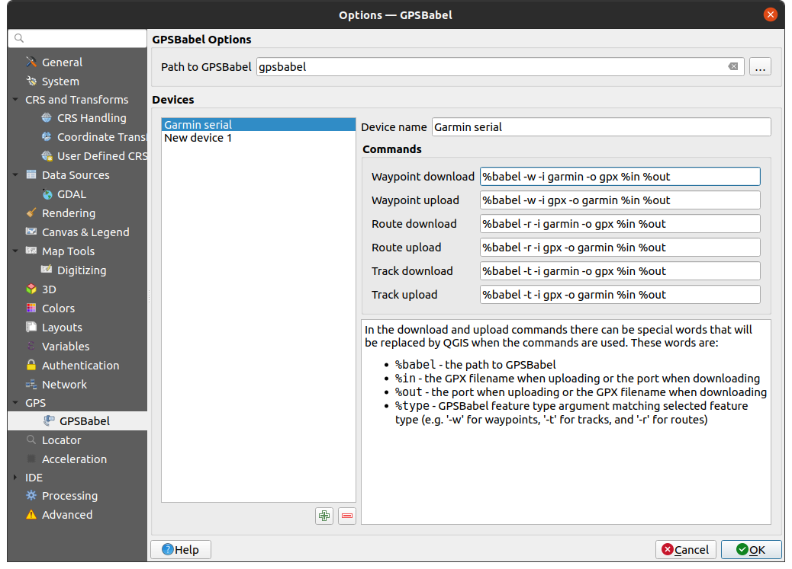

.. _gps_data:

Introducing GNSS/GPS Data
===========================

.. only:: html

   .. contents::
      :local:

.. _`whatsgps`:

What is GPS?
------------

GPS, the **Global Positioning System**, is a satellite-based system that allows
anyone with a GPS receiver to find their exact position anywhere in the world.
GPS is used as an aid in navigation, for example in airplanes, in boats and by hikers.
The GPS receiver uses the signals from the satellites to calculate its latitude,
longitude and (sometimes) elevation.
Most receivers also have the capability to store:

* locations (known as **waypoints**)
* sequences of locations that make up a planned **route**
* and a **track** log of the receiver's movement over time.

Waypoints, routes and tracks are the three basic feature types in GPS data.
QGIS displays waypoints in point layers, while routes and tracks are displayed in linestring layers.

.. note:: QGIS supports also GNSS receivers. But we keep using the term GPS in this documentation.

.. _`label_loadgps`:

Transferring or loading GPS data
--------------------------------

Loading a GPX file
..................

There are dozens of different file formats for storing GPS data.
The format that QGIS uses is called GPX (GPS eXchange format),
which is a standard interchange format that can contain any number of waypoints,
routes and tracks in the same file.

To load a :file:`GPX` file:

#. Open the :guilabel:`GPS` tab in the :guilabel:`Data Source Manager` dialog, i.e.:

   * Click the |dataSourceManager| :sup:`Open Data Source Manager` button on the toolbar
     (or press :kbd:`Ctrl+L`) and enable the target tab
   * Or select :menuselection:`Layer --> Add Layer -->` |addGpsLayer|
     :menuselection:`Add GPX Layer...`
#. Use the :guilabel:`...` :sup:`Browse` button next to the :guilabel:`GPX dataset` option
   to select the GPX file
#. Use the check boxes to select the :guilabel:`Feature types` you want to load from the file.
   Each feature type (:guilabel:`Waypoints`, :guilabel:`Tracks` or :guilabel:`Routes`)
   will be loaded in a separate layer.

.. figure:: ../managing_data_source/img/gps_datasource.png
   :align: center

   Loading GPS Data dialog

.. _load_from_device:

Loading to or from a device
...........................

There are lots of different types of GPS devices and formats.
Since QGIS uses GPX files, you need a way to convert other GPS file formats to GPX.
QGIS can do that using the free program `GPSBabel <https://www.gpsbabel.org>`_.
GPSBabel can help you convert waypoints, tracks, and routes between popular GPS receivers
such as Garmin or Magellan and mapping programs like Google Earth or Basecamp.
Literally hundreds of GPS receivers and programs are supported.
It can also transfer GPS data between your computer and a GPS device.

Under :menuselection:`Settings -->` |options| :menuselection:`Options -->`
|gps| :menuselection:`GPS -->` |gps| :menuselection:`GPSBabel`,
QGIS allows you to define your own device type and set parameters of conversion
that could later be used by the :ref:`Processing GPS algorithms <gps_algorithms>`.

   GPS Babel settings

#. First you have to define the :guilabel:`Path to GPSBabel` binaries.
#. Then you may want to add your device.
   You can update devices list using |symbologyAdd| :sup:`Add new device`
   or |symbologyRemove| :sup:`Remove device` button.
#. For each device:

   * you provide a :guilabel:`Device name`
   * you configure different :guilabel:`Commands` QGIS will use while interacting with it,
     such as:

     * :guilabel:`Waypoint download` from the device
     * :guilabel:`Waypoint upload` to the device
     * :guilabel:`Route download` from the device
     * :guilabel:`Route upload` to the device
     * :guilabel:`Track download` from the device
     * :guilabel:`Track upload` to the device

     While the commands are usually GPSBabel commands, you can also use any other command line program that can create a GPX file.
     QGIS will replace the keywords ``%type``, ``%in``, and ``%out`` when it runs the command.

     As an example, if you create a device type with the download command
     ``gpsbabel %type -i garmin -o gpx %in %out``
     and then use it to download waypoints from port ``/dev/ttyS0`` to the file :file:`output.gpx`,
     QGIS will replace the keywords and run the command
     ``gpsbabel -w -i garmin -o gpx /dev/ttyS0 output.gpx``.

     Read the GPSBabel manual for the command line options that may be specific to your use case.

Once you have created a new device type, it will appear in the device lists for
the GPS download and upload algorithms.

.. note::
   GPS units allow you to store data in different coordinate systems.
   When downloading a GPX file (from your GPS unit or a web site) and then loading it in QGIS,
   be sure that the data stored in the GPX file uses WGS 84 (latitude/longitude).
   QGIS expects this, and it is the official GPX specification.
   See `GPX 1.1 Schema Documentation <https://www.topografix.com/GPX/1/1/>`_.

.. Substitutions definitions - AVOID EDITING PAST THIS LINE
   This will be automatically updated by the find_set_subst.py script.
   If you need to create a new substitution manually,
   please add it also to the substitutions.txt file in the
   source folder.

.. |addGpsLayer| image:: /static/common/mActionAddGpsLayer.png
   :width: 1.5em
.. |dataSourceManager| image:: /static/common/mActionDataSourceManager.png
   :width: 1.5em
.. |gps| image:: /static/common/mIconGps.png
   :width: 1.5em
.. |options| image:: /static/common/mActionOptions.png
   :width: 1em
.. |symbologyAdd| image:: /static/common/symbologyAdd.png
   :width: 1.5em
.. |symbologyRemove| image:: /static/common/symbologyRemove.png
   :width: 1.5em
