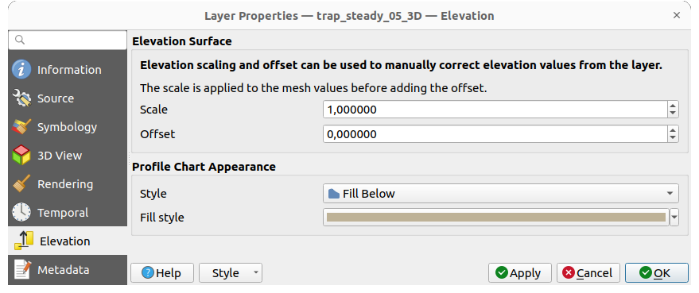
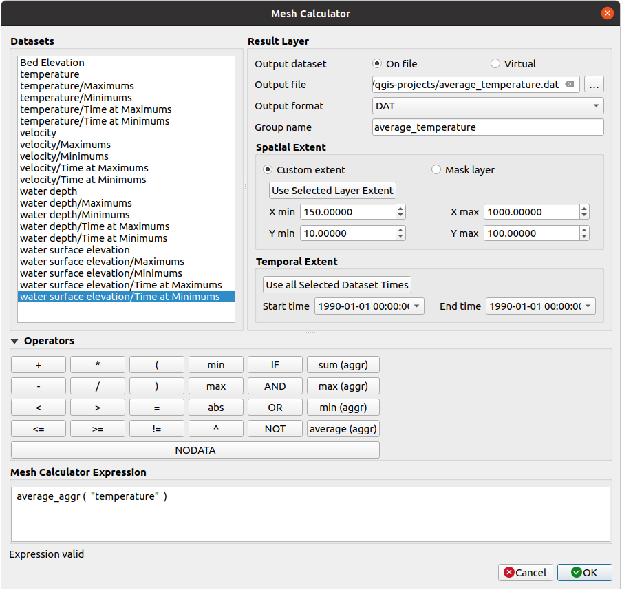

.. _`label_meshdata`:

***********************
 Working with Mesh Data
***********************

.. only:: html

   .. contents::
      :local:

What's a mesh?
==============

A mesh is an unstructured grid usually with temporal and other components.
The spatial component contains a collection of vertices, edges and/or faces,
in 2D or 3D space:

* **vertices** - XY(Z) points (in the layer's coordinate reference system)
* **edges** - connect pairs of vertices
* **faces** - a face is a set of edges forming a closed shape - typically
  a triangle or a quadrilateral (quad), rarely polygons with more vertices

Relying on the above, mesh layers can thus have different types of structure:

* 1D Meshes: consist of vertices and edges. An edge connects two vertices and
  can have assigned data (scalars or vectors) on it. The 1D mesh network can
  be for example used for modelling of an urban drainage system.
* 2D meshes: consist of faces with triangles, regular or unstructured quads.
* 3D layered meshes: consist of multiple stacked 2D unstructured meshes each
  extruded in the vertical direction (levels) by means of a vertical coordinate.
  The vertices and faces have the same topology in each vertical level.
  The mesh definition (vertical level extrusion) could in general change in time.
  The data is usually defined in volume centres or by some parametric function.

.. _figure_mesh_grid_types:

.. figure:: img/mesh_grid_types.png
   :align: center

   Different mesh types

Mesh provides information about the spatial structure.
In addition, the mesh can have datasets (groups) that assign a value to every vertex.
For example, having a triangular mesh with numbered vertices as shown in the image below:

.. _figure_triangual_grid_with_numered_vertices:

.. figure:: img/triangual_grid_with_numered_vertices.png
   :align: center

   Triangular grid with numbered vertices

Each vertex can store different datasets (typically multiple quantities),
and those datasets can also have a temporal dimension. Thus, a single file may
contain multiple datasets.

The following table gives an idea about the information that can be stored in mesh datasets.
Table columns represent indices of mesh vertices, each row represents one dataset.
Datasets can have different datatypes.
In this case, it stores wind velocity at 10m at a particular moments in time
(t1, t2, t3).

In a similar way, the mesh dataset can also store vector values for each vertex.
For example, wind direction vector at the given time stamps:

.. table:: Example of mesh dataset

  =============================== ========= ========= ========= =====
  10 metre wind                   1         2         3         ...
  =============================== ========= ========= ========= =====
  10 metre speed at time=t1       17251     24918     32858     ...
  10 metre speed at time=t2       19168     23001     36418     ...
  10 metre speed at time=t3       21085     30668     17251     ...
  ...                             ...       ...       ...       ...
  10m wind direction time=t1      [20,2]    [20,3]    [20,4.5]  ...
  10m wind direction time=t2      [21,3]    [21,4]    [21,5.5]  ...
  10m wind direction time=t3      [22,4]    [22,5]    [22,6.5]  ...
  ...                             ...       ...       ...       ...
  =============================== ========= ========= ========= =====

We can visualize the data by assigning colors to values (similarly to how it is
done with :ref:`Singleband pseudocolor <label_colormaptab>` raster rendering)
and interpolating data between vertices according to the mesh topology.
It is common that some quantities are 2D vectors rather than being
simple scalar values (e.g. wind direction).
For such quantities it is desirable to display arrows indicating the directions.

.. _figure_mesh_visualisation:

.. figure:: img/mesh_visualisation.png
   :align: center

   Possible visualisation of mesh data

.. _mesh_supported_formats:

Supported formats
=================

QGIS accesses mesh data using the `MDAL drivers <https://github.com/lutraconsulting/MDAL>`_,
and natively supports a `variety of formats <https://github.com/lutraconsulting/MDAL#supported-formats>`__.
Whether QGIS can edit a mesh layer depends on the format and the mesh
structure type.

To load a mesh dataset into QGIS, use the |addMeshLayer| :guilabel:`Mesh` tab
in the :guilabel:`Data Source Manager` dialog. Read :ref:`mesh_loading` for
more details.

.. _`label_meshproperties`:

Mesh Dataset Properties
=======================

The :guilabel:`Layer Properties` dialog for a mesh layer provides general
settings to manage dataset groups of the layer and their rendering
(active dataset groups, symbology, 2D and 3D rendering).
It also provides information about the layer.

To access the :guilabel:`Layer Properties` dialog:

* In the :guilabel:`Layers` panel, double-click the layer or right-click
  and select :guilabel:`Properties...` from the pop-up menu;
* Go to :menuselection:`Layer --> Layer Properties...` menu when the layer
  is selected.

The mesh :guilabel:`Layer Properties` dialog provides the following sections:

.. list-table:: Tabs of the Mesh Layer Properties

   * - |metadata| :ref:`Information <meshinformation>`
     - |system| :ref:`Source <meshsource>`
     - |symbology| :ref:`Symbology <meshsymbology>`:sup:`[1]`
   * - |3d| :ref:`3D View <mesh3dview>`:sup:`[1]`
     - |temporal| :ref:`Temporal <meshtemporal>`
     - |elevationscale| :ref:`Elevation <meshelevation>`
   * - |rendering| :ref:`Rendering <meshrendering>`
     - |editMetadata| :ref:`Metadata <meshmetadata>`
     -

:sup:`[1]` Also available in the :ref:`Layer styling panel <layer_styling_panel>`

.. note:: Most of the properties of a mesh layer can be saved to or loaded from
 a :file:`.qml` using the :guilabel:`Style` menu at the bottom of the dialog.
 More details at :ref:`manage_custom_style`.

.. _meshinformation:

Information Properties
----------------------

.. _figure_mesh_info_properties:

.. figure:: img/mesh_info_properties.png
   :align: center

   Mesh Layer Information Properties

The |metadata| :guilabel:`Information` tab is read-only and represents an interesting
place to quickly grab summarized information and metadata on the current layer.
Provided information are:

* general such as  name in the project, source path, list of auxiliary files,
  last save time and size, the used provider
* based on the provider of the layer: extent, vertex, face, edges
  and/or dataset groups count
* the Coordinate Reference System: name, units, method, accuracy, reference
  (i.e. whether it's static or dynamic)
* extracted from filled :ref:`metadata <meshmetadata>`: access, extents,
  links, contacts, history...

.. _meshsource:

Source Properties
-----------------

The |system| :guilabel:`Source` tab displays basic information about
the selected mesh, including:

.. _figure_mesh_source:

.. figure:: img/mesh_source.png
   :align: center

   Mesh Layer Source Properties

* the layer name to display in the :guilabel:`Layers` panel
* setting the Coordinate Reference System: Displays the layer’s
  :ref:`Assigned Coordinate Reference System (CRS) <layer_crs>`. You can change
  the layer’s CRS by selecting a recently used one in the drop-down list or
  clicking on |setProjection| :guilabel:`Select CRS` button (see :ref:`crs_selector`).
  Use this process only if the CRS applied to the layer is wrong or
  if none was applied.
* The :guilabel:`Available datasets` frame lists all the dataset groups (and
  subgroups) in the mesh layer, with their type and description in a tree view.
  Both regular datasets (i.e. their data is stored in the file) and virtual
  datasets (which are :ref:`calculated on the fly <mesh_calculator>`) are listed.

  * Use the |add| :guilabel:`Assign extra dataset to mesh` button to add more
    groups to the current mesh layer.
  * |collapseTree| :guilabel:`Collapse all` and |expandTree| :guilabel:`Expand
    all` the dataset tree, in case of embedded groups
  * If you are interested in few datasets, you can uncheck the others and
    make them unavailable in the project
  * Double-click over a name and you can rename the dataset.
  * |refresh| :guilabel:`Reset to defaults`: checks all the groups and
    renames them back to their original name in the provider.
  * Right-click over a virtual dataset group and you can:

    * :guilabel:`Remove dataset group` from the project
    * :guilabel:`Save dataset group as...` a file on disk, to any supported format.
      The new file is kept assigned to the current mesh layer in the project.
* Checking the |unchecked| :guilabel:`Treat as static dataset` group allows
  to ignore the :ref:`map temporal navigation <maptimecontrol>` properties
  while rendering the mesh layer.
  For each active dataset group (as selected in |symbology|
  :menuselection:`Symbology -->` |general| :guilabel:`Datasets` tab), you can:

  * set to :guilabel:`None`: the dataset group is not displayed at all
  * :guilabel:`Display dataset`: e.g., for the "bed elevation" dataset which is
    not time aware
  * extract a particular date time: the dataset matching the provided time
    is rendered and stay fixed during map navigation.

.. _meshsymbology:

Symbology Properties
--------------------

Click the |symbology| :guilabel:`Symbology` button to activate the dialog.
Symbology properties are divided into several tabs:

* :ref:`Datasets <mesh_symbology_datasets>`
* :ref:`Contours <mesh_symbology_contours>`
* :ref:`Vectors <mesh_symbology_vectors>`
* :ref:`Rendering <mesh_symbology_rendering>`
* :ref:`Stacked mesh averaging method <mesh_stacked_averaging>`

.. _mesh_symbology_datasets:

Datasets
........

The tab |general| :sup:`Datasets` is the main place to control and set which
datasets will be used for the layer. It presents the following items:

* :guilabel:`Groups` available in the mesh dataset, with whether they provide:

  * |meshcontoursoff| scalar dataset
  * or |meshvectorsoff| vector dataset: by default, each vector dataset has
    a scalar dataset representing its magnitude automatically generated.

  Click on the icon next to the dataset name to select the group and type of
  data to represent.
* :guilabel:`Selected dataset group(s) metadata`, with details on:

  * the mesh type: edges or faces
  * the data type: vertices, edges, faces or volume
  * whether it's of vector type or not
  * the original name in the mesh layer
  * the unit, if applicable
* :ref:`blending mode <blend-modes>` available for the selected datasets.

.. _figure_mesh_symbology_datasets:

   Mesh Layer Datasets

You can apply symbology to the selected vector and/or scalar group using
the next tabs.

.. _mesh_symbology_contours:

Contours Symbology
..................

.. note:: The |meshcontours| :sup:`Contours` tab can be activated only if a
  scalar dataset has been selected in the |general| :guilabel:`Datasets` tab.

In the |meshcontours| :sup:`Contours` tab you can see and change the current
visualization options of contours for the selected group, as shown in
:numref:`figure_mesh_symbology_contours` below:

.. _figure_mesh_symbology_contours:

.. figure:: img/mesh_symbology_contours.png
   :align: center

   Styling Contours in a Mesh Layer

* For 1D mesh, set the :guilabel:`Stroke width` of the edges. This can be
  a fixed size for the whole dataset, or vary along the geometry (more details
  with the :ref:`interpolated line renderer <interpolated_line_symbol>`)
* Use the slider or the spinbox to set the :guilabel:`Opacity` of the current
  group, if of a 2D mesh type.
* Enter the range of values you want to represent on the current group:
  use |refresh| :sup:`Load` to fetch the min and max values of the current group
  or enter custom values if you want to exclude some.
* For 2D/3D meshes, select the :guilabel:`Resampling method` to interpolate the
  values on the surrounding vertices to the faces (or from the surrounding faces
  to the vertices) using the :guilabel:`Neighbour average` method. Depending on
  whether the dataset is defined on the vertices (respectively on the faces),
  QGIS defaults this setting to :guilabel:`None` (respectively :guilabel:`Neighbour average`)
  method in order to use values on vertices and keep the default rendering smooth.
* Classify the dataset using the :ref:`color ramp shader <color_ramp_shader>`
  classification.

.. _mesh_symbology_vectors:

Vectors Symbology
.................

.. note:: The |meshvectors| :sup:`Vectors` tab can be activated only if a
  vector dataset has been selected in the |general| :guilabel:`Datasets` tab.

In the |meshvectors| :sup:`Vectors` tab you can see and change the current
visualization options of vectors for the selected group, as shown in
:numref:`figure_mesh_symbology_vectors`:

.. _figure_mesh_symbology_vectors:

.. figure:: img/mesh_symbology_vectors.png
   :align: center

   Styling Vectors in a Mesh Layer with arrows

Mesh vector dataset can be styled using various types of :guilabel:`Symbology`:

* **Arrows**: vectors are represented with arrows at the same place as they are
  defined in the raw dataset (i.e. on the nodes or center of elements) or on
  a user-defined grid (hence, they are evenly distributed).
  The arrow length is proportional to the magnitude of the arrow as defined
  in the raw data but can be scaled by various methods.
* **Streamlines**: vectors are represented with streamlines seeded from start
  points. The seeding points can start from the vertices of the mesh, from
  a user grid or randomly.
* **Traces**: a nicer animation of the streamlines, the kind of effect you get
  when you randomly throws sand in the water and see where the sand items flows.

Available properties depend on the selected symbology as shown in the following table.

.. table:: Availability and meaning of the vectors symbology properties

  +----------------------------------------+-------------------------------------------------------------------------------------------+------------+-------------+------------+
  | Label                                  | Description and Properties                                                                | Arrow      | Streamlines | Traces     |
  +========================================+===========================================================================================+============+=============+============+
  | :guilabel:`Line width`                 | Width of the vector representation                                                        | |checkbox| | |checkbox|  | |checkbox| |
  +----------------------------------------+-------------------------------------------------------------------------------------------+------------+-------------+------------+
  | :guilabel:`Coloring method`            | * a :guilabel:`Single color` assigned to all vectors                                      | |checkbox| | |checkbox|  | |checkbox| |
  |                                        | * or a variable color based on vectors magnitude, using a                                 |            |             |            |
  |                                        |   :ref:`Color ramp shader <color_ramp_shader>`                                            |            |             |            |
  +----------------------------------------+-------------------------------------------------------------------------------------------+------------+-------------+------------+
  | :guilabel:`Filter by magnitude`        | Only vectors whose length for the selected dataset falls between a :guilabel:`Min`        | |checkbox| | |checkbox|  |            |
  |                                        | and :guilabel:`Max` range are displayed                                                   |            |             |            |
  +----------------------------------------+-------------------------------------------------------------------------------------------+------------+-------------+------------+
  | :guilabel:`Display on user grid`       | Places the vector on a grid with custom :guilabel:`X spacing` and :guilabel:`Y spacing`   | |checkbox| | |checkbox|  |            |
  |                                        | and interpolates their length based on neighbours                                         |            |             |            |
  +----------------------------------------+-------------------------------------------------------------------------------------------+------------+-------------+------------+
  | :guilabel:`Head options`               | :guilabel:`Length` and :guilabel:`Width` of the arrow head, as a percentage of its shaft  | |checkbox| |             |            |
  |                                        | length                                                                                    |            |             |            |
  +----------------------------------------+-------------------------------------------------------------------------------------------+------------+-------------+------------+
  | :guilabel:`Arrow length`               | * **Defined by Min and Max**: You specify the minimum and maximum length for the arrows,  | |checkbox| |             |            |
  |                                        |   QGIS will interpolate their size based on the underlying vector's magnitude             |            |             |            |
  |                                        | * **Scale to magnitude**: arrow length is proportional to their vector's magnitude        |            |             |            |
  |                                        | * **Fixed**: all the vectors are shown with the same length                               |            |             |            |
  +----------------------------------------+-------------------------------------------------------------------------------------------+------------+-------------+------------+
  | :guilabel:`Streamlines seeding method` | * **On mesh/grid**: relies on the user grid to display the vectors                        |            | |checkbox|  |            |
  |                                        | * **Randomly**: vector placement is randomly done with respect to a certain density       |            |             |            |
  +----------------------------------------+-------------------------------------------------------------------------------------------+------------+-------------+------------+
  | :guilabel:`Particles count`            | The amount of "sand" you want to throw into visualisation                                 |            |             | |checkbox| |
  +----------------------------------------+-------------------------------------------------------------------------------------------+------------+-------------+------------+
  | :guilabel:`Max tail length`            | The time until the particle fades out                                                     |            |             | |checkbox| |
  +----------------------------------------+-------------------------------------------------------------------------------------------+------------+-------------+------------+

.. _mesh_symbology_rendering:

Rendering
.........

In the tab |meshframe| :sup:`Rendering` tab, QGIS offers possibilities to
display and customize the mesh structure. :guilabel:`Line width` and
:guilabel:`Line color` can be set to represent:

* the edges for 1D meshes
* For 2D meshes:

  * :guilabel:`Native mesh rendering`: shows original faces and edges from the layer
  * :guilabel:`Triangular mesh rendering`: adds more edges and displays the faces as
    triangles

.. _figure_mesh_symbology_grid:

.. figure:: img/mesh_symbology_grid.png
   :align: center

   2D Mesh Rendering

.. _mesh_stacked_averaging:

Stacked mesh averaging method
.............................

3D layered meshes consist of multiple stacked 2D unstructured meshes each
extruded in the vertical direction (``levels``) by means of a vertical
coordinate. The vertices and faces have the same topology in each vertical level.
Values are usually stored on the volumes that are regularly stacked over
base 2d mesh. In order to visualise them on 2D canvas, you need to convert
values on volumes (3d) to values on faces (2d) that can be shown in mesh layer.
The |meshaveraging| :sup:`Stacked mesh averaging method` provides different
averaging/interpolation methods to handle this.

You can select the method to derive the 2D datasets and corresponding parameters
(level index, depth or height values). For each method, an example of application
is shown in the dialog but you can read more on the methods at
https://fvwiki.tuflow.com/index.php?title=Depth_Averaging_Results.

.. index:: 3D
.. _mesh3dview:

3D View Properties
-------------------

Mesh layers can be used as :ref:`terrain in a 3D map view <scene_configuration>`
based on their vertices Z values. From the |3d| :guilabel:`3D View` properties tab,
it's also possible to render the mesh layer's dataset in the same 3D view.
Therefore, the vertical component of the vertices can be set equal to dataset
values (for example, level of water surface) and the texture of the mesh can
be set to render other dataset values with color shading (for example velocity).

.. _figure_mesh_3d:

.. figure:: img/mesh_3d.png
   :align: center

   Mesh dataset 3D properties

Check |checkbox| :guilabel:`Enable 3D Renderer` and you can edit following
properties:

* Under :guilabel:`Triangle settings`

  * :guilabel:`Smooth triangles`: Angles between consecutive triangles are
    smoothed for a better 3D rendering
  * :guilabel:`Show wireframe` whose you can set the :guilabel:`Line width`
    and :guilabel:`Color`

  .. _levelofdetail:

  * :guilabel:`Level of detail`: Controls how :ref:`simplified <meshrendering>`
    the mesh layer to render should be. On the far right, it is the base mesh,
    and the more you go left, the more the layer is simplified and is rendered
    with less details.
    This option is only available if the :guilabel:`Simplify mesh` option under
    the :guilabel:`Rendering` tab is activated.
* :guilabel:`Vertical settings` to control behavior of the vertical component
  of vertices of rendered triangles:

  * :guilabel:`Dataset group for vertical value`: the dataset group that will
    be used for the vertical component of the mesh
  * |unchecked|:guilabel:`Dataset value relative to vertices Z value`: whether
    to consider the dataset values as absolute Z coordinate or relative to
    the vertices native Z value
  * :guilabel:`Vertical scale`: the scale factor to apply to the dataset Z
    values
* :guilabel:`Rendering color settings` with a :guilabel:`Rendering style`
  that can be based on the color ramp shader set in :ref:`mesh_symbology_contours`
  (:guilabel:`2D contour color ramp shader`) or as a :guilabel:`Single color`
  with an associated :guilabel:`Mesh color`
* :guilabel:`Show arrows`: displays arrows on mesh layer dataset 3D entity,
  based on the same vector dataset group used in the :ref:`vector 2D rendering
  <mesh_symbology_vectors>`. They are displayed using the 2D color setting.
  It's also possible to define the :guilabel:`Arrow spacing` and, if it's of a
  :guilabel:`Fixed size` or scaled on magnitude. This spacing setting defines
  also the max size of arrows because arrows can't overlap.

.. index:: Rendering; Scale dependent visibility
.. _meshrendering:

Rendering Properties
--------------------

.. _figure_mesh_rendering:

.. figure:: img/mesh_rendering.png
   :align: center

   Mesh rendering properties

Under the :guilabel:`Scale dependent visibility` group box,
you can set the :guilabel:`Maximum (inclusive)` and :guilabel:`Minimum
(exclusive)` scale, defining a range of scale in which mesh elements will be
visible. Out of this range, they are hidden. The |mapIdentification|
:sup:`Set to current canvas scale` button helps you use the current map
canvas scale as boundary of the range visibility.
See :ref:`label_scaledepend` for more information.

.. note::

   You can also activate scale dependent visibility on a layer from within
   the :guilabel:`Layers` panel: right-click on the layer and in the contextual menu,
   select :guilabel:`Set Layer Scale Visibility`.

As mesh layers can have millions of faces, their rendering can sometimes
be very slow, especially when all the faces are displayed in the view
whereas they are too small to be viewed.
To speed up the rendering, you can simplify the mesh layer, resulting in one
or more meshes representing different :ref:`levels of detail <levelofdetail>`
and select at which level of detail you would like QGIS to render the mesh layer.
Note that the simplify mesh contains only triangular faces.

From the |rendering| :guilabel:`Rendering` tab, check |checkbox|
:guilabel:`Simplify mesh` and set:

* a :guilabel:`Reduction factor`: Controls generation of successive levels of
  simplified meshes.
  For example, if the base mesh has 5M faces, and the reduction factor is 10,
  the first simplified mesh will have approximately 500 000 faces,
  the second 50 000 faces, the third 5000,...
  If a higher reduction factor leads quickly to simpler meshes (i.e. with triangles
  of bigger size), it produces also fewer levels of detail.
* :guilabel:`Minimum triangle size`: the average size (in pixels)
  of the triangles that is permitted to display. If the average size of the
  mesh is lesser than this value, the rendering of a lower level of details
  mesh is triggered.

.. index:: Temporal
.. _meshtemporal:

Temporal Properties
-------------------

The |temporal| :guilabel:`Temporal` tab provides options to control
the rendering of the layer over time. It allows to dynamically display
temporal values of the enabled dataset groups. Such a dynamic rendering
requires the :ref:`temporal navigation <maptimecontrol>` to be enabled
over the map canvas.

.. _figure_mesh_temporal:

.. figure:: img/mesh_temporal.png
   :align: center

   Mesh Temporal properties

**Layer temporal settings**

* :guilabel:`Reference time` of the dataset group, as an absolute date time.
  By default, QGIS parses the source layer and returns the first valid reference
  time in the layer's dataset group.
  If unavailable, the value will be set by the project time range
  or fall back to the current date.
  The :guilabel:`Start time` and :guilabel:`End time` to  consider
  are then calculated based on the internal timestamp step of the dataset.

  It is possible to set a custom :guilabel:`Reference time` (and then the time range),
  and revert the changes using the |refresh| :sup:`Reload from provider` button.
  With |checkbox| :guilabel:`Always take reference time from data source` checked,
  you ensure that the time properties are updated from the file
  each time the layer is reloaded or the project reopened.
* :guilabel:`Dataset matching method`: determines the dataset to display at the given time.
  Options are :guilabel:`Find closest dataset before requested time`
  or :guilabel:`Find closest dataset from requested time (after or before)`.

**Provider time settings**

* :guilabel:`Time unit` extracted from the raw data, or user defined.
  This can be used to align the speed of the mesh layer with other layers
  in the project during map time navigation.
  Supported units are :guilabel:`Seconds`, :guilabel:`Minutes`, :guilabel:`Hours`
  and :guilabel:`Days`.

.. index:: Elevation, Terrain
.. _meshelevation:

Elevation Properties
--------------------

The |elevationscale| :guilabel:`Elevation` tab provides options to control
the layer elevation properties within a :ref:`3D map view <label_3dmapview>`
and its appearance in the :ref:`profile tool charts <label_elevation_profile_view>`.
Specifically, you can set:

.. _figure_mesh_elevation:

   Mesh Elevation properties

* :guilabel:`Elevation Surface`: how the mesh layer vertices Z values
  should be interpreted as terrain elevation.
  You can apply a :guilabel:`Scale` factor and an :guilabel:`Offset`.
* :guilabel:`Profile Chart Appearance`: controls the rendering
  of the mesh elements elevation in the profile chart.
  The profile :guilabel:`Style` can be set as:

  * a :guilabel:`Line` with a specific :ref:`Line style <vector_line_symbols>`
  * an elevation surface rendered using a fill symbol either above (:guilabel:`Fill above`)
    or below (:guilabel:`Fill below`) the elevation curve line.
    The surface symbology is represented using:

    * a :ref:`Fill style <vector_fill_symbols>`
    * and a :guilabel:`Limit`: the maximum (respectively minimum) altitude
      determining how high the fill surface will be

.. index:: Metadata, Metadata editor, Keyword
.. _meshmetadata:

Metadata Properties
-------------------

The |editMetadata| :guilabel:`Metadata` tab provides you with options
to create and edit a metadata report on your layer.
See :ref:`metadatamenu` for more information.

.. _editing_mesh:

Editing a mesh layer
====================

QGIS allows to :ref:`create a mesh layer <vector_create_mesh>` from scratch
or based on an existing one. You can create/modify the geometries of the new
layer whom you can assign datasets afterwards.
It's also possible to edit an existing mesh layer. Because the editing
operation requires a frames-only layer, you will be asked to either
remove any associated datasets first (make sure you have them available
if they still are necessary) or create a copy (only geometries) of the layer.

.. note:: QGIS does not allow to digitize edges on mesh layers.
   Only vertices and faces are mesh elements that can be created.
   Also not all supported mesh formats can be edited in QGIS
   (see `permissions <https://github.com/lutraconsulting/MDAL#supported-formats>`__).

Overview of the mesh digitizing tools
-------------------------------------

To interact with or edit a base mesh layer element, following tools are available.

.. list-table:: Tools for mesh digitizing
   :header-rows: 1

   * - Label
     - Purpose
     - Location
   * - |allEdits| :sup:`Current Edits`
     - Access to save, rollback or cancel changes in all or selected layers simultaneously
     - :guilabel:`Digitizing` toolbar
   * - |toggleEditing| :sup:`Toggle to Edit`
     - Turn on/off the layer in edit mode
     - :guilabel:`Digitizing` toolbar
   * - |saveEdits| :sup:`Save Edits`
     - Save changes done to the layer
     - :guilabel:`Digitizing` toolbar
   * - |undo| :sup:`Undo`
     - Undo the last change(s) - :kbd:`Ctrl+Z`
     - :guilabel:`Digitizing` toolbar
   * - |redo| :sup:`Redo`
     - Redo the last undone action(s) - :kbd:`Ctrl+Shift+Z`
     - :guilabel:`Digitizing` toolbar
   * - |cad| :sup:`Enable Advanced Digitizing tools`
     - Turn on/off the :ref:`Advanced Digitizing Panel <advanced_digitizing_panel>`
     - :guilabel:`Advanced Digitizing` toolbar
   * - |meshReindex| :sup:`Reindex Faces and Vertices`
     - Recreate index and renumber the mesh elements for optimization
     - :guilabel:`Mesh` menu
   * - |meshDigitizing| :sup:`Digitize Mesh Elements`
     - Select/Create vertices and faces
     - :guilabel:`Mesh Digitizing` toolbar
   * - |meshSelectPolygon| :sup:`Select Mesh Elements by Polygon`
     - Select vertices and faces overlapped by a drawn polygon
     - :guilabel:`Mesh Digitizing` toolbar
   * - |meshSelectExpression| :sup:`Select Mesh Elements by Expression`
     - Select vertices and faces using an expression
     - :guilabel:`Mesh Digitizing` toolbar
   * - |meshTransformByExpression| :sup:`Transform Vertices Coordinates`
     - Modify coordinates of a selection of vertices
     - :guilabel:`Mesh Digitizing` toolbar
   * - |meshEditForceByVectorLines| :sup:`Force by Selected Geometries`
     - Split faces and constrain Z value using a linear geometry
     - :guilabel:`Mesh Digitizing` toolbar

Exploring the Z value assignment logic
--------------------------------------

When a mesh layer is turned into edit mode, a :guilabel:`Vertex Z value` widget
opens at the top right of the map canvas. By default, its value corresponds to
the :guilabel:`Default Z value` set in :menuselection:`Settings --> Options -->
Digitizing` tab. When there are selected vertices, the widget displays
the average Z value of the selected vertices.

During editing, the :guilabel:`Vertex Z value` is assigned to new vertices.
It is also possible to set a custom value: edit the widget, press :kbd:`Enter`
and you will override the default value and make use of this new value in
the digitizing process.
Click the |clearText| icon in the widget to reset its value to the Options
default value.

Rules of assignment
...................

When **creating** a new vertex, its Z value definition may vary depending on
the active selection in the mesh layer and its location.
The following table displays the various combinations.

.. table:: Matrix of Z value assignment to new vertex

 +---------------------------------------+-------------------------+-------------------------------+------------------------------------------+
 | Vertex creation                       | Are there selected      | Source of assigned value      | Assigned Z Value                         |
 |                                       | vertices in mesh layer? |                               |                                          |
 +=======================================+=========================+===============================+==========================================+
 | "Free" vertex, not connected to any   | No                      | :guilabel:`Vertex Z value`    | Default or user defined                  |
 +                                       +                         +-------------------------------+------------------------------------------+
 | face or edge of a face                |                         | :guilabel:`Advanced           | :guilabel:`z` widget if in               |
 |                                       |                         | Digitizing Panel` (if         | |locked| :sup:`Locked` state             |
 |                                       |                         | :guilabel:`z` widget is in    |                                          |
 |                                       |                         | |locked| :sup:`Locked` state) |                                          |
 +                                       +-------------------------+-------------------------------+------------------------------------------+
 |                                       | Yes                     | :guilabel:`Vertex Z value`    | Average of the selected vertices         |
 +---------------------------------------+-------------------------+-------------------------------+------------------------------------------+
 | Vertex on an edge                     | ---                     | Mesh layer                    | Interpolated from the edge's vertices    |
 +---------------------------------------+-------------------------+-------------------------------+------------------------------------------+
 | Vertex on a face                      | ---                     | Mesh layer                    | Interpolated from the face's vertices    |
 +---------------------------------------+-------------------------+-------------------------------+------------------------------------------+
 | Vertex snapped to a 2D vector feature | ---                     | :guilabel:`Vertex Z value`    | Default or user defined                  |
 +---------------------------------------+-------------------------+-------------------------------+------------------------------------------+
 | Vertex snapped to a 3D vector vertex  | ---                     | Vector layer                  | Vertex                                   |
 +---------------------------------------+-------------------------+-------------------------------+------------------------------------------+
 | Vertex snapped to a 3D vector segment | ---                     | Vector layer                  | Interpolated along the vector segment    |
 +---------------------------------------+-------------------------+-------------------------------+------------------------------------------+

.. note:: The :guilabel:`Vertex Z value` widget is deactivated if
  the :ref:`Advanced Digitizing Panel <advanced_digitizing_panel>` is enabled
  and no mesh element is selected.
  The latter's :guilabel:`z` widget then rules the Z value assignment.

Modifying Z value of existing vertices
......................................

To modify the Z value of vertices, the most straightforward way is:

#. Select one or many vertices. The :guilabel:`Vertex Z value` widget
   will display the average height of the selection.
#. Change the value in the widget.
#. Press :kbd:`Enter`. The entered value is assigned to the vertices
   and becomes the default value of next vertices.

Another way to change the Z value of a vertex is to move and snap it
on a vector layer feature with the Z value capability.
If more than one vertex are selected, the Z value can't be changed in this way.

The :ref:`Transform mesh vertices <transform_meshvertices>` dialog also provides
means to modify the Z value of a selection of vertices (along with their X or Y
coordinates).

.. _select_mesh_elements:

Selecting mesh elements
-----------------------

Using :guilabel:`Digitize Mesh Elements`
........................................

Activate the |meshDigitizing| :sup:`Digitize Mesh Elements` tool.
Hover over an element and it gets highlighted, allowing you to select it.

* Click on a vertex, and it is selected.
* Click on the small square at the center of a face or an edge,
  and it gets selected. Connected vertices are also selected.
  Conversely, selecting all the vertices of an edge or a face also
  selects that element.
* Drag a rectangle to select overlapping elements (a selected face comes with
  all their vertices).
  Press :kbd:`Alt` key if you want to select only completely contained elements.
* To add elements to a selection, press :kbd:`Shift` while selecting them.
* To remove an element from the selection, press :kbd:`Ctrl` and reselect it.
  A deselected face will also deselect all their vertices.

Using :guilabel:`Select Mesh Elements by Polygon`
.................................................

Activate the |meshSelectPolygon| :sup:`Select Mesh Elements by Polygon` tool and:

* Draw a polygon (left-click to add vertex, :kbd:`Backspace` to undo last vertex,
  :kbd:`Esc` to abort the polygon and right-click to validate it) over the
  mesh geometries. Any partially overlapping vertices and faces will get selected.
  Press :kbd:`Alt` key while drawing if you want to select only completely
  contained elements.
* Right-click over the geometry of a vector layer's feature, select it in
  the list that pops up and any partially overlapping vertices and faces of
  the mesh layer will get selected. Use :kbd:`Alt` while drawing to select
  only completely contained elements.
* To add elements to a selection, press :kbd:`Shift` while selecting them.
* To remove an element from the selection, press :kbd:`Ctrl` while drawing
  over the selection polygon.

Using :guilabel:`Select Mesh Elements by Expression`
....................................................

Another tool for mesh elements selection is |meshSelectExpression|
:sup:`Select Mesh Elements by Expression`. When pressed, the tool opens the mesh
:ref:`expression selector dialog <vector_expressions>` from which you can:

#. Select the method of selection:

   * :guilabel:`Select by vertices`: applies the entered expression to vertices,
     and returns matching ones and their eventually associated edges/faces
   * :guilabel:`Select by faces`: applies the entered expression to faces,
     and returns matching ones and their associated edges/vertices
#. Write the expression of selection. Depending on the selected method,
   available functions in the :ref:`Meshes group <expression_function_meshes>`
   will be filtered accordingly.
#. Run the query by setting how the selection should behave and pressing:

   * |expressionSelect| :guilabel:`Select`: replaces any existing selection
     in the layer
   * |selectAdd| :guilabel:`Add to current selection`
   * |selectRemove| :guilabel:`Remove from current selection`

Modifying mesh elements
------------------------

Adding vertices
...............

To add vertices to a mesh layer:

#. Press the |meshDigitizing| :sup:`Digitize mesh elements` button
#. A :guilabel:`Vertex Z value` widget appears on the top right corner of the map canvas.
   Set this value to the Z coordinate you would like to assign to the subsequent vertices
#. Then double-click:

   * outside a face: adds a "free vertex", that is a vertex not linked to any face.
     This vertex is represented by a red dot when the layer is in editing mode.
   * on the edge of existing face(s): adds a vertex on the edge,
     splits the touching face(s) into triangles connected to the new vertex.
   * inside a face: splits the face into triangles whose edges connect
     the surrounding vertices to the new vertex.

Adding faces
............

To add faces to a mesh layer:

#. Press the |meshDigitizing| :sup:`Digitize mesh elements` button
#. A :guilabel:`Vertex Z value` widget appears on the top right corner of the map canvas.
   Set this value to the Z coordinate you would like to assign to the subsequent vertices.
#. Hover over a vertex and click the small triangle that appears next it.
#. Move the cursor to the next vertex position;
   you can snap to existing vertex or left-click to add a new one.
#. Proceed as above to add as many vertices you wish for the face.
   Press :kbd:`Backspace` button to undo the last vertex.
#. While moving the mouse, a rubberband showing the shape of the face is displayed.
   If it is shown in green, then the expected face is valid
   and you can right-click to add it to the mesh.
   If it is red, the face is not valid (e.g. because it self-intersects,
   overlaps an existing face or vertex, creates a hole, ...) and can't be added.
   You'd need to undo some vertices and fix the geometry.
#. Press :kbd:`Esc` to abort the face digitizing.
#. Right-click to validate the face.

.. _figure_invalid_mesh:

.. figure:: img/invalid_mesh.png
   :align: center

   Examples of invalid mesh

.. _remove_mesh_items:

Removing mesh elements
......................

#. :ref:`Select the target elements <select_mesh_elements>`
#. Enable the |meshDigitizing| :sup:`Digitize mesh elements` tool
#. Right-click and select:

   * :guilabel:`Remove Selected Vertices and Fill Hole(s)`
     or press :kbd:`Ctrl+Del`: removes vertices and linked faces and
     fills the hole(s) by triangulating from the neighbor vertices
   * :guilabel:`Remove Selected Vertices Without Filling Hole(s)`
     or press :kbd:`Ctrl+Shift+Del`: removes vertices and linked faces
     and do not fill hole(s)
   * :guilabel:`Remove Selected Face(s)` or press :kbd:`Shift+Del`:
     removes faces but keeps the vertices

These options are also accessible from the contextual menu when hovering over
a single item without selecting.

Moving mesh elements
....................

To move vertices and faces of a mesh layer:

#. :ref:`Select the target elements <select_mesh_elements>`
#. Enable the |meshDigitizing| :sup:`Digitize mesh elements` tool
#. To start moving the element, click on a vertex or the centroid of a face/edge
#. Move the cursor to the target location (snapping to vector features is supported).
#. If the new location does not generate an :ref:`invalid mesh <figure_invalid_mesh>`,
   the moved elements appear in green.
   Click again to release them at this location.
   Faces whose vertices are all selected are translated, their neighbors are reshaped accordingly.

.. _transform_meshvertices:

Transforming mesh vertices
..........................

The |meshTransformByExpression| :sup:`Transform Vertices Coordinates` tool gives
a more advanced way to move vertices, by editing their X, Y and/or Z coordinates
thanks to expressions.

#. Select the vertices you want to edit the coordinates
#. Press |meshTransformByExpression| :sup:`Transform Vertices Coordinates`.
   A dialog opens with a mention of the number of selected vertices.
   You can still add or remove vertices from the selection.
#. Depending on the properties you want to modify, you need to check the
   :guilabel:`X coordinate`, :guilabel:`Y coordinate` and/or :guilabel:`Z value`.
#. Then enter the target position in the box, either as a numeric value or
   an expression (using the |expression| :sup:`Expression dialog`)
#. With the |vertexCoordinates| :sup:`Import Coordinates of the Selected Vertex`
   pressed, the X, Y and Z boxes are automatically filled with its coordinates
   whenever a single vertex is selected. A convenient and quick way to adjust
   vertices individually.
#. Press :guilabel:`Preview Transform` to simulate the vertices new location
   and preview the mesh with transformation.

   * If the preview is green, transformed mesh is valid and you can apply
     the transformation.
   * If the preview is red, the transformed mesh is invalid and you can not
     apply the transformation until it is corrected.
#. Press :guilabel:`Apply Transform` to modify the selected coordinates
   for the set of vertices.

Reshaping mesh geometry
.......................

The contextual menu
^^^^^^^^^^^^^^^^^^^

#. Enable the |meshDigitizing| :sup:`Digitize mesh elements`
#. Select mesh item(s), or not
#. Hover over a mesh element, it gets highlighted.
#. Right-click and you can:

   * :ref:`remove the item(s) <remove_mesh_items>`
   * :guilabel:`Split Selected Face(s)` (:guilabel:`Split Current Face`):
     splits the face you are hovering over or each selected quad mesh faces
     into two triangles
   * :guilabel:`Delaunay Triangulation with Selected vertices`:
     builds triangular faces using selected free vertices.
   * :guilabel:`Refine Selected Face(s)` (:guilabel:`Refine Current Face`):
     splits the face into four faces, based on vertices added at the middle of
     each edge (a triangle results into triangles, a quad into quads).
     Also triangulates adjacent faces connected to the new vertices.

The edge markers
^^^^^^^^^^^^^^^^

When the |meshDigitizing| :sup:`Digitize mesh elements` is active and you hover
over an edge, the edge is highlighted and it is possible to interact with it.
Depending on the context, following markers may be available:

* a **square**, at the center of the edge: click on it to select extremity vertices.
* a **cross** if the two faces on either side can be merged: click on it to delete
  the edge and merge the faces.
* a **circle** if the edge is between two triangles: Click on it to flip the edge,
  i.e. connect it instead to the two other "free" vertices of the faces

The :guilabel:`Force by Selected Geometries` tool
^^^^^^^^^^^^^^^^^^^^^^^^^^^^^^^^^^^^^^^^^^^^^^^^^

The |meshEditForceByVectorLines| :sup:`Force by Selected Geometries` tool
provides advanced ways to apply break lines using lines geometry.
A break line will force the mesh to have edges along the line. Note that
the break line will not be considered persistent once the operation is done;
resulting edges will not act as constraints anymore and can be modified like
any other edge.
This can be used for example to locally modify a mesh layer with accurate
lines, as river banks or border of road embankments.

#. Enable the |meshEditForceByVectorLines| :sup:`Force by Selected Geometries` tool
#. Indicate the geometry to use as "forcing line"; it can be:

   * picked from a line or polygon feature in the map canvas: right-click over
     the vector feature and select it from the list in the contextual menu.
   * a virtual line drawn over the mesh frame: left-click to add vertices,
     right-click for validation. Vertices Z value is set through the
     :guilabel:`Vertex Z value` widget or the :guilabel:`z` widget
     if the :guilabel:`Advanced Digitizing Panel` is on. If the line is snapped
     to a mesh vertex or a 3D vector feature's vertex or segment,
     the new vertex takes the snapped element Z value.

Mesh faces that overlap the line geometry or the polygon's boundary will be
affected in a way that depends on options you can set from
the |meshEditForceByVectorLines| :sup:`Force by Selected
Geometries` tool drop-down menu:

* |checkbox| :guilabel:`Add new vertex on intersecting edges`: with this option,
  a new vertex is added each time the forcing line intersect an edge. This option
  leads to split along the line each encountered faces.

  Without this option, encountered faces are removed and replaced by faces
  coming from a triangulation with only the existing vertices plus the vertices
  of the forcing lines (new vertices are also added on the boundary edge
  intersecting the forcing lines).

  .. _figure_force_mesh_geometry:

  .. figure:: img/force_mesh_geometry.png
     :align: center

     Force Mesh using a line geometry - Results without (middle) and with (right)
     new vertex on edges intersection

* :guilabel:`Interpolate Z value from`: set how the new vertices Z value is
  calculated. It can be from:

  * the :guilabel:`Mesh` itself: the new vertices Z value is interpolated from
    vertices of the face they fall within
  * or the :guilabel:`Forcing line`: if the line is defined by a 3D vector
    feature or a drawn line then the new vertices Z value is derived from
    its geometry. In case of 2D line feature, the new vertices Z value is
    the :guilabel:`Vertex Z value`.

* :guilabel:`Tolerance`: when an existing mesh vertex is closer to the line than
  the tolerance value, do not create new vertex on the line but use the existing
  vertex instead.
  The value can be set in :guilabel:`Meters at Scale` or in :guilabel:`Map Units`
  (more details at :ref:`unit_selector`).

.. _reindex_mesh:

Reindexing meshes
-----------------

During edit, and in order to allow quick undo/redo operations, QGIS keeps empty
places for deleted elements, which may lead to growing memory use and
inefficient mesh structuring.
The :menuselection:`Mesh -->` |meshReindex| :menuselection:`Reindex Faces and
Vertices` tool is designed to remove these holes and renumber the indices of
faces and vertices so that they are continuous and somewhat reasonably ordered.
This optimizes relation between faces and vertices and increases the efficiency
of calculation.

.. note:: The |meshReindex| :guilabel:`Reindex Faces and Vertices` tool saves
 the layer and clear the undo/redo stacks, disabling any rollback.

.. _mesh_calculator:

Mesh Calculator
===============

The :guilabel:`Mesh Calculator` tool from the top :menuselection:`Mesh` menu
allows you to perform arithmetic and logical calculations on existing dataset
groups to generate a new dataset group (see :numref:`figure_mesh_calculator`).

.. _figure_mesh_calculator:

   Mesh Calculator

The :guilabel:`Datasets` list contains all dataset groups in the active mesh layer.
To use a dataset group in an expression, double click its name in
the list and it will be added to the :guilabel:`Mesh calculator expression` field.
You can then use the operators to construct calculation expressions,
or you can just type them into the box.

The :guilabel:`Result Layer` helps you configure properties of the output layer:

* |checkbox| :guilabel:`Create on-the-fly dataset group instead of writing layer
  to disk`:

  * If unchecked, the output is stored on disk as a new plain file.
    An :guilabel:`Output File` path and an :guilabel:`Output Format` are required.
  * If checked, a new dataset group will be added to the mesh layer.
    Values of the dataset group are not stored in memory but each dataset
    is calculated when needed with the formula entered in the mesh calculator.
    That virtual dataset group is saved with the project, and if needed,
    it can be removed or made persistent in file from the layer
    :guilabel:`Source` properties tab.

  In either case, you should provide a :guilabel:`Group Name` for the output
  dataset group.
* The :guilabel:`Spatial extent` to consider for calculation can be:

  * a :guilabel:`Custom extent`, manually filled with the :guilabel:`X min`,
    :guilabel:`X max`, :guilabel:`Y min` and :guilabel:`Y max` coordinate,
    or extracted from an existing dataset group (select it in the list and
    press :guilabel:`Use selected layer extent` to fill the abovementioned
    coordinate fields)
  * defined by a polygon layer (:guilabel:`Mask layer`) of the project:
    the polygon features geometry are used to clip the mesh layer datasets

* The :guilabel:`Temporal extent` to take into account for datasets can be set
  with the :guilabel:`Start time` and :guilabel:`End time` options, selected
  from the existing dataset groups timesteps. They can also be filled using the
  :guilabel:`Use all selected dataset times` button to take the whole range.

The :guilabel:`Operators` section contains all available operators. To add an operator
to the mesh calculator expression box, click the appropriate button. Mathematical
calculations (``+``, ``-``, ``*``, ... ) and statistical functions (``min``,
``max``, ``sum (aggr)``, ``average (aggr)``, ... ) are available.
Conditional expressions (``=``, ``!=``, ``<``, ``>=``, ``IF``, ``AND``, ``NOT``, ... )
return either 0 for false and 1 for true, and therefore can be used with other operators
and functions. The ``NODATA`` value can also be used in the expressions.

The :guilabel:`Mesh Calculator Expression` widget shows and lets you edit
the expression to execute.

.. Substitutions definitions - AVOID EDITING PAST THIS LINE
   This will be automatically updated by the find_set_subst.py script.
   If you need to create a new substitution manually,
   please add it also to the substitutions.txt file in the
   source folder.

.. |3d| image:: /static/common/3d.png
   :width: 1.5em
.. |add| image:: /static/common/mActionAdd.png
   :width: 1.5em
.. |addMeshLayer| image:: /static/common/mActionAddMeshLayer.png
   :width: 1.5em
.. |allEdits| image:: /static/common/mActionAllEdits.png
   :width: 1.5em
.. |cad| image:: /static/common/cad.png
   :width: 1.5em
.. |checkbox| image:: /static/common/checkbox.png
   :width: 1.3em
.. |clearText| image:: /static/common/mIconClearText.png
   :width: 1.5em
.. |collapseTree| image:: /static/common/mActionCollapseTree.png
   :width: 1.5em
.. |editMetadata| image:: /static/common/editmetadata.png
   :width: 1.2em
.. |elevationscale| image:: /static/common/elevationscale.png
   :width: 1.5em
.. |expandTree| image:: /static/common/mActionExpandTree.png
   :width: 1.5em
.. |expression| image:: /static/common/mIconExpression.png
   :width: 1.5em
.. |expressionSelect| image:: /static/common/mIconExpressionSelect.png
   :width: 1.5em
.. |general| image:: /static/common/general.png
   :width: 1.5em
.. |locked| image:: /static/common/locked.png
   :width: 1.5em
.. |mapIdentification| image:: /static/common/mActionMapIdentification.png
   :width: 1.5em
.. |meshDigitizing| image:: /static/common/mActionMeshDigitizing.png
   :width: 1.5em
.. |meshEditForceByVectorLines| image:: /static/common/mActionMeshEditForceByVectorLines.png
   :width: 1.5em
.. |meshReindex| image:: /static/common/mActionMeshReindex.png
   :width: 1.5em
.. |meshSelectExpression| image:: /static/common/mActionMeshSelectExpression.png
   :width: 1.5em
.. |meshSelectPolygon| image:: /static/common/mActionMeshSelectPolygon.png
   :width: 1.5em
.. |meshTransformByExpression| image:: /static/common/mActionMeshTransformByExpression.png
   :width: 1.5em
.. |meshaveraging| image:: /static/common/meshaveraging.png
   :width: 1.5em
.. |meshcontours| image:: /static/common/meshcontours.png
   :width: 1.5em
.. |meshcontoursoff| image:: /static/common/meshcontoursoff.png
   :width: 1.5em
.. |meshframe| image:: /static/common/meshframe.png
   :width: 1.5em
.. |meshvectors| image:: /static/common/meshvectors.png
   :width: 1.5em
.. |meshvectorsoff| image:: /static/common/meshvectorsoff.png
   :width: 1.5em
.. |metadata| image:: /static/common/metadata.png
   :width: 1.5em
.. |redo| image:: /static/common/mActionRedo.png
   :width: 1.5em
.. |refresh| image:: /static/common/mActionRefresh.png
   :width: 1.5em
.. |rendering| image:: /static/common/rendering.png
   :width: 1.5em
.. |saveEdits| image:: /static/common/mActionSaveEdits.png
   :width: 1.5em
.. |selectAdd| image:: /static/common/mIconSelectAdd.png
   :width: 1.5em
.. |selectRemove| image:: /static/common/mIconSelectRemove.png
   :width: 1.5em
.. |setProjection| image:: /static/common/mActionSetProjection.png
   :width: 1.5em
.. |symbology| image:: /static/common/symbology.png
   :width: 2em
.. |system| image:: /static/common/system.png
   :width: 1.5em
.. |temporal| image:: /static/common/temporal.png
   :width: 1.5em
.. |toggleEditing| image:: /static/common/mActionToggleEditing.png
   :width: 1.5em
.. |unchecked| image:: /static/common/unchecked.png
   :width: 1.3em
.. |undo| image:: /static/common/mActionUndo.png
   :width: 1.5em
.. |vertexCoordinates| image:: /static/common/mIconVertexCoordinates.png
   :width: 1.5em
